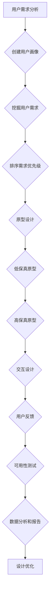

                 

### 文章标题

一人公司的用户体验设计：从概念到实践

在当今数字化时代，用户体验设计（User Experience Design，简称UXD）已经成为产品和服务成功的关键因素。无论是大型企业还是个体经营者，一个出色的用户体验都可以显著提升用户满意度、增加用户黏性，甚至直接转化为商业价值。对于一人公司来说，由于其资源有限，用户体验设计显得尤为重要。本文将深入探讨一人公司的用户体验设计，从概念到实践，助您打造出既高效又满意的用户交互体验。

### 文章关键词

- 用户体验设计
- 一人公司
- 产品开发
- 用户需求分析
- 原型设计
- 可用性测试
- 数字化转型

### 文章摘要

本文将围绕一人公司的用户体验设计展开，首先介绍用户体验设计的基本概念及其在当今数字化时代的重要性。随后，我们将探讨如何通过用户需求分析、原型设计和可用性测试来优化用户体验。此外，还将分享一些实用的工具和资源，帮助读者在实践中更好地实施用户体验设计。最后，本文将对一人公司用户体验设计的未来发展趋势与挑战进行总结，并提供一些常见问题与解答。

## 1. 背景介绍

### 一人公司的定义和特点

一人公司，顾名思义，是指由一个人运营和管理的企业。它可能是由于创业者资源有限、市场定位精准或者个人兴趣驱动而成立的。一人公司的特点主要包括：

1. **资源有限**：由于只有一个人负责，一人公司的资源相对有限，包括资金、人力和时间等。
2. **灵活性高**：一人公司决策快速，可以灵活调整策略和方向，更好地响应市场变化。
3. **个性化强**：由于只有一个人参与，一人公司的产品或服务往往具有高度个性化的特点。
4. **风险与收益并存**：一人公司由于规模较小，抗风险能力相对较弱，但同时也具有较高的收益潜力。

### 用户体验设计的基本概念

用户体验设计，简而言之，就是设计产品或服务时，以用户为中心，致力于提升用户在使用过程中的愉悦感和满意度。用户体验设计包括以下几个方面：

1. **可用性**：用户能否容易地使用产品或服务，完成他们想要的任务。
2. **易用性**：用户在完成任务时是否感觉轻松、舒适。
3. **美观性**：产品的视觉设计是否符合用户的审美标准。
4. **可访问性**：产品或服务是否能够满足不同用户的特殊需求，如视力障碍者、听力障碍者等。
5. **情感体验**：用户在使用产品或服务时是否产生愉悦、信任等积极情感。

在数字化时代，用户体验设计的重要性不言而喻。随着互联网和移动设备的普及，用户对于产品或服务的期望值不断提高。一个出色的用户体验不仅可以吸引用户，提升用户黏性，还可以转化为商业价值，从而为企业带来更高的利润。

### 一人公司为何需要重视用户体验设计

对于一人公司来说，用户体验设计尤为重要。原因有以下几点：

1. **资源有限**：由于资源有限，一人公司无法像大型企业那样进行大规模的广告宣传和品牌推广。因此，优秀的产品质量和高水平的用户体验设计成为了吸引和留住用户的重要手段。
2. **个性化服务**：一人公司的产品或服务往往具有高度个性化的特点，这种个性化需要通过用户体验设计来体现，从而满足不同用户的需求。
3. **快速响应**：一人公司由于决策快速，可以更快地响应用户反馈和市场变化，从而优化用户体验。
4. **品牌建设**：良好的用户体验设计有助于建立品牌形象，提升用户对品牌的认知和忠诚度。

综上所述，用户体验设计对于一人公司而言，不仅是提升产品竞争力的重要手段，也是实现可持续发展的重要保障。

## 2. 核心概念与联系

### 用户需求分析

用户需求分析是用户体验设计的起点。只有深入了解用户的需求，才能设计出真正满足用户期望的产品。以下是用户需求分析的几个核心概念：

1. **用户调研**：通过访谈、问卷调查、用户观察等方法，收集用户的相关信息。
2. **用户画像**：根据收集到的信息，构建用户画像，以便更好地理解用户的特点和需求。
3. **需求挖掘**：从用户调研中提取用户的关键需求，为后续的设计提供依据。
4. **优先级排序**：根据用户需求的紧急程度和重要性，对需求进行排序，以便在资源有限的情况下优先解决关键需求。

### 原型设计

原型设计是用户体验设计的重要环节。通过原型设计，可以快速验证和迭代产品设计，从而提高设计的准确性。以下是原型设计的几个核心概念：

1. **低保真原型**：使用简单的工具和手段（如纸和笔、低保真软件等）创建的原型，主要用于验证概念和初步设计。
2. **高保真原型**：使用高级工具（如Sketch、Figma等）创建的原型，更加接近最终产品的视觉效果和交互逻辑。
3. **交互设计**：设计用户与产品之间的交互流程和界面元素，确保用户能够轻松、高效地完成任务。
4. **用户反馈**：通过用户测试，收集对原型的反馈，以便进一步优化设计。

### 可用性测试

可用性测试是验证用户体验设计有效性的重要手段。通过可用性测试，可以发现设计中的问题和不足，从而进行优化。以下是可用性测试的几个核心概念：

1. **测试目标**：明确测试的目标，如验证用户能否顺利完成某项任务、评估用户对界面布局的满意度等。
2. **测试参与者**：选择具有代表性的用户作为测试参与者，以确保测试结果具有参考价值。
3. **测试流程**：制定详细的测试流程，包括任务设置、用户操作记录、反馈收集等。
4. **数据分析和报告**：对测试结果进行数据分析和总结，形成测试报告，为后续设计提供改进建议。

### Mermaid 流程图

以下是一个用于描述用户需求分析、原型设计和可用性测试之间关系的 Mermaid 流程图：



通过这个流程图，我们可以清晰地看到用户需求分析、原型设计和可用性测试之间的紧密联系。只有通过不断的迭代和优化，才能设计出真正满足用户需求的产品。

## 3. 核心算法原理 & 具体操作步骤

### 用户需求分析算法

用户需求分析是用户体验设计的核心环节。以下是一个简单的用户需求分析算法，帮助一人公司更好地理解用户需求。

1. **收集用户数据**：通过访谈、问卷调查、用户观察等方法收集用户数据。
2. **预处理数据**：对收集到的用户数据进行清洗和整理，去除无效数据。
3. **构建用户画像**：根据用户数据，构建用户画像，包括用户的年龄、性别、职业、行为习惯等。
4. **提取关键需求**：通过分析用户画像，提取用户的关键需求。
5. **优先级排序**：根据用户需求的紧急程度和重要性，对需求进行排序。
6. **生成需求文档**：将分析结果和排序结果整理成需求文档，为后续设计提供依据。

### 原型设计算法

原型设计是用户体验设计的关键步骤。以下是一个简单的原型设计算法，帮助一人公司快速创建原型。

1. **确定设计目标**：明确原型设计的具体目标，如验证概念、测试交互流程等。
2. **选择工具**：根据设计目标和资源情况，选择合适的原型设计工具。
3. **创建低保真原型**：使用低保真原型工具，绘制界面布局和交互流程。
4. **迭代优化**：根据用户反馈，对原型进行迭代优化，提高设计的准确性。
5. **创建高保真原型**：在低保真原型的基础上，使用高保真原型工具，完善视觉效果和交互细节。
6. **用户测试**：邀请用户进行测试，收集对原型的反馈。
7. **生成原型文档**：将原型设计结果整理成文档，为后续开发提供依据。

### 可用性测试算法

可用性测试是验证用户体验设计有效性的重要手段。以下是一个简单的可用性测试算法，帮助一人公司评估用户体验。

1. **制定测试计划**：明确测试的目标、参与者、测试流程等。
2. **设计测试任务**：根据测试目标，设计具有代表性的测试任务。
3. **招募测试参与者**：选择具有代表性的用户作为测试参与者。
4. **执行测试**：按照测试计划，引导测试参与者完成测试任务，记录用户操作和反馈。
5. **数据分析和报告**：对测试结果进行数据分析和总结，形成测试报告。
6. **优化设计**：根据测试报告，对设计进行优化，提高用户体验。

### 具体操作步骤示例

以下是一个具体的用户需求分析、原型设计和可用性测试的操作步骤示例：

1. **用户需求分析**：
   - 收集用户数据：通过问卷调查收集用户对某款移动应用的满意度、使用频率等数据。
   - 预处理数据：去除无效问卷，整理有效问卷数据。
   - 构建用户画像：根据用户数据，构建用户画像，包括年龄、性别、职业等。
   - 提取关键需求：分析用户画像，提取用户的关键需求，如界面简洁、功能全面等。
   - 优先级排序：根据用户需求的重要性和紧急程度，对需求进行排序。

2. **原型设计**：
   - 确定设计目标：验证移动应用的概念和交互流程。
   - 选择工具：使用Sketch创建原型。
   - 创建低保真原型：绘制界面布局和交互流程。
   - 迭代优化：根据用户反馈，对原型进行迭代优化。
   - 创建高保真原型：完善视觉效果和交互细节。
   - 用户测试：邀请用户进行测试，收集对原型的反馈。

3. **可用性测试**：
   - 制定测试计划：明确测试目标、参与者、测试流程等。
   - 设计测试任务：设计具有代表性的测试任务，如用户能否顺利完成任务、对界面布局的满意度等。
   - 招募测试参与者：选择具有代表性的用户作为测试参与者。
   - 执行测试：引导测试参与者完成测试任务，记录用户操作和反馈。
   - 数据分析和报告：对测试结果进行数据分析和总结，形成测试报告。
   - 优化设计：根据测试报告，对设计进行优化，提高用户体验。

通过上述步骤，一人公司可以系统地开展用户体验设计工作，从而提高产品的竞争力。

## 4. 数学模型和公式 & 详细讲解 & 举例说明

### 用户满意度评分模型

用户满意度是评估用户体验的重要指标。以下是一个简单的用户满意度评分模型：

$$
S = \frac{1}{n}\sum_{i=1}^{n} s_i
$$

其中，$S$ 表示用户满意度评分，$n$ 表示用户数量，$s_i$ 表示第 $i$ 个用户的满意度评分。

### 用户留存率计算公式

用户留存率是衡量用户对产品或服务的忠诚度的重要指标。以下是一个简单的用户留存率计算公式：

$$
R = \frac{N_t - N_0}{N_0}
$$

其中，$R$ 表示用户留存率，$N_t$ 表示时间 $t$ 时的用户数量，$N_0$ 表示初始用户数量。

### 举例说明

假设有一款移动应用，初始用户数量为 100 人。在一个月后，用户数量增加至 120 人。使用上述公式，我们可以计算出用户留存率：

$$
R = \frac{120 - 100}{100} = 0.2
$$

这意味着这款移动应用在一个月后的用户留存率为 20%。

### 用户体验质量评估模型

用户体验质量（User Experience Quality，简称UEQ）是衡量用户体验的另一个重要指标。以下是一个简单的用户体验质量评估模型：

$$
UEQ = \frac{1}{n}\sum_{i=1}^{n} (s_i - m)
$$

其中，$UEQ$ 表示用户体验质量评分，$n$ 表示用户数量，$s_i$ 表示第 $i$ 个用户的满意度评分，$m$ 表示满意度评分的均值。

### 举例说明

假设有 10 名用户对某款移动应用的满意度评分分别为 4、5、4、5、4、5、4、5、4、5。使用上述公式，我们可以计算出用户体验质量评分：

首先计算满意度评分的均值：

$$
m = \frac{1}{10}\sum_{i=1}^{10} s_i = \frac{4+5+4+5+4+5+4+5+4+5}{10} = 4.5
$$

然后计算用户体验质量评分：

$$
UEQ = \frac{1}{10}\sum_{i=1}^{10} (s_i - m) = \frac{(4-4.5)+(5-4.5)+(4-4.5)+(5-4.5)+(4-4.5)+(5-4.5)+(4-4.5)+(5-4.5)+(4-4.5)+(5-4.5)}{10} = 0.2
$$

这意味着这款移动应用的用户体验质量评分为 0.2。

通过上述数学模型和公式，我们可以定量地评估用户体验，从而为产品设计提供依据。

## 5. 项目实战：代码实际案例和详细解释说明

### 5.1 开发环境搭建

在开始项目实战之前，我们需要搭建一个合适的开发环境。以下是搭建开发环境的步骤：

1. **安装操作系统**：我们选择安装 Ubuntu 20.04 LTS 操作系统。
2. **安装开发工具**：安装 Python 3、Visual Studio Code、Git 等开发工具。
3. **安装数据库**：安装 MySQL 或 PostgreSQL 数据库。
4. **安装前端框架**：安装 React 或 Vue.js 等前端框架。

### 5.2 源代码详细实现和代码解读

#### 后端代码实现

以下是使用 Python Flask 框架实现的后端代码示例：

```python
from flask import Flask, request, jsonify
from flask_cors import CORS

app = Flask(__name__)
CORS(app)

@app.route('/api/users', methods=['POST'])
def create_user():
    user_data = request.json
    # 处理用户数据，如保存到数据库等
    # ...
    return jsonify({"status": "success", "message": "User created successfully."})

@app.route('/api/users/<int:user_id>', methods=['GET'])
def get_user(user_id):
    # 从数据库获取用户数据
    # ...
    return jsonify({"status": "success", "message": "User retrieved successfully.", "user": user_data})

if __name__ == '__main__':
    app.run(debug=True)
```

在这个示例中，我们使用了 Flask 框架创建了一个简单的用户管理 API。首先，我们从请求中获取用户数据（如 POST 请求中的 JSON 数据），然后根据用户 ID 从数据库中获取用户信息（如 GET 请求中的参数）。最后，我们将处理结果以 JSON 格式返回给客户端。

#### 前端代码实现

以下是使用 React 实现的前端代码示例：

```jsx
import React, { useState } from 'react';
import axios from 'axios';

const App = () => {
  const [user, setUser] = useState({});

  const handleCreateUser = async () => {
    const user_data = { name: 'John Doe', email: 'john.doe@example.com' };
    const response = await axios.post('/api/users', user_data);
    setUser(response.data);
  };

  const handleGetUser = async (user_id) => {
    const response = await axios.get(`/api/users/${user_id}`);
    setUser(response.data);
  };

  return (
    <div>
      <button onClick={handleCreateUser}>Create User</button>
      <button onClick={() => handleGetUser(1)}>Get User</button>
      <pre>{JSON.stringify(user, null, 2)}</pre>
    </div>
  );
};

export default App;
```

在这个示例中，我们使用了 React 和 axios 实现了一个简单的用户管理界面。首先，我们定义了一个用户状态（`user`），并通过 `handleCreateUser` 和 `handleGetUser` 两个函数与后端 API 进行交互。最后，我们将用户数据以 JSON 格式展示在界面上。

### 5.3 代码解读与分析

#### 后端代码解读

在 Flask 后端代码中，我们首先导入了必要的模块，并创建了 Flask 应用对象。通过 `CORS(app)`，我们允许跨域请求。

- **`create_user` 函数**：该函数用于处理 POST 请求，从请求中获取用户数据（`request.json`），并将其保存到数据库。这里我们假设有一个数据库接口用于处理用户数据。
- **`get_user` 函数**：该函数用于处理 GET 请求，根据用户 ID 从数据库中获取用户数据，并将其以 JSON 格式返回。

#### 前端代码解读

在 React 前端代码中，我们首先导入了必要的模块，并定义了 `App` 组件。

- **`user` 状态**：我们使用 `useState` 函数定义了一个用户状态，用于存储从后端获取的用户数据。
- **`handleCreateUser` 函数**：该函数使用 `axios` 发送 POST 请求创建新用户，并将返回的数据更新到用户状态。
- **`handleGetUser` 函数**：该函数使用 `axios` 发送 GET 请求获取指定用户数据，并将返回的数据更新到用户状态。
- **按钮和展示**：我们通过两个按钮分别调用 `handleCreateUser` 和 `handleGetUser` 函数，并将用户数据以 JSON 格式展示在页面上。

通过这个项目实战，我们展示了如何使用 Python Flask 和 React 搭建一个简单的用户管理 API 和前端界面。这个案例可以帮助读者理解一人公司如何通过开发实际项目来实践用户体验设计。

## 6. 实际应用场景

### 一人公司的产品开发流程

对于一人公司来说，产品开发流程需要灵活、高效，以适应快速变化的市场需求。以下是一个典型的一人公司产品开发流程：

1. **市场调研**：通过在线调查、访谈等方式了解市场需求和用户痛点。
2. **需求分析**：根据市场调研结果，分析用户需求，确定产品功能模块。
3. **原型设计**：使用低保真原型工具（如 Sketch、Figma）创建初步原型，并进行迭代优化。
4. **开发与测试**：使用 Python、React 等技术进行开发，并进行单元测试、集成测试等。
5. **发布与维护**：将产品发布到应用商店，持续收集用户反馈，进行产品优化。

### 成功案例分析

#### 案例一：独立开发者开发的移动应用

某独立开发者开发了一款名为“智能家居助手”的移动应用。该应用通过整合智能家居设备的数据，提供实时监控、远程控制等功能。以下是该案例的关键成功因素：

1. **用户需求分析**：通过在线调查和用户访谈，了解用户对智能家居设备的需求和痛点。
2. **原型设计**：使用 Figma 创建低保真原型，并进行用户测试，收集反馈。
3. **迭代优化**：根据用户反馈，不断优化原型，提高用户体验。
4. **技术选型**：选择 React Native 框架，实现跨平台开发，降低开发成本。
5. **持续更新**：定期发布新版本，增加新功能，持续满足用户需求。

#### 案例二：自由职业者开发的在线教育平台

某自由职业者开发了一款名为“智慧教育”的在线教育平台。该平台提供在线课程、作业提交、互动答疑等功能，以下是该案例的关键成功因素：

1. **市场调研**：通过在线调查和用户访谈，了解教育行业的发展趋势和用户需求。
2. **原型设计**：使用 Sketch 创建低保真原型，并邀请教育工作者进行测试。
3. **迭代优化**：根据用户和教育工作者的反馈，不断优化原型，提高教学效果。
4. **技术选型**：选择 Python 和 Django 框架，实现快速开发。
5. **合作伙伴**：与知名教育机构和讲师合作，提高平台知名度。

### 挑战与应对策略

#### 挑战一：资源有限

一人公司面临的主要挑战之一是资源有限。为应对这一挑战，可以采取以下策略：

1. **合理规划**：在产品开发初期，制定详细的项目计划，明确每个阶段的目标和任务。
2. **外包部分工作**：对于某些技术模块，可以外包给专业团队，降低开发成本。
3. **利用开源工具和资源**：选择开源的框架和工具，减少软件采购和开发成本。

#### 挑战二：用户需求变化

用户需求变化快是一人公司面临的另一个挑战。为应对这一挑战，可以采取以下策略：

1. **快速响应**：建立快速反馈机制，及时了解用户需求和反馈。
2. **敏捷开发**：采用敏捷开发方法，快速迭代产品，快速适应市场变化。
3. **用户参与**：鼓励用户参与产品开发和测试，收集真实用户的反馈，提高产品的满意度。

通过上述实际应用场景和成功案例分析，我们可以看到，一人公司在产品开发中可以通过灵活的市场调研、迭代优化和合理的技术选型，实现高效的产品开发。同时，针对资源有限和用户需求变化等挑战，采取相应的应对策略，可以有效提高产品竞争力。

## 7. 工具和资源推荐

### 7.1 学习资源推荐

- **书籍**：
  - 《用户体验要素》（The Design of Everyday Things） - Don Norman
  - 《敏捷软件开发：原理、实践与模式》（Agile Software Development: Principles, Patterns, and Practices） - Robert C. Martin
  - 《设计思维》（Design Thinking） - Tim Brown

- **在线课程**：
  - Coursera 上的“用户体验设计基础”课程
  - Udemy 上的“移动应用UI/UX设计实战”
  - LinkedIn Learning 上的“产品设计与用户体验”

- **博客和网站**：
  - Nielsen Norman Group（NN/g）- 用户体验研究领域的权威网站
  - UX Planet - 提供大量用户体验设计相关文章
  - Smashing Magazine - 关注前端设计与开发的综合网站

### 7.2 开发工具框架推荐

- **前端框架**：
  - React
  - Vue.js
  - Angular

- **原型设计工具**：
  - Figma
  - Sketch
  - Adobe XD

- **后端框架**：
  - Flask
  - Django
  - Express.js

- **数据库**：
  - MySQL
  - PostgreSQL
  - MongoDB

### 7.3 相关论文著作推荐

- **论文**：
  - “User Experience Design Principles for Mobile Applications”
  - “A Study on the Impact of User Experience Design on Product Success”
  - “Designing for Usability: Patterns for Effective Interaction Design”

- **著作**：
  - 《用户体验设计：原则与实践》（User Experience Design: A Practical Introduction）
  - 《用户体验设计手册》（Handbook of User Experience Design）
  - 《敏捷UI设计：用户体验与敏捷开发的结合》（Agile UI Design: Crafting Digital Products for a Better User Experience）

通过这些工具和资源的推荐，一人公司可以更好地进行用户体验设计，从而提高产品的竞争力。

## 8. 总结：未来发展趋势与挑战

### 未来发展趋势

1. **人工智能与用户体验设计结合**：随着人工智能技术的发展，用户体验设计将更加智能化和个性化。通过数据分析、机器学习和自然语言处理等技术，设计工具可以更精准地预测用户需求，优化设计流程。
2. **全渠道用户体验**：随着用户使用设备多样化，全渠道用户体验设计将成为趋势。一人公司需要关注用户在不同设备（如手机、平板、电脑等）上的使用体验，确保一致性。
3. **可访问性设计**：可访问性设计将越来越受到重视。一人公司需要确保产品或服务能够满足不同用户群体的需求，包括残疾人、老年人等，以提升产品的普及度和市场竞争力。
4. **敏捷迭代与持续改进**：敏捷开发方法将得到更广泛的应用。一人公司需要不断迭代产品，快速响应用户反馈和市场变化，持续改进用户体验。

### 未来挑战

1. **资源限制**：一人公司在资源有限的情况下，如何在有限的预算内实现高质量的用户体验设计是一个重要挑战。通过合理规划、外包和开源工具的应用，可以在一定程度上缓解这一问题。
2. **用户需求变化**：用户需求变化快，一人公司需要建立快速响应机制，及时调整产品设计和开发方向。采用敏捷开发方法、用户参与设计和持续市场调研是应对这一挑战的有效策略。
3. **竞争压力**：在竞争激烈的市场环境中，一人公司需要不断提升产品竞争力，通过创新和差异化设计吸引和留住用户。
4. **技术更新**：随着技术的快速更新，一人公司需要不断学习新知识、掌握新技术，以保持产品的先进性和市场竞争力。

综上所述，未来一人公司的用户体验设计将面临新的机遇和挑战。通过紧跟发展趋势、应对挑战，一人公司可以更好地实现用户体验设计的目标，提高产品的市场竞争力。

## 9. 附录：常见问题与解答

### Q1：用户体验设计与用户界面设计有何区别？

用户体验设计（UXD）和用户界面设计（UI Design）是两个紧密相关但有所区别的概念。用户体验设计关注用户在使用产品或服务过程中的整体感受，包括可用性、易用性和情感体验等。用户界面设计则侧重于产品的视觉和交互设计，如何通过界面元素和布局提升用户的使用体验。简单来说，用户体验设计是一个更广泛的范畴，用户界面设计是其重要组成部分。

### Q2：如何进行有效的用户需求分析？

进行有效的用户需求分析需要以下步骤：

1. **明确目标**：确定需求分析的目标和范围。
2. **收集数据**：通过访谈、问卷调查、用户观察等方法收集用户数据。
3. **预处理数据**：清洗和整理收集到的用户数据。
4. **用户画像**：根据用户数据构建用户画像。
5. **需求挖掘**：分析用户画像，提取关键需求。
6. **优先级排序**：根据需求的重要性和紧急程度进行排序。

### Q3：原型设计有哪些常见工具和方法？

常见的原型设计工具有：

- **低保真原型工具**：如 Sketch、Figma、Adobe XD。
- **高保真原型工具**：如 Figma、Axure RP、Adobe XD。
- **手工原型**：使用纸和笔或马克笔等。

常见的方法包括：

1. **线框图**：用简单的线条和框图表示界面布局和交互流程。
2. **交互原型**：实现更详细的交互效果，如按钮点击效果、滑动效果等。
3. **点击式原型**：使用原型设计工具创建的可交互原型，用户可以直接在原型上操作。

### Q4：可用性测试有哪些常见方法？

常见的可用性测试方法包括：

1. **任务测试**：让用户完成特定的任务，观察用户如何操作，记录用户的错误和困惑。
2. **问题调查**：在任务完成后，向用户询问他们对产品或服务的看法和建议。
3. **日志分析**：分析用户在使用产品时的操作记录，了解用户的实际使用情况。
4. **远程测试**：通过网络工具进行远程测试，节省时间和成本。

### Q5：如何确保用户体验设计的成功？

确保用户体验设计成功的策略包括：

1. **用户中心设计**：始终以用户为中心，关注用户需求和体验。
2. **迭代优化**：采用敏捷开发方法，不断迭代和优化设计。
3. **用户参与**：邀请用户参与设计过程，收集真实用户的反馈。
4. **数据分析**：通过数据分析，了解用户行为和需求，指导设计决策。
5. **持续改进**：定期评估用户体验，持续改进设计。

通过上述问题和解答，读者可以更好地理解用户体验设计的概念、方法和实践，从而在实际工作中取得更好的效果。

## 10. 扩展阅读 & 参考资料

### 扩展阅读

1. **《人人都是产品经理》**：本书详细介绍了产品经理的工作职责和产品开发流程，对用户体验设计有很好的借鉴意义。
2. **《UI设计修炼之道》**：本书深入讲解了用户界面设计的核心概念和实用技巧，有助于提升设计能力。
3. **《敏捷开发实践指南》**：本书介绍了敏捷开发方法的应用和实践经验，对一人公司的用户体验设计有很好的指导作用。

### 参考资料

1. ** Nielsen Norman Group**：权威的用户体验研究机构，提供大量关于用户体验设计的论文和报告。
2. ** UX Planet**：一个专注于用户体验设计的博客，提供丰富的设计资源和行业动态。
3. ** Interaction Design Foundation**：一个非营利性组织，提供用户体验设计相关的在线课程和学习资源。
4. **《设计思维》**：Tim Brown 的著作，详细介绍了设计思维的方法和应用，对用户体验设计有重要启示。
5. **《用户体验要素》**：Don Norman 的经典著作，系统阐述了用户体验设计的基本原则和实践方法。

通过阅读这些扩展资料和参考书籍，读者可以进一步深入了解用户体验设计的理论和实践，提升自身的专业能力。

