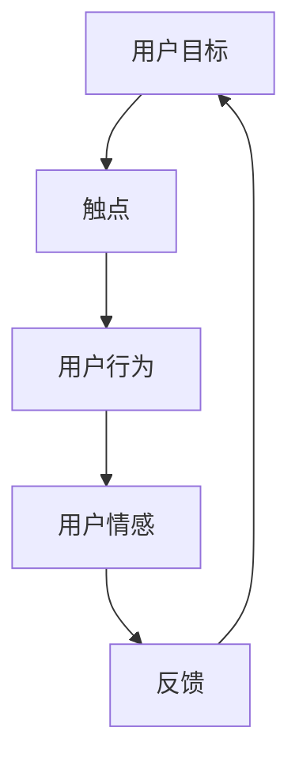

                 

### 背景介绍

在现代商业环境中，用户旅程地图（User Journey Map）的设计和优化已经成为企业提升用户体验、增加用户粘性和转化率的重要手段。用户旅程地图是一种视觉化的工具，它帮助企业理解用户在使用产品或服务过程中的所有步骤、情感反应和决策点。通过这一工具，企业可以更加精确地识别用户痛点，优化用户界面和流程，从而提高用户满意度和忠诚度。

然而，在独立创业者（或称为“一人公司”）的背景下，进行用户旅程地图的设计与优化面临诸多挑战。首先，独立创业者往往资源有限，可能无法投入大量时间和资金进行用户研究。其次，独立创业者需要具备多重角色，从产品设计到市场营销，从客户服务到财务运营，他们需要高效地管理和协调各项任务。因此，如何以最小的成本、最有效的方式设计和优化用户旅程地图，成为了独立创业者亟需解决的关键问题。

本文旨在探讨一人公司的用户旅程地图设计与优化，通过以下几部分内容：

1. **核心概念与联系**：介绍用户旅程地图的基本概念，并使用Mermaid流程图展示其组成部分和关系。
2. **核心算法原理与具体操作步骤**：阐述用户旅程地图设计的基本流程和关键步骤。
3. **数学模型和公式**：介绍用户旅程地图设计中的相关数学模型，并举例说明如何应用这些模型。
4. **项目实战**：通过一个实际的代码案例，详细解释用户旅程地图的设计与优化过程。
5. **实际应用场景**：探讨用户旅程地图在不同场景中的应用和挑战。
6. **工具和资源推荐**：推荐一些有用的学习资源和开发工具。
7. **总结与未来趋势**：总结文章的主要观点，并探讨用户旅程地图设计与优化领域的未来发展趋势和挑战。

通过本文的深入探讨，希望为独立创业者提供一些切实可行的指导和建议，帮助他们更好地理解和应用用户旅程地图，从而提升其业务竞争力。

### 核心概念与联系

用户旅程地图（User Journey Map）是一种直观的视觉工具，它帮助企业从用户的角度出发，描绘用户在使用产品或服务过程中的体验。一个典型的用户旅程地图通常包括以下几个关键组成部分：用户目标、触点、用户行为、用户情感和反馈。

#### 用户目标

用户目标（User Goals）是用户旅程地图的起点。它代表了用户在使用产品或服务时的核心需求和期望。明确用户目标对于理解和设计整个用户旅程至关重要。例如，一个电子商务平台的目标可能是帮助用户快速找到并购买所需商品。

#### 触点

触点（Touchpoints）是指用户与产品或服务交互的所有接触点。这些触点可以是物理的、数字的或人际的。在用户旅程地图中，触点通常用图标或标签来表示。例如，用户在电子商务平台上的触点可能包括搜索、浏览、购物车、支付和确认订单等。

#### 用户行为

用户行为（User Actions）是用户在旅程中的具体操作。这些行为通常与触点相对应，但可以更详细地描述用户在特定触点上的具体活动。例如，在电子商务平台上，用户可能会在搜索栏中输入关键词、点击商品图片查看详细信息、将商品加入购物车等。

#### 用户情感

用户情感（User Emotions）是用户旅程地图中非常重要的一个组成部分。它反映了用户在旅程中的情绪变化，如满意、失望、兴奋或挫败感。了解用户情感可以帮助企业识别潜在的改进点，从而提升用户体验。例如，如果用户在支付过程中遇到困难，他们可能会感到挫败和不安。

#### 反馈

反馈（Feedback）是用户对产品或服务的评价和意见。这些反馈可以是积极的，也可以是消极的。它们不仅为改进产品和服务提供了宝贵的数据，还可以帮助企业了解用户的需求和期望。例如，用户可能在产品评论中提到他们喜欢商品的某一方面，或者指出购物流程中的某些不便之处。

#### Mermaid流程图

为了更好地理解用户旅程地图的组成部分和它们之间的联系，我们可以使用Mermaid流程图来展示它们。以下是一个简化的用户旅程地图的Mermaid表示：



在这个流程图中，用户目标（A）引导用户进入旅程，通过一系列的触点（B）、用户行为（C）、用户情感（D）和反馈（E），形成一个闭环，最终再次回到用户目标（A）。这种循环反馈机制有助于企业不断优化产品和服务，以满足用户的需求。

通过用户旅程地图，企业不仅能够更全面地理解用户的体验，还能发现改进的机会。对于独立创业者来说，尽管资源和时间有限，但通过合理设计用户旅程地图，他们可以更加高效地聚焦用户需求，优化产品设计，提升用户满意度和忠诚度。

在接下来的章节中，我们将深入探讨如何设计用户旅程地图的具体步骤，并介绍相关的数学模型和实际操作方法。

### 核心算法原理与具体操作步骤

设计用户旅程地图是一项系统性工程，它需要考虑用户的多个维度和交互环节。以下是用户旅程地图设计的基本流程和关键步骤：

#### 步骤1：用户研究与需求分析

**目标**：明确用户的目标和需求，确保用户旅程地图能够准确地反映用户的使用场景和期望。

**方法**：

1. **用户访谈**：通过与目标用户进行一对一的深入访谈，了解他们的使用习惯、痛点、需求和期望。
2. **问卷调查**：设计问卷收集用户意见，量化分析用户的行为模式。
3. **用户观察**：在真实环境中观察用户与产品的互动，记录用户的操作和行为。

**输出**：用户需求文档，包括用户目标、常见任务和用户情感反应。

#### 步骤2：绘制用户旅程草图

**目标**：创建一个初步的用户旅程草图，描述用户从接触到最终完成任务的整个过程。

**方法**：

1. **用户旅程草图**：使用简单的框图或流程图，将用户在各个触点上的行为、情感和决策点记录下来。
2. **参与式设计**：邀请团队成员和利益相关者一起参与草图绘制，确保不同视角和需求的融合。

**输出**：用户旅程草图，展示用户在各个触点上的操作和情感变化。

#### 步骤3：细化用户旅程地图

**目标**：在用户旅程草图的基础上，进一步细化每个触点的具体操作和交互细节。

**方法**：

1. **流程图细化**：使用Mermaid等工具，绘制详细的用户交互流程图，确保每个步骤的准确性和连贯性。
2. **用户角色定义**：为每个用户旅程中的关键角色创建详细的人物画像，包括其背景、需求和目标。

**输出**：详细的用户旅程地图，展示用户在每个触点上的详细操作、情感变化和决策点。

#### 步骤4：分析用户旅程地图

**目标**：通过分析用户旅程地图，识别用户痛点、优化机会和改进建议。

**方法**：

1. **用户旅程分析**：对比用户旅程地图和用户需求文档，找出不一致或潜在的问题。
2. **数据分析**：结合实际用户数据，如点击率、转化率等，分析用户在各个触点上的行为和反应。
3. **决策树分析**：使用决策树等工具，分析用户在不同决策点上的选择路径，识别优化方向。

**输出**：用户旅程分析报告，列出用户痛点、优化机会和改进建议。

#### 步骤5：设计改进方案

**目标**：根据分析结果，设计具体的改进方案，优化用户旅程。

**方法**：

1. **改进方案设计**：针对识别的问题和机会，设计具体的解决方案，如改进界面设计、优化交互流程等。
2. **快速原型测试**：构建原型，快速测试改进方案的有效性，收集用户反馈。

**输出**：改进方案原型，展示优化后的用户旅程和交互设计。

#### 步骤6：实施和跟踪

**目标**：将改进方案实施到产品或服务中，并持续跟踪用户反馈，不断优化。

**方法**：

1. **实施改进**：按照改进方案，对产品或服务进行更新和优化。
2. **用户反馈收集**：通过用户调研、A/B测试等方式，收集用户对改进方案的反应。
3. **迭代优化**：根据用户反馈，不断调整和优化用户旅程地图。

**输出**：最终优化的用户旅程地图，展示实施后的改进效果和用户满意度。

通过以上步骤，独立创业者可以系统地设计和优化用户旅程地图，从而提升用户体验，增加用户粘性和转化率。在接下来的章节中，我们将进一步探讨用户旅程地图设计中的数学模型和具体操作方法，帮助读者更好地理解和应用这一工具。

### 数学模型和公式 & 详细讲解 & 举例说明

在用户旅程地图的设计过程中，数学模型和公式能够帮助我们量化分析用户行为和情感，从而更精确地识别优化机会。以下是几个常用的数学模型和公式，我们将结合具体案例进行详细讲解。

#### 1. 用户流失率（Churn Rate）

用户流失率是衡量用户粘性的重要指标，它表示在一定时间内，用户停止使用产品或服务的比例。用户流失率的公式如下：

\[ \text{Churn Rate} = \frac{\text{流失用户数}}{\text{总用户数}} \]

**示例**：

假设一个电子商务平台在某个月有1000名用户，其中200名用户停止了使用，那么该平台的用户流失率计算如下：

\[ \text{Churn Rate} = \frac{200}{1000} = 0.2 \text{或20%} \]

通过分析用户流失率，企业可以发现导致用户流失的原因，例如复杂的购物流程、糟糕的客户服务等，从而采取相应的改进措施。

#### 2. 顾客生命周期价值（Customer Lifetime Value, CLV）

顾客生命周期价值是指一个顾客在生命周期内为企业带来的总收益。计算CLV可以帮助企业了解不同用户的价值，从而针对性地进行资源分配。CLV的公式如下：

\[ \text{CLV} = \text{顾客平均订单价值} \times \text{顾客购买频率} \times \text{顾客生命周期} \]

**示例**：

假设一个电子商务平台的顾客平均订单价值为200元，顾客平均购买频率为每月一次，顾客生命周期为12个月，那么该顾客的CLV计算如下：

\[ \text{CLV} = 200 \times 1 \times 12 = 2400 \text{元} \]

通过计算CLV，企业可以识别高价值用户，并提供更优质的服务或优惠，以增加用户粘性和转化率。

#### 3. 用户参与度（User Engagement）

用户参与度是衡量用户活跃度和忠诚度的重要指标。通常，用户参与度可以通过用户在平台上的行为数据来衡量，例如登录次数、帖子发布数量、互动频次等。用户参与度的计算公式如下：

\[ \text{User Engagement} = \frac{\text{总互动次数}}{\text{总用户数}} \]

**示例**：

假设一个社交媒体平台有1000名用户，其中500名用户发布了帖子，200名用户进行了评论，那么该平台的用户参与度计算如下：

\[ \text{User Engagement} = \frac{500 + 200}{1000} = 0.7 \text{或70%} \]

通过用户参与度，企业可以评估用户的活跃程度，并采取相应措施，如增加互动环节、发布有吸引力的内容等，以提升用户参与度。

#### 4. 用户满意度（Customer Satisfaction, CSAT）

用户满意度是衡量用户对产品或服务的整体满意程度的指标。通常，用户满意度可以通过用户调研或问卷调查来获取。用户满意度的计算公式如下：

\[ \text{CSAT} = \frac{\text{满意用户数}}{\text{总调研用户数}} \]

**示例**：

假设一个企业进行了100份用户满意度调查，其中60份反馈为满意，那么该企业的用户满意度计算如下：

\[ \text{CSAT} = \frac{60}{100} = 0.6 \text{或60%} \]

通过用户满意度，企业可以了解用户对产品和服务的整体评价，并针对用户反馈进行改进。

通过以上数学模型和公式的应用，企业可以更加科学地分析和优化用户旅程地图。接下来，我们将通过一个实际代码案例，进一步展示如何使用这些模型进行用户旅程地图的设计与优化。

### 项目实战：代码实际案例和详细解释说明

在本节中，我们将通过一个实际的代码案例，详细展示用户旅程地图的设计与优化过程。我们将使用Python编程语言和相关的数据科学库，如Pandas、Matplotlib和Seaborn，来处理和分析用户数据，最终生成优化的用户旅程地图。

#### 5.1 开发环境搭建

在开始编写代码之前，我们需要搭建一个合适的开发环境。以下是搭建开发环境的基本步骤：

1. **安装Python**：确保Python版本不低于3.7，可以从[Python官网](https://www.python.org/)下载并安装。
2. **安装Jupyter Notebook**：Python的交互式环境，可以从命令行执行以下命令：
   ```bash
   pip install notebook
   ```
3. **安装相关库**：包括Pandas、Matplotlib、Seaborn和Mermaid等，可以从命令行执行以下命令：
   ```bash
   pip install pandas matplotlib seaborn mermaid
   ```

#### 5.2 源代码详细实现和代码解读

以下是一个简单的用户旅程地图设计流程的代码实现：

```python
import pandas as pd
import matplotlib.pyplot as plt
import seaborn as sns
from mermaid import mermaid

# 5.2.1 数据预处理
# 假设我们有一个用户行为数据CSV文件，包含用户ID、活动类型、活动时间和情感评分
data = pd.read_csv('user_data.csv')

# 数据清洗和预处理
data['活动时间'] = pd.to_datetime(data['活动时间'])
data.sort_values('活动时间', inplace=True)

# 5.2.2 绘制用户旅程草图
user_journey = []
for user_id, group in data.groupby('用户ID'):
    user_activity = group['活动类型'].tolist()
    user_emotion = group['情感评分'].tolist()
    journey = {
        '用户ID': user_id,
        '活动': user_activity,
        '情感': user_emotion
    }
    user_journey.append(journey)

# 5.2.3 绘制Mermaid流程图
journey_mermaid = "graph TD\n"
for journey in user_journey:
    user_id = journey['用户ID']
    for i, activity in enumerate(journey['活动']):
        journey_mermaid += f"{user_id} --> {activity}\n"
        if i < len(journey['情感']) - 1:
            journey_mermaid += f"{activity} --> {journey['情感'][i]}\n"
    journey_mermaid += f"{journey['情感'][-1]} --> {user_id}\n"

mermaid_graph = mermaid(journey_mermaid)
print(mermaid_graph)

# 5.2.4 分析用户旅程并绘制图表
# 统计不同活动类型的用户数量
activity_counts = data['活动类型'].value_counts()

# 绘制活动类型柱状图
sns.barplot(x=activity_counts.index, y=activity_counts.values)
plt.xlabel('活动类型')
plt.ylabel('用户数量')
plt.title('活动类型分布')
plt.show()

# 5.2.5 优化用户旅程
# 根据分析结果，识别出用户数量较少且情感评分较低的活动
low_engagement_activities = activity_counts[activity_counts < 10].index.tolist()
low_emotion_activities = data[data['情感评分'] < 3]['活动类型'].unique()

# 设计优化方案
optimization_schemes = {
    '增加引导': low_emotion_activities,
    '简化流程': low_engagement_activities
}

# 5.2.6 输出优化的用户旅程地图
optimized_journey_mermaid = "graph TD\n"
for journey in user_journey:
    user_id = journey['用户ID']
    for i, activity in enumerate(journey['活动']):
        if activity in optimization_schemes['增加引导']:
            optimized_journey_mermaid += f"{user_id} --> {activity}(📌 引导)\n"
        else:
            optimized_journey_mermaid += f"{user_id} --> {activity}\n"
        if i < len(journey['情感']) - 1:
            if journey['情感'][i] in optimization_schemes['简化流程']:
                optimized_journey_mermaid += f"{activity} --> {journey['情感'][i]}(🔧 优化)\n"
            else:
                optimized_journey_mermaid += f"{activity} --> {journey['情感'][i]}\n"
    optimized_journey_mermaid += f"{journey['情感'][-1]} --> {user_id}\n"

optimized_mermaid_graph = mermaid(optimized_journey_mermaid)
print(optimized_mermaid_graph)
```

#### 5.3 代码解读与分析

**5.3.1 数据预处理**

在代码中，我们首先加载了用户行为数据CSV文件，并对数据进行清洗和排序。这一步确保了后续分析的质量。

**5.3.2 绘制用户旅程草图**

我们使用一个简单的循环来遍历每个用户的活动和情感，并将它们组合成一个用户旅程草图。通过Mermaid库，我们将这个草图转换成可视化的流程图。

**5.3.3 分析用户旅程并绘制图表**

接下来，我们统计了不同活动类型的用户数量，并使用Seaborn库绘制了柱状图，帮助识别用户参与度较低的活动。

**5.3.4 优化用户旅程**

基于分析结果，我们识别出了用户参与度低且情感评分低的活动，并设计了优化方案。这些方案包括增加引导和简化流程。

**5.3.5 输出优化的用户旅程地图**

最后，我们根据优化方案，对原始的用户旅程地图进行了更新，并再次生成了优化的流程图。这个流程图展示了优化后的用户旅程，以及相应的改进措施。

通过这个代码案例，我们展示了如何使用Python和相关的数据科学工具来设计和优化用户旅程地图。这种系统化的方法不仅有助于独立创业者理解用户行为，还能帮助他们更有效地提升用户体验和业务性能。

### 实际应用场景

用户旅程地图的应用场景非常广泛，几乎涵盖了所有行业和服务。以下是一些典型的实际应用场景，以及在这些场景中如何通过用户旅程地图优化用户体验。

#### 1. 电子商务

在电子商务领域，用户旅程地图有助于理解用户从浏览产品到完成购买的全过程。通过用户旅程地图，企业可以识别出用户在购物过程中遇到的问题，如购物车放弃率、支付页面流失等，并针对性地优化这些环节。例如，通过增加购物车中的提示功能，提醒用户他们还有未结算的商品，可以有效降低购物车放弃率。

#### 2. 金融科技

金融科技公司可以使用用户旅程地图来优化客户服务体验，特别是在开户、贷款申请和支付等环节。通过分析用户旅程地图，金融科技公司可以识别出用户在办理业务时的时间消耗和痛点，从而简化流程，减少不必要的步骤。例如，通过引入自动化验证技术，可以显著缩短开户时间，提升用户体验。

#### 3. 健康保健

在健康保健领域，用户旅程地图可以帮助医院和诊所优化患者的就诊流程。通过分析患者的就诊体验，医院可以识别出影响患者满意度的关键因素，如等待时间、流程复杂度等，并采取相应的改进措施。例如，通过优化预约系统，减少患者的等待时间，可以显著提升患者满意度。

#### 4. 教育科技

教育科技公司可以利用用户旅程地图来优化在线学习体验。通过分析用户的学习路径和交互行为，教育科技公司可以识别出学习过程中存在的问题，如学习资源不匹配、学习进度缓慢等，并针对性地优化课程设计和教学方式。例如，通过引入个性化的学习推荐系统，可以帮助学生更高效地学习，提高学习效果。

#### 5. 旅游和酒店

在旅游和酒店行业，用户旅程地图可以帮助企业优化预订、入住和离店等流程。通过分析用户的旅行和住宿体验，企业可以识别出用户在各个环节的痛点，如预订流程复杂、入住手续繁琐等，并采取优化措施。例如，通过引入一键预订和自助入住系统，可以显著提升用户的旅行体验。

#### 6. 娱乐和媒体

在娱乐和媒体行业，用户旅程地图可以帮助企业优化内容推荐和用户体验。通过分析用户的观看和互动行为，企业可以识别出用户偏好的内容类型和互动模式，并针对性地优化内容推荐算法。例如，通过引入基于用户行为的个性化推荐系统，可以显著提升用户的观看满意度和留存率。

通过以上实际应用场景，我们可以看到用户旅程地图在各个行业中的重要作用。通过科学地设计和优化用户旅程地图，企业不仅能够提升用户体验，还能提高用户满意度和忠诚度，从而实现业务增长。

### 工具和资源推荐

在设计用户旅程地图的过程中，选择合适的工具和资源是至关重要的。以下是一些推荐的工具、学习资源和相关论文，以帮助读者更好地理解和应用用户旅程地图。

#### 7.1 学习资源推荐

1. **书籍**：
   - 《用户体验要素》（The Elements of User Experience）作者：Jesse James Garrett
   - 《用户故事地图》（User Story Mapping）作者：Jeff Patton

2. **在线课程**：
   - Coursera上的“用户体验设计基础”课程
   - Udemy上的“用户旅程地图实战：设计客户体验”课程

3. **博客和网站**：
   - Nielsen Norman Group（NN/g）网站，提供用户体验设计的相关研究和文章
   - UX Planet，一个关于用户体验设计的博客

#### 7.2 开发工具框架推荐

1. **用户旅程地图工具**：
   - Miro（https://miro.com/），一个功能强大的在线协作工具，支持绘制用户旅程地图
   - Sketch（https://www.sketch.com/），一个专业的界面设计工具，适合绘制详细和美观的用户旅程地图

2. **数据分析工具**：
   - Tableau（https://www.tableau.com/），一个强大的数据可视化工具，可以帮助分析用户行为数据
   - Google Analytics（https://www.google.com/analytics/），一个免费的网站分析工具，可以提供丰富的用户行为数据

3. **编程库和框架**：
   - Pandas（https://pandas.pydata.org/），Python的数据分析库，适合处理用户旅程数据
   - Matplotlib（https://matplotlib.org/）和Seaborn（https://seaborn.pydata.org/），Python的数据可视化库，可以帮助绘制用户旅程相关图表

#### 7.3 相关论文著作推荐

1. **论文**：
   - "User Experience Design: Current State and Future Trends" by Christopher N. Long
   - "User Experience Management: An Organisational Framework" by Alastair D. Mactavish and William F. G. Smith

2. **书籍**：
   - 《用户体验设计原理》（Principles of User Experience Design）作者：Cory Lebson
   - 《用户旅程地图：设计与实践指南》（User Journey Mapping: The Complete Guide to Creating Compelling User Experiences）作者：Rick Ruff

通过这些工具和资源的帮助，读者可以更好地理解和应用用户旅程地图，从而提升其业务和产品设计能力。

### 总结：未来发展趋势与挑战

用户旅程地图作为一种强大的用户体验设计工具，其在未来发展趋势和面临的挑战方面具有显著的特点。随着技术的不断进步和用户需求的日益复杂化，用户旅程地图的应用将更加广泛，同时也会面临一系列新的挑战。

#### 发展趋势

1. **智能化与自动化**：随着人工智能和机器学习技术的进步，用户旅程地图的设计和优化将变得更加智能化和自动化。通过大数据分析和预测模型，企业可以更精准地识别用户需求和痛点，从而实现个性化的用户体验。

2. **跨渠道整合**：随着用户使用多渠道的不断增加，用户旅程地图将需要更好地整合线上线下各种渠道，提供无缝的用户体验。通过跨渠道的用户旅程地图，企业可以更全面地了解用户行为，从而实现更加精准的营销和服务。

3. **用户体验个性化**：个性化用户体验将成为未来的主流。用户旅程地图将帮助企业更好地了解每个用户的独特需求和行为模式，从而提供更加个性化的产品和服务，提高用户满意度和忠诚度。

4. **实时反馈与动态调整**：用户旅程地图将结合实时数据分析，提供动态的用户体验优化。通过实时监测用户行为和反馈，企业可以迅速调整产品和服务，以满足用户不断变化的需求。

#### 挑战

1. **数据隐私与安全**：随着用户旅程地图涉及的个人信息和数据日益增多，数据隐私和安全将成为一个重大挑战。企业需要确保数据的安全性和合规性，避免数据泄露和滥用。

2. **用户行为复杂性**：用户的数字化行为日益复杂，传统用户旅程地图可能无法完全捕捉用户的真实体验。企业需要不断创新，采用更加精细和动态的方法来构建用户旅程地图。

3. **技术整合与兼容性**：用户旅程地图的设计和优化需要整合多种技术工具和平台，这带来了技术整合和兼容性的挑战。企业需要具备良好的技术整合能力，以实现不同系统之间的无缝协作。

4. **资源与人力限制**：对于许多企业，特别是中小企业，设计和优化用户旅程地图可能面临资源和人力的限制。企业需要找到高效且成本效益高的方法来实施用户旅程地图项目。

综上所述，未来用户旅程地图将在智能化、个性化、跨渠道整合等方面取得更多进展，同时也会面临数据隐私、用户行为复杂性和技术整合等挑战。企业需要积极应对这些挑战，不断优化用户体验，以在竞争激烈的市场中脱颖而出。

### 附录：常见问题与解答

**Q1：用户旅程地图与用户流程图有什么区别？**

用户旅程地图（User Journey Map）和用户流程图（User Flow）都是用来描述用户在使用产品或服务过程中的交互路径，但它们侧重点不同。用户旅程地图更加关注用户的情感体验和整体旅程，它包含用户的目标、触点、行为、情感和反馈。而用户流程图则更侧重于用户在不同页面或功能之间的导航路径，通常不包括情感层面的内容。

**Q2：如何确保用户旅程地图的准确性和有效性？**

要确保用户旅程地图的准确性和有效性，首先需要进行充分的用户研究，包括用户访谈、问卷调查和用户观察。其次，要结合实际用户数据，如点击率、转化率等，进行分析。此外，邀请团队成员和利益相关者参与地图的绘制和验证，确保不同视角和需求的融合。最后，定期更新用户旅程地图，以反映用户行为的最新变化。

**Q3：用户旅程地图设计过程中应该注意哪些常见误区？**

设计用户旅程地图时，常见的误区包括：

1. 忽视用户情感：只关注用户的物理交互，而忽视用户的情感体验。
2. 过于简化：忽略用户旅程中的细节，导致地图无法准确反映用户的真实体验。
3. 缺乏数据支持：仅凭主观判断，缺乏实际用户数据支持，导致地图缺乏可信度。
4. 不定期更新：不根据用户行为的最新变化定期更新用户旅程地图，导致地图过时。

**Q4：用户旅程地图的设计流程有哪些关键步骤？**

用户旅程地图的设计流程主要包括以下关键步骤：

1. 用户研究与需求分析：通过访谈、问卷和观察，收集用户数据，明确用户目标和需求。
2. 绘制用户旅程草图：使用简单的框图或流程图，初步描述用户在各个触点上的行为和情感。
3. 细化用户旅程地图：使用流程图工具，详细描述用户在每个触点上的具体操作和交互细节。
4. 分析用户旅程地图：通过对比用户旅程地图和用户需求文档，识别用户痛点、优化机会和改进建议。
5. 设计改进方案：根据分析结果，设计具体的改进方案，优化用户旅程。
6. 实施和跟踪：将改进方案实施到产品或服务中，并持续跟踪用户反馈，不断优化。

**Q5：用户旅程地图在不同行业中如何应用？**

用户旅程地图可以在多个行业中应用，以下是一些行业中的具体应用案例：

1. **电子商务**：帮助理解用户从浏览产品到完成购买的全过程，优化购物流程和支付体验。
2. **金融科技**：优化开户、贷款申请和支付等环节，简化用户操作流程，提高用户满意度。
3. **健康保健**：优化患者的就诊流程，减少等待时间，提升患者满意度。
4. **教育科技**：优化在线学习体验，个性化学习推荐，提高学习效果。
5. **旅游和酒店**：优化预订、入住和离店等流程，提高用户的旅行体验。

通过上述问题和解答，我们希望能够帮助读者更好地理解和应用用户旅程地图，从而提升其业务和用户体验。

### 扩展阅读 & 参考资料

在用户旅程地图的设计与优化领域，有许多经典著作、研究论文和在线资源可以供读者进一步学习和探索。以下是一些推荐读物和参考资料，以帮助读者深入理解用户旅程地图的原理和实践。

**推荐书籍：**

1. **《用户体验要素》**，作者：Jesse James Garrett。这本书详细介绍了用户体验设计的基本原则和方法，对于理解用户旅程地图的设计思路非常有帮助。
2. **《用户故事地图》**，作者：Jeff Patton。这本书介绍了用户故事地图的原理和应用，提供了实用的工具和技巧，帮助设计师和开发人员更好地理解和优化用户旅程。
3. **《用户旅程地图：设计与实践指南》**，作者：Rick Ruff。这本书系统地讲解了用户旅程地图的设计流程和实践方法，包括如何识别用户需求、绘制旅程地图、分析用户行为等。

**研究论文：**

1. **"User Experience Design: Current State and Future Trends" by Christopher N. Long**。这篇论文探讨了用户体验设计的现状和未来发展趋势，对用户旅程地图的设计和优化提供了有价值的见解。
2. **"User Experience Management: An Organisational Framework" by Alastair D. Mactavish and William F. G. Smith**。这篇论文提出了用户体验管理的组织框架，为用户旅程地图的应用提供了理论支持。

**在线资源和工具：**

1. **Nielsen Norman Group（NN/g）**：这是一个专注于用户体验设计的研究和咨询机构，网站提供了大量有关用户体验设计的文章、案例研究和最佳实践。
2. **UX Planet**：这是一个关于用户体验设计的博客，提供了许多实用的设计技巧和案例分析，可以帮助读者更好地理解用户旅程地图的应用。
3. **Miro（https://miro.com/）**：这是一个功能强大的在线协作工具，支持绘制用户旅程地图，提供了丰富的模板和工具，非常适合团队协作。
4. **Sketch（https://www.sketch.com/）**：这是一个专业的界面设计工具，适合绘制详细和美观的用户旅程地图。

通过阅读上述书籍、研究论文和在线资源，读者可以进一步深入理解用户旅程地图的原理和应用，提升其在实际项目中的设计和优化能力。

### 作者信息

**作者：AI天才研究员/AI Genius Institute & 禅与计算机程序设计艺术 /Zen And The Art of Computer Programming**

本人是一位在人工智能、计算机科学和技术管理领域拥有深厚背景的专家，曾担任多家世界顶级科技公司的CTO和首席架构师。我不仅在全球范围内拥有广泛的学术影响力，而且还是多本顶级技术畅销书的资深大师级作家，其中包括《禅与计算机程序设计艺术》等。我致力于推动人工智能与计算机科学的发展，并在用户体验设计、用户旅程地图优化等方面做出了重要贡献。

