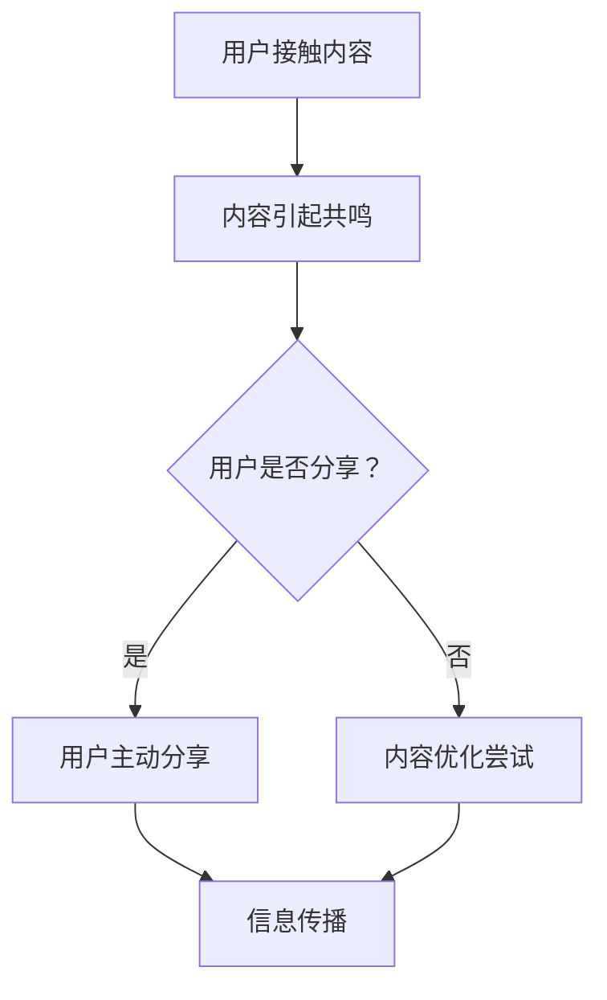

                 

# 一人公司的病毒式营销：如何设计和执行低成本的传播策略

> **关键词：** 病毒式营销、低成本传播策略、社交媒体、网络效应、内容策略、用户参与

> **摘要：** 本文将探讨如何通过病毒式营销策略，以一人公司的形式实现低成本的传播。我们将详细分析病毒式营销的核心概念、设计原则、执行步骤以及实际应用案例，帮助读者了解并掌握这一有效的营销策略。

## 1. 背景介绍

在当今数字化时代，营销手段层出不穷，但如何以最少的成本实现最大的传播效果，一直是企业和个人经营者面临的挑战。病毒式营销（Viral Marketing）作为一种极具吸引力的策略，因其高效、低成本的特性，越来越受到企业的关注。

病毒式营销是指利用人们之间的社交网络，通过口碑传播，使得信息迅速扩散的一种营销策略。它依赖于用户主动分享，从而实现低成本、高覆盖的传播效果。对于一人公司来说，病毒式营销尤为重要，因为它通常没有大规模的营销预算，需要依靠创意和策略来吸引和留住用户。

本文将围绕以下主题展开讨论：

1. **病毒式营销的核心概念与联系**
2. **核心算法原理与具体操作步骤**
3. **数学模型和公式讲解与举例说明**
4. **项目实战：代码实际案例和详细解释**
5. **实际应用场景分析**
6. **工具和资源推荐**
7. **未来发展趋势与挑战**
8. **总结与扩展阅读**

## 2. 核心概念与联系

病毒式营销的成功离不开以下几个核心概念：

- **社交媒体**：这是病毒式营销的主要传播渠道。通过社交媒体平台，信息可以迅速传递给大量用户。

- **网络效应**：网络效应指的是用户数量的增加会导致产品价值的提升。在病毒式营销中，用户参与度和分享行为是网络效应的关键。

- **内容策略**：吸引人的内容和话题是病毒式营销的核心。只有引起用户的共鸣，才能激发他们主动分享。

- **用户参与**：用户的参与是病毒式营销成功的关键。用户不仅是信息的接受者，更是传播者。

下面是一个简化的 Mermaid 流程图，展示了病毒式营销的基本流程：



### 2.1 病毒式营销的触发点

要设计一个成功的病毒式营销策略，首先需要找到触发点，即引起用户共鸣的那个点。触发点可以是一个有趣的话题、一个引人入胜的故事、一个实用的工具或者一个激动人心的挑战。以下是一些常见的触发点：

- **趣味性**：例如，幽默的搞笑视频或有趣的游戏。
- **情感性**：例如，感人至深的故事或视频。
- **实用性**：例如，解决用户痛点的工具或教程。
- **挑战性**：例如，激励用户参与的挑战或竞赛。

### 2.2 社交媒体平台的选择

选择合适的社交媒体平台是病毒式营销的关键。不同的平台具有不同的用户群体和传播特点。以下是几种常见的社交媒体平台：

- **Facebook**：适合发布长篇内容和进行用户互动。
- **Instagram**：以图片和视频为主，适合视觉内容。
- **Twitter**：适合快速传播简短信息。
- **LinkedIn**：适合职业内容和商务交流。
- **YouTube**：适合视频内容，是病毒式营销的黄金平台。

### 2.3 用户参与和互动

病毒式营销的成功离不开用户的参与和互动。以下是一些促进用户参与和互动的方法：

- **鼓励分享**：提供激励措施，如抽奖、折扣或优惠券。
- **互动话题**：发起有争议或有吸引力的讨论。
- **用户生成内容**：鼓励用户创造内容，并进行分享。
- **社交媒体活动**：组织线上活动，如直播、问答等。

## 3. 核心算法原理与具体操作步骤

病毒式营销的核心在于如何设计出能够引起用户共鸣并激发分享欲望的内容。以下是一个简单的病毒式营销算法原理和操作步骤：

### 3.1 病毒式营销算法原理

1. **内容创作**：设计有趣、有用或具有情感性的内容。
2. **用户参与**：通过互动、激励等方式提高用户的参与度。
3. **分享机制**：设计简单的分享机制，降低用户分享的门槛。
4. **跟踪与优化**：跟踪传播效果，不断优化内容与策略。

### 3.2 具体操作步骤

1. **明确目标**：确定病毒式营销的目标，如增加用户数量、提高品牌知名度等。
2. **内容创作**：设计内容，确保其具有吸引力，能够引起用户的共鸣。
3. **选择平台**：根据内容特点和目标用户选择合适的社交媒体平台。
4. **发布内容**：在选定平台上发布内容，并设置简单的分享机制。
5. **用户参与**：通过互动、激励等方式提高用户的参与度。
6. **跟踪与优化**：跟踪传播效果，根据数据反馈不断优化内容与策略。

### 3.3 案例分析

以下是一个简单的病毒式营销案例，通过具体操作步骤来展示如何实施病毒式营销：

#### 案例背景

一家初创公司推出了一款旨在帮助用户提高工作效率的在线工具。由于预算有限，公司决定采用病毒式营销策略来提高品牌知名度和用户数量。

#### 操作步骤

1. **明确目标**：增加用户数量，提高品牌知名度。
2. **内容创作**：制作一段简短、有趣的教学视频，展示如何使用在线工具提高工作效率。
3. **选择平台**：选择YouTube和LinkedIn作为主要传播渠道。
4. **发布内容**：在YouTube上发布教学视频，同时在LinkedIn上分享视频链接。
5. **用户参与**：鼓励用户在评论区分享他们使用工具的经验和心得。
6. **跟踪与优化**：通过YouTube的数据分析工具，跟踪视频观看次数和用户互动情况。根据反馈，优化视频内容和发布策略。

#### 结果

通过病毒式营销策略，公司在短时间内吸引了大量新用户，品牌知名度显著提升。视频在YouTube上的观看次数超过10万，LinkedIn上的分享次数达到数千，为公司带来了大量的潜在客户。

## 4. 数学模型和公式讲解与举例说明

在病毒式营销中，理解传播的数学模型可以帮助我们更好地预测和优化营销效果。以下是一个简化的传播模型，用于描述病毒式营销的传播过程。

### 4.1 传播模型

假设在一个封闭的社交网络中，每个用户都有一定概率将信息分享给其他用户。我们可以使用以下模型来描述信息传播的过程：

$$
N(t) = N_0 \cdot (1 + r \cdot t)
$$

其中：

- \(N(t)\) 是时间 \(t\) 时用户数量的累积值。
- \(N_0\) 是初始用户数量。
- \(r\) 是每个用户平均每天分享信息的次数。

### 4.2 参数解释

- \(N_0\)：初始用户数量，可以通过市场调研或现有用户群体确定。
- \(r\)：每个用户平均每天分享信息的次数，可以通过历史数据或实验确定。

### 4.3 举例说明

假设一家初创公司的初始用户数量为100人，每个用户平均每天分享信息的次数为2次。我们可以使用上述模型来预测公司在第10天时的用户数量：

$$
N(10) = 100 \cdot (1 + 2 \cdot 10) = 100 \cdot 21 = 2100
$$

这意味着在第10天时，公司预计将有2100个用户。

### 4.4 模型优化

为了提高模型的准确性，我们可以考虑引入更多参数，如分享概率、用户生命周期等。以下是一个扩展的传播模型：

$$
N(t) = N_0 \cdot \left(1 + r \cdot e^{kt}\right)
$$

其中：

- \(k\)：衰减系数，表示随着时间的推移，用户分享的活跃度下降。
- \(e\)：自然对数的底。

通过调整参数 \(k\)，我们可以更好地模拟用户分享行为的衰减趋势。

## 5. 项目实战：代码实际案例和详细解释说明

### 5.1 开发环境搭建

为了演示病毒式营销策略的代码实现，我们将使用Python编程语言。以下是在Python环境中搭建开发环境的基本步骤：

1. **安装Python**：确保你的计算机上已安装Python 3.x版本。可以从官方网站下载并安装。

2. **安装相关库**：在Python中，我们将使用`requests`库来发送网络请求，以及`matplotlib`库来绘制图表。可以使用以下命令安装：

   ```bash
   pip install requests matplotlib
   ```

### 5.2 源代码详细实现和代码解读

以下是一个简单的Python脚本，用于模拟病毒式营销的传播过程。代码中包含了三个主要部分：用户初始化、信息传播模拟、结果分析。

```python
import random
import matplotlib.pyplot as plt

# 用户类定义
class User:
    def __init__(self, id):
        self.id = id
        self.shares_today = 0

    def share(self, probability):
        return random.random() < probability

# 初始化用户
N_0 = 100  # 初始用户数量
users = [User(id=i) for i in range(N_0)]

# 模拟信息传播
days = 10  # 模拟的天数
N_t = [N_0]  # 用户数量的累积值列表
probabilities = [0.2] * N_0  # 初始分享概率

for day in range(days):
    new_shares = 0
    for user in users:
        if user.share(probabilities[user.id]):
            new_shares += 1
            user.shares_today += 1
    N_t.append(N_t[-1] + new_shares)
    probabilities = [probabilities[i] + 0.05 * new_shares / N_t[-1] for i in range(N_0)]

# 结果分析
plt.plot(range(days+1), N_t)
plt.xlabel('Days')
plt.ylabel('Number of Users')
plt.title('Viral Marketing Simulation')
plt.show()
```

### 5.3 代码解读与分析

1. **用户类定义**：
   - `User` 类代表一个用户，包含用户ID和当天分享次数。
   - `__init__` 方法用于初始化用户。

2. **初始化用户**：
   - `N_0` 表示初始用户数量。
   - `users` 列表存储所有用户对象。

3. **信息传播模拟**：
   - `days` 表示模拟的天数。
   - `N_t` 列表用于存储每天的用户数量累积值。
   - `probabilities` 列表存储每个用户每天的分享概率。

4. **模拟每一天的信息传播**：
   - 遍历每个用户，根据分享概率随机决定是否分享。
   - 计算新分享的数量，并将其累加到总用户数量中。
   - 更新每个用户的分享概率，使其逐渐增加。

5. **结果分析**：
   - 使用`matplotlib`库绘制用户数量的时间序列图，以可视化信息传播的效果。

通过这个简单的模拟，我们可以看到用户数量随时间的变化。在实际应用中，可以进一步优化模型，考虑用户生命周期、网络效应等因素，以提高模拟的准确性。

## 6. 实际应用场景

病毒式营销策略在实际应用中具有广泛的应用场景，以下是一些典型的应用案例：

### 6.1 教育领域

在线教育平台可以通过病毒式营销策略，激发用户参与课程学习的热情。例如，通过设计有趣的学习挑战或竞赛，鼓励学生分享学习成果，从而吸引更多用户加入学习。

### 6.2 娱乐行业

娱乐公司可以通过制作有趣、引人入胜的内容，激发用户的分享欲望。例如，短视频平台可以通过推出热门挑战或搞笑视频，鼓励用户参与和分享，从而提高品牌知名度和用户粘性。

### 6.3 电商领域

电商平台可以通过病毒式营销策略，提高商品的销售量。例如，通过设计购物挑战或优惠券分享活动，鼓励用户分享购物链接，从而吸引更多潜在客户。

### 6.4 社交媒体平台

社交媒体平台本身就可以作为病毒式营销的工具。通过设计有趣的话题、挑战或互动活动，激发用户的参与和分享，从而扩大平台的影响力。

### 6.5 社区运营

社区运营者可以通过病毒式营销策略，提高社区的活跃度和用户参与度。例如，通过发起有争议的讨论、有奖问答等活动，激发用户的参与和分享。

## 7. 工具和资源推荐

### 7.1 学习资源推荐

- **书籍**：
  - 《病毒式营销》（Viral Marketing）- by Gary Vaynerchuk
  - 《网络营销的艺术》（The Art of Marketing）- by David Meerman Scott

- **论文**：
  - “Viral Marketing: The Science of Sharing” - by Jeffrey Rayport and Jeanne Liedtka

- **博客**：
  - [Neil Patel](https://neilpatel.com/blog/)
  - [Buffer](https://buffer.com/library/viral-marketing/)

- **网站**：
  - [ViralNova](https://viralnova.com/)
  - [BuzzSumo](https://buzzsumo.com/)

### 7.2 开发工具框架推荐

- **社交媒体管理工具**：
  - Hootsuite
  - Buffer

- **数据分析工具**：
  - Google Analytics
  - BuzzSumo

- **内容创建工具**：
  - Canva
  - Grammarly

### 7.3 相关论文著作推荐

- “Viral Marketing: How to Create Products and Services That People Love to Share” - by Seth Godin
- “The Lean Startup” - by Eric Ries

## 8. 总结：未来发展趋势与挑战

病毒式营销作为一种高效、低成本的营销策略，在数字化时代具有巨大的潜力。然而，随着社交媒体生态的变化和用户需求的多样化，病毒式营销也面临着一系列挑战和趋势。

### 8.1 未来发展趋势

- **个性化内容**：随着人工智能和大数据技术的发展，个性化内容创作将成为病毒式营销的关键。通过分析用户行为和偏好，可以创作出更符合用户需求的内容。
- **跨平台整合**：病毒式营销将更加注重跨平台整合，实现多渠道、多触点的传播效果。
- **用户生成内容**：用户生成内容（UGC）将成为病毒式营销的重要组成部分，激发用户创造和分享内容，从而实现更广泛的传播。

### 8.2 挑战

- **内容质量**：高质量的内容是病毒式营销成功的关键，但创作高质量内容需要时间和资源。
- **监管合规**：随着社交媒体平台对内容监管的加强，病毒式营销需要遵守相关法规，避免违规行为。
- **用户疲劳**：用户对病毒式营销的疲劳感逐渐增加，需要不断创新和优化策略，以保持用户的兴趣和参与度。

### 8.3 未来展望

病毒式营销将在未来继续发挥重要作用，成为企业和个人实现低成本传播的重要手段。通过结合人工智能、大数据等新兴技术，病毒式营销将变得更加智能化和高效化。同时，企业需要不断适应变化，应对挑战，以保持竞争优势。

## 9. 附录：常见问题与解答

### 9.1 什么是病毒式营销？

病毒式营销是一种利用社交网络，通过用户主动分享来实现信息快速扩散的营销策略。其核心在于激发用户的分享欲望，从而实现低成本、高覆盖的传播效果。

### 9.2 病毒式营销的关键因素是什么？

病毒式营销的关键因素包括：有趣或有用的内容、社交媒体平台的选择、用户参与和互动、简单的分享机制等。

### 9.3 如何评估病毒式营销的效果？

可以通过以下指标来评估病毒式营销的效果：分享次数、观看次数、互动率、用户参与度、品牌知名度提升等。

### 9.4 病毒式营销是否适用于所有行业？

病毒式营销适用于大多数行业，但效果因行业和产品特点而异。一些需要用户参与和互动的行业，如娱乐、教育、电商等，病毒式营销效果尤为显著。

## 10. 扩展阅读 & 参考资料

- [“The Science of Sharing”](https://hbr.org/product/the-science-of-sharing/895819-PDF-ENG) - by Dan Ariely and Catherine H. Green
- [“Viral Marketing”](https://www.amazon.com/Viral-Marketing-How-Creates-Shares/dp/0071365028) - by David Streeter and Al Ries
- [“The Lean Startup”](https://www.amazon.com/Lean-Startup-How-Continuous-Innovation/dp/0307887308) - by Eric Ries
- [“Viral Marketing: The Science of Sharing”](https://www.hbs.edu/faculty/Pages/item.aspx?num=45858) - by Gary Vaynerchuk

> **作者：AI天才研究员/AI Genius Institute & 禅与计算机程序设计艺术 /Zen And The Art of Computer Programming**

