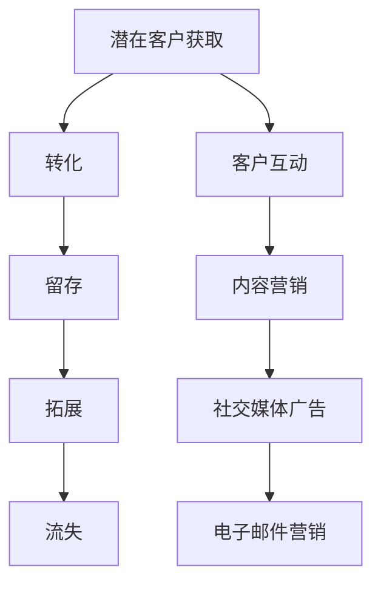

                 

# 一人公司的自动化营销：构建高效的营销漏斗系统

## 关键词：自动化营销，营销漏斗，营销系统，个人创业，效率提升

## 摘要：

本文将深入探讨一人公司的自动化营销策略，着重于构建高效的营销漏斗系统。通过一步步的阐述和分析，我们将了解自动化营销的核心概念、关键算法原理，以及如何将其应用于实际项目。文章还将提供实用的工具和资源推荐，帮助读者深入了解并实施自动化营销策略。无论您是一名创业者还是营销专业人士，本文都将为您揭示如何通过高效自动化营销实现业务的快速增长。

## 1. 背景介绍

在当今高度竞争的商业环境中，营销变得比以往任何时候都更加重要。然而，对于许多创业者或小型企业来说，有限的资源和人力常常限制了他们的营销效果。传统的营销方法通常涉及大量手动操作，不仅耗时耗力，而且容易出现错误。因此，自动化营销应运而生，成为提升营销效率和效果的关键手段。

自动化营销是指利用技术手段，如软件、算法和工具，来自动执行营销任务，从而减少人力成本和时间投入。这种营销方式可以涵盖从潜在客户获取、客户关系管理，到销售转化的各个阶段。对于一人公司来说，自动化营销更是至关重要的，因为它可以最大化地利用有限的资源，实现业务的快速增长。

本文旨在帮助读者了解并构建一个高效的营销漏斗系统，使其能够在竞争激烈的市场中脱颖而出。我们将从核心概念开始，逐步深入到实际操作和应用，帮助读者实现自动化营销的目标。

### 2. 核心概念与联系

为了构建高效的自动化营销系统，我们需要了解几个关键概念，包括营销漏斗、客户生命周期和自动化工具。

#### 2.1 营销漏斗

营销漏斗（Marketing Funnel）是一种常用的市场营销模型，用于描述潜在客户从接触品牌到最终转化为购买者的过程。漏斗的各个阶段通常包括：

- **顶部（Top）**：潜在客户来源，如社交媒体广告、搜索引擎优化（SEO）等。
- **中间（Middle）**：潜在客户与品牌互动的过程，包括访问网站、下载内容等。
- **底部（Bottom）**：潜在客户接近购买决策的阶段，如加入邮件订阅、参与直播、购买产品等。

营销漏斗的目的是帮助公司识别和优化每个阶段的效果，以提高整体转化率。

#### 2.2 客户生命周期

客户生命周期（Customer Lifecycle）是指客户与公司互动的整个过程，从首次接触、转化、留存到最终流失。了解客户生命周期对于构建自动化营销系统至关重要，因为它可以帮助我们识别每个阶段的客户需求和痛点。

客户生命周期的常见阶段包括：

- **潜在客户获取（Acquisition）**：吸引新客户的过程。
- **转化（Conversion）**：将潜在客户转化为实际客户的过程。
- **留存（Retention）**：保持现有客户的过程。
- **拓展（Expansion）**：增加现有客户的购买频率和购买量的过程。
- **流失（Churn）**：客户流失的过程。

#### 2.3 自动化工具

自动化工具是构建高效营销漏斗系统的核心。这些工具可以帮助自动化各种营销任务，如电子邮件营销、社交媒体管理、客户关系管理（CRM）等。常见的自动化工具包括：

- **电子邮件营销平台**（如Mailchimp、ConvertKit）
- **社交媒体管理工具**（如Hootsuite、Buffer）
- **客户关系管理（CRM）系统**（如HubSpot、Salesforce）
- **自动化营销平台**（如Marketo、Pardot）

#### 2.4 Mermaid 流程图

以下是营销漏斗系统的一个简化 Mermaid 流程图，展示了核心概念之间的联系：



通过这个流程图，我们可以清楚地看到客户从潜在客户到最终流失的整个过程，以及各个阶段的关键环节。

### 3. 核心算法原理 & 具体操作步骤

在了解了核心概念后，接下来我们将探讨自动化营销系统的核心算法原理和具体操作步骤。这些算法和步骤将帮助我们优化营销漏斗的各个阶段，从而提高整体转化率。

#### 3.1 客户获取算法

客户获取算法的主要目标是吸引潜在客户，增加网站流量。以下是一些常用的客户获取算法：

- **搜索引擎优化（SEO）**：通过优化网站内容和结构，提高在搜索引擎中的排名，从而增加自然流量。
- **社交媒体广告**：通过在社交媒体平台上投放广告，吸引潜在客户访问网站。
- **内容营销**：通过创建有价值的内容（如博客文章、视频、白皮书等），吸引潜在客户并建立品牌影响力。

#### 3.2 转化算法

转化算法的目标是将潜在客户转化为实际客户。以下是一些常用的转化算法：

- **着陆页优化**：通过优化着陆页的设计和内容，提高潜在客户的转化率。
- **电子邮件营销**：通过发送个性化的电子邮件，引导潜在客户完成购买或订阅。
- **A/B 测试**：通过对比不同版本的营销素材，找出最佳方案，从而提高转化率。

#### 3.3 留存算法

留存算法的目标是保持现有客户，减少客户流失。以下是一些常用的留存算法：

- **客户关系管理（CRM）系统**：通过记录和分析客户行为数据，提供个性化的服务和推荐。
- **忠诚度计划**：通过提供积分、折扣等优惠，鼓励客户重复购买。
- **客户关怀邮件**：通过发送定期的关怀邮件，保持与客户的联系，提高客户满意度。

#### 3.4 拓展算法

拓展算法的目标是增加现有客户的购买频率和购买量。以下是一些常用的拓展算法：

- **交叉销售和复购营销**：通过推荐相关产品或提供复购优惠，鼓励客户购买更多产品。
- **VIP 客户关怀**：针对高价值客户，提供个性化的服务和优惠，增加客户粘性。
- **个性化推荐系统**：通过分析客户行为数据，提供个性化的产品推荐，提高购买转化率。

### 4. 数学模型和公式 & 详细讲解 & 举例说明

在自动化营销中，数学模型和公式起着关键作用，它们可以帮助我们量化营销效果，优化决策过程。以下是一些常用的数学模型和公式，以及它们的详细讲解和举例说明。

#### 4.1 转化率模型

转化率模型用于衡量营销活动的效果，公式如下：

\[ 转化率 = \frac{转化的客户数}{接触的客户数} \]

举例说明：

假设一家公司在一个月内吸引了1000名潜在客户，其中200人完成了购买。那么，该公司的转化率为：

\[ 转化率 = \frac{200}{1000} = 20\% \]

#### 4.2 漏斗分析模型

漏斗分析模型用于分析营销漏斗的各个阶段，公式如下：

\[ 漏斗效率 = \frac{下一阶段客户数}{当前阶段客户数} \]

举例说明：

假设一家公司的营销漏斗如下：

- 顶部：1000名潜在客户
- 中间：300名潜在客户
- 底部：100名潜在客户

那么，各个阶段的漏斗效率为：

- 顶部到中间：\[ 漏斗效率 = \frac{300}{1000} = 30\% \]
- 中间到底部：\[ 漏斗效率 = \frac{100}{300} = 33.33\% \]

#### 4.3 客户生命周期价值（CLV）模型

客户生命周期价值模型用于预测客户的长期价值，公式如下：

\[ CLV = \frac{（平均订单价值 × 平均购买频率 × 客户生命周期） - 获取成本}{1 + 折现率} \]

举例说明：

假设一家公司的客户生命周期价值计算如下：

- 平均订单价值：100元
- 平均购买频率：每年2次
- 客户生命周期：3年
- 获取成本：50元
- 折现率：5%

那么，该客户的生命周期价值为：

\[ CLV = \frac{（100元 × 2次/年 × 3年） - 50元}{1 + 0.05} = \frac{600元 - 50元}{1.05} = 535.23元 \]

### 5. 项目实战：代码实际案例和详细解释说明

#### 5.1 开发环境搭建

在开始实际项目之前，我们需要搭建一个适合自动化营销的开发环境。以下是所需的工具和软件：

- **编程语言**：Python（版本3.8以上）
- **开发工具**：Visual Studio Code（或类似代码编辑器）
- **虚拟环境**：venv（用于创建隔离的Python环境）
- **数据库**：MySQL（用于存储客户数据）
- **API 接口**：第三方API（如邮件营销API、社交媒体API等）

安装步骤：

1. 安装Python：从[Python官网](https://www.python.org/)下载并安装Python。
2. 安装Visual Studio Code：从[Visual Studio Code官网](https://code.visualstudio.com/)下载并安装。
3. 创建虚拟环境：在终端中运行以下命令：

```bash
python -m venv myenv
source myenv/bin/activate
```

4. 安装必需的Python库：

```bash
pip install flask mysql-connector-python
```

#### 5.2 源代码详细实现和代码解读

以下是自动化营销系统的核心代码实现，分为三个部分：数据库连接、API 调用和前端界面。

**数据库连接**

```python
import mysql.connector

# 配置数据库连接
config = {
    'host': 'localhost',
    'database': 'mydb',
    'user': 'root',
    'password': 'password'
}

# 连接数据库
conn = mysql.connector.connect(**config)
cursor = conn.cursor()
```

**API 调用**

```python
import requests

# 发送电子邮件
def send_email(to, subject, body):
    url = "https://api.emailservice.com/send"
    payload = {
        'to': to,
        'subject': subject,
        'body': body
    }
    headers = {
        'Authorization': 'Bearer YOUR_API_KEY'
    }
    response = requests.post(url, data=payload, headers=headers)
    return response.json()

# 发送社交媒体通知
def send_social_media_notification(platform, message):
    if platform == 'twitter':
        url = "https://api.twitter.com/1.1/statuses/update.json"
        params = {'status': message}
        auth = tweepy.OAuthHandler('YOUR_API_KEY', 'YOUR_API_SECRET')
        auth.set_access_token('YOUR_ACCESS_TOKEN', 'YOUR_ACCESS_SECRET')
        api = tweepy.API(auth)
        api.post(params)
    elif platform == 'facebook':
        url = "https://graph.facebook.com/v12.0/me/feed"
        params = {'message': message, 'access_token': 'YOUR_ACCESS_TOKEN'}
        response = requests.post(url, data=params)
        return response.json()
```

**前端界面**

```html
<!DOCTYPE html>
<html lang="en">
<head>
    <meta charset="UTF-8">
    <title>自动化营销系统</title>
</head>
<body>
    <h1>自动化营销系统</h1>
    <form action="/send_email" method="post">
        <label for="to">收件人：</label>
        <input type="email" id="to" name="to" required>
        <label for="subject">主题：</label>
        <input type="text" id="subject" name="subject" required>
        <label for="body">内容：</label>
        <textarea id="body" name="body" required></textarea>
        <button type="submit">发送邮件</button>
    </form>
</body>
</html>
```

#### 5.3 代码解读与分析

上述代码分为三个部分，分别负责数据库连接、API 调用和前端界面。

- **数据库连接**：通过MySQL Connector/Python库连接到本地MySQL数据库，并创建一个游标对象，用于执行SQL语句。
- **API 调用**：定义了发送电子邮件和社交媒体通知的两个函数。发送电子邮件使用第三方邮件API，发送社交媒体通知使用Twitter和Facebook的API。
- **前端界面**：使用HTML和CSS创建一个简单的表单界面，用户可以填写邮件地址、主题和内容，然后提交表单。

在服务器端，我们接收表单提交的数据，调用API函数发送电子邮件和社交媒体通知。

### 6. 实际应用场景

自动化营销系统在实际应用中具有广泛的应用场景，以下是一些典型的例子：

#### 6.1 在线教育

在线教育机构可以利用自动化营销系统来吸引潜在学员，提高课程转化率。例如：

- **客户获取**：通过搜索引擎优化（SEO）和社交媒体广告吸引潜在学员。
- **转化**：通过优化着陆页和提供免费试听课来提高转化率。
- **留存**：通过定期发送课程通知、学习资料和客户关怀邮件，提高学员留存率。
- **拓展**：通过推荐相关课程或提供优惠券，鼓励学员购买更多课程。

#### 6.2 电子商务

电子商务企业可以通过自动化营销系统提高销售转化率和客户满意度。例如：

- **客户获取**：通过社交媒体广告和搜索引擎优化吸引潜在客户。
- **转化**：通过个性化推荐、优惠券和限时促销提高购买转化率。
- **留存**：通过发送订单确认邮件、购物指南和客户关怀邮件，提高客户满意度。
- **拓展**：通过会员制度、积分奖励和复购营销，增加客户复购率。

#### 6.3 B2B 销售企业

B2B销售企业可以利用自动化营销系统来提高销售效率和客户满意度。例如：

- **客户获取**：通过内容营销和搜索引擎优化吸引潜在客户。
- **转化**：通过提供免费试用、在线演示和个性化报价，提高客户转化率。
- **留存**：通过定期发送行业报告、客户关怀邮件和活动邀请，保持客户关系。
- **拓展**：通过提供增值服务和定制化解决方案，提高客户粘性和购买量。

### 7. 工具和资源推荐

为了构建高效的自动化营销系统，以下是一些实用的工具和资源推荐：

#### 7.1 学习资源推荐

- **书籍**：
  - 《营销自动化：如何通过技术提高营销效率》（Marketing Automation：A Practical Guide to Automated Marketing）
  - 《转化率优化：如何提高网站转化率》（Landing Page Optimization：The Definitive Guide to Creating Highly Converting Web Pages）
- **在线课程**：
  - Coursera上的《市场营销基础》（Marketing）
  - Udemy上的《营销自动化入门到高级》（Marketing Automation）

#### 7.2 开发工具框架推荐

- **电子邮件营销平台**：Mailchimp、ConvertKit、SendinBlue
- **社交媒体管理工具**：Hootsuite、Buffer、Later
- **客户关系管理（CRM）系统**：HubSpot、Salesforce、Zoho CRM
- **自动化营销平台**：Marketo、Pardot、HubSpot Marketing Hub

#### 7.3 相关论文著作推荐

- **论文**：
  - "Marketing Automation: Strategies and Tactics for Effective Use"（营销自动化：策略和战术的有效使用）
  - "The Impact of Marketing Automation on Customer Relationship Management"（营销自动化对客户关系管理的影响）
- **著作**：
  - 《大数据营销：如何利用数据驱动营销策略》（Big Data Marketing: How to Strategize, Analyze and Win with Big Data）
  - 《营销自动化实战：构建高效率的营销系统》（Marketing Automation for Dummies）

### 8. 总结：未来发展趋势与挑战

自动化营销是当今市场营销领域的一个重要趋势，它为企业提供了更高效、更精准的营销手段。然而，随着技术的不断进步，自动化营销也面临着一些挑战和机遇。

#### 8.1 未来发展趋势

- **人工智能（AI）**：随着AI技术的不断发展，自动化营销系统将更加智能化，能够根据客户行为数据提供更准确的个性化推荐和营销策略。
- **数据隐私和安全**：随着数据隐私法规的日益严格，企业需要更加注重数据隐私和安全，确保客户数据的安全和合规。
- **跨渠道整合**：未来的自动化营销系统将更加注重跨渠道整合，实现无缝的客户体验，提高整体营销效果。

#### 8.2 未来挑战

- **数据质量**：自动化营销依赖于高质量的数据，数据质量直接影响营销效果。企业需要确保数据来源的可靠性和数据处理的准确性。
- **技术整合**：随着营销工具和平台的增多，企业需要整合各种技术资源，确保自动化营销系统的稳定性和灵活性。
- **人才短缺**：自动化营销需要具备技术背景和营销策略的专业人才，当前市场上相关人才的短缺可能成为企业发展的瓶颈。

### 9. 附录：常见问题与解答

#### 9.1 什么是营销漏斗？

营销漏斗（Marketing Funnel）是一种常用的市场营销模型，用于描述潜在客户从接触品牌到最终转化为购买者的过程。漏斗的各个阶段通常包括顶部（潜在客户获取）、中间（潜在客户与品牌互动）、底部（潜在客户接近购买决策）等。

#### 9.2 营销自动化有哪些优点？

营销自动化的优点包括：

- 提高营销效率：通过自动化执行各种营销任务，减少人力成本和时间投入。
- 提高营销效果：通过精准的数据分析和个性化推荐，提高转化率和客户满意度。
- 跨渠道整合：实现跨渠道的无缝营销，提高整体营销效果。
- 提高数据质量：通过自动化收集和分析客户数据，提高数据质量和准确性。

#### 9.3 如何开始构建自动化营销系统？

要开始构建自动化营销系统，可以按照以下步骤进行：

1. 明确业务目标：确定您希望通过自动化营销实现的具体目标，如提高网站流量、增加销售转化率等。
2. 确定所需工具：根据业务需求，选择合适的电子邮件营销平台、社交媒体管理工具、客户关系管理（CRM）系统等。
3. 收集客户数据：通过网站访问、社交媒体互动、电子邮件订阅等方式，收集潜在客户和现有客户的数据。
4. 设计营销策略：根据业务目标和客户数据，设计个性化的营销策略，包括内容营销、电子邮件营销、社交媒体营销等。
5. 部署自动化流程：将营销策略转化为自动化流程，确保各个营销环节的无缝衔接。
6. 监控和优化：定期监控营销效果，根据数据分析和反馈，优化营销策略和自动化流程。

### 10. 扩展阅读 & 参考资料

为了深入了解自动化营销和构建高效营销漏斗系统，以下是一些扩展阅读和参考资料：

- **书籍**：
  - 《营销自动化：如何通过技术提高营销效率》（Marketing Automation：A Practical Guide to Automated Marketing）
  - 《转化率优化：如何提高网站转化率》（Landing Page Optimization：The Definitive Guide to Creating Highly Converting Web Pages）
- **在线课程**：
  - Coursera上的《市场营销基础》（Marketing）
  - Udemy上的《营销自动化入门到高级》（Marketing Automation）
- **网站和博客**：
  - 营销自动化网（Marketing Automation Blog）：https://www.marketingautomationblog.com/
  - 转化率优化网（Conversion Rate Optimization Blog）：https://www.conversionoptimizationblog.com/
- **论文和报告**：
  - "Marketing Automation: Strategies and Tactics for Effective Use"（营销自动化：策略和战术的有效使用）
  - "The Impact of Marketing Automation on Customer Relationship Management"（营销自动化对客户关系管理的影响）
- **工具和资源**：
  - Mailchimp（电子邮件营销平台）：https://mailchimp.com/
  - HubSpot（市场营销自动化平台）：https://www.hubspot.com/
  - Zoho CRM（客户关系管理系统）：https://www.zoho.com/crm/

### 作者信息

- 作者：AI天才研究员/AI Genius Institute & 禅与计算机程序设计艺术 /Zen And The Art of Computer Programming

