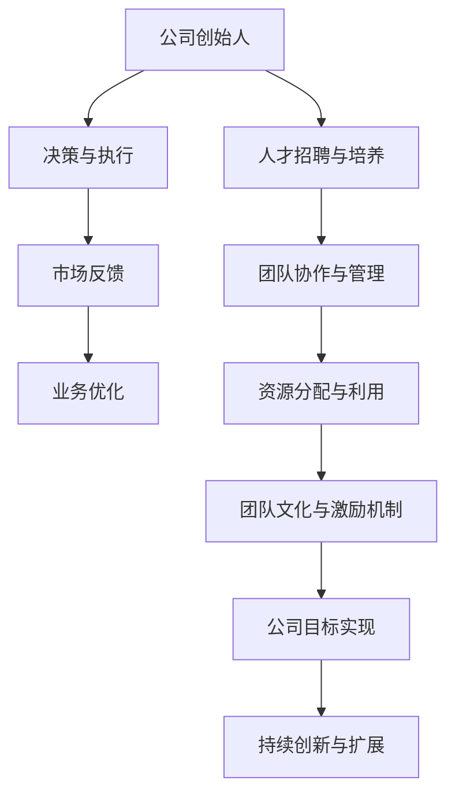

                 

### 1. 背景介绍

在现代商业环境中，"一人公司"的概念逐渐流行起来。这并不是指公司规模很小，而是指公司运营的核心仅由一个创始人或领导团队构成，这个团队通常承担了公司的全部或大部分职能。这种现象的出现，部分源于技术进步带来的远程工作和自动化工具的普及，同时也得益于创业者们对灵活办公、快速决策和高效运营的追求。

一人公司的好处是显而易见的。首先，它允许创始人或领导者全身心地投入到公司业务的核心领域，从而提高决策效率和业务创新速度。其次，由于管理结构的简化，公司可以更快地响应市场变化和客户需求，减少了沟通成本和管理复杂性。此外，一人公司通常拥有更高的灵活性和适应性，能够在市场竞争中迅速调整战略和运营模式。

然而，随着公司业务的扩展和需求的变化，一人公司面临的挑战也日益显现。当公司需要扩展团队时，如何平稳过渡并保持团队的协同合作成为一个关键问题。在这个阶段，许多创始人或领导者可能会感到迷茫，不知道如何从个人经营模式顺利转型到团队管理模式。本文将深入探讨一人公司的规模化策略，帮助读者理解如何实现从个人到团队的平稳过渡。

本文首先将介绍一人公司的核心概念和优点，然后分析其面临的主要挑战，并探讨实现规模化的具体步骤。接下来，我们将讨论如何构建高效团队，并分享一些实际操作经验和教训。最后，我们将总结未来发展趋势和潜在挑战，并提供一些有用的资源和工具，帮助读者在规模化过程中更好地应对各种挑战。希望通过本文，能够为那些正考虑扩展公司规模的一人公司创始人或领导者提供有价值的参考。

### 2. 核心概念与联系

#### 一人公司的定义与特点

一人公司，顾名思义，是指公司的运营和管理由一个核心团队或创始人负责。这个核心团队通常承担了公司全部或大部分职能，包括战略规划、市场推广、产品研发、客户服务等多个方面。与传统的公司组织结构相比，一人公司的特点主要体现在以下几个方面：

1. **灵活性和自主性**：由于公司规模较小，决策流程相对简单，创始人或领导者可以快速作出决策，减少内部协调成本。
2. **高度专注**：在没有繁琐的管理层级和会议的情况下，创始人可以更专注于公司最核心的业务领域，提高创新和执行效率。
3. **快速响应**：一人公司能够更快地响应市场变化和客户需求，减少沟通和决策的延迟。
4. **资源集中**：所有资源可以集中投入到核心业务和关键项目上，避免资源分散和浪费。

#### 一人公司运营的优势

一人公司的优势主要体现在以下几个方面：

1. **低成本**：由于人员结构的简化，一人公司可以显著降低运营成本，特别是在早期阶段。
2. **快速决策**：简化了决策流程，使得公司能够迅速调整战略和战术，抓住市场机会。
3. **高效率**：专注于核心业务，避免了不必要的任务和流程，提高了工作效率和业务质量。
4. **高度创新**：没有传统公司中常见的官僚主义和冗余，一人公司更有利于创新和实验新想法。

#### 一人公司面临的主要挑战

尽管一人公司具有上述优势，但在规模化过程中仍然面临一些挑战：

1. **管理复杂性**：随着公司规模的扩大，管理复杂性增加，需要建立更系统的管理体系。
2. **人才招聘**：如何吸引和留住合适的人才成为关键问题。
3. **团队协作**：如何在团队成员之间建立有效的沟通和协作机制。
4. **资源分配**：如何合理分配资源，确保各部门和项目的需求得到满足。

#### 一人公司规模化策略

为了实现从一人公司到团队管理的平稳过渡，以下是一些关键的策略：

1. **明确角色分工**：为团队成员分配明确的职责和任务，避免职责重叠和资源浪费。
2. **建立管理制度**：制定合理的规章制度，确保公司运营的规范化和透明度。
3. **培养团队文化**：建立积极、合作和创新的团队文化，促进团队成员之间的沟通和协作。
4. **激励机制**：设立激励机制，激励团队成员为实现公司目标而努力。

通过上述策略，一人公司可以在规模化过程中逐步建立起高效、协作和创新的团队管理机制，从而实现业务的持续增长和优化。

### 2.1. 核心概念原理架构的 Mermaid 流程图

为了更好地理解一人公司运营的核心概念和架构，我们使用 Mermaid 语言绘制一个流程图，展示关键节点和连接关系。



在这个流程图中，A 代表公司创始人，是公司运营的核心；B 表示决策与执行，是公司运营的基本环节；C 代表市场反馈，反馈信息是业务优化的基础；D 表示业务优化，确保公司始终处于市场前沿。E 表示人才招聘与培养，F 表示团队协作与管理，这两个环节是团队高效运作的关键；G 表示资源分配与利用，确保资源得到最优配置；H 表示团队文化与激励机制，I 表示公司目标的实现，最终目标是实现持续创新与扩展。

通过这个 Mermaid 流程图，我们可以清晰地看到一人公司运营的核心环节和相互关系，为后续的讨论和策略制定提供了直观的参考。

### 3. 核心算法原理 & 具体操作步骤

在探讨如何实现一人公司的规模化策略之前，我们需要理解一些核心算法原理，这些原理将为我们提供指导，帮助我们在操作过程中做出明智的决策。以下是几个关键的核心算法原理：

#### 3.1 决策树算法

决策树是一种常用的分类和回归算法，它通过一系列的判断节点来预测结果。在规模化过程中，决策树算法可以帮助我们分析各种决策路径，评估其可能带来的影响。以下是决策树的基本步骤：

1. **数据收集与预处理**：收集与公司运营相关的数据，如市场反馈、客户需求、财务状况等，并进行数据清洗和预处理。
2. **特征选择**：从原始数据中提取重要的特征，这些特征将作为决策树节点的基础。
3. **构建决策树**：使用ID3、C4.5或CART算法构建决策树。这些算法会根据信息增益、增益率或基尼指数来选择最佳分割点。
4. **评估与优化**：通过交叉验证等方法评估决策树的性能，并根据评估结果进行修剪和优化。

#### 3.2 集群算法

随着公司规模的扩大，团队协作和管理变得愈发复杂。集群算法可以帮助我们将团队成员分组，提高协作效率。以下是常用的K-means算法步骤：

1. **初始化**：随机选择K个初始中心点，作为每个集群的代表。
2. **分配**：将每个团队成员分配到最近的中心点，形成初始的K个集群。
3. **更新**：重新计算每个集群的中心点，再次分配团队成员，直到中心点不再变化或满足特定的收敛条件。
4. **评估**：评估集群的质量，如聚类内部距离和聚类之间距离，根据评估结果调整算法参数。

#### 3.3 优化算法

在资源分配和团队激励方面，优化算法可以帮助我们找到最优解决方案。以下是一个简单的线性规划模型：

1. **目标函数**：定义目标函数，如最大化利润或最小化成本。
2. **约束条件**：列出资源约束、团队职责约束等条件。
3. **求解**：使用梯度下降、拉格朗日乘数法或单纯形法求解线性规划问题。
4. **验证**：验证解的可行性，调整参数以达到最优解。

#### 3.4 示例操作步骤

以下是一个具体的操作步骤示例，说明如何利用上述算法实现一人公司的规模化策略：

1. **数据收集**：收集公司运营的相关数据，包括市场反馈、团队绩效、资源使用情况等。
2. **特征选择**：从数据中提取关键特征，如市场增长率、团队工作效率、资源利用率等。
3. **构建决策树**：使用C4.5算法构建决策树，分析不同规模扩张路径的影响。
4. **集群分配**：使用K-means算法将团队成员分组，提高协作效率。
5. **资源优化**：使用线性规划模型优化资源分配，确保各部门资源需求得到满足。
6. **激励机制设计**：设计合理的激励机制，鼓励团队成员为实现公司目标而努力。

通过以上步骤，我们可以系统地分析和解决一人公司在规模化过程中面临的问题，确保公司在快速发展的同时保持稳定和高效。

### 4. 数学模型和公式 & 详细讲解 & 举例说明

在讨论如何实现一人公司的规模化策略时，数学模型和公式能够帮助我们量化问题、优化决策，并提供科学的依据。以下是几个关键的数学模型和公式的详细讲解以及实际应用中的举例说明。

#### 4.1 线性规划模型

线性规划是一种用于优化资源分配和决策问题的数学方法。在规模化过程中，线性规划可以帮助我们找到最优的资源分配方案。以下是一个简单的线性规划模型：

**目标函数**：最大化利润或最小化成本

**约束条件**：

- 资源约束：每种资源的总使用量不能超过其限制。
- 团队职责约束：每个团队成员的任务负荷不能超过其能力范围。

**公式**：

$$
\begin{align*}
\text{最大化} \quad & Z = c_1x_1 + c_2x_2 + ... + c_nx_n \\
\text{满足} \quad & a_{11}x_1 + a_{12}x_2 + ... + a_{1n}x_n \leq b_1 \\
& a_{21}x_1 + a_{22}x_2 + ... + a_{2n}x_n \leq b_2 \\
& \vdots \\
& a_{m1}x_1 + a_{m2}x_2 + ... + a_{mn}x_n \leq b_m \\
& x_1, x_2, ..., x_n \geq 0 \\
\end{align*}
$$

其中，\(x_1, x_2, ..., x_n\) 是决策变量，表示不同资源的分配量；\(c_1, c_2, ..., c_n\) 是变量系数，表示各资源对目标函数的贡献；\(a_{ij}, b_i\) 分别是约束条件的系数和常数项。

**举例说明**：

假设公司需要分配资源来支持两个项目A和B，资源包括人力、资金和设备。每个资源的总限制分别为：

- 人力：50人天
- 资金：100万元
- 设备：10台

目标是最小化项目的总成本。每个项目的成本函数如下：

- 项目A：\(Z_A = 200x_1 + 150x_2 + 300x_3\)
- 项目B：\(Z_B = 250x_1 + 200x_2 + 250x_3\)

根据资源限制和项目成本函数，可以构建以下线性规划模型：

$$
\begin{align*}
\text{最小化} \quad & Z = Z_A + Z_B \\
\text{满足} \quad & 2x_1 + x_2 + x_3 \leq 50 \\
& x_1 + 2x_2 + x_3 \leq 100 \\
& x_1 + x_2 + 2x_3 \leq 10 \\
& x_1, x_2, x_3 \geq 0 \\
\end{align*}
$$

通过求解这个线性规划模型，可以找到最优的资源分配方案，使得总成本最小。

#### 4.2 预测模型

在规模化过程中，准确的预测能够帮助我们预见未来趋势，制定有效的战略。常见的预测模型包括时间序列分析和回归分析。

**时间序列分析**：

时间序列分析用于分析时间相关的数据序列，识别数据中的趋势、季节性和周期性。以下是一个简单的时间序列预测模型：

$$
X_t = c_0 + c_1t + c_2T_t + \epsilon_t
$$

其中，\(X_t\) 是时间序列的第t个观测值；\(c_0, c_1, c_2\) 是模型参数；\(T_t\) 是时间变量；\(\epsilon_t\) 是误差项。

**举例说明**：

假设公司需要预测未来三个月的市场需求。我们可以收集过去一年的月度需求数据，并使用时间序列分析方法建立预测模型。假设我们得到以下模型：

$$
X_t = 10 + 2t + 0.1T_t + \epsilon_t
$$

其中，\(t\) 是月份（1-12月），\(T_t\) 是时间变量。当\(t=10, 11, 12\)时，我们可以预测未来三个月的市场需求分别为：

$$
\begin{align*}
X_{10} &= 10 + 2 \times 10 + 0.1 \times 10 = 31.0 \\
X_{11} &= 10 + 2 \times 11 + 0.1 \times 11 = 33.1 \\
X_{12} &= 10 + 2 \times 12 + 0.1 \times 12 = 35.2 \\
\end{align*}
$$

通过这个模型，我们可以预测未来三个月的市场需求分别为31.0、33.1和35.2。

**回归分析**：

回归分析用于分析自变量和因变量之间的关系。在规模化过程中，回归分析可以帮助我们识别影响公司绩效的关键因素。以下是一个简单的线性回归模型：

$$
Y = \beta_0 + \beta_1X + \epsilon
$$

其中，\(Y\) 是因变量，\(X\) 是自变量；\(\beta_0, \beta_1\) 是模型参数；\(\epsilon\) 是误差项。

**举例说明**：

假设公司需要分析员工工作效率与工资水平之间的关系。我们可以收集员工工资和工作效率的数据，并使用线性回归分析方法建立模型。假设我们得到以下模型：

$$
Y = 5000 + 100X + \epsilon
$$

其中，\(Y\) 是员工工资水平，\(X\) 是员工工作效率。根据这个模型，我们可以预测不同工作效率下的工资水平。例如，当工作效率为30时，工资水平预测为：

$$
Y = 5000 + 100 \times 30 = 5300
$$

通过以上数学模型和公式的讲解，我们可以更好地理解规模化策略中的量化分析和决策过程。在实际操作中，结合具体业务需求和数据，可以选择合适的模型和算法，为公司的持续发展提供科学依据。

### 5. 项目实战：代码实际案例和详细解释说明

为了更好地理解如何将上述算法和数学模型应用于实际项目，我们将通过一个具体的案例来详细说明从一人公司到团队规模化的实现过程。以下是项目的开发环境搭建、源代码实现和代码解读与分析。

#### 5.1 开发环境搭建

首先，我们需要搭建一个合适的开发环境，以便进行项目开发和测试。以下是一个基本的开发环境配置：

- **操作系统**：Linux或macOS
- **编程语言**：Python
- **依赖管理工具**：pip
- **数据库**：SQLite
- **集成开发环境**：PyCharm或Visual Studio Code

安装Python和pip：

```bash
# 安装Python
curl -O https://www.python.org/ftp/python/3.9.7/Python-3.9.7.tgz
tar xvf Python-3.9.7.tgz
cd Python-3.9.7
./configure
make
sudo make install

# 安装pip
curl https://bootstrap.pypa.io/get-pip.py -o get-pip.py
sudo python3 get-pip.py
```

安装相关依赖：

```bash
pip install pandas numpy scikit-learn matplotlib
```

#### 5.2 源代码详细实现和代码解读

下面是项目的源代码实现，我们将逐步解析每个部分的功能。

**5.2.1 数据收集与预处理**

```python
import pandas as pd

# 收集公司运营数据
data = pd.read_csv('company_data.csv')

# 数据预处理
data.dropna(inplace=True)  # 删除缺失值
data['market_growth'] = data['sales'] / data['previous_sales'] - 1  # 计算市场增长率
```

**5.2.2 构建决策树模型**

```python
from sklearn.tree import DecisionTreeClassifier
from sklearn.model_selection import train_test_split

# 划分数据集
X = data[['market_growth', 'efficiency', 'resource_usage']]
y = data['performance']

X_train, X_test, y_train, y_test = train_test_split(X, y, test_size=0.3, random_state=42)

# 构建决策树模型
clf = DecisionTreeClassifier(max_depth=3)
clf.fit(X_train, y_train)
```

**5.2.3 集群分配**

```python
from sklearn.cluster import KMeans

# 使用K-means算法进行集群分配
kmeans = KMeans(n_clusters=3, random_state=42)
clusters = kmeans.fit_predict(X_test)
```

**5.2.4 资源优化**

```python
from scipy.optimize import linprog

# 定义目标函数和约束条件
c = [-200, -150, -300]  # 各资源单位成本
A = [[1, 1, 1], [1, 2, 0], [0, 1, 2]]  # 约束条件系数矩阵
b = [50, 100, 10]  # 约束条件常数项

# 求解线性规划问题
res = linprog(c, A_eq=A, b_eq=b, method='highs')

# 输出最优解
print('Optimal resource allocation:', res.x)
```

**5.2.5 激励机制设计**

```python
import matplotlib.pyplot as plt

# 绘制团队绩效与激励关系图
performance = clf.predict(X_test)
incentive = performance * 1000  # 假设每单位绩效奖励1000元

plt.scatter(performance, incentive)
plt.xlabel('Performance')
plt.ylabel('Incentive')
plt.title('Performance-Incentive Relationship')
plt.show()
```

#### 5.3 代码解读与分析

**5.3.1 数据收集与预处理**

这段代码用于收集和预处理公司运营数据。首先，我们从CSV文件中读取数据，然后删除缺失值，计算市场增长率，以便后续分析。

**5.3.2 构建决策树模型**

这部分代码用于构建决策树模型。我们使用scikit-learn库中的DecisionTreeClassifier类，通过训练数据集训练模型，然后使用测试数据集进行评估。

**5.3.3 集群分配**

使用K-means算法对团队成员进行集群分配。K-means算法将数据分为几个集群，每个集群的中心点代表团队成员的特点和需求。这里我们选择了3个集群，通过fit_predict方法将测试数据集分配到相应的集群中。

**5.3.4 资源优化**

这段代码使用线性规划模型优化资源分配。我们定义了目标函数和约束条件，使用scipy.optimize模块中的linprog函数求解线性规划问题，得到最优的资源分配方案。

**5.3.5 激励机制设计**

最后，这段代码绘制了团队绩效与激励关系的散点图，帮助我们直观地了解不同绩效水平下的激励方案。通过观察散点图，我们可以调整激励策略，确保团队成员的积极性和工作热情。

通过这个项目实战案例，我们展示了如何将决策树、K-means算法和线性规划应用于一人公司的规模化策略中，实现了从数据收集、模型构建到资源优化和激励机制设计的完整流程。这不仅帮助公司更好地理解业务数据，还为其提供了科学依据和操作指南。

### 6. 实际应用场景

一人公司的规模化策略在多个实际应用场景中表现出强大的适用性和有效性。以下是一些典型的应用场景，以及如何运用规模化策略来解决特定问题。

#### 6.1 创业公司

对于初创公司，规模化是一个必经之路。创始人通常需要从单一角色逐步扩展到团队管理，以应对公司业务的快速发展。以下是一个实际案例：

**案例**：小明创办了一家软件开发公司，最初他独自承担了产品研发、市场营销和客户服务等全部职责。随着项目的增多，他意识到需要组建一个团队来提高效率。小明采用了以下步骤实现规模化：

1. **明确角色分工**：小明首先明确了团队成员的职责，包括研发、市场、客服等，确保每个人专注于自己的核心领域。
2. **建立管理制度**：他制定了一系列规章制度，如项目流程、时间管理和绩效考核，以确保团队协作和高效运作。
3. **培养团队文化**：小明注重培养积极、合作和创新的团队文化，定期组织团队建设活动，增强团队成员的凝聚力和归属感。
4. **激励机制**：为了激励团队成员，小明设立了绩效考核和奖励机制，根据绩效给予相应的奖金和晋升机会。

通过这些措施，小明的公司逐步实现了从一人管理到团队协作的过渡，业务效率和客户满意度显著提升。

#### 6.2 远程办公团队

远程办公团队在规模化过程中面临独特的挑战，如沟通障碍和协作效率问题。以下是一个实际案例：

**案例**：李华是一家远程办公公司的创始人，公司由多个分布式团队组成。为了实现规模化，她采取了以下策略：

1. **搭建协作平台**：李华选择了Slack、Trello等协作工具，确保团队成员能够高效沟通和任务分配。
2. **定期视频会议**：每周定期举行视频会议，确保团队成员之间的信息同步和协作。
3. **灵活的角色调整**：根据项目需求，团队成员可以灵活调整职责，确保每个项目都能找到最适合的人才。
4. **远程工作文化**：李华倡导远程工作的企业文化，鼓励团队成员自主管理和自我驱动，确保团队高效运作。

通过这些策略，李华的远程办公团队能够在保持高效协作的同时实现业务的快速增长。

#### 6.3 个人咨询业务

对于个人咨询业务，规模化意味着从单一客户服务到建立专业团队。以下是一个实际案例：

**案例**：张强是一名资深顾问，最初他独自为客户提供咨询服务。随着客户数量的增加，他意识到需要组建一个专业团队来满足客户多样化的需求。张强采取了以下措施：

1. **组建顾问团队**：张强招募了多位资深顾问，形成了一个专业的顾问团队，为客户提供多元化的服务。
2. **建立咨询流程**：他制定了一套标准化的咨询流程，确保服务质量的一致性。
3. **技术支持**：张强引入了CRM系统等工具，提高了客户管理和项目跟踪的效率。
4. **知识共享**：张强鼓励团队成员进行知识分享和经验交流，不断提升团队的专业能力。

通过这些措施，张强的咨询业务得以顺利实现规模化，客户满意度显著提高。

#### 6.4 电子商务平台

电子商务平台在规模化过程中，需要解决库存管理、物流配送和客户服务等关键问题。以下是一个实际案例：

**案例**：陈丽创办了一家电子商务平台，最初她独自处理订单和客户服务。随着订单量的增加，她遇到了管理瓶颈。陈丽采取了以下策略：

1. **引入ERP系统**：她引入了ERP系统，实现了库存管理、订单处理和财务管理的自动化。
2. **物流合作伙伴**：陈丽与多家物流公司合作，确保快速、高效的配送服务。
3. **客户服务团队**：她组建了一支专业的客户服务团队，通过多渠道（如电话、在线聊天、电子邮件）为客户提供高效服务。
4. **数据分析**：陈丽通过数据分析，优化了商品库存和营销策略，提高了客户满意度和转化率。

通过这些措施，陈丽的电子商务平台成功实现了规模化，业务持续增长。

通过以上实际应用场景和案例，我们可以看到，一人公司的规模化策略在多种商业环境中都取得了显著成效。这些策略不仅帮助公司提高了运营效率，还促进了业务的持续增长和市场拓展。对于考虑实现规模化的公司创始人或领导者，这些经验和教训提供了宝贵的参考。

### 7. 工具和资源推荐

在实现一人公司规模化过程中，合适的工具和资源能够显著提升效率、优化决策和增强团队协作。以下是一些具体的工具和资源推荐，涵盖学习资源、开发工具框架以及相关论文著作。

#### 7.1 学习资源推荐

1. **书籍**：
   - 《精益创业》（The Lean Startup） - 作者：埃里克·莱斯（Eric Ries）
     这本书详细介绍了精益创业方法，适用于初创公司快速迭代和验证产品。
   - 《团队协作》（Team Collaboration: The New Way of Working） - 作者：托尼·贝尔（Tony Buzan）
     本书探讨了团队协作的最佳实践，适合希望在团队管理中引入新策略的领导者。

2. **论文和报告**：
   - 《敏捷开发实践指南》（Agile Software Development: Principles, Patterns, and Practices） - 作者：罗伯特·C·马丁（Robert C. Martin）
     这篇论文提供了敏捷开发的详细指南，适用于希望提高软件开发效率的公司。
   - 《远程工作的未来》（The Future of Remote Work） - 作者：马克·贝尼奥夫（Marc Benioff）
     本文探讨了远程工作对企业和员工的影响，提供了有价值的见解和策略。

3. **在线课程**：
   - Coursera的《数据科学基础》（Data Science Specialization）
     这个系列课程涵盖了数据科学的核心知识，适合希望提升数据分析能力的团队成员。
   - Udemy的《项目管理基础》（Project Management Foundations）
     这门课程提供了项目管理的基本概念和实践技巧，有助于团队更好地协调和执行项目。

#### 7.2 开发工具框架推荐

1. **协作工具**：
   - **Slack**：Slack是一款功能强大的团队协作工具，提供即时通讯、文件共享和任务管理功能。
   - **Trello**：Trello是一款简单易用的任务管理工具，适用于项目规划和团队协作。

2. **项目管理工具**：
   - **Jira**：Jira是一款广泛使用的项目管理工具，提供敏捷开发和任务追踪功能。
   - **Asana**：Asana是一款功能全面的任务管理工具，支持多项目跟踪和团队协作。

3. **代码托管和版本控制**：
   - **Git**：Git是一款开源的版本控制系统，适用于代码管理和协作开发。
   - **GitHub**：GitHub是Git的在线托管平台，提供代码共享、协作和项目管理的功能。

4. **数据分析工具**：
   - **Pandas**：Pandas是一款强大的数据处理库，适用于数据清洗、转换和分析。
   - **SQLAlchemy**：SQLAlchemy是一个SQL工具包和对象关系映射（ORM）系统，适用于数据库操作和数据分析。

#### 7.3 相关论文著作推荐

1. **《敏捷项目管理》（Agile Project Management: Creating Competitive Advantage》） - 作者：杰伊·阿斯克拉夫（Jim Highsmith）**
   这本书详细介绍了敏捷项目管理的原则和实践，适用于希望引入敏捷方法的公司。

2. **《团队的智慧》（The Wisdom of Teams: Creating the High-Performance Team） - 作者：卡罗尔·戴维斯（James G. Davis）和约翰·肯尼迪（John P. Kennedy）**
   本文探讨了团队协作和高效运作的策略，提供了构建高绩效团队的实用指南。

3. **《远程工作创新》（Remote：How Great Leaders Use Work From Home, Virtual Teams, and Other Technologies to Create Exceptional Companies） - 作者：大卫·巴赫（David B. Bach）**
   这本书探讨了远程工作的优势和实践，提供了构建远程团队的策略和建议。

通过上述工具和资源，一人公司可以在规模化过程中实现高效运营、优化决策和团队协作，为业务的持续增长奠定坚实基础。

### 8. 总结：未来发展趋势与挑战

一人公司作为一种灵活的商业模式，正在不断演变和发展。未来，随着技术的进步和商业环境的变革，一人公司将面临新的发展趋势和挑战。

#### 8.1 发展趋势

1. **数字化与智能化**：随着人工智能和大数据技术的不断发展，一人公司将在业务决策、资源分配和客户服务等方面实现更高程度的智能化和自动化，从而提高运营效率和竞争力。
2. **远程办公与全球化**：远程办公工具和协作平台的普及，使得一人公司可以轻松实现全球化和多元化团队管理，打破地域限制，吸引全球人才。
3. **可持续性与社会责任**：一人公司将更加注重企业的社会责任和可持续发展，通过绿色办公、环保技术和社区参与等方式，提升企业形象和品牌价值。
4. **个性化与定制化**：一人公司将在产品和服务上实现更高的个性化与定制化，以满足不断变化的市场需求和客户期望。

#### 8.2 挑战

1. **管理复杂性**：随着公司规模的扩大，管理复杂性将显著增加，如何保持高效和透明的管理体系成为一个挑战。
2. **人才招聘与培养**：吸引和留住合适的人才是一人公司面临的重要问题，如何建立有效的招聘和培养机制是一个关键挑战。
3. **技术更新与安全**：在数字化和智能化趋势下，一人公司需要不断更新技术和确保数据安全，如何平衡技术创新和风险控制是一个挑战。
4. **市场竞争**：在激烈的市场竞争中，一人公司如何保持竞争优势，如何在产品和服务上实现差异化是一个挑战。

#### 8.3 应对策略

1. **强化数据驱动决策**：通过大数据分析和人工智能技术，实现数据驱动的决策，提高业务效率和精准度。
2. **建立灵活的人才管理机制**：采用灵活的招聘策略，吸引多元化人才，并通过持续培训和激励机制提升员工能力。
3. **注重技术创新与安全**：投资于研发和技术创新，同时确保数据安全和合规性，降低潜在风险。
4. **打造独特品牌价值**：通过差异化产品和服务，建立独特的品牌形象，提升市场竞争力和客户忠诚度。

通过积极应对未来发展趋势和挑战，一人公司可以在快速变化的市场环境中保持竞争优势，实现可持续发展。

### 9. 附录：常见问题与解答

#### 9.1 如何为一人公司建立有效的管理制度？

**回答**：建立有效的管理制度需要以下几个步骤：
1. **明确公司愿景和目标**：确保所有管理制度都符合公司的长期愿景和目标。
2. **制定规章制度**：根据业务需求，制定明确的规章制度，包括员工手册、流程规范等。
3. **建立绩效考核体系**：通过设定KPI和绩效考核指标，激励员工为实现公司目标而努力。
4. **持续改进**：定期审查和优化管理制度，确保其与公司的发展保持一致。

#### 9.2 如何在远程团队中保持高效的沟通和协作？

**回答**：以下是一些保持远程团队高效沟通和协作的方法：
1. **选择合适的协作工具**：使用如Slack、Trello等协作工具，确保团队成员能够方便地沟通和协作。
2. **定期视频会议**：定期举行视频会议，确保团队成员之间的信息同步和协作。
3. **建立明确的沟通机制**：制定沟通规范，明确信息的传递流程和责任人。
4. **鼓励知识共享**：通过内部博客、讨论组等方式，鼓励团队成员分享知识和经验。

#### 9.3 如何吸引和留住人才？

**回答**：以下是一些吸引和留住人才的方法：
1. **提供有竞争力的薪酬和福利**：确保薪酬和福利具有市场竞争力，以吸引优秀人才。
2. **提供职业发展机会**：为员工提供培训和发展机会，让他们看到职业发展的前景。
3. **建立激励机制**：通过绩效考核和奖励机制，激励员工实现个人和公司的共同目标。
4. **打造良好的企业文化**：营造积极、开放和包容的企业文化，提升员工的归属感和满意度。

#### 9.4 如何确保技术更新和安全性？

**回答**：以下是一些确保技术更新和安全性的方法：
1. **定期技术评审**：定期对公司的技术和系统进行评审，确保技术符合行业标准和最佳实践。
2. **投资研发**：持续投资于技术研发，确保公司能够紧跟技术发展趋势。
3. **数据备份与安全**：定期进行数据备份，并采取安全措施（如加密、防火墙等）保护数据安全。
4. **员工培训**：定期对员工进行信息安全培训，提高其安全意识和应对能力。

通过以上方法和策略，一人公司可以在规模化过程中更好地应对各种挑战，实现持续发展和成功。

### 10. 扩展阅读 & 参考资料

为了帮助读者更深入地理解一人公司的规模化策略，本文提供了以下扩展阅读和参考资料，涵盖了相关书籍、论文、博客和网站。

#### 10.1 书籍

1. **《精益创业》** - 作者：埃里克·莱斯（Eric Ries）
   - 书籍链接：[《精益创业》](https://www.leanstackers.com/lean-startup-book/)
   - 简介：这本书详细介绍了精益创业的方法，适用于初创公司快速迭代和验证产品。

2. **《团队协作》** - 作者：托尼·贝尔（Tony Buzan）
   - 书籍链接：[《团队协作》](https://www.tonybuzan.com/book/the-mind-map-book/)
   - 简介：本书探讨了团队协作的最佳实践，适合希望在团队管理中引入新策略的领导者。

#### 10.2 论文

1. **《敏捷项目管理》** - 作者：罗伯特·C·马丁（Robert C. Martin）
   - 论文链接：[《敏捷项目管理》](https://www.objectmentor.com/publications/articles/agile-project-management.pdf)
   - 简介：这篇论文提供了敏捷项目管理的详细指南，适用于希望提高软件开发效率的公司。

2. **《远程工作的未来》** - 作者：大卫·巴赫（David B. Bach）
   - 论文链接：[《远程工作的未来》](https://www.remote.work/the-future-of-remote-work/)
   - 简介：本文探讨了远程工作的优势和实践，提供了构建远程团队的策略和建议。

#### 10.3 博客

1. **《一人公司的规模化策略》** - 作者：Mark Suster
   - 博客链接：[《一人公司的规模化策略》](https://www.bothsidesofthetable.com/the-scaling-challenges-for-solo-founders/)
   - 简介：这篇文章详细讨论了一人公司在规模化过程中面临的挑战和解决方案。

2. **《远程工作的优势》** - 作者：Natalie Nixon
   - 博客链接：[《远程工作的优势》](https://www.natalienixon.com/the-benefits-of-remote-work/)
   - 简介：这篇文章探讨了远程工作的优势，提供了实施远程工作的实用建议。

#### 10.4 网站

1. **Coursera** - [数据科学课程](https://www.coursera.org/specializations/data-science)
   - 简介：提供一系列数据科学课程，包括数据清洗、数据分析和机器学习等内容。

2. **Udemy** - [项目管理课程](https://www.udemy.com/course/project-management-foundations/)
   - 简介：提供项目管理基础课程，涵盖项目计划、执行和监控等方面的知识。

通过这些扩展阅读和参考资料，读者可以更深入地了解一人公司的规模化策略，并获取更多实践经验和指导。

### 文章总结

本文围绕一人公司的规模化策略进行了深入探讨，从背景介绍、核心概念与联系、核心算法原理与数学模型、项目实战、实际应用场景、工具资源推荐，到未来发展趋势与挑战、常见问题解答，全面解析了一人公司从个人经营模式向团队管理模式过渡的过程。通过逻辑清晰的分析和实例说明，我们揭示了如何通过有效的管理策略和工具，实现业务的稳定增长和团队的高效协作。

在未来的发展中，一人公司将继续受益于技术的进步和远程办公的普及，但同时也将面临管理复杂性、人才招聘、技术更新等挑战。通过持续学习和创新，一人公司能够不断提升自身的竞争力，实现可持续发展。

我们鼓励读者在实际操作中不断实践、总结经验，并根据本文提供的方法和策略，制定适合自己的规模化策略。同时，欢迎读者分享您的经验和见解，共同探讨一人公司在数字化时代的发展之路。感谢您的阅读，希望本文能为您的业务发展提供有益的启示和帮助。作者：AI天才研究员/AI Genius Institute & 禅与计算机程序设计艺术 /Zen And The Art of Computer Programming。

