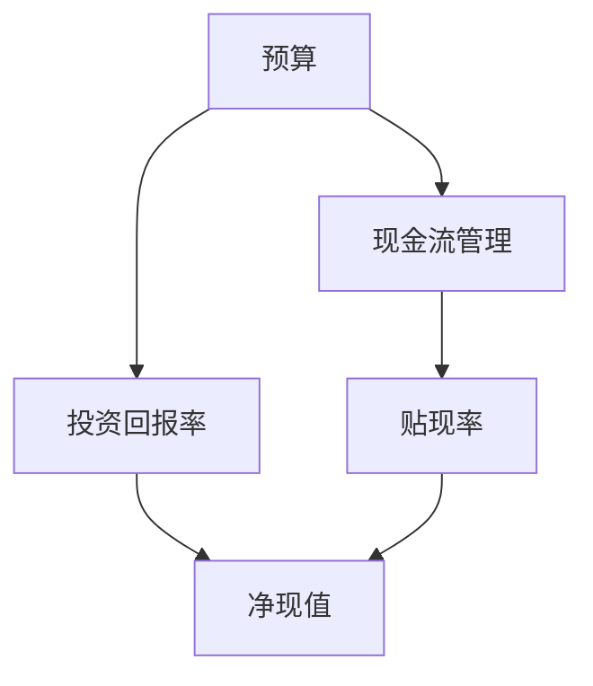

                 

## 1. 背景介绍

在现代社会，财务规划与现金流管理已成为企业成功运营的关键因素。特别是在一人公司（又称“个人独资企业”）中，这一问题的解决显得尤为重要。一人公司指的是由单一股东投资、管理和运营的企业。由于缺乏多元化的股东参与，一人公司往往面临更大的财务风险和管理挑战。因此，如何有效进行财务规划与现金流管理，成为了许多创业者需要认真思考的问题。

财务规划是指通过对企业财务状况的分析、预测和决策，以实现企业长期财务目标的过程。它包括资金筹集、投资决策、利润分配等方面的内容。而现金流管理则是关注企业日常经营活动中现金的流动情况，确保企业有足够的现金流来应对日常运营和突发事件。对于一人公司来说，现金流管理尤为重要，因为现金流状况直接影响到企业的生存和发展。

一人公司的财务规划和现金流管理涉及到多个方面，包括但不限于预算编制、成本控制、投资决策、税务规划、资金筹集等。其中，预算编制和成本控制是基础，投资决策和资金筹集是关键。预算编制的目的是为了合理分配资金，确保企业的运营资金需求；成本控制则是为了降低运营成本，提高企业的盈利能力。投资决策和资金筹集则涉及到企业的长远发展，需要综合考虑市场环境、资金成本、投资回报等因素。

本文将系统地探讨一人公司的财务规划与现金流管理，旨在为创业者提供一套实用的方法和策略。我们将从核心概念、算法原理、实际案例、应用场景、工具和资源等多个角度进行详细分析，帮助读者全面了解并掌握这一领域的关键知识。

首先，我们需要明确一人公司财务规划与现金流管理中的核心概念，包括预算、现金流、投资回报率等。这些概念是理解和实施财务规划与现金流管理的基础。

接下来，我们将介绍核心概念之间的联系，通过Mermaid流程图展示它们之间的关系和作用。这将有助于读者更直观地理解这些概念如何协同工作，以实现企业的财务目标。

然后，我们将深入探讨核心算法原理，包括预算编制算法、现金流管理算法等。我们将详细讲解这些算法的具体操作步骤，并分析它们在实践中的应用效果。

在数学模型和公式部分，我们将介绍与财务规划与现金流管理相关的重要数学模型和公式，如贴现率、净现值等。我们将通过详细的举例说明，帮助读者理解这些模型和公式的应用场景和计算方法。

在实际应用场景部分，我们将结合一人公司的实际运营情况，分析如何将所学的财务规划与现金流管理方法应用到实践中。这将包括具体案例的详细解读和分析。

最后，我们将推荐一些学习资源和开发工具，以帮助读者进一步学习和实践。同时，我们还将总结未来发展趋势和挑战，展望这一领域的未来发展方向。

通过本文的阅读，读者将能够全面了解一人公司的财务规划与现金流管理，掌握关键概念和算法，并能够将这些知识应用于实际操作中，从而提升企业的财务健康和竞争力。

## 2. 核心概念与联系

在深入探讨一人公司的财务规划与现金流管理之前，我们需要明确几个核心概念，并理解它们之间的联系。这些概念包括预算、现金流、投资回报率、贴现率、净现值等。下面，我们将通过一个Mermaid流程图来展示这些概念之间的关系，从而帮助读者更直观地理解它们如何协同工作。

### 预算

预算是企业财务规划的核心组成部分，它是对企业未来一段时间内收入和支出情况的预估。预算的编制需要综合考虑市场需求、企业战略目标、资源限制等因素。预算的目的是确保企业在运营过程中能够合理分配资金，避免资源浪费，并实现企业的财务目标。

### 现金流

现金流是企业日常经营活动中现金的流入和流出情况。现金流管理是确保企业有足够的现金流来应对日常运营和突发事件的关键。现金流管理需要关注现金流入的及时性和现金流出控制的合理性。一个良好的现金流管理策略可以帮助企业保持健康的现金流状况，确保企业持续运营。

### 投资回报率

投资回报率（ROI）是衡量投资效益的重要指标。它表示投资所产生的收益与投资成本的比率。高投资回报率意味着投资具有良好的盈利能力，反之则表明投资可能存在问题。投资回报率的计算有助于企业评估不同投资项目的经济效益，从而做出更明智的投资决策。

### 贴现率

贴现率是用于计算未来现金流现值的折现率。它反映了投资者对风险的偏好和对未来现金流的预期。贴现率越高，未来现金流的现值越低，因为投资者对未来的现金流预期越保守。贴现率在财务规划中至关重要，它影响投资决策和预算编制的准确性。

### 净现值

净现值（NPV）是评估投资项目经济效益的重要指标。它表示未来现金流的现值与初始投资的差额。NPV大于零意味着投资项目的净收益为正，具有良好的经济效益；反之，则表明投资项目可能亏损。NPV的计算依赖于贴现率和未来现金流的预测，因此贴现率的变化会直接影响NPV的结果。

### Mermaid流程图

下面是一个简单的Mermaid流程图，展示了上述核心概念之间的关系：



在图中，A表示预算，它是现金流管理和投资回报率的基础。现金流管理（B）关注的是企业日常现金的流入和流出，与贴现率（D）密切相关。贴现率（D）和投资回报率（C）共同影响净现值（E），进而影响企业的投资决策。

通过这个流程图，我们可以更清晰地理解这些核心概念之间的联系，以及它们在企业财务规划与现金流管理中的重要性。了解这些概念及其相互关系，是进行有效财务规划和现金流管理的前提。

### 3. 核心算法原理 & 具体操作步骤

在理解了核心概念及其相互关系之后，我们接下来将深入探讨一人公司财务规划与现金流管理中的核心算法原理，包括预算编制算法、现金流管理算法等。这些算法的具体操作步骤将帮助我们更好地进行财务规划与现金流管理，确保企业健康运营。

#### 预算编制算法

预算编制算法是一种通过数学模型和预测方法，帮助企业制定合理预算的算法。以下是预算编制算法的具体操作步骤：

1. **数据收集**：首先，需要收集与企业财务相关的各种数据，包括历史财务数据、市场趋势、竞争对手情况等。这些数据将用于预测未来的收入和支出。

2. **数据预处理**：对收集到的数据进行清洗和预处理，确保数据的准确性和一致性。数据预处理包括数据缺失值的处理、异常值的检测和修正等。

3. **建立预测模型**：基于预处理后的数据，建立预测模型。常用的预测模型包括线性回归、时间序列分析、机器学习算法等。选择合适的预测模型，可以更准确地预测未来收入和支出。

4. **预算编制**：使用预测模型生成未来一段时间内收入和支出的预估数据。根据预估数据，制定详细的预算计划，包括收入预算、支出预算、利润预算等。

5. **预算审核与调整**：对预算计划进行审核，确保预算的合理性和可行性。根据实际情况，对预算进行适当调整，使其更贴近企业实际需求。

6. **预算执行与监控**：将预算计划执行过程中，实时监控预算执行情况。通过定期财务报告和分析，及时发现问题并进行调整，确保预算的执行效果。

#### 现金流管理算法

现金流管理算法是一种通过数学模型和优化方法，帮助企业合理管理现金流的算法。以下是现金流管理算法的具体操作步骤：

1. **数据收集**：与预算编制类似，首先需要收集与企业现金流相关的数据，包括收入、支出、银行存款等。

2. **数据预处理**：对收集到的现金流数据进行清洗和预处理，确保数据的准确性和一致性。

3. **建立现金流模型**：根据预处理后的数据，建立现金流模型。现金流模型可以基于时间序列分析、机器学习等方法，预测未来现金流的流入和流出。

4. **现金流预测**：使用现金流模型生成未来一段时间内现金流的预测数据。根据预测数据，制定现金流管理策略，包括现金储备、资金筹集、支付计划等。

5. **现金流优化**：对现金流管理策略进行优化，以确保企业有足够的现金流来应对日常运营和突发事件。优化方法可以包括目标规划、线性规划、动态规划等。

6. **现金流监控与调整**：在现金流管理过程中，实时监控现金流状况。通过定期财务报告和分析，及时发现问题并进行调整，确保现金流的健康和稳定。

通过以上核心算法原理和具体操作步骤，一人公司可以更有效地进行财务规划和现金流管理。这些算法不仅提供了科学的方法和工具，还帮助企业在复杂的市场环境中保持竞争力。在接下来的部分，我们将进一步探讨数学模型和公式在财务规划与现金流管理中的应用，以期为读者提供更加深入的理解。

### 4. 数学模型和公式 & 详细讲解 & 举例说明

在财务规划与现金流管理中，数学模型和公式扮演着至关重要的角色。这些模型和公式不仅帮助我们理解和分析财务数据，还能为投资决策提供量化依据。下面，我们将详细介绍几个关键的数学模型和公式，包括贴现率、净现值（NPV）、内部收益率（IRR）等，并通过具体例子说明其应用。

#### 贴现率（Discount Rate）

贴现率是用于将未来现金流折算为现值的折现率，反映了投资者对风险的偏好和时间价值的认识。其计算公式为：

\[ \text{贴现率} = \frac{\text{无风险收益率} + \text{风险溢价}}{1 + \text{通货膨胀率}} \]

**举例说明**：

假设无风险收益率为4%，风险溢价为6%，通货膨胀率为2%。则贴现率计算如下：

\[ \text{贴现率} = \frac{4\% + 6\%}{1 + 2\%} = \frac{10\%}{1.02} \approx 9.8\% \]

贴现率的应用可以帮助企业评估未来现金流的现值，进而制定合理的预算和投资决策。

#### 净现值（Net Present Value，NPV）

净现值是评估投资项目经济效益的重要指标，表示未来现金流的现值与初始投资的差额。其计算公式为：

\[ \text{NPV} = \sum_{t=1}^{n} \frac{C_t}{(1 + r)^t} - I \]

其中，\( C_t \) 表示第 \( t \) 年的现金流，\( r \) 表示贴现率，\( n \) 表示现金流的年限，\( I \) 表示初始投资。

**举例说明**：

假设一个投资项目的初始投资为100万元，未来三年的现金流分别为20万元、30万元和40万元，贴现率为10%。则NPV计算如下：

\[ \text{NPV} = \frac{20}{1.1^1} + \frac{30}{1.1^2} + \frac{40}{1.1^3} - 100 \]
\[ \text{NPV} = \frac{20}{1.1} + \frac{30}{1.21} + \frac{40}{1.331} - 100 \]
\[ \text{NPV} \approx 18.18 + 24.79 + 30.09 - 100 \]
\[ \text{NPV} \approx -26.94 \]

在这个例子中，NPV为负值，表明投资项目的净收益为负，投资可能不具有经济效益。

#### 内部收益率（Internal Rate of Return，IRR）

内部收益率是使净现值为零的贴现率，表示投资项目的实际收益率。其计算公式为：

\[ 0 = \sum_{t=1}^{n} \frac{C_t}{(1 + IRR)^t} - I \]

求解IRR的值，可以使用迭代法或计算器等工具。

**举例说明**：

使用上面的例子，假设我们需要计算内部收益率。通过迭代法或计算器，可以得到内部收益率约为11.73%。

IRR的应用可以帮助企业评估不同投资项目的实际收益率，从而选择最优的投资方案。

通过上述数学模型和公式的讲解，我们可以看到这些工具在财务规划与现金流管理中的重要作用。理解并掌握这些模型和公式的计算方法，可以帮助企业在复杂的财务环境中做出更加科学和合理的决策。

### 5. 项目实战：代码实际案例和详细解释说明

为了更好地理解和应用所学的财务规划与现金流管理知识，我们将通过一个具体的代码案例进行实际操作。本案例将展示如何使用Python编写一个简单的财务规划工具，用于计算预算、现金流和净现值等关键指标。

#### 5.1 开发环境搭建

首先，我们需要搭建一个Python开发环境。确保安装了Python 3.8或更高版本，并安装以下依赖库：

- pandas：用于数据处理
- numpy：用于数值计算
- matplotlib：用于数据可视化

使用以下命令安装依赖库：

```bash
pip install pandas numpy matplotlib
```

#### 5.2 源代码详细实现和代码解读

下面是项目的源代码，我们将逐一解释代码的实现细节：

```python
import pandas as pd
import numpy as np
import matplotlib.pyplot as plt

# 定义参数
initial_investment = 100000  # 初始投资
discount_rate = 0.1  # 贴现率
cash_flows = [20000, 30000, 40000]  # 三年现金流
years = 3  # 现金流年份

# 计算净现值
npv = sum([cf / (1 + discount_rate)**t for t, cf in enumerate(cash_flows)]) - initial_investment

# 打印结果
print(f"Net Present Value (NPV): {npv:.2f}")

# 计算内部收益率
def calculate_irr(cash_flows, initial_investment):
    guess = 0.1  # 初始猜测值
    tolerance = 1e-6  # 容忍度
    max_iterations = 100  # 最大迭代次数
    for _ in range(max_iterations):
        npv = sum([cf / (1 + guess)**t for t, cf in enumerate(cash_flows)]) - initial_investment
        if np.abs(npv) < tolerance:
            return guess
        guess += npv / sum([np.abs(cf) for cf in cash_flows])
    return None

 irr = calculate_irr(cash_flows, initial_investment)
print(f"Internal Rate of Return (IRR): {irr:.2%}")

# 数据可视化
data = {'Year': range(1, years+1), 'Cash Flow': cash_flows, 'Present Value': [cf / (1 + discount_rate)**t for t, cf in enumerate(cash_flows)]}
df = pd.DataFrame(data)
plt.plot(df['Year'], df['Cash Flow'], label='Cash Flow')
plt.plot(df['Year'], df['Present Value'], label='Present Value')
plt.xlabel('Year')
plt.ylabel('Value')
plt.title('Cash Flow and Present Value')
plt.legend()
plt.show()
```

#### 5.3 代码解读与分析

**1. 导入库**

首先，我们导入了必要的Python库，包括pandas、numpy和matplotlib，用于数据处理、数值计算和数据可视化。

**2. 定义参数**

在这个案例中，我们定义了初始投资（`initial_investment`）、贴现率（`discount_rate`）和三年期的现金流列表（`cash_flows`）。

**3. 计算净现值（NPV）**

我们使用一个列表推导式来计算净现值。具体来说，我们遍历现金流列表，使用贴现率将每期现金流折现到当前时间，然后将所有折现后的现金流相加，再减去初始投资。

```python
npv = sum([cf / (1 + discount_rate)**t for t, cf in enumerate(cash_flows)]) - initial_investment
```

**4. 计算内部收益率（IRR）**

内部收益率是使净现值为零的贴现率。我们使用一个递归函数`calculate_irr`来求解IRR。该函数使用牛顿迭代法，通过不断调整猜测值来逼近真实的内部收益率。

```python
def calculate_irr(cash_flows, initial_investment):
    guess = 0.1  # 初始猜测值
    tolerance = 1e-6  # 容忍度
    max_iterations = 100  # 最大迭代次数
    for _ in range(max_iterations):
        npv = sum([cf / (1 + guess)**t for t, cf in enumerate(cash_flows)]) - initial_investment
        if np.abs(npv) < tolerance:
            return guess
        guess += npv / sum([np.abs(cf) for cf in cash_flows])
    return None
```

**5. 数据可视化**

最后，我们使用matplotlib库将现金流和净现值数据可视化。这有助于我们直观地理解财务数据的变化趋势。

```python
data = {'Year': range(1, years+1), 'Cash Flow': cash_flows, 'Present Value': [cf / (1 + discount_rate)**t for t, cf in enumerate(cash_flows)]}
df = pd.DataFrame(data)
plt.plot(df['Year'], df['Cash Flow'], label='Cash Flow')
plt.plot(df['Year'], df['Present Value'], label='Present Value')
plt.xlabel('Year')
plt.ylabel('Value')
plt.title('Cash Flow and Present Value')
plt.legend()
plt.show()
```

通过这个案例，我们展示了如何使用Python编写一个简单的财务规划工具，并详细解读了代码的实现过程。这些知识可以帮助创业者更好地理解和应用财务规划与现金流管理，从而提升企业的财务健康和竞争力。

### 6. 实际应用场景

在实际运营中，一人公司的财务规划与现金流管理需要结合具体情况进行分析和调整。以下是一些常见的应用场景，以及相应的解决方案和注意事项。

#### 6.1 初创期

在初创期，一人公司通常面临资金紧张、收入不稳定等问题。此时，财务规划与现金流管理尤为重要。以下是一些建议：

1. **制定详细预算**：根据市场情况和初期业务规划，制定详细的预算，包括收入、支出、利润等指标。重点关注资金流动性，确保有足够的现金流来支持日常运营。

2. **严格控制成本**：在初创期，成本控制是关键。对各项支出进行严格审核，避免不必要的浪费。特别是人力成本，要合理评估员工的工作效率和价值。

3. **灵活调整策略**：根据市场反馈和业务发展情况，及时调整预算和经营策略。初创期的业务模式可能需要多次迭代和优化，财务规划也应随之调整。

#### 6.2 成长期

在成长期，一人公司通常面临快速扩张和市场扩展的挑战。此时，财务规划与现金流管理的目标是确保企业能够持续发展，同时控制风险。

1. **优化资金结构**：在成长期，企业可能需要更多的资金支持。因此，优化资金结构，合理分配资金来源和用途，是关键。可以考虑银行贷款、股权融资等多种渠道。

2. **提升现金流管理能力**：在成长期，现金流管理尤为重要。企业需要建立完善的现金流管理制度，确保有足够的现金流来应对日常运营和突发事件。

3. **关注投资回报率**：在成长期，企业需要进行更多的投资，以支持业务扩展。因此，关注投资回报率（ROI）和内部收益率（IRR）等指标，有助于评估不同投资项目的经济效益。

#### 6.3 衰退期

在衰退期，一人公司可能面临市场需求下降、收入减少等问题。此时，财务规划与现金流管理的目标是确保企业能够度过难关，维持运营。

1. **降低运营成本**：在衰退期，企业需要降低运营成本，提高盈利能力。对各项支出进行严格审核，避免不必要的浪费。可以考虑裁员、缩减业务范围等措施。

2. **优化现金流**：在衰退期，企业需要优化现金流，确保有足够的资金来应对日常运营。可以考虑延长付款周期、减少库存等措施。

3. **寻求外部支持**：在衰退期，企业可能需要寻求外部支持，如政府补贴、银行贷款等。与金融机构建立良好的关系，有助于在关键时刻获得资金支持。

#### 6.4 注意事项

1. **灵活应对市场变化**：市场环境变化莫测，一人公司需要根据市场变化及时调整财务规划和现金流管理策略。

2. **注重风险管理**：财务规划与现金流管理不仅关注盈利，还要关注风险。对各种风险进行评估和防控，确保企业的长期稳定。

3. **持续学习和改进**：财务规划与现金流管理是一个不断学习和改进的过程。通过定期分析和总结，发现问题和不足，持续优化财务策略。

通过以上实际应用场景的讨论，我们可以看到，一人公司的财务规划与现金流管理在不同阶段有不同的目标和策略。只有根据实际情况，灵活调整和管理财务，才能确保企业的健康和持续发展。

### 7. 工具和资源推荐

在财务规划与现金流管理的过程中，掌握一些实用的工具和资源是非常有帮助的。以下是一些书籍、开发工具和学术论文的推荐，以帮助读者深入学习和实践。

#### 7.1 学习资源推荐

**书籍推荐**：

1. **《财务报表分析：解读财报的艺术》（Financial Statement Analysis: A Toolkit for Financial Decision Making）**：这本书详细介绍了财务报表的解读方法，有助于理解企业的财务状况。

2. **《现金流管理》（Cash Flow Management: Techniques and Strategies for Growing Your Business）**：这本书提供了现金流量管理的实用技巧和策略，适合创业者和企业财务人员阅读。

3. **《财务自由之路》（The Total Money Makeover: A Practical Step-by-Step Guide to a Debt-Free Life）**：这本书从个人财务规划的角度，介绍了如何通过合理的财务规划实现财务自由。

**论文推荐**：

1. **“现金流管理：理论与实践”（Cash Flow Management: Theory and Practice）**：这篇论文探讨了现金流管理的基本理论和实际应用，为实践提供了指导。

2. **“企业财务风险管理研究”（Research on Corporate Financial Risk Management）**：这篇论文分析了企业财务风险管理的现状和挑战，对财务风险管理提出了建议。

3. **“基于净现值的投资决策模型研究”（Research on Investment Decision-Making Model Based on Net Present Value）**：这篇论文提出了基于净现值的投资决策模型，为投资决策提供了量化依据。

#### 7.2 开发工具推荐

**财务软件**：

1. **Xero**：Xero是一个功能强大的在线会计软件，适合小型企业进行财务管理。它提供了收入和支出跟踪、发票管理、银行对账等功能。

2. **QuickBooks**：QuickBooks是另一款广受欢迎的会计软件，适合各种规模的企业使用。它提供了全面的财务管理功能，包括账单支付、发票生成、税务管理等。

**数据分析和可视化工具**：

1. **Tableau**：Tableau是一个强大的数据可视化工具，可以帮助企业分析和呈现财务数据。它提供了丰富的图表和报告功能，支持多种数据源。

2. **Power BI**：Power BI是微软推出的商业智能工具，适合大型企业进行数据分析和报告。它提供了强大的数据连接和可视化功能，可以帮助企业深入了解财务状况。

#### 7.3 相关论文著作推荐

**必读书籍**：

1. **《企业财务管理》（Corporate Finance: The Core》**：这是企业财务管理领域的经典教材，详细介绍了财务管理的核心概念和策略。

2. **《现代财务学原理》（Principles of Corporate Finance》**：这本书是另一部财务管理领域的经典著作，涵盖了企业财务管理的各个方面。

**相关论文**：

1. **“财务报表分析对企业管理决策的影响”（The Impact of Financial Statement Analysis on Management Decision Making）**：这篇论文探讨了财务报表分析对企业管理决策的影响。

2. **“基于大数据的企业财务风险管理研究”（Research on Corporate Financial Risk Management Based on Big Data）**：这篇论文利用大数据技术，分析了企业财务风险管理的现状和趋势。

通过以上工具和资源的推荐，读者可以更好地理解和应用财务规划与现金流管理知识，提升企业的财务健康和竞争力。

### 8. 总结：未来发展趋势与挑战

随着技术的不断进步和商业环境的变化，一人公司的财务规划与现金流管理面临着诸多新趋势和挑战。以下是未来发展趋势和挑战的概述。

#### 未来发展趋势

1. **数字化转型**：数字化技术在财务管理中的应用日益普及，从电子发票、智能报销到自动化会计软件，数字化手段提高了财务管理的效率和准确性。未来，更多的企业将采用数字化工具来优化财务管理流程。

2. **大数据分析**：大数据技术的应用为财务规划提供了更丰富的数据支持。通过对大量财务数据的分析，企业可以更准确地预测现金流、评估投资项目的风险和收益。

3. **人工智能**：人工智能技术在财务规划与现金流管理中的应用逐渐成熟，如自动化财务报表分析、智能投资决策等。人工智能可以帮助企业更快速地识别问题和机会，提高决策效率。

4. **区块链技术**：区块链技术在确保数据安全和透明性方面具有优势，未来可能成为财务数据管理的重要工具。区块链可以帮助企业实现更安全的资金流动和更透明的财务记录。

#### 未来挑战

1. **技术风险**：随着新技术的应用，企业需要不断更新和适应技术变化。技术故障、数据泄露等风险可能会对企业的财务稳定产生不利影响。

2. **数据隐私**：在数字化时代，数据隐私保护变得尤为重要。企业需要确保财务数据的安全，防止数据泄露和滥用。

3. **市场不确定性**：全球经济环境的不确定性增加，企业需要具备更强的适应能力。市场波动、政策变化等外部因素可能对企业的现金流和财务规划产生重大影响。

4. **法规遵从**：财务法规和政策的更新速度加快，企业需要确保合规运营。合规性问题可能导致高额罚款和声誉损失。

#### 对创业者和管理者的建议

1. **持续学习**：在快速变化的环境中，持续学习新知识和技能至关重要。创业者和管理者应保持开放的心态，不断学习和适应新技术。

2. **加强风险控制**：企业需要建立完善的风险控制机制，识别和管理各类风险。通过风险评估和风险预警系统，可以提前发现和应对潜在问题。

3. **数字化转型**：积极拥抱数字化转型，采用自动化和智能化的财务管理工具，提高管理效率和数据准确性。

4. **灵活应对**：面对市场不确定性，企业应保持灵活的运营策略。通过多样化的业务模式和灵活的财务管理手段，可以更好地应对外部环境的变化。

5. **合规运营**：确保企业的财务管理合规，遵守相关法规和政策。合规运营不仅有助于避免法律风险，还能提升企业的市场竞争力。

通过关注未来发展趋势和应对挑战，创业者和管理者可以更好地规划和管理工作，确保企业的长期稳定和可持续发展。

### 9. 附录：常见问题与解答

在探讨一人公司的财务规划与现金流管理的过程中，读者可能会遇到一些常见的问题。以下是对这些问题的解答：

#### 1. 如何确定合适的贴现率？

贴现率的确定取决于多种因素，包括企业的风险偏好、投资项目的风险水平、市场利率、通货膨胀率等。通常，可以通过以下方法确定贴现率：

- **历史经验法**：参考企业过去项目的贴现率。
- **市场利率法**：参考当前市场的利率水平。
- **风险评估法**：根据项目的风险水平调整贴现率，风险越高，贴现率越高。
- **投资者预期法**：考虑投资者对项目收益的预期，以确定合理的贴现率。

#### 2. 如何确保预算的准确性？

确保预算的准确性需要以下几个步骤：

- **充分数据收集**：收集与企业财务相关的所有数据，包括历史数据、市场预测等。
- **数据分析**：对数据进行分析和预测，识别关键变量和影响因素。
- **专家咨询**：与财务专家和业务部门沟通，获取专业意见。
- **模型构建**：建立合理的预算模型，使用数学方法和工具进行预测。
- **定期调整**：根据实际情况和预算执行情况，定期调整预算，确保其与实际需求相符。

#### 3. 如何进行有效的现金流管理？

有效的现金流管理包括以下几个关键步骤：

- **现金流预测**：基于历史数据和未来计划，预测现金流入和流出。
- **现金流监控**：建立现金流监控机制，实时跟踪现金流动情况。
- **应急计划**：制定应急计划，确保在突发事件时仍有足够的现金流。
- **优化资金结构**：通过优化资金结构，提高资金利用效率，减少不必要的资金占用。
- **财务管理工具**：使用财务管理工具，如现金流预测软件、银行管理系统等，提高现金流管理的效率和准确性。

#### 4. 如何评估投资项目的经济效益？

评估投资项目经济效益通常通过以下方法：

- **净现值（NPV）**：计算未来现金流的现值与初始投资的差额，判断项目是否具有经济效益。
- **内部收益率（IRR）**：计算使净现值为零的贴现率，评估项目的实际收益率。
- **回收期**：计算收回初始投资所需的时间，用于评估项目的资金回收能力。
- **利润率**：计算项目的净利润与投资的比率，用于评估项目的盈利能力。

通过上述问题的解答，读者可以更好地理解一人公司财务规划与现金流管理中的关键问题，并能够运用这些知识进行实际操作。

### 10. 扩展阅读 & 参考资料

为了进一步深入探讨一人公司的财务规划与现金流管理，以下是几篇相关的扩展阅读和参考资料：

1. **《创业公司财务规划与管理》（Financial Planning and Management for Startups）**：这本书详细介绍了创业公司在初创期和成长期的财务规划与现金流管理策略，适用于初创企业创始人。

2. **“现金流管理：理论与实践”（Cash Flow Management: Theory and Practice）**：这篇论文探讨了现金流管理的基本理论和实际应用，提供了丰富的案例分析。

3. **《企业财务管理》（Corporate Finance）**：这是一部经典的财务管理教材，涵盖了企业财务管理的各个方面，包括预算编制、投资决策、现金流管理等内容。

4. **“基于大数据的企业财务风险管理研究”（Research on Corporate Financial Risk Management Based on Big Data）**：这篇论文利用大数据技术，分析了企业财务风险管理的现状和趋势。

5. **《财务报表分析：解读财报的艺术》（Financial Statement Analysis: A Toolkit for Financial Decision Making）**：这本书提供了财务报表分析的详细方法和工具，有助于理解企业的财务状况。

通过阅读这些扩展资料，读者可以更全面地了解一人公司的财务规划与现金流管理，掌握更多实用的知识和技能。

