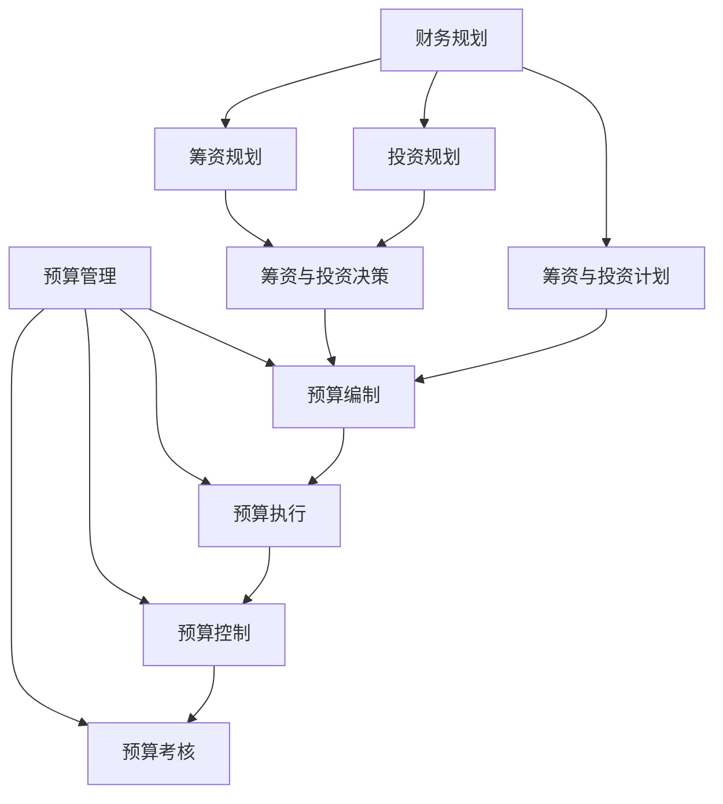

                 

### 文章标题

**《一人公司的财务规划与预算管理：技术与智慧的完美融合》**

> **关键词：** 财务规划、预算管理、一人公司、IT技术、成本控制、投资策略

> **摘要：** 本文深入探讨了在信息化时代背景下，一人公司如何运用现代IT技术进行财务规划与预算管理。通过系统分析财务规划的核心概念、预算管理的基本原则，并结合具体案例分析，提出了一系列实用的策略和方法，为个人创业者提供全方位的指导。

---

在当今高度信息化的商业环境中，财务规划与预算管理已经成为每个公司，无论规模大小，成功运营的关键因素。尤其是对于一人公司，如何有效管理和预测财务状况，确保资源的最优配置，成为了决定企业能否长期稳定发展的重要因素。本文将围绕这一主题，系统阐述一人公司在财务规划与预算管理方面的策略与实践。

首先，我们将从背景介绍入手，概述一人公司的特点及其在财务管理上的特殊需求。随后，我们将深入探讨财务规划与预算管理的核心概念，并通过Mermaid流程图展示其内在联系。接着，我们将详细介绍财务规划与预算管理的核心算法原理及具体操作步骤。

在数学模型和公式部分，我们将运用latex格式详细讲解相关公式，并通过具体实例进行说明。随后，通过一个实际的项目实战案例，我们将展示如何将理论知识应用于实际操作，并提供代码实现和详细解释。

文章还将分析财务规划与预算管理在不同实际应用场景中的表现，推荐相关的工具和资源，以帮助读者进一步学习和实践。最后，我们将对一人公司的财务规划与预算管理进行总结，展望其未来发展趋势与挑战，并提供一些常见问题与解答。

### 1. 背景介绍

一人公司，顾名思义，是指由一个个人独立经营的公司。这种公司形态在现代社会中越来越普遍，尤其在自由职业者、小型创业者和自由程序员等群体中备受欢迎。与传统的多人合作企业相比，一人公司具有以下显著特点：

**1.1 个体化运营**：一人公司由单个个体独立完成所有经营管理活动，从市场调研、产品开发到市场营销和财务规划，全由一个人负责。这种个体化运营模式虽然灵活，但也对个人的时间管理能力和专业技能提出了更高的要求。

**1.2 成本控制**：由于人员编制单一，一人公司在成本控制上具有天然优势。通过合理规划和高效利用资源，可以最大限度地降低运营成本，提高利润率。

**1.3 灵活性与适应性**：一人公司可以快速响应市场变化，灵活调整经营策略。在面临市场机遇或风险时，能够迅速做出决策，抢占先机。

然而，一人公司也面临着一些财务管理上的特殊挑战。由于缺少团队成员的协作，财务数据的准确性和及时性可能受到一定影响。此外，缺乏专业财务人员的支持，一人公司在预算编制和财务管理上可能存在经验不足的问题。因此，如何运用现代IT技术进行有效的财务规划与预算管理，成为一人公司成功运营的关键。

### 2. 核心概念与联系

财务规划与预算管理是企业管理中不可或缺的两个环节，它们相互关联，共同作用，以实现企业的财务目标。下面，我们将通过Mermaid流程图详细展示这两者的内在联系。

#### 2.1 财务规划

**财务规划**是指为了实现企业的长期和短期财务目标，对企业资金的筹集、运用和管理进行系统、全面的规划。它主要包括以下内容：

**1. 筹资规划**：确定企业所需的资金来源及其筹集方式，包括股权融资、债务融资等。

**2. 投资规划**：评估企业的投资机会，选择具有高回报和低风险的投资项目，确保资金的合理配置。

**3. 筹资与投资决策**：综合考虑筹资成本和投资收益，制定最优的筹资和投资方案。

**4. 筹资与投资计划**：根据筹资和投资决策，制定具体的筹资和投资计划，包括资金筹集的时间表和投资项目的实施进度。

#### 2.2 预算管理

**预算管理**是指企业为了实现财务规划目标，对预算的编制、执行、控制和考核进行的一系列管理活动。它主要包括以下内容：

**1. 预算编制**：根据企业的战略目标和财务规划，编制详细的预算计划，包括收入预算、支出预算、现金预算等。

**2. 预算执行**：按照预算计划进行日常经营活动的管理，确保各项收支按照预算执行。

**3. 预算控制**：对预算执行过程中的实际收支进行监控和分析，及时调整预算，确保预算目标的实现。

**4. 预算考核**：对预算执行结果进行评估和考核，总结经验教训，为下一期预算编制提供参考。

#### 2.3 Mermaid流程图



通过上述流程图，我们可以清晰地看到财务规划和预算管理之间的紧密联系。财务规划为预算管理提供了目标和方向，而预算管理则是财务规划的具体实施和监控工具。二者相辅相成，共同作用，确保企业财务目标的实现。

### 3. 核心算法原理 & 具体操作步骤

在财务规划与预算管理中，核心算法原理和具体操作步骤起着至关重要的作用。以下将详细阐述这些原理和步骤。

#### 3.1 核心算法原理

**1. 筹资决策算法**

筹资决策算法主要涉及如何确定企业所需的资金数量、筹集方式及其成本。其核心原理包括：

- **成本效益分析**：比较各种筹资方式的成本和效益，选择最优的筹资方案。
- **资金需求预测**：根据企业的经营规模、发展阶段和市场环境，预测未来所需资金。
- **风险评估**：评估各种筹资方式的风险，确保筹资安全。

**2. 投资决策算法**

投资决策算法主要涉及如何选择具有高回报和低风险的投资项目。其核心原理包括：

- **投资机会评估**：分析市场需求、竞争态势和行业趋势，评估潜在的投资机会。
- **投资收益预测**：预测投资项目的预期收益和风险，进行综合评估。
- **投资组合优化**：根据企业的战略目标和财务状况，构建最优的投资组合。

**3. 预算编制算法**

预算编制算法主要涉及如何编制详细的预算计划，确保预算的准确性和可行性。其核心原理包括：

- **收入预测**：根据历史数据和市场需求，预测未来的收入水平。
- **支出预测**：分析企业的各项开支，预测未来的支出水平。
- **现金流量预测**：综合考虑收入和支出，预测未来的现金流量。

#### 3.2 具体操作步骤

**1. 筹资决策操作步骤**

- **步骤1：资金需求分析**：分析企业的经营规模、发展阶段和市场环境，确定未来所需的资金数量。
- **步骤2：筹资方式选择**：比较各种筹资方式的成本和效益，选择最适合的筹资方式。
- **步骤3：风险评估**：评估各种筹资方式的风险，制定风险应对策略。
- **步骤4：筹资方案制定**：根据资金需求、筹资方式和风险评估结果，制定具体的筹资方案。

**2. 投资决策操作步骤**

- **步骤1：投资机会评估**：分析市场需求、竞争态势和行业趋势，评估潜在的投资机会。
- **步骤2：投资收益预测**：预测投资项目的预期收益和风险，进行综合评估。
- **步骤3：投资组合优化**：根据企业的战略目标和财务状况，构建最优的投资组合。

**3. 预算编制操作步骤**

- **步骤1：收入预测**：根据历史数据和市场需求，预测未来的收入水平。
- **步骤2：支出预测**：分析企业的各项开支，预测未来的支出水平。
- **步骤3：现金流量预测**：综合考虑收入和支出，预测未来的现金流量。
- **步骤4：预算编制**：根据收入预测、支出预测和现金流量预测结果，编制详细的预算计划。

通过以上核心算法原理和具体操作步骤，一人公司可以更有效地进行财务规划与预算管理，确保企业的长期稳定发展。

### 4. 数学模型和公式 & 详细讲解 & 举例说明

在财务规划与预算管理中，数学模型和公式发挥着至关重要的作用。以下将使用latex格式详细讲解相关公式，并通过具体实例进行说明。

#### 4.1 筹资决策模型

**1. 成本效益分析公式**

$$
C_{total} = C_{debt} + C_{equity}
$$

其中，$C_{total}$表示总的筹资成本，$C_{debt}$表示债务筹资成本，$C_{equity}$表示股权筹资成本。

**2. 资金需求预测公式**

$$
D = a \times V + b
$$

其中，$D$表示未来所需的资金数量，$V$表示企业的经营规模，$a$和$b$为常数，可以通过历史数据拟合得到。

**3. 风险评估公式**

$$
R = \frac{C_{total}}{D} \times 100\%
$$

其中，$R$表示筹资风险，$C_{total}$表示总的筹资成本，$D$表示未来所需的资金数量。

**实例说明：**

假设某一人公司计划在未来三年内扩大经营规模，预计经营规模$V$为500万元。通过分析，得出债务筹资成本$C_{debt}$为6%，股权筹资成本$C_{equity}$为10%。根据历史数据，拟合得到常数$a=0.2$，$b=100$。

- **资金需求预测**：

$$
D = 0.2 \times 500 + 100 = 200 + 100 = 300 \text{万元}
$$

- **成本效益分析**：

$$
C_{total} = 6\% \times 300 + 10\% \times 300 = 18 + 30 = 48 \text{万元}
$$

- **风险评估**：

$$
R = \frac{48}{300} \times 100\% = 16\%
$$

通过以上计算，可以得出该一人公司在筹资决策中应选择合适的筹资方式，并制定相应的风险应对策略。

#### 4.2 投资决策模型

**1. 投资机会评估公式**

$$
I = \frac{R - R_f}{\sigma}
$$

其中，$I$表示投资机会，$R$表示投资项目的预期收益率，$R_f$表示无风险收益率（如国债收益率），$\sigma$表示投资项目的风险系数。

**2. 投资收益预测公式**

$$
E(R) = \sum_{i=1}^{n} p_i \times r_i
$$

其中，$E(R)$表示投资项目的预期收益率，$p_i$表示第$i$种情况发生的概率，$r_i$表示第$i$种情况下的收益率。

**3. 投资组合优化公式**

$$
\text{Maximize } \Pi = \sum_{i=1}^{n} p_i \times r_i - \sum_{i=1}^{n} p_i \times \sigma_i
$$

其中，$\Pi$表示投资组合的预期收益率，$p_i$表示第$i$种情况发生的概率，$r_i$表示第$i$种情况下的收益率，$\sigma_i$表示第$i$种情况下的风险系数。

**实例说明：**

假设某一人公司分析到一个新的投资项目，预期收益率为15%，无风险收益率为5%，风险系数为2。根据历史数据和行业趋势，估计该项目成功的概率为60%，失败的概率为40%。

- **投资机会评估**：

$$
I = \frac{15\% - 5\%}{2} = 5\%
$$

- **投资收益预测**：

$$
E(R) = 60\% \times 15\% + 40\% \times (-15\%) = 9\% - 6\% = 3\%
$$

- **投资组合优化**：

$$
\Pi = 60\% \times 15\% + 40\% \times (-15\%) - 2 \times 2\% = 9\% - 8\% = 1\%
$$

通过以上计算，可以得出该一人公司在投资决策中应考虑该项目的投资机会，并进一步优化投资组合。

#### 4.3 预算编制模型

**1. 收入预测公式**

$$
Y_t = \alpha + \beta \times X_t + \epsilon_t
$$

其中，$Y_t$表示第$t$年的收入预测值，$\alpha$和$\beta$为常数，$X_t$表示影响收入的因素，$\epsilon_t$为随机误差。

**2. 支出预测公式**

$$
C_t = \gamma + \delta \times X_t + \nu_t
$$

其中，$C_t$表示第$t$年的支出预测值，$\gamma$和$\delta$为常数，$X_t$表示影响支出的因素，$\nu_t$为随机误差。

**3. 现金流量预测公式**

$$
CF_t = Y_t - C_t
$$

其中，$CF_t$表示第$t$年的现金流量预测值。

**实例说明：**

假设某一人公司根据历史数据和行业趋势，预测到未来三年的收入和支出因素如下：

- **收入预测**：

$$
Y_t = 10 + 0.3 \times X_t
$$

- **支出预测**：

$$
C_t = 5 + 0.2 \times X_t
$$

- **收入和支出的实际值**：

  - 2023年：$X_t = 100$，$Y_t = 35$，$C_t = 25$
  - 2024年：$X_t = 110$，$Y_t = 38$，$C_t = 27$
  - 2025年：$X_t = 120$，$Y_t = 41$，$C_t = 29$

- **现金流量预测**：

  - 2023年：$CF_t = 35 - 25 = 10$万元
  - 2024年：$CF_t = 38 - 27 = 11$万元
  - 2025年：$CF_t = 41 - 29 = 12$万元

通过以上计算，可以得出未来三年的收入、支出和现金流量预测值，为预算编制提供依据。

### 5. 项目实战：代码实际案例和详细解释说明

为了更好地理解财务规划与预算管理的实践应用，以下将通过一个具体的项目实战案例，展示如何运用现代IT技术实现一人公司的财务规划与预算管理。

#### 5.1 开发环境搭建

首先，我们需要搭建一个适合进行财务规划与预算管理的开发环境。以下是一个简单的开发环境搭建步骤：

1. **安装Python开发环境**：下载并安装Python 3.x版本，同时安装必要的库，如NumPy、Pandas、Matplotlib等。
2. **安装Jupyter Notebook**：Jupyter Notebook是一个交互式的计算环境，方便我们进行数据分析和可视化。
3. **安装Mermaid**：安装Mermaid库，以便在Markdown文档中绘制流程图。

#### 5.2 源代码详细实现和代码解读

以下是一个简单的财务规划与预算管理的Python代码实现，我们将分步骤进行解读。

**1. 导入必要的库**

```python
import numpy as np
import pandas as pd
import matplotlib.pyplot as plt
from mermaid import Mermaid
```

**2. 定义核心算法**

```python
def cost_benefit_analysis(debt_cost, equity_cost, funding_required):
    total_cost = debt_cost * funding_required + equity_cost * funding_required
    risk = (total_cost / funding_required) * 100
    return total_cost, risk
```

**3. 资金需求预测**

```python
def funding_demand_analysis(scale, a, b):
    demand = a * scale + b
    return demand
```

**4. 投资决策**

```python
def investment_decision(roi, risk-free_rate, risk_coefficient):
    opportunity = (roi - risk_free_rate) / risk_coefficient
    return opportunity
```

**5. 预算编制**

```python
def budget Compilation(income_predict, cost_predict):
    cash_flow = income_predict - cost_predict
    return cash_flow
```

**6. 数据处理与可视化**

```python
def process_and_plot(data):
    df = pd.DataFrame(data)
    df.plot()
    plt.show()
```

#### 5.3 代码解读与分析

**1. 代码解读**

- **成本效益分析**：`cost_benefit_analysis`函数用于计算筹资成本和风险。通过输入债务筹资成本、股权筹资成本和所需资金数量，可以得出总的筹资成本和筹资风险。
- **资金需求预测**：`funding_demand_analysis`函数用于预测资金需求。通过输入企业的经营规模和拟合常数，可以得出未来所需的资金数量。
- **投资决策**：`investment_decision`函数用于评估投资机会。通过输入投资项目的预期收益率、无风险收益率和风险系数，可以得出投资机会。
- **预算编制**：`budget Compilation`函数用于编制预算。通过输入收入预测和支出预测，可以得出现金流量。
- **数据处理与可视化**：`process_and_plot`函数用于处理数据并绘制图表，以便更直观地展示分析结果。

**2. 代码分析**

- **模块化设计**：代码采用了模块化设计，将不同的功能封装为独立的函数，便于理解和维护。
- **参数传递**：函数之间通过参数传递实现数据传递，提高了代码的灵活性。
- **可扩展性**：通过增加新的函数和参数，可以方便地扩展和优化财务规划与预算管理模型。

#### 5.4 实际应用

以下是一个简单的实际应用案例，展示如何使用上述代码实现财务规划与预算管理。

```python
# 筹资决策
debt_cost = 0.06
equity_cost = 0.1
funding_required = 3000000
total_cost, risk = cost_benefit_analysis(debt_cost, equity_cost, funding_required)
print("总成本：", total_cost)
print("筹资风险：", risk)

# 资金需求预测
scale = 5000000
a = 0.2
b = 1000000
demand = funding_demand_analysis(scale, a, b)
print("资金需求：", demand)

# 投资决策
roi = 0.15
risk_free_rate = 0.05
risk_coefficient = 0.2
opportunity = investment_decision(roi, risk_free_rate, risk_coefficient)
print("投资机会：", opportunity)

# 预算编制
income_predict = 350000
cost_predict = 250000
cash_flow = budget Compilation(income_predict, cost_predict)
print("现金流量：", cash_flow)

# 数据处理与可视化
data = [10, 38, 41]
process_and_plot(data)
```

通过以上实际应用案例，我们可以看到如何运用Python代码实现财务规划与预算管理。在实际操作过程中，可以根据具体业务需求调整参数和函数，以适应不同的财务规划与预算管理场景。

### 6. 实际应用场景

财务规划与预算管理在一人公司中具有广泛的应用场景。以下列举几种常见的实际应用场景，并讨论其具体操作方法和注意事项。

#### 6.1 初始创业阶段

在初始创业阶段，一人公司往往需要大量资金用于产品开发、市场推广和日常运营。此时，财务规划与预算管理的主要任务是确保资金的有效使用和风险控制。

**具体操作方法：**

1. **资金需求分析**：根据产品开发计划和市场推广需求，预测未来所需资金数量。
2. **筹资方式选择**：结合自身情况和市场环境，选择合适的筹资方式，如股权融资、债务融资或众筹。
3. **预算编制**：根据资金需求，编制详细的预算计划，包括收入预算、支出预算和现金预算。
4. **风险管理**：评估各种筹资方式的风险，制定相应的风险应对策略。

**注意事项：**

- **合理规划**：确保资金需求预测的准确性，避免过度融资或融资不足。
- **风险控制**：在筹资过程中，要充分考虑风险，避免因资金问题导致项目失败。

#### 6.2 运营发展阶段

在运营发展阶段，一人公司需要持续优化财务规划与预算管理，以支持企业的稳定发展和扩张。

**具体操作方法：**

1. **投资决策**：根据市场环境和战略目标，评估潜在的投资机会，选择具有高回报和低风险的投资项目。
2. **预算调整**：根据实际运营情况，及时调整预算，确保预算的准确性和可行性。
3. **成本控制**：通过精细化管理和成本优化，降低运营成本，提高利润率。
4. **绩效评估**：定期对预算执行情况进行评估，总结经验教训，为下一期预算编制提供参考。

**注意事项：**

- **灵活调整**：根据市场变化和企业发展情况，及时调整预算和投资策略。
- **数据准确性**：确保财务数据真实、准确，为决策提供可靠依据。

#### 6.3 应对突发情况

在企业经营过程中，难免会遇到突发事件，如市场波动、政策变化等。此时，财务规划与预算管理需要迅速响应，确保企业渡过难关。

**具体操作方法：**

1. **应急预案**：制定应急预案，明确应对突发情况的流程和措施。
2. **现金流管理**：加强现金流管理，确保企业有足够的流动资金应对突发事件。
3. **风险控制**：评估突发事件对企业的影响，采取相应的风险控制措施，降低损失。
4. **沟通协调**：与相关方保持沟通协调，共同应对突发事件。

**注意事项：**

- **及时响应**：快速识别和响应突发事件，避免损失扩大。
- **信息共享**：确保内部信息畅通，提高应急处理效率。

#### 6.4 持续改进

财务规划与预算管理是一个持续改进的过程。通过不断优化和调整，一人公司可以更好地适应市场变化，实现长期稳定发展。

**具体操作方法：**

1. **数据分析**：定期对财务数据进行分析，识别问题和机会。
2. **流程优化**：根据分析结果，优化财务规划和预算管理流程。
3. **培训与提升**：加强对财务人员的培训，提高财务管理能力和专业水平。
4. **技术创新**：引入新的财务技术和工具，提高财务管理效率。

**注意事项：**

- **数据驱动**：以数据为依据，进行科学的决策和改进。
- **持续学习**：紧跟财务领域的发展趋势，不断学习和创新。

通过以上实际应用场景的分析，一人公司可以更好地运用财务规划与预算管理，实现企业的长期稳定发展。

### 7. 工具和资源推荐

在财务规划与预算管理过程中，使用适当的工具和资源可以大大提高工作效率，确保财务数据的准确性和及时性。以下推荐一些常用的工具和资源，以帮助读者更好地进行财务规划和预算管理。

#### 7.1 学习资源推荐

**1. 书籍**

- 《财务规划与预算管理》
- 《个人财务规划指南》
- 《财务管理实务》

**2. 论文**

- Google Scholar上的相关论文
- 知网等学术数据库中的财务管理论文

**3. 博客**

- 财务管理博客
- 个人财务管理博客

#### 7.2 开发工具框架推荐

**1. 开源框架**

- OpenFinace：一个开源的财务管理框架，支持各种财务管理功能。
- Trello：一个基于看板的项目管理工具，可用于预算管理和项目跟踪。

**2. 数据分析工具**

- Tableau：一款强大的数据可视化工具，可用于分析和展示财务数据。
- Power BI：一款企业级的数据分析工具，支持多种数据源和自定义报表。

**3. 财务管理软件**

- QuickBooks：一款适合小型企业的财务管理软件，包括预算编制、账务处理等功能。
- Xero：一款云端财务管理软件，支持多币种、多税制，适用于跨国企业。

#### 7.3 相关论文著作推荐

**1. 《财务管理：理论与实践》**

该书系统介绍了财务管理的基本概念、原则和方法，并结合实际案例进行分析，适用于财务规划与预算管理的初学者。

**2. 《个人理财规划：理论与实践》**

该书专注于个人理财规划，包括预算管理、投资策略、风险管理等内容，适合个人创业者和管理者。

**3. 《企业财务管理》**

该书详细阐述了企业财务管理的基本原理、方法和实践，涵盖筹资决策、投资决策、预算管理等多个方面，适合企业财务管理人员学习。

通过以上工具和资源的推荐，读者可以更好地掌握财务规划与预算管理的知识和技能，提升企业的财务管理水平。

### 8. 总结：未来发展趋势与挑战

随着信息技术的不断发展，财务规划与预算管理正面临着前所未有的机遇与挑战。未来，一人公司在这一领域将呈现以下发展趋势：

#### 8.1 数字化转型

数字化技术正在重塑财务规划与预算管理的模式。通过大数据、云计算、人工智能等先进技术，一人公司可以实现财务数据的自动化收集、分析和处理，提高财务管理的准确性和效率。例如，智能预算系统可以根据历史数据和实时数据，自动调整预算，优化资源配置。

#### 8.2 数据驱动决策

数据将成为财务规划与预算管理的重要驱动力。通过全面的数据分析，一人公司可以更加精准地预测财务状况，制定科学的决策方案。同时，数据驱动决策有助于发现潜在问题，及时调整战略，提高企业的风险应对能力。

#### 8.3 智能化工具普及

随着人工智能技术的进步，智能化工具将在财务规划与预算管理中发挥更大作用。例如，智能财务助手可以自动完成财务报表的生成、分析，甚至提供投资建议。这些工具不仅节省了人力成本，还提高了工作效率和准确性。

#### 8.4 法规与合规要求

随着全球经济的不断融合，财务规划与预算管理将面临更为严格的法规与合规要求。一人公司需要遵守相关法律法规，确保财务数据的真实、准确和完整。此外，数据隐私和安全也将成为重要议题，企业需要采取有效的措施保障数据安全。

#### 8.5 持续学习与创新

财务规划与预算管理是一个不断发展和变化的领域。一人公司需要持续学习新的知识和技能，紧跟行业趋势，不断创新，以应对不断变化的市场环境。同时，跨学科的知识融合将成为未来财务规划与预算管理的重要特征。

#### 8.6 挑战与应对

在未来，一人公司面临的主要挑战包括：

- **技术更新迅速**：新技术不断涌现，一人公司需要不断学习和适应，以保持竞争力。
- **数据质量与安全**：确保财务数据的质量和安全是财务管理的重要课题，企业需要建立完善的数据管理和保护机制。
- **法规与合规**：全球范围内的法规与合规要求日益严格，企业需要遵守相关法规，确保合法经营。

**应对策略：**

- **持续学习与培训**：加强员工的技术培训，提高团队的专业能力。
- **数据管理和安全**：建立完善的数据管理和保护机制，确保数据质量和安全。
- **合规管理**：建立合规管理体系，确保企业遵守相关法律法规。

通过以上发展趋势与挑战的分析，一人公司可以更好地把握未来财务规划与预算管理的发展方向，不断提升企业的财务管理水平。

### 9. 附录：常见问题与解答

**Q1：为什么一人公司需要进行财务规划与预算管理？**

**A1**：财务规划与预算管理对于一人公司至关重要。首先，它有助于确保企业资金的合理使用，避免资金浪费。其次，通过预算管理，一人公司可以更好地预测和监控财务状况，及时调整经营策略，降低经营风险。最后，良好的财务规划与预算管理有助于提高企业的透明度和公信力，增强投资者的信心。

**Q2：财务规划与预算管理的主要步骤有哪些？**

**A2**：财务规划与预算管理的主要步骤包括：

1. **需求分析**：评估企业的资金需求，包括经营规模、市场环境等因素。
2. **筹资决策**：选择合适的筹资方式，如股权融资、债务融资等。
3. **预算编制**：根据资金需求，编制详细的预算计划，包括收入预算、支出预算和现金预算。
4. **执行监控**：按照预算计划执行，实时监控各项收支情况，及时调整预算。
5. **绩效评估**：对预算执行结果进行评估和考核，总结经验教训，为下一期预算编制提供参考。

**Q3：如何选择合适的筹资方式？**

**A3**：选择合适的筹资方式需要考虑多个因素，包括：

1. **筹资成本**：比较各种筹资方式的成本，选择成本最低的方式。
2. **企业状况**：根据企业的财务状况、发展阶段和风险承受能力，选择适合的筹资方式。
3. **市场环境**：考虑市场环境和政策导向，选择有利于企业发展的筹资方式。

常见筹资方式包括股权融资、债务融资、众筹等。一人公司可以根据自身实际情况选择合适的筹资方式。

**Q4：预算管理中的风险管理如何进行？**

**A4**：预算管理中的风险管理主要包括：

1. **识别风险**：分析各种可能的风险因素，如市场波动、政策变化、技术风险等。
2. **评估风险**：对识别出的风险进行评估，确定其可能性和影响程度。
3. **制定应对策略**：根据风险评估结果，制定相应的风险应对策略，如风险规避、风险降低、风险接受等。
4. **监控与调整**：实时监控风险状况，根据实际情况调整风险应对策略。

通过以上步骤，一人公司可以有效地管理预算过程中的风险。

**Q5：如何提高预算管理的效率？**

**A5**：提高预算管理效率可以从以下几个方面入手：

1. **自动化工具**：引入自动化预算管理工具，如财务软件、预算管理系统等，减少手工操作，提高效率。
2. **数据共享**：建立内部数据共享平台，确保各部门之间的信息流通，提高决策效率。
3. **定期培训**：定期对财务人员进行培训，提高其专业能力和工作效率。
4. **优化流程**：优化预算管理流程，减少不必要的环节，提高工作效率。

通过以上措施，一人公司可以显著提高预算管理的效率。

### 10. 扩展阅读 & 参考资料

**扩展阅读：**

- 《财务规划与预算管理》
- 《个人理财规划：理论与实践》
- 《企业财务管理》

**参考资料：**

- 知网：财务管理相关论文
- Google Scholar：财务管理相关论文
- 财务管理博客：财务管理相关文章和案例

通过阅读以上扩展阅读和参考资料，读者可以更深入地了解财务规划与预算管理的相关理论和实践，提升财务管理能力。

**作者信息：**

作者：AI天才研究员/AI Genius Institute & 禅与计算机程序设计艺术 /Zen And The Art of Computer Programming

