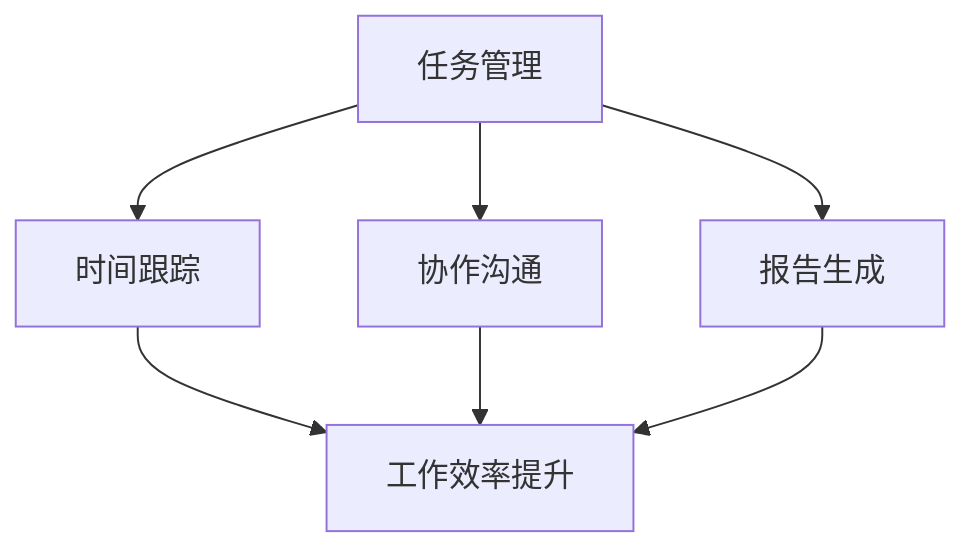
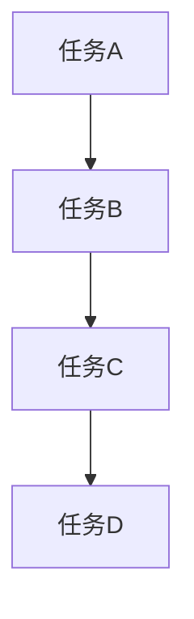

                 

# 一人公司的项目管理工具与效率提升

> **关键词：** 项目管理、一人公司、效率提升、敏捷开发、工具选择、流程优化、实践分享

> **摘要：** 本文将深入探讨一人公司如何在有限资源下通过合适的项目管理工具和方法提升个人工作效率，实现项目目标和成果最大化。我们将分析几种流行的项目管理工具，结合具体实践案例，提供实用的建议和策略。

## 1. 背景介绍

在当今快速变化的市场环境中，小型公司和个人创业者面临的挑战愈发显著。特别是在一人公司的情况下，管理者不仅要扮演多种角色，还要应对各种资源和时间限制。项目管理的核心在于协调资源、控制进度、确保质量并最终实现项目目标。然而，对于仅有一名员工的公司，传统的项目管理方法可能显得过于复杂和繁琐。因此，寻找适合一人公司的项目管理工具和策略，成为提升工作效率和实现项目成功的关键。

本文旨在为一人公司的管理者提供一套实用的项目管理工具和方法，通过具体案例和实战经验，帮助读者理解并应用这些工具，实现个人和项目的成长。

## 2. 核心概念与联系

### 项目管理工具的四大核心概念

项目管理工具的选择和使用，首先需要理解四个核心概念：任务管理、时间跟踪、协作沟通和报告生成。

1. **任务管理**：任务管理是项目管理的基石。它涉及任务的分配、进度跟踪和完成状态的更新。有效的任务管理可以帮助确保项目目标的实现。

2. **时间跟踪**：时间跟踪是指对项目执行过程中的时间消耗进行记录和分析。这有助于识别时间瓶颈和资源利用率，进而优化工作流程。

3. **协作沟通**：协作沟通是指项目团队成员之间的信息交流。对于一人公司，虽然没有传统的团队，但有效的沟通仍然至关重要，包括与客户、供应商或其他合作伙伴的沟通。

4. **报告生成**：报告生成是对项目执行情况的总结和记录。定期生成的报告可以帮助管理者了解项目的健康状况，做出及时的调整。

### 项目管理工具与工作效率提升的关系

项目管理工具能够提高工作效率的主要方式如下：

1. **自动化流程**：通过自动化任务分配、进度更新和报告生成，减少手动操作，节省时间。

2. **实时数据跟踪**：实时跟踪任务和项目进度，使得管理者能够迅速发现和解决问题，避免项目偏离轨道。

3. **协作与沟通**：提供便捷的沟通渠道，确保信息流通顺畅，提高决策效率。

4. **可视化展示**：通过图表和报告，将复杂的项目信息以可视化方式展示，使得决策更加直观。

### Mermaid 流程图

以下是一个简化的项目管理工具与工作效率提升的Mermaid流程图，展示了各概念之间的关系：



在这个流程图中，任务管理、时间跟踪、协作沟通和报告生成共同作用，最终实现工作效率的提升。

## 3. 核心算法原理 & 具体操作步骤

### 敏捷开发与Scrum框架

敏捷开发是一种以人为核心、迭代和循序渐进的开发方法。Scrum是敏捷开发中的一种框架，特别适合一人公司使用。

#### Scrum的核心概念

1. **Sprint**：Sprint是固定时间周期（通常为2-4周）的工作单元。每个Sprint结束时，应交付一个可用的产品版本。

2. **产品待办事项**：产品待办事项是项目的所有任务清单，由优先级最高的任务组成。

3. **每日站会**：每日站会是团队（尽管只有一人）每天花10-15分钟进行的简短会议，用于讨论任务进度、问题和计划。

4. **回顾会议**：回顾会议在每个Sprint结束后举行，用于评估Sprint的表现，并讨论改进措施。

#### 具体操作步骤

1. **规划Sprint**：在每个Sprint开始时，选择下一个Sprint的产品待办事项，并根据优先级制定Sprint计划。

2. **执行Sprint**：在Sprint期间，每天举行每日站会，确保任务按计划进行。

3. **完成Sprint**：在Sprint结束时，完成所有计划任务，并举行回顾会议，总结经验和教训。

4. **迭代优化**：根据回顾会议的结果，调整产品待办事项和Sprint计划，优化下一个Sprint。

### 时间管理和优先级设定

时间管理和优先级设定是提升工作效率的关键。以下是几种常用的时间管理和优先级设定方法：

1. **时间块**：将工作时间分为几个固定的块，每个块专注于一项任务。这种方法有助于减少任务切换带来的效率损失。

2. **优先级矩阵**：使用优先级矩阵（如Eisenhower矩阵）来区分任务的重要性和紧急性，并根据优先级安排任务。

3. **番茄工作法**：将工作时间分为25分钟的工作周期（称为“番茄”）和5分钟的休息周期。这种方法有助于提高专注度和效率。

### 项目管理工具的设置与使用

选择合适的项目管理工具对于一人公司的管理者至关重要。以下是一些常用的项目管理工具及其基本设置方法：

1. **Trello**：使用Trello创建任务卡片，将任务分为不同的列表（如“待办”、“进行中”、“已完成”）。通过设置标签和过滤器，可以方便地跟踪任务状态。

2. **Asana**：Asana提供了丰富的功能，包括任务分配、时间跟踪和报告生成。通过创建项目和工作区，可以有效地管理多个任务和项目。

3. **JIRA**：JIRA是一个强大的敏捷开发工具，特别适合开发项目。通过设置Scrum板和看板，可以直观地跟踪项目进度。

## 4. 数学模型和公式 & 详细讲解 & 举例说明

### 项目进度评估的数学模型

项目进度评估是项目管理中至关重要的一环。以下是一种常用的进度评估模型：关键路径法（Critical Path Method，CPM）。

#### 关键路径法（CPM）

关键路径法是一种基于网络图的项目管理技术，用于计算项目最早完成时间和最晚完成时间，以及确定项目关键路径。

1. **网络图**：网络图是一种表示项目任务及其依赖关系的图形表示方法。每个任务用节点表示，任务间的依赖关系用箭头表示。

2. **最早开始时间（ES）和最早完成时间（EF）**：最早开始时间是指任务可以在最早什么时候开始。最早完成时间是指任务可以在最早什么时候完成。

3. **最迟开始时间（LS）和最迟完成时间（LF）**：最迟开始时间是指任务可以在最迟什么时候开始，而不会影响项目总时间。最迟完成时间是指任务可以在最迟什么时候完成，而不会影响项目总时间。

4. **关键路径**：关键路径是指项目中最长的路径，决定了项目的最短完成时间。在关键路径上的任务被称为关键任务。

#### 公式

1. **最早开始时间（ES）**：

   ES = max(前置任务的EF)

2. **最早完成时间（EF）**：

   EF = ES + 任务持续时间

3. **最迟开始时间（LS）**：

   LS = min(后续任务的最迟完成时间 - 任务持续时间)

4. **最迟完成时间（LF）**：

   LF = LS + 任务持续时间

5. **关键路径**：

   关键路径上的所有任务都有相同的ES和LF。

### 举例说明

假设一个项目包括以下任务（假设每个任务的持续时间为2天）：

1. 任务A（持续2天）
2. 任务B（持续3天）
3. 任务C（持续2天）
4. 任务D（持续3天）

任务间的依赖关系如下：

- 任务A完成后，才能开始任务B
- 任务B完成后，才能开始任务C
- 任务C完成后，才能开始任务D

#### 步骤1：绘制网络图



#### 步骤2：计算最早开始时间和最早完成时间

1. **任务A**：

   - ES(A) = 0（无前置任务）
   - EF(A) = ES(A) + 2 = 0 + 2 = 2

2. **任务B**：

   - ES(B) = EF(A) = 2
   - EF(B) = ES(B) + 3 = 2 + 3 = 5

3. **任务C**：

   - ES(C) = EF(B) = 5
   - EF(C) = ES(C) + 2 = 5 + 2 = 7

4. **任务D**：

   - ES(D) = EF(C) = 7
   - EF(D) = ES(D) + 3 = 7 + 3 = 10

#### 步骤3：计算最迟开始时间和最迟完成时间

1. **任务A**：

   - LS(A) = min(LF(B), LF(C), LF(D)) - 持续时间 = min(5, 7, 10) - 2 = 1
   - LF(A) = LS(A) + 持续时间 = 1 + 2 = 3

2. **任务B**：

   - LS(B) = min(LF(C), LF(D)) - 持续时间 = min(7, 10) - 3 = 4
   - LF(B) = LS(B) + 持续时间 = 4 + 3 = 7

3. **任务C**：

   - LS(C) = min(LF(D)) - 持续时间 = min(10) - 2 = 8
   - LF(C) = LS(C) + 持续时间 = 8 + 2 = 10

4. **任务D**：

   - LS(D) = min(LF(D)) - 持续时间 = min(10) - 3 = 7
   - LF(D) = LS(D) + 持续时间 = 7 + 3 = 10

#### 步骤4：确定关键路径

关键路径上的任务有相同的ES和LF，即任务A、B和C。

- 关键路径：A -> B -> C -> D
- 项目总持续时间：10天

通过关键路径法，我们可以清晰地看到项目的最短完成时间和关键任务，从而有效地管理项目进度和资源。

## 5. 项目实战：代码实际案例和详细解释说明

### 开发环境搭建

为了更好地展示项目实战，我们选择使用Python作为开发语言，并搭建一个简单的任务管理工具。

#### 5.1 开发环境搭建

1. 安装Python（3.8以上版本）
2. 安装pip包管理工具
3. 安装必要的Python库，如requests、BeautifulSoup、SQLAlchemy等

#### 5.2 源代码详细实现和代码解读

下面是一个简单的任务管理工具的示例代码，其中包括任务添加、查询、更新和删除功能。

```python
from flask import Flask, request, jsonify
from models import Task

app = Flask(__name__)

@app.route('/tasks', methods=['POST'])
def add_task():
    data = request.json
    task = Task(
        title=data['title'],
        description=data['description'],
        status=data['status']
    )
    task.save()
    return jsonify({'message': 'Task added successfully.'})

@app.route('/tasks', methods=['GET'])
def get_tasks():
    tasks = Task.query.all()
    return jsonify({'tasks': [task.to_dict() for task in tasks]})

@app.route('/tasks/<int:task_id>', methods=['PUT'])
def update_task(task_id):
    task = Task.query.get(task_id)
    if not task:
        return jsonify({'message': 'Task not found.'})
    data = request.json
    task.title = data['title']
    task.description = data['description']
    task.status = data['status']
    task.save()
    return jsonify({'message': 'Task updated successfully.'})

@app.route('/tasks/<int:task_id>', methods=['DELETE'])
def delete_task(task_id):
    task = Task.query.get(task_id)
    if not task:
        return jsonify({'message': 'Task not found.'})
    task.delete()
    return jsonify({'message': 'Task deleted successfully.'})

if __name__ == '__main__':
    app.run(debug=True)
```

#### 5.3 代码解读与分析

1. **Flask框架**：我们使用Flask作为Web框架，它轻量且易于使用，非常适合快速开发小型应用。

2. **RESTful API**：通过定义RESTful API，我们可以方便地进行任务的管理。每个HTTP方法对应一种操作（POST、GET、PUT、DELETE）。

3. **数据库模型**：我们使用SQLAlchemy作为ORM（对象关系映射）工具，简化了数据库操作。

4. **任务模型**：`Task`模型表示任务的基本信息，包括标题、描述和状态。

5. **路由和视图**：每个路由对应一个视图函数，负责处理HTTP请求并返回相应的响应。

通过这个简单的示例，我们可以看到如何使用Python和Flask构建一个任务管理工具。在实际应用中，可以根据需要扩展功能，如任务分类、优先级设置等。

### 6. 实际应用场景

#### 单个项目的管理

对于一人公司，特别是在管理单个项目时，项目管理工具的作用尤为重要。通过敏捷开发方法和Scrum框架，可以更好地规划和控制项目进度，确保项目按计划完成。例如，在开发一个应用程序时，可以按照Sprint周期规划任务，每天进行站会，跟踪任务进度，并在Sprint结束时进行回顾和优化。

#### 多个项目的管理

对于同时管理多个项目的情况，项目管理工具可以帮助管理者更清晰地看到每个项目的进展情况。通过任务管理、时间跟踪和报告生成功能，可以有效地分配资源，确保每个项目都能得到适当的关注和进展。例如，可以创建多个项目工作区，每个工作区对应一个项目，从而在不同项目之间切换和跟踪。

#### 长期项目与短期项目

对于长期项目和短期项目，项目管理工具的使用方法略有不同。长期项目需要更加细致的计划和监控，而短期项目则更强调任务的执行和进度控制。在这种情况下，使用如Trello或Asana等工具，可以帮助快速创建任务卡片和更新任务状态，确保项目目标的实现。

### 7. 工具和资源推荐

#### 学习资源推荐

1. **书籍**：
   - 《Scrum实战》 - Jeff Sutherland
   - 《敏捷软件开发：原则、实践与模式》 - Robert C. Martin

2. **论文**：
   - 《敏捷开发：敏捷方法背后的原则和实践》 - XP、Scrum等

3. **博客**：
   - https://www.agilealliance.org/
   - https://www.scrum.org/

4. **网站**：
   - https://trello.com/
   - https://asana.com/

#### 开发工具框架推荐

1. **Flask**：Python Web开发框架，适合快速开发小型应用。
2. **Django**：Python全栈开发框架，适合构建复杂应用。
3. **React**：JavaScript前端框架，用于构建用户界面。

#### 相关论文著作推荐

1. **《敏捷开发：从团队到组织》** - Johanna Rothman
2. **《项目管理：知识、技能与应用》** - Paul N. Newton
3. **《Scrum敏捷开发实战》** - Jeff Sutherland

## 8. 总结：未来发展趋势与挑战

### 未来发展趋势

1. **人工智能与项目管理工具的结合**：随着人工智能技术的发展，项目管理工具将更加智能化，如自动任务分配、智能进度预测等。

2. **云服务的普及**：越来越多的项目管理工具将迁移到云端，提供更灵活、可扩展的服务。

3. **个性化与定制化**：项目管理工具将更加注重个性化需求，提供更丰富的自定义选项。

4. **跨界整合**：项目管理工具将与其他领域（如人力资源、财务管理等）的软件整合，提供一站式解决方案。

### 未来挑战

1. **数据隐私与安全**：随着数据量的增加，数据隐私和安全问题将越来越受到关注。

2. **适应性和灵活性**：如何在面对不断变化的市场需求时，保持项目管理工具的适应性和灵活性。

3. **人工智能的伦理问题**：如何确保人工智能在项目管理中的应用符合伦理标准，避免潜在的负面影响。

## 9. 附录：常见问题与解答

### 1. 如何选择适合的项目管理工具？

选择适合的项目管理工具需要考虑以下因素：
- **项目规模**：大型项目可能需要更复杂的功能，而小型项目可能只需要基本的任务管理功能。
- **团队规模**：对于一人公司，工具应易于使用，且不需要复杂的协作功能。
- **预算**：评估预算，选择性价比高的工具。
- **定制化需求**：考虑是否需要特定功能，如时间跟踪、报告生成等。

### 2. 如何在Sprint期间保持高效？

在Sprint期间保持高效，可以尝试以下策略：
- **明确目标和任务**：在Sprint开始时，确保目标和任务明确，团队成员（即使只有一人）也有清晰的方向。
- **每日站会**：定期举行每日站会，确保任务按计划进行，及时解决问题。
- **优先级排序**：根据任务的优先级排序，确保重要且紧急的任务得到优先处理。
- **时间管理**：使用时间块或番茄工作法，提高专注度和效率。

### 3. 项目管理工具与工作效率的关系如何？

项目管理工具可以提高工作效率，主要表现在：
- **自动化流程**：减少手动操作，节省时间。
- **实时数据跟踪**：实时了解项目进展，及时调整计划。
- **协作与沟通**：提供便捷的沟通渠道，确保信息流通顺畅。
- **可视化展示**：通过图表和报告，直观了解项目健康状况。

## 10. 扩展阅读 & 参考资料

- **书籍**：
  - 《敏捷开发：原则、实践与模式》 - Robert C. Martin
  - 《Scrum敏捷开发实战》 - Jeff Sutherland

- **在线资源**：
  - [Scrum官方指南](https://www.scrum.org/)
  - [敏捷联盟](https://www.agilealliance.org/)
  - [Trello官方文档](https://trello.com/docs/)
  - [Asana官方文档](https://www.asana.com/)

- **论文**：
  - 《敏捷开发：敏捷方法背后的原则和实践》 - XP、Scrum等

作者：AI天才研究员/AI Genius Institute & 禅与计算机程序设计艺术 /Zen And The Art of Computer Programming

本文内容仅代表作者个人观点，不构成任何投资、商业或法律建议。在使用任何项目管理工具或方法时，请确保根据自身实际情况进行选择和调整。如有疑问，请咨询专业顾问。

