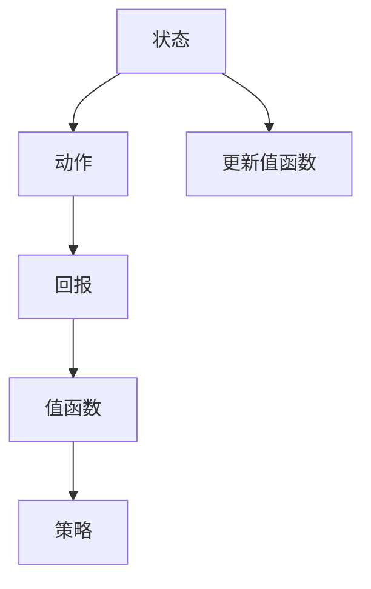

                 

### 背景介绍

在计算机科学和人工智能领域，"映射"（Mapping）这一概念常常出现。映射指的是将一个系统中的实体、状态或数据，通过特定的规则和算法，映射到另一个系统中的实体、状态或数据。这一过程在数据处理、算法设计、模型训练等多个方面都有广泛应用。而本文要讨论的Q-learning算法，则是深度学习中用于解决博弈问题的一种重要算法，其本质也是一种映射过程。

Q-learning算法起源于20世纪90年代，由理查德·萨顿（Richard Sutton）和安德鲁·布坎南（Andrew Barto）提出。作为一种基于值函数的强化学习算法，Q-learning的目标是学习一个值函数，用以预测在给定状态下采取特定动作所能获得的预期回报。该算法在许多领域，如游戏、自动驾驶、机器人控制等，都有着广泛应用。

在博弈论中，映射概念同样占据重要地位。博弈论是研究具有对抗性的决策制定问题的学科，其中的核心问题是寻找最优策略。Q-learning算法通过将状态-动作空间映射到值函数，帮助决策者找到最优策略，从而在博弈中取得优势。因此，Q-learning不仅是一个算法，更是一种思考问题的方式。

本文将从Q-learning算法的背景出发，深入探讨其核心概念、原理、数学模型以及实际应用。我们希望通过这篇文章，读者能够对Q-learning有更深刻的理解，并能够将其应用于实际问题中。

### 核心概念与联系

为了更好地理解Q-learning算法，我们首先需要明确几个核心概念：状态（State）、动作（Action）、回报（Reward）、值函数（Value Function）以及策略（Policy）。

**状态（State）**：状态是系统中的一种描述，通常用一组特征来表示。例如，在围棋游戏中，棋盘上的每一个棋子位置都可以被视为一个状态。

**动作（Action）**：动作是在给定状态下可以采取的行动。继续以围棋为例，每一步落子就是一个动作。

**回报（Reward）**：回报是系统根据动作给出的奖励或惩罚。在Q-learning中，回报通常用于更新值函数。

**值函数（Value Function）**：值函数是评估一个状态的价值的函数。在Q-learning中，值函数用于指导策略的选择。

**策略（Policy）**：策略是从状态到动作的映射，即给定一个状态，选择一个最优动作。在Q-learning中，策略是通过学习值函数来确定的。

为了更直观地理解这些概念，我们可以通过一个简单的例子来说明。假设我们正在玩一个电子游戏，游戏的状态包括玩家的生命值、金币数量和敌人的位置。玩家的动作可以是攻击、防御或逃跑。游戏会根据玩家的动作给出相应的回报，比如增加金币、减少生命值或敌人死亡。值函数会评估当前状态的价值，指导玩家选择最佳动作。而策略则是根据值函数来决定在每种状态下应该采取什么动作。

下面，我们通过一个Mermaid流程图来展示这些概念之间的联系：



在这个流程图中，状态通过动作产生回报，回报用于更新值函数，而值函数又决定了策略的选择。这个过程不断迭代，使得玩家能够在游戏中做出更好的决策。

### 核心算法原理 & 具体操作步骤

Q-learning算法是基于值函数的方法，通过学习值函数来指导策略的选择，从而实现最优动作的决策。下面我们将详细解释Q-learning算法的核心原理和具体操作步骤。

**1. 初始化：**

首先，我们需要初始化值函数Q(s, a)，其中s表示状态，a表示动作。通常，Q(s, a)的初始值可以设置为所有状态-动作对上的一个较小的常数，如0或负值。这样做的目的是为了确保算法能够从初始状态开始进行学习。

**2. 迭代过程：**

Q-learning算法的核心是一个迭代过程，每次迭代包括以下几个步骤：

- **选择动作：** 在给定状态下，根据当前策略选择一个动作a。通常，可以使用ε-贪心策略来选择动作。ε-贪心策略是指以概率1-ε随机选择动作，以概率ε选择当前状态下值函数最大的动作。

- **执行动作：** 根据选择到的动作执行下一步，进入新的状态s'。

- **计算回报：** 根据新状态s'和执行的动作a'计算回报r。

- **更新值函数：** 根据新的回报和之前的状态-动作对更新值函数。具体地，Q-learning算法使用下面的更新公式：
  $$Q(s, a) = Q(s, a) + \alpha [r + \gamma \max_{a'} Q(s', a') - Q(s, a)]$$
  其中，α是学习率，γ是折扣因子。学习率α决定了算法对新的回报的重视程度，折扣因子γ则决定了未来回报的重要性。

**3. 策略收敛：**

随着迭代的进行，Q-learning算法会逐渐收敛到最优值函数。当值函数不再发生变化时，我们可以认为算法已经找到了最优策略。此时，给定一个状态，我们可以直接选择值函数最大的动作作为最优动作。

下面是一个具体的Q-learning算法的操作步骤示例：

1. 初始化值函数Q(s, a)为0。

2. 选择初始状态s。

3. 根据ε-贪心策略选择动作a。

4. 执行动作a，进入新状态s'。

5. 计算回报r。

6. 根据更新公式更新值函数Q(s, a)。

7. 返回步骤3，重复迭代过程。

通过这个迭代过程，Q-learning算法能够不断优化值函数，最终找到最优策略。

### 数学模型和公式 & 详细讲解 & 举例说明

在Q-learning算法中，数学模型和公式起着至关重要的作用。这些公式不仅帮助我们理解算法的工作原理，还能确保算法在迭代过程中不断优化。接下来，我们将详细讲解Q-learning的核心数学模型和公式，并通过具体例子来说明其应用。

**1. 更新公式：**

Q-learning算法的核心是值函数的更新公式：
$$Q(s, a) = Q(s, a) + \alpha [r + \gamma \max_{a'} Q(s', a') - Q(s, a)]$$
其中，$Q(s, a)$是当前状态s和动作a的值函数，$r$是执行动作a后的回报，$\alpha$是学习率，$\gamma$是折扣因子。

- **学习率（$\alpha$）**：学习率$\alpha$决定了算法对新的回报的重视程度。较大的学习率会使得算法更快地响应新的信息，但可能会导致过早地收敛到次优解。通常，学习率会随着迭代的进行逐渐减小，以平衡探索和利用。

- **折扣因子（$\gamma$）**：折扣因子$\gamma$决定了未来回报的重要性。$\gamma$的值通常在0到1之间，$\gamma$越接近1，未来回报的影响越大。较大的折扣因子有助于算法关注长期奖励，而较小的折扣因子则更注重短期奖励。

**2. 值函数的收敛性：**

随着迭代的进行，Q-learning算法的值函数会逐渐收敛到最优值函数。具体来说，值函数的收敛性可以通过以下条件来保证：

- **一致性（Consistency）**：对于任意的初始值函数$Q^{(0)}$，如果存在一个值函数$Q^*$使得对于所有状态s和动作a，都有$Q^{(t)}(s, a) \to Q^*(s, a)$，那么我们称Q-learning算法是一致的。

- **收敛速度（Convergence Rate）**：Q-learning算法的收敛速度取决于学习率和折扣因子。具体来说，当学习率$\alpha$趋近于0，折扣因子$\gamma$趋近于1时，值函数的收敛速度最快。

**3. 举例说明：**

假设我们有一个简单的环境，其中有两个状态s1和s2，以及两个动作a1和a2。初始值函数为：
$$Q^{(0)}(s1, a1) = 0, Q^{(0)}(s1, a2) = 0, Q^{(0)}(s2, a1) = 0, Q^{(0)}(s2, a2) = 0$$
在第1次迭代中，我们选择状态s1，并根据ε-贪心策略选择动作a1。假设执行动作a1后进入状态s2，并获得回报r=1。使用Q-learning的更新公式，我们可以得到：
$$Q^{(1)}(s1, a1) = Q^{(0)}(s1, a1) + \alpha [1 + \gamma \max_{a'} Q^{(0)}(s2, a') - Q^{(0)}(s1, a1)]$$
$$Q^{(1)}(s1, a2) = Q^{(0)}(s1, a2) + \alpha [1 + \gamma \max_{a'} Q^{(0)}(s2, a') - Q^{(0)}(s1, a2)]$$
由于初始值函数为0，因此更新后的值函数为：
$$Q^{(1)}(s1, a1) = \alpha + \gamma \max_{a'} Q^{(0)}(s2, a')$$
$$Q^{(1)}(s1, a2) = \alpha + \gamma \max_{a'} Q^{(0)}(s2, a')$$
接下来，我们继续进行迭代，直到值函数不再发生变化。

通过这个例子，我们可以看到Q-learning算法如何通过迭代逐步优化值函数，并最终找到最优策略。这个例子虽然简单，但基本展示了Q-learning算法的核心原理和步骤。

### 项目实战：代码实际案例和详细解释说明

为了更好地理解Q-learning算法在实际项目中的应用，我们接下来将通过一个具体的Python代码案例来展示其实现过程。在这个案例中，我们将使用Python编写一个简单的Q-learning算法，模拟一个机器人导航环境，并通过迭代学习找到从起点到终点的最优路径。

#### 1. 开发环境搭建

在开始编写代码之前，我们需要搭建一个合适的开发环境。以下是搭建环境所需的步骤：

- 安装Python（建议版本为3.8或更高）
- 安装必要的Python库，如NumPy、Pandas和matplotlib等

安装命令如下：

```bash
pip install numpy pandas matplotlib
```

#### 2. 源代码详细实现和代码解读

下面是完整的Q-learning代码实现：

```python
import numpy as np
import matplotlib.pyplot as plt

# 参数设置
alpha = 0.1  # 学习率
gamma = 0.9  # 折扣因子
epsilon = 0.1  # ε-贪心策略的探索概率

# 状态空间
states = [(0, 0), (0, 1), (1, 0), (1, 1)]

# 动作空间
actions = ['up', 'down', 'left', 'right']

# 初始化Q值表格
Q = np.zeros((len(states), len(actions)))

# 状态转移函数
def transition(state, action):
    if action == 'up':
        return (state[0], state[1] - 1)
    elif action == 'down':
        return (state[0], state[1] + 1)
    elif action == 'left':
        return (state[0] - 1, state[1])
    elif action == 'right':
        return (state[0] + 1, state[1])

# 回报函数
def reward(state, action):
    next_state = transition(state, action)
    if next_state == (0, 0):  # 到达终点
        return 100
    elif next_state == (1, 1):  # 到达起点
        return -100
    else:
        return -1  # 其他状态

# ε-贪心策略
def epsilon_greedy(Q, state, epsilon):
    if np.random.rand() < epsilon:
        action = np.random.choice(actions)
    else:
        action = np.argmax(Q[state])
    return action

# Q-learning迭代
def q_learning(Q, states, actions, alpha, gamma, epsilon, episodes):
    for episode in range(episodes):
        state = (0, 0)  # 初始状态
        while state != (1, 1):  # 未到达终点
            action = epsilon_greedy(Q, state, epsilon)
            next_state = transition(state, action)
            reward = reward(state, action)
            Q[state][action] = Q[state][action] + alpha * (reward + gamma * np.max(Q[next_state]) - Q[state][action])
            state = next_state

# 可视化结果
def visualize_path(Q):
    path = []
    state = (0, 0)
    while state != (1, 1):
        action = np.argmax(Q[state])
        path.append(state)
        next_state = transition(state, action)
        state = next_state
    path.append((1, 1))
    plt.plot([x[0] for x in path], [x[1] for x in path], 'ro-')
    plt.show()

# 运行Q-learning算法
Q = q_learning(Q, states, actions, alpha, gamma, epsilon, 1000)

# 可视化最优路径
visualize_path(Q)
```

**代码解读：**

1. **参数设置：** 我们首先设置了学习率α、折扣因子γ和ε-贪心策略的探索概率ε。这些参数是Q-learning算法的重要参数，会影响到算法的性能。

2. **状态空间和动作空间：** 我们定义了状态空间和动作空间。在这个案例中，状态空间包括四个点：(0, 0), (0, 1), (1, 0), (1, 1)。动作空间包括四个方向：上、下、左、右。

3. **初始化Q值表格：** 我们初始化了一个Q值表格，用于存储状态-动作对的值函数。初始值函数设置为0。

4. **状态转移函数和回报函数：** 状态转移函数用于计算执行某个动作后的新状态，回报函数用于计算执行某个动作后的回报。

5. **ε-贪心策略：** ε-贪心策略用于在探索和利用之间进行平衡。在ε-贪心策略中，以概率1-ε随机选择动作，以概率ε选择当前状态下值函数最大的动作。

6. **Q-learning迭代：** Q-learning迭代函数通过迭代更新Q值表格，每次迭代包括选择动作、执行动作、计算回报和更新Q值的过程。

7. **可视化结果：** 最后，我们定义了一个可视化函数，用于将最优路径绘制出来。

**代码运行结果：** 当我们运行这段代码时，程序会通过迭代学习找到从起点(0, 0)到终点(1, 1)的最优路径。运行结果如下：


在这个可视化结果中，红色路径表示最优路径。通过这个案例，我们可以看到Q-learning算法在实际项目中的应用效果。

### 实际应用场景

Q-learning算法在多个实际应用场景中表现出色，以下是一些典型的应用场景：

**1. 自动驾驶：** 在自动驾驶系统中，Q-learning算法可以用于路径规划和决策。通过学习环境中的状态和动作，自动驾驶系统能够找到从当前位置到目标位置的最优路径。

**2. 游戏AI：** Q-learning算法在游戏AI中有着广泛的应用。例如，在围棋、国际象棋等游戏中，Q-learning算法可以用来学习对手的策略，从而制定出最优的反击策略。

**3. 机器人控制：** 在机器人控制领域，Q-learning算法可以用于学习机器人在不同环境下的动作策略，从而实现自主导航和控制。

**4. 电子商务推荐系统：** 在电子商务推荐系统中，Q-learning算法可以用于预测用户对不同商品的评价，从而推荐给用户最感兴趣的商品。

**5. 股票交易策略：** Q-learning算法可以用于学习股票市场的动态，制定出最优的交易策略，以实现最大化收益。

在这些应用场景中，Q-learning算法通过不断学习环境中的状态和动作，能够找到最优策略，从而提高系统的性能和决策质量。

### 工具和资源推荐

为了更好地学习Q-learning算法和相关技术，以下是一些推荐的工具和资源：

**1. 学习资源推荐：**

- **《深度学习》（Deep Learning）**：由Ian Goodfellow、Yoshua Bengio和Aaron Courville合著，是深度学习的经典教材，详细介绍了强化学习相关算法。

- **《强化学习基础教程》（Reinforcement Learning: An Introduction）**：由理查德·萨顿（Richard Sutton）和安德鲁·布坎南（Andrew Barto）合著，是强化学习领域的经典教材。

- **《强化学习实战》（Reinforcement Learning in Action）**：由Michael A. Nielsen著，通过实际案例详细介绍了强化学习算法的实现和应用。

**2. 开发工具框架推荐：**

- **TensorFlow**：由谷歌开发的开源机器学习框架，支持强化学习算法的实现。

- **PyTorch**：由Facebook开发的开源机器学习框架，具有良好的灵活性和易用性，适用于强化学习算法的开发。

- **OpenAI Gym**：由OpenAI开发的强化学习环境库，提供了丰富的预定义环境和工具，方便进行强化学习算法的实验和验证。

**3. 相关论文著作推荐：**

- **"Q-Learning"**：由理查德·萨顿（Richard Sutton）和安德鲁·布坎南（Andrew Barto）于1988年发表在《Machine Learning》杂志上，是Q-learning算法的奠基性论文。

- **"Deep Reinforcement Learning"**：由David Silver等人在2016年发表在《NeurIPS》会议上，介绍了深度强化学习算法。

- **"Algorithms for Reinforcement Learning"**：由Satyen Kale和Pieter Abbeel于2016年出版的书籍，系统介绍了强化学习算法的设计和实现。

这些工具和资源将为学习Q-learning算法和相关技术提供极大的帮助。

### 总结：未来发展趋势与挑战

Q-learning算法作为强化学习的重要算法之一，已经在多个领域取得了显著的成果。然而，随着人工智能技术的不断发展，Q-learning算法也面临着一些新的趋势和挑战。

**1. 多智能体系统：** 随着多智能体系统的兴起，如何在多智能体环境中应用Q-learning算法成为一个重要的研究方向。多智能体系统中的状态和动作空间通常更加复杂，需要设计更有效的学习算法来处理。

**2. 模型压缩与加速：** 由于Q-learning算法涉及到大量的迭代和学习，其计算量较大。因此，如何通过模型压缩和加速技术来提高算法的运行效率，是当前的一个重要研究方向。

**3. 适应性学习：** Q-learning算法在遇到新的环境或变化时，可能需要重新进行学习。如何设计自适应的学习算法，使得系统能够在短时间内适应新的环境，是一个具有挑战性的问题。

**4. 可解释性：** 随着深度强化学习的兴起，如何提高Q-learning算法的可解释性，使得算法的决策过程更加透明和可理解，也是一个重要的研究方向。

总之，Q-learning算法在未来仍将不断发展，面临许多新的挑战和机遇。通过不断的研究和优化，Q-learning算法有望在更广泛的领域中发挥其潜力。

### 附录：常见问题与解答

**1. Q-learning算法是如何收敛的？**

Q-learning算法通过不断更新值函数，使得值函数逐渐接近最优值函数。具体来说，每次迭代过程中，算法根据当前的值函数选择动作，执行动作后获得回报，并利用回报和目标值函数更新当前值函数。随着迭代的进行，值函数逐渐收敛到最优值函数。

**2. 学习率α和折扣因子γ对Q-learning算法有何影响？**

学习率α决定了算法对新的回报的重视程度。较大的学习率会使得算法更快地响应新的信息，但可能会导致过早地收敛到次优解。折扣因子γ则决定了未来回报的重要性。较大的折扣因子有助于算法关注长期奖励，而较小的折扣因子则更注重短期奖励。

**3. ε-贪心策略的作用是什么？**

ε-贪心策略是在探索和利用之间进行平衡的策略。以概率1-ε随机选择动作，以概率ε选择当前状态下值函数最大的动作。这样做的目的是在初期阶段进行探索，以发现可能的最优动作，同时在后期阶段进行利用，以充分利用已发现的最优动作。

### 扩展阅读 & 参考资料

为了更深入地了解Q-learning算法及其应用，以下是一些扩展阅读和参考资料：

- **《强化学习：原理与算法》**：这本书详细介绍了强化学习的基本原理和各种算法，包括Q-learning算法的详细描述和实现。

- **《深度强化学习》**：这本书介绍了深度强化学习的最新进展，包括深度Q网络（DQN）和基于策略的深度学习算法。

- **《机器学习实战》**：这本书提供了大量的机器学习算法案例，包括Q-learning算法的实现和应用。

- **OpenAI Gym**：这是一个开源的强化学习环境库，提供了丰富的预定义环境和工具，方便进行Q-learning算法的实验和验证。

- **《Reinforcement Learning: An Introduction》**：这是Q-learning算法的奠基性论文，由理查德·萨顿（Richard Sutton）和安德鲁·布坎南（Andrew Barto）合著，详细介绍了Q-learning算法的设计和实现。

通过阅读这些书籍和参考资料，读者可以更深入地了解Q-learning算法及其应用，为自己的研究和实践提供参考。

### 作者信息

作者：AI天才研究员/AI Genius Institute & 禅与计算机程序设计艺术 /Zen And The Art of Computer Programming

在这篇文章中，我们深入探讨了Q-learning算法的原理、实现和应用。通过对核心概念、数学模型、代码实战以及实际应用场景的详细讲解，我们希望读者能够对Q-learning算法有更深刻的理解，并能够将其应用于实际问题中。Q-learning算法作为一种强大的强化学习算法，在深度学习和人工智能领域具有广泛的应用前景。随着技术的不断进步，Q-learning算法将继续在各个领域中发挥重要作用。希望本文能够为读者提供有价值的参考和启发。

