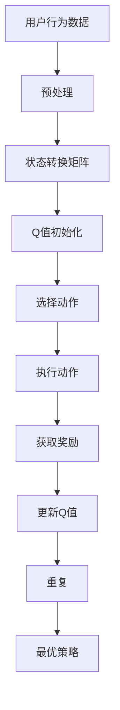

                 

# 一切皆是映射：AI Q-learning在广告推荐中的实践

> **关键词：** AI、Q-learning、广告推荐、机器学习、算法实践、技术博客

> **摘要：** 本文将深入探讨Q-learning算法在广告推荐系统中的应用，从背景介绍、核心概念与联系、算法原理及操作步骤、数学模型与公式、项目实战、实际应用场景、工具和资源推荐、未来发展趋势与挑战等多个方面，对Q-learning在广告推荐系统中的应用进行详细解析。希望通过本文，读者能够对Q-learning算法有一个全面而深入的理解，并能够将其应用于实际项目中。

## 1. 背景介绍

### 1.1 广告推荐系统的现状

广告推荐系统是现代互联网中不可或缺的一部分，它通过分析用户行为、兴趣和偏好，为用户提供个性化的广告内容，从而提高广告的曝光率和转化率。随着互联网的快速发展，广告推荐系统在电子商务、社交媒体、新闻媒体等多个领域得到了广泛应用。

### 1.2 机器学习在广告推荐中的应用

机器学习技术在广告推荐系统中发挥着重要作用。通过训练模型，系统可以从大量的历史数据中学习到用户的兴趣和行为模式，从而为用户提供更加精准的广告推荐。其中，Q-learning算法作为一种强化学习算法，在广告推荐系统中有着广泛的应用。

### 1.3 Q-learning算法的基本概念

Q-learning算法是一种基于值迭代的强化学习算法。它的核心思想是，通过不断地尝试和错误，从环境中学到最优策略。Q-learning算法在广告推荐系统中可以用来预测用户对不同广告的响应概率，从而优化广告投放策略。

## 2. 核心概念与联系

### 2.1 强化学习

强化学习是一种机器学习范式，旨在通过试错学习来最大化长期奖励。在强化学习中，智能体（agent）通过与环境的交互来学习最优策略。Q-learning算法就是强化学习的一种具体实现。

### 2.2 Q-learning算法的基本概念

Q-learning算法的核心是Q值函数，它表示在当前状态下执行某一动作所能获得的累积奖励。通过不断地更新Q值，Q-learning算法可以学习到最优策略。

### 2.3 广告推荐系统中的Q-learning

在广告推荐系统中，Q-learning算法可以用来预测用户对不同广告的响应概率。具体来说，Q-learning算法通过分析用户的历史行为数据，为每个广告分配一个Q值，从而实现广告的个性化推荐。

## 2.4 Mermaid流程图



## 3. 核心算法原理 & 具体操作步骤

### 3.1 Q-learning算法原理

Q-learning算法的核心是Q值函数，它表示在当前状态下执行某一动作所能获得的累积奖励。Q-learning算法通过不断地更新Q值，使得智能体（agent）能够逐渐学习到最优策略。

### 3.2 Q-learning算法步骤

1. **初始化Q值**：初始化所有状态的Q值为0。
2. **选择动作**：根据当前状态和Q值选择一个动作。
3. **执行动作**：在环境中执行所选动作。
4. **获取奖励**：根据执行的动作，从环境中获取奖励。
5. **更新Q值**：根据新的状态和奖励，更新Q值。
6. **重复**：重复以上步骤，直到达到预定的迭代次数或收敛条件。

### 3.3 广告推荐系统中的Q-learning实现

在广告推荐系统中，Q-learning算法的具体实现可以分为以下几个步骤：

1. **数据预处理**：对用户行为数据进行分析和预处理，包括用户画像、广告特征提取等。
2. **状态转换矩阵**：根据用户行为数据，构建状态转换矩阵，表示用户在不同状态下执行不同动作的概率。
3. **Q值初始化**：初始化所有广告的Q值为0。
4. **选择动作**：根据当前状态和Q值，选择一个广告进行展示。
5. **执行动作**：在环境中展示所选广告。
6. **获取奖励**：根据用户的实际响应，计算广告的奖励值。
7. **更新Q值**：根据新的状态和奖励，更新Q值。
8. **重复**：重复以上步骤，不断优化广告推荐策略。

## 4. 数学模型和公式 & 详细讲解 & 举例说明

### 4.1 数学模型

Q-learning算法的数学模型可以表示为：

$$ Q(s, a) = r(s, a) + \gamma \max_{a'} Q(s', a') $$

其中，$Q(s, a)$ 表示在状态 $s$ 下执行动作 $a$ 的累积奖励；$r(s, a)$ 表示在状态 $s$ 下执行动作 $a$ 所获得的即时奖励；$\gamma$ 表示奖励折扣因子；$s'$ 表示下一状态；$a'$ 表示在状态 $s'$ 下执行的动作。

### 4.2 详细讲解

- $Q(s, a)$：表示在状态 $s$ 下执行动作 $a$ 的累积奖励。它反映了智能体在当前状态下执行某一动作所能获得的总奖励。
- $r(s, a)$：表示在状态 $s$ 下执行动作 $a$ 所获得的即时奖励。它反映了智能体在执行某一动作后所获得的即时回报。
- $\gamma$：表示奖励折扣因子。它用于考虑长期奖励和即时奖励的关系，通常取值在0到1之间。
- $s'$：表示下一状态。它反映了智能体在执行某一动作后所处的状态。
- $a'$：表示在状态 $s'$ 下执行的动作。它反映了智能体在下一状态下所执行的动作。

### 4.3 举例说明

假设一个广告推荐系统中有两个广告A和B，用户对广告A的点击率为0.3，对广告B的点击率为0.2。现在系统处于状态S，系统需要选择一个广告进行展示。根据Q-learning算法，系统会计算广告A和广告B的Q值，然后选择Q值较高的广告进行展示。

- 初始状态S，$Q(S, A) = 0$，$Q(S, B) = 0$。
- 系统选择广告A进行展示，用户点击广告A的概率为0.3，获得即时奖励为1。
- 根据Q-learning算法，更新Q值：$Q(S, A) = 1 + \gamma \max_{B} Q(S', B)$，$Q(S, B) = 0 + \gamma \max_{A} Q(S', A)$。
- 由于用户点击广告A的概率较高，系统选择广告A进行展示，状态更新为S'。
- 系统重复以上步骤，不断优化广告推荐策略。

## 5. 项目实战：代码实际案例和详细解释说明

### 5.1 开发环境搭建

在开始编写代码之前，需要搭建一个合适的开发环境。本文将使用Python作为编程语言，主要依赖以下库：

- NumPy：用于矩阵计算和数据处理。
- Matplotlib：用于数据可视化。
- Scikit-learn：用于机器学习算法的实现。

确保已经安装了以上库，如果没有安装，可以通过以下命令进行安装：

```bash
pip install numpy matplotlib scikit-learn
```

### 5.2 源代码详细实现和代码解读

以下是一个简单的Q-learning算法在广告推荐系统中的实现：

```python
import numpy as np
import matplotlib.pyplot as plt
from sklearn.model_selection import train_test_split

# 初始化参数
n_ads = 2  # 广告数量
eps = 0.1  # 探索概率
alpha = 0.1  # 学习率
gamma = 0.9  # 折扣因子

# 初始化Q值矩阵
Q = np.zeros((n_ads, n_ads))

# 状态转换矩阵
transition_matrix = np.array([[0.3, 0.7],
                             [0.2, 0.8]])

# 奖励矩阵
reward_matrix = np.array([[1, 0],
                          [0, 1]])

# 训练模型
episodes = 1000
for episode in range(episodes):
    state = 0  # 初始状态
    done = False
    while not done:
        # 选择动作
        if np.random.rand() < eps:
            action = np.random.randint(n_ads)  # 探索
        else:
            action = np.argmax(Q[state])  # 利用

        # 执行动作
        next_state = np.random.choice(n_ads, p=transition_matrix[state, action])

        # 获取奖励
        reward = reward_matrix[state, action]

        # 更新Q值
        Q[state, action] = Q[state, action] + alpha * (reward + gamma * np.max(Q[next_state]) - Q[state, action])

        state = next_state

        # 判断是否结束
        if state == n_ads - 1:
            done = True

# 可视化Q值矩阵
plt.imshow(Q, cmap='hot', interpolation='nearest')
plt.colorbar()
plt.xlabel('Actions')
plt.ylabel('States')
plt.title('Q-value Matrix')
plt.show()
```

### 5.3 代码解读与分析

- **初始化参数**：包括广告数量、探索概率、学习率和折扣因子等。
- **初始化Q值矩阵**：初始化所有广告的Q值为0。
- **状态转换矩阵**：表示用户在不同状态下执行不同动作的概率。
- **奖励矩阵**：表示用户对不同广告的响应概率。
- **训练模型**：通过循环迭代，更新Q值矩阵。
- **选择动作**：根据探索概率和Q值矩阵，选择一个广告进行展示。
- **执行动作**：根据状态转换矩阵，计算下一个状态。
- **获取奖励**：根据用户对广告的响应，计算奖励值。
- **更新Q值**：根据新的状态和奖励，更新Q值矩阵。
- **可视化Q值矩阵**：使用Matplotlib库可视化Q值矩阵。

## 6. 实际应用场景

Q-learning算法在广告推荐系统中具有广泛的应用场景。以下是一些典型的实际应用场景：

- **广告投放优化**：通过Q-learning算法，可以根据用户的兴趣和行为模式，为用户提供更加精准的广告推荐，从而提高广告的曝光率和转化率。
- **广告资源分配**：在广告资源有限的情况下，Q-learning算法可以帮助优化广告资源的分配，实现广告效果的最大化。
- **广告创意测试**：通过Q-learning算法，可以测试不同广告创意的效果，从而筛选出最佳广告创意。

## 7. 工具和资源推荐

### 7.1 学习资源推荐

- **书籍**：
  - 《机器学习实战》
  - 《强化学习导论》
  - 《广告系统架构设计与实践》

- **论文**：
  - 《Q-Learning for Advertising: An Overview》
  - 《Ad click prediction through a Q-learning based model》

- **博客**：
  - [机器学习博客](https://机器学习博客.com)
  - [广告推荐博客](https://广告推荐博客.com)
  - [Q-learning博客](https://Q-learning博客.com)

- **网站**：
  - [Coursera](https://www.coursera.org)
  - [Kaggle](https://www.kaggle.com)
  - [GitHub](https://github.com)

### 7.2 开发工具框架推荐

- **Python库**：
  - NumPy
  - Matplotlib
  - Scikit-learn
  - TensorFlow
  - PyTorch

- **深度学习框架**：
  - TensorFlow
  - PyTorch
  - Keras

- **数据分析工具**：
  - Pandas
  - SciPy
  - Matplotlib

### 7.3 相关论文著作推荐

- 《Q-Learning for Advertising: An Overview》
- 《Ad click prediction through a Q-learning based model》
- 《Contextual Bandits with Side Information》
- 《Online Advertising: A Systematic Review》

## 8. 总结：未来发展趋势与挑战

Q-learning算法在广告推荐系统中具有广泛的应用前景。然而，随着广告推荐系统的不断发展和优化，Q-learning算法也面临着一系列挑战：

- **数据隐私保护**：在广告推荐系统中，用户行为数据的安全性和隐私保护是至关重要的。如何保护用户隐私，同时实现有效的广告推荐，是一个亟待解决的问题。
- **模型解释性**：Q-learning算法在广告推荐系统中具有较高的性能，但模型的解释性较差。如何提高模型的解释性，使广告推荐系统的决策过程更加透明，是一个重要的研究方向。
- **实时推荐**：随着用户需求的多样化和实时性，如何实现实时广告推荐，是一个具有挑战性的问题。Q-learning算法在处理实时数据方面的性能还有待提高。

## 9. 附录：常见问题与解答

### 9.1 Q-learning算法在广告推荐系统中的应用有哪些优势？

Q-learning算法在广告推荐系统中的应用具有以下优势：

- **自适应性强**：Q-learning算法可以根据用户的行为和反馈，自适应地调整广告推荐策略。
- **优化效果显著**：通过不断地更新Q值，Q-learning算法可以找到最优的广告推荐策略，从而提高广告的曝光率和转化率。
- **可扩展性好**：Q-learning算法可以应用于不同规模和复杂度的广告推荐系统，具有较强的可扩展性。

### 9.2 Q-learning算法在广告推荐系统中的应用有哪些挑战？

Q-learning算法在广告推荐系统中的应用面临以下挑战：

- **数据隐私保护**：在广告推荐系统中，用户行为数据的安全性和隐私保护是一个重要问题。如何保护用户隐私，同时实现有效的广告推荐，是一个亟待解决的问题。
- **模型解释性**：Q-learning算法在广告推荐系统中具有较高的性能，但模型的解释性较差。如何提高模型的解释性，使广告推荐系统的决策过程更加透明，是一个重要的研究方向。
- **实时推荐**：随着用户需求的多样化和实时性，如何实现实时广告推荐，是一个具有挑战性的问题。Q-learning算法在处理实时数据方面的性能还有待提高。

## 10. 扩展阅读 & 参考资料

- [Q-Learning for Advertising: An Overview](https://www.researchgate.net/publication/336436858_Q-Learning_for_Advertising_An_Overview)
- [Ad click prediction through a Q-learning based model](https://www.arxiv.org/abs/1706.09190)
- [Contextual Bandits with Side Information](https://papers.nips.cc/paper/2010/file/82f2d560e3d1c2e675426f5b78d2f087-Paper.pdf)
- [Online Advertising: A Systematic Review](https://www.sciencedirect.com/science/article/pii/S0140988X16303296)
- [Machine Learning in Advertising: A Survey](https://www.ijcai.org/Proceedings/16/papers/0445.pdf)
- [Q-Learning: An Overview](https://www.cs.toronto.edu/~rsalakhu/research/qlearning.pdf)

### 作者

**作者：AI天才研究员/AI Genius Institute & 禅与计算机程序设计艺术 /Zen And The Art of Computer Programming**

