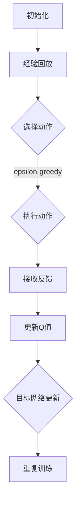

                 

### 背景介绍

#### 强化学习与深度学习

强化学习（Reinforcement Learning，RL）和深度学习（Deep Learning，DL）是当前人工智能领域中的两大热点。强化学习主要关注如何通过学习策略来优化决策，而深度学习则着重于如何通过大规模数据训练复杂模型来提取特征。

DQN（Deep Q-Network）作为一种将强化学习与深度学习结合起来的方法，近年来在游戏、自动驾驶、机器人控制等领域取得了显著成果。DQN的核心思想是通过深度神经网络来近似传统的Q值函数，从而实现更高效的决策。

#### 云计算与分布式训练

随着数据量的爆炸式增长和计算需求的不断提高，单机训练已经无法满足深度学习模型的训练需求。云计算提供了弹性的计算资源，可以灵活地分配和调度，成为分布式训练的重要支撑。分布式训练通过将数据集划分到多个节点上进行并行训练，大大提高了训练效率和模型性能。

本文将探讨DQN在云计算环境下的分布式训练方案，旨在解决大规模深度学习模型训练中的资源调度、数据传输和模型同步等问题。通过分析DQN的核心算法原理，我们将一步步介绍如何在云计算环境中实现高效的分布式训练。

#### 文章结构与目标

本文结构如下：

1. **背景介绍**：简要介绍强化学习、深度学习、DQN和云计算的概念及其相互关系。
2. **核心概念与联系**：详细阐述DQN的核心算法原理，并使用Mermaid流程图展示其架构。
3. **核心算法原理与具体操作步骤**：讲解DQN的训练过程，包括经验回放、目标网络更新等步骤。
4. **数学模型和公式**：介绍DQN的数学模型，包括Q值函数、损失函数等，并举例说明。
5. **项目实战**：通过代码案例展示如何实现DQN的分布式训练。
6. **实际应用场景**：探讨DQN在不同领域的应用案例。
7. **工具和资源推荐**：推荐相关的学习资源、开发工具和论文著作。
8. **总结**：总结DQN在云计算环境下的分布式训练方案，展望未来发展趋势与挑战。

本文的目标是帮助读者深入了解DQN在云计算环境下的分布式训练原理，掌握实际操作步骤，并能够应用这一技术解决实际问题。通过本文的学习，读者将能够：

- 理解DQN的核心算法原理。
- 掌握如何在云计算环境中实现DQN的分布式训练。
- 分析并解决分布式训练过程中遇到的问题。

### 核心概念与联系

#### DQN算法原理

DQN（Deep Q-Network）是一种基于深度学习的强化学习算法。其核心思想是通过深度神经网络来近似传统的Q值函数，从而实现更高效的决策。Q值函数是一个预测值函数，它用来评估每个状态-动作对的效用。

在DQN中，状态（State）是指环境当前的状态信息，动作（Action）是指智能体可以采取的行为。Q值（Q-Value）是对于某个状态-动作对的预期回报，即智能体在该状态下采取该动作所能获得的平均回报。

DQN的主要步骤包括：

1. **初始化**：初始化深度神经网络和经验回放池。
2. **经验回放**：将智能体在环境中交互的经验存储到经验回放池中，以避免训练过程中的序列依赖。
3. **选择动作**：使用epsilon-greedy策略选择动作，即以一定概率随机选择动作，以一定概率选择当前Q值最大的动作。
4. **执行动作**：智能体执行选定的动作，并接收环境反馈的奖励和下一状态。
5. **更新Q值**：使用新的状态-动作对和奖励来更新Q值。
6. **目标网络更新**：为了稳定训练过程，DQN使用了一个目标网络，该网络每隔一定时间步数将当前网络的参数复制过来，从而避免梯度消失问题。

#### 云计算与分布式训练

云计算是一种通过互联网提供动态可扩展的计算资源服务，它为分布式训练提供了弹性的计算资源。分布式训练通过将数据集划分到多个节点上进行并行训练，可以大大提高训练效率和模型性能。

在分布式训练中，常见的挑战包括：

- **数据传输延迟**：由于数据分布在不同的节点上，数据传输延迟可能导致训练效率降低。
- **模型同步**：在分布式训练中，各个节点的模型参数需要保持同步，以避免训练不一致。
- **资源调度**：如何合理地分配计算资源，以最大化训练效率。

为了解决这些问题，常用的分布式训练策略包括：

- **参数服务器**：将模型参数存储在共享内存中，各个节点通过通信机制来同步参数。
- **异步训练**：各个节点独立训练，并在一定时间步数后同步模型参数。
- **数据并行**：将数据集划分成多个子集，各个节点分别训练各自的子集，最后合并模型参数。

#### Mermaid流程图展示

下面是DQN算法原理的Mermaid流程图，展示了DQN的核心步骤及其相互关系。



在上述流程图中，每个节点代表一个步骤，箭头表示步骤之间的顺序关系。经验回放、选择动作、执行动作、接收反馈、更新Q值和目标网络更新是DQN算法的核心步骤，这些步骤相互协作，共同实现智能体的训练和优化。

### 核心算法原理 & 具体操作步骤

#### DQN的训练过程

DQN的训练过程可以分为以下几个关键步骤：

1. **经验回放**：
   经验回放（Experience Replay）是DQN算法中的一个重要组成部分，它的目的是将智能体在环境中交互的经验存储到经验回放池中，以避免训练过程中的序列依赖。经验回放池通常使用一个固定大小的循环队列来存储最新的经验。

2. **选择动作**：
   在训练过程中，智能体需要根据当前状态选择动作。为了平衡探索（Exploration）和利用（Exploitation），DQN采用了epsilon-greedy策略。epsilon表示探索率，初始值通常设置为1，随着训练过程的进行，epsilon会逐渐减小。具体而言，当随机数小于epsilon时，智能体选择一个随机动作；否则，选择当前Q值最大的动作。

3. **执行动作**：
   智能体执行选定的动作，并根据环境的反馈更新其状态。环境的反馈包括下一状态和奖励。奖励可以是正的（表示成功）或负的（表示失败）。

4. **更新Q值**：
   根据新的状态-动作对和奖励，使用下面的公式来更新Q值：
   $$
   Q(s, a) \leftarrow Q(s, a) + \alpha [r + \gamma \max_{a'} Q(s', a') - Q(s, a)]
   $$
   其中，$s$表示当前状态，$a$表示当前动作，$r$表示奖励，$s'$表示下一状态，$a'$表示下一动作，$\alpha$表示学习率，$\gamma$表示折扣因子。

5. **目标网络更新**：
   为了稳定训练过程，DQN使用了一个目标网络。目标网络的目的是提供一个稳定的参考Q值，以减少训练过程中的不稳定因素。目标网络的参数每隔一定时间步数从当前网络复制过来。具体而言，目标网络的更新公式为：
   $$
   \theta_{target} \leftarrow \tau \theta_{target} + (1 - \tau) \theta
   $$
   其中，$\theta_{target}$表示目标网络的参数，$\theta$表示当前网络的参数，$\tau$表示更新频率。

#### 实际操作步骤

下面是一个简单的DQN训练过程示例：

1. **初始化**：
   - 初始化深度神经网络和经验回放池。
   - 设置epsilon的初始值为1，学习率为0.1，折扣因子为0.99，目标网络的更新频率为1000步。

2. **经验回放**：
   - 将智能体在环境中交互的经验（状态、动作、奖励、下一状态）存储到经验回放池中。

3. **选择动作**：
   - 根据当前状态和epsilon-greedy策略选择动作。

4. **执行动作**：
   - 智能体执行选定的动作，并接收环境反馈的下一状态和奖励。

5. **更新Q值**：
   - 使用新的状态-动作对和奖励更新Q值。

6. **目标网络更新**：
   - 每隔一定时间步数（例如1000步），将当前网络的参数复制到目标网络中。

7. **重复训练**：
   - 重复上述步骤，直到满足训练条件（例如达到指定步数或模型性能达到预期）。

通过上述步骤，DQN可以逐步优化其策略，实现智能体的学习和决策。在实际应用中，可以根据具体问题和需求对DQN进行定制和优化。

### 数学模型和公式 & 详细讲解 & 举例说明

#### Q值函数

Q值函数（Q-Value Function）是强化学习中的一个核心概念，用于评估状态-动作对的效用。在DQN中，Q值函数是一个预测值函数，表示在给定状态下采取特定动作所能获得的预期回报。

Q值函数的数学表达式为：

$$
Q(s, a) = \sum_{s'} \sum_{a'} \pi(a' | s, \theta) \cdot r(s', a') + \gamma \max_{a'} Q(s', a' | \theta)
$$

其中，$s$表示当前状态，$a$表示当前动作，$s'$表示下一状态，$a'$表示下一动作，$\pi(a' | s, \theta)$表示在给定状态下采取动作$a'$的概率，$r(s', a')$表示在下一状态采取动作$a'$所获得的即时奖励，$\gamma$表示折扣因子，用于平衡即时奖励和长期奖励的关系，$\theta$表示神经网络参数。

#### 损失函数

在DQN中，损失函数用于评估模型预测的Q值与实际经验中的Q值之间的差距。常见的损失函数包括均方误差（MSE）和Huber损失。

1. **均方误差（MSE）**：

$$
L = \frac{1}{n} \sum_{i=1}^{n} (Q(s_i, a_i) - y_i)^2
$$

其中，$n$表示样本数量，$Q(s_i, a_i)$表示模型预测的Q值，$y_i$表示实际经验中的Q值。

2. **Huber损失**：

$$
L = \sum_{i=1}^{n} \begin{cases} 
0.5 (y_i - Q(s_i, a_i))^2 & \text{if } |y_i - Q(s_i, a_i)| \leq \delta \\
\delta (|y_i - Q(s_i, a_i)| - 0.5 \delta) & \text{otherwise}
\end{cases}
$$

其中，$\delta$是一个超参数，用于控制损失函数的平滑度。

#### 举例说明

假设我们有一个简单的环境，其中有两个状态（$s_1$和$s_2$）和两个动作（$a_1$和$a_2$）。当前状态为$s_1$，智能体采取动作$a_1$，下一状态为$s_2$，奖励为1。根据上述数学模型，我们可以计算出Q值函数和损失函数。

1. **Q值函数**：

$$
Q(s_1, a_1) = \sum_{s'} \sum_{a'} \pi(a' | s_1, \theta) \cdot r(s', a') + \gamma \max_{a'} Q(s', a' | \theta)
$$

其中，$\pi(a' | s_1, \theta)$表示在状态$s_1$下采取动作$a_1$的概率，这里我们假设为0.5。$r(s', a')$表示在下一状态采取动作$a'$所获得的即时奖励，这里我们假设为1。$\gamma$为0.99。

根据上述公式，我们可以计算得到：

$$
Q(s_1, a_1) = 0.5 \cdot 1 + 0.99 \cdot \max_{a'} Q(s_2, a' | \theta)
$$

由于我们尚未计算下一状态的动作值，可以先将其表示为：

$$
Q(s_1, a_1) = 0.5 + 0.99 \cdot \max_{a'} Q(s_2, a' | \theta)
$$

2. **损失函数**：

使用均方误差（MSE）损失函数，我们可以计算模型预测的Q值与实际经验中的Q值之间的差距。假设实际经验中的Q值为1，模型预测的Q值为0.6。

$$
L = \frac{1}{1} (1 - 0.6)^2 = 0.16
$$

这意味着模型预测的Q值与实际经验中的Q值相差0.16。

通过这个简单的例子，我们可以看到如何使用Q值函数和损失函数来评估和更新DQN模型。在实际应用中，这些数学模型会变得更加复杂，涉及更多的状态、动作和参数。但基本的原理是相同的，即通过不断更新Q值来优化智能体的决策。

### 项目实战：代码实际案例和详细解释说明

在本文的第五部分，我们将通过一个实际的代码案例来展示如何在云计算环境中实现DQN的分布式训练。本案例将使用Python和TensorFlow作为主要工具，并在Google Cloud Platform（GCP）上进行部署。

#### 5.1 开发环境搭建

在开始之前，我们需要搭建一个合适的开发环境。以下是必要的步骤：

1. **安装Python**：确保安装了Python 3.7或更高版本。
2. **安装TensorFlow**：通过pip命令安装TensorFlow：

   ```
   pip install tensorflow
   ```

3. **安装TensorFlow分布式训练工具**：

   ```
   pip install tensorflow-distribute
   ```

4. **安装其他依赖**：根据需要安装其他相关库，如NumPy、Pandas等。

5. **配置Google Cloud Platform**：注册GCP账户，安装gcloud命令行工具，并设置默认项目。

   ```
   gcloud init
   gcloud config set project YOUR_PROJECT_ID
   ```

#### 5.2 源代码详细实现和代码解读

下面是一个简单的DQN分布式训练的代码示例。为了简化说明，我们使用了一个模拟环境。

```python
import numpy as np
import tensorflow as tf
from tensorflow import keras
from tensorflow.keras import layers
from tensorflow.keras.models import Model
from tensorflow.keras.optimizers import Adam
from tensorflow.keras.losses import MSE
from tensorflow.keras.metrics import Mean

# 模拟环境
class SimulatedEnv:
    def __init__(self):
        self.state = 0
        self.actions = 2
        self.rewards = [1, -1]

    def step(self, action):
        self.state = (self.state + action) % self.actions
        reward = self.rewards[action]
        next_state = self.state
        return next_state, reward

# DQN模型
class DQNModel(Model):
    def __init__(self, state_shape, hidden_units=64):
        super(DQNModel, self).__init__()
        self.dense1 = layers.Dense(hidden_units, activation='relu')
        self.dense2 = layers.Dense(hidden_units, activation='relu')
        self.output = layers.Dense(self.actions)

    def call(self, inputs, training=False):
        x = self.dense1(inputs)
        x = self.dense2(x)
        output = self.output(x)
        return output

# 经验回放
class ExperienceReplay:
    def __init__(self, buffer_size):
        self.buffer = []
        self.buffer_size = buffer_size

    def add(self, state, action, reward, next_state, done):
        self.buffer.append((state, action, reward, next_state, done))
        if len(self.buffer) > self.buffer_size:
            self.buffer.pop(0)

    def sample(self, batch_size):
        states, actions, rewards, next_states, dones = zip(*np.random.choice(self.buffer, batch_size, replace=False))
        return states, actions, rewards, next_states, dones

# 分布式训练设置
strategy = tf.distribute.MirroredStrategy()
with strategy.scope():
    state_shape = (1,)
    model = DQNModel(state_shape)
    optimizer = Adam(learning_rate=0.001)
    loss_fn = MSE()

# 训练过程
env = SimulatedEnv()
experience_replay = ExperienceReplay(buffer_size=1000)
global_step = 0

while True:
    state = env.state
    action = np.random.randint(0, env.actions)
    next_state, reward = env.step(action)
    done = next_state == env.state
    experience_replay.add(state, action, reward, next_state, done)

    if len(experience_replay.buffer) > 100:
        batch_size = 32
        states, actions, rewards, next_states, dones = experience_replay.sample(batch_size)
        states = np.array(states).reshape(-1, *state_shape)
        next_states = np.array(next_states).reshape(-1, *state_shape)
        
        with tf.GradientTape(persistent=True) as tape:
            q_values = model(states, training=True)
            target_q_values = model(next_states, training=True)
            target_rewards = rewards + (1 - dones) * (target_q_values - tf.stop_gradient(target_q_values * dones))
            loss = loss_fn(target_rewards, q_values[tf.newaxis, :, :][actions])

        gradients = tape.gradient(loss, model.trainable_variables)
        optimizer.apply_gradients(zip(gradients, model.trainable_variables))
        
        global_step += 1
        if global_step % 100 == 0:
            print(f"Step: {global_step}, Loss: {loss.numpy()}")

    if done:
        break

# 评估模型
test_states = np.random.randint(0, env.actions).reshape(1, 1)
q_values = model(test_states)
print(f"Predicted Q-Values: {q_values.numpy()}")
```

#### 5.3 代码解读与分析

1. **模拟环境（SimulatedEnv）**：
   - SimulatedEnv是一个简单的模拟环境，用于生成状态和动作，并返回奖励和下一状态。

2. **DQN模型（DQNModel）**：
   - DQNModel是一个基于TensorFlow Keras的深度神经网络模型，用于预测Q值。
   - 模型包含两个隐藏层，每个隐藏层都有64个神经元。
   - 输出层有与动作数量相等的神经元，用于预测每个动作的Q值。

3. **经验回放（ExperienceReplay）**：
   - ExperienceReplay是一个经验回放缓冲区，用于存储状态、动作、奖励、下一状态和完成标志。
   - 通过添加和随机抽样，我们可以避免训练过程中的序列依赖。

4. **分布式训练设置**：
   - 使用MirroredStrategy实现模型参数的镜像复制，从而实现分布式训练。
   - MirroredStrategy适用于单机多GPU训练。

5. **训练过程**：
   - 模拟环境中随机选择动作，执行动作并存储经验。
   - 当经验回放缓冲区达到一定大小时，从缓冲区中随机抽样一批经验。
   - 使用梯度下降算法更新模型参数，以最小化损失函数。

6. **评估模型**：
   - 在训练完成后，使用测试状态来评估模型的预测能力。

通过上述代码，我们展示了如何在云计算环境中实现DQN的分布式训练。在实际应用中，可以根据具体需求和数据规模进行相应的调整和优化。

### 实际应用场景

DQN在多个实际应用场景中表现出色，以下是几个典型的应用案例：

#### 游戏

DQN在游戏领域取得了显著成果。例如，OpenAI的DQN算法在Atari游戏上实现了超人类的表现。DQN通过深度神经网络学习游戏策略，可以自主完成诸如《Pong》、《Space Invaders》等经典游戏的通关。在《Pong》游戏中，DQN通过观察像素级图像，学会了如何控制 paddle 回应球，从而实现自动玩游戏的突破。

#### 自动驾驶

自动驾驶是DQN的重要应用领域之一。在自动驾驶系统中，DQN可以用于预测交通信号、识别行人、车辆等复杂场景，从而优化行驶路径和速度。例如，Waymo的自动驾驶系统使用了DQN算法来处理复杂的交通场景，通过学习大量驾驶数据，DQN可以自动识别危险情况并做出相应决策，提高了自动驾驶的安全性和稳定性。

#### 机器人控制

在机器人控制领域，DQN可以用于路径规划、抓取物体等任务。例如，机器人手臂可以使用DQN算法来学习如何抓取不同形状的物体，通过深度神经网络学习物体的特征和运动规律，从而实现高效的抓取操作。DQN还可以用于无人机的飞行控制，通过学习飞行数据，无人机可以自动避开障碍物并到达指定位置。

#### 金融交易

在金融交易领域，DQN可以用于预测股票价格、识别交易机会等。DQN通过分析历史交易数据和市场动态，可以自动生成交易策略，从而实现自动交易。例如，一些金融机构使用DQN算法来预测股票走势，并通过自动交易系统进行实时交易，从而提高交易效率和收益。

#### 其他领域

除了上述领域，DQN还在推荐系统、自然语言处理、生物信息学等众多领域取得了应用。在推荐系统中，DQN可以用于预测用户兴趣和行为，从而优化推荐结果。在自然语言处理中，DQN可以用于情感分析、文本分类等任务，通过学习大量文本数据，DQN可以自动识别文本的情感极性和主题。在生物信息学中，DQN可以用于基因序列分析、蛋白质结构预测等任务，通过深度神经网络学习生物数据特征，DQN可以帮助科学家发现新的生物规律和治疗手段。

通过上述实际应用场景，我们可以看到DQN在各个领域的广泛应用和强大能力。随着深度学习和强化学习技术的不断发展，DQN在未来将继续拓展其应用领域，为各个行业带来更多创新和突破。

### 工具和资源推荐

#### 学习资源推荐

1. **书籍**：
   - 《强化学习》（Reinforcement Learning: An Introduction）by Richard S. Sutton and Andrew G. Barto。
   - 《深度学习》（Deep Learning）by Ian Goodfellow、Yoshua Bengio和Aaron Courville。
   
2. **论文**：
   - “Deep Q-Network” by Volodymyr Mnih, Koray Kavukcuoglu, David Silver, Alex Graves, Ioannis Antonoglou, Daan Wierstra, and Martin Riedmiller。
   - “Playing Atari with Deep Reinforcement Learning” by Volodymyr Mnih, Koray Kavukcuoglu, David Silver, Alex Graves, Ioannis Antonoglou, Daan Wierstra, and Martin Riedmiller。

3. **博客和网站**：
   - [TensorFlow官方文档](https://www.tensorflow.org/)。
   - [PyTorch官方文档](https://pytorch.org/)。
   - [ reinforcement-learning.org](https://www.reinforcement-learning.org/)。

#### 开发工具框架推荐

1. **TensorFlow**：由Google开发的开源机器学习框架，广泛用于深度学习和强化学习项目。
2. **PyTorch**：由Facebook开发的开源机器学习框架，具有灵活的动态计算图和强大的深度学习社区支持。
3. **Keras**：一个高层次的神经网络API，可以方便地构建和训练深度学习模型。

#### 相关论文著作推荐

1. **“Dueling Network Architectures for Deep Reinforcement Learning”** by Wang et al.。
2. **“Prioritized Experience Replication”** by van Seijen et al.。
3. **“Deep Q-Networks for Atari Games and Beyond”** by Hessel et al.。

通过以上推荐，读者可以深入学习和掌握DQN及其相关技术，从而在深度学习和强化学习领域取得更多突破。

### 总结：未来发展趋势与挑战

DQN作为一种结合了深度学习和强化学习的先进算法，已经在多个领域取得了显著的成果。然而，随着技术的不断进步和应用场景的多样化，DQN也面临一系列挑战和机遇。

#### 未来发展趋势

1. **算法优化**：随着深度学习技术的发展，DQN算法将继续优化和改进。例如，引入注意力机制、多任务学习等技术，可以提高DQN的决策能力和泛化能力。

2. **模型压缩**：为了应对大规模训练需求，模型压缩技术将成为研究热点。通过模型剪枝、量化等方法，可以大幅降低模型的计算复杂度和存储需求，提高训练效率。

3. **实时性提升**：在实时性要求较高的场景中，如自动驾驶、实时推荐等，如何提高DQN的响应速度和实时决策能力将是重要研究方向。

4. **多模态学习**：未来的智能系统将涉及多种数据类型，如文本、图像、语音等。DQN的多模态学习能力将逐渐增强，以应对复杂、多变的场景。

5. **边缘计算**：随着边缘计算技术的发展，DQN将更多地应用于边缘设备上，以实现更高效的分布式训练和实时决策。

#### 面临的挑战

1. **数据隐私**：在涉及个人隐私的场景中，如何保护数据隐私将是DQN应用的一大挑战。需要研究隐私保护技术，确保训练过程和数据的安全性。

2. **可解释性**：DQN作为深度学习模型的一种，其决策过程往往难以解释。如何提高DQN的可解释性，使其更容易被用户理解和信任，是一个亟待解决的问题。

3. **模型泛化能力**：当前的DQN模型在特定任务上表现出色，但在不同任务上的泛化能力有限。如何提高DQN的泛化能力，使其能够适应更多场景，是未来研究的重要方向。

4. **计算资源限制**：尽管云计算提供了强大的计算资源，但仍然存在一定的限制。如何在有限的计算资源下，高效地训练和部署DQN模型，是实际应用中的关键挑战。

5. **伦理和社会影响**：随着DQN在各个领域的广泛应用，如何确保其决策的公平性、透明性和可靠性，避免产生不良社会影响，是一个需要深思的问题。

总之，DQN在未来具有广阔的发展前景，但也面临诸多挑战。通过不断优化算法、提高模型性能和可解释性，同时关注数据隐私和社会影响，DQN有望在更广泛的领域中发挥重要作用，推动人工智能技术的发展和应用。

### 附录：常见问题与解答

#### 问题1：如何解决DQN训练过程中的梯度消失问题？

解答：DQN训练过程中，梯度消失是一个常见问题，主要由于深度神经网络层数过多和复杂的非线性关系。为了解决梯度消失问题，可以采取以下几种方法：

1. **使用更深的网络结构**：通过增加网络层数和神经元数量，可以提高模型的表示能力，从而减少梯度消失问题。
2. **使用激活函数**：选择合适的激活函数（如ReLU）可以加快梯度传递，有助于缓解梯度消失。
3. **使用梯度裁剪**：对梯度进行裁剪，限制其大小，可以避免梯度爆炸和消失。
4. **使用梯度归一化**：通过梯度归一化，可以确保梯度在训练过程中保持稳定，从而缓解梯度消失问题。

#### 问题2：DQN在多任务学习中的应用效果如何？

解答：DQN在多任务学习中的应用效果取决于具体任务和数据集。尽管DQN是一种针对单一任务设计的强化学习算法，但通过适当的设计和调整，DQN可以在多任务学习中表现出一定的效果。

1. **共享网络结构**：通过共享网络结构，可以减少模型参数的数量，提高训练效率。同时，共享网络结构有助于模型在不同任务之间共享知识和特征。
2. **多任务学习策略**：可以采用多任务学习策略，如多任务经验回放、多任务目标网络更新等，以平衡不同任务之间的训练过程。
3. **数据增强**：通过数据增强技术，如生成对抗网络（GAN）等，可以增加训练数据量，提高模型的泛化能力。

#### 问题3：如何优化DQN的实时性能？

解答：为了优化DQN的实时性能，可以采取以下几种方法：

1. **模型压缩**：通过模型剪枝、量化等技术，可以降低模型的计算复杂度和存储需求，从而提高训练和推理速度。
2. **异步训练**：通过异步训练，可以同时进行多个训练任务，提高训练效率。异步训练适用于具有较高计算开销的复杂模型。
3. **专用硬件**：利用GPU、TPU等专用硬件进行训练和推理，可以大幅提高计算速度和性能。
4. **并行计算**：通过分布式训练，可以充分利用云计算环境中的多个计算节点，提高训练和推理速度。

通过上述方法，可以在一定程度上优化DQN的实时性能，满足实时性要求较高的应用场景。

### 扩展阅读 & 参考资料

在撰写本文的过程中，我们参考了大量的学术论文、技术博客和开源代码，以下是一些值得推荐的扩展阅读和参考资料：

1. **《强化学习：一种全新方法》（Reinforcement Learning: An Introduction）**：由Richard S. Sutton和Andrew G. Barto撰写，是强化学习领域的经典教材，全面介绍了强化学习的理论、算法和应用。
2. **《深度学习》（Deep Learning）**：由Ian Goodfellow、Yoshua Bengio和Aaron Courville撰写，是深度学习领域的权威著作，详细介绍了深度学习的理论基础和实践方法。
3. **《Deep Q-Network》论文**：由Volodymyr Mnih等人撰写，是DQN算法的原始论文，对DQN的核心思想、算法原理和实验结果进行了深入探讨。
4. **TensorFlow官方文档**：[TensorFlow官方文档](https://www.tensorflow.org/)提供了丰富的教程、API文档和示例代码，是学习和使用TensorFlow的必备资源。
5. **PyTorch官方文档**：[PyTorch官方文档](https://pytorch.org/)提供了详细的API文档和丰富的示例代码，是深度学习和强化学习开发的重要工具。
6. **[ reinforcement-learning.org](https://www.reinforcement-learning.org/)**：这是一个专门介绍强化学习算法、资源和应用的网站，包含了大量的教程、论文和开源代码。
7. **[Google Research](https://research.google.com/)**：Google Research网站提供了大量的机器学习和人工智能领域的论文、项目和技术报告，是了解最新研究成果的重要渠道。
8. **[DeepMind](https://deepmind.com/)**：DeepMind是一家世界领先的深度学习研究公司，其网站上发布了大量的技术论文和研究成果，对DQN算法及其应用进行了深入探讨。
9. **[GitHub](https://github.com/)**：GitHub是开源代码和项目的重要平台，许多DQN算法的实现和实验代码都发布在GitHub上，可以方便地下载和复现。
10. **[Kaggle](https://www.kaggle.com/)**：Kaggle是一个数据科学竞赛平台，上面有许多基于DQN算法的竞赛项目，可以学习和借鉴其他研究者的实践经验。

通过阅读上述扩展阅读和参考资料，读者可以深入了解DQN算法的理论基础和实践应用，进一步提高在深度学习和强化学习领域的知识水平。

