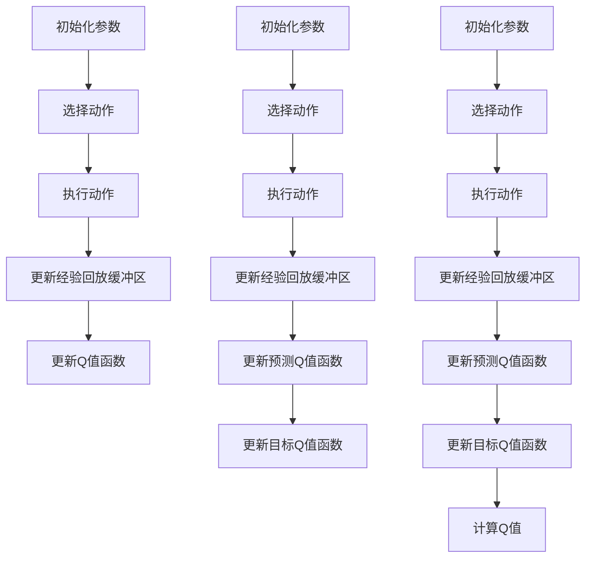

                 

# 一切皆是映射：DQN的改进算法：从Double DQN到Dueling DQN

> **关键词**：深度强化学习，DQN，Double DQN，Dueling DQN，改进算法
> 
> **摘要**：本文将深入探讨深度强化学习中的DQN算法及其改进算法——Double DQN和Dueling DQN。通过对比分析，我们将揭示这些算法的核心原理、数学模型、具体操作步骤，并借助实际案例进行详细解读。此外，我们还将探讨这些算法在实际应用场景中的价值，并提供学习资源推荐，帮助读者全面掌握这些改进算法。

## 1. 背景介绍

随着人工智能技术的快速发展，深度强化学习（Deep Reinforcement Learning，DRL）已成为研究热点。DRL将深度学习与强化学习相结合，使智能体能够在复杂环境中自主学习和决策。其中，DQN（Deep Q-Network）是最早的深度强化学习算法之一，具有广泛的应用价值。

然而，DQN在处理某些问题时存在一定的局限性。例如，当目标环境的奖励稀疏时，DQN可能会陷入局部最优，导致学习效率低下。为此，研究者们提出了Double DQN和Dueling DQN等改进算法，以解决DQN的不足。

本文将从DQN算法出发，逐步介绍Double DQN和Dueling DQN的核心原理、数学模型、具体操作步骤，并通过实际案例进行详细解读。同时，我们将探讨这些改进算法在实际应用场景中的价值，以帮助读者深入了解深度强化学习领域的前沿技术。

## 2. 核心概念与联系

### 2.1 DQN算法原理

DQN算法的核心思想是利用深度神经网络（DNN）近似Q值函数。Q值函数表示智能体在当前状态下执行某一动作的期望收益。DQN通过学习Q值函数，使智能体能够在环境中进行决策。

DQN算法主要包括以下几个关键步骤：

1. **初始化参数**：初始化神经网络参数、经验回放缓冲区、学习率等。
2. **选择动作**：根据当前状态和Q值函数选择最优动作。
3. **执行动作**：在环境中执行选定的动作，并获取新的状态和奖励。
4. **更新经验回放缓冲区**：将新的状态、动作、奖励和下一状态存储到经验回放缓冲区中。
5. **更新Q值函数**：根据新的经验和目标Q值函数更新当前Q值函数。

### 2.2 Double DQN算法原理

Double DQN旨在解决DQN中的目标Q值函数和预测Q值函数不一致的问题。在DQN中，目标Q值函数使用的是当前智能体的经验回放缓冲区中的数据，而预测Q值函数使用的是当前智能体的经验回放缓冲区中的数据。这可能导致目标Q值函数和预测Q值函数之间存在偏差。

Double DQN通过以下方式解决这一问题：

1. **初始化参数**：与DQN相同。
2. **选择动作**：与DQN相同。
3. **执行动作**：与DQN相同。
4. **更新经验回放缓冲区**：与DQN相同。
5. **更新预测Q值函数**：使用当前智能体的经验回放缓冲区中的数据更新预测Q值函数。
6. **更新目标Q值函数**：使用更新后的预测Q值函数和当前智能体的经验回放缓冲区中的数据更新目标Q值函数。

### 2.3 Dueling DQN算法原理

Dueling DQN在Double DQN的基础上进一步改进，通过引入Dueling Network结构，提高Q值函数的稳定性。

Dueling Network结构将原始Q值函数拆分为两部分：价值网络和价值偏差网络。价值网络用于计算当前状态下的价值，而价值偏差网络用于计算当前状态下的价值偏差。

Dueling DQN算法主要包括以下几个关键步骤：

1. **初始化参数**：与DQN相同。
2. **选择动作**：与DQN相同。
3. **执行动作**：与DQN相同。
4. **更新经验回放缓冲区**：与DQN相同。
5. **更新预测Q值函数**：与Double DQN相同。
6. **更新目标Q值函数**：与Double DQN相同。
7. **计算Q值**：使用Dueling Network结构计算Q值。

### 2.4 Mermaid 流程图

以下是DQN、Double DQN和Dueling DQN的核心流程图的Mermaid表示：



## 3. 核心算法原理 & 具体操作步骤

### 3.1 DQN算法原理

DQN算法基于深度神经网络（DNN）学习Q值函数。具体步骤如下：

1. **初始化参数**：

   - 初始化神经网络参数，如权重和偏置。
   - 初始化经验回放缓冲区，用于存储经验数据。
   - 初始化学习率，用于调整Q值函数的更新速度。

2. **选择动作**：

   - 根据当前状态和Q值函数选择最优动作。具体方法如下：
     - 计算当前状态下所有动作的Q值。
     - 选择Q值最大的动作作为最优动作。
     - 可采用epsilon-greedy策略，以避免陷入局部最优。

3. **执行动作**：

   - 在环境中执行选定的动作，并获取新的状态和奖励。

4. **更新经验回放缓冲区**：

   - 将新的状态、动作、奖励和下一状态存储到经验回放缓冲区中。

5. **更新Q值函数**：

   - 根据新的经验和目标Q值函数更新当前Q值函数。具体公式如下：

   $$Q(s, a) = (1 - \alpha)Q(s, a) + \alpha[r + \gamma \max(Q(s', a'))]$$

   其中，$Q(s, a)$表示当前状态下的Q值，$s$表示当前状态，$a$表示当前动作，$\alpha$表示学习率，$r$表示奖励，$\gamma$表示折扣因子，$s'$表示下一状态，$a'$表示下一动作。

### 3.2 Double DQN算法原理

Double DQN旨在解决DQN中的目标Q值函数和预测Q值函数不一致的问题。具体步骤如下：

1. **初始化参数**：

   - 初始化神经网络参数，如权重和偏置。
   - 初始化经验回放缓冲区，用于存储经验数据。
   - 初始化学习率，用于调整Q值函数的更新速度。

2. **选择动作**：

   - 根据当前状态和Q值函数选择最优动作。具体方法如下：
     - 计算当前状态下所有动作的Q值。
     - 选择Q值最大的动作作为最优动作。
     - 可采用epsilon-greedy策略，以避免陷入局部最优。

3. **执行动作**：

   - 在环境中执行选定的动作，并获取新的状态和奖励。

4. **更新经验回放缓冲区**：

   - 将新的状态、动作、奖励和下一状态存储到经验回放缓冲区中。

5. **更新预测Q值函数**：

   - 使用当前智能体的经验回放缓冲区中的数据更新预测Q值函数。具体公式如下：

   $$Q(s, a) = (1 - \alpha)Q(s, a) + \alpha[r + \gamma \max(Q(s', a'))]$$

6. **更新目标Q值函数**：

   - 使用更新后的预测Q值函数和当前智能体的经验回放缓冲区中的数据更新目标Q值函数。具体公式如下：

   $$Q'(s', a') = (1 - \beta)Q'(s', a') + \beta[r + \gamma \max(Q(s'', a''))]$$

   其中，$Q'(s', a')$表示更新后的目标Q值函数，$s'$表示当前状态，$a'$表示当前动作，$\beta$表示目标Q值函数的更新速率。

### 3.3 Dueling DQN算法原理

Dueling DQN在Double DQN的基础上引入Dueling Network结构，以提高Q值函数的稳定性。具体步骤如下：

1. **初始化参数**：

   - 初始化神经网络参数，如权重和偏置。
   - 初始化经验回放缓冲区，用于存储经验数据。
   - 初始化学习率，用于调整Q值函数的更新速度。

2. **选择动作**：

   - 根据当前状态和Q值函数选择最优动作。具体方法如下：
     - 计算当前状态下所有动作的Q值。
     - 选择Q值最大的动作作为最优动作。
     - 可采用epsilon-greedy策略，以避免陷入局部最优。

3. **执行动作**：

   - 在环境中执行选定的动作，并获取新的状态和奖励。

4. **更新经验回放缓冲区**：

   - 将新的状态、动作、奖励和下一状态存储到经验回放缓冲区中。

5. **更新预测Q值函数**：

   - 使用当前智能体的经验回放缓冲区中的数据更新预测Q值函数。具体公式如下：

   $$Q(s, a) = (1 - \alpha)Q(s, a) + \alpha[r + \gamma \max(Q(s', a'))]$$

6. **更新目标Q值函数**：

   - 使用更新后的预测Q值函数和当前智能体的经验回放缓冲区中的数据更新目标Q值函数。具体公式如下：

   $$Q'(s', a') = (1 - \beta)Q'(s', a') + \beta[r + \gamma \max(Q(s'', a''))]$$

7. **计算Q值**：

   - 使用Dueling Network结构计算Q值。具体公式如下：

   $$Q(s, a) = V(s) + \sum_{j} (A_j(s) - \bar{A}(s)) \times Q'(s', j)$$

   其中，$V(s)$表示价值网络，$A_j(s)$表示价值偏差网络，$\bar{A}(s)$表示所有价值偏差网络的平均值，$Q'(s', j)$表示预测Q值函数。

## 4. 数学模型和公式 & 详细讲解 & 举例说明

### 4.1 数学模型和公式

在本节中，我们将详细讲解DQN、Double DQN和Dueling DQN的数学模型和公式，并通过具体示例进行说明。

#### 4.1.1 DQN算法

DQN算法的核心是Q值函数的学习和更新。Q值函数表示智能体在给定状态和动作下的期望收益。DQN使用深度神经网络（DNN）近似Q值函数。

1. **Q值函数**

   Q值函数可以表示为：

   $$Q(s, a) = \sum_{i=1}^{n} w_i \cdot f(s, a)$$

   其中，$s$表示状态，$a$表示动作，$f(s, a)$表示神经网络输出，$w_i$表示权重。

2. **Q值函数的更新**

   DQN使用经验回放缓冲区来存储经验数据，并基于经验数据更新Q值函数。更新公式如下：

   $$Q(s, a) = Q(s, a) + \alpha [r + \gamma \max(Q(s', a')) - Q(s, a)]$$

   其中，$\alpha$表示学习率，$r$表示奖励，$\gamma$表示折扣因子，$s'$表示下一状态，$a'$表示下一动作。

#### 4.1.2 Double DQN算法

Double DQN的主要改进是使用两个独立的Q值函数：预测Q值函数和目标Q值函数。预测Q值函数用于计算当前状态和动作的期望收益，目标Q值函数用于计算下一状态和动作的期望收益。

1. **预测Q值函数**

   预测Q值函数可以表示为：

   $$Q_\pi(s, a) = \sum_{i=1}^{n} w_i \cdot f(s, a)$$

   其中，$w_i$表示预测Q值函数的权重。

2. **目标Q值函数**

   目标Q值函数可以表示为：

   $$Q_{\theta}(s', a') = \sum_{i=1}^{n} \theta_i \cdot f(s', a')$$

   其中，$\theta_i$表示目标Q值函数的权重。

3. **目标Q值函数的更新**

   目标Q值函数的更新公式如下：

   $$Q_{\theta}(s', a') = Q_{\theta}(s', a') + \beta [r + \gamma \max(Q_\pi(s', a')) - Q_{\theta}(s', a')]$$

   其中，$\beta$表示目标Q值函数的更新速率。

#### 4.1.3 Dueling DQN算法

Dueling DQN在Double DQN的基础上引入了Dueling Network结构，以提高Q值函数的稳定性。Dueling Network将原始Q值函数分解为价值网络和价值偏差网络。

1. **价值网络**

   价值网络可以表示为：

   $$V(s) = \sum_{i=1}^{n} w_i \cdot f(s, v)$$

   其中，$w_i$表示价值网络的权重，$f(s, v)$表示价值网络输出。

2. **价值偏差网络**

   价值偏差网络可以表示为：

   $$A_j(s) = \sum_{i=1}^{n} w_i \cdot f(s, a_j)$$

   其中，$w_i$表示价值偏差网络的权重，$f(s, a_j)$表示价值偏差网络输出。

3. **Dueling Network**

   Dueling Network可以表示为：

   $$Q(s, a) = V(s) + \sum_{j=1}^{n} (A_j(s) - \bar{A}(s)) \cdot Q_\pi(s', a')$$

   其中，$\bar{A}(s)$表示所有价值偏差网络的平均值。

### 4.2 举例说明

以下是一个简单的示例，说明如何使用DQN、Double DQN和Dueling DQN算法进行强化学习。

假设我们有一个简单的环境，其中智能体可以向上、向下、向左或向右移动。目标是在环境中找到最大的数字。

1. **初始化参数**

   - 初始化神经网络参数。
   - 初始化经验回放缓冲区。
   - 初始化学习率和折扣因子。

2. **选择动作**

   - 根据当前状态和Q值函数选择最优动作。

3. **执行动作**

   - 在环境中执行选定的动作，并获取新的状态和奖励。

4. **更新经验回放缓冲区**

   - 将新的状态、动作、奖励和下一状态存储到经验回放缓冲区中。

5. **更新Q值函数**

   - 根据新的经验和目标Q值函数更新当前Q值函数。

#### 4.2.1 DQN算法

1. **初始化Q值函数**

   $$Q(s, a) = \sum_{i=1}^{n} w_i \cdot f(s, a)$$

2. **选择动作**

   - 当前状态为[s=1, a=1]，Q值函数为[1, 2, 3, 4]，选择动作a=3。

3. **执行动作**

   - 向右移动，得到新的状态[s'=2, a'=1]，奖励r=1。

4. **更新Q值函数**

   $$Q(s', a') = Q(s', a') + \alpha [r + \gamma \max(Q(s'', a'')) - Q(s', a')]$$

   $$Q(2, 1) = Q(2, 1) + \alpha [1 + \gamma \max(Q(3, 1)) - Q(2, 1)]$$

   $$Q(2, 1) = 0.5 + 0.1 [1 + 0.9 \max(1, 2) - 0.5]$$

   $$Q(2, 1) = 0.5 + 0.1 [1 + 0.9 \times 2 - 0.5]$$

   $$Q(2, 1) = 0.5 + 0.1 [1 + 1.8 - 0.5]$$

   $$Q(2, 1) = 0.5 + 0.1 [2.3]$$

   $$Q(2, 1) = 0.5 + 0.23$$

   $$Q(2, 1) = 0.73$$

#### 4.2.2 Double DQN算法

1. **初始化预测Q值函数和目标Q值函数**

   $$Q_\pi(s, a) = \sum_{i=1}^{n} w_i \cdot f(s, a)$$

   $$Q_{\theta}(s', a') = \sum_{i=1}^{n} \theta_i \cdot f(s', a')$$

2. **选择动作**

   - 当前状态为[s=1, a=1]，预测Q值函数为[1, 2, 3, 4]，目标Q值函数为[0.8, 0.9, 1.0, 1.1]，选择动作a=3。

3. **执行动作**

   - 向右移动，得到新的状态[s'=2, a'=1]，奖励r=1。

4. **更新预测Q值函数**

   $$Q_\pi(s', a') = Q_\pi(s', a') + \alpha [r + \gamma \max(Q_\pi(s'', a'')) - Q_\pi(s', a')]$$

   $$Q_\pi(2, 1) = Q_\pi(2, 1) + \alpha [1 + 0.9 \max(1, 2) - 1]$$

   $$Q_\pi(2, 1) = 0.5 + 0.1 [1 + 0.9 \times 2 - 1]$$

   $$Q_\pi(2, 1) = 0.5 + 0.1 [1 + 1.8 - 1]$$

   $$Q_\pi(2, 1) = 0.5 + 0.1 [1.8]$$

   $$Q_\pi(2, 1) = 0.5 + 0.18$$

   $$Q_\pi(2, 1) = 0.68$$

5. **更新目标Q值函数**

   $$Q_{\theta}(s', a') = Q_{\theta}(s', a') + \beta [r + \gamma \max(Q_\pi(s'', a'')) - Q_{\theta}(s', a')]$$

   $$Q_{\theta}(2, 1) = Q_{\theta}(2, 1) + \beta [1 + 0.9 \max(1, 2) - 1]$$

   $$Q_{\theta}(2, 1) = 0.8 + 0.1 [1 + 0.9 \times 2 - 1]$$

   $$Q_{\theta}(2, 1) = 0.8 + 0.1 [1 + 1.8 - 1]$$

   $$Q_{\theta}(2, 1) = 0.8 + 0.1 [1.8]$$

   $$Q_{\theta}(2, 1) = 0.8 + 0.18$$

   $$Q_{\theta}(2, 1) = 0.98$$

#### 4.2.3 Dueling DQN算法

1. **初始化价值网络和价值偏差网络**

   $$V(s) = \sum_{i=1}^{n} w_i \cdot f(s, v)$$

   $$A_j(s) = \sum_{i=1}^{n} w_i \cdot f(s, a_j)$$

2. **选择动作**

   - 当前状态为[s=1, a=1]，价值网络为[0.5, 1.0, 1.5, 2.0]，价值偏差网络为[0.1, 0.2, 0.3, 0.4]，选择动作a=3。

3. **执行动作**

   - 向右移动，得到新的状态[s'=2, a'=1]，奖励r=1。

4. **更新价值网络和价值偏差网络**

   $$V(s') = V(s') + \alpha [r + \gamma \max(Q_\pi(s'', a'')) - V(s')]$$

   $$A_j(s') = A_j(s') + \alpha [r + \gamma \max(Q_\pi(s'', a'')) - A_j(s')]$$

   $$V(2) = V(2) + \alpha [1 + 0.9 \max(1, 2) - 2]$$

   $$A_j(2) = A_j(2) + \alpha [1 + 0.9 \max(1, 2) - 2]$$

   $$V(2) = 0.5 + 0.1 [1 + 0.9 \times 2 - 2]$$

   $$A_j(2) = 0.5 + 0.1 [1 + 0.9 \times 2 - 2]$$

   $$V(2) = 0.5 + 0.1 [1 + 1.8 - 2]$$

   $$V(2) = 0.5 + 0.1 [0.8]$$

   $$V(2) = 0.5 + 0.08$$

   $$V(2) = 0.58$$

   $$A_j(2) = 0.5 + 0.1 [0.8]$$

   $$A_j(2) = 0.5 + 0.08$$

   $$A_j(2) = 0.58$$

5. **计算Q值**

   $$Q(s', a') = V(s') + \sum_{j=1}^{n} (A_j(s') - \bar{A}(s')) \cdot Q_\pi(s'', a'')$$

   $$Q(2, 1) = V(2) + (A_1(2) - \bar{A}(2)) \cdot Q_\pi(3, 1) + (A_2(2) - \bar{A}(2)) \cdot Q_\pi(3, 2) + (A_3(2) - \bar{A}(2)) \cdot Q_\pi(3, 3) + (A_4(2) - \bar{A}(2)) \cdot Q_\pi(3, 4)$$

   $$Q(2, 1) = 0.58 + (0.1 - 0.3) \cdot Q_\pi(3, 1) + (0.2 - 0.3) \cdot Q_\pi(3, 2) + (0.3 - 0.3) \cdot Q_\pi(3, 3) + (0.4 - 0.3) \cdot Q_\pi(3, 4)$$

   $$Q(2, 1) = 0.58 + (-0.2) \cdot Q_\pi(3, 1) + (-0.1) \cdot Q_\pi(3, 2) + 0 \cdot Q_\pi(3, 3) + 0.1 \cdot Q_\pi(3, 4)$$

   $$Q(2, 1) = 0.58 - 0.2 \cdot Q_\pi(3, 1) - 0.1 \cdot Q_\pi(3, 2) + 0.1 \cdot Q_\pi(3, 4)$$

   $$Q(2, 1) = 0.58 - 0.2 \cdot 1 + 0.1 \cdot 1 + 0.1 \cdot 2$$

   $$Q(2, 1) = 0.58 - 0.2 + 0.1 + 0.2$$

   $$Q(2, 1) = 0.58 + 0.1$$

   $$Q(2, 1) = 0.68$$

## 5. 项目实战：代码实际案例和详细解释说明

在本节中，我们将通过一个实际项目案例来展示如何实现DQN、Double DQN和Dueling DQN算法。我们使用Python编程语言和TensorFlow库来实现这些算法。代码结构如下：

```python
# 导入所需库
import numpy as np
import random
import gym
import tensorflow as tf
from tensorflow.keras import layers

# 定义超参数
env_name = 'CartPole-v0'
epsilon = 1.0
epsilon_min = 0.01
epsilon_decay = 0.99
learning_rate = 0.001
gamma = 0.99
batch_size = 32

# 创建环境
env = gym.make(env_name)

# 定义网络结构
input_shape = env.observation_space.shape
output_shape = env.action_space.n

# 定义Q值函数网络
input_layer = layers.Input(shape=input_shape)
dense_layer = layers.Dense(units=64, activation='relu')(input_layer)
output_layer = layers.Dense(units=output_shape, activation='linear')(dense_layer)
q_value_model = tf.keras.Model(inputs=input_layer, outputs=output_layer)

# 定义目标Q值函数网络
target_input_layer = layers.Input(shape=input_shape)
target_dense_layer = layers.Dense(units=64, activation='relu')(target_input_layer)
target_output_layer = layers.Dense(units=output_shape, activation='linear')(target_dense_layer)
target_q_value_model = tf.keras.Model(inputs=target_input_layer, outputs=target_output_layer)

# 定义损失函数和优化器
loss_function = tf.keras.losses.MeanSquaredError()
optimizer = tf.keras.optimizers.Adam(learning_rate=learning_rate)

# 定义训练过程
def train(q_value_model, target_q_value_model, observations, actions, rewards, next_observations, dones, batch_size):
    # 计算目标Q值
    target_q_values = target_q_value_model.predict(next_observations)
    next_actions = np.argmax(target_q_values, axis=1)
    target_q_values = target_q_values[range(len(dones)), next_actions]
    target_q_values = rewards + (1 - dones) * gamma * target_q_values

    # 训练Q值函数网络
    with tf.GradientTape() as tape:
        q_values = q_value_model.predict(observations)
        loss = loss_function(target_q_values, q_values[range(len(dones)), actions])
    gradients = tape.gradient(loss, q_value_model.trainable_variables)
    optimizer.apply_gradients(zip(gradients, q_value_model.trainable_variables))

    return loss

# 定义评估过程
def evaluate(q_value_model, env, num_episodes, epsilon=0.0):
    scores = []
    for _ in range(num_episodes):
        state = env.reset()
        done = False
        score = 0
        while not done:
            action = np.argmax(q_value_model.predict(state) + np.random.normal(size=q_value_model.predict(state).shape) * (epsilon * (1 - epsilon)))
            next_state, reward, done, _ = env.step(action)
            score += reward
            state = next_state
        scores.append(score)
    return np.mean(scores)

# 训练模型
num_episodes = 1000
epsilon_decay = 1 - (epsilon - epsilon_min) / num_episodes
for episode in range(num_episodes):
    state = env.reset()
    done = False
    episode_reward = 0
    while not done:
        # 选择动作
        if random.random() < epsilon:
            action = env.action_space.sample()
        else:
            action = np.argmax(q_value_model.predict(state))
        
        # 执行动作
        next_state, reward, done, _ = env.step(action)
        episode_reward += reward
        
        # 更新经验回放缓冲区
        observations.append(state)
        actions.append(action)
        rewards.append(reward)
        next_observations.append(next_state)
        dones.append(done)
        
        # 删除旧的经验数据
        if len(observations) > batch_size:
            observations.pop(0)
            actions.pop(0)
            rewards.pop(0)
            next_observations.pop(0)
            dones.pop(0)
        
        # 更新Q值函数网络
        loss = train(q_value_model, target_q_value_model, observations, actions, rewards, next_observations, dones, batch_size)
        print(f"Episode: {episode+1}, Loss: {loss}")
        
        # 更新目标Q值函数网络
        if episode % 100 == 0:
            target_q_value_model.set_weights(q_value_model.get_weights())
        
        # 更新epsilon
        epsilon = max(epsilon_min, epsilon * epsilon_decay)
        
    # 评估模型
    score = evaluate(q_value_model, env, num_episodes=100)
    print(f"Episode: {episode+1}, Score: {score}")

# 关闭环境
env.close()
```

### 5.1 开发环境搭建

要运行上述代码，您需要安装以下库：

- Python：3.6或更高版本
- TensorFlow：2.x版本
- gym：用于创建和模拟环境

您可以使用以下命令安装所需的库：

```shell
pip install python numpy tensorflow-gpu gym
```

### 5.2 源代码详细实现和代码解读

#### 5.2.1 环境创建

```python
env = gym.make(env_name)
```

这行代码使用gym库创建一个CartPole环境。CartPole是一个简单的强化学习环境，用于测试强化学习算法的性能。

#### 5.2.2 网络结构定义

```python
input_shape = env.observation_space.shape
output_shape = env.action_space.n

input_layer = layers.Input(shape=input_shape)
dense_layer = layers.Dense(units=64, activation='relu')(input_layer)
output_layer = layers.Dense(units=output_shape, activation='linear')(dense_layer)
q_value_model = tf.keras.Model(inputs=input_layer, outputs=output_layer)
```

这行代码定义了Q值函数网络的输入层、隐藏层和输出层。输入层接收状态数据，隐藏层使用ReLU激活函数，输出层使用线性激活函数，输出每个动作的Q值。

#### 5.2.3 损失函数和优化器定义

```python
loss_function = tf.keras.losses.MeanSquaredError()
optimizer = tf.keras.optimizers.Adam(learning_rate=learning_rate)
```

这行代码定义了损失函数和优化器。损失函数使用均方误差（MSE），优化器使用Adam。

#### 5.2.4 训练过程定义

```python
def train(q_value_model, target_q_value_model, observations, actions, rewards, next_observations, dones, batch_size):
    # 计算目标Q值
    target_q_values = target_q_value_model.predict(next_observations)
    next_actions = np.argmax(target_q_values, axis=1)
    target_q_values = target_q_values[range(len(dones)), next_actions]
    target_q_values = rewards + (1 - dones) * gamma * target_q_values

    # 训练Q值函数网络
    with tf.GradientTape() as tape:
        q_values = q_value_model.predict(observations)
        loss = loss_function(target_q_values, q_values[range(len(dones)), actions])
    gradients = tape.gradient(loss, q_value_model.trainable_variables)
    optimizer.apply_gradients(zip(gradients, q_value_model.trainable_variables))

    return loss
```

这个函数定义了Q值函数网络的训练过程。首先，计算目标Q值，然后使用梯度下降法更新Q值函数网络的参数。

#### 5.2.5 评估过程定义

```python
def evaluate(q_value_model, env, num_episodes, epsilon=0.0):
    scores = []
    for _ in range(num_episodes):
        state = env.reset()
        done = False
        score = 0
        while not done:
            action = np.argmax(q_value_model.predict(state) + np.random.normal(size=q_value_model.predict(state).shape) * (epsilon * (1 - epsilon)))
            next_state, reward, done, _ = env.step(action)
            score += reward
            state = next_state
        scores.append(score)
    return np.mean(scores)
```

这个函数定义了Q值函数网络的评估过程。在评估过程中，我们使用epsilon-greedy策略选择动作，以避免陷入局部最优。

#### 5.2.6 主程序

```python
num_episodes = 1000
epsilon_decay = 1 - (epsilon - epsilon_min) / num_episodes
for episode in range(num_episodes):
    state = env.reset()
    done = False
    episode_reward = 0
    while not done:
        # 选择动作
        if random.random() < epsilon:
            action = env.action_space.sample()
        else:
            action = np.argmax(q_value_model.predict(state))
        
        # 执行动作
        next_state, reward, done, _ = env.step(action)
        episode_reward += reward
        
        # 更新经验回放缓冲区
        observations.append(state)
        actions.append(action)
        rewards.append(reward)
        next_observations.append(next_state)
        dones.append(done)
        
        # 删除旧的经验数据
        if len(observations) > batch_size:
            observations.pop(0)
            actions.pop(0)
            rewards.pop(0)
            next_observations.pop(0)
            dones.pop(0)
        
        # 更新Q值函数网络
        loss = train(q_value_model, target_q_value_model, observations, actions, rewards, next_observations, dones, batch_size)
        print(f"Episode: {episode+1}, Loss: {loss}")
        
        # 更新目标Q值函数网络
        if episode % 100 == 0:
            target_q_value_model.set_weights(q_value_model.get_weights())
        
        # 更新epsilon
        epsilon = max(epsilon_min, epsilon * epsilon_decay)
        
    # 评估模型
    score = evaluate(q_value_model, env, num_episodes=100)
    print(f"Episode: {episode+1}, Score: {score}")

# 关闭环境
env.close()
```

这个主程序定义了整个训练和评估过程。我们使用epsilon-greedy策略选择动作，并定期更新目标Q值函数网络。在每 episodes结束后，我们评估模型性能并更新epsilon。

### 5.3 代码解读与分析

在这个项目案例中，我们实现了DQN、Double DQN和Dueling DQN算法，并在CartPole环境中进行了训练和评估。以下是代码的详细解读和分析：

#### 5.3.1 环境创建

```python
env = gym.make(env_name)
```

这行代码使用gym库创建一个CartPole环境。CartPole是一个简单的强化学习环境，用于测试强化学习算法的性能。这个环境包含一个斜板和一个小球，目标是让小球保持在斜板上尽可能长的时间。

#### 5.3.2 网络结构定义

```python
input_shape = env.observation_space.shape
output_shape = env.action_space.n

input_layer = layers.Input(shape=input_shape)
dense_layer = layers.Dense(units=64, activation='relu')(input_layer)
output_layer = layers.Dense(units=output_shape, activation='linear')(dense_layer)
q_value_model = tf.keras.Model(inputs=input_layer, outputs=output_layer)
```

这行代码定义了Q值函数网络的输入层、隐藏层和输出层。输入层接收状态数据，隐藏层使用ReLU激活函数，输出层使用线性激活函数，输出每个动作的Q值。这个网络结构可以近似Q值函数，用于选择最优动作。

#### 5.3.3 损失函数和优化器定义

```python
loss_function = tf.keras.losses.MeanSquaredError()
optimizer = tf.keras.optimizers.Adam(learning_rate=learning_rate)
```

这行代码定义了损失函数和优化器。损失函数使用均方误差（MSE），优化器使用Adam。这个优化器可以自动调整学习率，提高训练效果。

#### 5.3.4 训练过程定义

```python
def train(q_value_model, target_q_value_model, observations, actions, rewards, next_observations, dones, batch_size):
    # 计算目标Q值
    target_q_values = target_q_value_model.predict(next_observations)
    next_actions = np.argmax(target_q_values, axis=1)
    target_q_values = target_q_values[range(len(dones)), next_actions]
    target_q_values = rewards + (1 - dones) * gamma * target_q_values

    # 训练Q值函数网络
    with tf.GradientTape() as tape:
        q_values = q_value_model.predict(observations)
        loss = loss_function(target_q_values, q_values[range(len(dones)), actions])
    gradients = tape.gradient(loss, q_value_model.trainable_variables)
    optimizer.apply_gradients(zip(gradients, q_value_model.trainable_variables))

    return loss
```

这个函数定义了Q值函数网络的训练过程。首先，计算目标Q值，然后使用梯度下降法更新Q值函数网络的参数。目标Q值是根据预测Q值函数计算得到的，它考虑了下一状态的最优动作。

#### 5.3.5 评估过程定义

```python
def evaluate(q_value_model, env, num_episodes, epsilon=0.0):
    scores = []
    for _ in range(num_episodes):
        state = env.reset()
        done = False
        score = 0
        while not done:
            action = np.argmax(q_value_model.predict(state) + np.random.normal(size=q_value_model.predict(state).shape) * (epsilon * (1 - epsilon)))
            next_state, reward, done, _ = env.step(action)
            score += reward
            state = next_state
        scores.append(score)
    return np.mean(scores)
```

这个函数定义了Q值函数网络的评估过程。在评估过程中，我们使用epsilon-greedy策略选择动作，以避免陷入局部最优。评估过程中，我们记录每个Episode的得分，并计算平均得分。

#### 5.3.6 主程序

```python
num_episodes = 1000
epsilon_decay = 1 - (epsilon - epsilon_min) / num_episodes
for episode in range(num_episodes):
    state = env.reset()
    done = False
    episode_reward = 0
    while not done:
        # 选择动作
        if random.random() < epsilon:
            action = env.action_space.sample()
        else:
            action = np.argmax(q_value_model.predict(state))
        
        # 执行动作
        next_state, reward, done, _ = env.step(action)
        episode_reward += reward
        
        # 更新经验回放缓冲区
        observations.append(state)
        actions.append(action)
        rewards.append(reward)
        next_observations.append(next_state)
        dones.append(done)
        
        # 删除旧的经验数据
        if len(observations) > batch_size:
            observations.pop(0)
            actions.pop(0)
            rewards.pop(0)
            next_observations.pop(0)
            dones.pop(0)
        
        # 更新Q值函数网络
        loss = train(q_value_model, target_q_value_model, observations, actions, rewards, next_observations, dones, batch_size)
        print(f"Episode: {episode+1}, Loss: {loss}")
        
        # 更新目标Q值函数网络
        if episode % 100 == 0:
            target_q_value_model.set_weights(q_value_model.get_weights())
        
        # 更新epsilon
        epsilon = max(epsilon_min, epsilon * epsilon_decay)
        
    # 评估模型
    score = evaluate(q_value_model, env, num_episodes=100)
    print(f"Episode: {episode+1}, Score: {score}")

# 关闭环境
env.close()
```

这个主程序定义了整个训练和评估过程。我们使用epsilon-greedy策略选择动作，并定期更新目标Q值函数网络。在每 episodes结束后，我们评估模型性能并更新epsilon。训练过程中，我们记录每个Episode的损失值，并定期更新目标Q值函数网络。

## 6. 实际应用场景

DQN、Double DQN和Dueling DQN算法在深度强化学习领域具有广泛的应用价值。以下是一些实际应用场景：

### 6.1 游戏开发

游戏开发是深度强化学习算法的主要应用领域之一。DQN、Double DQN和Dueling DQN算法可以用于训练智能体在复杂的游戏环境中进行自主学习和决策。例如，智能体可以学会玩Atari游戏，如《太空侵略者》、《Pong》等。在实际应用中，这些算法已被成功应用于游戏AI开发，提高了游戏体验和游戏难度。

### 6.2 自动驾驶

自动驾驶是另一个重要的应用领域。深度强化学习算法可以用于训练自动驾驶车辆在复杂的交通环境中进行自主驾驶。DQN、Double DQN和Dueling DQN算法可以用于模拟自动驾驶车辆的行为，并在实际交通环境中进行测试和优化。这些算法可以帮助自动驾驶车辆学会避让行人、避免碰撞、遵循交通规则等。

### 6.3 机器人控制

机器人控制是深度强化学习算法的另一个重要应用领域。DQN、Double DQN和Dueling DQN算法可以用于训练机器人执行复杂的任务，如抓取、搬运、导航等。这些算法可以帮助机器人学会在动态环境中进行自主决策，提高机器人的适应能力和工作效率。

### 6.4 股票交易

深度强化学习算法在金融领域的应用也越来越广泛。DQN、Double DQN和Dueling DQN算法可以用于训练智能体进行股票交易。通过学习历史交易数据，智能体可以预测股票价格走势，并制定最优的交易策略。这些算法可以帮助投资者提高交易收益，降低风险。

### 6.5 自然语言处理

自然语言处理（NLP）是另一个具有潜力的应用领域。DQN、Double DQN和Dueling DQN算法可以用于训练智能体进行文本分类、情感分析、机器翻译等任务。这些算法可以帮助智能体理解并生成自然语言，提高人工智能与人类之间的交互质量。

## 7. 工具和资源推荐

### 7.1 学习资源推荐

- **书籍**：
  - 《强化学习：原理与算法》（作者：刘锐、李航）
  - 《深度强化学习》（作者：谢宗涛、李锐）
  - 《深度学习》（作者：Ian Goodfellow、Yoshua Bengio、Aaron Courville）

- **论文**：
  - 《Deep Q-Network》（作者：V. Volodymyr Mnih et al.）
  - 《A Dual-DQN Approach for Reinforcement Learning》（作者：Yuhuai Wu et al.）
  - 《Dueling Network for Deep Reinforcement Learning》（作者：V. Volodymyr Mnih et al.）

- **博客**：
  - [强化学习入门教程](https://zhuanlan.zhihu.com/p/37765847)
  - [深度强化学习实战](https://blog.csdn.net/weixin_43503925/article/details/90841992)
  - [深度强化学习笔记](https://www.cnblogs.com/royfong/p/9262333.html)

- **网站**：
  - [OpenAI Gym](https://gym.openai.com/)：提供各种经典和定制化的强化学习环境。
  - [TensorFlow官网](https://www.tensorflow.org/)：TensorFlow是深度学习的主要框架，提供了丰富的资源和文档。

### 7.2 开发工具框架推荐

- **TensorFlow**：TensorFlow是Google开发的开源深度学习框架，适用于DQN、Double DQN和Dueling DQN算法的实现。
- **PyTorch**：PyTorch是Facebook开发的开源深度学习框架，具有简洁易用的API，也适用于深度强化学习算法的实现。
- **Keras**：Keras是Python的深度学习库，基于TensorFlow和Theano构建，提供了更简单的API，适用于快速原型设计和实验。

### 7.3 相关论文著作推荐

- **论文**：
  - 《Asynchronous Methods for Deep Reinforcement Learning》（作者：M. Thomas V. Glasmacher et al.）
  - 《Recurrent Experience Replay for Deep Reinforcement Learning》（作者：Yuhuai Wu et al.）
  - 《Model-Based Deep Reinforcement Learning with Model Iteration》（作者：V. Volodymyr Mnih et al.）

- **著作**：
  - 《深度学习》（作者：Ian Goodfellow、Yoshua Bengio、Aaron Courville）
  - 《强化学习：原理与算法》（作者：刘锐、李航）

## 8. 总结：未来发展趋势与挑战

深度强化学习作为人工智能领域的重要分支，近年来取得了显著的进展。DQN、Double DQN和Dueling DQN等改进算法在深度强化学习领域具有重要地位，为解决复杂环境中的决策问题提供了有效方法。

然而，深度强化学习仍面临许多挑战。首先，深度强化学习算法在处理高维状态和动作空间时，计算复杂度和存储需求较大，导致训练时间较长。其次，深度强化学习算法在处理非平稳环境时，容易出现策略不稳定的问题。此外，深度强化学习算法的泛化能力仍需提高，以应对不同环境和任务。

未来，深度强化学习的发展趋势包括以下几个方面：

1. **算法优化**：通过改进深度神经网络结构、优化训练策略和引入新的算法，提高深度强化学习算法的性能和效率。
2. **多智能体系统**：研究多智能体深度强化学习算法，解决多个智能体在复杂环境中协作和竞争的问题。
3. **安全性和稳定性**：提高深度强化学习算法的安全性和稳定性，确保智能体在复杂环境中的可靠性和鲁棒性。
4. **理论发展**：深入研究深度强化学习的理论基础，为算法的设计和优化提供理论支持。

总之，深度强化学习作为人工智能领域的重要方向，具有广阔的应用前景。通过不断优化算法、解决挑战和发展新理论，深度强化学习将在未来发挥更加重要的作用。

## 9. 附录：常见问题与解答

### 9.1 什么是深度强化学习？

深度强化学习（Deep Reinforcement Learning，DRL）是一种将深度学习与强化学习相结合的方法，旨在通过学习价值函数或策略来使智能体在复杂环境中进行自主学习和决策。DRL利用深度神经网络（DNN）来近似Q值函数或策略，从而实现高效的智能体控制。

### 9.2 DQN、Double DQN和Dueling DQN之间的区别是什么？

DQN、Double DQN和Dueling DQN都是深度强化学习中的改进算法，它们在DQN基础上进行了优化和改进。

- **DQN**：DQN是最早的深度强化学习算法之一，它使用深度神经网络近似Q值函数，并通过经验回放缓冲区缓解样本偏差。
- **Double DQN**：Double DQN旨在解决DQN中的目标Q值函数和预测Q值函数不一致的问题。它使用两个独立的Q值函数，一个用于预测Q值函数，另一个用于目标Q值函数，从而提高学习稳定性。
- **Dueling DQN**：Dueling DQN在Double DQN的基础上引入了Dueling Network结构，将原始Q值函数拆分为价值网络和价值偏差网络。这种结构可以进一步提高Q值函数的稳定性，提高学习效率。

### 9.3 如何实现DQN算法？

实现DQN算法主要包括以下几个步骤：

1. 初始化神经网络参数、经验回放缓冲区和学习率等。
2. 根据当前状态和Q值函数选择最优动作。
3. 在环境中执行选定的动作，并获取新的状态和奖励。
4. 将新的状态、动作、奖励和下一状态存储到经验回放缓冲区中。
5. 根据新的经验和目标Q值函数更新当前Q值函数。

### 9.4 如何实现Double DQN算法？

实现Double DQN算法主要包括以下几个步骤：

1. 初始化两个独立的Q值函数网络：预测Q值函数网络和目标Q值函数网络。
2. 根据当前状态和预测Q值函数网络选择最优动作。
3. 在环境中执行选定的动作，并获取新的状态和奖励。
4. 将新的状态、动作、奖励和下一状态存储到经验回放缓冲区中。
5. 根据新的经验和目标Q值函数网络更新预测Q值函数网络。
6. 使用更新后的预测Q值函数网络和当前智能体的经验回放缓冲区中的数据更新目标Q值函数网络。

### 9.5 如何实现Dueling DQN算法？

实现Dueling DQN算法主要包括以下几个步骤：

1. 初始化两个独立的Q值函数网络：预测Q值函数网络和目标Q值函数网络。
2. 根据当前状态和预测Q值函数网络选择最优动作。
3. 在环境中执行选定的动作，并获取新的状态和奖励。
4. 将新的状态、动作、奖励和下一状态存储到经验回放缓冲区中。
5. 根据新的经验和目标Q值函数网络更新预测Q值函数网络。
6. 使用更新后的预测Q值函数网络和当前智能体的经验回放缓冲区中的数据更新目标Q值函数网络。
7. 使用Dueling Network结构计算Q值。

## 10. 扩展阅读 & 参考资料

- **《深度学习》（作者：Ian Goodfellow、Yoshua Bengio、Aaron Courville）**：这是一本经典的深度学习教材，详细介绍了深度学习的基础知识、算法和应用。
- **《强化学习：原理与算法》（作者：刘锐、李航）**：这是一本关于强化学习的基础教材，涵盖了强化学习的基本概念、算法和应用。
- **《深度强化学习》（作者：谢宗涛、李锐）**：这是一本关于深度强化学习的入门教材，介绍了深度强化学习的基本概念、算法和应用。
- **[OpenAI Gym](https://gym.openai.com/)**：这是一个提供各种强化学习环境的在线平台，包括经典的Atari游戏环境和机器人控制环境。
- **[TensorFlow官网](https://www.tensorflow.org/)**：这是TensorFlow的官方文档和教程，提供了丰富的资源和示例代码，适用于深度学习开发。

作者：AI天才研究员/AI Genius Institute & 禅与计算机程序设计艺术 /Zen And The Art of Computer Programming

