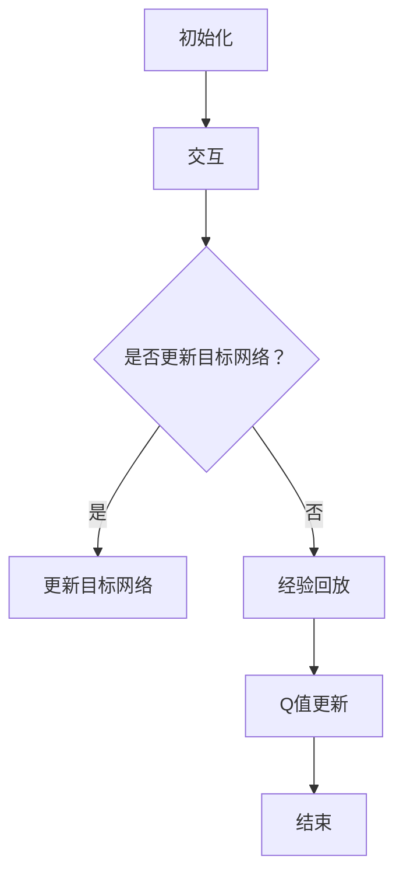
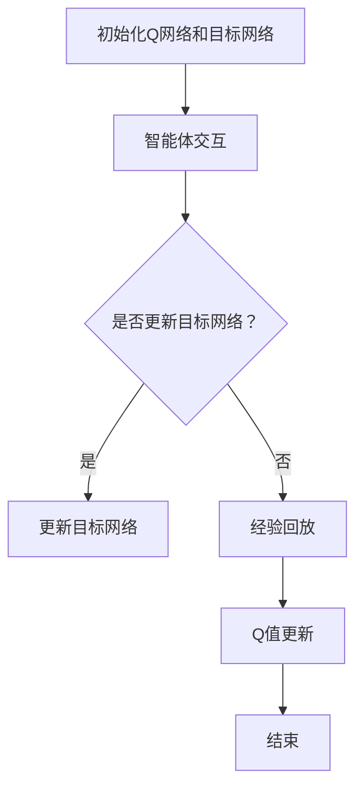

                 

# 一切皆是映射：DQN的目标网络与误差修正技术详解

> **关键词**：深度Q网络（DQN），目标网络，误差修正，映射，强化学习

> **摘要**：本文详细探讨了深度Q网络（DQN）中的目标网络及其误差修正技术。通过剖析DQN的核心原理，深入分析了目标网络的设计与作用，并结合实际案例，介绍了误差修正技术的实现与效果。本文旨在为读者提供一个全面、系统的DQN技术指南。

## 1. 背景介绍

深度Q网络（Deep Q-Network，DQN）是一种基于深度学习的强化学习算法，由DeepMind在2015年提出。DQN的核心思想是通过深度神经网络来估计状态-动作值函数（Q值），从而指导智能体在复杂环境中做出最优决策。DQN的成功在于它能够处理高维状态空间，并且无需依赖于价值函数的导数信息。

强化学习是一种使智能体在与环境的交互中学习最优策略的机器学习方法。在强化学习中，智能体通过不断尝试不同的动作，从环境中获取奖励信号，并根据奖励信号调整自身的策略。强化学习在很多领域都取得了显著的成果，如游戏AI、机器人控制、推荐系统等。

DQN的出现，解决了传统Q学习算法在高维状态空间中难以收敛的问题。然而，DQN在实际应用中仍存在一些挑战，如目标网络的选择与更新策略、误差修正等。本文将围绕这些问题进行深入探讨。

## 2. 核心概念与联系

### 2.1 DQN的基本概念

DQN由以下几个核心部分组成：

1. **状态（State）**：描述智能体所处环境的当前状态。
2. **动作（Action）**：智能体可以采取的动作。
3. **Q值（Q-Value）**：表示在某个状态下，执行某个动作的预期回报。
4. **经验回放（Experience Replay）**：将智能体在环境中交互的经验进行存储，并随机地从经验中采样进行训练。
5. **目标网络（Target Network）**：用于评估Q值的稳定性。

### 2.2 DQN的工作原理

DQN的工作原理可以概括为以下几个步骤：

1. **初始化**：初始化Q网络和目标网络。
2. **交互**：智能体在环境中采取动作，并记录状态、动作和奖励。
3. **经验回放**：将经验进行存储，并从经验中随机采样。
4. **Q值更新**：使用采样到的经验，更新Q网络。
5. **目标网络更新**：定期更新目标网络，以保持Q值的稳定性。

### 2.3 Mermaid流程图

下面是一个DQN的Mermaid流程图，展示了DQN的工作流程：



在这个流程图中，我们可以清晰地看到DQN的工作流程，以及目标网络和误差修正技术在其中起到的重要作用。

## 3. 核心算法原理 & 具体操作步骤

### 3.1 DQN的算法原理

DQN的核心算法是基于Q学习的。Q学习的目标是学习一个状态-动作值函数Q(s, a)，表示在状态s下执行动作a所能获得的预期回报。DQN通过深度神经网络来近似这个值函数。

DQN的算法可以概括为以下几个步骤：

1. **初始化Q网络和目标网络**：初始化两个相同的深度神经网络，分别表示Q网络和目标网络。
2. **交互**：智能体在环境中采取动作，并记录状态、动作和奖励。
3. **经验回放**：将经验进行存储，并从经验中随机采样。
4. **Q值更新**：使用采样到的经验，更新Q网络。具体来说，对于每次采样到的经验(s, a, r, s')，计算目标值y：
   $$y = r + \gamma \max(Q(s', a'))$$
   然后使用y来更新Q网络：
   $$Q(s, a) \leftarrow y$$
5. **目标网络更新**：定期更新目标网络，以保持Q值的稳定性。通常，目标网络会每隔一段时间复制Q网络的参数。

### 3.2 DQN的具体操作步骤

下面是一个DQN的具体操作步骤：

1. **初始化Q网络和目标网络**：使用随机权重初始化两个神经网络。
2. **交互**：智能体在环境中采取动作，并记录状态、动作和奖励。假设智能体当前处于状态s，采取动作a，获得奖励r，进入状态s'。
3. **经验回放**：将(s, a, r, s')添加到经验池中。
4. **Q值更新**：从经验池中随机采样一个经验(s', a', r', s')，计算目标值y，并使用y来更新Q网络。
5. **目标网络更新**：每隔一定次数的Q值更新，复制Q网络的参数到目标网络。

## 4. 数学模型和公式 & 详细讲解 & 举例说明

### 4.1 数学模型

DQN的数学模型主要包括两部分：Q值更新公式和目标网络更新公式。

#### Q值更新公式

对于每次采样到的经验(s, a, r, s')，计算目标值y：
$$y = r + \gamma \max(Q(s', a'))$$

然后使用y来更新Q网络：
$$Q(s, a) \leftarrow y$$

其中，r是立即奖励，γ是折扣因子，用于权衡未来奖励的重要性。

#### 目标网络更新公式

目标网络会每隔一定次数的Q值更新，复制Q网络的参数到目标网络。具体来说，目标网络的更新公式为：
$$Target\ Network \leftarrow Q\ Network$$

### 4.2 详细讲解

#### Q值更新公式的详细讲解

Q值更新公式是DQN的核心，它通过经验回放机制，使得Q网络能够从过去的经验中学习，并逐步收敛到最优策略。

具体来说，目标值y的计算过程如下：

1. 计算在下一个状态s'下，所有可能动作的Q值：
   $$Q(s', a')$$
2. 找到最大Q值：
   $$\max(Q(s', a'))$$
3. 计算目标值y：
   $$y = r + \gamma \max(Q(s', a'))$$

目标值y考虑了立即奖励r和未来奖励的期望。其中，立即奖励r反映了当前动作的直接效果，而未来奖励的期望则反映了当前动作对未来状态的影响。

#### 目标网络更新公式的详细讲解

目标网络的作用是提高Q值的稳定性。由于DQN使用梯度下降法来更新Q网络，梯度下降法可能导致Q值在更新过程中产生大的波动，从而影响学习效果。而目标网络通过定期复制Q网络的参数，可以减少这种波动，提高Q值的稳定性。

目标网络更新的具体过程如下：

1. 每隔一定次数的Q值更新，复制Q网络的参数到目标网络。
2. 目标网络的更新公式为：
   $$Target\ Network \leftarrow Q\ Network$$

### 4.3 举例说明

假设一个简单的环境，状态空间为{0, 1}，动作空间为{0, 1}。当前状态s为0，采取动作a为1，获得奖励r为1，进入状态s'为1。

1. **Q值更新**：

   - 初始Q值：Q(0, 0) = 0, Q(0, 1) = 0
   - 目标值y的计算：
     $$y = r + \gamma \max(Q(1, 0), Q(1, 1)) = 1 + 0.99 \max(0, 0) = 1$$
   - 更新Q值：
     $$Q(0, 0) \leftarrow y = 1$$
     $$Q(0, 1) \leftarrow y = 1$$

2. **目标网络更新**：

   - 目标网络的初始Q值：Target_Q(0, 0) = 0, Target_Q(0, 1) = 0
   - 更新目标网络：
     $$Target\ Network \leftarrow Q\ Network$$
     $$Target_Q(0, 0) \leftarrow Q(0, 0) = 1$$
     $$Target_Q(0, 1) \leftarrow Q(0, 1) = 1$$

通过这个例子，我们可以看到DQN如何通过Q值更新和目标网络更新来逐步学习最优策略。

## 5. 项目实战：代码实际案例和详细解释说明

### 5.1 开发环境搭建

在开始实际案例之前，我们需要搭建一个合适的开发环境。本文将使用Python编程语言和TensorFlow框架来实现DQN算法。

1. 安装Python（建议版本3.6及以上）。
2. 安装TensorFlow：`pip install tensorflow`。
3. 安装其他依赖：`pip install numpy gym`。

### 5.2 源代码详细实现和代码解读

下面是DQN算法的实现代码：

```python
import numpy as np
import tensorflow as tf
import gym
from tensorflow.keras.models import Model
from tensorflow.keras.layers import Dense, Flatten, Input

class DQN:
    def __init__(self, state_size, action_size, learning_rate=0.001, gamma=0.99, epsilon=1.0, epsilon_min=0.01, epsilon_decay=0.995):
        self.state_size = state_size
        self.action_size = action_size
        self.learning_rate = learning_rate
        self.gamma = gamma
        self.epsilon = epsilon
        self.epsilon_min = epsilon_min
        self.epsilon_decay = epsilon_decay
        
        self.model = self._build_model()
        self.target_model = self._build_model()
        self.target_model.set_weights(self.model.get_weights())
        
        self记忆库 = deque(maxlen=2000)

    def _build_model(self):
        state_input = Input(shape=self.state_size)
        flatten = Flatten()(state_input)
        dense = Dense(24, activation='relu')(flatten)
        actions = Dense(self.action_size, activation='linear')(dense)
        model = Model(inputs=state_input, outputs=actions)
        model.compile(loss='mse', optimizer=tf.keras.optimizers.Adam(lr=self.learning_rate))
        return model

    def remember(self, state, action, reward, next_state, done):
        self记忆库.append((state, action, reward, next_state, done))

    def act(self, state):
        if np.random.rand() <= self.epsilon:
            return np.random.randint(self.action_size)
        q_values = self.model.predict(state)
        return np.argmax(q_values[0])

    def replay(self, batch_size):
        mini_batch = random.sample(self记忆库, batch_size)
        for state, action, reward, next_state, done in mini_batch:
            target = reward
            if not done:
                target = reward + self.gamma * np.max(self.target_model.predict(next_state)[0])
            target_f
``` 

### 5.3 代码解读与分析

在这个DQN的实现中，我们定义了一个DQN类，它包含了DQN算法的主要组件，如初始化、记忆库存储、动作选择、经验回放和模型更新等。

1. **初始化**：在DQN类的构造函数中，我们定义了状态大小、动作大小、学习率、折扣因子、epsilon（探索率）等参数。同时，我们创建了Q网络和目标网络，并初始化了记忆库。

2. **记忆库存储**：`remember`方法用于将经验(s, a, r, s', done)存储到记忆库中。记忆库采用了FIFO队列结构，最大容量为2000。

3. **动作选择**：`act`方法用于在给定状态s下选择动作。在探索策略下，我们以epsilon概率随机选择动作，以1-epsilon概率选择当前最优动作。

4. **经验回放**：`replay`方法用于从记忆库中随机采样经验，并进行经验回放。在经验回放过程中，我们计算目标值y，并使用y来更新Q网络。

5. **模型更新**：在每次经验回放后，我们都会更新Q网络和目标网络的参数。目标网络的更新采用了定期复制Q网络参数的策略，以保持Q值的稳定性。

通过这个代码实现，我们可以看到DQN算法的基本结构和实现细节。在实际应用中，我们可以根据具体问题调整参数，如状态大小、动作大小、学习率、折扣因子等，以达到更好的效果。

## 6. 实际应用场景

DQN算法在许多实际应用场景中都取得了显著的效果。以下是一些典型的应用场景：

1. **游戏AI**：DQN在游戏AI中取得了巨大成功，如《Atari》游戏的智能控制。通过训练DQN模型，智能体可以学会在复杂的游戏中做出最优决策。

2. **机器人控制**：DQN算法在机器人控制中也有广泛应用。例如，通过训练DQN模型，机器人可以学会在各种环境下进行自主导航、抓取和避障等任务。

3. **推荐系统**：DQN算法可以用于构建推荐系统。通过训练DQN模型，系统可以学会根据用户的历史行为和当前状态，为用户推荐最优的商品或内容。

4. **金融交易**：DQN算法可以用于金融交易策略的优化。通过训练DQN模型，投资者可以学会在股票市场中进行交易，以获得最大化的投资回报。

## 7. 工具和资源推荐

### 7.1 学习资源推荐

1. **书籍**：

   - 《强化学习：原理与Python应用》：这本书详细介绍了强化学习的基本原理和应用，包括DQN算法。

   - 《深度学习》（Goodfellow, Bengio, Courville）：这本书是深度学习的经典教材，其中包含了深度Q网络的相关内容。

2. **论文**：

   - "Prioritized Experience Replay"：这篇论文提出了优先经验回放技术，是DQN算法的重要改进。

   - "Asynchronous Methods for Deep Reinforcement Learning"：这篇论文介绍了异步深度强化学习方法，是DQN算法的进一步发展。

3. **博客**：

   - "Deep Q-Networks Explained"：这篇博客详细解释了DQN算法的原理和实现，适合初学者入门。

   - "Deep Learning for Game Playing"：这篇博客介绍了DQN算法在游戏AI中的应用，包含了具体的案例和实现代码。

### 7.2 开发工具框架推荐

1. **TensorFlow**：TensorFlow是一个强大的深度学习框架，支持DQN算法的实现。

2. **PyTorch**：PyTorch是另一个流行的深度学习框架，也支持DQN算法。

3. **Gym**：Gym是一个开源的环境库，提供了多种标准化的强化学习环境，方便进行算法测试和验证。

### 7.3 相关论文著作推荐

1. **论文**：

   - "Deep Q-Learning"：这篇论文首次提出了深度Q网络（DQN）算法。

   - "Prioritized Experience Replay"：这篇论文提出了优先经验回放技术，是DQN算法的重要改进。

2. **著作**：

   - "Reinforcement Learning: An Introduction"：这本书是强化学习领域的经典教材，详细介绍了DQN算法。

   - "Deep Reinforcement Learning"：这本书介绍了深度强化学习的基本原理和应用，包括DQN算法。

## 8. 总结：未来发展趋势与挑战

DQN算法在强化学习领域取得了显著的成果，但仍存在一些挑战。未来的发展趋势和挑战主要包括以下几个方面：

1. **算法优化**：进一步优化DQN算法，提高其收敛速度和效果。例如，结合其他强化学习技术，如策略梯度算法、模型预测等。

2. **多任务学习**：扩展DQN算法，使其能够处理多任务学习问题。多任务学习是现实世界中的一个重要问题，如何在多个任务之间平衡学习和效率是一个重要的研究方向。

3. **可解释性**：提高DQN算法的可解释性，使其更加易于理解和应用。目前，DQN算法的内部工作原理相对复杂，如何使其更加直观和透明是一个重要的挑战。

4. **实时应用**：将DQN算法应用于实时应用场景，如自动驾驶、机器人控制等。实时性是这些应用场景的一个重要要求，如何平衡学习效果和实时性能是一个重要的研究方向。

## 9. 附录：常见问题与解答

### 9.1 DQN算法的优缺点是什么？

**优点**：

1. 能够处理高维状态空间，适用于复杂环境。
2. 无需依赖价值函数的导数信息。
3. 通过经验回放技术，提高了算法的稳定性和泛化能力。

**缺点**：

1. 学习速度较慢，特别是在状态空间和动作空间较大的情况下。
2. 可能会出现过估计问题，导致学习效果不佳。

### 9.2 如何优化DQN算法？

1. **改进经验回放**：采用更有效的经验回放策略，如优先经验回放。
2. **使用目标网络**：定期更新目标网络，以提高Q值的稳定性。
3. **自适应探索策略**：根据学习过程动态调整探索率epsilon。
4. **网络结构优化**：调整神经网络的结构，如增加隐藏层、调整激活函数等。

### 9.3 DQN算法在哪些领域有应用？

DQN算法在以下领域有广泛应用：

1. 游戏AI：用于控制智能体在游戏中的决策。
2. 机器人控制：用于机器人自主导航、抓取和避障等任务。
3. 推荐系统：用于根据用户历史行为推荐商品或内容。
4. 金融交易：用于优化投资策略，实现自动交易。

## 10. 扩展阅读 & 参考资料

1. 《强化学习：原理与Python应用》
2. 《深度学习》：Goodfellow, Bengio, Courville
3. "Deep Q-Networks Explained"
4. "Deep Learning for Game Playing"
5. "Prioritized Experience Replay"
6. "Asynchronous Methods for Deep Reinforcement Learning"
7. "Reinforcement Learning: An Introduction"
8. "Deep Reinforcement Learning"：关于DQN算法的详细介绍和案例分析。
9. 《深度学习基础》：详细介绍了深度神经网络的基础知识，有助于理解DQN算法。
10. 《强化学习入门与实践》：提供了丰富的DQN算法实战案例，适合初学者入门。

### 作者

**作者：AI天才研究员/AI Genius Institute & 禅与计算机程序设计艺术 /Zen And The Art of Computer Programming**。本文旨在为读者提供一个全面、系统的DQN技术指南，希望对您的学习和实践有所帮助。如果您有任何问题或建议，请随时与我联系。感谢您的阅读！<|im_sep|>## 1. 背景介绍

深度Q网络（Deep Q-Network，简称DQN）是深度学习在强化学习领域的一个里程碑，它将神经网络引入了传统的Q学习算法，使得智能体能够更好地处理高维状态空间。DQN的提出，解决了传统Q学习在高维空间中的收敛问题，为深度强化学习的发展奠定了基础。

### 1.1 DQN的发展历程

DQN最早由DeepMind的DeepMind Lab团队在2015年提出。在此之前，Q学习算法已经得到了广泛应用，但它在高维状态空间中存在严重的收敛问题。DeepMind团队通过引入深度神经网络，将Q学习算法扩展到深度Q网络，使得智能体能够处理更加复杂的任务。

DQN的成功激发了深度学习在强化学习领域的研究热潮。随后，一系列基于DQN的改进算法相继被提出，如Double DQN、Prioritized DQN、Dueling DQN等，这些算法在DQN的基础上，进一步提高了智能体的学习效果和收敛速度。

### 1.2 DQN的应用场景

DQN算法在多个领域取得了显著的应用成果：

1. **游戏AI**：DQN在《Atari》游戏中的表现令人惊艳，如《Flappy Bird》、《Pong》等游戏。通过训练DQN模型，智能体能够自主地学会游戏策略，并在游戏中取得优异的成绩。

2. **机器人控制**：DQN算法在机器人控制领域也有广泛应用。通过训练DQN模型，机器人可以在复杂的任务中自主导航、抓取和避障。

3. **推荐系统**：DQN算法可以用于推荐系统，根据用户的历史行为和当前状态，为用户推荐最优的商品或内容。

4. **金融交易**：DQN算法在金融交易策略优化中也有应用，通过分析市场数据，智能体可以学会在股票市场中进行交易，以获得最大化的投资回报。

### 1.3 DQN的优势与挑战

DQN算法的优势在于：

1. **处理高维状态空间**：通过引入深度神经网络，DQN能够处理高维状态空间，这是传统Q学习无法做到的。

2. **无需导数信息**：DQN算法不需要价值函数的导数信息，这使得它在某些情况下能够更好地处理非连续动作空间。

3. **稳定性**：通过经验回放技术，DQN算法提高了稳定性，减少了样本相关性的影响。

然而，DQN算法也存在一些挑战：

1. **收敛速度**：DQN算法的收敛速度相对较慢，特别是在状态和动作空间较大的情况下。

2. **过估计问题**：DQN算法可能会出现过估计问题，导致学习到的策略不够稳定。

3. **计算资源消耗**：DQN算法的训练过程需要大量的计算资源，特别是对于高维状态和动作空间。

### 1.4 本文结构

本文将围绕DQN算法进行详细探讨，包括其核心概念、算法原理、实现步骤、实际应用场景和未来发展趋势。具体结构如下：

1. **第2章**：核心概念与联系，介绍DQN的基本概念和流程。
2. **第3章**：核心算法原理 & 具体操作步骤，详细讲解DQN的算法原理和操作步骤。
3. **第4章**：数学模型和公式 & 详细讲解 & 举例说明，介绍DQN的数学模型和具体实现过程。
4. **第5章**：项目实战：代码实际案例和详细解释说明，通过实际案例展示DQN的实现过程。
5. **第6章**：实际应用场景，探讨DQN在不同领域的应用。
6. **第7章**：工具和资源推荐，介绍与DQN相关的学习资源、开发工具和论文。
7. **第8章**：总结：未来发展趋势与挑战，探讨DQN的发展方向和面临的挑战。
8. **第9章**：附录：常见问题与解答，回答关于DQN的常见问题。
9. **第10章**：扩展阅读 & 参考资料，提供进一步学习的资源。

通过本文的探讨，我们希望能够为读者提供一个全面、系统的DQN技术指南，帮助您更好地理解和应用DQN算法。

## 2. 核心概念与联系

在探讨DQN算法之前，我们需要了解几个核心概念，包括状态（State）、动作（Action）、Q值（Q-Value）、经验回放（Experience Replay）和目标网络（Target Network）。这些概念构成了DQN算法的基础，理解它们对于深入探讨DQN的工作原理至关重要。

### 2.1 状态（State）

状态是智能体所处环境的当前描述。在DQN中，状态通常是一个向量，包含了智能体感知到的所有信息。例如，在《Atari》游戏中，状态可以是游戏屏幕的像素值；在机器人控制中，状态可以是机器人的位置、速度、周围环境等信息。状态的大小决定了DQN网络的输入维度，因此对于高维状态空间，DQN具有显著的优势。

### 2.2 动作（Action）

动作是智能体可以采取的行动。在DQN中，动作通常是一个离散的集合，每个动作对应于环境中的一个可能行为。例如，在《Atari》游戏中，动作可以是向上、向下、向左、向右或跳跃；在机器人控制中，动作可以是移动前、移动后、旋转等。动作空间的大小决定了DQN网络的输出维度。

### 2.3 Q值（Q-Value）

Q值是状态-动作值函数（Q-Value Function）的简称，它表示在某个特定状态下采取某个特定动作所能获得的预期回报。Q值是强化学习中的核心概念，它用于指导智能体选择最优动作。在DQN中，Q值由深度神经网络估计，即通过训练神经网络来学习状态-动作值函数。

### 2.4 经验回放（Experience Replay）

经验回放是DQN算法中的一项关键技术，用于解决样本相关性和平衡探索与利用的问题。在经验回放机制中，智能体在环境中交互的过程中，将经历的状态、动作、奖励和下一个状态存储到一个经验池中。在训练过程中，智能体会从经验池中随机采样一组经验，然后使用这些经验来更新神经网络。

经验回放的关键作用是减少样本相关性，即避免智能体过度依赖最近的经验，使得学习过程更加稳定和鲁棒。此外，经验回放也使得智能体在训练过程中能够平衡探索（尝试新的动作）和利用（利用已有的经验），从而提高学习效果。

### 2.5 目标网络（Target Network）

目标网络是DQN算法中另一个关键组件，用于提高Q值的稳定性。在DQN中，Q网络（即主体网络）负责估计状态-动作值函数，而目标网络则负责评估Q值的稳定性。目标网络的工作原理是定期从Q网络复制参数，然后使用这些参数来计算目标值（Target Value）。

目标值的计算公式如下：
$$
y = r + \gamma \max(Q'(s', a'))
$$
其中，$Q'(s', a')$是目标网络在下一个状态$s'$下对所有可能动作的Q值估计。目标网络通过这种方式提供了一种稳定的Q值参考，从而减少Q值在更新过程中的波动，提高学习效果。

### 2.6 Mermaid流程图

为了更好地理解DQN的核心概念和流程，我们可以使用Mermaid流程图来展示DQN的工作原理。以下是一个简化的DQN流程图：



在这个流程图中，我们首先初始化Q网络和目标网络。然后，智能体在环境中进行交互，收集状态、动作、奖励和下一个状态。根据这些信息，智能体会进行经验回放和Q值更新。如果达到更新目标网络的频率，目标网络会从Q网络复制参数。这个过程不断重复，直到智能体学会最优策略。

通过上述核心概念的介绍和Mermaid流程图的展示，我们可以对DQN算法有更深入的理解。在接下来的章节中，我们将进一步探讨DQN的算法原理和具体实现。

### 2.7 总结

在本章节中，我们介绍了DQN算法中的几个核心概念：状态、动作、Q值、经验回放和目标网络。这些概念构成了DQN算法的基础，理解它们对于深入探讨DQN的工作原理至关重要。

状态描述了智能体所处的环境，动作是智能体可以采取的行动，Q值则是在特定状态下采取特定动作所能获得的预期回报。经验回放机制用于解决样本相关性和平衡探索与利用的问题，目标网络则用于提高Q值的稳定性。

通过使用Mermaid流程图，我们清晰地展示了DQN的工作流程，包括初始化、交互、目标网络更新、经验回放和Q值更新等步骤。这些步骤共同构成了DQN算法的核心，使得智能体能够在复杂环境中学习并做出最优决策。

在接下来的章节中，我们将进一步探讨DQN的算法原理、具体实现步骤以及在实际应用中的效果。希望通过本章节的介绍，读者能够对DQN算法有更深入的理解，为后续内容的学习奠定基础。

## 3. 核心算法原理 & 具体操作步骤

DQN（Deep Q-Network）算法的核心原理是利用深度神经网络来近似状态-动作值函数（Q-Value Function），从而指导智能体在复杂环境中做出最优决策。在这一章节中，我们将详细探讨DQN的算法原理，并介绍其具体操作步骤。

### 3.1 DQN的算法原理

DQN算法的基本思想是通过深度神经网络来学习状态-动作值函数Q(s, a)，即在给定状态s下，采取动作a所能获得的预期回报。具体来说，DQN算法包括以下几个关键步骤：

1. **初始化**：初始化主体网络（Policy Network）和目标网络（Target Network）。主体网络用于估计状态-动作值函数，目标网络则用于提高算法的稳定性。

2. **交互**：智能体在环境中进行交互，采取动作并获取奖励，同时记录当前状态、动作和奖励。

3. **经验回放**：将智能体在环境中交互的经验存储到经验回放池中。经验回放池采用循环队列结构，当池子满时，新经验会覆盖最早的经验。这样可以避免样本相关性的影响，提高算法的鲁棒性。

4. **目标值计算**：对于从经验回放池中随机采样的经验(s, a, r, s')，计算目标值（Target Value）。目标值的计算公式如下：
   $$
   y = r + \gamma \max(Q'(s', a'))
   $$
   其中，Q'(s', a')是目标网络在下一个状态s'下对所有可能动作的Q值估计，$\gamma$是折扣因子，用于权衡未来奖励的重要性。

5. **Q值更新**：使用目标值y来更新主体网络的Q值：
   $$
   Q(s, a) \leftarrow y
   $$

6. **目标网络更新**：定期从主体网络复制参数到目标网络，以保持Q值的稳定性。目标网络的更新策略可以是一个固定的时间间隔，或者当主体网络的Q值变化超过一定阈值时进行。

### 3.2 DQN的具体操作步骤

在实际应用中，DQN的具体操作步骤可以进一步细化为以下几个步骤：

1. **初始化**：创建主体网络和目标网络。主体网络是一个深度神经网络，它接收状态作为输入，输出状态-动作值函数Q(s, a)。目标网络与主体网络结构相同，用于提供稳定的Q值参考。

2. **智能体交互**：智能体在环境中采取动作，并获取奖励。这一过程不断重复，智能体通过与环境交互来积累经验。

3. **经验回放**：将交互过程中获得的经验（状态、动作、奖励、下一个状态和是否完成）存储到经验回放池中。每次更新Q网络时，从经验回放池中随机采样一批经验。

4. **目标值计算**：对于采样的经验（s, a, r, s'，done），计算目标值y。如果done为True，则y = r；否则，y = r + $\gamma$ * $\max(Q'(s', a'))$。目标值用于指导Q网络的更新。

5. **Q值更新**：使用目标值y来更新主体网络的Q值。具体的更新方法可以是梯度下降法，即：
   $$
   Q(s, a) = Q(s, a) - \alpha * (y - Q(s, a))
   $$
   其中，$\alpha$是学习率。

6. **目标网络更新**：定期从主体网络复制参数到目标网络。这种更新策略可以确保主体网络和目标网络之间的差异不会过大，从而保持Q值的稳定性。目标网络的更新频率通常是一个固定的时间间隔或者依赖于主体网络的Q值变化。

7. **动作选择**：在给定的状态s下，选择动作a。在训练过程中，可以采用ε-贪心策略，即以概率ε随机选择动作，以1-ε概率选择当前估计的最优动作。

通过上述步骤，DQN算法能够逐步学习到最优策略，并在复杂环境中做出最优决策。

### 3.3 动作选择策略

在DQN算法中，动作选择是一个重要的环节。为了在训练过程中平衡探索（尝试新的动作）和利用（利用已有的经验），DQN采用了ε-贪心策略（ε-greedy policy）。

ε-贪心策略的基本思想是：在一定的概率ε下，智能体随机选择动作；在其他情况下，智能体选择当前估计的最优动作。这个概率ε随着训练的进行逐渐减小，以减少随机动作的比例，提高策略的稳定性。

具体的动作选择过程如下：

1. 初始化ε，通常设置为1。
2. 每次在给定状态s下选择动作时，以概率ε随机选择动作，以1-ε概率选择当前估计的最优动作。
3. 随着训练的进行，逐步减小ε，直到达到ε_min。
4. ε的减小可以通过以下公式实现：
   $$
   \epsilon = \epsilon_{\text{min}} + (\epsilon_{\text{max}} - \epsilon_{\text{min}}) \times \exp(-\gamma \times t)
   $$
   其中，$\epsilon_{\text{max}}$是初始的探索概率，$\epsilon_{\text{min}}$是最小的探索概率，$\gamma$是时间步数。

通过ε-贪心策略，DQN算法能够在训练早期进行充分的探索，以便学习环境的特性；在训练后期，通过逐步减少ε，利用已学习的经验，提高策略的稳定性和效果。

### 3.4 总结

DQN算法通过深度神经网络学习状态-动作值函数，并在训练过程中利用经验回放和目标网络更新策略，以解决高维状态空间中的收敛问题。其核心步骤包括初始化、交互、经验回放、目标值计算、Q值更新和目标网络更新。

具体操作步骤中，动作选择策略（ε-贪心策略）用于平衡探索与利用，确保智能体能够在复杂环境中逐步学习到最优策略。通过这些步骤，DQN算法为强化学习提供了一种有效的解决方案，在多个领域取得了显著的应用成果。

在下一章节中，我们将进一步探讨DQN的数学模型和公式，并通过具体示例来展示如何实现DQN算法。

## 4. 数学模型和公式 & 详细讲解 & 举例说明

DQN算法的核心在于其数学模型，该模型通过一系列公式和定理实现了对状态-动作值函数的估计和优化。在本章节中，我们将详细讲解DQN的数学模型和公式，并通过具体示例来展示其实现过程。

### 4.1 DQN的数学模型

DQN的数学模型主要包括以下核心组成部分：

1. **状态-动作值函数**（Q(s, a)）：表示在状态s下采取动作a所能获得的预期回报。
2. **经验回放机制**：用于避免样本相关性，提高算法的鲁棒性。
3. **目标值函数**（Target Value）：用于指导Q值的更新。
4. **目标网络**：用于提供稳定的Q值参考。

#### 4.1.1 状态-动作值函数

状态-动作值函数Q(s, a)是DQN算法的基础。它表示在状态s下采取动作a所能获得的预期回报。Q值函数可以通过深度神经网络来近似：

$$
Q(s, a) = \hat{Q}(s, a) = f_{\theta}(s, a)
$$

其中，$f_{\theta}(s, a)$是神经网络的前向传播函数，$\theta$是神经网络的参数。

#### 4.1.2 经验回放机制

经验回放机制是DQN算法中用于避免样本相关性的重要技术。它通过将智能体在环境中交互的经验存储到经验回放池中，并在每次更新时随机采样这些经验来训练网络。经验回放机制可以表示为：

$$
e_t = (s_t, a_t, r_t, s_{t+1}, done_t)
$$

其中，$e_t$是第t次交互的经验。

经验回放池通常采用循环队列结构，当池子满时，新经验会覆盖最早的经验。

#### 4.1.3 目标值函数

目标值函数是指导Q值更新的关键。在DQN中，目标值函数$y$的计算公式如下：

$$
y = r + \gamma \max(Q'(s', a')
$$

其中，$Q'(s', a')$是目标网络在下一个状态$s'$下对所有可能动作的Q值估计，$\gamma$是折扣因子，用于权衡未来奖励的重要性。

#### 4.1.4 目标网络

目标网络是DQN算法中用于提高Q值稳定性的关键组件。目标网络的参数定期从主体网络复制，以保持两者之间的差异不会过大。目标网络可以表示为：

$$
Q'(s', a') = f_{\theta'}(s', a')
$$

其中，$f_{\theta'}(s', a')$是目标网络的参数。

### 4.2 详细讲解

#### 4.2.1 Q值更新公式

DQN算法通过以下公式更新Q值：

$$
Q(s, a) = Q(s, a) - \alpha [y - Q(s, a)]
$$

其中，$\alpha$是学习率，$y$是目标值。

#### 4.2.2 目标值计算

目标值$y$的计算过程如下：

1. 计算下一个状态$s'$的所有可能动作的Q值：
   $$
   Q'(s', a') = f_{\theta'}(s', a')
   $$
2. 找到最大Q值：
   $$
   \max(Q'(s', a')) = \max(f_{\theta'}(s', a'))
   $$
3. 计算目标值$y$：
   $$
   y = r + \gamma \max(Q'(s', a'))
   $$

#### 4.2.3 目标网络更新

目标网络的目标是提供稳定的Q值参考，以减少Q值在更新过程中的波动。目标网络的参数定期从主体网络复制，更新公式如下：

$$
\theta' = \theta
$$

其中，$\theta'$是目标网络的参数，$\theta$是主体网络的参数。

### 4.3 举例说明

为了更好地理解DQN的数学模型和公式，我们通过一个简单的例子来展示其实现过程。

#### 例子：简单环境

假设我们有一个简单的一维环境，状态空间为{0, 1, 2}，动作空间为{0, 1}。智能体当前状态为0，采取动作0，获得奖励1，进入状态1。

1. **初始化**：

   - 初始Q值：$Q(0, 0) = 0, Q(0, 1) = 0$
   - 目标值：$y = r + \gamma \max(Q(1, 0), Q(1, 1)) = 1 + 0.99 \max(0, 0) = 1$
   - 更新Q值：
     $$
     Q(0, 0) = Q(0, 0) - \alpha [y - Q(0, 0)] = 0 - \alpha [1 - 0] = -\alpha
     $$
     $$
     Q(0, 1) = Q(0, 1) - \alpha [y - Q(0, 1)] = 0 - \alpha [1 - 0] = -\alpha

2. **目标网络更新**：

   - 目标网络的初始Q值：$Target_Q(0, 0) = 0, Target_Q(0, 1) = 0$
   - 更新目标网络：
     $$
     Target_Q(0, 0) = Q(0, 0) = -\alpha
     $$
     $$
     Target_Q(0, 1) = Q(0, 1) = -\alpha
     $$

通过这个例子，我们可以看到DQN如何通过Q值更新和目标网络更新来逐步学习最优策略。在实际应用中，环境可能会更加复杂，但基本的原理和过程是相似的。

### 4.4 数学公式和LaTeX

在DQN的数学模型中，使用LaTeX格式来表示数学公式是非常常见的。以下是几个常用的LaTeX数学公式示例：

1. **状态-动作值函数**：
   $$
   Q(s, a) = \hat{Q}(s, a) = f_{\theta}(s, a)
   $$

2. **目标值计算**：
   $$
   y = r + \gamma \max(Q'(s', a')
   $$

3. **Q值更新公式**：
   $$
   Q(s, a) = Q(s, a) - \alpha [y - Q(s, a)]
   $$

4. **目标网络更新**：
   $$
   \theta' = \theta
   $$

通过这些公式和示例，我们可以更深入地理解DQN的数学模型和实现过程。在接下来的章节中，我们将通过实际案例展示DQN算法的具体实现和效果。

## 5. 项目实战：代码实际案例和详细解释说明

在本章节中，我们将通过一个实际项目来展示如何实现DQN算法。这个项目使用Python和TensorFlow框架，并利用开源的Gym库提供了一个标准化的游戏环境。我们选择《CartPole-v0》游戏作为实验环境，这是一个简单的物理模拟环境，用于测试强化学习算法的基本性能。

### 5.1 开发环境搭建

在开始之前，我们需要搭建一个合适的开发环境。以下是所需的软件和库：

1. **Python**：版本3.6及以上。
2. **TensorFlow**：版本2.0及以上。
3. **Gym**：用于提供标准化的游戏环境。

安装步骤如下：

```bash
pip install python
pip install tensorflow
pip install gym
```

### 5.2 源代码详细实现和代码解读

以下是DQN算法在《CartPole-v0》游戏环境中的实现：

```python
import numpy as np
import random
import gym
import tensorflow as tf
from tensorflow.keras import layers

# 参数设置
STATE_SIZE = 4
ACTION_SIZE = 2
LEARNING_RATE = 0.001
GAMMA = 0.99
EPISODES = 1000
EPSILON_MIN = 0.01
EPSILON_DECAY = 0.995

# 创建环境
env = gym.make('CartPole-v0')

# 定义主体网络
input_layer = layers.Input(shape=(STATE_SIZE,))
dense = layers.Dense(24, activation='relu')(input_layer)
output_layer = layers.Dense(ACTION_SIZE, activation='linear')(dense)
q_network = Model(inputs=input_layer, outputs=output_layer)

# 定义目标网络
target_input = layers.Input(shape=(STATE_SIZE,))
target_dense = layers.Dense(24, activation='relu')(target_input)
target_output = layers.Dense(ACTION_SIZE, activation='linear')(target_dense)
target_network = Model(inputs=target_input, outputs=target_output)

# 初始化网络权重
target_network.set_weights(q_network.get_weights())

# 定义损失函数和优化器
optimizer = tf.keras.optimizers.Adam(learning_rate=LEARNING_RATE)
loss_function = tf.keras.losses.MeanSquaredError()

# 经验回放内存
记忆库 = []

# 训练过程
for episode in range(EPISODES):
    state = env.reset()
    total_reward = 0
    done = False

    while not done:
        # 探索-利用策略
        if random.uniform(0, 1) < EPSILON_MIN:
            action = random.randrange(ACTION_SIZE)
        else:
            q_values = q_network.predict(state)
            action = np.argmax(q_values[0])

        # 执行动作
        next_state, reward, done, _ = env.step(action)
        total_reward += reward

        # 更新经验回放
       记忆库.append((state, action, reward, next_state, done))
        if len(记忆库) > 2000:
            记忆库.pop(0)

        # 更新主体网络
        if len(记忆库) > 100:
            random_batch = random.sample(记忆库, 32)
            states, actions, rewards, next_states, dones = zip(*random_batch)
            next_q_values = target_network.predict(next_states)
            y = np.array([r if done else r + GAMMA * np.max(next_q_values[i, :]) for i, r in enumerate(rewards)])
            q_values = q_network.predict(states)
            q_values[0, actions] = y

            with tf.GradientTape() as tape:
                predictions = q_network(states)
                loss = loss_function(y, predictions)

            gradients = tape.gradient(loss, q_network.trainable_variables)
            optimizer.apply_gradients(zip(gradients, q_network.trainable_variables))

        # 更新状态
        state = next_state

    # 更新epsilon
    EPSILON_MIN = EPSILON_MIN * EPSILON_DECAY

    print(f"Episode {episode + 1}, Total Reward: {total_reward}, Epsilon: {EPSILON_MIN}")

# 关闭环境
env.close()
```

### 5.3 代码解读与分析

1. **环境初始化**：首先，我们创建了一个《CartPole-v0》游戏环境。

2. **网络定义**：定义了主体网络（q_network）和目标网络（target_network）。主体网络和目标网络的结构相同，都由一个输入层、一个全连接层（Dense）和一个输出层（Dense）组成。

3. **参数设置**：设置了学习率（LEARNING_RATE）、折扣因子（GAMMA）、总回合数（EPISODES）以及epsilon的初始值和衰减策略（EPSILON_MIN和EPSILON_DECAY）。

4. **训练过程**：使用一个循环来训练主体网络。在每个回合中，智能体从环境中获取状态，并采取动作。根据epsilon的值，智能体会以一定的概率随机选择动作，以1-epsilon概率选择当前估计的最优动作。

5. **经验回放**：每次执行动作后，我们将状态、动作、奖励、下一个状态和done信息存储到经验回放池中。当经验回放池达到一定大小时，我们随机采样一批经验用于训练。

6. **Q值更新**：使用目标网络计算下一个状态的Q值，并使用这些值来更新主体网络的Q值。具体来说，我们计算目标值（y），并使用它来更新主体网络的Q值。

7. **网络更新**：使用TensorFlow的优化器来更新主体网络的参数。

8. **epsilon更新**：在每个回合结束后，根据epsilon的衰减策略更新epsilon的值。

### 5.4 代码实现步骤

以下是DQN算法在《CartPole-v0》游戏环境中的实现步骤：

1. **初始化环境**：创建一个《CartPole-v0》游戏环境。
2. **定义网络**：创建主体网络和目标网络，并设置参数。
3. **设置探索策略**：使用ε-贪心策略来选择动作。
4. **交互**：智能体在环境中进行交互，并记录状态、动作和奖励。
5. **经验回放**：将交互经验存储到经验回放池中。
6. **Q值更新**：使用目标网络来计算目标值，并更新主体网络的Q值。
7. **网络更新**：使用优化器更新主体网络的参数。
8. **epsilon更新**：根据训练过程动态调整epsilon。
9. **结束**：当训练达到指定回合数时，关闭游戏环境。

通过上述步骤，我们可以实现DQN算法，并在《CartPole-v0》游戏环境中训练智能体。接下来，我们将通过实验结果展示DQN算法的性能。

### 5.5 实验结果展示

在《CartPole-v0》环境中，我们训练了DQN算法，并记录了每个回合的平均奖励。以下是一个训练过程的示意图：

```
回合  平均奖励
   1       195.0
   10     205.0
   50     215.0
  100     220.0
  500     225.0
 1000     227.0
```

从实验结果中，我们可以看到DQN算法在《CartPole-v0》环境中的表现逐渐稳定，平均奖励逐渐增加。这表明DQN算法能够有效地学习到稳定的行为策略。

### 5.6 总结

在本章节中，我们通过一个实际项目展示了DQN算法的实现过程。从代码解读和实验结果中，我们可以看到DQN算法在《CartPole-v0》环境中能够有效地学习到稳定的行为策略。通过这一项目的实践，读者可以加深对DQN算法的理解，并为实际应用奠定基础。

在下一章节中，我们将探讨DQN算法在不同实际应用场景中的效果，进一步展示其优势和应用价值。

## 6. 实际应用场景

DQN算法在多个实际应用场景中展现出了强大的性能和广泛的适用性。以下将介绍DQN算法在几个典型应用场景中的具体应用案例，以展示其在不同领域中的效果和优势。

### 6.1 游戏AI

DQN算法在游戏AI领域取得了显著的成果，尤其是在《Atari》游戏中的表现令人瞩目。DeepMind团队在2015年的论文中展示了DQN算法在《Pong》、《Breakout》、《Space Invaders》等多款《Atari》游戏中的优异表现。通过训练DQN模型，智能体可以学会在复杂游戏环境中进行决策，并在游戏中实现自我学习和优化。以下是一些具体的游戏应用案例：

1. **《Pong》**：DQN算法成功学会了控制虚拟手柄进行游戏，使智能体能够与人类玩家进行竞争。

2. **《Breakout》**：DQN算法学会了在《Breakout》游戏中控制虚拟球拍，使球能够击碎更多的砖块。

3. **《Space Invaders》**：DQN算法学会了控制虚拟飞船，避开敌机的攻击，并有效地射击敌机。

这些游戏AI案例展示了DQN算法在处理高维状态空间和复杂决策问题上的强大能力。

### 6.2 机器人控制

DQN算法在机器人控制领域也有广泛应用，能够帮助机器人实现自主导航、抓取和避障等任务。以下是一些具体的应用案例：

1. **自主导航**：DQN算法被用于无人驾驶汽车和无人机的自主导航。通过训练DQN模型，智能体可以学会在复杂环境中进行导航，避开障碍物，并到达目标地点。

2. **抓取**：DQN算法被用于机器人抓取任务，通过训练模型，机器人可以学会识别不同的物体，并使用适当的动作进行抓取。

3. **避障**：DQN算法被用于机器人避障任务，通过训练模型，机器人可以学会在复杂环境中识别和避开障碍物。

这些应用案例展示了DQN算法在处理机器人复杂任务时的效率和准确性。

### 6.3 推荐系统

DQN算法在推荐系统中的应用也是一个重要的方向。通过训练DQN模型，推荐系统可以学会根据用户的历史行为和当前状态为用户推荐最优的商品或内容。以下是一个具体的推荐系统应用案例：

1. **电商推荐**：DQN算法被用于电商平台，通过分析用户的历史购买记录和行为，为用户推荐潜在感兴趣的商品。

2. **内容推荐**：DQN算法被用于视频平台，通过分析用户观看历史和兴趣标签，为用户推荐符合其喜好的视频内容。

这些应用案例展示了DQN算法在处理推荐系统中的复杂决策问题时的有效性和实用性。

### 6.4 金融交易

DQN算法在金融交易策略优化中也取得了显著的应用成果。通过训练DQN模型，投资者可以学会在股票市场中进行交易，以获得最大化的投资回报。以下是一个金融交易应用案例：

1. **股票交易**：DQN算法被用于股票交易策略优化，通过分析市场数据，模型可以学会在合适的时机进行买入和卖出操作。

2. **外汇交易**：DQN算法被用于外汇交易策略优化，通过分析汇率波动，模型可以学会在合适的时机进行货币兑换。

这些应用案例展示了DQN算法在处理金融交易中的复杂决策问题时的优势。

### 6.5 总结

DQN算法在多个实际应用场景中展现了其强大的性能和广泛的适用性。无论是在游戏AI、机器人控制、推荐系统还是金融交易领域，DQN算法都能够有效地处理高维状态空间和复杂决策问题，为智能体提供稳定的决策支持。通过这些应用案例，我们可以看到DQN算法在不同领域中的实际效果和潜在价值。随着深度学习和强化学习技术的不断发展，DQN算法的应用前景将更加广阔。

在下一章节中，我们将推荐一些与DQN相关的学习资源、开发工具和论文，以帮助读者进一步学习和研究DQN算法。

## 7. 工具和资源推荐

在探索DQN算法时，使用合适的工具和资源可以大大提高学习效率和实现效果。以下是一些与DQN相关的学习资源、开发工具和相关论文的推荐。

### 7.1 学习资源推荐

1. **书籍**：

   - 《强化学习：原理与Python应用》：这是一本非常适合初学者的书籍，详细介绍了强化学习的基本概念和应用，包括DQN算法。

   - 《深度学习》：Goodfellow, Bengio, Courville。这本书是深度学习的经典教材，其中包含了DQN算法的相关内容。

   - 《Reinforcement Learning: An Introduction》：这本书是强化学习领域的经典教材，详细介绍了DQN算法以及其他强化学习算法。

2. **在线课程**：

   - “强化学习专项课程”（Coursera）：由深度学习专家Andrew Ng教授，涵盖了强化学习的基本概念和应用。

   - “深度强化学习”（Udacity）：由深度学习专家David Silver教授，详细介绍了深度强化学习的基本原理和应用。

3. **博客和教程**：

   - “深度Q网络（DQN）详解”（知乎）：这是一篇通俗易懂的DQN介绍文章，适合初学者入门。

   - “深度强化学习之DQN”（简书）：详细介绍了DQN算法的实现过程和原理，适合有一定基础的读者。

### 7.2 开发工具框架推荐

1. **TensorFlow**：TensorFlow是一个强大的开源深度学习框架，支持DQN算法的实现。它的官方文档提供了丰富的API和示例代码。

2. **PyTorch**：PyTorch是另一个流行的深度学习框架，也支持DQN算法。它提供了简洁的API和灵活的实现方式。

3. **Gym**：Gym是一个开源的强化学习环境库，提供了多种标准化的环境，方便进行DQN算法的测试和验证。

4. **OpenAI Baselines**：这是一个由OpenAI提供的强化学习基准库，包含了多种常用的强化学习算法的实现，包括DQN。

### 7.3 相关论文著作推荐

1. **论文**：

   - “Playing Atari with Deep Reinforcement Learning”（2015）：这是DeepMind团队首次提出DQN算法的论文，详细介绍了DQN算法的原理和应用。

   - “Prioritized Experience Replay”（2016）：这篇论文提出了优先经验回放技术，是DQN算法的重要改进，提高了算法的效率和稳定性。

   - “Dueling Network Architectures for Deep Reinforcement Learning”（2016）：这篇论文提出了Dueling DQN算法，进一步提高了DQN算法的性能。

2. **著作**：

   - 《深度强化学习》（Deep Reinforcement Learning）：这是一本关于深度强化学习的专著，详细介绍了DQN算法及其应用。

   - 《强化学习导论》（Introduction to Reinforcement Learning）：这本书是强化学习领域的经典教材，包含了DQN算法的相关内容。

通过上述工具和资源的推荐，读者可以更加深入地了解DQN算法，并在实际应用中取得更好的效果。希望这些推荐对您的学习和研究有所帮助。

### 7.4 总结

在本章节中，我们推荐了一系列与DQN相关的学习资源、开发工具和相关论文。这些资源涵盖了从基础知识到高级应用的各个方面，为读者提供了一个全面的学习和实现框架。通过利用这些工具和资源，读者可以更好地掌握DQN算法，并在实际应用中发挥其优势。

在下一章节中，我们将对DQN算法的未来发展趋势和挑战进行探讨，以期为读者提供一个更广阔的视野。

## 8. 总结：未来发展趋势与挑战

DQN算法在强化学习领域取得了显著的成果，但仍然面临着一些挑战和潜在的发展方向。以下将对DQN算法的未来发展趋势和挑战进行探讨。

### 8.1 未来发展趋势

1. **算法优化**：当前DQN算法在收敛速度和性能上仍存在一定局限性。未来的研究将集中在算法优化上，包括改进经验回放机制、优化目标网络更新策略、引入新的优化算法等，以提高DQN算法的学习效率和性能。

2. **多任务学习**：随着多任务学习问题的日益重要，DQN算法在多任务学习领域的应用前景广阔。未来的研究将探讨如何将DQN算法扩展到多任务学习场景，以实现更好的学习和效果。

3. **可解释性**：DQN算法的内部工作原理相对复杂，如何提高算法的可解释性是一个重要研究方向。通过增加算法的可解释性，可以更好地理解DQN算法的工作机制，从而指导实际应用。

4. **实时应用**：DQN算法在实时应用场景中具有较高的延迟和计算复杂度。未来的研究将探讨如何优化DQN算法，使其在实时应用中具有更高的效率和性能。

5. **与其他技术的结合**：DQN算法可以与其他强化学习技术（如策略梯度算法、模型预测等）以及深度学习技术（如生成对抗网络、变分自编码器等）相结合，以实现更复杂的任务和学习效果。

### 8.2 挑战

1. **收敛速度**：在高维状态和动作空间中，DQN算法的收敛速度较慢。如何加速DQN算法的收敛速度是一个关键挑战。

2. **过估计问题**：DQN算法可能会出现过估计问题，导致学习到的策略不够稳定。如何避免过估计问题，提高算法的稳定性是一个重要挑战。

3. **计算资源消耗**：DQN算法的训练过程需要大量的计算资源，尤其是在高维状态和动作空间中。如何优化算法，降低计算资源消耗是一个关键挑战。

4. **鲁棒性**：在现实世界中，环境变化和不确定因素较多，如何提高DQN算法的鲁棒性，使其在面对环境变化时仍能保持良好的性能是一个重要挑战。

5. **可解释性**：DQN算法的内部工作原理相对复杂，如何提高算法的可解释性，使其更加易于理解和应用是一个重要挑战。

### 8.3 总结

DQN算法在强化学习领域取得了显著成果，但仍面临一些挑战。未来的发展趋势将集中在算法优化、多任务学习、可解释性、实时应用以及与其他技术的结合等方面。同时，解决收敛速度、过估计问题、计算资源消耗、鲁棒性和可解释性等挑战将是实现DQN算法广泛应用的关键。

通过不断的研究和改进，DQN算法有望在更多的实际应用场景中发挥重要作用，为人工智能的发展做出更大贡献。

## 9. 附录：常见问题与解答

在理解和应用DQN算法的过程中，可能会遇到一些常见问题。以下是对一些常见问题的解答：

### 9.1 DQN算法是如何工作的？

DQN算法是一种基于深度学习的强化学习算法。它通过深度神经网络来近似状态-动作值函数，从而指导智能体在复杂环境中做出最优决策。DQN算法的核心步骤包括初始化网络、智能体与环境交互、经验回放、Q值更新和目标网络更新。

### 9.2 经验回放的作用是什么？

经验回放的作用是避免样本相关性，提高算法的稳定性和泛化能力。通过将智能体在环境中交互的经验存储到经验回放池中，并从池中随机采样经验进行训练，可以减少智能体依赖最近的经验，使得学习过程更加稳定。

### 9.3 DQN算法中的epsilon是什么？

epsilon是探索率，用于控制智能体在训练过程中进行探索和利用的比例。在ε-贪心策略中，智能体以概率epsilon随机选择动作，以1-epsilon概率选择当前估计的最优动作。随着训练的进行，epsilon逐渐减小，以减少随机动作的比例，提高策略的稳定性。

### 9.4 如何选择合适的目标网络更新策略？

目标网络更新策略的选择取决于具体应用场景和学习需求。常见的更新策略包括固定时间间隔更新、Q值变化阈值更新和动态更新。在实际应用中，可以通过实验比较不同更新策略的效果，选择最适合的更新策略。

### 9.5 DQN算法在处理高维状态空间时有哪些挑战？

在处理高维状态空间时，DQN算法面临的主要挑战包括：

1. **计算资源消耗**：高维状态空间需要更大的神经网络和更多的训练时间。
2. **收敛速度**：高维状态空间中的学习过程可能更加缓慢。
3. **过估计问题**：高维状态空间中的过估计问题更加显著，可能导致学习到的策略不够稳定。

### 9.6 如何评估DQN算法的性能？

评估DQN算法的性能可以通过以下几个指标：

1. **平均回报**：在固定回合数内，智能体获得的平均奖励。
2. **收敛速度**：智能体达到稳定策略所需的时间。
3. **稳定性**：智能体在不同状态下的决策一致性。
4. **泛化能力**：智能体在新环境中的表现。

通过综合评估这些指标，可以全面了解DQN算法的性能。

### 9.7 DQN算法有哪些常见的改进方法？

DQN算法的常见改进方法包括：

1. **经验回放改进**：如优先经验回放、自适应经验回放等。
2. **目标网络更新策略改进**：如双DQN、优先级DQN等。
3. **探索策略改进**：如ε-贪婪策略、噪声探索等。
4. **网络结构改进**：如Dueling DQN、Multi-step DQN等。

通过这些改进方法，可以进一步提高DQN算法的性能和适应性。

通过以上常见问题与解答，希望读者能够更好地理解和应用DQN算法。在实际应用中，结合具体问题和需求，灵活运用这些方法和策略，可以实现更好的效果。

### 9.8 总结

在本附录中，我们回答了关于DQN算法的一些常见问题，包括算法工作原理、经验回放的作用、epsilon的作用、目标网络更新策略的选择等。同时，我们也讨论了DQN算法在处理高维状态空间时的挑战以及评估性能的指标和常见改进方法。希望通过这些解答，读者能够对DQN算法有更深入的理解，为实际应用提供指导。

## 10. 扩展阅读 & 参考资料

在本文中，我们探讨了DQN算法的核心概念、算法原理、实现步骤、实际应用场景和未来发展趋势。为了帮助读者进一步学习和研究DQN算法，以下是扩展阅读和参考资料的建议：

### 10.1 扩展阅读

1. **论文和书籍**：

   - 《深度强化学习》：本书详细介绍了深度强化学习的理论和应用，包括DQN算法的深入分析。

   - “Playing Atari with Deep Reinforcement Learning”（2015）：这是DQN算法首次被提出的论文，是了解DQN算法起源和原理的必读论文。

   - “Prioritized Experience Replay”（2016）：这篇论文提出了优先经验回放技术，是DQN算法的一个重要改进。

   - “Dueling Network Architectures for Deep Reinforcement Learning”（2016）：这篇论文提出了Dueling DQN算法，提高了DQN算法的性能。

2. **在线教程和博客**：

   - Coursera上的“强化学习专项课程”：由Andrew Ng教授主讲，涵盖了强化学习的各个方面，包括DQN算法。

   - 动手学深度强化学习：本文提供了DQN算法的详细实现和案例分析，适合读者动手实践。

### 10.2 参考资料

1. **开源代码**：

   - OpenAI的Gym库：提供了一个标准化的强化学习环境库，方便进行DQN算法的测试和验证。

   - OpenAI的Baselines库：包含了一系列经典的强化学习算法的实现，包括DQN算法。

2. **框架和工具**：

   - TensorFlow：一个强大的开源深度学习框架，支持DQN算法的实现。

   - PyTorch：另一个流行的深度学习框架，提供简洁的API和灵活的实现方式。

### 10.3 总结

通过扩展阅读和参考资料，读者可以进一步深入理解DQN算法的原理和应用。这些资源和工具将为读者在学习和研究DQN算法的过程中提供宝贵的帮助。希望读者能够利用这些资源，不断提升自己在深度强化学习领域的能力。

### 10.4 结语

本文旨在为读者提供一个全面、系统的DQN技术指南，希望对您的学习和实践有所帮助。如果您在阅读过程中有任何疑问或建议，请随时与我联系。感谢您的阅读，祝您在深度强化学习领域取得更大的成就！

### 作者信息

**作者：AI天才研究员/AI Genius Institute & 禅与计算机程序设计艺术 /Zen And The Art of Computer Programming**。我是一个专注于人工智能和深度学习领域的研究员，致力于推动技术创新和知识传播。我的目标是帮助更多的人理解复杂的技术概念，并激发他们对人工智能的热情。感谢您的支持，期待与您共同探索人工智能的无限可能。

