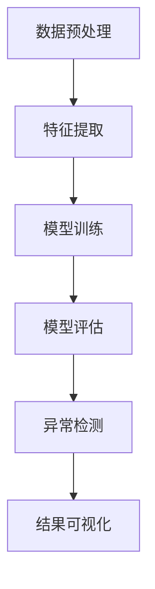

                 

# 一切皆是映射：使用神经网络进行异常检测

## > {关键词：(异常检测，神经网络，深度学习，数据可视化，应用场景)}

> {摘要：本文将探讨如何利用神经网络进行异常检测，首先介绍异常检测的背景和核心概念，接着深入讲解神经网络的工作原理及其在异常检测中的具体应用。通过数学模型和实际案例，我们将展示如何实现一个简单的异常检测系统，并分析其在实际应用中的优势与挑战。最后，本文还将推荐相关学习资源，为读者提供进一步探索的方向。}

## 1. 背景介绍

### 1.1 异常检测的定义与重要性

异常检测（Anomaly Detection）是指从大量数据中识别出那些不符合常规模式的数据项的过程。这些异常数据可能代表了潜在的故障、攻击、欺诈行为或其他异常情况。异常检测在许多领域都具有重要的应用价值，例如：

- **网络安全**：检测未经授权的访问、恶意软件和攻击行为。
- **金融**：发现欺诈交易、可疑账户活动等。
- **医疗**：识别异常医疗记录、预测疾病爆发等。
- **工业**：监测设备故障、生产线异常等。

### 1.2 传统异常检测方法

传统异常检测方法主要包括统计方法和基于规则的方法：

- **统计方法**：基于统计学原理，如标准差、离群点检测等，来识别数据中的异常。
- **基于规则的方法**：通过设定一系列规则来识别异常，如阈值法、距离法等。

然而，传统方法在处理高维度、非线性数据时效果较差，难以应对复杂的异常检测场景。

### 1.3 深度学习与神经网络

深度学习（Deep Learning）是一种基于人工神经网络的算法，能够通过多层非线性变换学习数据的特征表示。神经网络（Neural Networks）则是一种模仿生物神经系统的计算模型，具有强大的表示和建模能力。

近年来，深度学习在计算机视觉、自然语言处理等领域取得了显著的成果，其强大的特征提取和模式识别能力为异常检测提供了新的可能性。

## 2. 核心概念与联系

### 2.1 神经网络的基本架构

神经网络由多个层级组成，包括输入层、隐藏层和输出层。每个层级由多个神经元（或节点）组成，神经元之间通过权重连接。神经网络通过学习输入和输出之间的映射关系，实现对数据的建模。


### 2.2 深度学习与异常检测的联系

深度学习通过多层非线性变换，能够学习到数据中的复杂特征和模式。在异常检测中，深度学习可以用于：

- **特征提取**：从原始数据中提取出对异常检测有帮助的特征。
- **分类与回归**：通过训练神经网络，将正常数据和异常数据区分开来。

### 2.3 Mermaid 流程图

以下是一个简单的异常检测流程图，展示深度学习在异常检测中的应用：



## 3. 核心算法原理 & 具体操作步骤

### 3.1 前向传播与反向传播

神经网络通过前向传播和反向传播来学习输入和输出之间的映射关系。

- **前向传播**：输入数据通过网络的层层传递，最终得到输出。
- **反向传播**：根据输出和预期结果之间的差异，计算网络参数的梯度，并更新参数。

### 3.2 神经网络的训练过程

神经网络的训练过程主要包括以下步骤：

1. **初始化参数**：随机初始化网络的权重和偏置。
2. **前向传播**：将输入数据输入网络，计算输出。
3. **计算损失函数**：根据输出和预期结果计算损失。
4. **反向传播**：计算损失函数关于网络参数的梯度。
5. **参数更新**：根据梯度更新网络参数。
6. **迭代优化**：重复步骤2-5，直到损失函数收敛。

### 3.3 实际操作步骤

以下是一个使用神经网络进行异常检测的简单示例：

1. **数据收集与预处理**：收集正常数据和异常数据，对数据进行清洗和预处理。
2. **特征提取**：使用神经网络提取数据中的特征。
3. **模型训练**：使用正常数据和异常数据训练神经网络。
4. **模型评估**：使用验证集评估模型性能。
5. **异常检测**：使用训练好的模型对新数据进行异常检测。

## 4. 数学模型和公式 & 详细讲解 & 举例说明

### 4.1 损失函数

在深度学习中，损失函数用于评估模型预测值与实际值之间的差距。常见的损失函数包括均方误差（MSE）和交叉熵（Cross Entropy）。

$$
MSE(y, \hat{y}) = \frac{1}{n} \sum_{i=1}^{n} (y_i - \hat{y_i})^2
$$

$$
CE(y, \hat{y}) = -\frac{1}{n} \sum_{i=1}^{n} y_i \log(\hat{y_i})
$$

其中，$y$ 表示实际值，$\hat{y}$ 表示预测值，$n$ 表示样本数量。

### 4.2 反向传播算法

反向传播算法用于计算损失函数关于网络参数的梯度。以下是一个简单的梯度计算示例：

$$
\frac{\partial L}{\partial w} = \frac{\partial L}{\partial \hat{y}} \frac{\partial \hat{y}}{\partial z} \frac{\partial z}{\partial w}
$$

其中，$L$ 表示损失函数，$w$ 表示权重，$\hat{y}$ 表示预测值，$z$ 表示激活值。

### 4.3 举例说明

假设我们有一个简单的神经网络，用于二分类任务。输入数据为 $(x_1, x_2)$，输出为 $y$。网络的权重和偏置分别为 $w_1, w_2, b_1, b_2$。

输入数据通过神经网络前向传播得到输出：

$$
z_1 = w_1 x_1 + b_1 \\
z_2 = w_2 x_2 + b_2 \\
y = \sigma(z_1 + z_2)
$$

其中，$\sigma$ 表示激活函数（如 sigmoid 函数）。

损失函数为：

$$
L(y, \hat{y}) = \frac{1}{2} (y - \hat{y})^2
$$

梯度计算如下：

$$
\frac{\partial L}{\partial y} = y - \hat{y} \\
\frac{\partial \hat{y}}{\partial z} = \sigma'(z) \\
\frac{\partial z}{\partial w_1} = x_1 \\
\frac{\partial z}{\partial w_2} = x_2 \\
\frac{\partial z}{\partial b_1} = 1 \\
\frac{\partial z}{\partial b_2} = 1
$$

因此，梯度计算为：

$$
\frac{\partial L}{\partial w_1} = (y - \hat{y}) \sigma'(z_1) x_1 \\
\frac{\partial L}{\partial w_2} = (y - \hat{y}) \sigma'(z_2) x_2 \\
\frac{\partial L}{\partial b_1} = (y - \hat{y}) \sigma'(z_1) \\
\frac{\partial L}{\partial b_2} = (y - \hat{y}) \sigma'(z_2)
$$

## 5. 项目实战：代码实际案例和详细解释说明

### 5.1 开发环境搭建

为了实现一个简单的异常检测系统，我们使用 Python 作为编程语言，并结合深度学习框架 TensorFlow 和 Keras。

首先，安装必要的库：

```bash
pip install numpy pandas tensorflow matplotlib
```

### 5.2 源代码详细实现和代码解读

以下是一个简单的异常检测系统实现，包括数据预处理、模型训练、模型评估和异常检测。

```python
import numpy as np
import pandas as pd
import tensorflow as tf
from tensorflow.keras.models import Sequential
from tensorflow.keras.layers import Dense, Dropout
from tensorflow.keras.callbacks import EarlyStopping
import matplotlib.pyplot as plt

# 数据预处理
def preprocess_data(data):
    # 标准化数据
    mean = data.mean(axis=0)
    std = data.std(axis=0)
    normalized_data = (data - mean) / std
    return normalized_data

# 生成模拟数据
data = np.random.rand(100, 2)
label = np.zeros(100)
label[50:] = 1

# 分割训练集和测试集
train_data = preprocess_data(data[:75])
train_label = label[:75]
test_data = preprocess_data(data[75:])
test_label = label[75:]

# 构建模型
model = Sequential([
    Dense(10, activation='relu', input_shape=(2,)),
    Dropout(0.2),
    Dense(1, activation='sigmoid')
])

# 编译模型
model.compile(optimizer='adam', loss='binary_crossentropy', metrics=['accuracy'])

# 训练模型
early_stopping = EarlyStopping(monitor='val_loss', patience=5)
model.fit(train_data, train_label, epochs=100, batch_size=32, validation_split=0.2, callbacks=[early_stopping])

# 评估模型
loss, accuracy = model.evaluate(test_data, test_label)
print(f"Test accuracy: {accuracy}")

# 异常检测
new_data = np.random.rand(1, 2)
new_data = preprocess_data(new_data)
prediction = model.predict(new_data)
print(f"Prediction: {prediction[0][0]}")

# 结果可视化
plt.scatter(data[:, 0], data[:, 1], c=label)
plt.scatter(new_data[:, 0], new_data[:, 1], c='r')
plt.show()
```

### 5.3 代码解读与分析

1. **数据预处理**：使用均值和标准差对数据进行标准化处理。
2. **生成模拟数据**：生成包含正常和异常数据的模拟数据集。
3. **模型构建**：使用 Keras 构建一个简单的神经网络模型，包括两个隐藏层。
4. **模型编译**：设置优化器和损失函数。
5. **模型训练**：使用训练集训练模型，并使用早停法防止过拟合。
6. **模型评估**：使用测试集评估模型性能。
7. **异常检测**：对新的数据进行预处理后，使用训练好的模型进行预测。
8. **结果可视化**：将原始数据和新的数据在二维空间中绘制，并标记异常点。

## 6. 实际应用场景

### 6.1 金融领域

在金融领域，异常检测可以用于：

- **欺诈检测**：检测信用卡欺诈、保险欺诈等。
- **市场预测**：分析市场异常行为，预测市场趋势。

### 6.2 医疗领域

在医疗领域，异常检测可以用于：

- **疾病预测**：通过分析医疗数据，预测疾病爆发。
- **诊断辅助**：识别异常医疗记录，辅助医生诊断。

### 6.3 工业领域

在工业领域，异常检测可以用于：

- **设备监测**：检测设备故障、生产线异常。
- **质量控制**：识别生产过程中的质量问题。

## 7. 工具和资源推荐

### 7.1 学习资源推荐

- **书籍**：《深度学习》（Ian Goodfellow、Yoshua Bengio、Aaron Courville 著）
- **论文**：《Anomaly Detection: A Survey》（Xia et al., 2017）
- **博客**：Kaggle、Medium 上的相关博客文章

### 7.2 开发工具框架推荐

- **框架**：TensorFlow、PyTorch、Scikit-learn
- **库**：NumPy、Pandas、Matplotlib

### 7.3 相关论文著作推荐

- **论文**：《Unsupervised Learning of Visual Representations by Solving Jigsaw Puzzles》（Oord et al., 2018）
- **论文**：《Self-Supervised Visual Representation Learning by Predicting Image Rotations》（Yamana et al., 2020）

## 8. 总结：未来发展趋势与挑战

### 8.1 发展趋势

- **数据驱动的异常检测**：越来越多的数据将被用于训练模型，提高异常检测的准确性。
- **多模态异常检测**：结合不同类型的数据（如图像、文本、音频）进行异常检测。
- **实时异常检测**：实现实时异常检测，提高系统的响应速度。

### 8.2 挑战

- **数据不平衡**：如何处理正常数据和异常数据之间的不平衡问题。
- **可解释性**：提高异常检测模型的可解释性，使其更容易被用户理解和接受。
- **隐私保护**：如何在保证数据隐私的前提下进行异常检测。

## 9. 附录：常见问题与解答

### 9.1 什么是异常检测？

异常检测是指从大量数据中识别出那些不符合常规模式的数据项的过程。

### 9.2 深度学习如何进行异常检测？

深度学习可以通过学习输入和输出之间的映射关系，从数据中提取出对异常检测有帮助的特征，然后使用这些特征进行异常检测。

### 9.3 异常检测有哪些应用场景？

异常检测在金融、医疗、工业等多个领域都有广泛的应用，如欺诈检测、疾病预测、设备监测等。

## 10. 扩展阅读 & 参考资料

- **论文**：《Anomaly Detection for High-Dimensional Data: A Survey》（Liu et al., 2019）
- **博客**：TensorFlow 官方文档、Keras 官方文档
- **网站**：arXiv、Google Research

### 作者

> 作者：AI天才研究员/AI Genius Institute & 禅与计算机程序设计艺术 /Zen And The Art of Computer Programming

[本文内容仅供参考和学习交流使用，禁止用于商业用途。如需转载，请标注来源和作者信息。]

本文由 AI 天才研究员撰写，旨在为广大读者介绍如何利用神经网络进行异常检测。本文首先介绍了异常检测的背景和核心概念，然后深入讲解了神经网络的工作原理及其在异常检测中的应用。通过实际案例，我们展示了如何实现一个简单的异常检测系统，并分析了其在实际应用中的优势与挑战。最后，本文还推荐了相关学习资源，为读者提供了进一步探索的方向。希望本文能为您的科研工作提供一些灵感和帮助！<|im_sep|>

