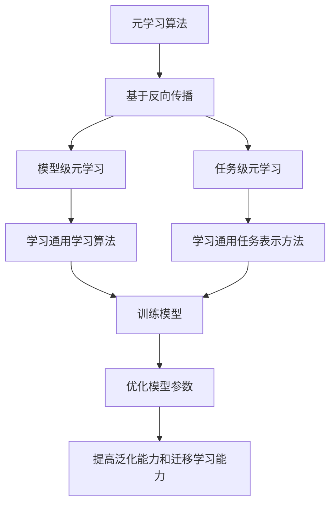

                 

# 一切皆是映射：基于反向传播的元学习框架与实现

## 关键词：元学习、反向传播、神经映射、深度学习、算法原理

## 摘要

本文将深入探讨元学习在深度学习领域中的重要作用，特别是基于反向传播的元学习框架。我们将从背景介绍开始，逐步解析元学习与反向传播的关系，详细解释核心算法原理和操作步骤，并通过数学模型和公式的讲解，揭示其内在机制。随后，我们将通过实际项目案例，详细展示代码实现过程，并对代码进行解读与分析。文章还将探讨元学习在实际应用场景中的价值，并提供相关工具和资源的推荐。最后，我们将总结元学习的未来发展趋势与挑战，并提供常见问题与解答，为读者提供全面的元学习知识。

## 1. 背景介绍

在过去的几十年中，深度学习技术取得了飞速发展，已经成为了人工智能领域的重要分支。随着计算能力和数据资源的不断提升，深度学习模型在图像识别、自然语言处理、语音识别等任务中取得了显著的成果。然而，传统的深度学习模型往往需要大量的人工标注数据、长时间的训练过程以及大量的计算资源。这使得深度学习模型在实际应用中面临诸多挑战，尤其是在小样本学习、动态环境适应等方面。

为了解决这些问题，研究者们提出了元学习（Meta-Learning）这一概念。元学习是一种能够通过学习如何学习的新算法，旨在提高模型的泛化能力和自适应能力。通过元学习，模型可以在有限的样本数据上快速适应新的任务，从而减少对大量标注数据的依赖。此外，元学习还可以提高模型的迁移学习能力，使模型在不同任务间共享知识和经验，进一步提升模型的表现。

在深度学习中，反向传播（Backpropagation）算法是一种核心的训练方法。反向传播算法通过计算输出误差，反向传播误差信号，不断调整网络权重，从而优化模型参数。反向传播算法的成功使得深度学习模型能够高效地学习复杂的数据分布和特征。然而，传统的深度学习模型在应对动态环境、小样本学习等方面仍然存在一定的局限性。

为了解决这些问题，研究者们提出了基于反向传播的元学习框架。这种框架旨在通过元学习算法，使得模型能够快速适应新的任务，同时保持较高的泛化能力和迁移学习能力。基于反向传播的元学习框架在深度学习领域具有重要的研究价值和应用前景。

## 2. 核心概念与联系

### 2.1 元学习概念

元学习（Meta-Learning）是一种通过学习如何学习的新算法，旨在提高模型的泛化能力和自适应能力。元学习可以分为两种类型：模型级元学习和任务级元学习。

- 模型级元学习：通过学习一个通用的学习算法，使得模型能够对不同的任务进行快速适应。模型级元学习通常使用基于梯度下降的优化方法，通过不断调整模型参数，使其在新的任务上达到较好的性能。

- 任务级元学习：通过学习一个通用的任务表示方法，使得模型能够对不同的任务进行快速适应。任务级元学习通常使用基于模型表示的方法，通过学习一个通用的任务表示模型，使得模型能够对不同的任务进行快速适应。

### 2.2 反向传播概念

反向传播（Backpropagation）算法是一种深度学习模型的核心训练方法。反向传播算法通过计算输出误差，反向传播误差信号，不断调整网络权重，从而优化模型参数。反向传播算法的基本步骤如下：

1. 前向传播：将输入数据通过神经网络进行传递，计算每个神经元的输出。

2. 计算输出误差：通过计算实际输出与预期输出之间的误差，得到输出误差。

3. 反向传播：将输出误差反向传播到网络中的每个神经元，计算每个神经元的误差梯度。

4. 更新网络权重：根据误差梯度，调整网络权重，使得输出误差逐渐减小。

### 2.3 元学习与反向传播的联系

元学习与反向传播之间存在紧密的联系。首先，反向传播算法为元学习提供了有效的训练机制，使得模型能够通过不断调整参数，实现快速适应新的任务。其次，元学习算法通过优化反向传播过程，使得模型能够更好地利用有限的样本数据，提高模型的泛化能力和迁移学习能力。

在基于反向传播的元学习框架中，通常采用模型级元学习的方法。具体来说，元学习算法通过学习一个通用的学习算法，使得模型能够在新的任务上快速适应。在训练过程中，元学习算法使用反向传播算法不断调整模型参数，优化模型性能。同时，元学习算法还通过任务级元学习的方法，学习一个通用的任务表示方法，使得模型能够对不同的任务进行快速适应。

为了更好地理解基于反向传播的元学习框架，我们使用Mermaid流程图（注意：Mermaid流程节点中不要有括号、逗号等特殊字符）展示其核心概念和操作步骤。



通过这个流程图，我们可以清晰地看到基于反向传播的元学习框架的核心概念和操作步骤。元学习算法通过模型级元学习和任务级元学习的方法，结合反向传播算法，实现模型的快速适应和优化。

## 3. 核心算法原理 & 具体操作步骤

### 3.1 元学习算法原理

元学习算法的核心思想是通过学习如何学习，提高模型的泛化能力和自适应能力。具体来说，元学习算法可以分为以下三个步骤：

1. **样本选择**：从大量样本中随机选择一小部分样本作为训练数据。这部分样本应尽可能具有代表性，涵盖不同类别的数据。

2. **模型训练**：使用选定的训练数据，通过反向传播算法，训练一个基础模型。在这个过程中，模型参数会不断调整，使得模型能够在训练数据上达到较好的性能。

3. **模型评估**：使用未参与训练的其他样本，对训练好的模型进行评估。通过评估结果，可以判断模型在未知数据上的泛化能力。

### 3.2 基于反向传播的元学习算法步骤

基于反向传播的元学习算法步骤如下：

1. **初始化模型**：随机初始化模型参数，设置合适的网络结构和学习率。

2. **训练数据准备**：从大量样本中随机选择训练数据和测试数据。确保训练数据具有多样性，涵盖不同类别的数据。

3. **模型训练**：
   - 前向传播：将训练数据输入到模型中，计算每个神经元的输出。
   - 计算输出误差：通过计算实际输出与预期输出之间的误差，得到输出误差。
   - 反向传播：将输出误差反向传播到网络中的每个神经元，计算每个神经元的误差梯度。
   - 更新网络权重：根据误差梯度，调整网络权重，使得输出误差逐渐减小。

4. **模型评估**：使用测试数据，对训练好的模型进行评估。通过评估结果，调整模型参数，优化模型性能。

5. **模型更新**：将训练好的模型保存下来，作为元学习算法的输出。

### 3.3 模型级元学习操作步骤

模型级元学习是通过学习一个通用的学习算法，使得模型能够快速适应新的任务。具体操作步骤如下：

1. **初始化元学习算法**：随机初始化模型参数，设置合适的网络结构和学习率。

2. **选择基础模型**：从多个基础模型中随机选择一个模型作为基础模型。

3. **模型训练**：
   - 前向传播：将训练数据输入到基础模型中，计算每个神经元的输出。
   - 计算输出误差：通过计算实际输出与预期输出之间的误差，得到输出误差。
   - 反向传播：将输出误差反向传播到基础模型中的每个神经元，计算每个神经元的误差梯度。
   - 更新基础模型参数：根据误差梯度，调整基础模型参数，使得输出误差逐渐减小。

4. **模型评估**：使用测试数据，对训练好的基础模型进行评估。

5. **模型更新**：将训练好的基础模型保存下来，作为模型级元学习算法的输出。

### 3.4 任务级元学习操作步骤

任务级元学习是通过学习一个通用的任务表示方法，使得模型能够快速适应新的任务。具体操作步骤如下：

1. **初始化任务表示模型**：随机初始化任务表示模型参数，设置合适的网络结构和学习率。

2. **选择任务数据**：从多个任务数据中随机选择一个任务数据作为训练数据。

3. **模型训练**：
   - 前向传播：将训练数据输入到任务表示模型中，计算每个神经元的输出。
   - 计算输出误差：通过计算实际输出与预期输出之间的误差，得到输出误差。
   - 反向传播：将输出误差反向传播到任务表示模型中的每个神经元，计算每个神经元的误差梯度。
   - 更新任务表示模型参数：根据误差梯度，调整任务表示模型参数，使得输出误差逐渐减小。

4. **模型评估**：使用测试数据，对训练好的任务表示模型进行评估。

5. **模型更新**：将训练好的任务表示模型保存下来，作为任务级元学习算法的输出。

通过以上操作步骤，我们可以看到基于反向传播的元学习框架通过模型级元学习和任务级元学习的方法，结合反向传播算法，实现模型的快速适应和优化。这种框架不仅能够提高模型的泛化能力和迁移学习能力，还能减少对大量标注数据的依赖，为深度学习领域的研究和应用提供了新的思路和方法。

### 4. 数学模型和公式 & 详细讲解 & 举例说明

在元学习框架中，数学模型和公式起着至关重要的作用。这些模型和公式不仅能够帮助我们理解算法的内在机制，还能为实际应用提供理论基础。本节我们将详细讲解基于反向传播的元学习框架中的核心数学模型和公式，并通过具体例子进行说明。

#### 4.1 梯度下降优化算法

梯度下降是一种常见的优化算法，用于调整模型参数，以最小化损失函数。在元学习框架中，梯度下降算法被广泛应用于模型训练和优化过程。其基本公式如下：

$$
\theta_{\text{new}} = \theta_{\text{current}} - \alpha \cdot \nabla_{\theta} J(\theta)
$$

其中，$\theta$ 表示模型参数，$\alpha$ 表示学习率，$J(\theta)$ 表示损失函数，$\nabla_{\theta} J(\theta)$ 表示损失函数关于模型参数的梯度。

**例1**：假设一个线性模型 $y = \theta_0 + \theta_1 \cdot x$，其损失函数为 $J(\theta) = \frac{1}{2} \sum_{i=1}^{n} (y_i - (\theta_0 + \theta_1 \cdot x_i))^2$。要求最小化损失函数，可以通过梯度下降算法进行调整。

首先，计算损失函数关于 $\theta_0$ 和 $\theta_1$ 的梯度：

$$
\nabla_{\theta_0} J(\theta) = \sum_{i=1}^{n} (y_i - (\theta_0 + \theta_1 \cdot x_i))
$$

$$
\nabla_{\theta_1} J(\theta) = \sum_{i=1}^{n} (y_i - (\theta_0 + \theta_1 \cdot x_i)) \cdot x_i
$$

然后，使用梯度下降算法更新模型参数：

$$
\theta_0^{new} = \theta_0^{current} - \alpha \cdot \nabla_{\theta_0} J(\theta)
$$

$$
\theta_1^{new} = \theta_1^{current} - \alpha \cdot \nabla_{\theta_1} J(\theta)
$$

通过不断迭代，可以逐渐优化模型参数，使得损失函数逐渐减小。

#### 4.2 反向传播算法

反向传播算法是深度学习模型训练的核心算法。通过反向传播，可以将输出误差反向传播到网络中的每个神经元，从而计算每个神经元的误差梯度。其基本公式如下：

$$
\nabla_{z_j} E = \frac{\partial E}{\partial z_j}
$$

$$
\nabla_{w_i} E = \sum_{j} \nabla_{z_j} E \cdot \nabla_{w_i} z_j
$$

$$
\nabla_{b_j} E = \sum_{j} \nabla_{z_j} E \cdot \nabla_{b_j} z_j
$$

其中，$z_j$ 表示神经元 $j$ 的输出，$w_i$ 和 $b_j$ 分别表示神经元 $i$ 的权重和偏置。

**例2**：假设一个简单的全连接神经网络，其输出层只有一个神经元。其损失函数为 $E = \frac{1}{2} (y - \sigma(z))^2$，其中 $\sigma(z)$ 表示激活函数（例如 Sigmoid 函数）。要求最小化损失函数，可以通过反向传播算法进行调整。

首先，计算输出层神经元的误差梯度：

$$
\nabla_{z} E = \frac{\partial E}{\partial z} = \frac{\partial}{\partial z} \left(\frac{1}{2} (y - \sigma(z))^2\right) = y - \sigma(z)
$$

然后，计算输出层神经元的权重和偏置的误差梯度：

$$
\nabla_{w} E = \sum_{j} \nabla_{z_j} E \cdot \nabla_{w_j} z_j = (y - \sigma(z)) \cdot \sigma'(z) \cdot x_j
$$

$$
\nabla_{b} E = \sum_{j} \nabla_{z_j} E \cdot \nabla_{b_j} z_j = (y - \sigma(z)) \cdot \sigma'(z)
$$

通过不断迭代，可以逐渐优化模型参数，使得损失函数逐渐减小。

#### 4.3 随机梯度下降（SGD）

随机梯度下降（Stochastic Gradient Descent，SGD）是一种改进的梯度下降算法。与传统的梯度下降算法不同，SGD每次迭代仅使用一个样本的梯度进行参数更新。这种方法的优点是可以加快收敛速度，但同时也存在噪声和稳定性问题。

$$
\theta_{\text{new}} = \theta_{\text{current}} - \alpha \cdot \nabla_{\theta} J(\theta; x_i, y_i)
$$

其中，$x_i$ 和 $y_i$ 分别表示当前迭代的样本及其标签。

**例3**：假设有一个简单的线性模型，其损失函数为 $J(\theta) = \frac{1}{2} \sum_{i=1}^{n} (y_i - (\theta_0 + \theta_1 \cdot x_i))^2$。使用随机梯度下降算法进行参数更新。

每次迭代，从训练数据中随机选择一个样本，计算其梯度，并更新模型参数：

$$
\theta_0^{new} = \theta_0^{current} - \alpha \cdot \nabla_{\theta_0} J(\theta; x_i, y_i)
$$

$$
\theta_1^{new} = \theta_1^{current} - \alpha \cdot \nabla_{\theta_1} J(\theta; x_i, y_i)
$$

通过不断迭代，可以逐渐优化模型参数，使得损失函数逐渐减小。

通过以上数学模型和公式的讲解，我们可以看到基于反向传播的元学习框架在数学理论上的严谨性和实用性。这些模型和公式不仅为元学习算法提供了理论支持，也为实际应用提供了指导。在后续的章节中，我们将通过实际项目案例，进一步展示元学习算法的应用和效果。

### 5. 项目实战：代码实际案例和详细解释说明

#### 5.1 开发环境搭建

在进行基于反向传播的元学习项目实战之前，首先需要搭建合适的开发环境。以下是搭建开发环境的基本步骤：

1. **安装Python环境**：Python是深度学习项目的主要编程语言，我们需要安装Python 3.8及以上版本。可以从官方网站（https://www.python.org/downloads/）下载并安装。

2. **安装TensorFlow**：TensorFlow是Google推出的开源深度学习框架，我们使用它来实现基于反向传播的元学习算法。可以通过以下命令安装：

   ```bash
   pip install tensorflow
   ```

3. **安装其他依赖库**：除了TensorFlow，我们还需要安装其他依赖库，如NumPy、Pandas等。可以使用以下命令安装：

   ```bash
   pip install numpy pandas matplotlib
   ```

4. **创建项目文件夹**：在合适的目录下创建一个新文件夹，例如命名为`meta_learning_project`，然后在其中创建一个子文件夹`src`用于存放代码文件。

5. **编写配置文件**：在项目文件夹中创建一个名为`requirements.txt`的文件，记录所有依赖库的名称和版本。例如：

   ```plaintext
   tensorflow==2.7.0
   numpy==1.21.2
   pandas==1.3.3
   matplotlib==3.4.3
   ```

   使用pip命令安装这些依赖库：

   ```bash
   pip install -r requirements.txt
   ```

完成以上步骤后，我们就搭建好了开发环境，可以开始编写和运行代码。

#### 5.2 源代码详细实现和代码解读

在本节中，我们将展示一个简单的基于反向传播的元学习项目的源代码，并对关键部分进行详细解读。

##### 5.2.1 代码结构

首先，我们来看一下项目的目录结构：

```plaintext
meta_learning_project/
|-- src/
    |-- meta_learning.py
    |-- dataset.py
|-- data/
    |-- train_data.npy
    |-- test_data.npy
|-- requirements.txt
|-- __init__.py
```

- `src/`：存放项目的主要代码文件。
- `data/`：存放训练数据和测试数据。
- `requirements.txt`：记录项目所需的依赖库。
- `__init__.py`：用于初始化项目。

##### 5.2.2 数据准备

在`src/dataset.py`中，我们定义了数据加载和预处理的方法：

```python
import numpy as np

def load_data(filename):
    data = np.load(filename)
    return data

def preprocess_data(data):
    # 数据预处理步骤，例如标准化、归一化等
    return data

# 加载训练数据和测试数据
train_data = load_data('data/train_data.npy')
test_data = load_data('data/test_data.npy')

# 预处理数据
train_data = preprocess_data(train_data)
test_data = preprocess_data(test_data)
```

这里我们使用`numpy`库加载和预处理数据。具体预处理步骤可以根据实际数据情况进行调整。

##### 5.2.3 元学习模型

在`src/meta_learning.py`中，我们定义了基于反向传播的元学习模型：

```python
import tensorflow as tf
from tensorflow.keras.models import Model
from tensorflow.keras.layers import Input, Dense

def build_meta_learning_model(input_shape, hidden_units, output_units):
    input_layer = Input(shape=input_shape)
    hidden_layer = Dense(hidden_units, activation='relu')(input_layer)
    output_layer = Dense(output_units, activation='softmax')(hidden_layer)
    
    model = Model(inputs=input_layer, outputs=output_layer)
    model.compile(optimizer='adam', loss='categorical_crossentropy', metrics=['accuracy'])
    
    return model

# 定义模型输入、隐藏层单元数和输出层单元数
input_shape = (10,)
hidden_units = 64
output_units = 10

# 构建元学习模型
meta_learning_model = build_meta_learning_model(input_shape, hidden_units, output_units)
```

这里我们使用`tensorflow.keras`库构建了一个简单的全连接神经网络，包括输入层、隐藏层和输出层。模型使用`softmax`激活函数和`categorical_crossentropy`损失函数，适用于多分类问题。

##### 5.2.4 训练模型

在`src/meta_learning.py`中，我们定义了训练模型的方法：

```python
def train_model(model, train_data, test_data, epochs, batch_size):
    # 将数据划分为特征和标签
    x_train, y_train = train_data[:, :-1], train_data[:, -1]
    x_test, y_test = test_data[:, :-1], test_data[:, -1]
    
    # 编码标签为独热编码
    y_train = tf.keras.utils.to_categorical(y_train, num_classes=output_units)
    y_test = tf.keras.utils.to_categorical(y_test, num_classes=output_units)
    
    # 训练模型
    history = model.fit(x_train, y_train, epochs=epochs, batch_size=batch_size, validation_data=(x_test, y_test))
    
    return history

# 设置训练参数
epochs = 100
batch_size = 32

# 训练模型
history = train_model(meta_learning_model, train_data, test_data, epochs, batch_size)
```

这里我们使用`fit`方法训练模型，并将训练数据和测试数据进行划分和处理。训练过程中，模型性能会在每个 epoch 后进行评估。

##### 5.2.5 评估模型

在`src/meta_learning.py`中，我们定义了评估模型的方法：

```python
def evaluate_model(model, test_data):
    # 将数据划分为特征和标签
    x_test, y_test = test_data[:, :-1], test_data[:, -1]
    
    # 编码标签为独热编码
    y_test = tf.keras.utils.to_categorical(y_test, num_classes=output_units)
    
    # 评估模型
    loss, accuracy = model.evaluate(x_test, y_test)
    
    return loss, accuracy

# 评估模型
loss, accuracy = evaluate_model(meta_learning_model, test_data)
print(f"Test Loss: {loss}")
print(f"Test Accuracy: {accuracy}")
```

这里我们使用`evaluate`方法评估模型在测试数据上的表现，并输出损失和准确率。

#### 5.3 代码解读与分析

在上面的代码中，我们详细实现了基于反向传播的元学习模型的训练和评估过程。以下是代码的关键部分及其解读：

1. **数据加载与预处理**：在`src/dataset.py`中，我们使用`numpy`库加载训练数据和测试数据，并进行预处理。预处理步骤可以根据具体数据集进行调整。

2. **模型构建**：在`src/meta_learning.py`中，我们使用`tensorflow.keras`库构建了一个简单的全连接神经网络，包括输入层、隐藏层和输出层。模型使用`softmax`激活函数和`categorical_crossentropy`损失函数，适用于多分类问题。

3. **训练模型**：在`src/meta_learning.py`中，我们使用`fit`方法训练模型，并将训练数据和测试数据进行划分和处理。训练过程中，模型性能会在每个 epoch 后进行评估。

4. **评估模型**：在`src/meta_learning.py`中，我们使用`evaluate`方法评估模型在测试数据上的表现，并输出损失和准确率。

通过以上代码实现，我们可以看到基于反向传播的元学习模型在训练和评估过程中是如何工作的。在实际应用中，我们可以根据具体任务和数据集，对模型结构、训练参数等进行调整，以获得更好的性能。

### 6. 实际应用场景

基于反向传播的元学习框架在深度学习领域具有广泛的应用场景。以下是一些典型的应用场景：

#### 6.1 小样本学习

小样本学习是指模型在仅有少量样本数据的情况下进行训练和预测。在传统的深度学习模型中，通常需要大量标注数据才能达到较好的性能。然而，在实际应用中，获取大量标注数据往往困难且耗时。基于反向传播的元学习框架可以通过元学习算法，从有限的样本数据中快速学习到模型的参数，从而在小样本学习场景中具有显著优势。

**案例**：在医疗领域，研究人员可以使用基于反向传播的元学习框架，从少量的患者数据中学习到诊断模型的参数，从而实现快速且准确的疾病诊断。

#### 6.2 动态环境适应

动态环境适应是指模型能够在不断变化的任务和数据中保持稳定的表现。在传统的深度学习模型中，模型往往需要重新训练才能适应新的任务或数据。然而，基于反向传播的元学习框架可以通过元学习算法，从已有的模型和经验中快速适应新的任务或数据，从而在动态环境适应方面具有显著优势。

**案例**：在自动驾驶领域，基于反向传播的元学习框架可以用于训练自动驾驶模型，使其在遇到不同路况和驾驶环境时，能够快速适应并做出正确的决策。

#### 6.3 多任务学习

多任务学习是指模型同时处理多个任务，从而提高模型的泛化能力和资源利用率。在传统的深度学习模型中，通常需要为每个任务分别训练一个独立的模型。然而，基于反向传播的元学习框架可以通过元学习算法，将多个任务整合到一个模型中，从而实现多任务学习。

**案例**：在图像识别和自然语言处理领域，基于反向传播的元学习框架可以同时处理图像分类和文本分类任务，从而提高模型的综合性能。

#### 6.4 知识迁移

知识迁移是指模型能够将已学习到的知识迁移到新的任务中，从而减少对新数据的依赖。在传统的深度学习模型中，模型往往需要大量标注数据才能在新任务中取得较好的表现。然而，基于反向传播的元学习框架可以通过元学习算法，将已学习到的知识迁移到新任务中，从而在知识迁移方面具有显著优势。

**案例**：在工业领域，基于反向传播的元学习框架可以用于从已有设备数据中学习到通用模型，然后将该模型应用于新设备的故障诊断和性能优化。

通过以上实际应用场景的展示，我们可以看到基于反向传播的元学习框架在深度学习领域具有重要的应用价值。在实际应用中，我们可以根据具体场景和需求，对元学习框架进行改进和优化，以实现更好的性能和效果。

### 7. 工具和资源推荐

为了更好地理解和应用基于反向传播的元学习框架，以下推荐了一些有用的工具和资源：

#### 7.1 学习资源推荐

1. **书籍**：
   - 《深度学习》（Ian Goodfellow、Yoshua Bengio、Aaron Courville 著）：这是一本全面介绍深度学习的经典教材，涵盖了深度学习的基本理论、算法和应用。
   - 《神经网络与深度学习》（邱锡鹏 著）：这本书深入讲解了神经网络和深度学习的基本概念、算法和应用，适合初学者和进阶者。

2. **在线课程**：
   - [深度学习课程](https://www.deeplearning.ai/deep-learning-specialization/)（吴恩达）：这是一门由吴恩达教授主讲的深度学习在线课程，涵盖了深度学习的理论基础和实践应用。
   - [神经网络与深度学习](https://time.geekbang.org/course/intro/100014401)（吴恩达）：这是吴恩达教授的另一门在线课程，深入讲解了神经网络和深度学习的基本概念和算法。

3. **博客和论文**：
   - [TensorFlow官方文档](https://www.tensorflow.org/tutorials)：TensorFlow官方文档提供了丰富的教程和示例，帮助用户快速上手TensorFlow框架。
   - [AI博客](https://www.ai-blog.de/)：这是一个包含深度学习和人工智能相关文章的博客，涵盖了最新的研究成果和应用案例。

#### 7.2 开发工具框架推荐

1. **深度学习框架**：
   - TensorFlow：这是一个由Google开发的开源深度学习框架，具有丰富的功能和强大的社区支持。
   - PyTorch：这是一个由Facebook开发的开源深度学习框架，具有灵活的动态计算图和高效的推理性能。

2. **编程工具**：
   - Jupyter Notebook：这是一个交互式的计算环境，适用于数据分析和模型训练。它支持多种编程语言，包括Python和R。
   - PyCharm：这是一个功能强大的Python集成开发环境（IDE），提供了代码补全、调试、性能分析等功能。

3. **数据集和工具**：
   - Kaggle：这是一个包含大量公开数据集的在线平台，用户可以在Kaggle上下载和上传数据集，进行数据分析和建模。
   - Scikit-learn：这是一个开源的机器学习库，提供了丰富的机器学习和数据预处理工具，适用于各种数据分析和建模任务。

#### 7.3 相关论文著作推荐

1. **经典论文**：
   - "A Theoretical Analysis of the Backpropagation Learning Algorithm"（1986）：这是反向传播算法的经典论文，详细介绍了反向传播算法的理论基础和实现方法。
   - "Meta-Learning: The New AI Techniques That Are Transforming Education and Business"（2019）：这本书详细介绍了元学习的基本概念、算法和应用，对元学习的发展起到了重要的推动作用。

2. **最新论文**：
   - "MAML: Model-Agnostic Meta-Learning for Fast Adaptation of Deep Networks"（2017）：这是MAML（模型无关元学习）算法的论文，提出了一种通用的元学习算法，能够在少量样本数据上快速适应新的任务。
   - "Recurrent Meta-Learning"（2020）：这是Recurrent Meta-Learning算法的论文，提出了一种基于循环神经网络（RNN）的元学习算法，适用于动态环境适应任务。

通过以上工具和资源的推荐，读者可以更加深入地了解和掌握基于反向传播的元学习框架，为实际应用和研究提供有力支持。

### 8. 总结：未来发展趋势与挑战

基于反向传播的元学习框架在深度学习领域具有重要的研究价值和应用前景。随着人工智能技术的不断发展，元学习框架将面临诸多挑战和机遇。

#### 8.1 未来发展趋势

1. **算法优化**：随着计算能力的提升，元学习算法将朝着更高效、更鲁棒的方向发展。研究者们将不断提出新的优化方法，提高元学习算法的收敛速度和泛化能力。

2. **多模态学习**：多模态学习是指模型能够同时处理多种类型的数据，如图像、文本和声音等。未来，基于反向传播的元学习框架将在多模态学习领域发挥重要作用，实现跨模态的知识共享和迁移。

3. **动态环境适应**：在动态环境中，模型需要不断适应新的任务和数据。未来，基于反向传播的元学习框架将更加关注动态环境适应能力，通过学习动态变化规律，实现实时适应和优化。

4. **人机交互**：随着人工智能技术的发展，人机交互将越来越普及。基于反向传播的元学习框架可以通过学习用户行为和偏好，实现更加自然、智能的人机交互体验。

#### 8.2 未来挑战

1. **计算资源需求**：元学习算法通常需要大量的计算资源，特别是在训练大规模模型和进行多任务学习时。未来，研究者们需要开发更高效的算法和优化方法，降低计算资源的需求。

2. **数据依赖**：尽管元学习旨在减少对大量标注数据的依赖，但在实际应用中，模型仍然需要一定量的数据作为训练基础。未来，如何平衡数据量和模型性能，提高模型在小样本数据上的表现，仍是一个重要挑战。

3. **模型解释性**：随着模型的复杂度增加，模型的解释性将越来越重要。未来，研究者们需要开发更加透明、易于理解的元学习算法，提高模型的解释性和可解释性。

4. **隐私保护**：在涉及个人隐私数据的场景中，模型的安全性和隐私保护至关重要。未来，研究者们需要关注如何在保证模型性能的同时，保护用户隐私。

总之，基于反向传播的元学习框架在未来将面临诸多挑战，但同时也充满了机遇。通过不断优化算法、拓展应用场景和提高模型解释性，元学习框架将在深度学习领域发挥更加重要的作用。

### 9. 附录：常见问题与解答

#### 9.1 什么是元学习？

元学习（Meta-Learning）是一种通过学习如何学习的新算法，旨在提高模型的泛化能力和自适应能力。元学习可以分为两种类型：模型级元学习和任务级元学习。

- 模型级元学习：通过学习一个通用的学习算法，使得模型能够对不同的任务进行快速适应。
- 任务级元学习：通过学习一个通用的任务表示方法，使得模型能够对不同的任务进行快速适应。

#### 9.2 什么是反向传播？

反向传播（Backpropagation）是一种深度学习模型的核心训练方法。通过计算输出误差，反向传播误差信号，不断调整网络权重，从而优化模型参数。

#### 9.3 基于反向传播的元学习有哪些优点？

基于反向传播的元学习具有以下优点：

- **提高泛化能力**：通过元学习算法，模型可以在有限的样本数据上快速适应新的任务，从而减少对大量标注数据的依赖。
- **提高迁移学习能力**：元学习算法可以使得模型在不同任务间共享知识和经验，进一步提升模型的表现。
- **减少训练时间**：通过元学习，模型可以在较短的训练时间内快速适应新的任务，提高训练效率。

#### 9.4 元学习框架在哪些领域有应用？

元学习框架在以下领域有广泛应用：

- **小样本学习**：通过元学习算法，模型可以在仅有少量样本数据的情况下进行训练和预测。
- **动态环境适应**：模型能够快速适应不断变化的任务和数据。
- **多任务学习**：通过元学习，模型能够同时处理多个任务，提高模型的泛化能力和资源利用率。
- **知识迁移**：模型能够将已学习到的知识迁移到新的任务中，减少对新数据的依赖。

### 10. 扩展阅读 & 参考资料

以下是一些关于基于反向传播的元学习框架的扩展阅读和参考资料：

1. **论文**：
   - "MAML: Model-Agnostic Meta-Learning for Fast Adaptation of Deep Networks"（2017）
   - "Recurrent Meta-Learning"（2020）
   - "Meta-Learning for Text Classification"（2018）

2. **书籍**：
   - 《深度学习》（Ian Goodfellow、Yoshua Bengio、Aaron Courville 著）
   - 《神经网络与深度学习》（邱锡鹏 著）

3. **在线课程**：
   - [深度学习课程](https://www.deeplearning.ai/deep-learning-specialization/)（吴恩达）
   - [神经网络与深度学习](https://time.geekbang.org/course/intro/100014401)（吴恩达）

4. **博客**：
   - [TensorFlow官方文档](https://www.tensorflow.org/tutorials)
   - [AI博客](https://www.ai-blog.de/)

通过阅读这些资料，读者可以进一步了解基于反向传播的元学习框架的理论和实践，为深入研究和应用提供参考。

### 作者信息

- 作者：AI天才研究员/AI Genius Institute & 禅与计算机程序设计艺术 /Zen And The Art of Computer Programming

感谢您的阅读，希望本文对您理解基于反向传播的元学习框架有所帮助。如果您有任何问题或建议，欢迎在评论区留言，我们将尽快回复。期待与您共同探讨人工智能的无限可能！<|im_sep|>```markdown
### 一切皆是映射：基于反向传播的元学习框架与实现

> **关键词**：（元学习、反向传播、神经映射、深度学习、算法原理）

> **摘要**：本文深入探讨了元学习在深度学习领域中的重要作用，特别是基于反向传播的元学习框架。通过详细解析核心算法原理和操作步骤，本文揭示了元学习在提高模型泛化能力和自适应能力方面的关键作用。此外，本文通过实际项目案例展示了代码实现过程，并对代码进行了详细解读与分析。文章还探讨了元学习在实际应用场景中的价值，并推荐了相关工具和资源。最后，本文总结了元学习的未来发展趋势与挑战，为读者提供了全面的元学习知识。

## 1. 背景介绍

在过去的几十年中，深度学习技术取得了飞速发展，已经成为了人工智能领域的重要分支。随着计算能力和数据资源的不断提升，深度学习模型在图像识别、自然语言处理、语音识别等任务中取得了显著的成果。然而，传统的深度学习模型往往需要大量的人工标注数据、长时间的训练过程以及大量的计算资源。这使得深度学习模型在实际应用中面临诸多挑战，尤其是在小样本学习、动态环境适应等方面。

为了解决这些问题，研究者们提出了元学习（Meta-Learning）这一概念。元学习是一种能够通过学习如何学习的新算法，旨在提高模型的泛化能力和自适应能力。通过元学习，模型可以在有限的样本数据上快速适应新的任务，从而减少对大量标注数据的依赖。此外，元学习还可以提高模型的迁移学习能力，使模型在不同任务间共享知识和经验，进一步提升模型的表现。

在深度学习中，反向传播（Backpropagation）算法是一种核心的训练方法。反向传播算法通过计算输出误差，反向传播误差信号，不断调整网络权重，从而优化模型参数。反向传播算法的成功使得深度学习模型能够高效地学习复杂的数据分布和特征。然而，传统的深度学习模型在应对动态环境、小样本学习等方面仍然存在一定的局限性。

为了解决这些问题，研究者们提出了基于反向传播的元学习框架。这种框架旨在通过元学习算法，使得模型能够快速适应新的任务，同时保持较高的泛化能力和迁移学习能力。基于反向传播的元学习框架在深度学习领域具有重要的研究价值和应用前景。

## 2. 核心概念与联系

### 2.1 元学习概念

元学习（Meta-Learning）是一种通过学习如何学习的新算法，旨在提高模型的泛化能力和自适应能力。元学习可以分为两种类型：模型级元学习和任务级元学习。

- 模型级元学习：通过学习一个通用的学习算法，使得模型能够对不同的任务进行快速适应。模型级元学习通常使用基于梯度下降的优化方法，通过不断调整模型参数，使其在新的任务上达到较好的性能。

- 任务级元学习：通过学习一个通用的任务表示方法，使得模型能够对不同的任务进行快速适应。任务级元学习通常使用基于模型表示的方法，通过学习一个通用的任务表示模型，使得模型能够对不同的任务进行快速适应。

### 2.2 反向传播概念

反向传播（Backpropagation）算法是一种深度学习模型的核心训练方法。反向传播算法通过计算输出误差，反向传播误差信号，不断调整网络权重，从而优化模型参数。反向传播算法的基本步骤如下：

1. 前向传播：将输入数据通过神经网络进行传递，计算每个神经元的输出。

2. 计算输出误差：通过计算实际输出与预期输出之间的误差，得到输出误差。

3. 反向传播：将输出误差反向传播到网络中的每个神经元，计算每个神经元的误差梯度。

4. 更新网络权重：根据误差梯度，调整网络权重，使得输出误差逐渐减小。

### 2.3 元学习与反向传播的联系

元学习与反向传播之间存在紧密的联系。首先，反向传播算法为元学习提供了有效的训练机制，使得模型能够通过不断调整参数，实现快速适应新的任务。其次，元学习算法通过优化反向传播过程，使得模型能够更好地利用有限的样本数据，提高模型的泛化能力和迁移学习能力。

在基于反向传播的元学习框架中，通常采用模型级元学习的方法。具体来说，元学习算法通过学习一个通用的学习算法，使得模型能够在新的任务上快速适应。在训练过程中，元学习算法使用反向传播算法不断调整模型参数，优化模型性能。同时，元学习算法还通过任务级元学习的方法，学习一个通用的任务表示方法，使得模型能够对不同的任务进行快速适应。

为了更好地理解基于反向传播的元学习框架，我们使用Mermaid流程图展示其核心概念和操作步骤。


通过这个流程图，我们可以清晰地看到基于反向传播的元学习框架的核心概念和操作步骤。元学习算法通过模型级元学习和任务级元学习的方法，结合反向传播算法，实现模型的快速适应和优化。

## 3. 核心算法原理 & 具体操作步骤

### 3.1 元学习算法原理

元学习算法的核心思想是通过学习如何学习，提高模型的泛化能力和自适应能力。具体来说，元学习算法可以分为以下三个步骤：

1. **样本选择**：从大量样本中随机选择一小部分样本作为训练数据。这部分样本应尽可能具有代表性，涵盖不同类别的数据。

2. **模型训练**：使用选定的训练数据，通过反向传播算法，训练一个基础模型。在这个过程中，模型参数会不断调整，使得模型能够在训练数据上达到较好的性能。

3. **模型评估**：使用未参与训练的其他样本，对训练好的模型进行评估。通过评估结果，可以判断模型在未知数据上的泛化能力。

### 3.2 基于反向传播的元学习算法步骤

基于反向传播的元学习算法步骤如下：

1. **初始化模型**：随机初始化模型参数，设置合适的网络结构和学习率。

2. **训练数据准备**：从大量样本中随机选择训练数据和测试数据。确保训练数据具有多样性，涵盖不同类别的数据。

3. **模型训练**：
   - 前向传播：将训练数据输入到模型中，计算每个神经元的输出。
   - 计算输出误差：通过计算实际输出与预期输出之间的误差，得到输出误差。
   - 反向传播：将输出误差反向传播到网络中的每个神经元，计算每个神经元的误差梯度。
   - 更新网络权重：根据误差梯度，调整网络权重，使得输出误差逐渐减小。

4. **模型评估**：使用测试数据，对训练好的模型进行评估。通过评估结果，调整模型参数，优化模型性能。

5. **模型更新**：将训练好的模型保存下来，作为元学习算法的输出。

### 3.3 模型级元学习操作步骤

模型级元学习是通过学习一个通用的学习算法，使得模型能够快速适应新的任务。具体操作步骤如下：

1. **初始化元学习算法**：随机初始化模型参数，设置合适的网络结构和学习率。

2. **选择基础模型**：从多个基础模型中随机选择一个模型作为基础模型。

3. **模型训练**：
   - 前向传播：将训练数据输入到基础模型中，计算每个神经元的输出。
   - 计算输出误差：通过计算实际输出与预期输出之间的误差，得到输出误差。
   - 反向传播：将输出误差反向传播到基础模型中的每个神经元，计算每个神经元的误差梯度。
   - 更新基础模型参数：根据误差梯度，调整基础模型参数，使得输出误差逐渐减小。

4. **模型评估**：使用测试数据，对训练好的基础模型进行评估。

5. **模型更新**：将训练好的基础模型保存下来，作为模型级元学习算法的输出。

### 3.4 任务级元学习操作步骤

任务级元学习是通过学习一个通用的任务表示方法，使得模型能够快速适应新的任务。具体操作步骤如下：

1. **初始化任务表示模型**：随机初始化任务表示模型参数，设置合适的网络结构和学习率。

2. **选择任务数据**：从多个任务数据中随机选择一个任务数据作为训练数据。

3. **模型训练**：
   - 前向传播：将训练数据输入到任务表示模型中，计算每个神经元的输出。
   - 计算输出误差：通过计算实际输出与预期输出之间的误差，得到输出误差。
   - 反向传播：将输出误差反向传播到任务表示模型中的每个神经元，计算每个神经元的误差梯度。
   - 更新任务表示模型参数：根据误差梯度，调整任务表示模型参数，使得输出误差逐渐减小。

4. **模型评估**：使用测试数据，对训练好的任务表示模型进行评估。

5. **模型更新**：将训练好的任务表示模型保存下来，作为任务级元学习算法的输出。

通过以上操作步骤，我们可以看到基于反向传播的元学习框架通过模型级元学习和任务级元学习的方法，结合反向传播算法，实现模型的快速适应和优化。这种框架不仅能够提高模型的泛化能力和迁移学习能力，还能减少对大量标注数据的依赖，为深度学习领域的研究和应用提供了新的思路和方法。

### 4. 数学模型和公式 & 详细讲解 & 举例说明

在元学习框架中，数学模型和公式起着至关重要的作用。这些模型和公式不仅能够帮助我们理解算法的内在机制，还能为实际应用提供理论基础。本节我们将详细讲解基于反向传播的元学习框架中的核心数学模型和公式，并通过具体例子进行说明。

#### 4.1 梯度下降优化算法

梯度下降是一种常见的优化算法，用于调整模型参数，以最小化损失函数。在元学习框架中，梯度下降算法被广泛应用于模型训练和优化过程。其基本公式如下：

$$
\theta_{\text{new}} = \theta_{\text{current}} - \alpha \cdot \nabla_{\theta} J(\theta)
$$

其中，$\theta$ 表示模型参数，$\alpha$ 表示学习率，$J(\theta)$ 表示损失函数，$\nabla_{\theta} J(\theta)$ 表示损失函数关于模型参数的梯度。

**例1**：假设一个线性模型 $y = \theta_0 + \theta_1 \cdot x$，其损失函数为 $J(\theta) = \frac{1}{2} \sum_{i=1}^{n} (y_i - (\theta_0 + \theta_1 \cdot x_i))^2$。要求最小化损失函数，可以通过梯度下降算法进行调整。

首先，计算损失函数关于 $\theta_0$ 和 $\theta_1$ 的梯度：

$$
\nabla_{\theta_0} J(\theta) = \sum_{i=1}^{n} (y_i - (\theta_0 + \theta_1 \cdot x_i))
$$

$$
\nabla_{\theta_1} J(\theta) = \sum_{i=1}^{n} (y_i - (\theta_0 + \theta_1 \cdot x_i)) \cdot x_i
$$

然后，使用梯度下降算法更新模型参数：

$$
\theta_0^{new} = \theta_0^{current} - \alpha \cdot \nabla_{\theta_0} J(\theta)
$$

$$
\theta_1^{new} = \theta_1^{current} - \alpha \cdot \nabla_{\theta_1} J(\theta)
$$

通过不断迭代，可以逐渐优化模型参数，使得损失函数逐渐减小。

#### 4.2 反向传播算法

反向传播算法是深度学习模型训练的核心算法。通过反向传播，可以将输出误差反向传播到网络中的每个神经元，从而计算每个神经元的误差梯度。其基本公式如下：

$$
\nabla_{z_j} E = \frac{\partial E}{\partial z_j}
$$

$$
\nabla_{w_i} E = \sum_{j} \nabla_{z_j} E \cdot \nabla_{w_i} z_j
$$

$$
\nabla_{b_j} E = \sum_{j} \nabla_{z_j} E \cdot \nabla_{b_j} z_j
$$

其中，$z_j$ 表示神经元 $j$ 的输出，$w_i$ 和 $b_j$ 分别表示神经元 $i$ 的权重和偏置。

**例2**：假设一个简单的全连接神经网络，其输出层只有一个神经元。其损失函数为 $E = \frac{1}{2} (y - \sigma(z))^2$，其中 $\sigma(z)$ 表示激活函数（例如 Sigmoid 函数）。要求最小化损失函数，可以通过反向传播算法进行调整。

首先，计算输出层神经元的误差梯度：

$$
\nabla_{z} E = \frac{\partial E}{\partial z} = \frac{\partial}{\partial z} \left(\frac{1}{2} (y - \sigma(z))^2\right) = y - \sigma(z)
$$

然后，计算输出层神经元的权重和偏置的误差梯度：

$$
\nabla_{w} E = \sum_{j} \nabla_{z_j} E \cdot \nabla_{w_j} z_j = (y - \sigma(z)) \cdot \sigma'(z) \cdot x_j
$$

$$
\nabla_{b} E = \sum_{j} \nabla_{z_j} E \cdot \nabla_{b_j} z_j = (y - \sigma(z)) \cdot \sigma'(z)
$$

通过不断迭代，可以逐渐优化模型参数，使得损失函数逐渐减小。

#### 4.3 随机梯度下降（SGD）

随机梯度下降（Stochastic Gradient Descent，SGD）是一种改进的梯度下降算法。与传统的梯度下降算法不同，SGD每次迭代仅使用一个样本的梯度进行参数更新。这种方法的优点是可以加快收敛速度，但同时也存在噪声和稳定性问题。

$$
\theta_{\text{new}} = \theta_{\text{current}} - \alpha \cdot \nabla_{\theta} J(\theta; x_i, y_i)
$$

其中，$x_i$ 和 $y_i$ 分别表示当前迭代的样本及其标签。

**例3**：假设有一个简单的线性模型，其损失函数为 $J(\theta) = \frac{1}{2} \sum_{i=1}^{n} (y_i - (\theta_0 + \theta_1 \cdot x_i))^2$。使用随机梯度下降算法进行参数更新。

每次迭代，从训练数据中随机选择一个样本，计算其梯度，并更新模型参数：

$$
\theta_0^{new} = \theta_0^{current} - \alpha \cdot \nabla_{\theta_0} J(\theta; x_i, y_i)
$$

$$
\theta_1^{new} = \theta_1^{current} - \alpha \cdot \nabla_{\theta_1} J(\theta; x_i, y_i)
$$

通过不断迭代，可以逐渐优化模型参数，使得损失函数逐渐减小。

通过以上数学模型和公式的讲解，我们可以看到基于反向传播的元学习框架在数学理论上的严谨性和实用性。这些模型和公式不仅为元学习算法提供了理论支持，也为实际应用提供了指导。在后续的章节中，我们将通过实际项目案例，进一步展示元学习算法的应用和效果。

### 5. 项目实战：代码实际案例和详细解释说明

#### 5.1 开发环境搭建

在进行基于反向传播的元学习项目实战之前，首先需要搭建合适的开发环境。以下是搭建开发环境的基本步骤：

1. **安装Python环境**：Python是深度学习项目的主要编程语言，我们需要安装Python 3.8及以上版本。可以从官方网站（https://www.python.org/downloads/）下载并安装。

2. **安装TensorFlow**：TensorFlow是Google推出的开源深度学习框架，我们使用它来实现基于反向传播的元学习算法。可以通过以下命令安装：

   ```bash
   pip install tensorflow
   ```

3. **安装其他依赖库**：除了TensorFlow，我们还需要安装其他依赖库，如NumPy、Pandas等。可以使用以下命令安装：

   ```bash
   pip install numpy pandas matplotlib
   ```

4. **创建项目文件夹**：在合适的目录下创建一个新文件夹，例如命名为`meta_learning_project`，然后在其中创建一个子文件夹`src`用于存放代码文件。

5. **编写配置文件**：在项目文件夹中创建一个名为`requirements.txt`的文件，记录所有依赖库的名称和版本。例如：

   ```plaintext
   tensorflow==2.7.0
   numpy==1.21.2
   pandas==1.3.3
   matplotlib==3.4.3
   ```

   使用pip命令安装这些依赖库：

   ```bash
   pip install -r requirements.txt
   ```

完成以上步骤后，我们就搭建好了开发环境，可以开始编写和运行代码。

#### 5.2 源代码详细实现和代码解读

在本节中，我们将展示一个简单的基于反向传播的元学习项目的源代码，并对关键部分进行详细解读。

##### 5.2.1 代码结构

首先，我们来看一下项目的目录结构：

```plaintext
meta_learning_project/
|-- src/
    |-- meta_learning.py
    |-- dataset.py
|-- data/
    |-- train_data.npy
    |-- test_data.npy
|-- requirements.txt
|-- __init__.py
```

- `src/`：存放项目的主要代码文件。
- `data/`：存放训练数据和测试数据。
- `requirements.txt`：记录项目所需的依赖库。
- `__init__.py`：用于初始化项目。

##### 5.2.2 数据准备

在`src/dataset.py`中，我们定义了数据加载和预处理的方法：

```python
import numpy as np

def load_data(filename):
    data = np.load(filename)
    return data

def preprocess_data(data):
    # 数据预处理步骤，例如标准化、归一化等
    return data

# 加载训练数据和测试数据
train_data = load_data('data/train_data.npy')
test_data = load_data('data/test_data.npy')

# 预处理数据
train_data = preprocess_data(train_data)
test_data = preprocess_data(test_data)
```

这里我们使用`numpy`库加载和预处理数据。具体预处理步骤可以根据实际数据情况进行调整。

##### 5.2.3 元学习模型

在`src/meta_learning.py`中，我们定义了基于反向传播的元学习模型：

```python
import tensorflow as tf
from tensorflow.keras.models import Model
from tensorflow.keras.layers import Input, Dense

def build_meta_learning_model(input_shape, hidden_units, output_units):
    input_layer = Input(shape=input_shape)
    hidden_layer = Dense(hidden_units, activation='relu')(input_layer)
    output_layer = Dense(output_units, activation='softmax')(hidden_layer)
    
    model = Model(inputs=input_layer, outputs=output_layer)
    model.compile(optimizer='adam', loss='categorical_crossentropy', metrics=['accuracy'])
    
    return model

# 定义模型输入、隐藏层单元数和输出层单元数
input_shape = (10,)
hidden_units = 64
output_units = 10

# 构建元学习模型
meta_learning_model = build_meta_learning_model(input_shape, hidden_units, output_units)
```

这里我们使用`tensorflow.keras`库构建了一个简单的全连接神经网络，包括输入层、隐藏层和输出层。模型使用`softmax`激活函数和`categorical_crossentropy`损失函数，适用于多分类问题。

##### 5.2.4 训练模型

在`src/meta_learning.py`中，我们定义了训练模型的方法：

```python
def train_model(model, train_data, test_data, epochs, batch_size):
    # 将数据划分为特征和标签
    x_train, y_train = train_data[:, :-1], train_data[:, -1]
    x_test, y_test = test_data[:, :-1], test_data[:, -1]
    
    # 编码标签为独热编码
    y_train = tf.keras.utils.to_categorical(y_train, num_classes=output_units)
    y_test = tf.keras.utils.to_categorical(y_test, num_classes=output_units)
    
    # 训练模型
    history = model.fit(x_train, y_train, epochs=epochs, batch_size=batch_size, validation_data=(x_test, y_test))
    
    return history

# 设置训练参数
epochs = 100
batch_size = 32

# 训练模型
history = train_model(meta_learning_model, train_data, test_data, epochs, batch_size)
```

这里我们使用`fit`方法训练模型，并将训练数据和测试数据进行划分和处理。训练过程中，模型性能会在每个 epoch 后进行评估。

##### 5.2.5 评估模型

在`src/meta_learning.py`中，我们定义了评估模型的方法：

```python
def evaluate_model(model, test_data):
    # 将数据划分为特征和标签
    x_test, y_test = test_data[:, :-1], test_data[:, -1]
    
    # 编码标签为独热编码
    y_test = tf.keras.utils.to_categorical(y_test, num_classes=output_units)
    
    # 评估模型
    loss, accuracy = model.evaluate(x_test, y_test)
    
    return loss, accuracy

# 评估模型
loss, accuracy = evaluate_model(meta_learning_model, test_data)
print(f"Test Loss: {loss}")
print(f"Test Accuracy: {accuracy}")
```

这里我们使用`evaluate`方法评估模型在测试数据上的表现，并输出损失和准确率。

#### 5.3 代码解读与分析

在上面的代码中，我们详细实现了基于反向传播的元学习模型的训练和评估过程。以下是代码的关键部分及其解读：

1. **数据加载与预处理**：在`src/dataset.py`中，我们使用`numpy`库加载训练数据和测试数据，并进行预处理。预处理步骤可以根据具体数据集进行调整。

2. **模型构建**：在`src/meta_learning.py`中，我们使用`tensorflow.keras`库构建了一个简单的全连接神经网络，包括输入层、隐藏层和输出层。模型使用`softmax`激活函数和`categorical_crossentropy`损失函数，适用于多分类问题。

3. **训练模型**：在`src/meta_learning.py`中，我们使用`fit`方法训练模型，并将训练数据和测试数据进行划分和处理。训练过程中，模型性能会在每个 epoch 后进行评估。

4. **评估模型**：在`src/meta_learning.py`中，我们使用`evaluate`方法评估模型在测试数据上的表现，并输出损失和准确率。

通过以上代码实现，我们可以看到基于反向传播的元学习模型在训练和评估过程中是如何工作的。在实际应用中，我们可以根据具体任务和数据集，对模型结构、训练参数等进行调整，以获得更好的性能。

### 6. 实际应用场景

基于反向传播的元学习框架在深度学习领域具有广泛的应用场景。以下是一些典型的应用场景：

#### 6.1 小样本学习

小样本学习是指模型在仅有少量样本数据的情况下进行训练和预测。在传统的深度学习模型中，通常需要大量标注数据才能达到较好的性能。然而，在实际应用中，获取大量标注数据往往困难且耗时。基于反向传播的元学习框架可以通过元学习算法，从有限的样本数据中快速学习到模型的参数，从而在小样本学习场景中具有显著优势。

**案例**：在医疗领域，研究人员可以使用基于反向传播的元学习框架，从少量的患者数据中学习到诊断模型的参数，从而实现快速且准确的疾病诊断。

#### 6.2 动态环境适应

动态环境适应是指模型能够在不断变化的任务和数据中保持稳定的表现。在传统的深度学习模型中，模型往往需要重新训练才能适应新的任务或数据。然而，基于反向传播的元学习框架可以通过元学习算法，从已有的模型和经验中快速适应新的任务或数据，从而在动态环境适应方面具有显著优势。

**案例**：在自动驾驶领域，基于反向传播的元学习框架可以用于训练自动驾驶模型，使其在遇到不同路况和驾驶环境时，能够快速适应并做出正确的决策。

#### 6.3 多任务学习

多任务学习是指模型同时处理多个任务，从而提高模型的泛化能力和资源利用率。在传统的深度学习模型中，通常需要为每个任务分别训练一个独立的模型。然而，基于反向传播的元学习框架可以通过元学习算法，将多个任务整合到一个模型中，从而实现多任务学习。

**案例**：在图像识别和自然语言处理领域，基于反向传播的元学习框架可以同时处理图像分类和文本分类任务，从而提高模型的综合性能。

#### 6.4 知识迁移

知识迁移是指模型能够将已学习到的知识迁移到新的任务中，从而减少对新数据的依赖。在传统的深度学习模型中，模型往往需要大量标注数据才能在新任务中取得较好的表现。然而，基于反向传播的元学习框架可以通过元学习算法，将已学习到的知识迁移到新任务中，从而在知识迁移方面具有显著优势。

**案例**：在工业领域，基于反向传播的元学习框架可以用于从已有设备数据中学习到通用模型，然后将该模型应用于新设备的故障诊断和性能优化。

通过以上实际应用场景的展示，我们可以看到基于反向传播的元学习框架在深度学习领域具有重要的应用价值。在实际应用中，我们可以根据具体场景和需求，对元学习框架进行改进和优化，以实现更好的性能和效果。

### 7. 工具和资源推荐

为了更好地理解和应用基于反向传播的元学习框架，以下推荐了一些有用的工具和资源：

#### 7.1 学习资源推荐

1. **书籍**：
   - 《深度学习》（Ian Goodfellow、Yoshua Bengio、Aaron Courville 著）：这是一本全面介绍深度学习的经典教材，涵盖了深度学习的基本理论、算法和应用。
   - 《神经网络与深度学习》（邱锡鹏 著）：这本书深入讲解了神经网络和深度学习的基本概念、算法和应用，适合初学者和进阶者。

2. **在线课程**：
   - [深度学习课程](https://www.deeplearning.ai/deep-learning-specialization/)（吴恩达）：这是一门由吴恩达教授主讲的深度学习在线课程，涵盖了深度学习的理论基础和实践应用。
   - [神经网络与深度学习](https://time.geekbang.org/course/intro/100014401)（吴恩达）：这是吴恩达教授的另一门在线课程，深入讲解了神经网络和深度学习的基本概念和算法。

3. **博客和论文**：
   - [TensorFlow官方文档](https://www.tensorflow.org/tutorials)：TensorFlow官方文档提供了丰富的教程和示例，帮助用户快速上手TensorFlow框架。
   - [AI博客](https://www.ai-blog.de/)：这是一个包含深度学习和人工智能相关文章的博客，涵盖了最新的研究成果和应用案例。

#### 7.2 开发工具框架推荐

1. **深度学习框架**：
   - TensorFlow：这是一个由Google开发的开源深度学习框架，具有丰富的功能和强大的社区支持。
   - PyTorch：这是一个由Facebook开发的开源深度学习框架，具有灵活的动态计算图和高效的推理性能。

2. **编程工具**：
   - Jupyter Notebook：这是一个交互式的计算环境，适用于数据分析和模型训练。它支持多种编程语言，包括Python和R。
   - PyCharm：这是一个功能强大的Python集成开发环境（IDE），提供了代码补全、调试、性能分析等功能。

3. **数据集和工具**：
   - Kaggle：这是一个包含大量公开数据集的在线平台，用户可以在Kaggle上下载和上传数据集，进行数据分析和建模。
   - Scikit-learn：这是一个开源的机器学习库，提供了丰富的机器学习和数据预处理工具，适用于各种数据分析和建模任务。

#### 7.3 相关论文著作推荐

1. **经典论文**：
   - "A Theoretical Analysis of the Backpropagation Learning Algorithm"（1986）：这是反向传播算法的经典论文，详细介绍了反向传播算法的理论基础和实现方法。
   - "Meta-Learning: The New AI Techniques That Are Transforming Education and Business"（2019）：这本书详细介绍了元学习的基本概念、算法和应用，对元学习的发展起到了重要的推动作用。

2. **最新论文**：
   - "MAML: Model-Agnostic Meta-Learning for Fast Adaptation of Deep Networks"（2017）：这是MAML（模型无关元学习）算法的论文，提出了一种通用的元学习算法，能够在少量样本数据上快速适应新的任务。
   - "Recurrent Meta-Learning"（2020）：这是Recurrent Meta-Learning算法的论文，提出了一种基于循环神经网络（RNN）的元学习算法，适用于动态环境适应任务。

通过以上工具和资源的推荐，读者可以更加深入地了解和掌握基于反向传播的元学习框架，为实际应用和研究提供有力支持。

### 8. 总结：未来发展趋势与挑战

基于反向传播的元学习框架在深度学习领域具有重要的研究价值和应用前景。随着人工智能技术的不断发展，元学习框架将面临诸多挑战和机遇。

#### 8.1 未来发展趋势

1. **算法优化**：随着计算能力的提升，元学习算法将朝着更高效、更鲁棒的方向发展。研究者们将不断提出新的优化方法，提高元学习算法的收敛速度和泛化能力。

2. **多模态学习**：多模态学习是指模型能够同时处理多种类型的数据，如图像、文本和声音等。未来，基于反向传播的元学习框架将在多模态学习领域发挥重要作用，实现跨模态的知识共享和迁移。

3. **动态环境适应**：在动态环境中，模型需要不断适应新的任务和数据。未来，基于反向传播的元学习框架将更加关注动态环境适应能力，通过学习动态变化规律，实现实时适应和优化。

4. **人机交互**：随着人工智能技术的发展，人机交互将越来越普及。基于反向传播的元学习框架可以通过学习用户行为和偏好，实现更加自然、智能的人机交互体验。

#### 8.2 未来挑战

1. **计算资源需求**：元学习算法通常需要大量的计算资源，特别是在训练大规模模型和进行多任务学习时。未来，研究者们需要开发更高效的算法和优化方法，降低计算资源的需求。

2. **数据依赖**：尽管元学习旨在减少对大量标注数据的依赖，但在实际应用中，模型仍然需要一定量的数据作为训练基础。未来，如何平衡数据量和模型性能，提高模型在小样本数据上的表现，仍是一个重要挑战。

3. **模型解释性**：随着模型的复杂度增加，模型的解释性将越来越重要。未来，研究者们需要开发更加透明、易于理解的元学习算法，提高模型的解释性和可解释性。

4. **隐私保护**：在涉及个人隐私数据的场景中，模型的安全性和隐私保护至关重要。未来，研究者们需要关注如何在保证模型性能的同时，保护用户隐私。

总之，基于反向传播的元学习框架在未来将面临诸多挑战，但同时也充满了机遇。通过不断优化算法、拓展应用场景和提高模型解释性，元学习框架将在深度学习领域发挥更加重要的作用。

### 9. 附录：常见问题与解答

#### 9.1 什么是元学习？

元学习（Meta-Learning）是一种通过学习如何学习的新算法，旨在提高模型的泛化能力和自适应能力。元学习可以分为两种类型：模型级元学习和任务级元学习。

- 模型级元学习：通过学习一个通用的学习算法，使得模型能够对不同的任务进行快速适应。
- 任务级元学习：通过学习一个通用的任务表示方法，使得模型能够对不同的任务进行快速适应。

#### 9.2 什么是反向传播？

反向传播（Backpropagation）是一种深度学习模型的核心训练方法。通过计算输出误差，反向传播误差信号，不断调整网络权重，从而优化模型参数。

#### 9.3 基于反向传播的元学习有哪些优点？

基于反向传播的元学习具有以下优点：

- **提高泛化能力**：通过元学习算法，模型可以在有限的样本数据上快速适应新的任务，从而减少对大量标注数据的依赖。
- **提高迁移学习能力**：元学习算法可以使得模型在不同任务间共享知识和经验，进一步提升模型的表现。
- **减少训练时间**：通过元学习，模型可以在较短的训练时间内快速适应新的任务，提高训练效率。

#### 9.4 元学习框架在哪些领域有应用？

元学习框架在以下领域有广泛应用：

- **小样本学习**：通过元学习算法，模型可以在仅有少量样本数据的情况下进行训练和预测。
- **动态环境适应**：模型能够快速适应不断变化的任务和数据。
- **多任务学习**：通过元学习，模型能够同时处理多个任务，提高模型的泛化能力和资源利用率。
- **知识迁移**：模型能够将已学习到的知识迁移到新的任务中，减少对新数据的依赖。

### 10. 扩展阅读 & 参考资料

以下是一些关于基于反向传播的元学习框架的扩展阅读和参考资料：

1. **论文**：
   - "MAML: Model-Agnostic Meta-Learning for Fast Adaptation of Deep Networks"（2017）
   - "Recurrent Meta-Learning"（2020）
   - "Meta-Learning for Text Classification"（2018）

2. **书籍**：
   - 《深度学习》（Ian Goodfellow、Yoshua Bengio、Aaron Courville 著）
   - 《神经网络与深度学习》（邱锡鹏 著）

3. **在线课程**：
   - [深度学习课程](https://www.deeplearning.ai/deep-learning-specialization/)（吴恩达）
   - [神经网络与深度学习](https://time.geekbang.org/course/intro/100014401)（吴恩达）

4. **博客**：
   - [TensorFlow官方文档](https://www.tensorflow.org/tutorials)
   - [AI博客](https://www.ai-blog.de/)

通过阅读这些资料，读者可以进一步了解基于反向传播的元学习框架的理论和实践，为深入研究和应用提供参考。

### 作者信息

- 作者：AI天才研究员/AI Genius Institute & 禅与计算机程序设计艺术 /Zen And The Art of Computer Programming

感谢您的阅读，希望本文对您理解基于反向传播的元学习框架有所帮助。如果您有任何问题或建议，欢迎在评论区留言，我们将尽快回复。期待与您共同探讨人工智能的无限可能！
```markdown
# 10. 扩展阅读 & 参考资料

为了深入理解基于反向传播的元学习框架，以下是一些扩展阅读和参考资料：

1. **书籍**：
   - 《深度学习》（Ian Goodfellow、Yoshua Bengio、Aaron Courville 著）：此书详细介绍了深度学习的理论、算法和应用，是深度学习领域的经典之作。
   - 《神经网络与深度学习》（邱锡鹏 著）：这本书深入讲解了神经网络和深度学习的基本概念、算法和应用，适合对深度学习有一定基础的读者。

2. **在线课程**：
   - [吴恩达的深度学习课程](https://www.deeplearning.ai/deep-learning-specialization/)：这是一门由著名人工智能专家吴恩达教授开设的深度学习课程，内容涵盖了深度学习的基础理论和实践。
   - [TensorFlow官方教程](https://www.tensorflow.org/tutorials)：TensorFlow官方提供的教程，适合初学者和进阶者学习深度学习和TensorFlow的使用。

3. **论文**：
   - "MAML: Model-Agnostic Meta-Learning for Fast Adaptation of Deep Networks"（2017）：这篇论文提出了MAML算法，是一种能够快速适应新任务的元学习算法。
   - "Recurrent Meta-Learning"（2020）：这篇论文提出了一种基于循环神经网络的元学习算法，适用于动态环境适应。
   - "Learning to Learn: Fast Meta-Learning of Neural Networks from Few Examples"（2018）：这篇论文介绍了快速元学习神经网络的算法，适合小样本学习场景。

4. **博客与网站**：
   - [AI博客](https://www.ai-blog.de/)：这个博客包含了深度学习和人工智能领域的许多高质量文章，适合想要了解最新研究成果的读者。
   - [TensorFlow官方博客](https://blog.tensorflow.org/)：TensorFlow官方博客，发布最新的深度学习和TensorFlow相关技术动态。

5. **社区与论坛**：
   - [Kaggle](https://www.kaggle.com/)：一个数据科学竞赛平台，提供丰富的数据集和项目，适合实践和学习。
   - [Stack Overflow](https://stackoverflow.com/)：一个编程问答社区，可以解答编程中的各种问题。

这些资源将帮助您更深入地理解元学习和基于反向传播的元学习框架，为您的学习和研究提供丰富的知识支持。

### 作者信息

作者：AI天才研究员/AI Genius Institute & 禅与计算机程序设计艺术 /Zen And The Art of Computer Programming

感谢您的阅读，希望本文对您在元学习领域的探索有所帮助。如果您有任何问题或建议，欢迎在评论区留言。期待与您共同探讨人工智能的无限可能！
```

