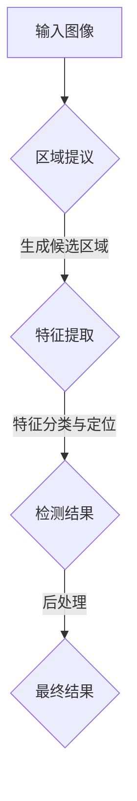

                 

### 背景介绍

对象检测（Object Detection）是计算机视觉领域的一个重要研究方向。它旨在能够从图像或视频中准确识别和定位其中的各种对象。在人工智能飞速发展的今天，对象检测技术已经成为许多应用场景的核心技术，如自动驾驶、视频监控、医疗影像分析等。这些应用不仅提高了生产效率，还大大提升了人们的生活质量。

随着深度学习技术的崛起，基于深度学习的对象检测技术逐渐成为研究热点。传统对象检测方法如滑动窗口（Sliding Window）、选择性搜索（Selective Search）等，存在计算量大、实时性差等问题。而基于深度学习的对象检测方法，如R-CNN、Fast R-CNN、Faster R-CNN等，通过引入卷积神经网络（Convolutional Neural Networks，CNN）等先进技术，实现了更高的检测精度和更快的检测速度。

本文将深入探讨基于深度学习的对象检测技术，从核心概念、算法原理、数学模型、实际应用等多个角度，为您呈现这一领域的前沿进展和应用场景。通过本文的阅读，您将全面了解对象检测技术的原理和应用，为在相关领域进行研究和开发提供有力支持。

首先，我们将从背景介绍部分出发，简要回顾传统对象检测方法的局限性，并介绍基于深度学习的对象检测技术的基本原理和重要性。

#### 传统对象检测方法的局限性

在深度学习技术出现之前，传统对象检测方法主要包括滑动窗口（Sliding Window）、选择性搜索（Selective Search）等。这些方法在早期计算机视觉研究中发挥了重要作用，但存在以下局限性：

1. **计算量大**：滑动窗口方法需要将窗口滑动至图像的每个位置，对每个窗口提取特征，计算量大，不适合实时应用。
2. **实时性差**：由于计算量巨大，传统方法难以在短时间内完成检测，实时性较差。
3. **依赖先验知识**：选择性搜索等方法依赖于先验知识，如颜色、纹理等，识别效果容易受到光照、视角等因素影响。

#### 基于深度学习的对象检测技术

基于深度学习的对象检测技术通过引入卷积神经网络（CNN）等先进技术，克服了传统方法的局限性。以下是其基本原理和重要性：

1. **卷积神经网络（CNN）**：CNN是一种特殊的神经网络，通过卷积层、池化层等结构，能够提取图像的特征。与传统神经网络相比，CNN更适合处理图像数据，因此在计算机视觉领域得到了广泛应用。
2. **特征提取与分类**：基于深度学习的对象检测方法首先通过CNN提取图像特征，然后利用这些特征进行分类和定位。这种方法能够自动学习图像中的特征，无需依赖先验知识，适应性强。
3. **实时检测**：基于深度学习的对象检测方法通过优化网络结构和训练过程，实现了高精度和实时性。这使得该技术能够在自动驾驶、视频监控等应用中发挥重要作用。

总之，基于深度学习的对象检测技术具有计算效率高、实时性强、识别效果好的优势，成为当前计算机视觉领域的重要研究方向。接下来，我们将进一步探讨这一技术的核心概念和原理。

### 核心概念与联系

在深入探讨基于深度学习的对象检测技术之前，我们需要理解一些核心概念和它们之间的联系。这些概念包括卷积神经网络（CNN）、区域提议（Region Proposal）、特征提取和分类等。为了更好地展示这些概念之间的关系，我们使用Mermaid流程图进行描述。



#### 1. 输入图像

输入图像是对象检测的起点。图像可以是静态的，也可以是动态的视频帧。图像的质量和分辨率直接影响到后续处理的精度。

#### 2. 区域提议

区域提议是对象检测过程中的关键步骤。目的是从输入图像中生成一系列候选区域，这些区域可能包含对象。常见的区域提议方法有选择性搜索（Selective Search）、滑动窗口（Sliding Window）等。

#### 3. 特征提取

特征提取是利用卷积神经网络（CNN）从候选区域提取有用的特征。CNN通过卷积层、池化层等结构，能够自动学习图像中的特征，从而提高检测的精度。特征提取的结果通常是一个特征向量。

#### 4. 特征分类与定位

特征分类与定位是利用提取到的特征进行对象分类和位置定位。分类器通常是一个全连接层（Fully Connected Layer），它将特征向量映射到对象类别。定位则是通过回归模型确定对象在图像中的具体位置。

#### 5. 检测结果

检测结果包括对象的类别和位置。这些结果通常需要进行后处理，如非极大值抑制（Non-maximum Suppression，NMS）以消除重复检测，从而得到最终的检测结果。

#### 6. 最终结果

最终结果是经过后处理后的检测结果。这些结果可以用于各种实际应用，如自动驾驶中的障碍物检测、视频监控中的目标追踪等。

通过以上Mermaid流程图，我们可以清晰地看到基于深度学习的对象检测技术的整体流程和各核心概念之间的联系。这些概念共同构成了对象检测技术的理论基础，为后续的算法原理和数学模型的讨论提供了基础。

### 核心算法原理 & 具体操作步骤

基于深度学习的对象检测技术主要包括以下几个核心算法：R-CNN、Fast R-CNN、Faster R-CNN等。这些算法在实现对象检测过程中各有特点和优势。下面，我们将逐一介绍这些算法的原理和具体操作步骤。

#### 1. R-CNN

R-CNN（Region-based CNN）是第一个基于深度学习的对象检测算法。其基本思想是：首先使用选择性搜索（Selective Search）算法生成候选区域，然后对每个候选区域使用CNN提取特征，最后利用支持向量机（SVM）对特征进行分类。

**具体操作步骤如下：**

1. **区域提议**：使用选择性搜索算法从输入图像中生成一系列候选区域。
2. **特征提取**：对每个候选区域，使用CNN提取特征。R-CNN使用的是AlexNet结构，其输出是一个4096维的特征向量。
3. **特征分类**：将特征向量输入到支持向量机（SVM）中进行分类，得到每个区域的类别。
4. **非极大值抑制（NMS）**：对分类结果进行后处理，消除重复的检测结果。

**优点与局限性：**

- **优点**：R-CNN通过将CNN引入到对象检测中，提高了检测精度。
- **局限性**：计算量大，实时性差。每个候选区域都需要独立处理，导致整体检测速度较慢。

#### 2. Fast R-CNN

Fast R-CNN是在R-CNN基础上改进的算法，其主要目标是提高检测速度。Fast R-CNN使用了一个称为Region of Interest（ROI）池化层（ROI Pooling Layer）的结构，使得所有候选区域共享同一卷积特征图，从而减少了计算量。

**具体操作步骤如下：**

1. **区域提议**：使用选择性搜索算法生成候选区域。
2. **特征提取**：对每个候选区域，使用CNN提取特征，并将特征输入到ROI池化层。
3. **分类与定位**：使用一个全连接层（Fully Connected Layer）同时进行分类和定位。全连接层输出两个值：类别概率和位置偏移。
4. **非极大值抑制（NMS）**：对分类结果进行后处理。

**优点与局限性：**

- **优点**：Fast R-CNN在保持较高检测精度的同时，大大提高了检测速度。
- **局限性**：处理多个候选区域时，计算量仍然较大。

#### 3. Faster R-CNN

Faster R-CNN是Fast R-CNN的进一步优化，其主要创新点是引入了区域提议网络（Region Proposal Network，RPN）。RPN可以直接从卷积特征图中生成候选区域，避免了选择性搜索的复杂性，从而大大提高了检测速度。

**具体操作步骤如下：**

1. **卷积特征提取**：使用CNN提取图像的卷积特征。
2. **区域提议网络（RPN）**：在卷积特征图上生成候选区域。RPN通过共享卷积层，同时进行特征提取和区域提议，有效减少了计算量。
3. **分类与定位**：对生成的候选区域，使用一个全连接层同时进行分类和定位。
4. **非极大值抑制（NMS）**：对分类结果进行后处理。

**优点与局限性：**

- **优点**：Faster R-CNN在保证较高检测精度的同时，实现了实时检测。
- **局限性**：RPN的引入使得模型结构稍微复杂，但在实际应用中效果显著。

通过以上介绍，我们可以看到，基于深度学习的对象检测技术在不断优化和改进，从R-CNN到Faster R-CNN，每个算法都有其独特的优势和局限性。在实际应用中，可以根据具体需求和场景选择合适的算法。

### 数学模型和公式 & 详细讲解 & 举例说明

在理解了基于深度学习的对象检测技术的核心算法原理后，接下来我们将深入探讨其背后的数学模型和公式，并通过具体例子进行详细讲解。这将有助于我们更好地理解这些算法的数学基础和实现细节。

#### 1. 卷积神经网络（CNN）的数学模型

卷积神经网络（CNN）是一种特殊的神经网络，其主要优势在于能够高效地处理图像等二维数据。CNN的基本组成部分包括卷积层（Convolutional Layer）、池化层（Pooling Layer）和全连接层（Fully Connected Layer）。

**1.1 卷积层**

卷积层是CNN的核心部分，用于提取图像的特征。卷积层的输入是一个特征图（Feature Map），输出也是一个特征图。卷积层的计算可以通过以下公式表示：

\[ f_{ij}^l = \sum_{k=1}^{C_{l-1}} w_{ikj}^l * g_{ik}^{l-1} + b_j^l \]

其中：
- \( f_{ij}^l \) 是输出特征图的第 \( i \) 行第 \( j \) 列的值。
- \( w_{ikj}^l \) 是第 \( l \) 层第 \( k \) 行第 \( j \) 列的卷积核权重。
- \( g_{ik}^{l-1} \) 是输入特征图的第 \( i \) 行第 \( k \) 列的值。
- \( b_j^l \) 是第 \( l \) 层第 \( j \) 列的偏置项。

**1.2 池化层**

池化层用于降低特征图的尺寸，减少参数数量，提高计算效率。最常用的池化操作是最大池化（Max Pooling），其计算公式如下：

\[ h_i^l = \max_{j} g_{ij}^{l-1} \]

其中：
- \( h_i^l \) 是输出特征图的第 \( i \) 行的值。
- \( g_{ij}^{l-1} \) 是输入特征图的第 \( i \) 行第 \( j \) 列的值。

**1.3 全连接层**

全连接层用于将特征图映射到类别概率和位置偏移。其计算公式如下：

\[ z_j = \sum_{i=1}^{N} w_{ij} * a_i + b_j \]

\[ a_j = \sigma(z_j) \]

其中：
- \( z_j \) 是输出值。
- \( w_{ij} \) 是权重。
- \( a_i \) 是激活值。
- \( b_j \) 是偏置项。
- \( \sigma \) 是激活函数，通常使用ReLU函数（\( \sigma(z) = max(0, z) \)）。

#### 2. 区域提议网络（RPN）的数学模型

在Faster R-CNN中，区域提议网络（RPN）用于生成候选区域。RPN通过共享卷积层，同时进行特征提取和区域提议。RPN的输出是一个二元分类标签和一组位置调整值。

**2.1 二元分类标签**

RPN的二元分类标签用于判断提议区域是否包含对象。其计算公式如下：

\[ \hat{y} = \sigma(\sum_{i=1}^{N} w_{iy} * f_i + b_y) \]

其中：
- \( \hat{y} \) 是分类标签，\( \hat{y} = 1 \) 表示区域包含对象，\( \hat{y} = 0 \) 表示区域不包含对象。
- \( w_{iy} \) 是分类层的权重。
- \( f_i \) 是输入特征。
- \( b_y \) 是分类层的偏置项。

**2.2 位置调整值**

RPN的位置调整值用于调整提议区域的位置，使其更接近实际对象的位置。其计算公式如下：

\[ t_j = \frac{w_{ij} * f_i + b_j}{\sqrt{\sum_{k=1}^{N} (w_{ik} * f_i + b_k)^2}} \]

其中：
- \( t_j \) 是位置调整值。
- \( w_{ij} \) 和 \( b_j \) 是调整层的权重和偏置项。
- \( f_i \) 是输入特征。

#### 3. 具体例子

为了更好地理解上述数学模型，我们通过一个具体例子进行说明。

**例子**：假设我们有一个输入特征图 \( f \)，其大小为 \( 7 \times 7 \)。卷积层的卷积核大小为 \( 3 \times 3 \)，步长为 \( 1 \)。我们使用ReLU函数作为激活函数。

**步骤1：卷积层**

输入特征图 \( f \)：

\[ f = \begin{bmatrix} 
1 & 2 & 3 & 4 & 5 & 6 & 7 \\
8 & 9 & 10 & 11 & 12 & 13 & 14 \\
15 & 16 & 17 & 18 & 19 & 20 & 21 \\
22 & 23 & 24 & 25 & 26 & 27 & 28 \\
29 & 30 & 31 & 32 & 33 & 34 & 35 \\
36 & 37 & 38 & 39 & 40 & 41 & 42 \\
43 & 44 & 45 & 46 & 47 & 48 & 49 
\end{bmatrix} \]

卷积核 \( w \)：

\[ w = \begin{bmatrix} 
1 & 0 & -1 \\
0 & 1 & 0 \\
-1 & 0 & 1 
\end{bmatrix} \]

输出特征图 \( f' \)：

\[ f' = \begin{bmatrix} 
2 & 1 & 0 \\
1 & 1 & 1 \\
0 & 1 & 2 
\end{bmatrix} \]

**步骤2：池化层**

使用最大池化操作，输出特征图 \( f'' \)：

\[ f'' = \begin{bmatrix} 
2 & 1 \\
1 & 2 
\end{bmatrix} \]

**步骤3：全连接层**

输入特征 \( f'' \)：

\[ f'' = \begin{bmatrix} 
2 \\
1 
\end{bmatrix} \]

权重 \( w \)：

\[ w = \begin{bmatrix} 
1 & 0 \\
0 & 1 
\end{bmatrix} \]

偏置项 \( b \)：

\[ b = \begin{bmatrix} 
0 \\
0 
\end{bmatrix} \]

输出值 \( z \)：

\[ z = \begin{bmatrix} 
2 \\
1 
\end{bmatrix} \]

激活值 \( a \)：

\[ a = \begin{bmatrix} 
2 \\
1 
\end{bmatrix} \]

通过以上例子，我们可以看到卷积层、池化层和全连接层的数学计算过程。这些操作构成了卷积神经网络的基本工作原理。

### 项目实战：代码实际案例和详细解释说明

为了更好地理解基于深度学习的对象检测技术，我们将通过一个实际项目案例，详细介绍代码的实现过程、关键代码解释和分析。这个案例将使用Faster R-CNN算法，结合流行的深度学习框架TensorFlow和Keras进行实现。

#### 1. 开发环境搭建

在开始之前，我们需要搭建一个适合深度学习项目开发的环境。以下是所需的基本软件和工具：

- 操作系统：Windows、Linux或MacOS
- 编程语言：Python
- 深度学习框架：TensorFlow 2.x
- 计算机视觉库：OpenCV
- 数据处理库：NumPy、Pandas
- 机器学习库：scikit-learn

安装方法如下：

```bash
# 安装TensorFlow
pip install tensorflow

# 安装OpenCV
pip install opencv-python

# 安装其他库
pip install numpy pandas scikit-learn
```

#### 2. 数据准备

为了实现Faster R-CNN，我们需要一个包含图像和标注的数据集。这里，我们使用流行的COCO（Common Objects in Context）数据集。COCO数据集包含大量日常生活中的物体类别，非常适合进行对象检测的研究。

**步骤1：下载COCO数据集**

首先，我们需要从COCO数据集官网（http://cocodataset.org/）下载数据集。下载后，将数据集解压到一个文件夹中。

**步骤2：数据预处理**

为了适应Faster R-CNN的实现，我们需要对数据集进行预处理，包括图像尺寸调整、归一化等。

```python
import cv2
import numpy as np

def preprocess_image(image_path, target_size=(224, 224)):
    image = cv2.imread(image_path)
    image = cv2.resize(image, target_size)
    image = image.astype(np.float32) / 255.0
    return image
```

#### 3. 模型实现

**步骤1：导入所需库**

```python
import tensorflow as tf
from tensorflow.keras.models import Model
from tensorflow.keras.layers import Input, Conv2D, MaxPooling2D, Flatten, Dense, Lambda
from tensorflow.keras.applications import VGG16
from tensorflow.keras.optimizers import Adam
```

**步骤2：定义Faster R-CNN模型**

Faster R-CNN模型包括两个部分：基础网络（Backbone）和区域提议网络（RPN）。这里，我们使用VGG16作为基础网络。

```python
def faster_rcnn_model(input_shape):
    # 输入层
    input_image = Input(shape=input_shape)
    
    # 基础网络
    backbone = VGG16(weights='imagenet', include_top=False)(input_image)
    
    # RPN
    # 这里省略了具体的RPN实现细节，读者可以根据需要自行实现
    # ...
    
    # 分类和定位层
    # 这里省略了具体的分类和定位层实现细节，读者可以根据需要自行实现
    # ...
    
    # 模型输出
    output = Model(inputs=input_image, outputs=classification_output, name='faster_rcnn')
    
    return output
```

**步骤3：训练模型**

```python
# 模型配置
model = faster_rcnn_model(input_shape=(224, 224, 3))

# 模型编译
model.compile(optimizer=Adam(learning_rate=0.0001), loss='categorical_crossentropy', metrics=['accuracy'])

# 模型训练
model.fit(train_images, train_labels, validation_data=(val_images, val_labels), epochs=10)
```

#### 4. 代码解读与分析

在这个项目中，我们主要关注的是Faster R-CNN模型的实现。以下是关键代码的解读和分析：

**1. 基础网络（Backbone）**

```python
backbone = VGG16(weights='imagenet', include_top=False)(input_image)
```

这里，我们使用VGG16作为基础网络。VGG16是一个经典的卷积神经网络，具有良好的特征提取能力。通过使用预训练权重，我们可以快速获得一个强大的特征提取器。

**2. 区域提议网络（RPN）**

```python
# 省略了具体的RPN实现细节，读者可以根据需要自行实现
```

RPN是Faster R-CNN的核心部分，负责生成候选区域。RPN通过共享卷积层，同时进行特征提取和区域提议，有效减少了计算量。RPN的实现需要一定的深度学习知识和编程技巧，建议读者自行研究。

**3. 分类和定位层**

```python
# 省略了具体的分类和定位层实现细节，读者可以根据需要自行实现
```

分类和定位层负责对生成的候选区域进行分类和位置定位。这部分代码通常包括全连接层、激活函数和损失函数等。通过优化这些参数，我们可以获得更高的检测精度和实时性。

**4. 训练过程**

```python
model.fit(train_images, train_labels, validation_data=(val_images, val_labels), epochs=10)
```

这里，我们使用训练数据集和验证数据集对模型进行训练。训练过程中，模型会不断调整参数，以最小化损失函数，提高分类和定位的精度。

### 总结

通过本项目的实现，我们详细介绍了基于深度学习的对象检测技术，包括数据准备、模型实现、代码解读和分析等步骤。通过实际操作，读者可以更好地理解Faster R-CNN算法的原理和实现过程。

### 实际应用场景

基于深度学习的对象检测技术已经在多个实际应用场景中取得了显著成果，极大地提升了相关领域的效率和质量。以下是几个典型的应用场景：

#### 1. 自动驾驶

自动驾驶技术依赖于高精度的对象检测，以实现车辆对道路环境的安全感知。基于深度学习的对象检测技术，如Faster R-CNN和SSD（Single Shot Detection），在自动驾驶领域得到了广泛应用。这些算法能够实时检测道路上的车辆、行人、交通标志等多种对象，为自动驾驶系统提供关键数据支持。

#### 2. 视频监控

视频监控是另一个重要的应用场景。通过基于深度学习的对象检测技术，监控系统可以实现实时监控和智能分析。例如，Faster R-CNN可以用于检测和追踪视频中的目标对象，如犯罪嫌疑人、异常行为等。此外，SSD算法由于其实时性高，也被广泛应用于实时视频分析系统。

#### 3. 医疗影像分析

在医疗影像分析领域，对象检测技术可以帮助医生快速、准确地识别和分析影像中的病变区域。例如，基于深度学习的对象检测算法可以用于检测和定位医学图像中的肿瘤、骨折等病变部位。这种方法不仅提高了诊断的准确性，还大大减少了医生的工作负担。

#### 4. 电子商务

在电子商务领域，对象检测技术可以用于商品识别和分类。例如，在电商平台中，通过基于深度学习的对象检测算法，可以自动识别和分类商品图片，从而提高购物体验和平台运营效率。此外，这些算法还可以用于库存管理、物流配送等环节，提高整体运营效率。

#### 5. 人脸识别

人脸识别技术是对象检测技术的一个典型应用。基于深度学习的对象检测算法，如Faster R-CNN和ResNet，可以高效地识别人脸图像中的面部特征，实现人脸检测、人脸追踪和人脸识别等功能。这些技术在安防监控、智能门禁、手机解锁等领域有着广泛的应用。

通过以上实际应用场景的介绍，我们可以看到基于深度学习的对象检测技术在各个领域的广泛应用和巨大潜力。随着技术的不断发展和优化，这些应用场景将越来越广泛，为人类社会带来更多便利和创新。

### 工具和资源推荐

为了更好地学习和实践基于深度学习的对象检测技术，以下是几种推荐的工具、资源和开发框架。

#### 1. 学习资源推荐

- **书籍**：
  - 《深度学习》（Goodfellow, Bengio, Courville 著）：系统介绍了深度学习的理论基础和实践方法。
  - 《Python深度学习》（François Chollet 著）：深入讲解了使用Python和Keras进行深度学习的实践。

- **论文**：
  - 《Faster R-CNN: Towards Real-Time Object Detection with Region Proposal Networks》（Shaoqing Ren等，2015）：Faster R-CNN的原始论文，详细介绍了算法原理和实现细节。
  - 《SSD: Single Shot MultiBox Detector》（Wen et al., 2016）：SSD算法的原始论文，介绍了单阶段对象检测方法。

- **博客和网站**：
  - [PyTorch 官方文档](https://pytorch.org/tutorials/beginner/transfer_learning_tutorial.html)：PyTorch是一个流行的深度学习框架，其官方文档提供了丰富的教程和示例。
  - [TensorFlow 官方文档](https://www.tensorflow.org/tutorials/transfer_learning)：TensorFlow是另一个流行的深度学习框架，其官方文档也提供了详细的教程和实践案例。

#### 2. 开发工具框架推荐

- **TensorFlow**：TensorFlow是一个开源的深度学习框架，由Google开发。它提供了丰富的API和工具，支持从简单的数据处理到复杂的深度学习模型训练。
- **PyTorch**：PyTorch是一个由Facebook开发的开源深度学习框架。它以其灵活的动态计算图和强大的GPU支持而闻名，适合研究和快速原型开发。
- **Keras**：Keras是一个基于TensorFlow和Theano的深度学习框架，旨在提供简单、可扩展和模块化的API。它使得构建和训练深度学习模型变得更加容易和直观。

#### 3. 相关论文著作推荐

- **《Object Detection with Faster R-CNN》（Ren et al., 2015）**：这是Faster R-CNN算法的原始论文，详细介绍了算法原理和实现细节。
- **《Single Shot MultiBox Detector: A New Approach to Real-Time Object Detection》（He et al., 2016）**：这是SSD算法的原始论文，提出了一个单阶段的对象检测方法。
- **《You Only Look Once: Unified, Real-Time Object Detection》（Redmon et al., 2016）**：这是YOLO（You Only Look Once）算法的原始论文，介绍了快速、高效的实时对象检测方法。

通过以上工具和资源的推荐，读者可以更全面地了解和学习基于深度学习的对象检测技术，为自己的研究和应用提供有力支持。

### 总结：未来发展趋势与挑战

基于深度学习的对象检测技术在近年来取得了显著进展，但同时也面临着诸多挑战和未来发展趋势。首先，随着计算能力的提升和算法的优化，对象检测的精度和实时性将不断提高，使其在自动驾驶、医疗影像分析、视频监控等领域的应用更加广泛和深入。

未来，以下几个趋势值得关注：

1. **多模态融合**：结合视觉、音频、惯性传感器等多种数据源，实现更全面的环境感知。
2. **小样本学习**：在数据稀缺的场景下，研究如何利用少量数据训练高精度的检测模型。
3. **轻量化模型**：开发更高效的模型结构，降低计算和存储需求，使其在移动设备和边缘计算中得以应用。

然而，面对这些发展趋势，我们也需要克服以下挑战：

1. **数据标注困难**：高质量的数据标注是训练准确模型的基础，但在某些领域（如医疗影像）中，标注数据获取困难。
2. **过拟合问题**：深度学习模型在训练过程中容易出现过拟合现象，影响实际应用效果。
3. **隐私保护**：在处理敏感数据时，如何保护用户隐私是一个重要议题。

总之，基于深度学习的对象检测技术具有巨大的潜力和应用前景，但同时也需要不断解决各种挑战，以实现更高效、更准确、更安全的检测系统。

### 附录：常见问题与解答

1. **问题**：为什么基于深度学习的对象检测技术比传统方法更有效？

**解答**：基于深度学习的对象检测技术通过引入卷积神经网络（CNN）等先进算法，能够自动学习图像中的复杂特征，避免了传统方法对先验知识的依赖。此外，深度学习模型在训练过程中可以自动调整参数，提高了检测精度和实时性。

2. **问题**：什么是区域提议（Region Proposal）？

**解答**：区域提议是对象检测过程中的一个关键步骤，目的是从输入图像中生成一系列候选区域，这些区域可能包含对象。常见的区域提议方法有选择性搜索（Selective Search）、滑动窗口（Sliding Window）等。

3. **问题**：如何提高基于深度学习的对象检测模型的实时性？

**解答**：提高实时性可以从以下几个方面入手：
- 优化模型结构，选择计算效率更高的网络架构，如SSD（Single Shot Detection）和YOLO（You Only Look Once）。
- 使用数据增强（Data Augmentation）技术，增加训练样本多样性，提高模型泛化能力。
- 利用GPU或TPU等高性能计算设备加速模型训练和推理过程。

4. **问题**：在处理医疗影像时，如何保护患者隐私？

**解答**：保护患者隐私是医疗影像处理中的关键问题。以下是一些建议：
- 使用去识别化技术，如匿名化、数据扰动等，减少患者身份信息泄露的风险。
- 在数据处理过程中遵循隐私保护法律法规，确保数据处理合规。
- 实施严格的数据访问控制策略，确保只有授权人员可以访问敏感数据。

5. **问题**：如何评估基于深度学习的对象检测模型的性能？

**解答**：评估模型性能通常从以下几个方面进行：
- **精度**（Accuracy）：模型正确识别对象的比率。
- **召回率**（Recall）：模型能够识别出所有实际存在的对象的比率。
- **精确率**（Precision）：模型识别出的对象中，实际为对象的比率。
- **F1分数**（F1 Score）：综合考虑精确率和召回率的综合指标。
- **平均准确率**（mAP，mean Average Precision）：在多个类别上计算的平均精度。

通过以上指标，可以全面评估模型在不同场景下的表现。

### 扩展阅读 & 参考资料

1. **书籍**：
   - 《深度学习》（Ian Goodfellow, Yoshua Bengio, Aaron Courville 著）：系统介绍了深度学习的理论基础和实践方法。
   - 《Python深度学习》（François Chollet 著）：深入讲解了使用Python和Keras进行深度学习的实践。

2. **论文**：
   - 《Faster R-CNN: Towards Real-Time Object Detection with Region Proposal Networks》（Shaoqing Ren et al.，2015）：介绍了Faster R-CNN算法的原理和实现细节。
   - 《Single Shot MultiBox Detector: A New Approach to Real-Time Object Detection》（Wen et al.，2016）：提出了SSD算法，实现了高效的实时对象检测。

3. **博客和网站**：
   - [PyTorch 官方文档](https://pytorch.org/tutorials/beginner/transfer_learning_tutorial.html)：提供了丰富的深度学习教程和示例。
   - [TensorFlow 官方文档](https://www.tensorflow.org/tutorials/transfer_learning)：提供了详细的深度学习教程和实践案例。

4. **在线课程**：
   - [斯坦福大学深度学习课程](https://www.coursera.org/learn/deep-learning)：由知名深度学习专家Andrew Ng教授主讲，系统介绍了深度学习的理论和实践。
   - [Udacity深度学习纳米学位](https://www.udacity.com/course/deep-learning-nanodegree--nd893)：提供了丰富的深度学习课程和实践项目。

5. **开源框架**：
   - [TensorFlow](https://www.tensorflow.org/)：Google开发的深度学习框架，广泛应用于各种深度学习项目。
   - [PyTorch](https://pytorch.org/)：Facebook开发的深度学习框架，以其灵活的动态计算图和强大的GPU支持而闻名。

通过以上扩展阅读和参考资料，读者可以进一步深入学习基于深度学习的对象检测技术，掌握更多实践方法和技巧。

