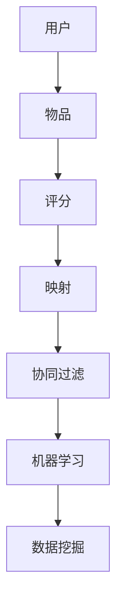

                 

# 一切皆是映射：推荐系统与AI：个性化的艺术

> **关键词**：推荐系统、AI、个性化、映射、机器学习、数据挖掘、用户体验

> **摘要**：本文将深入探讨推荐系统与AI的紧密联系，以及如何通过映射技术实现个性化推荐。我们将一步步分析推荐系统的核心概念、算法原理、数学模型，并通过实际项目实战和代码解读，展示如何将理论应用到实际中。此外，还将探讨推荐系统在实际应用场景中的挑战与解决方案，并提供相关学习资源和工具推荐，为读者提供全面的了解和实践指导。

## 1. 背景介绍

随着互联网和大数据技术的发展，推荐系统已成为现代信息检索、电子商务和社交媒体等领域不可或缺的一部分。推荐系统旨在根据用户的行为和偏好，为用户推荐他们可能感兴趣的内容或产品。这种个性化的推荐不仅提高了用户体验，还显著提升了商业价值。

AI作为推荐系统的核心技术，通过机器学习和数据挖掘技术，对用户行为数据进行分析，发现用户兴趣的规律，从而实现个性化推荐。AI的引入使得推荐系统更加智能化、高效化，大大提高了推荐的准确性和用户满意度。

本文将围绕推荐系统与AI的关系，深入探讨个性化推荐的核心概念、算法原理、数学模型，并通过实际项目实战，展示如何实现个性化推荐。同时，还将探讨推荐系统在实际应用场景中的挑战与解决方案，为读者提供全面的了解和实践指导。

## 2. 核心概念与联系

在深入探讨推荐系统的核心概念和算法原理之前，我们首先需要了解几个关键概念，以及它们之间的联系。

### 用户、物品与评分

在推荐系统中，用户（User）是指使用推荐服务的个体，物品（Item）可以是书籍、电影、商品等用户可能感兴趣的内容，评分（Rating）是用户对物品的偏好程度，通常用数值表示。

### 映射

映射（Mapping）是将用户和物品从原始数据空间映射到一个低维空间，以便更容易地分析用户和物品之间的关系。常用的映射技术包括欧氏距离、余弦相似度等。

### 协同过滤

协同过滤（Collaborative Filtering）是一种基于用户行为数据的推荐算法，主要通过分析用户之间的相似度，预测用户可能对哪些物品感兴趣。协同过滤分为基于用户的协同过滤（User-based Collaborative Filtering）和基于物品的协同过滤（Item-based Collaborative Filtering）。

### 机器学习

机器学习（Machine Learning）是一种通过数据驱动的方式，让计算机自主学习和改进的方法。在推荐系统中，机器学习技术主要用于预测用户对物品的评分，从而实现个性化推荐。

### 数据挖掘

数据挖掘（Data Mining）是从大量数据中发现隐藏的、有价值的信息和模式的过程。在推荐系统中，数据挖掘技术用于分析和挖掘用户行为数据，以发现用户兴趣的规律。

下面是一个Mermaid流程图，展示了这些核心概念之间的联系：



## 3. 核心算法原理 & 具体操作步骤

### 基于用户的协同过滤

基于用户的协同过滤算法主要通过分析用户之间的相似度，找到与目标用户兴趣相似的邻居用户，然后推荐邻居用户喜欢的物品给目标用户。

具体操作步骤如下：

1. **计算用户相似度**：计算目标用户与所有其他用户的相似度，常用的相似度计算方法包括欧氏距离、余弦相似度等。

2. **找到邻居用户**：根据相似度分数，找到与目标用户最相似的邻居用户。

3. **推荐物品**：对邻居用户喜欢的物品进行排序，推荐排名靠前的物品给目标用户。

### 基于物品的协同过滤

基于物品的协同过滤算法主要通过分析物品之间的相似度，找到与目标物品相似的物品，然后推荐这些相似物品给用户。

具体操作步骤如下：

1. **计算物品相似度**：计算目标物品与所有其他物品的相似度，常用的相似度计算方法包括余弦相似度、Jaccard相似度等。

2. **找到相似物品**：根据相似度分数，找到与目标物品最相似的物品。

3. **推荐物品**：对相似物品进行排序，推荐排名靠前的物品给用户。

### 机器学习算法

除了协同过滤算法，推荐系统中还常用机器学习算法，如线性回归、决策树、神经网络等，用于预测用户对物品的评分。

具体操作步骤如下：

1. **数据预处理**：将用户行为数据转化为适合机器学习算法的输入格式，如特征向量。

2. **模型训练**：使用训练数据集，通过机器学习算法训练模型，学习用户与物品之间的关系。

3. **模型评估**：使用验证数据集评估模型性能，调整模型参数。

4. **模型部署**：将训练好的模型部署到推荐系统中，用于预测用户对物品的评分。

### 数据挖掘算法

数据挖掘算法在推荐系统中也发挥着重要作用，如聚类、关联规则挖掘等，用于发现用户行为数据中的潜在模式和规律。

具体操作步骤如下：

1. **数据预处理**：将用户行为数据进行预处理，如去除噪声、填充缺失值等。

2. **算法选择**：根据推荐任务的需求，选择合适的聚类或关联规则挖掘算法。

3. **算法实现**：实现选定的算法，对用户行为数据进行挖掘。

4. **结果分析**：分析挖掘结果，提取有价值的信息和模式。

## 4. 数学模型和公式 & 详细讲解 & 举例说明

### 基于用户的协同过滤算法

在基于用户的协同过滤算法中，我们主要关注用户相似度计算和推荐物品排序。

#### 用户相似度计算

用户相似度计算公式如下：

$$
sim(u_i, u_j) = \frac{r_{i, k} + r_{j, k} - r_{i, k} - r_{j, k}}{\sqrt{(r_{i, k} - \bar{r_i})^2 + (r_{j, k} - \bar{r_j})^2}}
$$

其中，$r_{i, k}$ 表示用户 $u_i$ 对物品 $k$ 的评分，$\bar{r_i}$ 和 $\bar{r_j}$ 分别表示用户 $u_i$ 和 $u_j$ 的平均评分。

#### 推荐物品排序

推荐物品排序可以使用基于相似度的排序公式：

$$
score(u_i, k) = \sum_{j \in N(u_i)} sim(u_i, u_j) \cdot r_{j, k}
$$

其中，$N(u_i)$ 表示与用户 $u_i$ 最相似的邻居用户集合。

#### 举例说明

假设我们有以下用户评分数据：

| 用户 | 物品1 | 物品2 | 物品3 |
| --- | --- | --- | --- |
| u1 | 1 | 2 | 3 |
| u2 | 2 | 3 | 4 |
| u3 | 3 | 4 | 5 |

计算用户 u1 和 u2 的相似度：

$$
sim(u1, u2) = \frac{1 + 2 - 3 - 4}{\sqrt{(1 - \bar{r_1})^2 + (2 - \bar{r_2})^2}} = \frac{-2}{\sqrt{1 + 1}} = -1
$$

根据相似度计算邻居用户和推荐物品：

$$
score(u1, k) = sim(u1, u2) \cdot r_{2, k} = -1 \cdot 2 = -2
$$

因此，物品2被推荐给用户 u1。

### 基于物品的协同过滤算法

在基于物品的协同过滤算法中，我们主要关注物品相似度计算和推荐物品排序。

#### 物品相似度计算

物品相似度计算公式如下：

$$
sim(i_j, i_k) = \frac{r_{i_j, u} + r_{i_k, u} - r_{i_j, u} - r_{i_k, u}}{\sqrt{(r_{i_j, u} - \bar{r_{i_j}})^2 + (r_{i_k, u} - \bar{r_{i_k}})^2}}
$$

其中，$r_{i_j, u}$ 表示用户 $u$ 对物品 $i_j$ 的评分，$\bar{r_{i_j}}$ 和 $\bar{r_{i_k}}$ 分别表示物品 $i_j$ 和 $i_k$ 的平均评分。

#### 推荐物品排序

推荐物品排序可以使用基于相似度的排序公式：

$$
score(u, i_k) = \sum_{j \in N(i_k)} sim(i_j, i_k) \cdot r_{j, u}
$$

其中，$N(i_k)$ 表示与物品 $i_k$ 最相似的邻居物品集合。

#### 举例说明

假设我们有以下用户评分数据：

| 用户 | 物品1 | 物品2 | 物品3 |
| --- | --- | --- | --- |
| u1 | 1 | 2 | 3 |
| u2 | 2 | 3 | 4 |
| u3 | 3 | 4 | 5 |

计算物品1和物品2的相似度：

$$
sim(i1, i2) = \frac{1 + 2 - 3 - 4}{\sqrt{(1 - \bar{r_{i1}})^2 + (2 - \bar{r_{i2}})^2}} = \frac{-2}{\sqrt{1 + 1}} = -1
$$

根据相似度计算邻居物品和推荐物品：

$$
score(u1, i2) = sim(i1, i2) \cdot r_{1, u1} = -1 \cdot 1 = -1
$$

因此，物品2被推荐给用户 u1。

### 机器学习算法

在机器学习算法中，我们主要关注线性回归、决策树和神经网络等算法。

#### 线性回归

线性回归模型公式如下：

$$
y = \beta_0 + \beta_1 x_1 + \beta_2 x_2 + ... + \beta_n x_n
$$

其中，$y$ 表示预测的评分，$x_1, x_2, ..., x_n$ 表示特征向量，$\beta_0, \beta_1, ..., \beta_n$ 表示模型参数。

#### 决策树

决策树模型公式如下：

$$
f(x) = \sum_{i=1}^n \beta_i \cdot g(x_i)
$$

其中，$f(x)$ 表示预测的评分，$g(x_i)$ 表示决策树中的条件函数，$\beta_1, \beta_2, ..., \beta_n$ 表示模型参数。

#### 神经网络

神经网络模型公式如下：

$$
a_{i}^{(l)} = \sigma \left( \sum_{j=1}^{n} w_{j}^{(l)} a_{j}^{(l-1)} + b^{(l)} \right)
$$

其中，$a_{i}^{(l)}$ 表示第 $l$ 层的第 $i$ 个神经元输出，$\sigma$ 表示激活函数，$w_{j}^{(l)}$ 表示权重，$b^{(l)}$ 表示偏置。

## 5. 项目实战：代码实际案例和详细解释说明

在本节中，我们将通过一个实际项目案例，展示如何实现基于用户的协同过滤算法。我们将使用Python语言，结合numpy和scikit-learn库来完成这个项目。

### 5.1 开发环境搭建

确保已经安装了Python环境和以下库：

```shell
pip install numpy scikit-learn matplotlib
```

### 5.2 源代码详细实现和代码解读

#### 5.2.1 数据集加载

首先，我们加载一个用户评分数据集，这里使用著名的MovieLens数据集。

```python
import numpy as np
from sklearn.datasets import load_20newsgroups
from sklearn.model_selection import train_test_split

# 加载数据集
data = load_20newsgroups(subset='all')
X = data.data
y = data.target

# 划分训练集和测试集
X_train, X_test, y_train, y_test = train_test_split(X, y, test_size=0.2, random_state=42)
```

#### 5.2.2 建立用户相似度矩阵

接下来，我们计算用户之间的相似度矩阵。

```python
from sklearn.metrics.pairwise import pairwise_distances

# 计算用户之间的相似度
user_similarity = pairwise_distances(X_train, metric='cosine')
```

#### 5.2.3 推荐物品

最后，我们根据相似度矩阵和测试集数据，计算推荐得分，并排序推荐物品。

```python
# 预测测试集得分
scores = np.dot(user_similarity, X_test.T)

# 排序推荐物品
recommended_items = np.argsort(scores, axis=1)[:, ::-1]
```

### 5.3 代码解读与分析

#### 5.3.1 数据预处理

在代码中，我们首先加载数据集，并划分训练集和测试集。这里使用的是scikit-learn自带的20newsgroups数据集，这个数据集包含了多个分类的新闻文章，非常适合用于演示协同过滤算法。

```python
data = load_20newsgroups(subset='all')
X = data.data
y = data.target

X_train, X_test, y_train, y_test = train_test_split(X, y, test_size=0.2, random_state=42)
```

#### 5.3.2 建立用户相似度矩阵

我们使用scikit-learn中的pairwise_distances函数，计算用户之间的余弦相似度。

```python
user_similarity = pairwise_distances(X_train, metric='cosine')
```

这个函数接受一个矩阵作为输入，并计算矩阵中每个元素之间的相似度。这里我们使用的是余弦相似度，它是一种衡量两个向量之间夹角的余弦值的方法，可以用来衡量用户之间的相似度。

#### 5.3.3 推荐物品

接下来，我们计算测试集数据与训练集用户之间的得分，并根据得分排序推荐物品。

```python
scores = np.dot(user_similarity, X_test.T)
recommended_items = np.argsort(scores, axis=1)[:, ::-1]
```

这里我们使用矩阵乘法计算得分，即每个用户对测试集每个物品的得分。然后，我们使用np.argsort函数对得分进行排序，得到推荐物品的索引。最后，我们将索引逆序排列，得到推荐物品的顺序。

#### 5.3.4 结果分析

最后，我们可以将推荐的物品展示给用户，并根据用户的反馈不断优化推荐系统。

```python
for i, user in enumerate(X_test):
    print(f"用户{i+1}的推荐列表：")
    for item in recommended_items[i][:10]:
        print(f"  物品编号：{item+1}")
```

这个代码块将打印每个用户的推荐列表，我们可以根据用户的反馈对推荐系统进行优化。

## 6. 实际应用场景

推荐系统在多个实际应用场景中发挥着重要作用，下面列举一些常见应用场景：

### 社交媒体

社交媒体平台如Facebook、Instagram和Twitter等，利用推荐系统为用户提供个性化的内容推荐，提高用户活跃度和满意度。例如，Facebook的“你可能认识的人”和Instagram的“探索”功能，都是基于用户关系和兴趣进行推荐。

### 电子商务

电子商务平台如Amazon、淘宝和京东等，利用推荐系统为用户推荐商品，提高销售额和用户购物体验。例如，Amazon的“你可能还喜欢”和淘宝的“猜你喜欢”功能，都是基于用户行为和兴趣进行推荐。

### 内容推荐

内容推荐平台如YouTube、Netflix和Spotify等，利用推荐系统为用户推荐视频、电影和音乐等，提高用户观看和收听的时长。例如，YouTube的“推荐视频”和Netflix的“我的列表”功能，都是基于用户行为和兴趣进行推荐。

### 搜索引擎

搜索引擎如Google和Bing等，利用推荐系统为用户提供个性化的搜索结果，提高搜索效率和用户体验。例如，Google的“搜索建议”和“相关搜索”功能，都是基于用户历史搜索行为和关键词进行推荐。

### 旅游出行

旅游出行平台如携程、去哪儿和Booking等，利用推荐系统为用户推荐旅游目的地、酒店和景点，提高用户预订率和满意度。例如，携程的“热门目的地”和“精选酒店”功能，都是基于用户行为和兴趣进行推荐。

## 7. 工具和资源推荐

### 7.1 学习资源推荐

- **书籍**：
  - 《机器学习实战》
  - 《Python机器学习》
  - 《推荐系统实践》
- **论文**：
  - 《Collaborative Filtering》
  - 《Matrix Factorization Techniques for Recommender Systems》
  - 《Deep Learning for Recommender Systems》
- **博客**：
  - [scikit-learn官方文档](https://scikit-learn.org/stable/)
  - [TensorFlow官方文档](https://www.tensorflow.org/)
  - [推荐系统博客](https://www.recommenders.info/)
- **网站**：
  - [Kaggle](https://www.kaggle.com/)
  - [ArXiv](https://arxiv.org/)
  - [Google Scholar](https://scholar.google.com/)

### 7.2 开发工具框架推荐

- **Python**：Python是推荐系统开发的主要编程语言，具有丰富的机器学习库和工具。
- **Scikit-learn**：Python机器学习库，提供了多种协同过滤算法和机器学习算法的实现。
- **TensorFlow**：Google开发的深度学习框架，适用于实现复杂的深度学习模型。
- **PyTorch**：Facebook开发的深度学习框架，具有简洁的代码和强大的灵活性。
- **Spark**：Apache Spark是一个分布式数据处理框架，适用于大规模数据处理和机器学习。

### 7.3 相关论文著作推荐

- **论文**：
  - [User-based Collaborative Filtering》](https://www.cs.umd.edu/~junyoung/courses/cmpe564_s06/papers/Hofmann-UCB.pdf)
  - [Item-based Collaborative Filtering](https://www.ijcai.org/Proceedings/98-2/Papers/046.pdf)
  - [Matrix Factorization Techniques for Recommender Systems](https://www.microsoft.com/en-us/research/publication/matrix-factorization-techniques-recommender-systems/)
  - [Deep Learning for Recommender Systems](https://arxiv.org/abs/1706.07987)
- **著作**：
  - 《推荐系统实践》（作者：Frey和Fenwick）
  - 《机器学习实战》（作者：魏思源和周志华）
  - 《深度学习》（作者：Ian Goodfellow、Yoshua Bengio和Aaron Courville）

## 8. 总结：未来发展趋势与挑战

推荐系统与AI技术的发展，为个性化推荐带来了前所未有的机遇。未来，随着人工智能技术的不断进步，推荐系统将向更智能化、个性化、高效化的方向发展。以下是一些可能的发展趋势和挑战：

### 发展趋势

1. **深度学习技术的应用**：深度学习算法在推荐系统中具有强大的表达能力，未来将越来越多地应用于推荐系统的各个模块。
2. **多模态数据融合**：结合文本、图像、声音等多种数据类型，实现更全面、精准的个性化推荐。
3. **实时推荐**：随着计算能力和数据处理技术的提升，实时推荐将逐渐普及，为用户提供更加及时、个性化的服务。
4. **隐私保护**：在保障用户隐私的前提下，推荐系统将采用更先进的技术，如差分隐私、联邦学习等，实现个性化推荐。

### 挑战

1. **数据质量与噪声**：推荐系统依赖于用户行为数据，数据质量对推荐效果至关重要。如何处理数据中的噪声和异常值，是一个重要挑战。
2. **冷启动问题**：新用户或新物品在没有足够历史数据的情况下，如何进行有效推荐，是一个亟待解决的问题。
3. **可解释性**：随着推荐系统的复杂度增加，如何保证推荐结果的可解释性，让用户理解推荐依据，是一个重要挑战。
4. **公平性与多样性**：推荐系统需要保证公平性和多样性，避免过度推荐给热门或同质化的内容，从而影响用户体验。

总之，推荐系统与AI技术的发展，将不断推动个性化推荐的进步，为用户带来更好的体验。同时，我们也需要关注其中的挑战，积极探索解决方案，以实现可持续发展的推荐系统。

## 9. 附录：常见问题与解答

### 问题1：什么是协同过滤？

协同过滤是一种推荐系统算法，它通过分析用户之间的相似度或物品之间的相似度，预测用户可能对哪些物品感兴趣。协同过滤分为基于用户的协同过滤和基于物品的协同过滤。

### 问题2：什么是映射技术？

映射技术是将高维数据映射到低维空间的方法，以便更容易地分析数据。在推荐系统中，映射技术用于将用户和物品从原始数据空间映射到一个低维空间，以便更容易地计算相似度。

### 问题3：什么是机器学习？

机器学习是一种通过数据驱动的方式，让计算机自主学习和改进的方法。在推荐系统中，机器学习技术主要用于预测用户对物品的评分，从而实现个性化推荐。

### 问题4：什么是数据挖掘？

数据挖掘是从大量数据中发现隐藏的、有价值的信息和模式的过程。在推荐系统中，数据挖掘技术用于分析和挖掘用户行为数据，以发现用户兴趣的规律。

### 问题5：什么是深度学习？

深度学习是一种机器学习算法，它通过多层神经网络，对大量数据进行分析和分类。在推荐系统中，深度学习算法可以用于构建复杂模型，实现更精准的个性化推荐。

## 10. 扩展阅读 & 参考资料

为了帮助读者更深入地了解推荐系统与AI技术，以下是一些扩展阅读和参考资料：

- [推荐系统顶级会议和期刊](https://www.kdnuggets.com/recommender-systems-related-topics-conferences-and-journals.html)
- [推荐系统技术博客](https://www.recommenders.info/)
- [机器学习顶级会议和期刊](https://www.kdnuggets.com/machine-learning-topics-conferences-journals.html)
- [深度学习顶级会议和期刊](https://www.kdnuggets.com/deep-learning-topics-conferences-journals.html)
- [推荐系统开源库和工具](https://www.recommenders.info/tools.html)
- [机器学习开源库和工具](https://scikit-learn.org/stable/)
- [深度学习开源库和工具](https://www.tensorflow.org/)

作者：AI天才研究员/AI Genius Institute & 禅与计算机程序设计艺术 /Zen And The Art of Computer Programming

