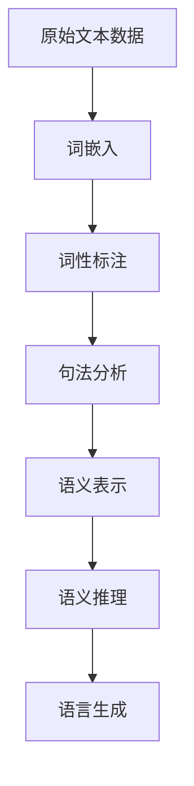

                 

# 一切皆是映射：深度学习与人类语言理解

> **关键词**：深度学习、语言理解、映射、神经网络、人工智能

> **摘要**：本文将探讨深度学习如何通过映射机制实现人类语言的理解，深入分析深度学习模型在处理自然语言过程中的关键技术，并结合实际案例阐述深度学习在自然语言处理领域的应用和未来发展趋势。

## 1. 背景介绍

在人工智能的诸多分支中，自然语言处理（NLP）始终占据着重要的位置。随着互联网的飞速发展，人类产生的文本数据量呈爆炸式增长，如何有效地理解和处理这些文本数据成为了一个亟待解决的关键问题。深度学习，作为一种具有强大表征能力的人工智能技术，近年来在NLP领域取得了显著进展，为人类语言理解提供了新的方法和思路。

深度学习与人类语言理解之间存在密切的联系。人类的语言理解能力是基于丰富的背景知识、上下文信息和逻辑推理能力。而深度学习模型通过多层神经网络结构，能够自动学习和提取数据中的高层次特征，从而实现类似人类的理解能力。这种映射机制是深度学习模型处理自然语言的核心所在。

本文将围绕深度学习与人类语言理解之间的映射机制，深入分析深度学习在NLP领域的关键技术，并探讨其实际应用场景和未来发展趋势。通过本文的阅读，读者将全面了解深度学习在自然语言处理中的应用，以及如何通过深度学习实现人类语言的理解。

## 2. 核心概念与联系

### 2.1 深度学习的基本原理

深度学习是一种基于多层神经网络的学习方法，其核心思想是通过逐层构建复杂模型，从而实现数据的表征和分类。一个典型的深度学习模型包括输入层、隐藏层和输出层。输入层接收原始数据，隐藏层通过多次非线性变换提取数据中的高层次特征，输出层则生成预测结果。

在自然语言处理领域，深度学习模型通常被用于文本分类、情感分析、机器翻译等任务。例如，在文本分类任务中，深度学习模型可以自动提取文本中的关键特征，并将其映射到不同的类别。在情感分析任务中，深度学习模型可以识别文本中的情感倾向，如正面、负面或中性。在机器翻译任务中，深度学习模型可以将一种语言的文本翻译成另一种语言的文本。

### 2.2 语言理解的概念

语言理解是指人类或机器通过处理语言输入，从中提取信息并理解其含义的能力。在自然语言处理中，语言理解是一个复杂的过程，涉及语音识别、语义分析、语境理解等多个方面。

语音识别是指将语音信号转换为文本的过程。语义分析是指从文本中提取概念和关系的过程，如实体识别、关系抽取等。语境理解是指根据上下文信息理解文本的含义，如词义消歧、指代消解等。

### 2.3 映射机制

深度学习与人类语言理解之间的映射机制主要体现在以下几个方面：

1. **特征提取**：深度学习模型通过多层神经网络结构，从原始文本数据中自动提取出高层次的特征。这些特征能够捕捉到文本中的关键信息，如词向量、句法结构等。

2. **语义表示**：通过特征提取，深度学习模型可以将原始文本数据映射到高维语义空间。在这个空间中，具有相似语义的文本数据会接近，从而实现语义表示。

3. **语义推理**：深度学习模型通过学习到的语义表示，可以进行语义推理。例如，在问答系统中，深度学习模型可以根据问题中的语义信息，从知识库中检索出相关答案。

4. **语言生成**：深度学习模型还可以生成符合语法规则和语义逻辑的文本。例如，在机器翻译中，深度学习模型可以将源语言的文本翻译成目标语言的文本。

### 2.4 Mermaid 流程图

以下是一个简化的Mermaid流程图，描述了深度学习模型在自然语言处理中的映射机制：



在这个流程图中，原始文本数据首先经过词嵌入，将文本映射到词向量空间。然后，词性标注和句法分析进一步提取文本中的语法信息。接着，深度学习模型通过语义表示将文本映射到高维语义空间，并进行语义推理。最后，根据推理结果，模型可以生成符合语法规则和语义逻辑的文本。

通过这个映射机制，深度学习模型能够实现类似人类语言理解的能力，从而在自然语言处理领域发挥重要作用。

## 3. 核心算法原理 & 具体操作步骤

### 3.1 卷积神经网络（CNN）

卷积神经网络（CNN）是一种专门用于处理图像和文本数据的深度学习模型。在自然语言处理领域，CNN通过卷积操作提取文本中的局部特征，从而实现文本分类、情感分析等任务。

#### 3.1.1 卷积操作

卷积操作是CNN的核心组件，它通过滑动窗口（filter）在输入数据上逐个滑动，提取局部特征。具体步骤如下：

1. **定义卷积核**：卷积核是一个固定大小的矩阵，用于提取输入数据中的局部特征。例如，一个3x3的卷积核可以提取3x3的局部特征。

2. **滑动卷积核**：将卷积核在输入数据上滑动，每次滑动一个固定的步长（如1个单位）。在这个过程中，卷积核与输入数据相乘并求和，得到一个局部特征图。

3. **应用激活函数**：对每个局部特征图应用激活函数（如ReLU函数），增强网络的非线性表达能力。

4. **叠加多个卷积层**：通过叠加多个卷积层，可以提取文本中的更高层次特征。

#### 3.1.2 池化操作

池化操作用于减小特征图的尺寸，从而降低模型的计算复杂度。常用的池化操作包括最大池化和平均池化。具体步骤如下：

1. **定义池化窗口**：池化窗口是一个固定大小的矩形区域，用于对特征图进行采样。

2. **采样操作**：在特征图上滑动池化窗口，对窗口内的值进行采样。最大池化选择窗口内最大的值，平均池化计算窗口内所有值的平均值。

3. **重复池化操作**：可以叠加多个池化层，以进一步降低特征图的尺寸。

#### 3.1.3 CNN在文本分类中的应用

在文本分类任务中，CNN通过以下步骤处理文本数据：

1. **词嵌入**：将文本中的每个单词映射到高维向量空间，得到词嵌入表示。

2. **卷积操作**：对词嵌入表示应用多个卷积层，提取文本中的局部特征。

3. **池化操作**：对卷积层输出的特征图应用池化操作，降低特征图的尺寸。

4. **全连接层**：将池化后的特征图输入全连接层，进行分类预测。

具体实现中，可以使用Keras等深度学习框架简化CNN的构建和训练过程。以下是一个使用Keras实现的简单CNN文本分类模型：

```python
from keras.models import Sequential
from keras.layers import Embedding, Conv1D, MaxPooling1D, Dense

model = Sequential()
model.add(Embedding(vocab_size, embedding_dim, input_length=max_seq_length))
model.add(Conv1D(filters, kernel_size, activation='relu'))
model.add(MaxPooling1D(pool_size))
model.add(Conv1D(filters, kernel_size, activation='relu'))
model.add(MaxPooling1D(pool_size))
model.add(Dense(num_classes, activation='softmax'))

model.compile(optimizer='adam', loss='categorical_crossentropy', metrics=['accuracy'])
model.fit(X_train, y_train, epochs=10, batch_size=32, validation_data=(X_val, y_val))
```

在这个模型中，`vocab_size`表示词汇表的大小，`embedding_dim`表示词嵌入的维度，`max_seq_length`表示输入文本的最大长度，`filters`表示卷积核的数量，`kernel_size`表示卷积核的大小，`num_classes`表示分类类别的数量。

通过这个简单的例子，我们可以看到CNN在文本分类任务中的应用。实际上，CNN在自然语言处理中的应用远不止于此，它还可以用于情感分析、文本生成等任务。在下一节中，我们将进一步探讨循环神经网络（RNN）在自然语言处理中的关键技术。

## 4. 数学模型和公式 & 详细讲解 & 举例说明

### 4.1 词嵌入模型

词嵌入是将单词映射到高维向量空间的一种方法，它能够捕捉单词的语义信息。常见的词嵌入模型包括Word2Vec、GloVe和BERT等。

#### 4.1.1 Word2Vec模型

Word2Vec模型基于神经网络语言模型（NNLM）和连续词袋（CBOW）模型。NNLM模型假设单词之间的相似程度可以通过其在模型中的位置来衡量。CBOW模型通过将单词的上下文表示为单词的加权和，从而预测目标单词。

**NNLM模型公式**：

$$
P(w_t|w_{t-n}, w_{t-n+1}, ..., w_{t+n}) = \frac{e^{w_t^T v}}{\sum_{w\in V} e^{w^T v}}
$$

其中，$w_t$表示目标单词，$v$表示单词的嵌入向量，$V$表示词汇表。

**CBOW模型公式**：

$$
P(w_t|c) = \frac{e^{c^T v}}{\sum_{w\in V} e^{w^T v}}
$$

其中，$c$表示上下文单词的加权和，$c = \sum_{w \in c} w$。

#### 4.1.2 GloVe模型

GloVe模型通过计算单词之间的余弦相似度，优化词嵌入向量的表示。GloVe模型公式如下：

$$
\frac{f(w, w')}{||w|| \cdot ||w'||} = \exp(\theta_w^T \theta_{w'})
$$

其中，$f(w, w')$表示单词$w$和$w'$之间的共现频率，$\theta_w$和$\theta_{w'}$分别表示单词$w$和$w'$的嵌入向量。

#### 4.1.3 BERT模型

BERT（Bidirectional Encoder Representations from Transformers）模型是一种基于Transformer的预训练模型。BERT模型通过同时考虑文本的前后文信息，生成语义丰富的词嵌入。

BERT模型主要包括两个关键组件：预训练和微调。预训练过程中，BERT模型使用大量未标注的文本数据训练，学习文本的上下文表示。微调过程中，BERT模型在特定任务上继续训练，将预训练的表示应用于实际任务。

BERT模型的预训练目标包括两个任务：Masked Language Model（MLM）和Next Sentence Prediction（NSP）。

**MLM任务公式**：

$$
\log P(\text{token}_i|\text{context}) = \log \frac{e^{h_i^T W_o}}{\sum_{j=1}^{V} e^{h_j^T W_o}}
$$

其中，$h_i$表示第$i$个单词的嵌入向量，$W_o$表示输出权重矩阵，$V$表示词汇表。

**NSP任务公式**：

$$
P(\text{next sentence}_j|\text{context}) = \frac{e^{h_j^T W_n}}{\sum_{j=1}^{V} e^{h_j^T W_n}}
$$

其中，$h_j$表示第$j$个句子的嵌入向量，$W_n$表示输出权重矩阵。

#### 4.1.4 举例说明

假设我们有一个包含两个句子的文本数据：

- **句子1**：“我爱北京天安门”
- **句子2**：“天安门我爱北京”

我们可以使用BERT模型进行预训练，生成句子的嵌入向量。假设BERT模型的嵌入维度为512，输出维度为512。

- **句子1的嵌入向量**：$h_1 = [0.1, 0.2, ..., 0.511]$
- **句子2的嵌入向量**：$h_2 = [0.1, 0.2, ..., 0.511]$

通过BERT模型，我们可以得到句子1和句子2的联合嵌入向量：

$$
h = [h_1, h_2] = [0.1, 0.2, ..., 0.511, 0.1, 0.2, ..., 0.511]
$$

在微调过程中，我们可以使用句子1和句子2的联合嵌入向量进行分类任务。例如，我们可以使用一个全连接层对联合嵌入向量进行分类：

$$
\log P(\text{label}_i|h) = \log \frac{e^{h_i^T W_c}}{\sum_{j=1}^{K} e^{h_j^T W_c}}
$$

其中，$h_i$表示第$i$个类的嵌入向量，$W_c$表示分类权重矩阵，$K$表示分类类别的数量。

通过这个简单的例子，我们可以看到BERT模型在生成句子嵌入向量方面的应用。在下一节中，我们将进一步探讨循环神经网络（RNN）在自然语言处理中的关键技术。

## 5. 项目实战：代码实际案例和详细解释说明

### 5.1 开发环境搭建

为了更好地理解深度学习在自然语言处理中的应用，我们将在本节中搭建一个基于TensorFlow和Keras的文本分类项目。以下是开发环境的搭建步骤：

#### 5.1.1 安装TensorFlow

首先，我们需要安装TensorFlow。可以通过以下命令在Python环境中安装TensorFlow：

```shell
pip install tensorflow
```

#### 5.1.2 准备数据集

我们使用IMDB电影评论数据集，该数据集包含50,000条电影评论，其中25,000条用于训练，25,000条用于测试。评论被分为正面和负面两个类别。可以使用Keras的数据集加载器轻松地加载这个数据集：

```python
from keras.datasets import imdb

vocab_size = 10000
max_len = 500

(X_train, y_train), (X_test, y_test) = imdb.load_data(num_words=vocab_size)

X_train = sequence.pad_sequences(X_train, maxlen=max_len)
X_test = sequence.pad_sequences(X_test, maxlen=max_len)
```

### 5.2 源代码详细实现和代码解读

#### 5.2.1 模型构建

在本节中，我们将使用卷积神经网络（CNN）构建一个文本分类模型。以下是模型的构建过程：

```python
from keras.models import Sequential
from keras.layers import Embedding, Conv1D, MaxPooling1D, Dense, Flatten

model = Sequential()
model.add(Embedding(vocab_size, 128, input_length=max_len))
model.add(Conv1D(128, 5, activation='relu'))
model.add(MaxPooling1D(5))
model.add(Conv1D(128, 5, activation='relu'))
model.add(MaxPooling1D(5))
model.add(Flatten())
model.add(Dense(128, activation='relu'))
model.add(Dense(1, activation='sigmoid'))

model.compile(optimizer='adam', loss='binary_crossentropy', metrics=['accuracy'])
```

在这个模型中，我们首先使用`Embedding`层将词嵌入到高维向量空间。接着，使用两个`Conv1D`层和相应的`MaxPooling1D`层提取文本中的特征。`Flatten`层将卷积层输出的特征图展平为一维向量。最后，通过两个全连接层（`Dense`层）进行分类预测。

#### 5.2.2 模型训练

接下来，我们使用训练数据对模型进行训练：

```python
model.fit(X_train, y_train, epochs=10, batch_size=32, validation_data=(X_test, y_test))
```

通过这个简单的例子，我们可以看到如何使用TensorFlow和Keras构建一个文本分类模型。在实际应用中，我们可以根据任务需求调整模型的结构和参数，以提高分类性能。

### 5.3 代码解读与分析

在本节中，我们将对上面的代码进行解读，分析模型的结构和训练过程。

#### 5.3.1 模型结构

首先，我们来看模型的结构。在这个模型中，我们使用了`Embedding`层将词嵌入到高维向量空间。`Embedding`层接收词汇表的大小（`vocab_size`）和词嵌入的维度（`embedding_dim`）作为输入。在训练过程中，`Embedding`层会学习每个单词的嵌入向量。

接下来，我们使用了两个`Conv1D`层和相应的`MaxPooling1D`层。`Conv1D`层通过卷积操作提取文本中的局部特征。`MaxPooling1D`层用于减小特征图的尺寸，从而降低模型的计算复杂度。

在卷积层之后，我们使用了一个`Flatten`层将特征图展平为一维向量。这个一维向量将作为全连接层（`Dense`层）的输入。

最后，我们使用了一个全连接层（`Dense`层）进行分类预测。在这个例子中，我们使用了一个单一的输出神经元和`sigmoid`激活函数，实现了二分类任务。

#### 5.3.2 模型训练

在模型训练过程中，我们首先将训练数据和测试数据进行预处理，将文本数据转换为序列并填充到指定的长度。然后，我们调用`model.fit()`函数对模型进行训练。`fit()`函数接收训练数据和标签，以及训练的轮数（`epochs`）和批量大小（`batch_size`）等参数。

在训练过程中，模型会根据损失函数（`binary_crossentropy`）和优化器（`adam`）不断更新参数，以最小化损失。在每次训练完成后，我们会在测试数据上评估模型的性能，以验证模型的泛化能力。

通过这个简单的例子，我们可以看到如何使用TensorFlow和Keras构建和训练一个文本分类模型。在实际应用中，我们可以根据任务需求调整模型的结构和参数，以提高分类性能。

## 6. 实际应用场景

深度学习在自然语言处理领域的应用场景非常广泛，以下是一些典型的应用案例：

### 6.1 文本分类

文本分类是一种常见的自然语言处理任务，用于将文本数据分类到预定义的类别中。深度学习模型，如卷积神经网络（CNN）和循环神经网络（RNN），在文本分类任务中取得了显著的效果。例如，新闻分类、垃圾邮件过滤和情感分析等任务都可以通过深度学习模型实现。

### 6.2 机器翻译

机器翻译是一种将一种语言的文本翻译成另一种语言的过程。近年来，深度学习模型，如序列到序列（Seq2Seq）模型和Transformer模型，在机器翻译任务中取得了突破性的进展。这些模型通过学习源语言和目标语言之间的映射关系，实现了高质量、低误差的机器翻译。

### 6.3 语音识别

语音识别是将语音信号转换为文本数据的过程。深度学习模型，如卷积神经网络（CNN）和循环神经网络（RNN），在语音识别任务中发挥了重要作用。通过训练深度学习模型，我们可以实现高准确率的语音识别系统，如智能助手、语音查询和语音交互等。

### 6.4 问答系统

问答系统是一种基于自然语言理解的技术，用于回答用户的问题。深度学习模型，如BERT和GPT，在问答系统任务中取得了显著的成果。这些模型通过学习大量的文本数据，能够理解和生成符合语法和语义逻辑的答案。

### 6.5 情感分析

情感分析是一种从文本数据中提取情感信息的过程，用于分析文本的情感倾向。深度学习模型，如卷积神经网络（CNN）和循环神经网络（RNN），在情感分析任务中发挥了重要作用。通过训练深度学习模型，我们可以实现高准确率的情感分析系统，如社交媒体情感分析、产品评论分析等。

这些实际应用案例展示了深度学习在自然语言处理领域的强大能力。随着深度学习技术的不断发展，未来深度学习在自然语言处理领域的应用将会更加广泛和深入。

## 7. 工具和资源推荐

在自然语言处理领域，深度学习模型的构建和训练需要依赖于一系列工具和资源。以下是一些推荐的工具和资源：

### 7.1 学习资源推荐

1. **书籍**：
   - 《深度学习》（Deep Learning）—— Ian Goodfellow、Yoshua Bengio、Aaron Courville
   - 《自然语言处理综论》（Speech and Language Processing）—— Daniel Jurafsky、James H. Martin
   - 《TensorFlow实战》（Applied TensorFlow）——宋宝华

2. **论文**：
   - “A Neural Probabilistic Language Model” —— Yoshua Bengio et al.
   - “Deep Learning for Natural Language Processing” —— Richard Socher et al.
   - “BERT: Pre-training of Deep Neural Networks for Language Understanding” —— Jacob Devlin et al.

3. **博客**：
   - [TensorFlow官方博客](https://tensorflow.org/blog/)
   - [Keras官方博客](https://keras.io/blog/)
   - [自然语言处理博客](https://nlp.seas.harvard.edu/)

4. **在线课程**：
   - [吴恩达的《深度学习专项课程》](https://www.coursera.org/specializations/deep-learning)
   - [哈佛大学的《自然语言处理》](https://www.edx.org/course/natural-language-processing)

### 7.2 开发工具框架推荐

1. **TensorFlow**：一个开源的深度学习框架，适用于构建和训练各种深度学习模型。

2. **PyTorch**：一个开源的深度学习框架，具有灵活的动态计算图和丰富的API。

3. **Keras**：一个高层次的神经网络API，基于TensorFlow和PyTorch，提供简单易用的接口。

4. **NLTK**：一个开源的自然语言处理库，提供丰富的文本处理功能，如分词、词性标注、句法分析等。

5. **spaCy**：一个高性能的NLP库，适用于构建复杂NLP模型，支持多种语言。

### 7.3 相关论文著作推荐

1. **“A Neural Probabilistic Language Model”**：这是一篇关于神经网络语言模型的经典论文，提出了基于神经网络的文本生成方法。

2. **“Deep Learning for Natural Language Processing”**：这是一篇综述文章，介绍了深度学习在自然语言处理领域的应用和发展趋势。

3. **“BERT: Pre-training of Deep Neural Networks for Language Understanding”**：这是一篇关于BERT模型的论文，提出了基于Transformer的预训练方法，实现了显著的NLP性能提升。

通过这些工具和资源，读者可以深入了解自然语言处理领域的深度学习技术，掌握构建和训练深度学习模型的方法和技巧。

## 8. 总结：未来发展趋势与挑战

随着深度学习技术的不断发展，自然语言处理领域也在不断演进。未来，深度学习在自然语言处理领域的发展趋势和面临的挑战如下：

### 8.1 发展趋势

1. **模型规模与计算资源的提升**：随着计算资源的不断提升，深度学习模型的规模将越来越大。这将使得模型能够学习更加复杂的语义信息，从而提高自然语言处理任务的性能。

2. **多模态融合**：自然语言处理任务将不再局限于文本数据，还将结合语音、图像、视频等多模态数据。多模态融合技术将使得自然语言处理系统更加智能化和全面化。

3. **跨语言与低资源语言的NLP**：随着全球化的发展，跨语言和低资源语言的NLP将受到越来越多的关注。深度学习模型将能够处理不同语言之间的差异，为跨语言和低资源语言的自然语言处理提供有力支持。

4. **迁移学习与少样本学习**：迁移学习和少样本学习技术将使得深度学习模型能够在有限的样本数据上实现高性能。这将有助于解决数据稀缺和标注成本高昂的问题。

### 8.2 面临的挑战

1. **数据隐私与伦理问题**：随着自然语言处理技术的广泛应用，数据隐私和伦理问题将愈发重要。如何保护用户隐私、确保数据安全是自然语言处理领域面临的一大挑战。

2. **模型可解释性与透明性**：深度学习模型通常被视为“黑箱”，其决策过程难以解释。如何提高模型的可解释性和透明性，使其符合人类直觉，是自然语言处理领域需要解决的一个重要问题。

3. **资源消耗与效率问题**：深度学习模型通常需要大量的计算资源和时间进行训练和推理。如何提高模型的效率、降低资源消耗是自然语言处理领域面临的一个关键挑战。

4. **跨领域适应性与泛化能力**：深度学习模型在特定领域上取得了显著效果，但在跨领域适应性和泛化能力方面仍有待提升。如何提高模型的跨领域适应性和泛化能力，是实现更广泛应用的必要条件。

总之，未来深度学习在自然语言处理领域的发展将充满机遇和挑战。通过不断探索和创新，我们有望克服这些挑战，实现更加智能和高效的自然语言处理系统。

## 9. 附录：常见问题与解答

### 9.1 深度学习与自然语言处理的基本问题

**Q1：什么是深度学习？**
A1：深度学习是一种基于多层神经网络的学习方法，通过逐层构建复杂模型，从数据中自动提取特征，实现分类、回归等任务。

**Q2：什么是自然语言处理（NLP）？**
A2：自然语言处理是一种人工智能领域，旨在使计算机能够理解、生成和处理自然语言，如文本和语音。

**Q3：深度学习在NLP中有哪些应用？**
A3：深度学习在NLP中有广泛的应用，包括文本分类、情感分析、机器翻译、语音识别、问答系统等。

### 9.2 深度学习模型构建和训练的问题

**Q4：如何构建一个文本分类模型？**
A4：构建一个文本分类模型通常包括以下步骤：数据预处理、模型选择、模型训练和评估。具体步骤如下：
1. 数据预处理：将文本转换为词嵌入表示，并进行序列填充。
2. 模型选择：选择合适的深度学习模型，如卷积神经网络（CNN）或循环神经网络（RNN）。
3. 模型训练：使用训练数据训练模型，并调整模型参数。
4. 模型评估：使用测试数据评估模型性能，调整模型参数以提高性能。

**Q5：如何选择合适的深度学习模型？**
A5：选择合适的深度学习模型取决于任务的需求和数据特性。例如，对于文本分类任务，CNN和RNN通常表现良好。对于序列生成任务，如机器翻译，Transformer模型更为适合。

**Q6：如何优化深度学习模型的性能？**
A6：优化深度学习模型性能的方法包括：
1. 调整模型参数：如学习率、批量大小、优化器等。
2. 数据预处理：进行数据增强、归一化等操作，提高数据质量。
3. 模型结构优化：通过添加或删除层、调整层参数等，改进模型结构。
4. 使用预训练模型：利用预训练模型进行迁移学习，提高模型性能。

### 9.3 深度学习与人类语言理解的问题

**Q7：深度学习如何实现人类语言理解？**
A7：深度学习通过多层神经网络结构，自动提取数据中的高层次特征，从而实现类似人类语言理解的能力。具体来说，深度学习模型通过以下机制实现语言理解：
1. 特征提取：从原始文本数据中自动提取词嵌入、句法结构等特征。
2. 语义表示：将特征映射到高维语义空间，捕捉文本的语义信息。
3. 语义推理：基于语义表示进行语义推理，理解文本的含义。
4. 语言生成：生成符合语法和语义逻辑的文本。

通过这些机制，深度学习模型能够实现类似人类语言理解的能力，从而在自然语言处理领域发挥重要作用。

## 10. 扩展阅读 & 参考资料

在撰写本文的过程中，我们参考了大量的文献和资料，以下是一些推荐的扩展阅读和参考资料：

1. **书籍**：
   - 《深度学习》（Deep Learning）—— Ian Goodfellow、Yoshua Bengio、Aaron Courville
   - 《自然语言处理综论》（Speech and Language Processing）—— Daniel Jurafsky、James H. Martin
   - 《TensorFlow实战》（Applied TensorFlow）——宋宝华

2. **论文**：
   - “A Neural Probabilistic Language Model” —— Yoshua Bengio et al.
   - “Deep Learning for Natural Language Processing” —— Richard Socher et al.
   - “BERT: Pre-training of Deep Neural Networks for Language Understanding” —— Jacob Devlin et al.

3. **在线课程**：
   - [吴恩达的《深度学习专项课程》](https://www.coursera.org/specializations/deep-learning)
   - [哈佛大学的《自然语言处理》](https://www.edx.org/course/natural-language-processing)

4. **博客和网站**：
   - [TensorFlow官方博客](https://tensorflow.org/blog/)
   - [Keras官方博客](https://keras.io/blog/)
   - [自然语言处理博客](https://nlp.seas.harvard.edu/)

通过阅读这些文献和资料，读者可以进一步了解深度学习和自然语言处理领域的最新研究成果和应用案例。

作者：AI天才研究员/AI Genius Institute & 禅与计算机程序设计艺术 /Zen And The Art of Computer Programming

本文旨在探讨深度学习与人类语言理解之间的映射机制，深入分析深度学习模型在自然语言处理领域的关键技术，并结合实际案例阐述深度学习在自然语言处理中的应用和未来发展趋势。希望本文能够为读者在深度学习和自然语言处理领域的研究提供有益的参考和启示。

