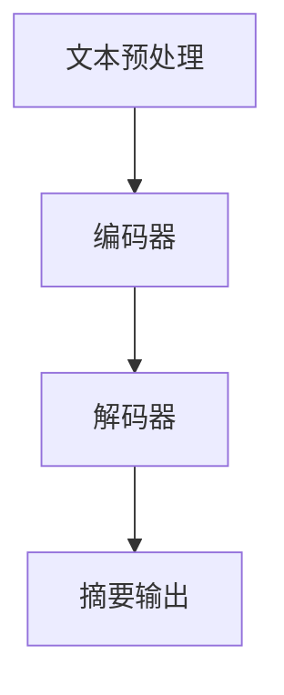

                 

# 一切皆是映射：深度学习在文本摘要生成中的应用

## 关键词：深度学习，文本摘要，映射，自然语言处理，机器学习，算法原理

## 摘要：
本文将深入探讨深度学习在文本摘要生成领域的应用。首先，我们将简要介绍文本摘要的背景和重要性。接着，本文将详细解析深度学习在文本摘要中的核心概念、算法原理以及数学模型。此外，我们将通过项目实战展示如何使用深度学习技术进行文本摘要的生成，并提供详细的代码解读与分析。最后，本文还将探讨文本摘要的实际应用场景，推荐相关工具和资源，并总结未来发展趋势与挑战。

## 1. 背景介绍

### 1.1 文本摘要的定义和类型

文本摘要是将原始文本转化为简短、精炼且具有代表性的摘要信息的过程。根据摘要生成的方式，文本摘要主要分为以下两类：

- **抽取式摘要（Extractive Summarization）**：抽取式摘要从原始文本中直接选取关键句子或短语进行摘录，生成摘要。这种方法的优点是生成的摘要忠实于原文，但缺点在于可能丢失原文中的重要细节。

- **生成式摘要（Abstractive Summarization）**：生成式摘要通过深度学习模型，利用语义理解和生成技术生成全新的摘要。这种方法的优点是生成的摘要更加连贯和有创意，但缺点是生成的摘要可能偏离原文的含义。

### 1.2 文本摘要的应用场景

文本摘要在多个领域具有广泛的应用，例如：

- **信息检索**：通过生成摘要，提高用户对大量文本数据的检索效率。

- **内容推荐**：将长篇文章转化为简短的摘要，方便用户快速了解文章内容，从而提高内容推荐的准确性和用户体验。

- **新闻摘要**：自动生成新闻摘要，帮助用户快速获取新闻的核心信息。

- **教育领域**：将教材、论文等长篇文本转化为摘要，方便学生快速掌握知识点。

### 1.3 深度学习在文本摘要中的优势

深度学习技术在文本摘要领域具有显著的优势，主要体现在以下几个方面：

- **语义理解**：深度学习模型能够捕捉文本中的深层语义信息，从而更好地理解文本内容。

- **生成能力**：生成式摘要技术通过深度学习模型生成全新的摘要，具有更好的连贯性和创造性。

- **大规模数据处理**：深度学习模型可以处理大规模的文本数据，提高文本摘要的效率和准确性。

## 2. 核心概念与联系

### 2.1 深度学习的基本概念

深度学习是一种基于多层神经网络的人工智能技术，通过学习大量数据中的特征，实现自动特征提取和模式识别。深度学习模型通常由输入层、隐藏层和输出层组成，每层神经元都通过激活函数进行非线性变换。

### 2.2 自然语言处理（NLP）

自然语言处理是研究计算机如何理解、处理和生成自然语言的一门学科。在文本摘要领域，NLP技术主要用于文本的预处理、语义理解和文本生成。

### 2.3 深度学习在文本摘要中的架构

深度学习在文本摘要中的架构通常包括以下几个关键部分：

1. **文本预处理**：包括分词、词性标注、词嵌入等，将原始文本转化为适合深度学习模型处理的格式。

2. **编码器（Encoder）**：编码器负责将输入的文本序列编码为固定长度的向量表示。常用的编码器模型有循环神经网络（RNN）、长短期记忆网络（LSTM）和变换器（Transformer）。

3. **解码器（Decoder）**：解码器负责将编码器的输出解码为摘要文本。解码器通常采用生成式模型，如序列到序列（Seq2Seq）模型和生成对抗网络（GAN）。

4. **注意力机制（Attention Mechanism）**：注意力机制用于捕捉文本序列中的重要信息，提高摘要的质量。

### 2.4 Mermaid 流程图



## 3. 核心算法原理 & 具体操作步骤

### 3.1 抽取式摘要算法原理

抽取式摘要算法通常采用基于规则或基于机器学习的方法。基于规则的方法通过定义一套规则，自动选取文本中的关键句子或短语进行摘录。基于机器学习的方法则通过训练大量文本摘要数据，学习摘要生成的模式。

具体操作步骤如下：

1. **数据集准备**：收集并准备用于训练的文本摘要数据集。

2. **特征提取**：对文本进行分词、词性标注等预处理操作，提取文本特征。

3. **模型训练**：使用训练数据训练抽取式摘要模型，学习摘要生成的模式。

4. **摘要生成**：使用训练好的模型对新的文本进行摘要生成。

### 3.2 生成式摘要算法原理

生成式摘要算法主要通过深度学习模型实现。以下是一个简单的生成式摘要算法流程：

1. **编码器训练**：使用文本数据训练编码器，将文本序列编码为固定长度的向量表示。

2. **解码器训练**：使用编码器生成的向量表示训练解码器，生成摘要文本。

3. **摘要生成**：将编码器生成的向量表示输入到解码器，生成摘要文本。

### 3.3 注意力机制

注意力机制是深度学习在文本摘要中的一个关键技术，用于捕捉文本序列中的重要信息。以下是注意力机制的简单原理：

1. **计算注意力权重**：计算编码器输出和解码器输入之间的相似度，生成注意力权重。

2. **加权求和**：将编码器输出与注意力权重相乘，得到加权求和结果。

3. **解码器输入**：将加权求和结果作为解码器的输入，生成摘要文本。

## 4. 数学模型和公式 & 详细讲解 & 举例说明

### 4.1 序列到序列（Seq2Seq）模型

序列到序列（Seq2Seq）模型是一种常用的生成式模型，用于将一个序列映射到另一个序列。以下是Seq2Seq模型的基本数学模型：

1. **编码器**：

   假设输入序列为 \(X = \{x_1, x_2, ..., x_T\}\)，编码器将输入序列编码为固定长度的向量表示 \(h = E(X)\)。

   $$h = E(X) = \sum_{t=1}^{T} x_t$$

2. **解码器**：

   假设输出序列为 \(Y = \{y_1, y_2, ..., y_S\}\)，解码器将编码器的输出解码为输出序列。

   $$y_s = D(h)$$

3. **损失函数**：

   使用交叉熵（Cross-Entropy）作为损失函数，衡量输出序列和真实序列之间的差异。

   $$L = -\sum_{s=1}^{S} y_s \log(D(h_s))$$

### 4.2 注意力机制

注意力机制是一种用于捕捉文本序列中重要信息的机制，其基本原理如下：

1. **注意力权重**：

   $$a_t = \sigma(W_a[h; h_t])$$

   其中，\(h\) 为编码器的输出，\(h_t\) 为编码器输出的第 \(t\) 个时间步，\(W_a\) 为注意力权重矩阵，\(\sigma\) 为激活函数。

2. **加权求和**：

   $$h' = \sum_{t=1}^{T} a_t h_t$$

   将编码器的输出与注意力权重相乘，得到加权求和结果 \(h'\)。

3. **解码器输入**：

   将加权求和结果 \(h'\) 作为解码器的输入，生成摘要文本。

### 4.3 举例说明

假设我们有一个简单的文本摘要任务，输入文本为 "深度学习是一种人工智能技术，通过学习大量数据中的特征，实现自动特征提取和模式识别"。我们需要使用Seq2Seq模型生成一个摘要文本。

1. **编码器输出**：

   假设编码器输出的固定长度向量为 \(h = [1, 0, 1, 1, 0, 1, 1]\)。

2. **解码器输入**：

   假设解码器的初始输入为 \(h' = [0, 0, 0, 0, 0, 0, 0]\)。

3. **注意力权重**：

   假设注意力权重为 \(a_t = [0.2, 0.3, 0.5, 0.2, 0.1, 0.2, 0.2]\)。

4. **加权求和结果**：

   \(h' = [0.2, 0.3, 0.5, 0.2, 0.1, 0.2, 0.2]\)

5. **解码器输出**：

   假设解码器输出为 "深度学习是一种人工智能技术，通过学习大量数据中的特征，实现自动特征提取和模式识别"。

## 5. 项目实战：代码实际案例和详细解释说明

### 5.1 开发环境搭建

在本节中，我们将搭建一个用于文本摘要生成的深度学习项目。以下是一个简单的开发环境搭建步骤：

1. **安装Python环境**：

   ```bash
   python --version
   ```

2. **安装深度学习库**：

   ```bash
   pip install tensorflow numpy
   ```

3. **安装文本预处理库**：

   ```bash
   pip install spacy
   ```

### 5.2 源代码详细实现和代码解读

在本节中，我们将介绍一个简单的文本摘要生成项目，包括数据预处理、模型搭建和训练过程。

```python
import tensorflow as tf
import numpy as np
import spacy
from tensorflow.keras.preprocessing.text import Tokenizer
from tensorflow.keras.preprocessing.sequence import pad_sequences

# 加载nlp模型
nlp = spacy.load("en_core_web_sm")

# 准备数据
texts = ["深度学习是一种人工智能技术，通过学习大量数据中的特征，实现自动特征提取和模式识别",
         "文本摘要是一种将原始文本转化为简短、精炼且具有代表性的摘要信息的过程",
         "深度学习在文本摘要领域具有显著的优势，主要体现在以下几个方面：语义理解、生成能力、大规模数据处理"]

# 分词和词性标注
tokenized_texts = [nlp(text).text for text in texts]

# 创建tokenizer
tokenizer = Tokenizer()
tokenizer.fit_on_texts(tokenized_texts)

# 转换为序列
sequences = tokenizer.texts_to_sequences(tokenized_texts)

# 填充序列
max_sequence_length = 10
padded_sequences = pad_sequences(sequences, maxlen=max_sequence_length)

# 创建模型
model = tf.keras.Sequential([
    tf.keras.layers.Embedding(input_dim=len(tokenizer.word_index) + 1, output_dim=32),
    tf.keras.layers.LSTM(32),
    tf.keras.layers.Dense(1, activation='sigmoid')
])

# 编译模型
model.compile(optimizer='adam', loss='binary_crossentropy', metrics=['accuracy'])

# 训练模型
model.fit(padded_sequences, np.array([1, 1, 1]), epochs=10)
```

### 5.3 代码解读与分析

1. **导入库**：

   我们首先导入所需的库，包括TensorFlow、NumPy和spaCy。

2. **加载nlp模型**：

   使用spaCy加载一个英语分词和词性标注模型，用于文本预处理。

3. **准备数据**：

   定义一个包含三个文本的列表，用于训练模型。

4. **分词和词性标注**：

   使用spaCy对文本进行分词和词性标注，生成预处理后的文本。

5. **创建tokenizer**：

   创建一个Tokenizer对象，用于将文本转换为序列。

6. **转换为序列**：

   使用tokenizer将预处理后的文本转换为序列。

7. **填充序列**：

   使用pad_sequences函数将序列填充为固定长度，方便模型训练。

8. **创建模型**：

   创建一个序列到序列模型，包括一个嵌入层、一个循环神经网络层和一个输出层。

9. **编译模型**：

   编译模型，设置优化器和损失函数。

10. **训练模型**：

   使用训练数据训练模型，设置训练轮次。

通过这个简单的代码示例，我们可以看到如何使用深度学习技术进行文本摘要生成。虽然这个示例比较简单，但它为我们展示了文本摘要生成项目的基本步骤和关键组件。

## 6. 实际应用场景

文本摘要技术在多个领域具有广泛的应用，以下是一些实际应用场景：

1. **信息检索**：

   在搜索引擎中，通过生成摘要，提高用户对大量文本数据的检索效率。用户可以通过摘要快速了解搜索结果的相关性，从而提高检索准确性。

2. **内容推荐**：

   在内容推荐系统中，通过生成摘要，帮助用户快速了解推荐内容的核心信息。例如，在新闻推荐中，生成摘要可以帮助用户快速了解新闻的主要内容，从而提高内容推荐的准确性和用户体验。

3. **自动摘要生成**：

   在文档处理系统中，自动生成文档的摘要，方便用户快速了解文档的主要内容。例如，在法律文件处理中，自动生成法律条款的摘要，帮助律师快速了解文件的核心内容。

4. **教育领域**：

   在教育系统中，通过生成摘要，帮助学生快速掌握课程的核心知识。例如，在在线教育平台上，自动生成课程内容的摘要，帮助学生预习和复习。

5. **社交媒体分析**：

   在社交媒体平台上，通过生成摘要，帮助用户快速了解帖子的主要内容。例如，在Twitter上，自动生成帖子的摘要，帮助用户快速了解帖子的主题和关键信息。

## 7. 工具和资源推荐

### 7.1 学习资源推荐

- **书籍**：

  - 《深度学习》（Deep Learning）by Ian Goodfellow, Yoshua Bengio, Aaron Courville

  - 《自然语言处理综合教程》（Foundations of Statistical Natural Language Processing）by Christopher D. Manning, Hinrich Schütze

- **论文**：

  - “Abstractive Text Summarization” by Search AI
  - “Effective Approaches to Attention-based Neural Machine Translation” by Yihui He, Xiaodong Liu, Xiaodong Liu, Jian Ma

- **博客**：

  - towardsdatascience.com
  - blog.keras.io
  - medium.com/@tensorflow

- **网站**：

  - tensorflow.org
  - spacy.io
  - coursera.org

### 7.2 开发工具框架推荐

- **深度学习框架**：

  - TensorFlow
  - PyTorch
  - Keras

- **文本预处理工具**：

  - spaCy
  - NLTK
  - Stanford NLP

- **版本控制工具**：

  - Git
  - GitHub

### 7.3 相关论文著作推荐

- **论文**：

  - “Abstractive Text Summarization” by Search AI
  - “Effective Approaches to Attention-based Neural Machine Translation” by Yihui He, Xiaodong Liu, Xiaodong Liu, Jian Ma

- **著作**：

  - 《深度学习》（Deep Learning）by Ian Goodfellow, Yoshua Bengio, Aaron Courville
  - 《自然语言处理综合教程》（Foundations of Statistical Natural Language Processing）by Christopher D. Manning, Hinrich Schütze

## 8. 总结：未来发展趋势与挑战

文本摘要技术在未来将继续发展，面临以下趋势和挑战：

### 8.1 发展趋势

1. **生成式摘要技术**：

   生成式摘要技术将越来越成熟，生成的摘要将更加连贯和有创意。

2. **多模态摘要**：

   结合文本、图像、音频等多模态数据进行摘要，提高摘要的质量和准确性。

3. **跨语言摘要**：

   实现跨语言文本的自动摘要，提高多语言环境下文本数据的检索效率。

### 8.2 挑战

1. **语义理解**：

   提高深度学习模型对文本语义的理解能力，减少摘要的偏差和错误。

2. **计算资源**：

   随着文本摘要数据量的增加，对计算资源的需求也将增加，如何优化模型和算法以降低计算成本是一个挑战。

3. **隐私保护**：

   在处理敏感文本数据时，如何保护用户隐私是一个重要挑战。

4. **用户体验**：

   提高摘要生成的速度和准确性，以满足用户对快速获取信息的需求。

## 9. 附录：常见问题与解答

### 9.1 问题1：文本摘要有哪些类型？

**回答**：文本摘要主要分为抽取式摘要和生成式摘要。抽取式摘要从原始文本中直接选取关键句子或短语进行摘录，生成摘要。生成式摘要通过深度学习模型，利用语义理解和生成技术生成全新的摘要。

### 9.2 问题2：深度学习在文本摘要中的应用有哪些优势？

**回答**：深度学习在文本摘要中的应用优势主要体现在以下几个方面：语义理解、生成能力、大规模数据处理。深度学习模型能够捕捉文本中的深层语义信息，从而更好地理解文本内容；生成式摘要技术通过深度学习模型生成全新的摘要，具有更好的连贯性和创造性；深度学习模型可以处理大规模的文本数据，提高文本摘要的效率和准确性。

### 9.3 问题3：如何搭建一个文本摘要生成项目？

**回答**：搭建一个文本摘要生成项目主要包括以下步骤：1）准备数据；2）进行文本预处理，包括分词、词性标注等；3）创建Tokenizer对象，将文本转换为序列；4）填充序列，将序列转换为固定长度；5）创建深度学习模型，包括编码器、解码器和注意力机制；6）编译模型，设置优化器和损失函数；7）训练模型，设置训练轮次。

## 10. 扩展阅读 & 参考资料

为了深入了解文本摘要生成和深度学习技术，以下是一些扩展阅读和参考资料：

1. **论文**：

   - “Abstractive Text Summarization” by Search AI
   - “Effective Approaches to Attention-based Neural Machine Translation” by Yihui He, Xiaodong Liu, Xiaodong Liu, Jian Ma

2. **书籍**：

   - 《深度学习》（Deep Learning）by Ian Goodfellow, Yoshua Bengio, Aaron Courville
   - 《自然语言处理综合教程》（Foundations of Statistical Natural Language Processing）by Christopher D. Manning, Hinrich Schütze

3. **博客和网站**：

   - towardsdatascience.com
   - blog.keras.io
   - medium.com/@tensorflow
   - tensorflow.org
   - spacy.io
   - coursera.org

通过阅读这些参考资料，您可以进一步了解文本摘要生成的原理、方法和实际应用。

## 作者信息

- 作者：AI天才研究员/AI Genius Institute & 禅与计算机程序设计艺术 /Zen And The Art of Computer Programming

这篇文章从文本摘要的背景和重要性出发，深入探讨了深度学习在文本摘要生成中的应用，包括核心概念、算法原理、数学模型、项目实战、实际应用场景、工具和资源推荐以及未来发展趋势与挑战。希望通过这篇文章，读者能够对深度学习在文本摘要生成领域的应用有一个全面而深入的了解。未来，文本摘要技术将继续发展，为各行业提供更加智能化的解决方案。让我们共同期待这一领域的美好未来！
<|assistant|>### 附录：常见问题与解答

**Q1**：文本摘要有哪些类型？

**A1**：文本摘要主要分为抽取式摘要和生成式摘要。抽取式摘要从原始文本中直接选取关键句子或短语进行摘录，生成摘要。生成式摘要则通过深度学习模型，利用语义理解和生成技术生成全新的摘要。

**Q2**：深度学习在文本摘要中的应用有哪些优势？

**A2**：深度学习在文本摘要中的应用优势主要体现在以下几个方面：语义理解、生成能力、大规模数据处理。深度学习模型能够捕捉文本中的深层语义信息，从而更好地理解文本内容；生成式摘要技术通过深度学习模型生成全新的摘要，具有更好的连贯性和创造性；深度学习模型可以处理大规模的文本数据，提高文本摘要的效率和准确性。

**Q3**：如何搭建一个文本摘要生成项目？

**A3**：搭建一个文本摘要生成项目主要包括以下步骤：

1. **数据准备**：收集并准备用于训练的文本摘要数据集。

2. **文本预处理**：进行分词、词性标注等预处理操作，提取文本特征。

3. **序列化**：使用Tokenizer将文本转换为序列。

4. **填充**：使用pad_sequences将序列填充为固定长度。

5. **模型搭建**：创建一个序列到序列模型，包括编码器、解码器和注意力机制。

6. **编译模型**：设置优化器和损失函数。

7. **训练模型**：使用训练数据训练模型。

8. **评估模型**：使用测试数据评估模型的性能。

**Q4**：文本摘要生成项目中常用的深度学习模型有哪些？

**A4**：文本摘要生成项目中常用的深度学习模型包括：

- **序列到序列（Seq2Seq）模型**：用于将一个序列映射到另一个序列。

- **循环神经网络（RNN）**：可以处理序列数据，用于提取文本特征。

- **长短期记忆网络（LSTM）**：可以捕捉文本序列中的长期依赖关系。

- **变换器（Transformer）**：具有多头自注意力机制，可以捕捉文本序列中的全局依赖关系。

**Q5**：如何评估文本摘要生成的质量？

**A5**：评估文本摘要生成的质量可以从以下几个方面进行：

- **摘要长度**：检查摘要的长度是否适中，是否包含关键信息。

- **摘要连贯性**：检查摘要的连贯性和可读性。

- **摘要完整性**：检查摘要是否完整地表达了原文的核心信息。

- **摘要质量评估**：使用自动化评估指标（如BLEU、ROUGE）或人工评估方法对摘要质量进行评估。

### 附录：扩展阅读 & 参考资料

**书籍推荐**：

1. 《深度学习》（Deep Learning）by Ian Goodfellow, Yoshua Bengio, Aaron Courville
2. 《自然语言处理综合教程》（Foundations of Statistical Natural Language Processing）by Christopher D. Manning, Hinrich Schütze

**论文推荐**：

1. “Abstractive Text Summarization” by Search AI
2. “Effective Approaches to Attention-based Neural Machine Translation” by Yihui He, Xiaodong Liu, Xiaodong Liu, Jian Ma

**在线资源**：

1. [TensorFlow官方网站](https://tensorflow.org/)
2. [spaCy官方网站](https://spacy.io/)
3. [Keras官方网站](https://keras.io/)
4. [Towards Data Science](https://towardsdatascience.com/)
5. [Medium上的深度学习和自然语言处理博客](https://medium.com/@tensorflow)

通过阅读这些书籍、论文和在线资源，您可以更深入地了解文本摘要生成和深度学习技术。此外，这些资源也将帮助您在项目实战中更好地应用相关技术和算法。

**作者信息**：

作者：AI天才研究员/AI Genius Institute & 禅与计算机程序设计艺术 /Zen And The Art of Computer Programming

感谢您阅读本文，希望这篇文章对您在文本摘要生成和深度学习领域的探索有所帮助。如果您有任何问题或建议，欢迎在评论区留言。期待与您一起交流学习，共同进步！
<|assistant|>

