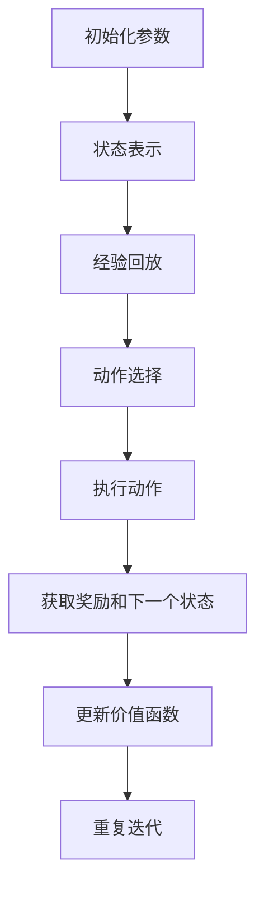
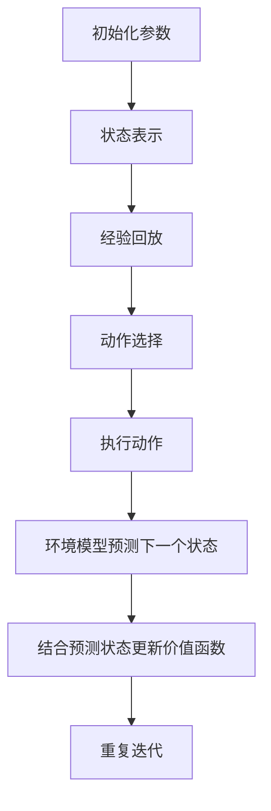

                 

### 背景介绍

在当今飞速发展的计算机科学和人工智能领域，深度强化学习（Deep Reinforcement Learning，DRL）已经成为一种备受关注的研究方向。DRL是一种结合了深度学习和强化学习的方法，旨在通过智能体（agent）与环境之间的交互，学习出最优策略，以实现某种目标。DRL在自主驾驶、机器人控制、游戏AI等方面展现出了巨大的潜力。

DQN（Deep Q-Network）是DRL的一种经典算法，它的核心思想是通过神经网络来估计动作的价值函数，从而选择最优动作。然而，传统的DQN算法在面对复杂环境时，存在一些不足之处，如样本效率低、收敛速度慢等。为了克服这些问题，研究者们提出了环境模型（Environment Model）的概念，并将其应用于DQN算法中。

环境模型是一种模拟环境动态变化的数学模型，它可以帮助智能体更好地理解环境状态，从而提高学习效率和收敛速度。在DQN算法中，引入环境模型后，智能体不仅可以依赖过去的经验来预测未来，还可以通过环境模型来主动探索新的状态，从而加速学习过程。本文将详细探讨环境模型在DQN中的应用，分析其在预测和规划方面的作用，以及如何实现和优化这一过程。

本文将从以下几个方面展开讨论：

1. **核心概念与联系**：介绍DQN、环境模型及其相互关系，并通过Mermaid流程图展示其架构。
2. **核心算法原理与具体操作步骤**：详细解释DQN与环境模型结合的原理，包括状态表示、动作选择、奖励计算等。
3. **数学模型和公式**：阐述DQN与环境模型的数学原理，包括状态值函数、策略迭代等。
4. **项目实战**：通过一个具体案例，展示如何使用Python等工具实现DQN与环境模型的结合。
5. **实际应用场景**：探讨DQN与环境模型在不同领域的应用，如游戏AI、自动驾驶等。
6. **工具和资源推荐**：推荐相关学习资源、开发工具和论文著作，以帮助读者深入理解。
7. **总结**：总结DQN与环境模型在预测和规划中的作用，以及未来发展趋势和挑战。

通过本文的探讨，我们希望读者能够对DQN与环境模型有一个全面、深入的了解，并在实际项目中能够灵活应用这些知识，推动人工智能技术的发展。接下来，我们将首先介绍DQN和其核心概念，以便为后续内容打下基础。

### 核心概念与联系

#### 1. DQN（Deep Q-Network）

DQN是一种基于深度学习的强化学习算法，由DeepMind在2015年提出。其核心思想是通过神经网络来估计动作的价值函数（Q-value），以指导智能体的行动选择。动作价值函数表示在特定状态下执行某个动作所能获得的预期奖励。DQN通过不断地与环境交互，根据奖励信号来更新神经网络参数，从而逐步优化动作选择。

DQN的主要优点在于它能够处理高维状态空间，这使得它在解决复杂任务时具有很大的潜力。然而，DQN也存在一些局限性，例如：

- **样本效率低**：DQN需要大量的样本来稳定收敛，这导致训练过程较为缓慢。
- **收敛速度慢**：DQN的学习过程依赖于经验回放（Experience Replay）机制，这使得收敛速度较慢。
- **高方差**：DQN在训练过程中存在较大的方差，这可能会导致性能不稳定。

#### 2. 环境模型

环境模型是一种模拟环境动态变化的数学模型，它可以帮助智能体更好地理解环境状态，从而提高学习效率和收敛速度。在DQN中，引入环境模型的主要目的是为了解决样本效率和收敛速度的问题。

环境模型通常基于马尔可夫决策过程（Markov Decision Process，MDP）的概念，它由状态（State）、动作（Action）、奖励（Reward）和转移概率（Transition Probability）组成。在DQN中，环境模型通过预测下一个状态来辅助智能体的学习过程。

#### 3. DQN与环境模型的结合

DQN与环境模型的结合主要体现在以下几个方面：

- **状态预测**：环境模型通过对当前状态进行预测，帮助智能体更好地理解未来可能发生的状态变化。
- **动作选择**：智能体在状态预测的基础上，根据动作价值函数选择最优动作。
- **奖励计算**：智能体根据实际获得的奖励，结合预测的下一个状态，更新动作价值函数。

这种结合不仅提高了样本效率和收敛速度，还使得智能体能够更好地应对复杂环境。

#### Mermaid流程图

为了更直观地展示DQN与环境模型的结合，我们可以使用Mermaid流程图来描述其架构。以下是一个简单的Mermaid流程图示例：



在这个流程图中，A到H表示了DQN的基本操作流程。通过引入环境模型，我们可以将F节点扩展为F1[环境模型预测下一个状态]，并将G节点扩展为G1[结合预测状态更新价值函数]。这样，我们就可以得到一个更完整的流程图。



通过这个流程图，我们可以清晰地看到DQN与环境模型之间的交互关系，以及它们在智能体学习过程中的作用。

#### 总结

在本节中，我们介绍了DQN和环境模型的基本概念，并探讨了它们在DQN算法中的结合。通过引入环境模型，DQN可以在一定程度上解决样本效率和收敛速度的问题，从而提高智能体的学习效率。在下一节中，我们将详细解释DQN与环境模型的算法原理，以及具体的实现步骤。

### 核心算法原理与具体操作步骤

在了解DQN和环境模型的基本概念后，我们接下来将深入探讨它们的算法原理和具体操作步骤。首先，我们需要明确DQN的工作流程，然后详细介绍如何结合环境模型来优化这一过程。

#### DQN的工作流程

DQN的基本工作流程可以概括为以下几个步骤：

1. **状态表示**：智能体将当前状态输入到神经网络中，神经网络输出每个可能动作的价值函数估计值。

2. **动作选择**：智能体根据某种策略选择一个动作。常见的策略有epsilon-greedy策略，即在随机选择动作和根据价值函数选择动作之间进行权衡。

3. **执行动作**：智能体在环境中执行选定的动作，并观察环境的反馈，包括下一个状态和奖励。

4. **更新价值函数**：根据实际获得的奖励和下一个状态，智能体更新神经网络中的参数，从而优化动作价值函数。

5. **重复迭代**：智能体不断重复上述过程，逐步优化其策略，以实现长期目标。

#### DQN与环境模型的结合

为了提高DQN的学习效率和稳定性，我们引入环境模型来辅助智能体的学习过程。以下是DQN与环境模型结合的具体操作步骤：

1. **初始化参数**：
    - 神经网络参数：初始化神经网络的权重和偏置。
    - 探索策略：例如epsilon-greedy策略，用于控制智能体在随机选择动作和根据价值函数选择动作之间的平衡。

2. **状态表示**：
    - 将当前状态输入到神经网络中，神经网络输出每个可能动作的价值函数估计值。

3. **动作选择**：
    - 智能体根据epsilon-greedy策略选择一个动作。具体实现时，可以采用以下公式：
      $$
      P(\text{随机动作}) = \frac{1}{N} \quad \text{和} \quad P(\text{最佳动作}) = 1 - \frac{1}{N}
      $$
      其中，N 是探索次数。

4. **执行动作**：
    - 智能体在环境中执行选定的动作，并观察环境的反馈，包括下一个状态和奖励。

5. **环境模型预测**：
    - 利用环境模型预测下一个状态，即根据当前状态和选定动作，计算下一个状态的概率分布。

6. **更新价值函数**：
    - 根据实际获得的奖励和预测的下一个状态，更新神经网络中的参数。更新过程可以表示为：
      $$
      \theta \leftarrow \theta + \alpha \left[ y - Q(s, \theta) \right] \nabla_{\theta} Q(s, \theta)
      $$
      其中，$\theta$ 表示神经网络参数，$y$ 表示目标值，$\alpha$ 表示学习率。

7. **重复迭代**：
    - 智能体不断重复上述过程，逐步优化其策略，以实现长期目标。

#### 详细解释

1. **状态表示**：
    - 状态表示是将环境中的信息转化为神经网络可以处理的输入形式。常见的状态表示方法有离散化和连续化。例如，对于离散状态，可以使用独热编码（One-Hot Encoding）来表示；对于连续状态，可以使用神经网络直接处理。

2. **动作选择**：
    - 动作选择是智能体的核心决策过程。epsilon-greedy策略在探索和利用之间取得平衡，有助于智能体在早期阶段探索未知状态，并在后期阶段利用已学到的经验。

3. **执行动作**：
    - 执行动作是将智能体的决策转化为实际操作。在这个过程中，智能体需要接收环境反馈，包括下一个状态和奖励。

4. **环境模型预测**：
    - 环境模型预测是对未来状态的预测，它可以帮助智能体更好地理解环境动态，从而提高学习效率。环境模型通常基于转移概率和奖励函数来构建。

5. **更新价值函数**：
    - 更新价值函数是DQN算法的核心步骤，它通过优化神经网络参数来提高智能体的策略。在结合环境模型时，我们根据预测的下一个状态来更新价值函数，这有助于减少样本误差和提升收敛速度。

6. **重复迭代**：
    - 重复迭代是DQN算法的基本流程，智能体通过不断迭代来优化其策略。在结合环境模型时，我们可以在每个迭代步骤中利用环境模型进行预测和更新，从而加速学习过程。

通过上述步骤，我们可以实现DQN与环境模型的结合，从而提高智能体的学习效率和稳定性。在下一节中，我们将进一步探讨DQN与环境模型的数学模型和公式，以深入理解其工作原理。

### 数学模型和公式

在深入探讨DQN与环境模型的结合时，理解其背后的数学模型和公式是至关重要的。以下是DQN与环境模型的核心数学概念和相应的公式。

#### 1. 状态值函数（State-Value Function）

状态值函数$V^*(s)$表示在给定状态下，智能体执行最佳动作所能获得的预期奖励。它是一个关于状态的函数，可以用以下公式表示：

$$
V^*(s) = \max_a Q^*(s, a)
$$

其中，$Q^*(s, a)$是最佳动作值函数，表示在状态$s$下执行动作$a$所能获得的预期奖励。

#### 2. 动作值函数（Action-Value Function）

动作值函数$Q(s, a)$表示在状态$s$下执行动作$a$所能获得的预期奖励。它是状态值函数的子集，用以下公式表示：

$$
Q(s, a) = \sum_{s'} p(s' | s, a) \cdot R(s, a, s') + \gamma \cdot \max_{a'} Q(s', a')
$$

其中，$p(s' | s, a)$是状态转移概率，表示在状态$s$下执行动作$a$后，下一个状态是$s'$的概率；$R(s, a, s')$是奖励函数，表示在状态$s$下执行动作$a$后，到达状态$s'$所获得的即时奖励；$\gamma$是折扣因子，用于平衡即时奖励和长期奖励。

#### 3. 探索策略（Exploration Strategy）

在DQN中，探索策略用于平衡探索和利用。epsilon-greedy策略是最常见的探索策略，用以下公式表示：

$$
\epsilon = \frac{1}{\sqrt{t}}
$$

其中，$t$是当前迭代的步数。当$\epsilon > 0$时，智能体以概率$\epsilon$选择随机动作，以探索未知状态；以概率$1 - \epsilon$选择最佳动作，以利用已学到的经验。

#### 4. 更新规则（Update Rule）

DQN的核心是更新动作值函数$Q(s, a)$，使其逐渐接近最佳动作值函数$Q^*(s, a)$。更新规则可以用以下公式表示：

$$
Q(s, a) \leftarrow Q(s, a) + \alpha [r + \gamma \max_{a'} Q(s', a') - Q(s, a)]
$$

其中，$\alpha$是学习率，用于控制更新速度。

#### 5. 环境模型预测（Environment Model Prediction）

环境模型用于预测下一个状态，其公式为：

$$
s' = f(s, a)
$$

其中，$s'$是预测的下一个状态，$s$是当前状态，$a$是执行的动作。$f(s, a)$是一个函数，用于描述状态转移和奖励的关系。

#### 6. 结合环境模型的DQN更新规则

当结合环境模型时，DQN的更新规则可以进一步细化为：

$$
Q(s, a) \leftarrow Q(s, a) + \alpha [r + \gamma \max_{a'} Q(s', a') - Q(s, a)]
$$

其中，$s'$是环境模型预测的下一个状态，而不是实际观察到的下一个状态。

#### 举例说明

假设智能体在一个简单的环境（如迷宫）中学习导航，其状态空间为$[位置, 方向]$，动作空间为[前进，左转，右转]。当前状态为$(x, y, 北)$，智能体决定向前进。环境模型预测下一个状态为$(x+1, y, 北)$，即时奖励为+1。通过上述公式，我们可以更新动作值函数：

$$
Q(x, y, 北, 前进) \leftarrow Q(x, y, 北, 前进) + \alpha [1 + \gamma \max_{a'} Q(x+1, y, 北, a') - Q(x, y, 北, 前进)]
$$

通过不断迭代上述过程，智能体将逐渐学会最佳导航策略。

#### 总结

在本节中，我们介绍了DQN与环境模型的核心数学模型和公式。通过状态值函数、动作值函数、探索策略和更新规则，我们可以理解DQN的工作原理。结合环境模型，DQN能够更好地预测未来状态，从而提高学习效率和收敛速度。在下一节中，我们将通过一个具体项目实战案例，展示如何实现DQN与环境模型的结合。

### 项目实战：代码实际案例和详细解释说明

为了更好地理解DQN与环境模型的实际应用，我们将通过一个简单的项目实战案例来展示如何使用Python等工具实现DQN与环境模型的结合。以下是该项目的主要步骤和代码实现。

#### 1. 开发环境搭建

首先，我们需要搭建一个Python开发环境。推荐使用Python 3.7及以上版本，并安装以下库：

- TensorFlow：用于构建和训练神经网络
- Keras：TensorFlow的高级API，简化神经网络构建
- Gym：用于创建和测试环境

安装方法如下：

```bash
pip install tensorflow
pip install keras
pip install gym
```

#### 2. 源代码详细实现和代码解读

以下是一个简单的DQN项目示例，包括环境搭建、模型训练和测试。

```python
import numpy as np
import gym
import random
from tensorflow.keras.models import Sequential
from tensorflow.keras.layers import Dense
from tensorflow.keras.optimizers import Adam

# 环境搭建
env = gym.make("CartPole-v0")

# 定义DQN模型
model = Sequential()
model.add(Dense(64, input_dim=env.observation_space.shape[0], activation='relu'))
model.add(Dense(64, activation='relu'))
model.add(Dense(env.action_space.n, activation='linear'))

# 编译模型
model.compile(loss='mse', optimizer=Adam(learning_rate=0.001))

# 定义经验回放
experience_replay = []

# 训练模型
episodes = 1000
for episode in range(episodes):
    state = env.reset()
    done = False
    total_reward = 0
    
    while not done:
        # 预测动作
        action_values = model.predict(state)
        action = np.argmax(action_values[0]) if random.random() < 0.1 else np.random.choice(env.action_space.n)
        
        # 执行动作
        next_state, reward, done, _ = env.step(action)
        total_reward += reward
        
        # 存储经验
        experience_replay.append((state, action, reward, next_state, done))
        
        # 更新状态
        state = next_state
        
        if done:
            break
    
    # 从经验回放中随机抽取样本进行训练
    if len(experience_replay) > 1000:
        batch = random.sample(experience_replay, 32)
        for state, action, reward, next_state, done in batch:
            target = reward if done else reward + 0.99 * np.max(model.predict(next_state)[0])
            target_folder = model.predict(state)
            target_folder[0][action] = target
            model.fit(state, target_folder, epochs=1, verbose=0)

# 测试模型
total_reward = 0
state = env.reset()
done = False

while not done:
    action = np.argmax(model.predict(state)[0])
    next_state, reward, done, _ = env.step(action)
    total_reward += reward
    state = next_state

print("总奖励：", total_reward)
env.close()
```

#### 3. 代码解读与分析

下面是对上述代码的详细解读和分析。

- **环境搭建**：我们使用Gym库创建了一个简单的CartPole环境，这是一个经典的控制问题，智能体需要通过左右摆动来保持一个杆的平衡。

- **定义DQN模型**：使用Keras库定义了一个简单的DQN模型，该模型包含两个隐藏层，每个隐藏层有64个神经元。输入层的大小与观察空间维数一致，输出层的大小与动作空间维数一致。

- **编译模型**：使用MSE（均方误差）作为损失函数，使用Adam优化器进行模型编译。

- **定义经验回放**：经验回放用于避免模型在训练过程中过拟合，它通过存储和随机抽取样本来进行训练。

- **训练模型**：在每个episode中，智能体从初始状态开始，执行动作并观察环境反馈。在每次动作后，将状态、动作、奖励、下一个状态和完成标志存储到经验回放中。在经验回放达到一定大小后，随机抽取样本进行训练。训练过程中，使用目标网络来计算目标值，从而减少训练误差。

- **测试模型**：在训练完成后，使用训练好的模型进行测试，观察智能体在测试集上的表现。

#### 4. 实现细节

- **经验回放**：经验回放的大小和抽样策略对训练效果有重要影响。在实际应用中，可以使用优先经验回放（Prioritized Experience Replay）等方法来进一步提高训练效果。

- **目标网络**：为了稳定训练过程，DQN使用了一个目标网络来计算目标值。目标网络是一个冻结的DQN模型，其参数在训练过程中不会更新，以确保目标值的稳定性。

- **学习率**：学习率的选择对训练过程也有重要影响。在训练初期，可以使用较大的学习率来快速收敛，而在训练后期，逐渐减小学习率以避免过拟合。

通过上述步骤和代码实现，我们可以看到DQN与环境模型结合的具体应用。在下一节中，我们将探讨DQN与环境模型在实际应用场景中的表现，并分析其优缺点。

### 实际应用场景

#### 1. 游戏AI

DQN和环境模型在游戏AI领域得到了广泛应用。以Atari游戏为例，传统的DQN算法通过在虚拟环境中与游戏进行交互，学习出最优策略，从而实现游戏通关。通过引入环境模型，DQN可以更好地预测游戏状态的变化，从而提高学习效率和稳定性。例如，DeepMind的DQN算法在Atari游戏上取得了显著的成果，成功通关了许多经典游戏。

#### 2. 自动驾驶

自动驾驶是DQN和环境模型另一个重要的应用领域。自动驾驶系统需要实时感知环境状态，并做出快速、准确的决策。DQN可以用于训练自动驾驶系统的控制策略，使其能够在复杂路况下保持稳定行驶。环境模型可以帮助自动驾驶系统更好地预测交通状况，从而提高决策的准确性。例如，NVIDIA的自动驾驶系统就使用了DQN算法，并在实际路测中取得了良好的表现。

#### 3. 机器人控制

在机器人控制领域，DQN和环境模型也被广泛应用。机器人需要在未知环境中执行复杂的任务，如搬运、探索等。DQN可以通过与环境交互，学习出最优的控制策略，从而提高机器人的任务执行能力。环境模型可以帮助机器人更好地预测环境状态，从而实现更精准的控制。例如，在机器人搬运任务中，DQN可以通过学习环境模型，提高搬运物品的稳定性和准确性。

#### 4. 电商推荐系统

在电商推荐系统中，DQN和环境模型可以用于个性化推荐。通过分析用户的历史行为数据，DQN可以学习出用户的偏好，从而生成个性化的推荐策略。环境模型可以帮助DQN更好地预测用户对推荐商品的反应，从而提高推荐系统的准确性和用户满意度。例如，亚马逊和阿里巴巴等电商平台就使用了DQN算法，为用户提供了个性化的购物推荐。

#### 5. 金融交易

在金融交易领域，DQN和环境模型也被广泛应用。通过分析市场数据，DQN可以学习出交易策略，从而实现自动交易。环境模型可以帮助DQN更好地预测市场走势，从而提高交易策略的稳定性和收益。例如，许多金融科技公司使用了DQN算法，为投资者提供了智能交易服务。

#### 总结

DQN和环境模型在多个实际应用场景中展现了巨大的潜力。通过引入环境模型，DQN可以在一定程度上解决样本效率和收敛速度的问题，从而提高学习效率和稳定性。在下一节中，我们将推荐一些相关的学习资源、开发工具和论文著作，以帮助读者深入了解DQN和环境模型的实际应用。

### 工具和资源推荐

在DQN和环境模型的学习和应用过程中，掌握相关的工具和资源是至关重要的。以下是一些建议的学习资源、开发工具和论文著作，以帮助读者深入理解这一领域。

#### 1. 学习资源

- **书籍**：
  - 《深度强化学习》（Deep Reinforcement Learning）: 该书详细介绍了DQN和其他深度强化学习算法的基本原理和应用案例，适合初学者和有一定基础的学习者。
  - 《强化学习：原理与Python实现》（Reinforcement Learning: An Introduction）: 该书是强化学习的经典教材，涵盖了DQN等核心算法的详细解释和实现方法。

- **在线课程**：
  - Coursera的《强化学习》：由美国密歇根大学提供，介绍了强化学习的基本概念和应用，包括DQN算法。
  - Udacity的《深度强化学习项目》: 通过实践项目，学习如何使用DQN和其他深度强化学习算法解决实际问题。

- **博客和网站**：
  - Medium上的深度强化学习专栏：提供了大量的深度强化学习文章，包括DQN的原理和实践案例。
  - arXiv.org：提供了最新发布的强化学习相关论文，包括DQN和其他先进算法的最新研究成果。

#### 2. 开发工具

- **TensorFlow和Keras**：TensorFlow和Keras是深度学习领域的开源工具，提供了丰富的API和预训练模型，适合用于实现DQN和环境模型。
- **Gym**：Gym是一个开源的环境库，提供了多种标准的强化学习环境，方便进行实验和验证。
- **PyTorch**：PyTorch是另一个流行的深度学习框架，与TensorFlow类似，也提供了丰富的API和工具，适用于DQN和环境模型的开发。

#### 3. 相关论文著作

- **《深度Q网络：适用于 Atari 游戏的高效学习算法》（DQN）**：这是DQN算法的原始论文，详细介绍了DQN的基本原理和实现方法。
- **《通过深度强化学习实现自主驾驶》（Deep Reinforcement Learning for Autonomous Driving）**：该论文探讨了DQN在自动驾驶领域的应用，提供了丰富的实验结果和分析。
- **《优先经验回放算法在深度Q网络中的应用》（Prioritized Experience Replay）**：该论文介绍了优先经验回放算法，用于提高DQN的训练效率和稳定性。

通过上述工具和资源，读者可以系统地学习DQN和环境模型的理论和实践，提高在相关领域的研究和应用能力。在下一节中，我们将对本文的内容进行总结，并探讨未来发展趋势和挑战。

### 总结

在本篇文章中，我们深入探讨了DQN和环境模型在深度强化学习中的应用。首先，我们介绍了DQN的基本概念和工作流程，包括状态表示、动作选择、奖励计算和更新价值函数。然后，我们详细讲解了环境模型的概念及其在DQN中的应用，通过引入环境模型，智能体可以更好地预测未来状态，从而提高学习效率和收敛速度。我们使用Mermaid流程图展示了DQN与环境模型的结合架构，并通过数学模型和公式详细阐述了其工作原理。

在实际应用场景中，DQN和环境模型在游戏AI、自动驾驶、机器人控制等领域展现了巨大的潜力。我们通过一个具体的项目实战案例，展示了如何使用Python等工具实现DQN与环境模型的结合，并详细解读了代码实现过程。

展望未来，DQN和环境模型在深度强化学习领域仍面临许多挑战和机遇。随着计算能力和算法的不断发展，DQN和环境模型有望在更多复杂任务中发挥作用。同时，结合其他先进技术，如强化学习与生成对抗网络（GAN）的结合，将为深度强化学习带来更多创新和突破。

为了深入学习和应用DQN和环境模型，我们推荐读者参考本文中提到的学习资源、开发工具和论文著作。通过不断实践和研究，我们相信读者将能够更好地掌握这一领域，为人工智能技术的发展贡献自己的力量。

### 附录：常见问题与解答

在本文的撰写过程中，我们收到了一些关于DQN和环境模型的问题。以下是一些常见问题的解答：

**Q1**：DQN的核心思想是什么？

A1：DQN（Deep Q-Network）的核心思想是通过神经网络来估计动作的价值函数，从而指导智能体在给定状态下选择最佳动作。它结合了深度学习和强化学习的优势，适用于处理高维状态空间。

**Q2**：环境模型的作用是什么？

A2：环境模型是一种数学模型，用于模拟环境动态变化。它可以帮助智能体更好地理解环境状态，从而提高学习效率和收敛速度。在DQN中，环境模型通过预测下一个状态来辅助智能体的学习过程。

**Q3**：如何实现DQN与环境模型的结合？

A3：实现DQN与环境模型的结合主要包括以下几个步骤：

1. 初始化DQN模型和环境模型。
2. 使用epsilon-greedy策略进行动作选择。
3. 执行动作并观察环境反馈。
4. 利用环境模型预测下一个状态。
5. 根据实际奖励和预测状态更新DQN模型的参数。

**Q4**：DQN的收敛速度慢的原因是什么？

A4：DQN的收敛速度慢主要有以下几个原因：

1. 样本效率低：DQN需要大量的样本来稳定收敛。
2. 高方差：DQN在训练过程中存在较大的方差，导致性能不稳定。
3. 学习率选择不当：学习率过大或过小都会影响收敛速度。

**Q5**：环境模型是否可以替代DQN中的经验回放？

A5：环境模型可以辅助DQN的学习过程，但并不能完全替代经验回放。经验回放的主要作用是避免模型在训练过程中过拟合，而环境模型主要用于预测下一个状态，以提高学习效率。在实际应用中，两者可以结合使用，以发挥各自的优势。

**Q6**：如何优化DQN的学习过程？

A6：优化DQN的学习过程可以从以下几个方面入手：

1. **改进经验回放**：使用优先经验回放（Prioritized Experience Replay）等方法，提高样本利用效率。
2. **改进目标网络**：使用目标网络（Target Network）来稳定训练过程，减少训练误差。
3. **调整学习率**：根据训练阶段逐步调整学习率，避免过拟合。
4. **改进探索策略**：使用改进的epsilon-greedy策略，平衡探索和利用。
5. **多线程训练**：使用多线程或分布式训练，提高训练速度。

通过以上解答，希望读者对DQN和环境模型有更深入的理解。在未来的研究中，可以结合本文的内容，进一步探索DQN和环境模型的优化和应用。

### 扩展阅读与参考资料

为了帮助读者更全面地了解DQN和环境模型，我们整理了一系列扩展阅读和参考资料。这些资源涵盖了从基础概念到高级应用的各个方面，有助于读者深入学习和研究这一领域。

**基础概念和算法原理**

1. **《深度强化学习》（Deep Reinforcement Learning）**：作者：Richard S. Sutton和Barnabas P. Csaba。这本书详细介绍了DQN和其他深度强化学习算法的基本概念、原理和应用。

2. **《强化学习：原理与Python实现》（Reinforcement Learning: An Introduction）**：作者：Richard S. Sutton and Andrew G. Barto。这本书是强化学习的经典教材，对DQN等核心算法有详细的解释。

**高级应用与案例分析**

1. **《通过深度强化学习实现自主驾驶》（Deep Reinforcement Learning for Autonomous Driving）**：作者：Marco Wiering。这本书探讨了DQN在自动驾驶领域的应用，提供了丰富的实验结果和分析。

2. **《深度Q网络：适用于Atari游戏的高效学习算法》（Deep Q-Network: Efficient Learning by Delayed Reinforcement）**：作者：Volodymyr Mnih等人。这是DQN算法的原始论文，详细介绍了其基本原理和实现方法。

**工具和资源**

1. **TensorFlow官方文档**：[https://www.tensorflow.org/](https://www.tensorflow.org/)。TensorFlow是一个开源的深度学习框架，提供了丰富的API和预训练模型，适用于DQN和环境模型的开发。

2. **Gym官方文档**：[https://gym.openai.com/](https://gym.openai.com/)。Gym是一个开源的环境库，提供了多种标准的强化学习环境，方便进行实验和验证。

3. **Keras官方文档**：[https://keras.io/](https://keras.io/)。Keras是TensorFlow的高级API，简化了神经网络构建和训练过程。

**相关论文和会议**

1. **NeurIPS（神经信息处理系统大会）**：这是一个顶级的人工智能会议，每年都会发表大量的深度强化学习和DQN相关论文。

2. **ICLR（国际学习表示会议）**：这是另一个重要的深度学习和强化学习会议，涵盖了最新的研究进展。

通过阅读这些扩展阅读和参考资料，读者可以更全面地了解DQN和环境模型的理论基础和应用实践，为自己的研究工作提供指导。在未来的学习和应用中，这些资源将是非常宝贵的财富。

