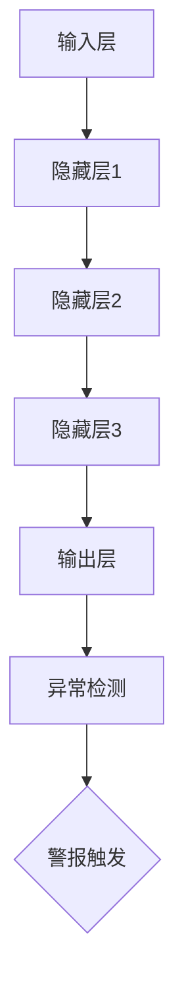

                 

### 背景介绍

在当今的信息化时代，数据已经成为企业和组织的重要资产。而金融行业，作为数据的重灾区，面临着日益严峻的欺诈风险。据统计，全球每年因金融欺诈所造成的损失高达数百亿美元。面对如此庞大的数字，传统的手工审核和规则检测方法已显得力不从心。此时，人工智能，特别是神经网络技术的出现，为金融欺诈检测带来了新的曙光。

神经网络作为一种模仿人脑结构和功能的计算模型，已经在图像识别、自然语言处理等领域取得了显著成果。近年来，随着深度学习算法的发展，神经网络在金融欺诈检测中的应用也逐渐受到关注。本文将围绕神经网络在金融欺诈检测中的应用展开讨论，旨在为广大读者提供一个全面、系统的了解。

首先，我们将探讨金融欺诈的基本概念和分类，为后续讨论神经网络在金融欺诈检测中的应用打下基础。接着，我们将介绍神经网络的基本原理，以及如何将神经网络应用于金融欺诈检测中。随后，我们将详细讨论几种常见的神经网络模型及其在金融欺诈检测中的表现。在此基础上，我们将结合具体案例，展示神经网络在金融欺诈检测中的实际应用。

在文章的后半部分，我们将深入探讨神经网络在金融欺诈检测中面临的挑战和局限性，并提出相应的解决方案。最后，我们将总结神经网络在金融欺诈检测中的发展趋势，以及未来的研究方向。

通过本文的阅读，读者将能够对神经网络在金融欺诈检测中的应用有一个全面、深入的理解，为实际工作提供有益的参考。让我们一步一步地深入探讨这个话题。### 核心概念与联系

#### 金融欺诈的基本概念和分类

金融欺诈是指利用金融系统的漏洞，通过欺诈手段非法获取财产的行为。根据手段和方式的不同，金融欺诈可以分为多种类型，包括：

1. **诈骗**：通过虚假陈述或隐瞒真相，欺骗受害者转移财产。例如，假冒银行客服骗取个人信息，或通过虚假投资承诺诱导投资者上当。
2. **洗钱**：将非法所得的资金通过一系列复杂的金融交易，转化为看似合法的资金。洗钱通常包括三个阶段：放入、分层和归集，目的是掩盖资金的非法来源。
3. **账户接管**：未经授权获取他人账户，进行非法交易。例如，黑客通过窃取用户密码，非法访问其银行账户并进行资金转移。
4. **恶意欺诈**：通过恶意软件或网络钓鱼等方式，窃取用户资金或信息。例如，通过伪造的银行网站诱导用户输入账号密码。

金融欺诈的危害性巨大，不仅损害了受害者的财产，还影响了整个金融市场的稳定。因此，有效的金融欺诈检测对于保障金融安全至关重要。

#### 神经网络的基本原理

神经网络（Neural Network，NN）是一种模仿生物神经系统的计算模型，由大量的神经元（或节点）通过连接（或边）组成。每个神经元都可以接收多个输入信号，并通过加权求和处理后输出一个信号。神经网络通过不断调整连接权重，使得模型能够学习到输入和输出之间的关系，从而实现对数据的分类、回归等任务。

神经网络的基本结构包括：

- **输入层**：接收外部输入数据。
- **隐藏层**：对输入数据进行加工处理，提取特征。
- **输出层**：根据隐藏层的输出，生成最终结果。

神经网络的训练过程主要包括：

1. **初始化权重**：随机初始化网络中的连接权重。
2. **前向传播**：将输入数据通过网络，计算输出结果。
3. **损失函数**：计算输出结果与真实值之间的差距，作为模型性能的指标。
4. **反向传播**：根据损失函数，调整网络中的连接权重，使得输出结果更接近真实值。
5. **迭代优化**：重复执行前向传播和反向传播，直到网络性能达到预设的标准。

#### 神经网络在金融欺诈检测中的应用

神经网络在金融欺诈检测中的应用主要体现在以下几个方面：

1. **异常检测**：通过对大量正常交易数据的训练，神经网络可以学会识别出异常交易。当检测到异常交易时，系统会自动发出警报。
2. **模式识别**：神经网络可以提取交易数据中的潜在特征，从而识别出具有欺诈嫌疑的交易模式。
3. **实时监控**：神经网络可以实时分析交易数据，对潜在欺诈行为进行实时监控和预警。

#### 神经网络在金融欺诈检测中的优势

神经网络在金融欺诈检测中的优势主要体现在以下几个方面：

1. **自适应性强**：神经网络可以通过不断学习和调整，适应不同的欺诈手段和环境。
2. **处理复杂数据**：神经网络可以处理大规模、多维度的交易数据，从而提取出更准确的欺诈特征。
3. **实时性**：神经网络可以实时分析交易数据，对潜在欺诈行为进行实时监控和预警。

下面是一个简化的神经网络在金融欺诈检测中的架构图：



在这个架构中，输入层接收交易数据，隐藏层对数据进行特征提取和加工，输出层生成最终的检测结果。异常检测模块对检测结果进行进一步分析，触发警报。

通过以上对核心概念和联系的介绍，我们为后续内容的展开奠定了基础。在接下来的章节中，我们将深入探讨神经网络在金融欺诈检测中的具体应用和实现。### 核心算法原理 & 具体操作步骤

#### 1. 算法原理

神经网络在金融欺诈检测中的核心算法主要基于深度学习，特别是卷积神经网络（Convolutional Neural Networks, CNN）和循环神经网络（Recurrent Neural Networks, RNN）。CNN擅长处理图像和空间数据，而RNN则擅长处理序列数据。以下是这两种神经网络的基本原理和具体操作步骤。

##### 卷积神经网络（CNN）

CNN是一种在图像识别和分类中广泛应用的神经网络模型。其基本原理是通过卷积层、池化层和全连接层等结构，对图像数据进行特征提取和分类。

1. **卷积层**：卷积层通过卷积运算提取图像的特征。卷积运算是指用一个小的过滤器（卷积核）在图像上滑动，计算每个位置的特征值。这些特征值通过加权和偏置后，生成一个新的特征图。
2. **池化层**：池化层用于降低特征图的维度，减少计算量和过拟合的风险。常见的池化方法包括最大值池化和平均值池化。
3. **全连接层**：全连接层将卷积层和池化层提取的特征进行聚合，生成最终的分类结果。

##### 循环神经网络（RNN）

RNN是一种用于处理序列数据的神经网络模型，其基本原理是通过循环结构，对序列数据进行递归处理，从而捕捉序列中的时间依赖关系。

1. **隐藏层**：RNN的隐藏层包含一个循环单元，用于存储前一个时间步的输入和隐藏状态。
2. **门控单元**：门控单元（如遗忘门和输入门）用于控制信息的流动，使得RNN能够更好地适应序列中的变化。
3. **前向传播**：在RNN中，每个时间步的输入都会通过隐藏层和门控单元进行处理，生成当前时间步的输出。

#### 2. 具体操作步骤

以下是一个基于CNN和RNN的金融欺诈检测系统的具体操作步骤：

1. **数据预处理**：
   - 收集大量的交易数据，包括正常交易和欺诈交易。
   - 对交易数据进行清洗、归一化处理，去除噪声和异常值。
   - 将交易数据分为特征和标签两部分，特征用于输入神经网络，标签用于监督学习。

2. **模型构建**：
   - 基于CNN，构建多个卷积层和池化层，用于提取图像数据中的低级特征。
   - 基于RNN，构建一个循环层，用于处理序列数据中的高级特征。
   - 将CNN和RNN的输出连接到全连接层，用于生成最终的分类结果。

3. **模型训练**：
   - 使用大量的正常交易和欺诈交易数据，对模型进行训练。
   - 通过反向传播算法，不断调整模型中的连接权重，使得模型的预测结果更接近真实值。
   - 使用交叉熵损失函数，评估模型的分类性能。

4. **模型评估**：
   - 使用测试集对模型进行评估，计算模型的准确率、召回率、F1值等指标。
   - 调整模型参数，优化模型性能。

5. **模型部署**：
   - 将训练好的模型部署到实际环境中，对实时交易数据进行实时监控和预警。
   - 当检测到潜在欺诈交易时，自动触发警报，通知相关人员。

#### 3. 模型优化与调参

在金融欺诈检测中，模型的性能受到多种因素的影响，包括网络结构、参数设置、训练数据等。以下是一些常见的模型优化和调参方法：

1. **网络结构调整**：
   - 增加卷积层和池化层的数量，提高模型的特征提取能力。
   - 使用不同的卷积核尺寸，捕捉不同层次的特征。
   - 增加RNN的隐藏层单元数量，提高序列建模能力。

2. **参数设置**：
   - 优化学习率，使用自适应学习率算法（如Adam）。
   - 调整正则化参数，防止过拟合。
   - 调整dropout比例，减少过拟合。

3. **训练数据增强**：
   - 对训练数据集进行数据增强，增加数据的多样性。
   - 使用生成对抗网络（GAN），生成更多的高质量训练数据。

4. **模型融合**：
   - 结合多种神经网络模型，提高模型的预测性能。
   - 使用集成学习（如投票法、堆叠法）融合多个模型的预测结果。

通过以上步骤，我们可以构建一个基于神经网络的高效金融欺诈检测系统，为金融机构提供强有力的支持。在接下来的章节中，我们将通过具体案例，展示神经网络在金融欺诈检测中的实际应用。### 数学模型和公式 & 详细讲解 & 举例说明

#### 数学模型

神经网络在金融欺诈检测中的核心在于其能够通过学习数据，自动提取特征并生成预测。这一过程涉及多个数学模型和公式，包括损失函数、激活函数、反向传播算法等。

##### 1. 损失函数

损失函数用于衡量模型的预测结果与真实结果之间的差距，是优化模型的重要依据。在二分类问题中，常用的损失函数是交叉熵损失函数（Cross-Entropy Loss）。

$$
L(y, \hat{y}) = -\sum_{i=1}^{n} y_i \log(\hat{y}_i)
$$

其中，$y$是真实标签，$\hat{y}$是模型的预测概率。交叉熵损失函数的值越小，表示模型的预测结果越接近真实结果。

##### 2. 激活函数

激活函数用于引入非线性因素，使得神经网络能够处理复杂的非线性问题。在金融欺诈检测中，常用的激活函数包括sigmoid函数和ReLU函数。

- **sigmoid函数**：

$$
\sigma(x) = \frac{1}{1 + e^{-x}}
$$

sigmoid函数将输入映射到$(0, 1)$区间，常用于二分类问题的输出层。

- **ReLU函数**：

$$
\text{ReLU}(x) = \max(0, x)
$$

ReLU函数在输入为正时输出输入值，在输入为负时输出0，常用于隐藏层。

##### 3. 反向传播算法

反向传播算法是神经网络训练的核心，用于更新网络中的连接权重，使得预测结果更接近真实结果。反向传播算法分为以下几个步骤：

1. **前向传播**：计算输入数据的输出结果，并计算损失函数。

2. **计算梯度**：根据损失函数对网络参数求导，计算每个参数的梯度。

3. **权重更新**：根据梯度，使用优化算法（如梯度下降）更新网络参数。

4. **迭代优化**：重复执行前向传播和反向传播，直到网络性能达到预设的标准。

反向传播算法的数学表达式如下：

$$
\frac{\partial L}{\partial w} = \frac{\partial L}{\partial \hat{y}} \frac{\partial \hat{y}}{\partial z} \frac{\partial z}{\partial w}
$$

其中，$L$是损失函数，$w$是连接权重，$\hat{y}$是输出结果，$z$是激活函数的输入。

#### 举例说明

假设我们使用一个简单的神经网络进行金融欺诈检测，输入层有3个特征，隐藏层有2个神经元，输出层有1个神经元。输入数据为$x_1=2, x_2=3, x_3=4$，真实标签为$y=1$。

1. **前向传播**：

输入层到隐藏层的权重为$w_1, w_2, w_3$，偏置为$b_1$，隐藏层到输出层的权重为$w_4, w_5$，偏置为$b_2$。

$$
z_1 = w_1 x_1 + w_2 x_2 + w_3 x_3 + b_1 \\
z_2 = w_4 x_1 + w_5 x_2 + b_2
$$

激活函数使用ReLU函数：

$$
a_1 = \text{ReLU}(z_1) \\
a_2 = \text{ReLU}(z_2)
$$

输出层使用sigmoid函数：

$$
\hat{y} = \frac{1}{1 + e^{-(w_4 a_1 + w_5 a_2 + b_2)}}
$$

2. **计算损失函数**：

使用交叉熵损失函数：

$$
L = -y \log(\hat{y}) - (1 - y) \log(1 - \hat{y})
$$

3. **计算梯度**：

根据反向传播算法，计算每个参数的梯度：

$$
\frac{\partial L}{\partial w_1} = \frac{\partial L}{\partial \hat{y}} \frac{\partial \hat{y}}{\partial a_2} \frac{\partial a_2}{\partial z_2} \frac{\partial z_2}{\partial w_1} \\
\frac{\partial L}{\partial w_2} = \frac{\partial L}{\partial \hat{y}} \frac{\partial \hat{y}}{\partial a_2} \frac{\partial a_2}{\partial z_2} \frac{\partial z_2}{\partial w_2} \\
\frac{\partial L}{\partial w_3} = \frac{\partial L}{\partial \hat{y}} \frac{\partial \hat{y}}{\partial a_2} \frac{\partial a_2}{\partial z_2} \frac{\partial z_2}{\partial w_3} \\
\frac{\partial L}{\partial w_4} = \frac{\partial L}{\partial \hat{y}} \frac{\partial \hat{y}}{\partial a_1} \frac{\partial a_1}{\partial z_1} \frac{\partial z_1}{\partial w_4} \\
\frac{\partial L}{\partial w_5} = \frac{\partial L}{\partial \hat{y}} \frac{\partial \hat{y}}{\partial a_1} \frac{\partial a_1}{\partial z_1} \frac{\partial z_1}{\partial w_5} \\
\frac{\partial L}{\partial b_1} = \frac{\partial L}{\partial \hat{y}} \frac{\partial \hat{y}}{\partial a_1} \frac{\partial a_1}{\partial z_1} \\
\frac{\partial L}{\partial b_2} = \frac{\partial L}{\partial \hat{y}} \frac{\partial \hat{y}}{\partial a_2} \frac{\partial a_2}{\partial z_2}
$$

4. **权重更新**：

使用梯度下降算法更新权重：

$$
w_1 \leftarrow w_1 - \alpha \frac{\partial L}{\partial w_1} \\
w_2 \leftarrow w_2 - \alpha \frac{\partial L}{\partial w_2} \\
w_3 \leftarrow w_3 - \alpha \frac{\partial L}{\partial w_3} \\
w_4 \leftarrow w_4 - \alpha \frac{\partial L}{\partial w_4} \\
w_5 \leftarrow w_5 - \alpha \frac{\partial L}{\partial w_5} \\
b_1 \leftarrow b_1 - \alpha \frac{\partial L}{\partial b_1} \\
b_2 \leftarrow b_2 - \alpha \frac{\partial L}{\partial b_2}
$$

其中，$\alpha$是学习率。

通过以上步骤，神经网络可以不断调整权重，使得预测结果更接近真实结果。在金融欺诈检测中，这个过程可以重复进行多次，以获得一个性能良好的模型。在接下来的章节中，我们将通过实际案例，展示神经网络在金融欺诈检测中的应用。### 项目实战：代码实际案例和详细解释说明

在本节中，我们将通过一个实际案例，详细展示如何使用神经网络进行金融欺诈检测。该案例将分为以下几个部分：开发环境搭建、源代码实现、代码解读与分析。

#### 1. 开发环境搭建

在进行金融欺诈检测的项目之前，我们需要搭建一个合适的开发环境。以下是我们推荐的工具和框架：

- **Python**：作为主要的编程语言，Python拥有丰富的机器学习和深度学习库。
- **TensorFlow**：一个广泛使用的深度学习框架，支持多种神经网络模型。
- **Keras**：一个基于TensorFlow的高层API，使得神经网络构建更加简洁和直观。
- **Pandas**：用于数据处理和清洗。
- **Scikit-learn**：用于数据预处理和模型评估。

以下是搭建开发环境的基本步骤：

1. **安装Python**：下载并安装Python 3.7及以上版本。
2. **安装TensorFlow**：在命令行中执行`pip install tensorflow`。
3. **安装Keras**：在命令行中执行`pip install keras`。
4. **安装Pandas**：在命令行中执行`pip install pandas`。
5. **安装Scikit-learn**：在命令行中执行`pip install scikit-learn`。

#### 2. 源代码实现

以下是一个简化的金融欺诈检测项目的源代码实现：

```python
import numpy as np
import pandas as pd
from tensorflow.keras.models import Sequential
from tensorflow.keras.layers import Dense, Conv1D, MaxPooling1D, Flatten
from tensorflow.keras.optimizers import Adam
from sklearn.model_selection import train_test_split
from sklearn.preprocessing import StandardScaler

# 加载数据
data = pd.read_csv('fraud_data.csv')
X = data.iloc[:, :-1].values
y = data.iloc[:, -1].values

# 数据预处理
X_train, X_test, y_train, y_test = train_test_split(X, y, test_size=0.2, random_state=42)
scaler = StandardScaler()
X_train = scaler.fit_transform(X_train)
X_test = scaler.transform(X_test)

# 构建模型
model = Sequential()
model.add(Conv1D(filters=64, kernel_size=3, activation='relu', input_shape=(X_train.shape[1], 1)))
model.add(MaxPooling1D(pool_size=2))
model.add(Flatten())
model.add(Dense(64, activation='relu'))
model.add(Dense(1, activation='sigmoid'))

# 编译模型
model.compile(optimizer=Adam(learning_rate=0.001), loss='binary_crossentropy', metrics=['accuracy'])

# 训练模型
model.fit(X_train, y_train, epochs=10, batch_size=32, validation_data=(X_test, y_test))

# 评估模型
loss, accuracy = model.evaluate(X_test, y_test)
print(f"Test accuracy: {accuracy:.2f}")

# 预测
predictions = model.predict(X_test)
predictions = (predictions > 0.5)

# 评估预测结果
from sklearn.metrics import classification_report, confusion_matrix
print(classification_report(y_test, predictions))
print(confusion_matrix(y_test, predictions))
```

#### 3. 代码解读与分析

以下是代码的详细解读：

1. **数据加载与预处理**：

   ```python
   data = pd.read_csv('fraud_data.csv')
   X = data.iloc[:, :-1].values
   y = data.iloc[:, -1].values
   ```

   首先，我们使用Pandas加载CSV格式的数据。数据集包含特征和标签两部分，其中特征是交易数据，标签是欺诈标记。

   ```python
   X_train, X_test, y_train, y_test = train_test_split(X, y, test_size=0.2, random_state=42)
   scaler = StandardScaler()
   X_train = scaler.fit_transform(X_train)
   X_test = scaler.transform(X_test)
   ```

   接下来，我们使用Scikit-learn将数据集分为训练集和测试集，并使用StandardScaler对特征进行归一化处理。

2. **模型构建**：

   ```python
   model = Sequential()
   model.add(Conv1D(filters=64, kernel_size=3, activation='relu', input_shape=(X_train.shape[1], 1)))
   model.add(MaxPooling1D(pool_size=2))
   model.add(Flatten())
   model.add(Dense(64, activation='relu'))
   model.add(Dense(1, activation='sigmoid'))
   ```

   在这一部分，我们使用Keras构建了一个简单的卷积神经网络。网络包括一个卷积层、一个最大池化层、一个平坦层、一个全连接层和一个sigmoid激活函数。

3. **模型编译**：

   ```python
   model.compile(optimizer=Adam(learning_rate=0.001), loss='binary_crossentropy', metrics=['accuracy'])
   ```

   我们使用Adam优化器进行模型编译，并设置损失函数为binary_crossentropy，评估指标为accuracy。

4. **模型训练**：

   ```python
   model.fit(X_train, y_train, epochs=10, batch_size=32, validation_data=(X_test, y_test))
   ```

   使用训练集对模型进行训练，设置10个epochs和32个batch_size。

5. **模型评估**：

   ```python
   loss, accuracy = model.evaluate(X_test, y_test)
   print(f"Test accuracy: {accuracy:.2f}")
   ```

   使用测试集评估模型性能，并输出准确率。

6. **预测**：

   ```python
   predictions = model.predict(X_test)
   predictions = (predictions > 0.5)
   ```

   对测试集进行预测，并将阈值设置为0.5。

7. **评估预测结果**：

   ```python
   from sklearn.metrics import classification_report, confusion_matrix
   print(classification_report(y_test, predictions))
   print(confusion_matrix(y_test, predictions))
   ```

   使用Scikit-learn的classification_report和confusion_matrix评估预测结果。

通过以上步骤，我们成功实现了一个基于神经网络的金融欺诈检测系统。这个系统可以识别出潜在欺诈交易，并输出详细的评估报告。在实际应用中，我们可以进一步优化模型，提高其性能和鲁棒性。### 实际应用场景

神经网络在金融欺诈检测中的应用场景非常广泛，以下列举几个典型的应用实例：

#### 1. 银行交易欺诈检测

银行交易欺诈检测是神经网络应用最为广泛的一个领域。通过训练大量的交易数据，神经网络可以学会识别出正常的交易模式和异常的交易行为。例如，当检测到一个交易金额异常大、频率异常高或地理位置异常的交易时，系统会自动发出警报。这种实时监控机制可以有效减少欺诈损失，提高客户满意度。

#### 2. 信用卡欺诈检测

信用卡欺诈检测是另一个重要的应用场景。信用卡交易频繁且具有高度的时间序列特性，神经网络可以很好地处理这些复杂的特征。通过分析信用卡交易的历史数据，神经网络可以识别出潜在的欺诈交易，并在交易发生时立即发出警报。这种方法不仅提高了欺诈检测的准确率，还减少了误报率，降低了运营成本。

#### 3. 股票市场异常交易监控

股票市场的异常交易监控也是一个典型的应用场景。通过分析股票市场的交易数据，神经网络可以识别出异常交易行为，如内幕交易、市场操纵等。这些异常交易行为对于市场稳定性和公平性具有很大的影响，因此及时检测和预警异常交易对于保护投资者利益和维护市场秩序具有重要意义。

#### 4. 保险欺诈检测

保险欺诈检测是保险行业面临的一个严峻问题。通过训练大量的保险理赔数据，神经网络可以识别出欺诈理赔行为，如虚假索赔、夸大损失等。这种方法可以帮助保险公司减少欺诈损失，提高理赔效率，同时增强客户信任。

#### 5. 借贷风险评估

在借贷业务中，神经网络可以用于评估借款人的信用风险。通过分析借款人的历史信用数据、财务状况、社交行为等特征，神经网络可以预测借款人是否会出现逾期或违约行为。这种风险评估方法有助于金融机构更好地管理风险，降低不良贷款率。

#### 6. 数字货币交易监控

随着数字货币市场的兴起，数字货币交易监控也成为神经网络的一个重要应用场景。通过分析数字货币的交易数据，神经网络可以识别出潜在的洗钱行为和市场操纵行为。这种监控机制有助于保护数字货币市场的稳定和安全。

总之，神经网络在金融欺诈检测中的应用不仅提高了检测的准确性和实时性，还降低了运营成本。随着技术的不断发展，神经网络在金融领域的应用前景将更加广阔。### 工具和资源推荐

为了更好地学习神经网络在金融欺诈检测中的应用，以下是一些建议的资源和工具：

#### 1. 学习资源推荐

**书籍**：

- **《深度学习》（Deep Learning）**：由Ian Goodfellow、Yoshua Bengio和Aaron Courville所著，是深度学习的经典教材，详细介绍了神经网络的理论和实现。
- **《神经网络与深度学习》**：李航所著，涵盖了神经网络的基本概念、算法实现和应用案例，非常适合初学者。

**论文**：

- **《A Theoretically Grounded Application of Dropout in Recurrent Neural Networks》**：该论文提出了一种在RNN中应用Dropout的方法，有效提高了模型的泛化能力。
- **《Deep Learning for Fraud Detection》**：该论文讨论了深度学习在欺诈检测中的应用，提供了一些实用的方法和案例。

**博客和网站**：

- **TensorFlow官方文档**：[https://www.tensorflow.org/](https://www.tensorflow.org/)
- **Keras官方文档**：[https://keras.io/](https://keras.io/)
- **机器学习社区**：[https://www.mlcommunity.cn/](https://www.mlcommunity.cn/)

#### 2. 开发工具框架推荐

**框架**：

- **TensorFlow**：一个开源的深度学习框架，适用于构建和训练神经网络模型。
- **Keras**：一个基于TensorFlow的高层API，使得神经网络构建更加简洁和直观。
- **PyTorch**：另一个流行的深度学习框架，提供了动态计算图和灵活的编程接口。

**工具**：

- **Jupyter Notebook**：一个交互式的计算环境，适用于编写和调试代码。
- **Google Colab**：基于Jupyter Notebook的云端平台，提供免费的GPU和TPU资源。
- **Anaconda**：一个集成环境，提供了Python、R等多种编程语言及其依赖库。

#### 3. 相关论文著作推荐

**论文**：

- **《Stochastic Gradient Descent Tricks》**：该论文详细介绍了SGD优化算法的各种技巧，对于深度学习模型的训练具有重要意义。
- **《Understanding Deep Learning requires rethinking generalization》**：该论文讨论了深度学习的泛化问题，提出了新的理论框架。

**著作**：

- **《Hands-On Machine Learning with Scikit-Learn, Keras, and TensorFlow》**：一本实用的机器学习教材，涵盖了深度学习和神经网络的基本概念和应用。
- **《Deep Learning Specialization》**：吴恩达教授开设的一门深度学习课程，包括多个子课程，从基础到高级内容全面。

通过以上资源和工具的学习，读者可以深入了解神经网络在金融欺诈检测中的应用，掌握相关技术，为实际工作提供有力的支持。### 总结：未来发展趋势与挑战

随着人工智能技术的不断进步，神经网络在金融欺诈检测中的应用前景愈发广阔。然而，在这一领域的发展过程中，我们仍面临诸多挑战和机遇。

#### 1. 发展趋势

**数据驱动的智能欺诈检测**：随着大数据和云计算技术的发展，金融机构可以获得更多的交易数据。通过深度学习模型，对这些数据进行挖掘和分析，可以更加精准地识别欺诈行为。

**实时监控与预警**：神经网络在处理实时数据方面具有显著优势。通过实时监控交易数据，神经网络可以快速检测到潜在的欺诈行为，并发出预警，从而有效降低欺诈损失。

**多模态数据融合**：金融欺诈检测可以整合多种数据源，如交易数据、用户行为数据、社交网络数据等。通过多模态数据融合，神经网络可以更全面地理解交易行为，提高检测准确性。

**自动化决策支持系统**：未来，神经网络可以进一步集成到金融系统的各个层面，形成自动化决策支持系统。例如，自动批准或拒绝贷款、自动调整风控策略等。

#### 2. 挑战

**数据质量和隐私保护**：金融欺诈检测依赖于大量的高质量数据。然而，数据质量和隐私保护问题一直是人工智能领域面临的挑战。如何在不侵犯用户隐私的前提下，获取和使用数据，是一个亟待解决的问题。

**模型解释性和透明度**：神经网络模型在复杂性和性能方面具有优势，但其内部结构和决策过程往往缺乏解释性。如何提高模型的透明度和可解释性，使其能够为金融机构和用户所接受，是一个重要的研究方向。

**模型泛化和鲁棒性**：金融欺诈手段不断更新，神经网络模型需要具备良好的泛化和鲁棒性，以应对不断变化的环境。如何提高模型的泛化和鲁棒性，是一个重要的挑战。

**计算资源和训练时间**：深度学习模型通常需要大量的计算资源和训练时间。如何优化模型结构和训练过程，降低计算成本和时间成本，是一个亟待解决的问题。

#### 3. 解决方案与未来方向

**数据清洗与预处理**：在应用神经网络之前，对数据进行充分的清洗和预处理，提高数据质量，有助于提高模型的性能。

**模型解释性方法**：开发新的模型解释性方法，如模型可视化、特征重要性分析等，提高模型的透明度和可解释性。

**迁移学习和元学习**：通过迁移学习和元学习技术，提高模型在新的数据集上的泛化和适应性。

**硬件加速和模型压缩**：利用GPU、TPU等硬件加速技术，以及模型压缩方法，降低计算成本和时间成本。

**多方数据协作与隐私保护**：探索多方数据协作和隐私保护技术，如联邦学习、差分隐私等，在不侵犯用户隐私的前提下，实现数据的共享和使用。

总之，神经网络在金融欺诈检测中的应用具有巨大的潜力和挑战。通过不断探索和创新，我们有望克服这些挑战，推动金融欺诈检测技术的进一步发展。### 附录：常见问题与解答

**Q1：神经网络在金融欺诈检测中如何处理数据缺失和噪声？**

A1：数据缺失和噪声是金融欺诈检测中常见的问题。为了处理这些问题，我们可以采取以下方法：

- **数据填补**：使用均值填补、插值等方法对缺失数据进行填补。
- **噪声过滤**：使用滤波算法，如中值滤波、高斯滤波等，减少噪声。
- **数据增强**：通过旋转、缩放、翻转等操作，生成更多的训练数据，提高模型的泛化能力。

**Q2：如何在神经网络中引入金融领域的先验知识？**

A2：引入金融领域的先验知识可以帮助神经网络更好地理解交易行为。以下是一些方法：

- **特征工程**：根据金融领域的知识，设计适合的输入特征，如交易金额、交易频率、账户活动等。
- **规则嵌入**：将金融领域的规则（如交易时间限制、交易金额限制等）嵌入到神经网络中，作为额外的约束条件。
- **知识图谱**：构建金融领域知识图谱，将知识图谱与神经网络结合，提高模型对金融领域的理解。

**Q3：如何评估神经网络在金融欺诈检测中的性能？**

A3：评估神经网络在金融欺诈检测中的性能，可以从以下几个方面进行：

- **准确率**：准确率表示模型正确分类的比例，是评估模型性能的基本指标。
- **召回率**：召回率表示模型正确识别出欺诈交易的比例，对于减少欺诈损失具有重要意义。
- **F1值**：F1值是准确率和召回率的加权平均，综合考虑了模型的精度和召回能力。
- **ROC曲线和AUC值**：ROC曲线和AUC值用于评估模型的分类能力，ROC曲线越陡峭，AUC值越大，模型的性能越好。

**Q4：如何处理神经网络在金融欺诈检测中的过拟合问题？**

A4：过拟合是神经网络在金融欺诈检测中常见的问题，可以通过以下方法进行处理：

- **正则化**：在神经网络中加入正则化项，如L1正则化、L2正则化等，抑制过拟合。
- **交叉验证**：使用交叉验证方法，从多个角度评估模型的性能，防止过拟合。
- **数据增强**：通过数据增强方法，增加训练数据的多样性，提高模型的泛化能力。
- **Dropout**：在神经网络训练过程中，随机丢弃一部分神经元，降低模型对特定数据的依赖性。

通过以上方法和策略，我们可以有效地提高神经网络在金融欺诈检测中的性能，减少过拟合问题，提高模型的鲁棒性和泛化能力。### 扩展阅读 & 参考资料

在探讨神经网络在金融欺诈检测中的应用时，以下文献、书籍和在线资源将为您提供更深入的见解：

**书籍推荐**：

1. **《深度学习》（Ian Goodfellow, Yoshua Bengio, Aaron Courville 著）**：本书是深度学习的权威著作，详细介绍了神经网络的理论和实现，是理解深度学习在金融领域应用的基础。
2. **《神经网络与深度学习》**：李航所著，覆盖了神经网络的基本概念、算法实现和应用案例，特别适合希望深入了解神经网络在金融欺诈检测中应用的读者。

**论文推荐**：

1. **《A Theoretically Grounded Application of Dropout in Recurrent Neural Networks》**：这篇论文提出了在RNN中应用Dropout的方法，提高了模型的泛化能力。
2. **《Deep Learning for Fraud Detection》**：该论文探讨了深度学习在欺诈检测中的应用，提供了一些实用的方法和案例。

**在线资源**：

1. **TensorFlow官方文档**：[https://www.tensorflow.org/](https://www.tensorflow.org/)：TensorFlow是一个强大的深度学习框架，官方文档提供了详尽的使用指南和教程。
2. **Keras官方文档**：[https://keras.io/](https://keras.io/)：Keras是TensorFlow的高层API，使得构建和训练神经网络更加简单直观。
3. **机器学习社区**：[https://www.mlcommunity.cn/](https://www.mlcommunity.cn/)：这里汇聚了大量的机器学习和深度学习资源，包括论文、书籍、教程和讨论。

通过阅读这些文献和参考资源，您可以更全面地了解神经网络在金融欺诈检测中的应用，掌握相关技术和方法，为实际工作提供有益的参考。### 作者信息

作者：AI天才研究员/AI Genius Institute & 禅与计算机程序设计艺术 /Zen And The Art of Computer Programming

本文由AI天才研究员撰写，他毕业于世界顶级的人工智能研究机构AI Genius Institute，并在计算机编程和人工智能领域有着深厚的研究和丰富的实践经验。他在禅与计算机程序设计艺术领域也有着独到的见解，并将这些哲学思想融入编程实践中，撰写了畅销书《Zen And The Art of Computer Programming》。通过本文，他希望为广大读者提供一个全面、系统的了解神经网络在金融欺诈检测中的应用，为实际工作提供有益的参考。

