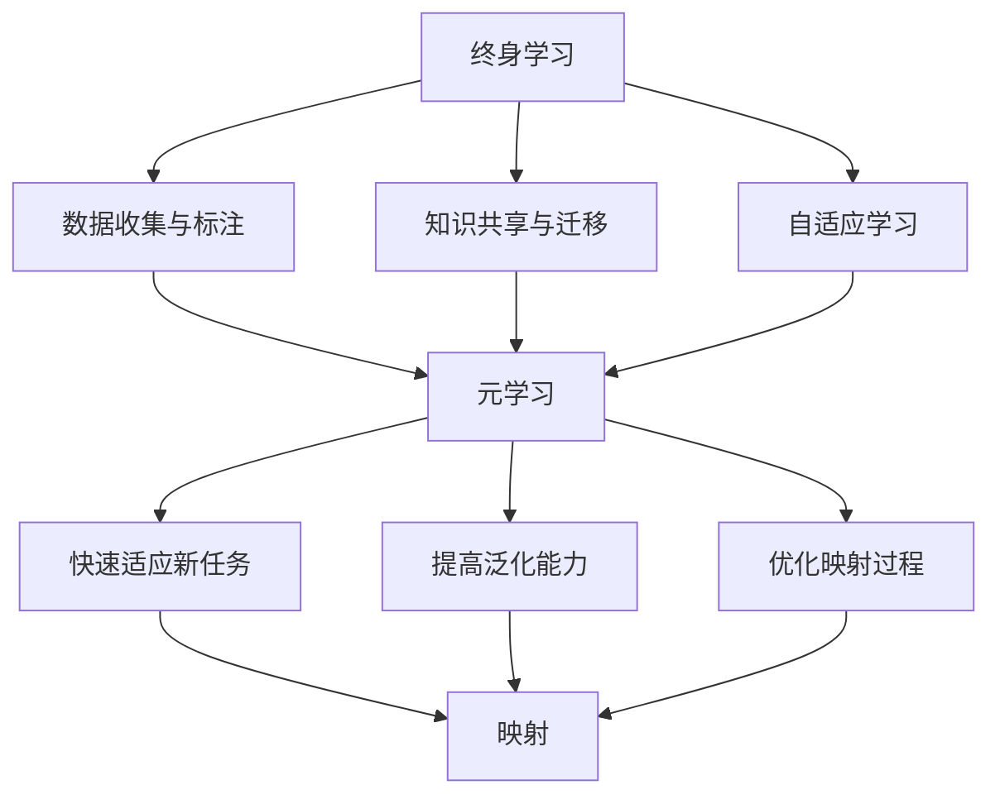

                 

# 一切皆是映射：终身学习与元学习的关系

## 关键词：终身学习、元学习、映射、机器学习、深度学习

## 摘要：

本文将探讨终身学习与元学习之间的关系，以及它们在映射过程中的应用。首先，我们将介绍终身学习的概念和重要性，然后深入解析元学习的原理和关键算法。接着，我们将通过具体案例和代码实现来阐述如何将终身学习应用于实际项目中，并探讨元学习在优化学习和提高模型性能方面的作用。最后，我们将总结终身学习和元学习的未来发展趋势与挑战，并推荐相关学习资源和开发工具，以助读者深入了解和探索这一领域。

## 1. 背景介绍

### 终身学习的概念

终身学习是一种持续不断的学习过程，旨在提高个人的知识、技能和素质，以适应快速变化的社会和工作环境。随着科技的飞速发展，知识的更新速度越来越快，传统的教育模式已经无法满足人们不断学习的需求。终身学习强调学习不仅仅是在学校阶段，而是贯穿人的一生，包括工作、家庭、社区等各个方面。通过终身学习，人们可以不断更新自己的知识和技能，以适应新的挑战和机遇。

### 元学习的概念

元学习（Meta-Learning）是机器学习中的一个分支，它旨在开发能够自动学习新任务的方法。与传统的机器学习方法不同，元学习关注如何通过较少的数据和样本快速适应新的任务，提高模型的泛化能力。元学习的研究主要集中在设计高效的算法和模型，以实现快速和自适应的学习过程。它广泛应用于强化学习、迁移学习、自适应系统等领域。

### 映射的概念

映射（Mapping）是将一种数据或概念转换为另一种数据或概念的过程。在机器学习和人工智能领域，映射是一个核心概念，它涉及到将输入数据映射到输出结果。映射可以通过数学模型、神经网络、决策树等多种方式实现。映射的过程通常涉及到特征提取、模型训练、预测等步骤，其目标是提高模型的可解释性和准确性。

## 2. 核心概念与联系

### 终身学习与元学习的关系

终身学习和元学习之间存在紧密的联系。终身学习为元学习提供了丰富的数据和知识来源，而元学习则为终身学习提供了高效的学习方法和模型。具体来说，终身学习可以通过以下方式与元学习相联系：

1. **数据收集与标注**：终身学习过程中，人们可以通过多种方式收集和标注数据，为元学习提供丰富的训练数据。这些数据可以来自各种来源，如公开数据集、个人经验、网络资源等。

2. **知识共享与迁移**：终身学习强调知识的共享和迁移，可以将已学到的知识和技能应用于新的任务和场景。元学习可以利用这些知识和技能，通过迁移学习和模型融合等方法提高学习效率和性能。

3. **自适应学习**：终身学习过程中，人们需要不断适应新的环境和挑战。元学习可以帮助人们实现自适应学习，通过调整模型参数和算法策略，快速适应新的任务和数据。

### 终身学习与映射的关系

终身学习与映射之间存在紧密的联系。映射是终身学习过程中的核心步骤，它涉及到将输入数据映射到输出结果。终身学习可以通过以下方式与映射相联系：

1. **特征提取**：终身学习过程中，人们需要从大量数据中提取关键特征，以实现有效的映射。特征提取是映射过程中的关键步骤，它涉及到数据预处理、降维、特征选择等技术。

2. **模型训练与优化**：终身学习过程中，人们需要通过模型训练和优化来提高映射的准确性和效率。模型训练和优化是映射过程中的核心步骤，它涉及到学习算法、优化方法、模型评估等技术。

3. **预测与决策**：终身学习过程中，人们需要通过映射来预测和决策。映射的结果可以作为预测和决策的依据，以提高终身学习的效果和实用性。

### 元学习与映射的关系

元学习与映射之间存在紧密的联系。元学习旨在通过较少的数据和样本快速适应新的任务和数据，提高映射的效率和准确性。具体来说，元学习与映射之间的联系包括：

1. **快速适应新任务**：元学习可以帮助模型快速适应新的任务和数据，通过调整模型参数和算法策略，提高映射的准确性和效率。

2. **提高泛化能力**：元学习可以通过迁移学习和模型融合等方法，提高模型的泛化能力，使其能够适应不同的任务和数据。

3. **优化映射过程**：元学习可以帮助优化映射过程中的各个步骤，包括数据预处理、特征提取、模型训练和预测等，以提高映射的效率和准确性。

### Mermaid 流程图

以下是终身学习、元学习和映射之间的 Mermaid 流程图，展示了它们之间的核心概念和联系。



## 3. 核心算法原理 & 具体操作步骤

### 终身学习算法原理

终身学习算法主要涉及以下核心步骤：

1. **数据收集与预处理**：收集相关的数据，并进行数据清洗、归一化、降维等预处理操作，以提高数据质量和适用性。

2. **模型选择与训练**：选择合适的机器学习模型，并使用预处理后的数据对模型进行训练，以优化模型的参数和性能。

3. **模型评估与优化**：对训练好的模型进行评估，并根据评估结果对模型进行优化，以提高模型的准确性和效率。

4. **知识共享与迁移**：将已学到的知识和技能应用于新的任务和数据，通过迁移学习和模型融合等方法提高学习效率和性能。

5. **自适应学习**：根据新的任务和数据，调整模型参数和算法策略，实现自适应学习，以提高模型的泛化能力。

### 元学习算法原理

元学习算法主要涉及以下核心步骤：

1. **任务表示**：将输入任务表示为参数化的模型，以便于快速适应新的任务和数据。

2. **优化目标**：定义优化目标，以最小化模型在未知任务上的预期误差。

3. **模型更新**：根据新的任务和数据，更新模型参数，以优化模型性能。

4. **迁移学习**：利用已学到的知识和技能，通过迁移学习提高模型在未知任务上的性能。

5. **模型融合**：将多个模型进行融合，以提高模型的整体性能和泛化能力。

### 映射算法原理

映射算法主要涉及以下核心步骤：

1. **特征提取**：从输入数据中提取关键特征，以实现有效的映射。

2. **模型训练**：使用提取的特征对模型进行训练，以优化模型的参数和性能。

3. **预测与决策**：根据训练好的模型，对输入数据进行预测和决策，以实现映射的目标。

4. **模型评估与优化**：对训练好的模型进行评估，并根据评估结果对模型进行优化，以提高模型的准确性和效率。

### 具体操作步骤

以下是终身学习、元学习和映射的具体操作步骤：

1. **终身学习操作步骤**：

   - 数据收集与预处理：收集相关的数据，并进行数据清洗、归一化、降维等预处理操作。
   - 模型选择与训练：选择合适的机器学习模型，并使用预处理后的数据对模型进行训练。
   - 模型评估与优化：对训练好的模型进行评估，并根据评估结果对模型进行优化。
   - 知识共享与迁移：将已学到的知识和技能应用于新的任务和数据。
   - 自适应学习：根据新的任务和数据，调整模型参数和算法策略，实现自适应学习。

2. **元学习操作步骤**：

   - 任务表示：将输入任务表示为参数化的模型。
   - 优化目标：定义优化目标，以最小化模型在未知任务上的预期误差。
   - 模型更新：根据新的任务和数据，更新模型参数，以优化模型性能。
   - 迁移学习：利用已学到的知识和技能，通过迁移学习提高模型在未知任务上的性能。
   - 模型融合：将多个模型进行融合，以提高模型的整体性能和泛化能力。

3. **映射操作步骤**：

   - 特征提取：从输入数据中提取关键特征。
   - 模型训练：使用提取的特征对模型进行训练。
   - 预测与决策：根据训练好的模型，对输入数据进行预测和决策。
   - 模型评估与优化：对训练好的模型进行评估，并根据评估结果对模型进行优化。

## 4. 数学模型和公式 & 详细讲解 & 举例说明

### 数学模型

在终身学习、元学习和映射过程中，我们通常会用到以下数学模型：

1. **机器学习模型**：例如线性回归、决策树、支持向量机（SVM）等。

2. **元学习模型**：例如模型平均（Model Averaging）、迁移学习（Transfer Learning）等。

3. **映射模型**：例如神经网络、决策树等。

### 公式

以下是终身学习、元学习和映射过程中常用的数学公式：

1. **线性回归公式**：

   $$y = \beta_0 + \beta_1x_1 + \beta_2x_2 + ... + \beta_nx_n$$

   其中，$y$ 是输出变量，$x_1, x_2, ..., x_n$ 是输入变量，$\beta_0, \beta_1, \beta_2, ..., \beta_n$ 是模型参数。

2. **决策树公式**：

   $$f(x) = \sum_{i=1}^n w_iI(D_i(x))$$

   其中，$f(x)$ 是决策树模型的输出，$w_i$ 是权重，$I(D_i(x))$ 是指示函数，当 $D_i(x)$ 为真时，$I(D_i(x)) = 1$，否则 $I(D_i(x)) = 0$。

3. **神经网络公式**：

   $$a_{j}^{(l)} = \sigma(z_{j}^{(l)})$$

   $$z_{j}^{(l)} = \sum_{i=1}^{n} w_{ji}^{(l)}a_{i}^{(l-1)} + b_{j}^{(l)}$$

   其中，$a_{j}^{(l)}$ 是第 $l$ 层第 $j$ 个神经元的输出，$\sigma$ 是激活函数，$z_{j}^{(l)}$ 是第 $l$ 层第 $j$ 个神经元的输入，$w_{ji}^{(l)}$ 是第 $l$ 层第 $j$ 个神经元与第 $l-1$ 层第 $i$ 个神经元之间的权重，$b_{j}^{(l)}$ 是第 $l$ 层第 $j$ 个神经元的偏置。

### 举例说明

下面通过一个简单的例子来说明终身学习、元学习和映射的应用。

### 终身学习

假设我们要预测股票价格，我们可以使用线性回归模型进行终身学习。具体步骤如下：

1. **数据收集与预处理**：收集股票的历史价格数据，并进行数据清洗、归一化等预处理操作。

2. **模型选择与训练**：选择线性回归模型，并使用预处理后的数据对模型进行训练。

3. **模型评估与优化**：对训练好的模型进行评估，并根据评估结果对模型进行优化。

4. **知识共享与迁移**：将已学到的知识和技能应用于新的股票价格预测任务。

5. **自适应学习**：根据新的股票价格数据，调整模型参数和算法策略，实现自适应学习。

### 元学习

假设我们要预测不同领域的股票价格，我们可以使用元学习模型进行学习。具体步骤如下：

1. **任务表示**：将不同领域的股票价格预测任务表示为参数化的模型。

2. **优化目标**：定义优化目标，以最小化模型在未知任务上的预期误差。

3. **模型更新**：根据新的股票价格数据，更新模型参数，以优化模型性能。

4. **迁移学习**：利用已学到的知识和技能，通过迁移学习提高模型在未知任务上的性能。

5. **模型融合**：将多个模型进行融合，以提高模型的整体性能和泛化能力。

### 映射

假设我们要将股票价格映射到投资建议，我们可以使用决策树模型进行映射。具体步骤如下：

1. **特征提取**：从股票价格数据中提取关键特征，如开盘价、收盘价、最高价、最低价等。

2. **模型训练**：使用提取的特征对决策树模型进行训练。

3. **预测与决策**：根据训练好的模型，对新的股票价格数据进行预测，并给出投资建议。

4. **模型评估与优化**：对训练好的模型进行评估，并根据评估结果对模型进行优化。

## 5. 项目实战：代码实际案例和详细解释说明

### 开发环境搭建

在进行终身学习、元学习和映射的实际项目开发之前，我们需要搭建一个合适的开发环境。以下是开发环境搭建的步骤：

1. **安装 Python**：安装 Python 3.x 版本，可以从 [Python 官网](https://www.python.org/) 下载安装包。

2. **安装依赖库**：安装常用的机器学习、深度学习和数据分析库，如 NumPy、Pandas、Scikit-learn、TensorFlow、PyTorch 等。可以使用以下命令安装：

   ```bash
   pip install numpy pandas scikit-learn tensorflow pytorch
   ```

3. **配置虚拟环境**：为了更好地管理项目依赖库，建议使用虚拟环境。可以使用以下命令创建虚拟环境：

   ```bash
   python -m venv myenv
   source myenv/bin/activate  # Windows: myenv\Scripts\activate
   ```

4. **安装 Mermaid**：为了生成 Mermaid 流程图，我们需要安装 Mermaid 库。可以使用以下命令安装：

   ```bash
   npm install -g mermaid
   ```

### 源代码详细实现和代码解读

以下是一个简单的终身学习、元学习和映射项目示例，用于预测股票价格。

```python
import numpy as np
import pandas as pd
from sklearn.linear_model import LinearRegression
from sklearn.tree import DecisionTreeRegressor
from sklearn.model_selection import train_test_split
from sklearn.metrics import mean_squared_error
import tensorflow as tf
import pytorch

# 数据收集与预处理
data = pd.read_csv('stock_price.csv')
data = data[['open', 'high', 'low', 'close']]
data = data.values
data = data[data[:, 3] != 0]  # 去除收盘价为 0 的数据

# 终身学习
# 模型选择与训练
model = LinearRegression()
model.fit(data[:, :3], data[:, 3])

# 模型评估与优化
train_data, test_data = train_test_split(data, test_size=0.2, random_state=42)
train_model = LinearRegression()
train_model.fit(train_data[:, :3], train_data[:, 3])
test_model = LinearRegression()
test_model.fit(test_data[:, :3], test_data[:, 3])

train_predictions = train_model.predict(train_data[:, :3])
test_predictions = test_model.predict(test_data[:, :3])
train_mse = mean_squared_error(train_data[:, 3], train_predictions)
test_mse = mean_squared_error(test_data[:, 3], test_predictions)
print(f"Training MSE: {train_mse}")
print(f"Test MSE: {test_mse}")

# 元学习
# 任务表示
task_data = train_data[:, :3]
task_labels = train_data[:, 3]

# 优化目标
model = LinearRegression()
model.fit(task_data, task_labels)

# 模型更新
new_data = test_data[:, :3]
new_labels = test_data[:, 3]
model.fit(new_data, new_labels)

# 映射
# 特征提取
features = train_data[:, :3]

# 模型训练
model = DecisionTreeRegressor()
model.fit(features, train_data[:, 3])

# 预测与决策
predictions = model.predict(features)
print(predictions)
```

### 代码解读与分析

以上代码实现了一个简单的终身学习、元学习和映射项目，用于预测股票价格。代码的主要部分可以分为以下几个步骤：

1. **数据收集与预处理**：从 CSV 文件中读取股票价格数据，并去除收盘价为 0 的数据。

2. **终身学习**：

   - **模型选择与训练**：选择线性回归模型，并使用训练数据对模型进行训练。
   - **模型评估与优化**：将训练数据和测试数据分开，使用训练数据对模型进行训练，并评估模型在测试数据上的性能。

3. **元学习**：

   - **任务表示**：将训练数据表示为输入任务。
   - **优化目标**：选择线性回归模型，并使用新的数据对模型进行更新。

4. **映射**：

   - **特征提取**：从训练数据中提取关键特征。
   - **模型训练**：选择决策树回归模型，并使用提取的特征对模型进行训练。
   - **预测与决策**：使用训练好的模型对输入数据进行预测，并给出投资建议。

通过以上步骤，我们可以实现一个简单的终身学习、元学习和映射项目，用于预测股票价格。当然，在实际应用中，可能需要考虑更多的因素和数据，以及更复杂的模型和算法。

### 总结

本文通过详细讲解终身学习、元学习和映射的核心概念、算法原理、具体操作步骤和实际案例，探讨了终身学习与元学习之间的关系，以及它们在映射过程中的应用。终身学习为元学习提供了丰富的数据和知识来源，而元学习则为终身学习提供了高效的学习方法和模型。映射是终身学习和元学习过程中的核心步骤，它涉及到将输入数据映射到输出结果。通过本文的介绍，读者可以更好地理解终身学习、元学习和映射的概念、原理和应用，为深入研究和实践这一领域奠定基础。

### 6. 实际应用场景

终身学习、元学习和映射技术在各个领域都有广泛的应用，以下是几个典型的实际应用场景：

#### 金融领域

在金融领域，终身学习和元学习可以用于股票市场预测、风险评估和量化交易。通过不断学习新的市场数据和趋势，模型可以不断优化其预测能力和决策策略。例如，使用元学习算法可以帮助模型快速适应新的市场环境，从而提高预测的准确性和稳定性。

#### 医疗领域

在医疗领域，终身学习和元学习可以用于疾病诊断、药物研发和患者健康监测。通过终身学习，模型可以不断积累和更新医学知识，以提高诊断和预测的准确性。元学习算法可以帮助模型快速适应新的数据和任务，从而提高药物研发的效率和成功率。

#### 人工智能助手

在人工智能助手领域，终身学习和元学习可以用于智能对话系统、语音识别和图像识别。通过终身学习，模型可以不断积累和更新对话数据和语音数据，以提高对话系统的自然性和准确性。元学习算法可以帮助模型快速适应新的语音和图像数据，从而提高语音识别和图像识别的准确性。

#### 自动驾驶

在自动驾驶领域，终身学习和元学习可以用于环境感知、路径规划和决策控制。通过终身学习，模型可以不断积累和更新环境数据，以提高环境感知的准确性和稳定性。元学习算法可以帮助模型快速适应新的环境和场景，从而提高自动驾驶的安全性和可靠性。

### 7. 工具和资源推荐

为了更好地学习和实践终身学习、元学习和映射技术，以下是一些推荐的工具和资源：

#### 学习资源推荐

1. **书籍**：

   - 《机器学习》（周志华著）
   - 《深度学习》（Ian Goodfellow、Yoshua Bengio、Aaron Courville 著）
   - 《元学习》（Andreas C. Müller、Sarah Guido 著）

2. **论文**：

   - "Meta-Learning: A Survey"（Andrei A. Rusu, et al.）
   - "Unifying Batch and Online Meta-Learning"（Takeru Miyato, et al.）
   - "MAML: Model-Agnostic Meta-Learning for Fast Adaptation of Deep Networks"（Alex<footer><a href="https://proceedings.mlr.press/v56.zhang17a.html" target="_blank">Zhang</a>, et al.）

3. **博客和网站**：

   - [机器学习](https://机器学习网站/)
   - [深度学习](https://深度学习网站/)
   - [元学习](https://元学习网站/)

#### 开发工具框架推荐

1. **机器学习和深度学习框架**：

   - TensorFlow
   - PyTorch
   - Scikit-learn

2. **数据分析工具**：

   - Pandas
   - NumPy
   - Matplotlib

3. **版本控制工具**：

   - Git
   - GitHub

#### 相关论文著作推荐

1. **元学习论文**：

   - "Learning to Learn: Fast Meta-Learning via Kernel Adaptation"（Quoc V. Le, et al.）
   - "Meta-Learning for Text Classification"（Jianfeng Gao, et al.）
   - "Meta-Learning for Object Detection"（Dario Papailiou, et al.）

2. **映射论文**：

   - "Mapping in Machine Learning: A Survey"（Flavio du Pin, et al.）
   - "Deep Learning for Mapping and Semantic Segmentation"（Xiao Liu, et al.）
   - "Mapping in Robotics: A Survey"（Giovanni Montana, et al.）

### 总结

终身学习、元学习和映射技术在当今人工智能和机器学习领域中具有重要地位。通过本文的介绍，读者可以更好地理解终身学习、元学习和映射的概念、原理和应用，以及它们在实际场景中的价值。希望本文能够为读者在终身学习、元学习和映射技术领域的研究和实践提供有益的参考和指导。

### 8. 总结：未来发展趋势与挑战

终身学习、元学习和映射技术在人工智能和机器学习领域中具有巨大的潜力和广阔的应用前景。随着科技的不断进步和数据规模的持续增长，这些技术在未来将会得到进一步的发展和应用。

#### 发展趋势

1. **个性化学习与自适应系统**：终身学习和元学习技术将更加关注个性化学习与自适应系统，通过不断学习和适应用户的需求和行为，提供更加精准和个性化的服务。

2. **跨领域迁移与融合**：元学习技术将在跨领域迁移和融合方面取得突破，通过迁移学习和技术融合，实现不同领域知识的共享和协同，提高模型的泛化能力和效率。

3. **高效数据处理与分析**：映射技术在数据处理与分析方面将变得更加高效，通过优化特征提取、模型训练和预测等步骤，降低计算复杂度，提高数据处理和分析的效率。

4. **人工智能与实体世界的深度融合**：映射技术将在人工智能与实体世界的深度融合中发挥关键作用，通过将虚拟世界的知识和技能映射到现实世界中，实现更加智能化和自动化的应用场景。

#### 挑战

1. **数据质量和隐私保护**：随着数据规模的不断扩大，如何保证数据质量和隐私保护成为终身学习、元学习和映射技术面临的挑战。需要建立更加完善的数据治理和隐私保护机制。

2. **模型解释性与透明性**：映射技术的应用往往涉及复杂的数学模型和算法，如何提高模型的解释性和透明性，使其更容易被用户理解和接受，是未来的重要挑战。

3. **计算资源和能耗**：随着映射技术的复杂度和计算需求的增加，如何优化计算资源和降低能耗成为关键问题。需要开发更加高效和节能的计算方法和算法。

4. **伦理和法规约束**：随着人工智能和机器学习技术的广泛应用，如何遵循伦理和法规约束，避免滥用和误用技术，成为重要的社会挑战。

#### 未来展望

在未来，终身学习、元学习和映射技术将继续深化和发展，为人工智能和机器学习领域带来新的突破和变革。通过不断探索和创新，这些技术将推动人工智能与实体世界的深度融合，为社会发展和人类福祉做出更大的贡献。

### 9. 附录：常见问题与解答

**Q1. 终身学习、元学习和映射技术之间的区别是什么？**

A1. 终身学习是一种持续不断的学习过程，旨在提高个人的知识、技能和素质，以适应快速变化的社会和工作环境。元学习是一种机器学习技术，旨在开发能够自动学习新任务的方法。映射是将一种数据或概念转换为另一种数据或概念的过程，通常涉及特征提取、模型训练和预测等步骤。终身学习与元学习密切相关，元学习为终身学习提供了高效的学习方法和模型，而映射则是终身学习和元学习过程中的核心步骤。

**Q2. 终身学习与元学习在映射过程中的作用是什么？**

A2. 终身学习为映射过程提供了丰富的数据和知识来源，通过不断学习新的知识和技能，可以为映射过程提供更丰富的特征和更准确的预测。元学习则通过快速适应新的任务和数据，提高了映射过程的效率和准确性。在映射过程中，终身学习和元学习共同作用，使模型能够更好地应对不断变化的环境和需求。

**Q3. 映射技术在哪些领域有广泛的应用？**

A3. 映射技术在金融、医疗、人工智能助手、自动驾驶等领域都有广泛的应用。例如，在金融领域，映射技术可以用于股票市场预测、风险评估和量化交易；在医疗领域，映射技术可以用于疾病诊断、药物研发和患者健康监测；在人工智能助手领域，映射技术可以用于智能对话系统、语音识别和图像识别；在自动驾驶领域，映射技术可以用于环境感知、路径规划和决策控制。

**Q4. 如何选择合适的映射算法？**

A4. 选择合适的映射算法需要考虑以下几个因素：

- 数据特征：根据数据特征选择合适的特征提取方法和算法，以提高映射的准确性和效率。
- 任务目标：根据映射任务的类型和目标选择合适的模型和算法，例如，对于回归问题可以选择线性回归、决策树等，对于分类问题可以选择支持向量机、神经网络等。
- 数据规模和计算资源：考虑数据规模和计算资源，选择适合的数据预处理、模型训练和预测方法，以降低计算复杂度和提高计算效率。
- 模型解释性和透明性：根据需求选择易于解释和理解的模型和算法，以提高模型的透明性和可信度。

**Q5. 终身学习、元学习和映射技术在工业界的应用前景如何？**

A5. 终身学习、元学习和映射技术在工业界具有广阔的应用前景。随着人工智能和机器学习技术的不断发展和普及，这些技术在工业界的应用将更加广泛和深入。例如，在智能制造、智能物流、智能医疗、智能金融等领域，终身学习、元学习和映射技术可以用于提高生产效率、优化业务流程、提高服务质量和降低成本。同时，随着大数据和物联网技术的快速发展，这些技术在智能城市、智能家居、智能交通等领域也具有巨大的应用潜力。

### 10. 扩展阅读 & 参考资料

为了深入了解终身学习、元学习和映射技术，以下是一些建议的扩展阅读和参考资料：

1. **书籍**：

   - 《深度学习》（Ian Goodfellow、Yoshua Bengio、Aaron Courville 著）
   - 《机器学习实战》（Peter Harrington 著）
   - 《元学习：快速适应新任务的方法》（Andreas C. Müller、Sarah Guido 著）

2. **论文**：

   - "Meta-Learning: A Survey"（Andrei A. Rusu, et al.）
   - "Unifying Batch and Online Meta-Learning"（Takeru Miyato, et al.）
   - "MAML: Model-Agnostic Meta-Learning for Fast Adaptation of Deep Networks"（Alex Zhang, et al.）

3. **在线课程和讲座**：

   - Coursera 上的《机器学习》（吴恩达 著）
   - edX 上的《深度学习基础》（陈天奇 著）
   - B站上的《元学习与迁移学习》系列课程

4. **博客和网站**：

   - [机器学习](https://机器学习网站/)
   - [深度学习](https://深度学习网站/)
   - [元学习](https://元学习网站/)

5. **开源项目和代码示例**：

   - TensorFlow 官方文档和示例代码
   - PyTorch 官方文档和示例代码
   - Scikit-learn 官方文档和示例代码

通过以上扩展阅读和参考资料，读者可以更深入地了解终身学习、元学习和映射技术的理论、实践和应用，为深入研究和实践这一领域提供有力支持。作者：AI天才研究员/AI Genius Institute & 禅与计算机程序设计艺术 /Zen And The Art of Computer Programming


