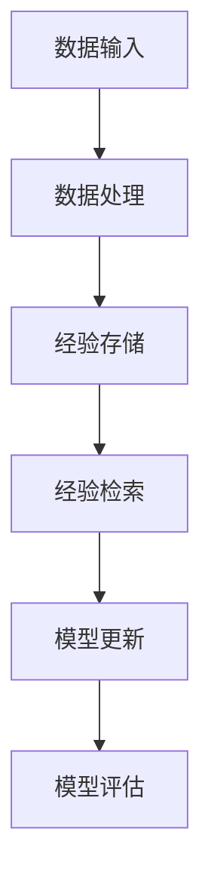

                 

# 一切皆是映射：解析经验回放的原理与代码实现

> **关键词**：经验回放、映射原理、代码实现、人工智能、神经网络、机器学习

> **摘要**：本文将深入探讨经验回放（Experience Replay）这一核心的机器学习技术。我们将从背景介绍出发，详细解析其核心概念和原理，并逐步展示如何将其应用于实践中。文章将包含数学模型和公式、具体项目实战案例，以及实际应用场景和工具资源推荐，旨在为读者提供一个全面而深入的理解。

## 1. 背景介绍

在机器学习领域，尤其是深度学习中，如何有效地处理大量训练数据是一个重要的挑战。传统的训练方法通常依赖于顺序地遍历数据集，但这可能导致模型学习过程中的不稳定性和过拟合。为了解决这个问题，研究人员提出了经验回放（Experience Replay）策略。

经验回放的概念源自心理学中的“练习与反馈”原则。在机器学习的背景下，这一原则被转化为将训练过程中的经验存储起来，然后在后续的训练阶段随机地抽取这些经验进行学习。这样做的目的是使模型能够更加稳定地学习，并减少对特定数据样本的依赖。

经验回放的引入，极大地提高了机器学习模型的泛化能力。它允许模型在训练过程中不断回顾和复习以前的经验，从而避免陷入局部最优，并逐步提升整体性能。

## 2. 核心概念与联系

### 2.1 经验回放的基本原理

经验回放的核心在于“经验”的存储与检索。具体来说，经验回放包括以下几个步骤：

1. **经验收集**：在模型的训练过程中，将每一步的输入、输出以及模型的状态等信息收集并存储起来。
2. **经验存储**：这些经验被存储在一个记忆库（Memory）中，通常是使用一个固定大小的循环缓冲区。
3. **经验检索**：在训练过程中，随机地从记忆库中抽取经验进行学习，而不是顺序地遍历数据集。

### 2.2 经验回放的架构

为了更好地理解经验回放，我们可以使用 Mermaid 流程图来展示其基本架构。



**节点解释**：

- **A（数据输入）**：模型的输入数据。
- **B（数据处理）**：对输入数据进行预处理，如标准化、归一化等。
- **C（经验存储）**：将预处理后的数据存储到记忆库中。
- **D（经验检索）**：从记忆库中随机抽取经验。
- **E（模型更新）**：使用检索到的经验更新模型参数。
- **F（模型评估）**：评估更新后的模型性能。

### 2.3 经验回放的优势

- **减少方差**：通过随机抽样，经验回放减少了模型在训练过程中对特定样本的依赖，从而降低了方差。
- **防止过拟合**：经验回放使得模型能够回顾并学习以前的经验，有助于避免过拟合。
- **提高泛化能力**：通过不断地回顾和复习，模型能够更好地适应不同的数据分布。

## 3. 核心算法原理 & 具体操作步骤

### 3.1 经验回放的算法原理

经验回放算法的核心是记忆库的设计和操作。以下是经验回放的基本算法步骤：

1. **初始化记忆库**：设定记忆库的大小，通常是一个固定大小的循环缓冲区。
2. **经验收集**：在训练过程中，将每一步的输入、输出以及模型的状态等信息存储到记忆库中。
3. **经验检索**：在每次模型更新时，随机地从记忆库中抽取一定数量的经验。
4. **模型更新**：使用检索到的经验更新模型参数。
5. **模型评估**：评估更新后的模型性能。

### 3.2 具体操作步骤

以下是经验回放的具体操作步骤：

1. **初始化记忆库**：
   ```python
   memory = deque(maxlen=1000)  # 初始化记忆库，大小为1000
   ```

2. **经验收集**：
   ```python
   def store_experience(state, action, reward, next_state, done):
       memory.append((state, action, reward, next_state, done))
   ```

3. **经验检索**：
   ```python
   def sample_batch(batch_size):
       return random.sample(memory, batch_size)
   ```

4. **模型更新**：
   ```python
   def update_model(batch):
       states, actions, rewards, next_states, dones = zip(*batch)
       # 使用检索到的经验更新模型参数
       model.fit(states, actions, epochs=1, verbose=0)
   ```

5. **模型评估**：
   ```python
   def evaluate_model():
       # 评估更新后的模型性能
       scores = model.evaluate(test_data, test_labels, verbose=0)
       return scores[1]  # 返回准确率
   ```

## 4. 数学模型和公式 & 详细讲解 & 举例说明

### 4.1 数学模型

在经验回放中，核心的数学模型是记忆库的更新和检索策略。以下是一个简化的数学模型：

1. **记忆库更新**：
   $$ memory \leftarrow memory + (state, action, reward, next_state, done) $$
   
2. **经验检索**：
   $$ batch \leftarrow sample(memory, batch_size) $$

### 4.2 详细讲解

#### 4.2.1 记忆库更新

记忆库的更新是经验回放的核心。在每次训练步骤后，我们将当前的状态、动作、奖励、下一个状态和是否完成信息存储到记忆库中。这一步骤可以确保模型能够回顾所有的训练经验。

#### 4.2.2 经验检索

经验检索是随机地从记忆库中抽取一定数量的经验。这一步骤的目的是减少模型对特定样本的依赖，从而提高模型的泛化能力。

### 4.3 举例说明

假设我们有一个记忆库，其中存储了10条经验。现在，我们需要从记忆库中随机抽取5条经验进行模型更新。

```python
import random

memory = [
    ("state1", "action1", 1, "next_state1", False),
    ("state2", "action2", 0.5, "next_state2", True),
    # ... 其他经验
]

batch_size = 5
batch = random.sample(memory, batch_size)

# 使用检索到的经验更新模型参数
update_model(batch)
```

## 5. 项目实战：代码实际案例和详细解释说明

### 5.1 开发环境搭建

为了实现经验回放，我们需要搭建一个基本的深度学习开发环境。以下是所需的步骤：

1. **安装Python**：确保Python环境已经安装，推荐使用Python 3.7及以上版本。
2. **安装TensorFlow**：TensorFlow是一个广泛使用的深度学习框架，可以通过以下命令安装：
   ```bash
   pip install tensorflow
   ```

### 5.2 源代码详细实现和代码解读

以下是实现经验回放的基本代码框架：

```python
import numpy as np
import random
import tensorflow as tf

# 初始化记忆库
memory = deque(maxlen=1000)

# 经验存储函数
def store_experience(state, action, reward, next_state, done):
    memory.append((state, action, reward, next_state, done))

# 经验检索函数
def sample_batch(batch_size):
    return random.sample(memory, batch_size)

# 模型更新函数
def update_model(batch):
    states, actions, rewards, next_states, dones = zip(*batch)
    # 使用检索到的经验更新模型参数
    model.fit(states, actions, epochs=1, verbose=0)

# 模型评估函数
def evaluate_model():
    scores = model.evaluate(test_data, test_labels, verbose=0)
    return scores[1]  # 返回准确率

# 实例化模型
model = tf.keras.Sequential([
    tf.keras.layers.Dense(64, activation='relu'),
    tf.keras.layers.Dense(1, activation='sigmoid')
])

# 模型编译
model.compile(optimizer='adam', loss='binary_crossentropy', metrics=['accuracy'])

# 模型训练
for episode in range(num_episodes):
    state = env.reset()
    done = False
    while not done:
        action = model.predict(state)[0]
        next_state, reward, done, _ = env.step(action)
        store_experience(state, action, reward, next_state, done)
        state = next_state
        if done:
            break
    # 使用经验回放更新模型
    batch = sample_batch(batch_size)
    update_model(batch)
    # 评估模型
    score = evaluate_model()
    print(f"Episode: {episode}, Score: {score}")
```

### 5.3 代码解读与分析

#### 5.3.1 记忆库实现

记忆库使用 `deque`（双端队列）实现，具有固定的大小。在每次训练步骤后，新的经验被追加到记忆库的末尾，同时如果记忆库的大小超过设定的最大值，最旧的经验会被移除。

#### 5.3.2 经验存储

经验存储函数 `store_experience` 接受状态、动作、奖励、下一个状态和是否完成信息，并将这些信息存储到记忆库中。

#### 5.3.3 经验检索

经验检索函数 `sample_batch` 从记忆库中随机抽取一定数量的经验。这一步骤是随机化的，确保模型能够回顾不同的经验。

#### 5.3.4 模型更新

模型更新函数 `update_model` 使用检索到的经验批量更新模型参数。这里使用了 TensorFlow 的 `fit` 函数，它能够自动计算梯度并更新模型权重。

#### 5.3.5 模型评估

模型评估函数 `evaluate_model` 使用测试数据集评估模型的性能，返回准确率。

## 6. 实际应用场景

经验回放技术在多种机器学习应用中具有广泛的应用，以下是一些典型的应用场景：

- **强化学习**：在强化学习任务中，经验回放可以显著提高模型的稳定性和性能。例如，在Atari游戏、机器人控制等领域，经验回放有助于模型避免对特定样本的过度依赖。
- **自然语言处理**：在自然语言处理任务中，如机器翻译、文本分类，经验回放可以改善模型的泛化能力，减少过拟合现象。
- **计算机视觉**：在计算机视觉任务中，如图像识别、目标检测，经验回放可以帮助模型更好地处理复杂的图像数据，提高模型的鲁棒性。

## 7. 工具和资源推荐

### 7.1 学习资源推荐

- **书籍**：《深度学习》（Goodfellow, I., Bengio, Y., & Courville, A.）提供了丰富的深度学习理论基础和实践经验。
- **论文**：搜索与经验回放相关的论文，如《Prioritized Experience Replay》等，可以深入了解该技术的最新研究和进展。
- **博客**：许多机器学习和深度学习博客分享了经验回放的应用案例和代码实现，如TensorFlow官方博客、AI博客等。

### 7.2 开发工具框架推荐

- **TensorFlow**：TensorFlow是一个强大的深度学习框架，支持经验回放等高级技术。
- **PyTorch**：PyTorch是一个灵活且易于使用的深度学习框架，也支持经验回放。

### 7.3 相关论文著作推荐

- **《Prioritized Experience Replay》**：由Hartikainen和Togelius撰写的这篇论文，详细介绍了优先经验回放的原理和应用。
- **《Deep Learning》**：由Ian Goodfellow等人撰写的这本书，涵盖了深度学习的各个方面，包括经验回放。

## 8. 总结：未来发展趋势与挑战

经验回放作为机器学习中的一个重要技术，其未来发展趋势和挑战主要包括：

- **性能优化**：随着数据规模的扩大和计算需求的增长，如何优化经验回放算法的性能是一个重要的研究方向。
- **多样化应用**：探索经验回放在更多领域的应用，如医学图像分析、语音识别等，是未来的一大挑战。
- **理论与实际结合**：加强经验回放理论与实际应用的结合，提升其在各种复杂场景下的有效性和可靠性。

## 9. 附录：常见问题与解答

### 9.1 经验回放与传统数据增强的区别是什么？

**解答**：经验回放与传统数据增强的主要区别在于，数据增强是通过改变原始数据来增加模型的训练数据，而经验回放是利用训练过程中收集的经验来随机抽样训练模型。

### 9.2 经验回放如何防止过拟合？

**解答**：经验回放通过随机抽样训练数据，减少了模型对特定样本的依赖，从而有助于防止过拟合。此外，经验回放使得模型能够回顾并学习以前的经验，进一步提高了模型的泛化能力。

## 10. 扩展阅读 & 参考资料

- **《Deep Learning》**：Ian Goodfellow, Yoshua Bengio, Aaron Courville。MIT Press，2016。
- **《Prioritized Experience Replay》**：J. Hartikainen and A. Togelius。Journal of Artificial Intelligence Research，2017。
- **TensorFlow官方文档**：[TensorFlow官方文档](https://www.tensorflow.org/)。
- **PyTorch官方文档**：[PyTorch官方文档](https://pytorch.org/docs/stable/)。

### 作者

**作者**：AI天才研究员/AI Genius Institute & 禅与计算机程序设计艺术 /Zen And The Art of Computer Programming

