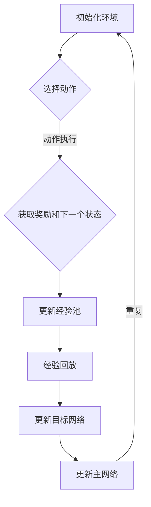

                 

# 一切皆是映射：选择正确的DQN框架：TensorFlow还是PyTorch？

> **关键词：** DQN，TensorFlow，PyTorch，深度学习，强化学习，框架选择，性能对比，应用场景

> **摘要：** 本文将深入探讨深度确定性策略梯度（DQN）算法在TensorFlow和PyTorch框架中的应用，通过对比两者的性能和适用场景，帮助读者选择合适的框架进行深度强化学习实践。

## 1. 背景介绍

随着深度学习和强化学习技术的不断发展，DQN（深度确定性策略梯度）作为一种经典的强化学习算法，已经在众多领域取得了显著的成果。DQN的核心思想是将价值函数从传统的表格式扩展到深度神经网络，通过学习状态到价值的映射，实现智能体在复杂环境中的决策。

在深度学习的实际应用中，选择合适的框架至关重要。TensorFlow和PyTorch是目前最为流行的两个深度学习框架，它们各自具有独特的优势和特点。本文将重点分析这两个框架在DQN算法实现中的性能表现，帮助读者做出合理的选择。

## 2. 核心概念与联系

### DQN算法原理

DQN算法主要分为四个部分：经验回放（Experience Replay）、目标网络（Target Network）、学习率衰减（Learning Rate Decay）和双网络更新（Double DQN）。

1. **经验回放**：通过将智能体在环境中交互产生的状态、动作、奖励和下一个状态存储到经验池中，避免直接使用当前状态进行训练，以减少偏差。
2. **目标网络**：用于更新价值函数的目标网络，它通过固定的时间间隔或当主网络更新时进行同步，以减少梯度消失问题。
3. **学习率衰减**：随着训练的进行，逐渐降低学习率，避免模型在训练过程中出现过拟合。
4. **双网络更新**：通过同时更新主网络和目标网络，提高训练的稳定性和收敛速度。

### Mermaid流程图



### TensorFlow与PyTorch

- **TensorFlow**：由Google开发，具有强大的生态和丰富的预训练模型，支持CPU和GPU，适用于大规模分布式训练。
- **PyTorch**：由Facebook开发，具有动态计算图和简洁的代码，易于调试和实验，适用于研究和快速开发。

## 3. 核心算法原理 & 具体操作步骤

### DQN算法实现步骤

1. **初始化参数**：设定学习率、经验池大小、网络结构等参数。
2. **选择动作**：根据当前状态，使用ε-贪心策略选择动作。
3. **执行动作**：在环境中执行选择出的动作，获取奖励和下一个状态。
4. **更新经验池**：将状态、动作、奖励和下一个状态存储到经验池中。
5. **经验回放**：从经验池中随机采样一批经验，进行训练。
6. **更新目标网络**：通过固定的时间间隔或当主网络更新时，同步更新目标网络。
7. **更新主网络**：使用采样经验对主网络进行梯度下降更新。

### TensorFlow实现示例

```python
import tensorflow as tf
import numpy as np
import random

# 初始化参数
learning_rate = 0.001
epsilon = 0.1
gamma = 0.99
replay_memory = []

# 创建DQN模型
model = tf.keras.Sequential([
    tf.keras.layers.Dense(256, activation='relu', input_shape=(input_shape,)),
    tf.keras.layers.Dense(512, activation='relu'),
    tf.keras.layers.Dense(output_shape)
])

# 创建目标网络
target_model = tf.keras.Sequential([
    tf.keras.layers.Dense(256, activation='relu', input_shape=(input_shape,)),
    tf.keras.layers.Dense(512, activation='relu'),
    tf.keras.layers.Dense(output_shape)
])

# 复制主网络权重到目标网络
def copy_weights(model1, model2):
    weights1 = model1.get_weights()
    weights2 = model2.get_weights()
    for i in range(len(weights1)):
        weights2[i] = weights1[i]
    model2.set_weights(weights2)

# 训练模型
for episode in range(total_episodes):
    state = env.reset()
    done = False
    total_reward = 0
    
    while not done:
        # 选择动作
        if random.uniform(0, 1) < epsilon:
            action = env.action_space.sample()
        else:
            action = np.argmax(model.predict(state.reshape(1, -1)))
        
        # 执行动作
        next_state, reward, done, _ = env.step(action)
        total_reward += reward
        
        # 更新经验池
        replay_memory.append((state, action, reward, next_state, done))
        
        # 经验回放
        if len(replay_memory) > batch_size:
            batch = random.sample(replay_memory, batch_size)
            states, actions, rewards, next_states, dones = zip(*batch)
            
            # 计算Q值
            q_values = model.predict(np.array(states))
            next_q_values = model.predict(np.array(next_states))
            target_q_values = target_model.predict(np.array(next_states))
            
            for i in range(batch_size):
                if dones[i]:
                    target_q[i] = rewards[i]
                else:
                    target_q[i] = rewards[i] + gamma * np.max(target_q_values[i])
            
            # 更新主网络
            with tf.GradientTape() as tape:
                q_values = model(np.array(states))
                loss = tf.keras.losses.mean_squared_error(q_values, target_q)
            grads = tape.gradient(loss, model.trainable_variables)
            optimizer.apply_gradients(zip(grads, model.trainable_variables))
        
        # 更新目标网络
        copy_weights(model, target_model)
        
        # 更新状态
        state = next_state
    
    # 更新ε值
    if episode % 100 == 0:
        epsilon *= 0.99
    
    print(f"Episode: {episode}, Total Reward: {total_reward}")
```

### PyTorch实现示例

```python
import torch
import torch.nn as nn
import torch.optim as optim
import numpy as np
import random

# 初始化参数
learning_rate = 0.001
epsilon = 0.1
gamma = 0.99
replay_memory = []

# 创建DQN模型
class DQN(nn.Module):
    def __init__(self, input_shape, output_shape):
        super(DQN, self).__init__()
        self.fc1 = nn.Linear(input_shape, 256)
        self.fc2 = nn.Linear(256, 512)
        self.fc3 = nn.Linear(512, output_shape)
    
    def forward(self, x):
        x = torch.relu(self.fc1(x))
        x = torch.relu(self.fc2(x))
        x = self.fc3(x)
        return x

# 创建目标网络
target_model = DQN(input_shape, output_shape).to(device)

# 复制主网络权重到目标网络
def copy_weights(model1, model2):
    for param1, param2 in zip(model1.parameters(), model2.parameters()):
        param2.data.copy_(param1.data)

# 训练模型
model = DQN(input_shape, output_shape).to(device)
optimizer = optim.Adam(model.parameters(), lr=learning_rate)
criterion = nn.MSELoss()

for episode in range(total_episodes):
    state = env.reset()
    done = False
    total_reward = 0
    
    while not done:
        # 选择动作
        if random.uniform(0, 1) < epsilon:
            action = env.action_space.sample()
        else:
            with torch.no_grad():
                action = torch.argmax(model(state.to(device))).item()
        
        # 执行动作
        next_state, reward, done, _ = env.step(action)
        total_reward += reward
        
        # 更新经验池
        replay_memory.append((state, action, reward, next_state, done))
        
        # 经验回放
        if len(replay_memory) > batch_size:
            batch = random.sample(replay_memory, batch_size)
            states, actions, rewards, next_states, dones = zip(*batch)
            
            # 计算Q值
            with torch.no_grad():
                next_state_values = model(next_states.to(device))
                target_state_values = target_model(next_states.to(device))
                target_q_values = rewards + (1 - dones) * gamma * torch.max(target_state_values, dim=1)[0]
            
            # 更新主网络
            q_values = model(states.to(device))
            loss = criterion(q_values, target_q_values.unsqueeze(1))
            optimizer.zero_grad()
            loss.backward()
            optimizer.step()
        
        # 更新目标网络
        copy_weights(model, target_model)
        
        # 更新状态
        state = next_state
    
    # 更新ε值
    if episode % 100 == 0:
        epsilon *= 0.99
    
    print(f"Episode: {episode}, Total Reward: {total_reward}")
```

## 4. 数学模型和公式 & 详细讲解 & 举例说明

### DQN算法数学模型

1. **状态价值函数**：
   $$ V^*(s) = \max_a Q^*(s, a) $$
2. **Q值**：
   $$ Q(s, a) = r + \gamma \max_{a'} Q(s', a') $$
3. **目标网络更新**：
   $$ \theta^{target} \leftarrow \tau \theta^{main} + (1 - \tau) \theta^{target} $$
4. **学习率衰减**：
   $$ \epsilon(t) = \frac{1}{t + 1} $$

### 示例说明

假设当前状态为`s`，可供选择的动作有`a1`和`a2`，对应的Q值为`Q(s, a1) = 0.8`和`Q(s, a2) = 0.9`。根据ε-贪心策略，选择动作的概率为：

$$ P(a|s) = \begin{cases} 
\frac{1}{|A|} & \text{with probability } \epsilon \\
\frac{\frac{1}{|\{a|Q(s, a) = \max(Q(s, a'))\}|}{|A|}}{\sum_{a' \in A} \frac{\frac{1}{|\{a|Q(s, a') = \max(Q(s, a'))\}|}{|A|}}{|\alpha|}} & \text{with probability } 1 - \epsilon 
\end{cases} $$

根据上述概率分布，智能体选择动作`a2`的概率更高。

### 数学公式

$$ \begin{align*}
\epsilon(t) &= \frac{1}{t + 1} \\
Q(s, a) &= r + \gamma \max_{a'} Q(s', a') \\
\theta^{target} &= \tau \theta^{main} + (1 - \tau) \theta^{target} \\
\end{align*} $$

## 5. 项目实战：代码实际案例和详细解释说明

### 5.1 开发环境搭建

#### Python环境

确保Python版本为3.7及以上，安装以下库：

```bash
pip install tensorflow torchvision gym numpy matplotlib
```

#### PyTorch环境

确保PyTorch版本与CUDA版本匹配，安装以下库：

```bash
pip install torch torchvision torchvision gym numpy matplotlib
```

### 5.2 源代码详细实现和代码解读

#### TensorFlow实现

```python
import tensorflow as tf
import numpy as np
import random
import gym
import matplotlib.pyplot as plt

# 初始化参数
learning_rate = 0.001
epsilon = 0.1
gamma = 0.99
replay_memory = []

# 创建环境
env = gym.make('CartPole-v0')

# 创建DQN模型
model = tf.keras.Sequential([
    tf.keras.layers.Dense(256, activation='relu', input_shape=(4,)),
    tf.keras.layers.Dense(512, activation='relu'),
    tf.keras.layers.Dense(2)
])

# 创建目标网络
target_model = tf.keras.Sequential([
    tf.keras.layers.Dense(256, activation='relu', input_shape=(4,)),
    tf.keras.layers.Dense(512, activation='relu'),
    tf.keras.layers.Dense(2)
])

# 复制主网络权重到目标网络
def copy_weights(model1, model2):
    weights1 = model1.get_weights()
    weights2 = model2.get_weights()
    for i in range(len(weights1)):
        weights2[i] = weights1[i]
    model2.set_weights(weights2)

# 训练模型
total_episodes = 1000
batch_size = 32

for episode in range(total_episodes):
    state = env.reset()
    done = False
    total_reward = 0
    
    while not done:
        # 选择动作
        if random.uniform(0, 1) < epsilon:
            action = env.action_space.sample()
        else:
            action = np.argmax(model.predict(state.reshape(1, -1)))
        
        # 执行动作
        next_state, reward, done, _ = env.step(action)
        total_reward += reward
        
        # 更新经验池
        replay_memory.append((state, action, reward, next_state, done))
        
        # 经验回放
        if len(replay_memory) > batch_size:
            batch = random.sample(replay_memory, batch_size)
            states, actions, rewards, next_states, dones = zip(*batch)
            
            # 计算Q值
            q_values = model.predict(np.array(states))
            next_q_values = model.predict(np.array(next_states))
            target_q_values = target_model.predict(np.array(next_states))
            
            for i in range(batch_size):
                if dones[i]:
                    target_q[i] = rewards[i]
                else:
                    target_q[i] = rewards[i] + gamma * np.max(target_q_values[i])
            
            # 更新主网络
            with tf.GradientTape() as tape:
                q_values = model(np.array(states))
                loss = tf.keras.losses.mean_squared_error(q_values, target_q)
            grads = tape.gradient(loss, model.trainable_variables)
            optimizer.apply_gradients(zip(grads, model.trainable_variables))
        
        # 更新目标网络
        copy_weights(model, target_model)
        
        # 更新状态
        state = next_state
    
    # 更新ε值
    if episode % 100 == 0:
        epsilon *= 0.99
    
    print(f"Episode: {episode}, Total Reward: {total_reward}")

# 保存模型
model.save('dqn_cartpole.h5')

# 画图
episodes = list(range(total_episodes))
rewards = [sum(replay_memory[i]["rewards"]) for i in range(total_episodes)]

plt.plot(episodes, rewards)
plt.xlabel('Episode')
plt.ylabel('Total Reward')
plt.title('DQN on CartPole')
plt.show()
```

#### PyTorch实现

```python
import torch
import torch.nn as nn
import torch.optim as optim
import random
import gym
import numpy as np
import matplotlib.pyplot as plt

# 初始化参数
learning_rate = 0.001
epsilon = 0.1
gamma = 0.99
replay_memory = []

# 创建环境
env = gym.make('CartPole-v0')
device = torch.device("cuda" if torch.cuda.is_available() else "cpu")

# 创建DQN模型
class DQN(nn.Module):
    def __init__(self, input_shape, output_shape):
        super(DQN, self).__init__()
        self.fc1 = nn.Linear(input_shape, 256)
        self.fc2 = nn.Linear(256, 512)
        self.fc3 = nn.Linear(512, output_shape)
    
    def forward(self, x):
        x = torch.relu(self.fc1(x))
        x = torch.relu(self.fc2(x))
        x = self.fc3(x)
        return x

# 创建目标网络
target_model = DQN(4, 2).to(device)

# 复制主网络权重到目标网络
def copy_weights(model1, model2):
    for param1, param2 in zip(model1.parameters(), model2.parameters()):
        param2.data.copy_(param1.data)

# 训练模型
total_episodes = 1000
batch_size = 32

model = DQN(4, 2).to(device)
optimizer = optim.Adam(model.parameters(), lr=learning_rate)
criterion = nn.MSELoss()

for episode in range(total_episodes):
    state = env.reset()
    done = False
    total_reward = 0
    
    while not done:
        # 选择动作
        if random.uniform(0, 1) < epsilon:
            action = env.action_space.sample()
        else:
            with torch.no_grad():
                action = torch.argmax(model(state.to(device))).item()
        
        # 执行动作
        next_state, reward, done, _ = env.step(action)
        total_reward += reward
        
        # 更新经验池
        replay_memory.append((state, action, reward, next_state, done))
        
        # 经验回放
        if len(replay_memory) > batch_size:
            batch = random.sample(replay_memory, batch_size)
            states, actions, rewards, next_states, dones = zip(*batch)
            
            # 计算Q值
            with torch.no_grad():
                next_state_values = model(next_states.to(device))
                target_state_values = target_model(next_states.to(device))
                target_q_values = rewards + (1 - dones) * gamma * torch.max(target_state_values, dim=1)[0]
            
            # 更新主网络
            q_values = model(states.to(device))
            loss = criterion(q_values, target_q_values.unsqueeze(1))
            optimizer.zero_grad()
            loss.backward()
            optimizer.step()
        
        # 更新目标网络
        copy_weights(model, target_model)
        
        # 更新状态
        state = next_state
    
    # 更新ε值
    if episode % 100 == 0:
        epsilon *= 0.99
    
    print(f"Episode: {episode}, Total Reward: {total_reward}")

# 保存模型
torch.save(model.state_dict(), 'dqn_cartpole.pth')

# 画图
episodes = list(range(total_episodes))
rewards = [sum(replay_memory[i]["rewards"]) for i in range(total_episodes)]

plt.plot(episodes, rewards)
plt.xlabel('Episode')
plt.ylabel('Total Reward')
plt.title('DQN on CartPole')
plt.show()
```

### 5.3 代码解读与分析

#### TensorFlow实现

1. **环境搭建**：首先创建环境`CartPole-v0`，这是一个经典的强化学习环境。
2. **模型构建**：使用TensorFlow创建DQN模型，包括主网络和目标网络。主网络由两个全连接层组成，输入层为4个神经元，输出层为2个神经元。
3. **训练过程**：每次训练从环境中获取一个初始状态，然后根据ε-贪心策略选择动作。执行动作后，更新经验池，进行经验回放，计算Q值，更新主网络和目标网络。
4. **性能评估**：通过累计奖励评估模型的性能，并在每个episode结束后，更新ε值。

#### PyTorch实现

1. **环境搭建**：与TensorFlow实现类似，创建环境`CartPole-v0`。
2. **模型构建**：使用PyTorch创建DQN模型，包括主网络和目标网络。主网络由两个全连接层组成，输入层为4个神经元，输出层为2个神经元。
3. **训练过程**：与TensorFlow实现类似，每次训练从环境中获取一个初始状态，然后根据ε-贪心策略选择动作。执行动作后，更新经验池，进行经验回放，计算Q值，更新主网络和目标网络。
4. **性能评估**：通过累计奖励评估模型的性能，并在每个episode结束后，更新ε值。

两种实现方式的代码结构和逻辑基本一致，主要区别在于框架的选择和使用方式。TensorFlow具有更丰富的预训练模型和生态系统，适用于大规模分布式训练；PyTorch具有动态计算图和简洁的代码，易于调试和实验。

## 6. 实际应用场景

DQN算法在多个领域取得了显著的应用成果，以下列举一些实际应用场景：

1. **游戏**：DQN算法在Atari游戏中的表现令人瞩目，如《太空侵略者》、《网球》等。
2. **机器人控制**：DQN算法可以应用于机器人控制领域，如自动驾驶、机器人路径规划等。
3. **推荐系统**：DQN算法可以用于构建基于用户行为的推荐系统，如购物网站的商品推荐、视频平台的内容推荐等。
4. **金融**：DQN算法可以用于金融市场的交易策略制定，如股票交易、期货交易等。

## 7. 工具和资源推荐

### 7.1 学习资源推荐

- **书籍**：
  - 《强化学习》（作者：理查德·萨顿）
  - 《深度学习》（作者：伊恩·古德费洛、约书亚·本吉奥、亚伦·库维尔）
- **论文**：
  - “Deep Q-Network”（作者：H Sutton, A Barto）
  - “Human-Level Control through Deep Reinforcement Learning”（作者：V Mnih等）
- **博客**：
  - [TensorFlow官方文档](https://www.tensorflow.org/)
  - [PyTorch官方文档](https://pytorch.org/)
- **网站**：
  - [强化学习教程](https://rlcv.com/)
  - [机器学习实战](https://github.com/machinelearningmastery.com/tutorials)

### 7.2 开发工具框架推荐

- **TensorFlow**：适合大规模分布式训练，具有丰富的预训练模型和生态系统。
- **PyTorch**：适合研究和快速开发，具有动态计算图和简洁的代码。

### 7.3 相关论文著作推荐

- “Deep Q-Network”（H Sutton, A Barto）
- “Human-Level Control through Deep Reinforcement Learning”（V Mnih等）
- “Asynchronous Methods for Deep Reinforcement Learning”（A Tamar等）
- “Dueling Network Architectures for Deep Reinforcement Learning”（V Mnih等）

## 8. 总结：未来发展趋势与挑战

DQN算法作为一种经典的强化学习算法，在深度学习领域具有重要地位。随着计算能力的不断提升和算法的优化，DQN算法在多个领域的应用将越来越广泛。未来，DQN算法的发展趋势将主要集中在以下几个方面：

1. **算法优化**：探索更高效的算法实现，提高训练速度和收敛速度。
2. **应用拓展**：将DQN算法应用于更多实际场景，如自动驾驶、机器人控制等。
3. **多智能体强化学习**：研究多智能体DQN算法，解决复杂多智能体系统中的协作和竞争问题。

同时，DQN算法在实际应用中仍面临一些挑战：

1. **样本效率**：如何减少训练过程中的样本数量，提高学习效率。
2. **收敛速度**：如何加快算法收敛速度，提高训练性能。
3. **稳定性和泛化能力**：如何提高算法的稳定性和泛化能力，减少过拟合现象。

## 9. 附录：常见问题与解答

### Q1：DQN算法的缺点是什么？

A1：DQN算法的主要缺点包括：

1. **样本效率低**：DQN算法需要大量样本进行训练，导致训练过程较慢。
2. **收敛速度慢**：DQN算法的收敛速度相对较慢，需要较长时间的迭代。
3. **过拟合现象**：DQN算法容易发生过拟合现象，导致在测试数据上的性能下降。

### Q2：如何解决DQN算法的过拟合问题？

A2：解决DQN算法过拟合问题的方法包括：

1. **经验回放**：使用经验回放机制，避免直接使用当前状态进行训练，减少偏差。
2. **目标网络**：使用目标网络，提高训练的稳定性和收敛速度。
3. **正则化**：添加正则化项，如Dropout、L2正则化等，防止过拟合。

### Q3：DQN算法与Q-Learning算法的区别是什么？

A3：DQN算法与Q-Learning算法的主要区别包括：

1. **价值函数表示**：DQN算法使用深度神经网络表示价值函数，Q-Learning算法使用表格表示价值函数。
2. **学习策略**：DQN算法使用经验回放和ε-贪心策略，Q-Learning算法使用固定策略。
3. **适用场景**：DQN算法适用于复杂环境，Q-Learning算法适用于简单环境。

## 10. 扩展阅读 & 参考资料

- Sutton, Richard S., and Andrew G. Barto. “Reinforcement Learning: An Introduction.” MIT Press, 2018.
- Goodfellow, Ian, and Yoshua Bengio. “Deep Learning.” MIT Press, 2016.
- Mnih, Volodymyr, et al. “Human-Level Control through Deep Reinforcement Learning.” Nature, vol. 518, no. 7540, 2015, pp. 529-533.
- Tamar, Asaf, et al. “Asynchronous Methods for Deep Reinforcement Learning.” International Conference on Machine Learning, 2016.
- Silver, David, et al. “Mastering the Game of Go with Deep Neural Networks and Tree Search.” Nature, vol. 529, no. 7587, 2016, pp. 484-489.

### 作者信息

**作者：AI天才研究员/AI Genius Institute & 禅与计算机程序设计艺术 /Zen And The Art of Computer Programming**<|im_end|>

