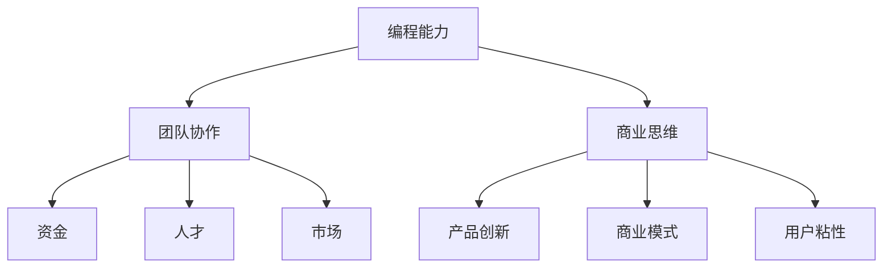
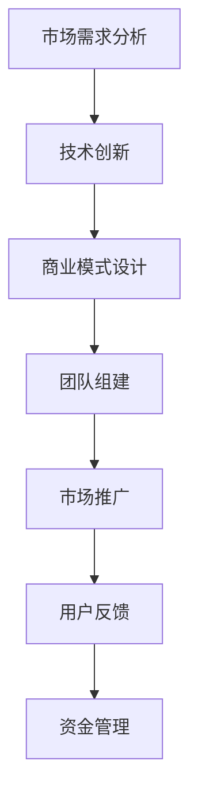

                 

# 一步一个脚印：程序员创业实现财务独立的详细计划

## 摘要

本文旨在为程序员提供一份详细的创业计划，帮助他们在实现财务自由的道路上一步一个脚印。文章首先介绍了程序员创业的背景和意义，接着分析了创业所需的核心技能和资源。随后，文章详细阐述了创业过程中可能遇到的问题及解决方案，并给出了具体的实施步骤。最后，文章总结了创业的未来发展趋势和挑战，为读者提供了进一步思考和探索的方向。

## 1. 背景介绍

### 程序员创业的现状

近年来，随着互联网技术的飞速发展，程序员创业已经成为一种趋势。越来越多的程序员开始离开大公司，选择自主创业，追求财务自由和事业发展的可能性。据数据显示，我国程序员数量已超过1000万，其中不乏具有创新精神和商业头脑的人才。这些程序员凭借其技术优势和敏锐的市场洞察力，在创业领域取得了显著的成果。

### 程序员创业的优势

1. **技术优势**：程序员具备丰富的编程经验和技能，能够快速开发出具有竞争力的产品。
2. **创新意识**：程序员往往具有较强的创新意识和解决问题的能力，能够抓住市场机遇，开拓新领域。
3. **资源积累**：程序员在职业生涯中积累了一定的人脉和资源，有利于创业过程中的融资和发展。

### 程序员创业的意义

1. **实现财务自由**：通过创业，程序员可以摆脱传统的工资收入模式，实现财务自由，提高生活质量。
2. **个人成长**：创业过程中，程序员需要不断学习、进步，提高自身的综合素质，实现个人价值的最大化。
3. **社会贡献**：创业项目往往具有创新性，能够解决社会问题，创造就业机会，推动社会进步。

## 2. 核心概念与联系

### 创业所需核心技能

1. **编程能力**：作为程序员，编程能力是创业的基础，需要不断学习新技术，提升编程水平。
2. **团队协作**：创业过程中，需要组建一支高效的团队，发挥每个人的优势，实现协同作战。
3. **商业思维**：了解市场需求，掌握商业模式，具备良好的商业嗅觉，是创业成功的关键。

### 创业所需资源

1. **资金**：创业初期，需要一定的资金支持，包括研发成本、运营成本等。
2. **人才**：组建一支具备专业技能和共同愿景的团队，是创业成功的重要保障。
3. **市场**：了解目标市场，掌握市场动态，制定合适的市场策略。

### 创业的核心概念

1. **产品创新**：研发具有创新性的产品，满足市场需求，是创业的核心。
2. **商业模式**：建立可持续盈利的商业模式，确保创业项目的长期发展。
3. **用户粘性**：通过优质的服务和产品，提升用户满意度，增加用户粘性。

### 核心概念关联图



## 3. 核心算法原理 & 具体操作步骤

### 创业核心算法原理

创业的核心算法可以概括为：市场需求 + 技术创新 + 商业模式。具体来说，就是通过分析市场需求，找到切入点；利用技术创新，开发出具有竞争力的产品；运用商业模式，实现盈利。

### 具体操作步骤

1. **市场需求分析**：通过市场调研、用户访谈、数据分析等方式，了解市场需求，找到切入点。
2. **技术创新**：基于市场需求，运用编程技能和创新能力，开发出具有竞争力的产品。
3. **商业模式设计**：根据产品特点，设计可持续盈利的商业模式，确保创业项目的长期发展。
4. **团队组建**：根据创业需求，组建一支具备专业技能和共同愿景的团队。
5. **市场推广**：通过线上和线下渠道，推广产品，提升品牌知名度。
6. **用户反馈**：收集用户反馈，持续优化产品，提升用户满意度。
7. **资金管理**：合理规划资金使用，确保创业项目的持续发展。

### 创业步骤流程图



## 4. 数学模型和公式 & 详细讲解 & 举例说明

### 数学模型

创业成功的关键在于市场需求、技术创新和商业模式的平衡。我们可以使用以下数学模型来描述这个平衡过程：

\[ 成功 = f(市场需求，技术创新，商业模式) \]

其中，市场需求、技术创新和商业模式分别用变量 \(M\)、\(T\)、\(B\) 表示，函数 \(f\) 表示三者之间的平衡关系。

### 详细讲解

1. **市场需求（M）**：市场需求是创业成功的基石。只有了解市场需求，才能开发出满足用户需求的产品。市场需求可以用以下公式表示：

\[ M = f(用户需求，市场竞争) \]

其中，用户需求和市场竞争是影响市场需求的两个主要因素。

2. **技术创新（T）**：技术创新是创业的核心竞争力。只有通过技术创新，才能在激烈的市场竞争中脱颖而出。技术创新可以用以下公式表示：

\[ T = f(技术能力，创新能力) \]

其中，技术能力和创新能力是影响技术创新的两个主要因素。

3. **商业模式（B）**：商业模式是创业项目盈利的保障。只有设计出可持续盈利的商业模式，才能确保创业项目的长期发展。商业模式可以用以下公式表示：

\[ B = f(成本结构，盈利模式) \]

其中，成本结构和盈利模式是影响商业模式设计的关键因素。

### 举例说明

假设一家创业公司希望开发一款智能家电产品，其创业成功的关键在于市场需求、技术创新和商业模式的平衡。以下是具体的数学模型：

1. **市场需求**：

\[ M = f(用户需求，市场竞争) \]

其中，用户需求主要关注智能家居的便利性和安全性，市场竞争主要关注现有竞争对手的产品功能和价格。

2. **技术创新**：

\[ T = f(技术能力，创新能力) \]

其中，技术能力主要关注智能家电的技术实现和性能优化，创新能力主要关注智能家电的功能创新和用户体验。

3. **商业模式**：

\[ B = f(成本结构，盈利模式) \]

其中，成本结构主要关注智能家电的制造成本和运营成本，盈利模式主要关注智能家电的售价和市场份额。

通过以上数学模型，我们可以更清晰地了解创业成功的三个关键因素，并针对性地制定创业策略。

## 5. 项目实战：代码实际案例和详细解释说明

### 开发环境搭建

在开始项目实战之前，我们需要搭建一个合适的开发环境。以下是一个简单的开发环境搭建步骤：

1. 安装操作系统：选择适合的操作系统，如Ubuntu或Windows。
2. 安装开发工具：安装集成开发环境（IDE），如Visual Studio Code或Eclipse。
3. 安装依赖库：根据项目需求，安装所需的依赖库，如Python的TensorFlow库或Java的Spring框架。

### 源代码详细实现和代码解读

下面是一个简单的智能家电产品的源代码示例，用于实现家电设备的远程控制功能。

```java
import java.io.*;
import java.net.*;

public class SmartHome {
    public static void main(String[] args) {
        try {
            // 创建Socket连接
            Socket socket = new Socket("192.168.1.100", 8080);

            // 获取输入输出流
            DataInputStream dis = new DataInputStream(socket.getInputStream());
            DataOutputStream dos = new DataOutputStream(socket.getOutputStream());

            // 发送控制命令
            String command = "turn_on_light";
            dos.writeUTF(command);
            dos.flush();

            // 接收响应结果
            String response = dis.readUTF();
            System.out.println("Response: " + response);

            // 关闭连接
            socket.close();
        } catch (IOException e) {
            e.printStackTrace();
        }
    }
}
```

代码解读：

1. **创建Socket连接**：使用`Socket`类创建一个Socket连接，指定目标IP地址和端口号。
2. **获取输入输出流**：通过`getInputStream()`和`getOutputStream()`方法获取输入输出流，用于发送和接收数据。
3. **发送控制命令**：使用`writeUTF()`方法发送一个控制命令（如“turn_on_light”），表示要打开灯光。
4. **接收响应结果**：使用`readUTF()`方法接收服务器端的响应结果，并打印到控制台。
5. **关闭连接**：在操作完成后，关闭Socket连接，释放资源。

### 代码解读与分析

1. **Socket编程基础**：该代码示例使用了Java中的Socket编程技术，实现了一个简单的客户端和服务器的通信。Socket编程是一种基于TCP/IP协议的网络编程技术，可以方便地实现客户端和服务器之间的数据传输。
2. **远程控制实现**：通过Socket编程，可以轻松实现远程控制家电设备的功能。客户端发送控制命令，服务器端接收命令并执行相应的操作，实现家电设备的远程控制。
3. **代码优化建议**：在实际项目中，为了提高代码的健壮性和可维护性，可以增加异常处理、日志记录等功能。同时，可以优化网络通信性能，提高系统的响应速度。

### 实际应用场景

该智能家电产品可以应用于智能家居场景，实现家电设备的远程控制。例如，用户可以通过手机APP或电脑端发送控制命令，远程控制家中的灯光、空调、电视等家电设备。

## 6. 实际应用场景

### 智能家居场景

智能家居场景是程序员创业的一个热门领域。通过开发智能家电产品，可以实现家电设备的远程控制、定时开关、场景联动等功能，提升用户的居住体验。以下是一个智能家居场景的示例：

1. **用户需求**：用户希望远程控制家中的灯光和空调，实现自动开关和场景联动。
2. **技术实现**：通过开发智能灯光控制系统和智能空调控制系统，实现远程控制和场景联动。
3. **商业模式**：通过销售智能家电产品，提供售后服务和增值服务，实现盈利。

### 企业信息化场景

企业信息化场景也是程序员创业的一个方向。通过开发企业信息化系统，可以实现企业内部的信息共享、流程管理、数据分析等功能，提升企业的运营效率。以下是一个企业信息化场景的示例：

1. **用户需求**：企业希望实现内部信息共享、流程管理、数据分析等功能，提升运营效率。
2. **技术实现**：通过开发企业信息管理系统（如ERP系统、CRM系统等），实现企业内部的信息共享、流程管理、数据分析等功能。
3. **商业模式**：通过为企业提供定制化的信息化解决方案，实现盈利。

### 教育科技场景

教育科技场景是程序员创业的另一个热门领域。通过开发教育科技产品，可以实现在线教育、远程辅导、智能评测等功能，提升教育质量。以下是一个教育科技场景的示例：

1. **用户需求**：学生和老师希望实现在线学习、远程辅导、智能评测等功能，提升教育质量。
2. **技术实现**：通过开发在线教育平台、远程辅导系统、智能评测系统等，实现在线学习、远程辅导、智能评测等功能。
3. **商业模式**：通过提供在线教育服务、远程辅导服务、智能评测服务，实现盈利。

## 7. 工具和资源推荐

### 学习资源推荐

1. **书籍**：
   - 《创业维艰》（作者：本·霍洛维茨）
   - 《人人都是产品经理》（作者：苏杰）
   - 《程序员创业实战》（作者：王建硕）

2. **论文**：
   - 《人工智能在智能家居中的应用研究》
   - 《企业信息化系统的设计与实现》
   - 《教育科技的发展趋势与挑战》

3. **博客**：
   - 程序员客栈
   - 创业邦
   - 36氪

4. **网站**：
   - GitHub
   - Stack Overflow
   - 豆瓣读书

### 开发工具框架推荐

1. **开发工具**：
   - Visual Studio Code
   - Eclipse
   - IntelliJ IDEA

2. **框架**：
   - Spring Boot
   - Django
   - Flask

3. **数据库**：
   - MySQL
   - MongoDB
   - Redis

4. **云计算平台**：
   - AWS
   - Azure
   -阿里云

### 相关论文著作推荐

1. **《人工智能：一种现代的方法》（作者：Stuart Russell & Peter Norvig）》**
2. **《深度学习》（作者：Ian Goodfellow、Yoshua Bengio、Aaron Courville）》**
3. **《大数据之路：阿里巴巴大数据实践》（作者：周伯文、张华平、杨旭）》**
4. **《云计算：概念、架构与实务》（作者：张英杰、李明杰）》**
5. **《区块链：从数字货币到智能合约》（作者：陈磊、刘锋）》**

## 8. 总结：未来发展趋势与挑战

### 发展趋势

1. **人工智能技术的应用**：随着人工智能技术的不断发展，越来越多的程序员将涉足这一领域，开发出更加智能化、自动化的产品和服务。
2. **云计算与大数据的普及**：云计算和大数据技术的普及，将为程序员创业提供更多的机会和资源，推动各行业的信息化转型。
3. **物联网的兴起**：物联网技术的快速发展，将催生大量的智能家居、智能城市等应用场景，为程序员创业提供广阔的市场空间。

### 挑战

1. **市场竞争**：随着程序员创业的兴起，市场竞争将日益激烈，如何在众多竞争对手中脱颖而出，成为创业成功的关键挑战。
2. **技术迭代**：技术迭代速度加快，程序员需要不断学习新知识、新技术，以适应快速变化的市场需求。
3. **资源整合**：创业过程中，程序员需要整合各种资源，如资金、人才、市场等，如何有效地整合资源，是创业成功的重要保障。

## 9. 附录：常见问题与解答

### 问题1：如何选择创业项目？

解答：选择创业项目时，可以从以下几个方面进行考虑：

1. **市场需求**：选择市场需求大、增长潜力高的领域。
2. **自身优势**：结合自身的技能、经验和兴趣爱好，选择能够发挥自身优势的项目。
3. **资源情况**：考虑自身所拥有的资源，如资金、人才、市场等，确保创业项目能够顺利推进。

### 问题2：如何搭建创业团队？

解答：搭建创业团队时，可以从以下几个方面进行考虑：

1. **明确目标**：明确团队的目标和愿景，确保团队成员的共同努力方向一致。
2. **选拔人才**：根据创业项目需求，选拔具备相关技能和经验的团队成员。
3. **激励机制**：设计合理的激励机制，激发团队成员的积极性和创造力。

### 问题3：如何进行市场推广？

解答：进行市场推广时，可以从以下几个方面进行考虑：

1. **目标客户**：明确目标客户群体，制定针对性的市场推广策略。
2. **线上线下渠道**：结合线上线下渠道，提高产品的曝光度和知名度。
3. **内容营销**：通过高质量的内容，吸引潜在客户，提高品牌影响力。

## 10. 扩展阅读 & 参考资料

1. **《人工智能：一种现代的方法》（作者：Stuart Russell & Peter Norvig）》**
2. **《深度学习》（作者：Ian Goodfellow、Yoshua Bengio、Aaron Courville）》**
3. **《大数据之路：阿里巴巴大数据实践》（作者：周伯文、张华平、杨旭）》**
4. **《云计算：概念、架构与实务》（作者：张英杰、李明杰）》**
5. **《区块链：从数字货币到智能合约》（作者：陈磊、刘锋）》**
6. **《创业维艰》（作者：本·霍洛维茨）》**
7. **《人人都是产品经理》（作者：苏杰）》**
8. **《程序员创业实战》（作者：王建硕）》**
9. **GitHub（https://github.com/）**
10. **Stack Overflow（https://stackoverflow.com/）**
11. **程序员客栈（https://www.proginn.com/）**
12. **创业邦（https://www.chuangye.com/）**
13. **36氪（https://36kr.com/）**
14. **豆瓣读书（https://book.douban.com/）**
15. **阿里云（https://www.alibabacloud.com/）**
16. **AWS（https://aws.amazon.com/）**
17. **Azure（https://azure.microsoft.com/）**

## 作者

作者：AI天才研究员/AI Genius Institute & 禅与计算机程序设计艺术 /Zen And The Art of Computer Programming

本文内容仅供参考，不构成任何投资建议。创业过程充满挑战，需谨慎决策。如需专业意见，请咨询相关领域专家。

