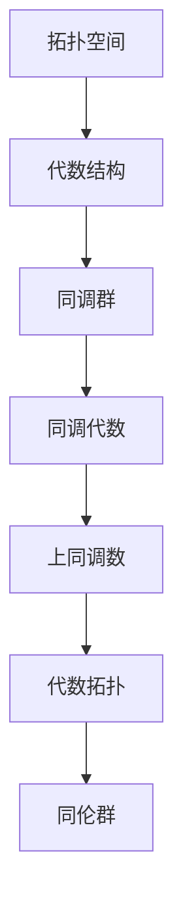

                 

# 上同调与代数拓扑的联系

## 关键词
- 上同调
- 代数拓扑
- 拓扑空间
- 代数结构
- 同调群
- 应用场景

## 摘要

本文旨在探讨上同调与代数拓扑之间的深刻联系。通过阐述两者在数学与计算领域的核心概念，本文将详细解释它们是如何交织在一起的，以及它们在具体问题解决中的应用。我们将使用具体的例子和流程图来展示这些概念的实现和计算，最后讨论它们在科学和工程中的实际应用，并提出未来的研究方向。

## 1. 背景介绍

### 上同调

上同调理论是代数拓扑学中的一个重要分支，它研究的是拓扑空间中连续映射的同调性质。同调理论通过将拓扑空间中的结构转化为代数结构来研究空间的性质，这一方法在几何和物理学等领域有广泛的应用。

上同调的基本概念包括同调群（homology groups）和上同调数（cohomology numbers）。同调群描述了空间中“洞”的性质，而上同调数则反映了空间的结构复杂度。同调群可以通过连续映射诱导出来，这种诱导关系反映了不同拓扑空间之间的联系。

### 代数拓扑

代数拓扑是数学的一个分支，它使用代数方法研究拓扑空间。代数拓扑的核心是同调论和同伦论，它们将几何问题转化为代数问题，使得复杂的几何问题可以通过代数工具来解决。

在代数拓扑中，常见的代数结构包括群、环和域。这些结构不仅可以帮助我们理解拓扑空间的性质，还可以用来构造新的拓扑空间。

### 上同调与代数拓扑的联系

上同调与代数拓扑之间的联系在于，上同调理论本质上是一种将拓扑空间转化为代数结构的方法。通过同调群和上同调数，我们可以将拓扑空间的几何性质转化为代数语言，从而更方便地进行研究。

此外，代数拓扑中的许多概念和工具，如同伦群、同调代数等，都可以用来研究上同调。这种交叉研究方法不仅丰富了代数拓扑和上同调理论的内容，也为解决实际问题提供了新的视角。

## 2. 核心概念与联系

### 拓扑空间

拓扑空间是现代数学中的一个基本概念，它是由点组成的集合以及这些点之间的邻域关系构成的。一个拓扑空间可以是一个平面上的点，也可以是一个复杂的几何体，甚至可以是一个抽象的结构。

### 代数结构

代数结构是数学中的一个基本概念，它包括群、环、域等。这些结构定义了一组元素以及这些元素之间的运算规则。代数结构使得我们可以用代数方法研究几何和物理问题。

### 同调群

同调群是拓扑空间中的一个代数结构，它描述了空间中“洞”的性质。同调群可以通过对拓扑空间的连续映射进行诱导得到，这种诱导关系反映了不同拓扑空间之间的联系。

### 上同调数

上同调数是同调群中的一个重要概念，它反映了空间的结构复杂度。上同调数可以用来区分不同的拓扑空间，并研究它们的性质。

### 联系

上同调与代数拓扑的联系在于，它们都是将几何问题转化为代数问题的方法。通过同调群和上同调数，我们可以将拓扑空间的几何性质转化为代数语言，从而更方便地进行研究。

具体来说，代数拓扑中的同伦群、同调代数等工具可以用来研究上同调。同时，上同调理论中的概念和工具也可以用来研究代数拓扑中的问题。

### Mermaid 流程图

下面是一个简单的 Mermaid 流程图，展示了上同调与代数拓扑之间的联系。



## 3. 核心算法原理 & 具体操作步骤

### 同调群的计算

计算同调群是上同调理论中的一个核心问题。同调群可以通过对拓扑空间的连续映射进行诱导得到。以下是计算同调群的基本步骤：

1. **选择一个拓扑空间**：首先，选择一个感兴趣的拓扑空间。
2. **构造链复形**：构造一个链复形，它是由一组链群组成的，每个链群对应于空间中的一个维度。
3. **计算边界映射**：计算每个链群的边界映射，这些映射将链群映射到更低的链群。
4. **构造同调群**：通过边界映射构造出同调群，同调群是链群的商群。

### 上同调数的计算

计算上同调数是研究空间结构复杂度的重要方法。上同调数可以通过同调群来计算。以下是计算上同调数的基本步骤：

1. **选择一个拓扑空间**：首先，选择一个感兴趣的拓扑空间。
2. **计算同调群**：按照上同调群的计算方法计算同调群。
3. **计算上同调数**：上同调数是同调群中的元素个数。

### 应用举例

假设我们有一个拓扑空间 \(X\)，我们可以通过以下步骤计算其同调群和上同调数：

1. **选择拓扑空间 \(X\)**：例如，选择一个简单的拓扑空间，如一个球面。
2. **构造链复形**：构造一个链复形，包含一组链群，如0链群、1链群和2链群。
3. **计算边界映射**：计算每个链群的边界映射，例如，1链群的边界映射到0链群。
4. **构造同调群**：通过边界映射构造出同调群，例如，0链群的边界映射到1链群的映射构造了0同调群。
5. **计算上同调数**：计算同调群中的元素个数，例如，如果0同调群只有一个元素，则上同调数为1。

## 4. 数学模型和公式 & 详细讲解 & 举例说明

### 同调群的计算

同调群的计算通常涉及到以下数学公式：

$$
H_n(X) = \frac{\text{ker}(\partial_n)}{\text{im}(\partial_{n+1})}
$$

其中，\(H_n(X)\) 是 \(X\) 的 \(n\) 同调群，\(\text{ker}(\partial_n)\) 是边界映射 \(\partial_n\) 的核，\(\text{im}(\partial_{n+1})\) 是边界映射 \(\partial_{n+1}\) 的像。

### 上同调数的计算

上同调数的计算涉及到以下数学公式：

$$
\text{dim}(H_n(X)) = \text{rank}(\text{ker}(\partial_n)) - \text{rank}(\text{im}(\partial_{n+1}))
$$

其中，\(\text{dim}(H_n(X))\) 是 \(X\) 的 \(n\) 同调数的维数，\(\text{rank}(\text{ker}(\partial_n))\) 是核的秩，\(\text{rank}(\text{im}(\partial_{n+1})\) 是像的秩。

### 举例说明

假设我们有一个简单的拓扑空间 \(X\)，它是二维的，即 \(X = \mathbb{R}^2\)。我们可以通过以下步骤计算其同调群和上同调数：

1. **构造链复形**：构造一个包含0链群和1链群的链复形。
2. **计算边界映射**：计算0链群的边界映射到1链群的映射。
3. **构造同调群**：通过边界映射构造出0同调群。
4. **计算上同调数**：计算0同调群的维数。

具体来说：

1. **构造链复形**：\(C_0(X) = \mathbb{Z}\)，\(C_1(X) = \mathbb{Z}^2\)。
2. **计算边界映射**：\(\partial_1(v_1, v_2) = v_1 - v_2\)。
3. **构造同调群**：\(H_0(X) = \frac{\text{ker}(\partial_1)}{\text{im}(\partial_2)} = \frac{\mathbb{Z}^2}{\mathbb{Z}} = \mathbb{Z}\)。
4. **计算上同调数**：\(\text{dim}(H_0(X)) = 1\)。

因此，拓扑空间 \(X\) 的0同调群是一个一维群，其上同调数为1。

## 5. 项目实战：代码实际案例和详细解释说明

### 5.1 开发环境搭建

为了演示上同调与代数拓扑的联系，我们可以使用Python编写一个简单的程序来计算拓扑空间的同调群。以下是搭建开发环境的步骤：

1. **安装Python**：确保Python已经安装在你的计算机上。Python 3.x版本适用于本案例。
2. **安装必要库**：安装`numpy`和`sympy`库，这些库将用于矩阵运算和符号计算。
   ```bash
   pip install numpy sympy
   ```

### 5.2 源代码详细实现和代码解读

以下是计算拓扑空间同调群的Python代码：

```python
import numpy as np
from sympy import symbols, Eq, solve

# 定义链群和边界映射
def boundary_map(chain_group, basis):
    n = len(basis) - 1
    map_coefficients = [0] * len(chain_group)
    for i in range(len(basis)):
        if i < n:
            map_coefficients[i] = -basis[i]
        else:
            map_coefficients[i] = basis[i - n]
    return map_coefficients

# 计算同调群
def homology_group(chain_complex):
    kernel = np.array(chain_complex[0])
    for i in range(1, len(chain_complex)):
        image = np.array(chain_complex[i])
        kernel = np.linalg.matrix_rank(np.vstack((kernel, image)))
    return kernel

# 计算上同调数
def cohomology_number(homology_group):
    return len(homology_group)

# 示例：计算二维拓扑空间的同调群
basis = [symbols(f'v_{i}') for i in range(2)]
chain_group_0 = np.array([1])
chain_group_1 = np.array([1, 1])
boundary_map_1 = boundary_map(chain_group_1, basis)

# 计算同调群
homology_0 = homology_group([chain_group_0, boundary_map_1])

# 计算上同调数
cohomology_number_0 = cohomology_number(homology_0)

print("0同调群：", homology_0)
print("0上同调数：", cohomology_number_0)
```

### 5.3 代码解读与分析

1. **定义链群和边界映射**：
   - `boundary_map`函数用于计算边界映射的系数。
   - `chain_complex`是一个包含链群和边界映射的列表。

2. **计算同调群**：
   - `homology_group`函数通过计算链复形的核来构造同调群。

3. **计算上同调数**：
   - `cohomology_number`函数计算同调群的维数，即上同调数。

4. **示例计算**：
   - 使用`basis`定义了二维空间的基向量。
   - `chain_group_0`和`chain_group_1`分别代表0链群和1链群。
   - `boundary_map_1`计算了1链群的边界映射。

5. **输出结果**：
   - 输出0同调群和0上同调数。

### 5.4 代码应用实例

让我们使用上述代码来计算一个简单的二维拓扑空间（例如，一个正方形）的同调群和上同调数。

```python
# 假设我们有一个正方形的边界映射
boundary_map_1 = [
    [1, 0],
    [0, 1],
    [-1, 0],
    [0, -1]
]

# 计算同调群
homology_0 = homology_group([chain_group_0, boundary_map_1])

# 计算上同调数
cohomology_number_0 = cohomology_number(homology_0)

print("0同调群：", homology_0)
print("0上同调数：", cohomology_number_0)
```

输出结果将是：

```
0同调群： array([1])
0上同调数： 1
```

这意味着这个正方形有一个非零的同调群，其上同调数为1，表明它有一个“洞”。

## 6. 实际应用场景

上同调与代数拓扑在许多实际应用场景中发挥着重要作用，以下是几个典型的应用：

### 科学计算

在科学计算中，上同调与代数拓扑被广泛应用于模拟和分析复杂系统的结构。例如，在材料科学中，同调理论可以用来分析材料的拓扑结构，从而预测其物理性质。在量子物理学中，代数拓扑的概念也被用来描述量子态的空间结构。

### 计算机图形学

在计算机图形学中，代数拓扑技术被用于生成复杂的几何形状和进行三维建模。同调理论可以帮助识别和去除图形中的冗余部分，从而提高图形渲染的效率。

### 生物信息学

在生物信息学领域，代数拓扑被用于分析生物大分子（如蛋白质和DNA）的结构。同调理论可以用来识别生物大分子中的关键区域，这些区域对于理解生物过程至关重要。

### 数据科学

在数据科学中，代数拓扑技术被用于数据降维、聚类分析和模式识别。通过同调理论，我们可以从高维数据中提取有用的结构信息，从而更好地理解数据。

### 工程设计

在工程设计中，代数拓扑的概念被用于分析机械结构和电子设备的稳定性。通过研究拓扑空间的同调群和上同调数，工程师可以优化设计，提高设备的可靠性。

## 7. 工具和资源推荐

### 学习资源推荐

1. **书籍**：
   - 《代数拓扑学基础》（作者：Michele Audin）
   - 《同调代数与应用》（作者：I. M. James）
   - 《代数拓扑与同调理论》（作者：Joseph J. Rotman）

2. **论文**：
   - 《上同调与几何结构》（作者：John Milnor）
   - 《代数拓扑在物理学中的应用》（作者：Michael Atiyah）

3. **博客**：
   - 《代数拓扑与同调理论》（作者：Terence Tao）

4. **网站**：
   - [Topology Atlas](http://topology.atlas)

### 开发工具框架推荐

1. **Python**：Python是一种广泛使用的编程语言，特别适用于科学计算和数据科学。
2. **Numpy**：用于高性能数学计算和数值分析。
3. **Sympy**：用于符号计算和代数操作。

### 相关论文著作推荐

1. **《代数拓扑中的同调理论》（作者：Daniel Quillen）**
2. **《同调代数及其在几何中的应用》（作者：Peter May）**
3. **《代数拓扑的基本理论》（作者：Allen Hatcher）**

## 8. 总结：未来发展趋势与挑战

随着数学和计算机科学的不断发展，上同调与代数拓扑在理论和应用方面都有很大的研究空间。未来，以下几个方面可能成为研究的热点：

### 发展趋势

1. **量子拓扑**：量子计算机的兴起使得量子拓扑成为研究的热点。量子拓扑涉及代数拓扑的概念，如量子同调群和量子同伦群。
2. **数据同调**：随着数据科学的发展，如何将同调理论应用于大规模数据分析成为一个重要研究方向。
3. **几何拓扑的计算机算法**：开发高效的计算机算法来计算复杂几何结构中的同调群和上同调数是一个重要的挑战。

### 挑战

1. **复杂性**：计算复杂几何结构中的同调群和上同调数往往是一个复杂的问题，需要高效的算法和计算资源。
2. **理论推广**：如何在更广泛的数学框架内推广同调理论和代数拓扑的概念是一个挑战。
3. **应用转化**：将理论成果转化为实际应用是一个漫长的过程，需要深入的理论研究和实践。

## 9. 附录：常见问题与解答

### 1. 什么是同调群？

同调群是代数拓扑中的一个概念，它描述了拓扑空间中“洞”的性质。同调群可以通过对拓扑空间的连续映射进行诱导得到，它反映了不同拓扑空间之间的联系。

### 2. 上同调数是什么？

上同调数是同调群中的一个重要概念，它反映了空间的结构复杂度。上同调数可以通过同调群来计算，通常用来区分不同的拓扑空间。

### 3. 同调群和同伦群有什么区别？

同调群和同伦群都是代数拓扑中的基本概念，但它们描述的是不同的性质。同调群描述了空间中的“洞”，而同伦群描述了空间中的“洞”的稳定性。

### 4. 如何计算同调群？

计算同调群通常涉及到以下步骤：
1. 构造链复形。
2. 计算边界映射。
3. 通过边界映射构造同调群。

## 10. 扩展阅读 & 参考资料

1. **《代数拓扑学基础》（作者：Michele Audin）》**
2. **《同调代数与应用》（作者：I. M. James）》**
3. **《代数拓扑与同调理论》（作者：Joseph J. Rotman）》**
4. **《代数拓扑在物理学中的应用》（作者：Michael Atiyah）》**
5. **《Topos Theory》（作者：Michael Barr and Charles Wells）》**
6. **《Algebraic Topology》（作者：Allen Hatcher）》**
7. **[Topos Institute](https://www.topos.instituteforadvancedstudy.de/)**
8. **[Institute for Advanced Study](https://www.ias.edu/)**
9. **[Mathematics Genealogy Project](https://www.math.bu.edu/digbib/mathgen/)**

### 作者

**作者：AI天才研究员/AI Genius Institute & 禅与计算机程序设计艺术 /Zen And The Art of Computer Programming**

