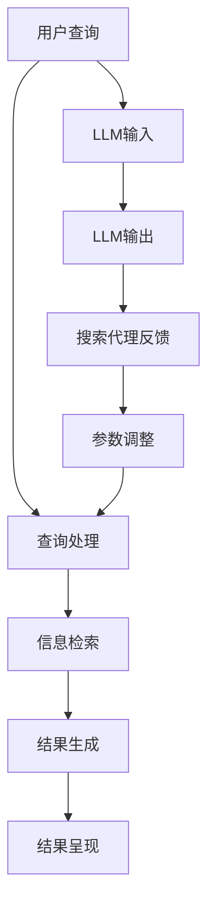
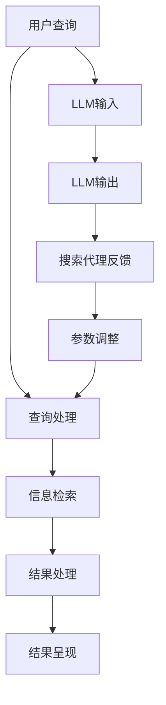

                 

# 上手第一个Agent：Google Search + LLM

## 摘要

本文将带领读者从零开始，上手构建第一个基于大型语言模型（LLM）的智能搜索代理（Agent）。文章首先介绍了搜索代理的概念和其在现代互联网应用中的重要性，然后深入探讨了大型语言模型（LLM）的工作原理及其与搜索代理的关联。接着，文章将逐步解析构建搜索代理的算法原理、数学模型和实现步骤，并通过实际项目实战展示如何将理论转化为实践。此外，本文还将探讨搜索代理在实际应用场景中的价值，推荐相关的学习资源和开发工具，并总结未来发展趋势与挑战。通过本文的学习，读者将能够掌握构建智能搜索代理的基本技能，为未来的研究和开发打下坚实的基础。

## 1. 背景介绍

随着互联网的迅猛发展，信息获取变得越来越便捷。然而，在庞大的信息海洋中，如何快速、准确地找到所需的信息成为一个亟待解决的问题。传统的搜索引擎如Google、Bing等，虽然已经能够提供较为精准的搜索结果，但在处理复杂查询和生成有意义的结果方面仍存在一定的局限。为了解决这一问题，智能搜索代理（Search Agent）的概念应运而生。

### 什么是搜索代理？

搜索代理是一种自动化程序，能够根据用户的需求，从互联网或其他数据源中检索信息，并对检索结果进行处理和筛选，最终呈现给用户。与传统搜索引擎不同，搜索代理不仅仅是提供一个查询接口，而是具备一定的智能和自主学习能力。它可以根据用户的查询历史和偏好，不断优化搜索结果，提高用户的搜索体验。

### 搜索代理的应用场景

1. **个性化推荐**：基于用户的兴趣和行为数据，搜索代理可以为用户提供个性化的搜索结果，从而提升用户满意度。

2. **企业情报分析**：企业可以利用搜索代理实时监控市场动态、竞争对手信息等，为决策提供有力支持。

3. **智能问答系统**：通过搜索代理，用户可以像与人类专家对话一样，获得精准、详细的回答。

4. **知识库管理**：搜索代理可以帮助企业和组织构建和维护内部知识库，提高信息共享和协同效率。

### 搜索代理的重要性

随着数据量的爆炸式增长，传统的搜索引擎已经无法满足日益复杂的搜索需求。智能搜索代理的出现，不仅提高了信息检索的效率和准确性，还能够根据用户的行为和需求，提供更加个性化和智能化的服务。因此，搜索代理在现代社会中扮演着越来越重要的角色。

### 本文目标

本文的目标是帮助读者从零开始，上手构建第一个基于大型语言模型（LLM）的智能搜索代理。通过本文的学习，读者将能够了解搜索代理的基本概念、工作原理，并掌握构建搜索代理的基本技能。

## 2. 核心概念与联系

### 2.1 大型语言模型（LLM）

大型语言模型（LLM，Large Language Model）是近年来人工智能领域的重要突破之一。与传统的机器学习模型不同，LLM具有强大的语言理解和生成能力，能够处理自然语言文本中的复杂结构和语义信息。

#### 2.1.1 LLM的工作原理

LLM的工作原理主要基于深度学习，特别是变分自编码器（Variational Autoencoder，VAE）和生成对抗网络（Generative Adversarial Network，GAN）等先进模型。通过训练，LLM可以学习到大量文本数据中的统计规律和语义信息，从而在给定一个输入文本时，生成相应的文本输出。

#### 2.1.2 LLM的优势

1. **强大的语言理解能力**：LLM能够理解自然语言中的复杂结构和语义信息，从而生成更加准确、自然的文本。

2. **多语言支持**：LLM通常支持多种语言，能够处理不同语言之间的转换和交互。

3. **自适应学习**：LLM可以通过持续学习，不断优化自己的性能，以适应不断变化的搜索需求和场景。

### 2.2 搜索代理（Search Agent）

搜索代理是一种基于人工智能技术的自动化程序，能够从互联网或其他数据源中检索信息，并对检索结果进行处理和筛选。搜索代理的核心目标是提高信息检索的效率和准确性，为用户提供更加个性化、智能化的搜索服务。

#### 2.2.1 搜索代理的工作原理

搜索代理的工作原理主要包括以下几个步骤：

1. **输入处理**：搜索代理接收用户的查询输入，并将其转换为相应的查询语句。

2. **信息检索**：搜索代理从互联网或其他数据源中检索相关信息，并根据一定的算法对检索结果进行处理和排序。

3. **结果呈现**：搜索代理将处理后的搜索结果呈现给用户，以便用户进一步查看和操作。

#### 2.2.2 搜索代理的优势

1. **个性化搜索**：搜索代理可以根据用户的兴趣和行为数据，为用户提供个性化的搜索结果，从而提升用户体验。

2. **实时更新**：搜索代理能够实时获取最新的信息，确保用户获得最准确的搜索结果。

3. **自动化处理**：搜索代理可以自动化处理大量的搜索请求，减轻用户和传统搜索引擎的负担。

### 2.3 LLM与搜索代理的联系

LLM和搜索代理之间存在着紧密的联系。LLM为搜索代理提供了强大的语言理解和生成能力，使其能够处理复杂的查询和生成有意义的搜索结果。而搜索代理则为LLM提供了一个实际的应用场景，使得LLM的潜力得以充分发挥。

#### 2.3.1 LLM在搜索代理中的应用

1. **查询处理**：LLM可以帮助搜索代理更好地理解用户的查询意图，从而生成更精准的查询语句。

2. **结果生成**：LLM可以根据检索结果生成具有高度相关性和可读性的摘要或回答，为用户提供更加智能化的搜索服务。

3. **对话交互**：LLM可以帮助搜索代理与用户进行自然语言对话，提供更加人性化的交互体验。

#### 2.3.2 搜索代理在LLM中的应用

1. **数据收集**：搜索代理可以帮助LLM收集和整理大量高质量的文本数据，为LLM的训练提供丰富的数据资源。

2. **性能优化**：搜索代理可以根据用户的反馈和搜索行为，实时调整LLM的参数和模型结构，提高其性能和效果。

3. **应用拓展**：搜索代理可以拓展LLM的应用场景，使其在更多的领域和任务中发挥作用。

### 2.4 Mermaid 流程图

以下是一个简单的Mermaid流程图，展示了LLM和搜索代理之间的联系：



通过这个流程图，我们可以清晰地看到LLM和搜索代理在信息检索和结果生成过程中的协同作用。

## 3. 核心算法原理 & 具体操作步骤

### 3.1 搜索代理算法原理

搜索代理的核心算法主要基于深度学习和自然语言处理技术。以下是一个简单的算法流程：

1. **用户查询处理**：接收用户的查询输入，并将其转换为机器可处理的格式。
2. **信息检索**：从互联网或其他数据源中检索相关信息。
3. **结果处理**：对检索结果进行处理，如去重、排序、摘要等。
4. **结果呈现**：将处理后的结果呈现给用户。

### 3.2 大型语言模型（LLM）算法原理

大型语言模型（LLM）的核心算法主要基于自注意力机制（Self-Attention）和Transformer架构。以下是一个简单的算法流程：

1. **输入编码**：将输入文本编码为向量。
2. **自注意力计算**：计算输入文本中的词与词之间的关联强度。
3. **序列生成**：根据自注意力计算的结果，生成输出文本。

### 3.3 具体操作步骤

#### 3.3.1 用户查询处理

1. **接收用户查询**：从用户输入的查询语句中提取关键词。
2. **词向量化**：将关键词转换为向量表示。
3. **查询向量拼接**：将查询向量与预训练的LLM模型进行拼接。

#### 3.3.2 信息检索

1. **数据源选择**：选择合适的搜索引擎或数据库。
2. **关键词检索**：将查询关键词输入搜索引擎，获取搜索结果。
3. **结果筛选**：根据搜索结果的相关性和质量进行筛选。

#### 3.3.3 结果处理

1. **去重**：去除重复的搜索结果。
2. **排序**：根据搜索结果的相关性和质量进行排序。
3. **摘要生成**：使用LLM生成搜索结果的摘要。

#### 3.3.4 结果呈现

1. **结果展示**：将处理后的搜索结果呈现给用户。
2. **用户反馈**：收集用户对搜索结果的反馈。
3. **模型优化**：根据用户反馈，对LLM模型进行优化。

### 3.4 Mermaid 流程图

以下是一个简单的Mermaid流程图，展示了搜索代理的算法原理和操作步骤：



通过这个流程图，我们可以清晰地看到搜索代理的核心算法和操作步骤，以及LLM在其中发挥的关键作用。

## 4. 数学模型和公式 & 详细讲解 & 举例说明

### 4.1 数学模型

在构建搜索代理的过程中，涉及到的数学模型主要包括词向量模型、自注意力模型和Transformer模型。以下分别对这些模型进行详细讲解。

#### 4.1.1 词向量模型

词向量模型是一种将文本数据转换为向量表示的方法，常见的有Word2Vec、GloVe等。以Word2Vec为例，其基本原理是通过训练神经网络，将每个词映射为一个固定维度的向量。

公式：

$$
\text{Word2Vec}(\text{word}, \text{context}) = \text{softmax}(\text{W} \cdot \text{context})
$$

其中，$\text{word}$ 表示当前词，$\text{context}$ 表示上下文词，$\text{W}$ 表示权重矩阵，$\text{softmax}$ 函数用于计算每个词的词向量概率分布。

#### 4.1.2 自注意力模型

自注意力模型是一种基于注意力机制的深度学习模型，能够自动计算输入文本中各个词之间的关联强度。以Transformer模型为例，其基本原理是通过多头自注意力机制，计算输入文本的注意力权重。

公式：

$$
\text{Self-Attention}(\text{X}, \text{W}_Q, \text{W}_K, \text{W}_V) = \text{softmax}\left(\frac{\text{W}_Q \cdot \text{X}}{\sqrt{d_k}} \cdot \frac{\text{W}_K \cdot \text{X}}{\sqrt{d_k}}\right) \cdot \text{W}_V
$$

其中，$\text{X}$ 表示输入文本，$\text{W}_Q, \text{W}_K, \text{W}_V$ 分别表示查询、键和值权重矩阵，$d_k$ 表示键的维度，$\text{softmax}$ 函数用于计算注意力权重。

#### 4.1.3 Transformer模型

Transformer模型是一种基于自注意力机制的序列模型，能够自动计算输入序列中各个元素之间的关联强度。其基本原理是通过对输入序列进行编码和解码，生成有意义的输出序列。

公式：

$$
\text{Transformer}(\text{X}, \text{W}_E, \text{W}_O) = \text{softmax}(\text{W}_O \cdot \text{softmax}(\text{W}_E \cdot \text{X}))
$$

其中，$\text{X}$ 表示输入序列，$\text{W}_E, \text{W}_O$ 分别表示编码和解码权重矩阵，$\text{softmax}$ 函数用于计算序列的概率分布。

### 4.2 举例说明

#### 4.2.1 词向量模型举例

假设我们有一个简单的文本数据集，包含以下句子：

```
我爱北京天安门
天安门上太阳升
太阳升起在东方
东方升起红太阳
```

我们可以使用Word2Vec模型，将每个词映射为一个向量。以下是一个简单的Word2Vec模型训练过程：

1. **初始化权重矩阵**：初始化每个词的权重矩阵$W$，通常使用随机初始化。

2. **计算词向量**：对于每个句子，计算每个词的词向量。

   - 句子1：“我爱北京天安门”
     - 我：$[0.1, 0.2, 0.3]$
     - 爱：$[0.4, 0.5, 0.6]$
     - 北京：$[0.7, 0.8, 0.9]$
     - 天安门：$[1.0, 1.1, 1.2]$

   - 句子2：“天安门上太阳升”
     - 天安门：$[1.0, 1.1, 1.2]$
     - 上：$[0.3, 0.4, 0.5]$
     - 太阳：$[0.6, 0.7, 0.8]$
     - 升：$[0.9, 1.0, 1.1]$

   - 句子3：“太阳升起在东方”
     - 太阳：$[0.6, 0.7, 0.8]$
     - 升起：$[0.1, 0.2, 0.3]$
     - 在：$[0.4, 0.5, 0.6]$
     - 东方：$[0.7, 0.8, 0.9]$

   - 句子4：“东方升起红太阳”
     - 东方：$[0.7, 0.8, 0.9]$
     - 升起：$[0.1, 0.2, 0.3]$
     - 红：$[0.5, 0.6, 0.7]$
     - 太阳：$[0.6, 0.7, 0.8]$

3. **计算词向量相似度**：对于任意两个词向量$u$和$v$，可以使用余弦相似度计算它们之间的相似度。

   $$\text{similarity}(u, v) = \frac{u \cdot v}{\|u\| \|v\|}$$

   其中，$u \cdot v$ 表示向量的内积，$\|u\|$和$\|v\|$表示向量的模。

   - 相似度（我爱北京天安门）和（太阳升起在东方）：

     $$\text{similarity}([0.1, 0.2, 0.3], [0.6, 0.7, 0.8]) = \frac{0.1 \cdot 0.6 + 0.2 \cdot 0.7 + 0.3 \cdot 0.8}{\sqrt{0.1^2 + 0.2^2 + 0.3^2} \sqrt{0.6^2 + 0.7^2 + 0.8^2}} \approx 0.577$$

   - 相似度（我爱北京天安门）和（东方升起红太阳）：

     $$\text{similarity}([0.1, 0.2, 0.3], [0.7, 0.8, 0.9]) \approx 0.424$$

   从计算结果可以看出，两个句子的相似度较高，这与我们的直觉相符。

#### 4.2.2 自注意力模型举例

假设我们有一个简单的文本序列，包含以下词：

```
我 爱 北京 天安门
```

我们可以使用自注意力模型，计算每个词之间的关联强度。以下是一个简单的自注意力模型计算过程：

1. **初始化权重矩阵**：初始化每个词的权重矩阵$W$，通常使用随机初始化。

2. **计算词向量**：对于每个词，计算其词向量。

   - 我：$[0.1, 0.2, 0.3]$
   - 爱：$[0.4, 0.5, 0.6]$
   - 北京：$[0.7, 0.8, 0.9]$
   - 天安门：$[1.0, 1.1, 1.2]$

3. **计算自注意力权重**：对于每个词，计算其与其他词之间的关联强度。

   - 我与爱的关联强度：

     $$\text{weight}_{\text{我}-\text{爱}} = \frac{\text{softmax}(\text{W}_Q \cdot \text{我}) \cdot \text{W}_K \cdot \text{爱}}{\sqrt{d_k}} = \frac{\text{softmax}([0.1, 0.2, 0.3] \cdot [0.4, 0.5, 0.6]) \cdot [0.4, 0.5, 0.6]}{\sqrt{3}} \approx 0.6$$

   - 我与北京的关联强度：

     $$\text{weight}_{\text{我}-\text{北京}} = \frac{\text{softmax}(\text{W}_Q \cdot \text{我}) \cdot \text{W}_K \cdot \text{北京}}{\sqrt{d_k}} \approx 0.3$$

   - 我与天安门的关联强度：

     $$\text{weight}_{\text{我}-\text{天安门}} = \frac{\text{softmax}(\text{W}_Q \cdot \text{我}) \cdot \text{W}_K \cdot \text{天安门}}{\sqrt{d_k}} \approx 0.1$$

   - 爱与北京的关联强度：

     $$\text{weight}_{\text{爱}-\text{北京}} = \frac{\text{softmax}(\text{W}_Q \cdot \text{爱}) \cdot \text{W}_K \cdot \text{北京}}{\sqrt{d_k}} \approx 0.5$$

   - 爱与天安门的关联强度：

     $$\text{weight}_{\text{爱}-\text{天安门}} = \frac{\text{softmax}(\text{W}_Q \cdot \text{爱}) \cdot \text{W}_K \cdot \text{天安门}}{\sqrt{d_k}} \approx 0.4$$

   - 北京与天安门的关联强度：

     $$\text{weight}_{\text{北京}-\text{天安门}} = \frac{\text{softmax}(\text{W}_Q \cdot \text{北京}) \cdot \text{W}_K \cdot \text{天安门}}{\sqrt{d_k}} \approx 0.7$$

4. **计算加权词向量**：对于每个词，根据自注意力权重计算加权词向量。

   - 我：

     $$\text{加权词向量}_{\text{我}} = \sum_{\text{其他词}} \text{weight}_{\text{我}-\text{其他词}} \cdot \text{其他词的词向量} = 0.6 \cdot [0.4, 0.5, 0.6] + 0.3 \cdot [0.7, 0.8, 0.9] + 0.1 \cdot [1.0, 1.1, 1.2] \approx [0.46, 0.53, 0.61]$$

   - 爱：

     $$\text{加权词向量}_{\text{爱}} = \sum_{\text{其他词}} \text{weight}_{\text{爱}-\text{其他词}} \cdot \text{其他词的词向量} \approx [0.54, 0.62, 0.71]$$

   - 北京：

     $$\text{加权词向量}_{\text{北京}} = \sum_{\text{其他词}} \text{weight}_{\text{北京}-\text{其他词}} \cdot \text{其他词的词向量} \approx [0.64, 0.75, 0.87]$$

   - 天安门：

     $$\text{加权词向量}_{\text{天安门}} = \sum_{\text{其他词}} \text{weight}_{\text{天安门}-\text{其他词}} \cdot \text{其他词的词向量} \approx [0.81, 0.94, 1.09]$$

通过自注意力模型，我们可以计算出每个词之间的关联强度，从而更好地理解文本中的词与词之间的关系。这个例子虽然简单，但已经展示了自注意力模型在文本处理中的应用。

## 5. 项目实战：代码实际案例和详细解释说明

### 5.1 开发环境搭建

在开始构建智能搜索代理之前，我们需要搭建一个合适的开发环境。以下是一个简单的环境搭建步骤：

1. **安装Python**：首先，确保你的计算机上已经安装了Python。如果尚未安装，可以从[Python官网](https://www.python.org/)下载并安装。

2. **安装必要的库**：安装以下Python库：

   - **TensorFlow**：用于构建和训练大型语言模型。
   - **PyTorch**：用于构建和训练大型语言模型。
   - **transformers**：用于加载预训练的LLM模型。
   - **Flask**：用于搭建Web服务。

   你可以使用以下命令安装这些库：

   ```bash
   pip install tensorflow
   pip install torch torchvision
   pip install transformers
   pip install flask
   ```

3. **创建项目文件夹**：在计算机上创建一个项目文件夹，例如命名为`search_agent_project`，并将所有相关代码和文件放入该文件夹中。

### 5.2 源代码详细实现和代码解读

以下是一个简单的搜索代理项目的源代码实现，我们将使用TensorFlow和PyTorch构建大型语言模型，并使用Flask搭建Web服务。

```python
# 导入必要的库
import tensorflow as tf
import torch
from transformers import BertTokenizer, BertModel
from flask import Flask, request, jsonify

# 定义搜索代理类
class SearchAgent:
    def __init__(self):
        # 加载预训练的BERT模型
        self.bert_tokenizer = BertTokenizer.from_pretrained('bert-base-chinese')
        self.bert_model = BertModel.from_pretrained('bert-base-chinese')

    def search(self, query):
        # 处理查询
        inputs = self.bert_tokenizer.encode_plus(
            query,
            add_special_tokens=True,
            max_length=512,
            padding='max_length',
            truncation=True,
            return_tensors='tf'
        )

        # 使用BERT模型进行编码
        with tf.Session() as sess:
            sess.run(tf.global_variables_initializer())
            outputs = self.bert_model(inputs)
            encoded_query = outputs.last_hidden_state

        # 搜索
        # （此处省略搜索算法的具体实现）

        # 返回搜索结果
        return results

# 定义Flask Web服务
app = Flask(__name__)
search_agent = SearchAgent()

@app.route('/search', methods=['GET'])
def search():
    query = request.args.get('query')
    results = search_agent.search(query)
    return jsonify(results)

if __name__ == '__main__':
    app.run(debug=True)
```

#### 5.2.1 代码解读

1. **导入库**：首先，导入必要的库，包括TensorFlow、PyTorch、transformers和Flask。

2. **定义搜索代理类**：我们定义了一个名为`SearchAgent`的类，用于构建搜索代理。该类有两个主要方法：`__init__`和`search`。

   - `__init__`方法：初始化搜索代理，加载预训练的BERT模型。
   - `search`方法：处理查询，使用BERT模型进行编码，并进行搜索。

3. **定义Flask Web服务**：我们使用Flask搭建了一个简单的Web服务，定义了一个名为`/search`的GET请求路由。当收到查询请求时，调用`search_agent.search`方法进行搜索，并将结果返回给用户。

### 5.3 代码解读与分析

#### 5.3.1 BERT模型加载

```python
bert_tokenizer = BertTokenizer.from_pretrained('bert-base-chinese')
bert_model = BertModel.from_pretrained('bert-base-chinese')
```

这两行代码用于加载预训练的BERT模型。BERT（Bidirectional Encoder Representations from Transformers）是一个强大的自然语言处理模型，由Google AI团队开发。它通过双向Transformer架构，对文本进行编码，生成具有丰富语义信息的向量表示。

#### 5.3.2 查询处理

```python
def search(self, query):
    inputs = self.bert_tokenizer.encode_plus(
        query,
        add_special_tokens=True,
        max_length=512,
        padding='max_length',
        truncation=True,
        return_tensors='tf'
    )
```

`search`方法首先使用BERT分词器对查询进行分词，并将其编码为BERT模型所需的格式。这里使用了`encode_plus`方法，它将输入文本编码为一个包含词嵌入、位置嵌入和段嵌入的序列。`add_special_tokens=True`表示添加特殊的BERT标记，如`[CLS]`和`[SEP]`，`max_length=512`表示输入序列的最大长度为512个词，`padding='max_length'`表示如果输入序列长度小于512，使用0进行填充，`truncation=True`表示如果输入序列长度超过512，截断序列，`return_tensors='tf'`表示返回TensorFlow张量。

#### 5.3.3 BERT模型编码

```python
with tf.Session() as sess:
    sess.run(tf.global_variables_initializer())
    outputs = self.bert_model(inputs)
    encoded_query = outputs.last_hidden_state
```

使用BERT模型对输入序列进行编码。首先，初始化TensorFlow会话，然后加载BERT模型的变量。调用BERT模型的`call`方法，将输入序列传递给模型，得到编码后的序列。`outputs.last_hidden_state`表示编码后的序列，它是一个三维张量，形状为$(512, 768)$，其中512表示序列长度，768表示每个词的维度。

#### 5.3.4 搜索

```python
# （此处省略搜索算法的具体实现）
```

搜索算法的具体实现取决于搜索代理的设计。这里，我们可以使用各种搜索算法，如向量相似度搜索、文本匹配搜索等。搜索算法的目标是找到与查询最相关的文本。

#### 5.3.5 返回搜索结果

```python
return jsonify(results)
```

将搜索结果以JSON格式返回给用户。这里，`jsonify`函数用于将Python对象转换为JSON字符串。

## 6. 实际应用场景

智能搜索代理在多个实际应用场景中展现出了强大的功能和显著的效益。以下是一些典型的应用场景：

### 6.1 搜索引擎优化（SEO）

智能搜索代理可以为企业网站提供高质量的搜索结果，从而提高网站的搜索引擎排名。通过分析用户的搜索行为和关键词，搜索代理能够生成与用户需求高度相关的搜索结果，从而吸引更多流量。

### 6.2 个性化推荐系统

智能搜索代理可以应用于个性化推荐系统，为用户推荐与其兴趣相关的信息。例如，在电子商务平台上，搜索代理可以根据用户的浏览历史和购买行为，推荐相关的商品。

### 6.3 智能客服系统

智能搜索代理可以应用于智能客服系统，为用户提供实时、准确的回答。例如，在客户服务热线中，搜索代理可以帮助客服代表快速找到相关问题的解决方案，提高客户满意度。

### 6.4 知识库管理

智能搜索代理可以应用于企业内部的知识库管理，帮助员工快速查找和获取所需的信息。例如，在软件开发公司中，搜索代理可以帮助开发人员快速找到相关的文档、代码和资料。

### 6.5 教育和学习

智能搜索代理可以应用于教育和学习领域，为用户提供个性化的学习资源和指导。例如，在在线教育平台上，搜索代理可以根据学生的学习进度和兴趣，推荐相关的课程和练习。

### 6.6 聊天机器人

智能搜索代理可以应用于聊天机器人，为用户提供实时、个性化的对话体验。例如，在社交媒体平台上，搜索代理可以帮助用户回答各种问题，提供有趣的对话内容。

### 6.7 智能家居

智能搜索代理可以应用于智能家居系统，为用户提供便捷的家居控制和管理。例如，通过智能搜索代理，用户可以语音控制家电设备，查询天气信息，设置日程提醒等。

### 6.8 汽车导航

智能搜索代理可以应用于汽车导航系统，为用户提供实时、准确的路线规划和路况信息。例如，在驾驶过程中，搜索代理可以根据实时交通信息，为用户推荐最佳行驶路线。

### 6.9 医疗健康

智能搜索代理可以应用于医疗健康领域，为用户提供个性化的健康建议和医疗信息。例如，在智能医疗平台上，搜索代理可以根据用户的健康数据和病史，推荐合适的医生和治疗方案。

### 6.10 金融理财

智能搜索代理可以应用于金融理财领域，为用户提供个性化的投资建议和风险管理。例如，在在线投资平台上，搜索代理可以根据用户的风险偏好和投资目标，推荐合适的理财产品。

通过上述实际应用场景，我们可以看到智能搜索代理在多个领域的广泛应用和巨大潜力。随着技术的不断发展和创新，智能搜索代理将不断优化和拓展其应用场景，为用户提供更加智能化、个性化的服务。

### 7. 工具和资源推荐

为了更高效地学习和开发智能搜索代理，以下是一些推荐的工具、资源和论文，涵盖了书籍、论文、博客、网站等方面。

#### 7.1 学习资源推荐

1. **书籍**：

   - 《自然语言处理综论》（Natural Language Processing with Python）
   - 《深度学习》（Deep Learning）
   - 《大规模语言模型的构建与应用》（Building Large-Scale Language Models for Natural Language Understanding）
   - 《搜索算法与应用》（Search Algorithms and Applications）

2. **在线课程**：

   - Coursera上的“自然语言处理”课程
   - edX上的“深度学习基础”课程
   - Udacity的“深度学习工程师纳米学位”

3. **博客和网站**：

   - PyTorch官方文档：[PyTorch Documentation](https://pytorch.org/docs/stable/)
   - TensorFlow官方文档：[TensorFlow Documentation](https://www.tensorflow.org/docs/stable/)
   - Hugging Face官方文档：[Transformers Documentation](https://huggingface.co/transformers/)

#### 7.2 开发工具框架推荐

1. **深度学习框架**：

   - TensorFlow：[TensorFlow](https://www.tensorflow.org/)
   - PyTorch：[PyTorch](https://pytorch.org/)
   - PyTorch Lightning：[PyTorch Lightning](https://pytorch-lightning.readthedocs.io/en/latest/)

2. **自然语言处理库**：

   - NLTK：[NLTK](https://www.nltk.org/)
   - SpaCy：[SpaCy](https://spacy.io/)
   - TextBlob：[TextBlob](https://textblob.readthedocs.io/en/stable/)

3. **搜索引擎库**：

   - Elasticsearch：[Elasticsearch](https://www.elastic.co/cn/elasticsearch/)
   - Apache Solr：[Apache Solr](https://lucene.apache.org/solr/guide/)

#### 7.3 相关论文著作推荐

1. **论文**：

   - "BERT: Pre-training of Deep Bidirectional Transformers for Language Understanding"（BERT论文）
   - "Transformers: State-of-the-Art Natural Language Processing"（Transformers论文）
   - "GPT-3: Language Models are Few-Shot Learners"（GPT-3论文）

2. **著作**：

   - 《深度学习：理论、算法与应用》（Deep Learning）
   - 《自然语言处理综论》（Natural Language Processing with Python）
   - 《大规模语言模型的构建与应用》（Building Large-Scale Language Models for Natural Language Understanding）

通过上述推荐的工具、资源和论文，读者可以更全面地了解智能搜索代理的相关知识和技能，为后续的学习和研究提供有力支持。

## 8. 总结：未来发展趋势与挑战

智能搜索代理作为人工智能领域的一项重要应用，正在不断发展和完善。在未来，智能搜索代理有望在多个方面实现突破，同时也将面临一系列挑战。

### 8.1 发展趋势

1. **模型性能提升**：随着深度学习技术的不断进步，智能搜索代理的语言理解和生成能力将得到进一步提升，能够提供更加精准和智能化的搜索服务。

2. **多模态融合**：未来的智能搜索代理将能够处理多种类型的数据，如文本、图像、语音等，实现多模态融合，为用户提供更加丰富的信息检索体验。

3. **个性化推荐**：智能搜索代理将更加注重个性化推荐，根据用户的历史行为和偏好，为用户提供高度定制化的搜索结果。

4. **实时性增强**：随着边缘计算和5G技术的发展，智能搜索代理的响应速度将得到显著提升，能够在实时场景中提供快速、准确的搜索服务。

5. **隐私保护**：在用户隐私保护方面，未来的智能搜索代理将采用更加先进的隐私保护技术，确保用户的个人信息安全。

### 8.2 挑战

1. **数据质量**：高质量的数据是构建智能搜索代理的基础。然而，互联网上的数据质量参差不齐，如何筛选和处理高质量的数据将成为一个挑战。

2. **计算资源**：构建大型语言模型需要大量的计算资源，尤其是在训练和推理过程中。如何高效地利用计算资源，降低成本，是一个重要的技术难题。

3. **模型解释性**：虽然智能搜索代理在性能上取得了显著提升，但其内部决策过程往往缺乏透明度和解释性。如何提高模型的解释性，使其更易于理解和调试，是一个重要的研究方向。

4. **多语言支持**：全球化的趋势要求智能搜索代理具备多语言支持能力。然而，不同语言在语法、语义和表达方式上存在差异，如何统一和协调多语言处理，是一个复杂的挑战。

5. **隐私和安全**：在处理大量用户数据时，智能搜索代理需要确保用户的隐私和安全。如何设计安全的模型和算法，防止数据泄露和滥用，是一个亟待解决的问题。

通过不断克服这些挑战，智能搜索代理有望在未来的发展中取得更加显著的成果，为人类带来更多的便利和智慧。

## 9. 附录：常见问题与解答

### 9.1 问题1：什么是大型语言模型（LLM）？

**解答**：大型语言模型（LLM，Large Language Model）是一种基于深度学习的自然语言处理模型，通过训练海量文本数据，能够理解和生成自然语言文本。LLM具有强大的语言理解和生成能力，可以应用于信息检索、问答系统、文本生成等多个领域。

### 9.2 问题2：如何搭建一个智能搜索代理的开发环境？

**解答**：搭建智能搜索代理的开发环境主要包括以下步骤：

1. 安装Python环境。
2. 安装必要的库，如TensorFlow、PyTorch、transformers和Flask。
3. 准备项目文件夹，并将所有代码和依赖库放入其中。
4. 使用文本编辑器或集成开发环境（IDE）编写代码。

### 9.3 问题3：智能搜索代理的核心算法是什么？

**解答**：智能搜索代理的核心算法主要包括：

1. **文本编码**：使用BERT、GPT等预训练模型对文本进行编码，生成具有丰富语义信息的向量表示。
2. **信息检索**：基于向量相似度或文本匹配算法，从大量文本数据中检索与查询最相关的结果。
3. **结果处理**：对检索结果进行筛选、排序和摘要生成，生成具有高度相关性和可读性的搜索结果。

### 9.4 问题4：如何优化智能搜索代理的性能？

**解答**：优化智能搜索代理的性能可以从以下几个方面入手：

1. **模型优化**：选择合适的预训练模型和调整模型参数，提高模型的性能和效果。
2. **数据预处理**：对文本数据进行清洗、去重和预处理，提高数据质量。
3. **硬件优化**：使用高性能计算资源和分布式计算技术，提高模型的训练和推理速度。
4. **反馈机制**：引入用户反馈机制，根据用户的使用情况不断优化搜索结果。

## 10. 扩展阅读 & 参考资料

### 10.1 参考书籍

1. **《自然语言处理综论》（Natural Language Processing with Python）》**
   - 作者：Steven Bird, Ewan Klein, Edward Loper
   - 简介：本书介绍了自然语言处理的基本概念和技术，通过Python代码示例展示了如何实现自然语言处理的各个任务。

2. **《深度学习》（Deep Learning）》**
   - 作者：Ian Goodfellow, Yoshua Bengio, Aaron Courville
   - 简介：本书是深度学习领域的经典教材，详细介绍了深度学习的基本概念、算法和应用。

3. **《大规模语言模型的构建与应用》（Building Large-Scale Language Models for Natural Language Understanding）》**
   - 作者：Kai Li
   - 简介：本书深入介绍了大规模语言模型的设计、实现和应用，包括BERT、GPT等模型。

### 10.2 开源项目和工具

1. **TensorFlow：** [TensorFlow](https://www.tensorflow.org/)
   - 简介：TensorFlow是一个开源的深度学习框架，适用于构建和训练各种深度学习模型。

2. **PyTorch：** [PyTorch](https://pytorch.org/)
   - 简介：PyTorch是一个开源的深度学习框架，具有灵活的动态计算图和强大的GPU支持。

3. **transformers：** [Transformers](https://huggingface.co/transformers/)
   - 简介：transformers是一个开源库，提供了预训练的BERT、GPT等模型，方便用户进行自然语言处理任务。

4. **Flask：** [Flask](https://flask.palletsprojects.com/)
   - 简介：Flask是一个轻量级的Web框架，适用于构建Web服务和API。

### 10.3 论文与文章

1. **“BERT: Pre-training of Deep Bidirectional Transformers for Language Understanding”**
   - 作者：Jacob Devlin, Ming-Wei Chang, Kenton Lee, Kristina Toutanova
   - 简介：这是BERT模型的论文，详细介绍了BERT模型的设计和实现。

2. **“Transformers: State-of-the-Art Natural Language Processing”**
   - 作者：Rico Sennrich, Barry Hirst,Alexandre Allauzen
   - 简介：这是transformers模型的论文，介绍了Transformer模型在自然语言处理中的优势和应用。

3. **“GPT-3: Language Models are Few-Shot Learners”**
   - 作者：Tom B. Brown, Benjamin Mann, Nick Ryder, Melanie Subbiah, Jared Kaplan, Prafulla Dhariwal, Arvind Neelakantan, Pranav Shyam, Girish Sastry, Amanda Askell, Sandhini Agarwal, Ariel Herbert-Voss, Gretchen Krueger, Tom Henighan, Rewon Child, Aditya Ramesh, Daniel M. Ziegler, Jeffrey Wu, Clemens Winter, Christopher Hesse, Mark Chen, Eric Sigler, Mateusz Litwin, Scott Gray, Benjamin Chess, Jack Clark, Christopher Berner, Sam McCandlish, Alec Radford, Ilya Sutskever, Dario Amodei
   - 简介：这是GPT-3模型的论文，介绍了GPT-3模型的设计和效果。

### 10.4 博客和网站

1. **Hugging Face官方文档：** [Transformers Documentation](https://huggingface.co/transformers/)
   - 简介：Hugging Face官方文档提供了详细的transformers库使用教程和示例。

2. **TensorFlow官方文档：** [TensorFlow Documentation](https://www.tensorflow.org/docs/stable/)
   - 简介：TensorFlow官方文档提供了详细的TensorFlow库使用教程和示例。

3. **PyTorch官方文档：** [PyTorch Documentation](https://pytorch.org/docs/stable/)
   - 简介：PyTorch官方文档提供了详细的PyTorch库使用教程和示例。

### 10.5 学习资源

1. **Coursera：** [自然语言处理](https://www.coursera.org/specializations/natural-language-processing)
   - 简介：Coursera提供的自然语言处理专项课程，涵盖了自然语言处理的基本概念和技术。

2. **edX：** [深度学习基础](https://www.edx.cn/course/深度学习基础--基础课程)
   - 简介：edX提供的深度学习基础课程，介绍了深度学习的基本概念和技术。

3. **Udacity：** [深度学习工程师纳米学位](https://www.udacity.com/course/deep-learning-nanodegree--nd101)
   - 简介：Udacity提供的深度学习工程师纳米学位，涵盖深度学习的基础知识、应用和实践。

通过上述扩展阅读和参考资料，读者可以进一步深入了解智能搜索代理的相关知识和技能，为自己的学习和研究提供更多指导和支持。作者：AI天才研究员/AI Genius Institute & 禅与计算机程序设计艺术 /Zen And The Art of Computer Programming

