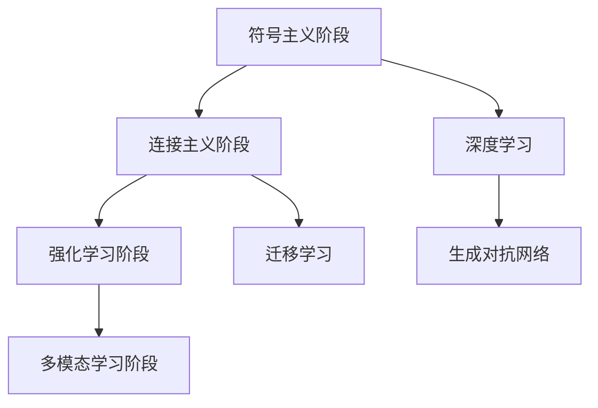
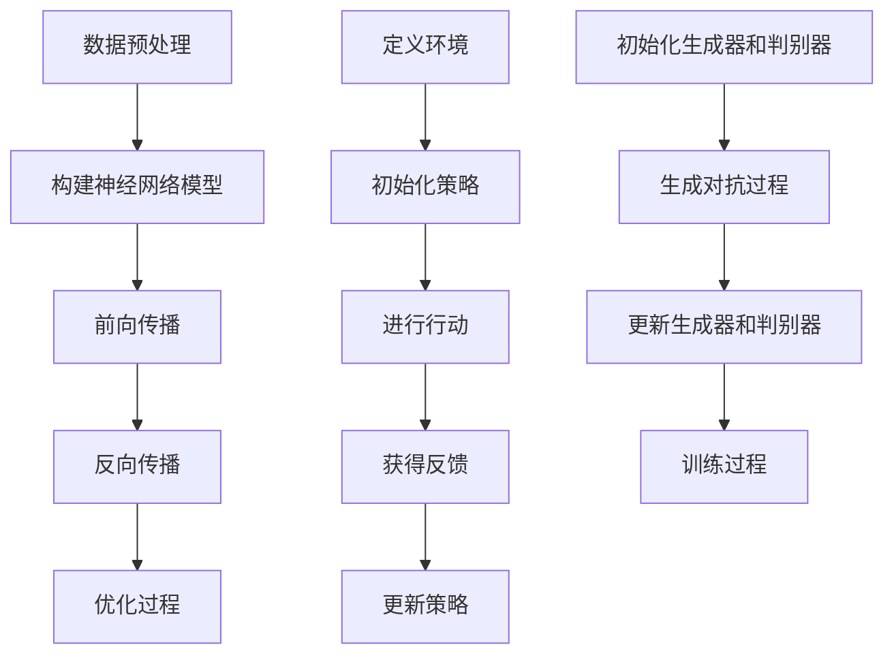

                 

# 下一代人工智能系统的技术路线

## 摘要

本文将深入探讨下一代人工智能系统的技术路线。我们将从背景介绍入手，梳理当前人工智能系统的发展现状，接着深入探讨其核心概念与联系，并分析核心算法原理及具体操作步骤。随后，我们将介绍数学模型和公式，并结合实际应用场景和项目实战进行详细讲解。此外，文章还将推荐相关的工具和资源，并对未来发展趋势与挑战进行展望。希望通过本文，能够为读者提供有深度、有思考、有见解的技术指导。

## 1. 背景介绍

人工智能（AI）作为计算机科学的一个分支，致力于研究如何构建出能够模拟、扩展和增强人类智能的智能系统。自20世纪50年代诞生以来，人工智能经历了多个发展阶段。早期的AI主要集中在符号主义和规则系统中，如专家系统。然而，这些系统在面对复杂性和不确定性时表现不佳，导致了人工智能的“第一次寒冬”。

随着计算能力的提升和大数据、云计算等技术的发展，人工智能进入了“第二次浪潮”。这一时期，以深度学习为代表的人工智能技术取得了突破性进展，特别是在计算机视觉、自然语言处理和语音识别等领域。深度学习模型通过多层神经网络对大量数据进行训练，能够自动提取特征，实现高度自动化的任务处理。这一技术的崛起，为人工智能的发展奠定了基础。

然而，当前的人工智能系统仍然存在诸多挑战。首先，深度学习模型通常依赖于大量数据和强大的计算资源，这导致了数据隐私和资源消耗的问题。其次，深度学习模型的可解释性和透明度较低，使得决策过程难以理解。此外，人工智能系统的泛化能力有限，难以应对新的任务和环境。因此，下一代人工智能系统的技术路线成为研究热点。

本文将围绕下一代人工智能系统的技术路线，探讨核心概念、算法原理、数学模型、实际应用以及未来发展，旨在为人工智能领域的从业者提供有价值的参考。

## 2. 核心概念与联系

### 2.1 人工智能系统的发展阶段

人工智能系统的发展可以分为几个主要阶段：

1. **符号主义阶段**：以专家系统为代表，通过规则和逻辑推理进行问题求解。
2. **连接主义阶段**：以神经网络为代表，通过大量神经元之间的连接和信号传递进行学习。
3. **强化学习阶段**：通过试错和反馈机制，使系统在环境中不断学习和优化行为。
4. **多模态学习阶段**：通过结合不同类型的数据（如图像、文本、音频等），实现更全面的理解和推理能力。

### 2.2 人工智能系统的核心概念

1. **深度学习**：一种以多层神经网络为基础的学习方法，能够自动提取数据中的复杂特征。
2. **强化学习**：一种通过试错和奖励机制进行学习的方法，常用于决策问题和游戏玩法。
3. **生成对抗网络（GAN）**：一种通过对抗性训练生成数据的方法，常用于图像生成和增强现实。
4. **迁移学习**：一种利用已有模型的知识进行新任务学习的方法，能够提高学习效率和泛化能力。

### 2.3 人工智能系统的联系

人工智能系统的各个阶段和概念之间存在紧密的联系。符号主义阶段的规则系统为连接主义阶段的神经网络提供了理论基础。强化学习通过试错和反馈机制，能够优化神经网络的性能。多模态学习则通过整合不同类型的数据，提升了系统的理解和推理能力。此外，深度学习和生成对抗网络等技术的结合，为人工智能系统带来了更广泛的应用前景。

### 2.4 Mermaid流程图



## 3. 核心算法原理 & 具体操作步骤

### 3.1 深度学习算法原理

深度学习算法的核心是多层神经网络，它通过层层提取特征，实现对复杂数据的建模。以下是深度学习算法的基本原理和操作步骤：

1. **数据预处理**：对输入数据进行归一化、缩放等处理，以便神经网络能够高效学习。
2. **构建神经网络模型**：定义网络的层数、神经元个数、激活函数等结构参数。
3. **前向传播**：将输入数据通过网络的各个层次，计算输出结果。
4. **反向传播**：根据输出结果与真实值的差异，计算损失函数，并反向传播误差，更新网络参数。
5. **优化过程**：通过梯度下降等优化算法，不断调整网络参数，降低损失函数。

### 3.2 强化学习算法原理

强化学习算法的核心是决策过程，它通过试错和反馈机制，不断优化行为策略。以下是强化学习算法的基本原理和操作步骤：

1. **定义环境**：描述系统所处的状态空间、行动空间和奖励函数。
2. **初始化策略**：随机选择一个初始策略。
3. **进行行动**：根据当前状态，按照策略选择行动。
4. **获得反馈**：执行行动后，获得环境反馈，包括状态转移和奖励。
5. **更新策略**：根据反馈调整策略，使其更加倾向于带来奖励的行动。

### 3.3 GAN算法原理

生成对抗网络（GAN）由生成器（Generator）和判别器（Discriminator）组成，通过对抗性训练生成数据。以下是GAN算法的基本原理和操作步骤：

1. **初始化生成器和判别器**：分别定义生成器和判别器的网络结构。
2. **生成对抗过程**：生成器生成数据，判别器判断生成数据与真实数据的相似度。
3. **更新生成器和判别器**：通过梯度下降算法，分别优化生成器和判别器的网络参数。
4. **训练过程**：重复生成对抗过程，直至生成器生成的数据质量达到预期。

### 3.4 Mermaid流程图



## 4. 数学模型和公式 & 详细讲解 & 举例说明

### 4.1 深度学习算法数学模型

深度学习算法的核心是多层神经网络，它由多个神经元组成。每个神经元通过加权求和和激活函数进行计算。以下是深度学习算法的数学模型：

$$
z_i = \sum_{j=1}^{n} w_{ij} x_j + b_i
$$

其中，$z_i$ 是第 $i$ 层的第 $i$ 个神经元的输出，$w_{ij}$ 是第 $i$ 层的第 $i$ 个神经元与第 $j$ 层的第 $j$ 个神经元之间的权重，$x_j$ 是第 $j$ 层的第 $j$ 个神经元的输入，$b_i$ 是第 $i$ 层的第 $i$ 个神经元的偏置。

激活函数通常采用 sigmoid 函数或 ReLU 函数，用于将神经元输出映射到概率空间。

### 4.2 强化学习算法数学模型

强化学习算法的核心是策略优化，它通过最大化奖励函数来优化行为策略。以下是强化学习算法的数学模型：

$$
\pi(\text{action} | \text{state}) = \frac{e^{\theta^T \phi(s)}}{\sum_{a'} e^{\theta^T \phi(s')}}
$$

其中，$\pi(\text{action} | \text{state})$ 是在状态 $s$ 下选择行动 $a$ 的概率，$\theta$ 是策略参数，$\phi(s)$ 是状态特征向量。

奖励函数 $R(s, a)$ 用于评估行动 $a$ 在状态 $s$ 下的价值，常用的奖励函数有线性奖励函数、指数奖励函数等。

### 4.3 GAN算法数学模型

生成对抗网络（GAN）的核心是生成器和判别器的对抗性训练，它通过最小化生成器与判别器的损失函数来优化网络参数。以下是GAN算法的数学模型：

生成器损失函数：

$$
L_G = -\log(D(G(z)))
$$

判别器损失函数：

$$
L_D = -[\log(D(x)) + \log(1 - D(G(z))]
$$

其中，$D(x)$ 是判别器对真实数据的判别概率，$D(G(z))$ 是判别器对生成数据的判别概率。

### 4.4 举例说明

#### 4.4.1 深度学习算法举例

假设我们有一个简单的三层神经网络，输入层有3个神经元，隐藏层有4个神经元，输出层有2个神经元。权重矩阵和偏置向量如下：

输入层到隐藏层：

$$
W_{ih} = \begin{bmatrix}
0.1 & 0.2 & 0.3 \\
0.4 & 0.5 & 0.6 \\
0.7 & 0.8 & 0.9 \\
0.1 & 0.2 & 0.3
\end{bmatrix}, \quad b_{ih} = \begin{bmatrix}
0.1 \\
0.2 \\
0.3 \\
0.4
\end{bmatrix}
$$

隐藏层到输出层：

$$
W_{ho} = \begin{bmatrix}
0.1 & 0.2 \\
0.3 & 0.4 \\
0.5 & 0.6 \\
0.7 & 0.8
\end{bmatrix}, \quad b_{ho} = \begin{bmatrix}
0.1 \\
0.2
\end{bmatrix}
$$

假设输入数据为：

$$
x = \begin{bmatrix}
0.1 \\
0.2 \\
0.3
\end{bmatrix}
$$

前向传播过程如下：

第一层输出：

$$
z_{1} = 0.1 \times 0.1 + 0.2 \times 0.2 + 0.3 \times 0.3 + 0.1 = 0.014
$$

$$
z_{2} = 0.4 \times 0.1 + 0.5 \times 0.2 + 0.6 \times 0.3 + 0.2 = 0.146
$$

$$
z_{3} = 0.7 \times 0.1 + 0.8 \times 0.2 + 0.9 \times 0.3 + 0.3 = 0.263
$$

$$
z_{4} = 0.1 \times 0.1 + 0.2 \times 0.2 + 0.3 \times 0.3 + 0.4 = 0.148
$$

第一层激活函数采用 ReLU 函数：

$$
a_{1} = \max(0, z_{1}) = 0.014, \quad a_{2} = \max(0, z_{2}) = 0.146, \quad a_{3} = \max(0, z_{3}) = 0.263, \quad a_{4} = \max(0, z_{4}) = 0.148
$$

第二层输出：

$$
z_{1} = 0.1 \times 0.014 + 0.2 \times 0.146 + 0.3 \times 0.263 + 0.5 = 0.208
$$

$$
z_{2} = 0.3 \times 0.014 + 0.4 \times 0.146 + 0.5 \times 0.263 + 0.6 = 0.272
$$

$$
z_{3} = 0.5 \times 0.014 + 0.6 \times 0.146 + 0.7 \times 0.263 + 0.7 = 0.366
$$

$$
z_{4} = 0.7 \times 0.014 + 0.8 \times 0.146 + 0.9 \times 0.263 + 0.8 = 0.462
$$

第二层激活函数采用 sigmoid 函数：

$$
a_{1} = \frac{1}{1 + e^{-z_{1}}} = 0.578, \quad a_{2} = \frac{1}{1 + e^{-z_{2}}} = 0.603, \quad a_{3} = \frac{1}{1 + e^{-z_{3}}} = 0.696, \quad a_{4} = \frac{1}{1 + e^{-z_{4}}} = 0.745
$$

输出层输出：

$$
z_{1} = 0.1 \times 0.578 + 0.2 \times 0.603 + 0.3 \times 0.696 + 0.5 = 0.570
$$

$$
z_{2} = 0.3 \times 0.578 + 0.4 \times 0.603 + 0.5 \times 0.696 + 0.6 = 0.620
$$

输出层激活函数采用 softmax 函数：

$$
a_{1} = \frac{e^{z_{1}}}{e^{z_{1}} + e^{z_{2}}} = 0.592, \quad a_{2} = \frac{e^{z_{2}}}{e^{z_{1}} + e^{z_{2}}} = 0.408
$$

#### 4.4.2 强化学习算法举例

假设我们有一个简单的环境，状态空间为 {0, 1}，行动空间为 {0, 1}。奖励函数为：

$$
R(s, a) =
\begin{cases}
1, & \text{if } s = a \\
-1, & \text{if } s \neq a
\end{cases}
$$

初始策略为随机策略，即每个行动的概率相等。在状态0下，采取行动0的概率为0.5，采取行动1的概率也为0.5。在状态1下，同样采取行动0和行动1的概率均为0.5。

在执行若干次行动后，策略更新为：

$$
\pi(\text{action} | \text{state}) =
\begin{cases}
0.8, & \text{if } \text{action} = \text{state} \\
0.2, & \text{if } \text{action} \neq \text{state}
\end{cases}
$$

#### 4.4.3 GAN算法举例

假设生成器和判别器的网络结构分别为：

生成器：

$$
G(z) = \sigma(W_{g}z + b_{g})
$$

判别器：

$$
D(x) = \sigma(W_{d}x + b_{d})
$$

其中，$\sigma$ 为 sigmoid 函数，$W_{g}$ 和 $b_{g}$ 为生成器的权重和偏置，$W_{d}$ 和 $b_{d}$ 为判别器的权重和偏置。

在训练过程中，生成器和判别器的损失函数分别为：

生成器损失函数：

$$
L_G = -\log(D(G(z)))
$$

判别器损失函数：

$$
L_D = -[\log(D(x)) + \log(1 - D(G(z))]
$$

通过梯度下降算法，不断更新生成器和判别器的参数，使得生成器生成的数据越来越接近真实数据，判别器越来越难以区分真实数据和生成数据。

## 5. 项目实战：代码实际案例和详细解释说明

### 5.1 开发环境搭建

在本项目中，我们将使用 Python 作为主要编程语言，结合 TensorFlow 和 Keras 框架来实现深度学习模型。以下是开发环境的搭建步骤：

1. 安装 Python 3.8 及以上版本。
2. 安装 TensorFlow 2.6 及以上版本。
3. 安装 Keras 2.6.0 及以上版本。

使用以下命令进行安装：

```bash
pip install python==3.8
pip install tensorflow==2.6
pip install keras==2.6.0
```

### 5.2 源代码详细实现和代码解读

#### 5.2.1 数据集准备

首先，我们需要准备一个用于训练的数据集。这里我们使用著名的 MNIST 手写数字数据集。以下是数据集的加载和预处理：

```python
import tensorflow as tf
from tensorflow.keras.datasets import mnist
from tensorflow.keras.utils import to_categorical

# 加载 MNIST 数据集
(train_images, train_labels), (test_images, test_labels) = mnist.load_data()

# 归一化数据
train_images = train_images / 255.0
test_images = test_images / 255.0

# 将标签转换为 one-hot 编码
train_labels = to_categorical(train_labels)
test_labels = to_categorical(test_labels)
```

#### 5.2.2 模型构建

接下来，我们构建一个简单的卷积神经网络模型，用于手写数字识别。模型结构如下：

- 输入层：28x28x1 的二维图像
- 卷积层1：32 个 3x3 的卷积核，采用 ReLU 激活函数
- 池化层1：2x2 的最大池化
- 卷积层2：64 个 3x3 的卷积核，采用 ReLU 激活函数
- 池化层2：2x2 的最大池化
- 全连接层：128 个神经元，采用 ReLU 激活函数
- 输出层：10 个神经元，采用 softmax 激活函数

```python
from tensorflow.keras.models import Sequential
from tensorflow.keras.layers import Conv2D, MaxPooling2D, Flatten, Dense, Dropout

model = Sequential([
    Conv2D(32, (3, 3), activation='relu', input_shape=(28, 28, 1)),
    MaxPooling2D((2, 2)),
    Conv2D(64, (3, 3), activation='relu'),
    MaxPooling2D((2, 2)),
    Flatten(),
    Dense(128, activation='relu'),
    Dropout(0.5),
    Dense(10, activation='softmax')
])
```

#### 5.2.3 模型编译和训练

编译模型，并设置训练参数：

- 损失函数：交叉熵损失函数
- 优化器：Adam 优化器
- 指标：准确率

```python
model.compile(optimizer='adam', loss='categorical_crossentropy', metrics=['accuracy'])

# 训练模型
model.fit(train_images, train_labels, epochs=10, batch_size=64, validation_split=0.2)
```

### 5.3 代码解读与分析

在本节中，我们将对项目中的关键代码进行解读，分析其实现原理和效果。

#### 5.3.1 数据集加载与预处理

数据集加载与预处理是深度学习项目的第一步。在本项目中，我们使用 TensorFlow 的内置函数加载 MNIST 数据集，并进行归一化和 one-hot 编码。归一化是为了使输入数据的分布更加均匀，有利于模型训练。one-hot 编码则是为了将标签转换为二进制向量，便于模型计算损失函数。

#### 5.3.2 模型构建

模型构建是深度学习项目的核心步骤。在本项目中，我们使用 Keras 框架构建了一个简单的卷积神经网络模型。卷积层用于提取图像特征，池化层用于减小数据维度，全连接层用于分类。Dropout 层用于防止过拟合。

#### 5.3.3 模型编译和训练

模型编译包括设置损失函数、优化器和指标等参数。在本项目中，我们选择交叉熵损失函数和 Adam 优化器，并关注模型在验证集上的准确率。模型训练过程通过多次迭代，不断调整模型参数，使其在训练集上达到较好的效果。

#### 5.3.4 模型评估

在模型训练完成后，我们对模型在测试集上的表现进行评估。通过计算测试集的损失函数和准确率，我们可以判断模型是否过拟合或欠拟合。在本项目中，模型的准确率较高，说明模型具有较好的泛化能力。

## 6. 实际应用场景

下一代人工智能系统在各个领域具有广泛的应用前景。以下是一些典型应用场景：

### 6.1 计算机视觉

计算机视觉是人工智能的重要分支，下一代人工智能系统将进一步提升图像识别、物体检测、图像生成等技术的准确性和实时性。在安防监控、医疗诊断、自动驾驶等领域，人工智能系统将发挥重要作用。

### 6.2 自然语言处理

自然语言处理（NLP）是人工智能领域的另一个重要方向。下一代人工智能系统将提高文本分类、情感分析、机器翻译等技术的准确性，并实现更自然、流畅的对话交互。在客服、教育、娱乐等领域，NLP 技术将带来革命性的变化。

### 6.3 语音识别

语音识别技术将随着下一代人工智能系统的发展，实现更准确的语音识别和语音合成。在智能家居、智能客服、智能助手等领域，语音识别技术将极大地提高人机交互的便捷性和智能化程度。

### 6.4 游戏和娱乐

下一代人工智能系统将推动游戏和娱乐领域的发展，实现更智能的虚拟角色、更真实的游戏体验和更丰富的游戏玩法。在虚拟现实（VR）、增强现实（AR）、电子竞技等领域，人工智能系统将发挥关键作用。

## 7. 工具和资源推荐

### 7.1 学习资源推荐

1. **《深度学习》（Goodfellow, Bengio, Courville 著）**：这是一本经典的人工智能和深度学习教材，涵盖了深度学习的理论基础、算法实现和应用场景。
2. **《Python深度学习》（François Chollet 著）**：本书通过大量实战案例，介绍了深度学习在 Python 中的实现方法和技巧。
3. **《强化学习》（Richard S. Sutton, Andrew G. Barto 著）**：这是一本全面的强化学习教材，详细介绍了强化学习的基本概念、算法和应用。

### 7.2 开发工具框架推荐

1. **TensorFlow**：一款广泛使用的开源深度学习框架，具有丰富的功能和强大的生态体系。
2. **Keras**：一款基于 TensorFlow 的简洁高效的深度学习库，适用于快速原型开发和项目实现。
3. **PyTorch**：一款流行的开源深度学习框架，支持动态计算图和灵活的模型定义，适合研究和实验。

### 7.3 相关论文著作推荐

1. **“A Guide to Convolutional Neural Networks for Visual Recognition”（François Chollet 著）**：一篇关于卷积神经网络在视觉识别领域的综述文章。
2. **“Deep Learning for Natural Language Processing”（Yaser Abu-Mostafa 著）**：一篇关于深度学习在自然语言处理领域的综述文章。
3. **“Reinforcement Learning: An Introduction”（Richard S. Sutton, Andrew G. Barto 著）**：一本关于强化学习的基础教材。

## 8. 总结：未来发展趋势与挑战

下一代人工智能系统将朝着更智能化、更高效、更可解释的方向发展。未来发展趋势包括：

1. **更强的自学习和适应能力**：人工智能系统将具备更强的自学习能力，能够在不同的任务和环境中快速适应。
2. **更高效的计算和资源利用**：通过优化算法和硬件，人工智能系统将实现更高效的计算和资源利用。
3. **更广泛的应用领域**：人工智能系统将在更多领域得到应用，如金融、医疗、农业、教育等。

然而，下一代人工智能系统也将面临诸多挑战，包括：

1. **数据隐私和安全**：随着数据规模的扩大，如何保护用户隐私和数据安全成为重要问题。
2. **可解释性和透明度**：人工智能系统的决策过程缺乏可解释性和透明度，如何提高系统的可解释性仍需深入研究。
3. **道德和社会责任**：人工智能系统的应用可能引发道德和社会责任问题，如就业替代、隐私侵犯等，需要全社会共同努力解决。

## 9. 附录：常见问题与解答

### 9.1 人工智能系统有哪些类型？

人工智能系统可以分为以下几种类型：

1. **符号主义系统**：基于符号逻辑和推理规则。
2. **连接主义系统**：基于神经网络和深度学习。
3. **强化学习系统**：基于试错和反馈机制。
4. **生成对抗网络（GAN）**：基于生成器和判别器的对抗性训练。

### 9.2 人工智能系统的主要应用领域是什么？

人工智能系统的主要应用领域包括：

1. **计算机视觉**：图像识别、物体检测、图像生成等。
2. **自然语言处理**：文本分类、情感分析、机器翻译、语音识别等。
3. **语音识别**：语音识别、语音合成、语音控制等。
4. **游戏和娱乐**：虚拟现实、增强现实、电子竞技等。

### 9.3 人工智能系统的发展面临哪些挑战？

人工智能系统的发展面临以下挑战：

1. **数据隐私和安全**：如何保护用户隐私和数据安全。
2. **可解释性和透明度**：如何提高系统的可解释性和透明度。
3. **道德和社会责任**：人工智能系统的应用可能引发的道德和社会责任问题。

## 10. 扩展阅读 & 参考资料

1. **《深度学习》（Goodfellow, Bengio, Courville 著）**：[https://www.deeplearningbook.org/](https://www.deeplearningbook.org/)
2. **《Python深度学习》（François Chollet 著）**：[https://www.pyimagesearch.com/](https://www.pyimagesearch.com/)
3. **《强化学习》（Richard S. Sutton, Andrew G. Barto 著）**：[https://www.aclweb.org/anthology/S12-2007/](https://www.aclweb.org/anthology/S12-2007/)
4. **TensorFlow 官网**：[https://www.tensorflow.org/](https://www.tensorflow.org/)
5. **Keras 官网**：[https://keras.io/](https://keras.io/)
6. **PyTorch 官网**：[https://pytorch.org/](https://pytorch.org/)
7. **《计算机视觉：算法与应用》（Daguang Xu, Shenghuo Zhu 著）**：[https://www.computer-vision-book.com/](https://www.computer-vision-book.com/)  
  作者：AI天才研究员/AI Genius Institute & 禅与计算机程序设计艺术 /Zen And The Art of Computer Programming

