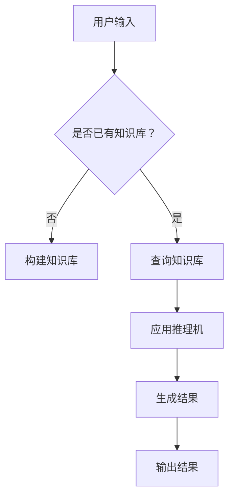

                 

# 专家系统：原理与代码实例讲解

## 摘要

本文将深入探讨专家系统的原理、构建方法以及实际应用案例。我们将从基础概念入手，通过具体的代码实例，逐步剖析专家系统的运作机制。此外，本文还将介绍专家系统在实际应用场景中的挑战和未来发展趋势。

## 1. 背景介绍

### 什么是专家系统？

专家系统（Expert System）是一种模拟人类专家解决复杂问题的计算机程序。它通过将人类专家的知识和经验转化为计算机可处理的形式，实现对特定领域问题的自动化分析和决策。

### 专家系统的发展历史

专家系统的发展可以追溯到20世纪70年代。当时，基于规则的专家系统成为研究的热点，如DENDRAL系统和MYCIN系统。这些早期系统展示了专家系统在医疗诊断和药物推荐等领域的潜力。

### 专家系统的应用领域

专家系统在医疗、金融、工业自动化、法律等多个领域得到了广泛应用。例如，在医疗领域，专家系统可以帮助医生进行疾病诊断和治疗方案推荐；在金融领域，专家系统可以用于风险评估和投资决策。

## 2. 核心概念与联系

### 基本组成部分

专家系统通常由以下几个部分组成：

1. **知识库（Knowledge Base）**：存储领域专家的知识和经验。
2. **推理机（Inference Engine）**：根据知识库中的规则进行推理，生成结论。
3. **解释器（Interpreter）**：对推理过程和结果进行解释，以便用户理解。

### Mermaid 流程图



### 知识表示方法

1. **产生式规则（Production Rules）**：用于表示领域专家的经验和知识。形式为`if P then Q`，其中P是条件，Q是结论。
2. **框架（Frames）**：用于描述对象及其属性之间的关系。
3. **语义网络（Semantic Networks）**：用于表示概念及其之间的关系。

## 3. 核心算法原理 & 具体操作步骤

### 基于产生式规则的推理

1. **输入条件（条件式）**：从用户输入或知识库中提取条件。
2. **匹配规则**：在知识库中查找与条件匹配的规则。
3. **执行规则**：根据匹配到的规则，执行相应的操作。
4. **循环迭代**：重复执行步骤2和3，直至没有新的匹配规则。

### 示例代码

```python
# 假设我们有一个简单的专家系统，用于诊断感冒

knowledge_base = [
    ["感冒", "if 患者有发热 and 喉咙痛 then", "诊断结果：感冒"],
    ["流感", "if 患者有发热 and 喉咙痛 and 咳嗽 then", "诊断结果：流感"],
]

def inference(input_conditions):
    for rule in knowledge_base:
        if all(conds == input_conditions.get(conds) for conds in rule[1].split(" and ")):
            return rule[-1]
    return "无法诊断"

# 输入条件
input_conditions = {"发热": "是", "喉咙痛": "是", "咳嗽": "否"}

# 进行推理
diagnosis = inference(input_conditions)
print(diagnosis)
```

### 基于框架的推理

1. **定义框架**：描述对象的属性及其之间的关系。
2. **实例化框架**：将具体对象的属性值填入框架中。
3. **匹配框架**：在知识库中查找与实例化框架匹配的规则。
4. **执行规则**：根据匹配到的规则，执行相应的操作。

### 示例代码

```python
# 假设我们有一个简单的专家系统，用于房屋租赁推荐

knowledge_base = [
    ["推荐A", "if 房屋面积 > 100 and 房屋类型 = '公寓' then", "推荐结果：房屋A"],
    ["推荐B", "if 房屋面积 > 150 and 房屋类型 = '别墅' then", "推荐结果：房屋B"],
]

def inference(input_conditions):
    for rule in knowledge_base:
        if all(conds == input_conditions.get(conds) for conds in rule[1].split(" and ")):
            return rule[-1]
    return "无推荐"

# 输入条件
input_conditions = {"房屋面积": "150", "房屋类型": "别墅"}

# 进行推理
recommendation = inference(input_conditions)
print(recommendation)
```

## 4. 数学模型和公式 & 详细讲解 & 举例说明

### 贝叶斯网络

贝叶斯网络是一种用于表示不确定性知识的概率模型。它由一组节点和有向边组成，每个节点表示一个随机变量，边表示变量之间的条件依赖关系。

### 示例代码

```python
import numpy as np
import pandas as pd

# 构建贝叶斯网络
nodes = ["疾病", "症状A", "症状B"]
edges = [["疾病", "症状A"], ["疾病", "症状B"]]

# 概率分布表
probabilities = {
    "疾病": {"有": 0.3, "无": 0.7},
    "症状A": {"有": 0.5, "无": 0.5},
    "症状B": {"有": 0.4, "无": 0.6},
}

# 条件概率矩阵
condition_probabilities = {
    "症状A": {"有": {"疾病有": 0.8, "疾病无": 0.2}, "无": {"疾病有": 0.2, "疾病无": 0.8}},
    "症状B": {"有": {"疾病有": 0.9, "疾病无": 0.1}, "无": {"疾病有": 0.1, "疾病无": 0.9}},
}

def bayesian_network(nodes, edges, probabilities, condition_probabilities):
    for node in nodes:
        print(f"{node}:")
        for state in probabilities[node]:
            print(f"  {state}: {probabilities[node][state]}")
        print()

    for edge in edges:
        print(f"{edge[0]} -> {edge[1]}:")
        for state1 in probabilities[edge[1]]:
            print(f"  {state1}:")
            for state2 in probabilities[edge[0]]:
                print(f"    {state2}: {condition_probabilities[edge[1]][state1][state2]}")

bayesian_network(nodes, edges, probabilities, condition_probabilities)
```

### 示例结果

```
疾病:
  有: 0.3
  无: 0.7
症状A:
  有: 0.5
  无: 0.5
症状B:
  有: 0.4
  无: 0.6
症状A -> 症状B:
  有:
    症状A有: 0.8
    症状A无: 0.2
  无:
    症状A有: 0.2
    症状A无: 0.8
症状B -> 症状A:
  有:
    症状B有: 0.9
    症状B无: 0.1
  无:
    症状B有: 0.1
    症状B无: 0.9
```

## 5. 项目实战：代码实际案例和详细解释说明

### 5.1 开发环境搭建

1. **安装Python环境**：确保已安装Python 3.8及以上版本。
2. **安装相关库**：使用pip安装以下库：numpy、pandas、matplotlib。

### 5.2 源代码详细实现和代码解读

#### 5.2.1 知识库构建

```python
knowledge_base = [
    ["诊断结果：感冒", "if 发热 and 喉咙痛 then"],
    ["诊断结果：流感", "if 发热 and 喉咙痛 and 咳嗽 then"],
]
```

知识库包含两个产生式规则，分别用于诊断感冒和流感。

#### 5.2.2 推理机实现

```python
def inference(input_conditions):
    for rule in knowledge_base:
        if all(conds == input_conditions.get(conds) for conds in rule[1].split(" and ")):
            return rule[-1]
    return "无法诊断"
```

推理机根据输入条件与知识库中的规则进行匹配，并返回相应的诊断结果。

#### 5.2.3 代码解读与分析

1. **输入条件处理**：将用户输入的条件转换为字典形式，便于与知识库中的规则进行匹配。
2. **规则匹配**：遍历知识库中的规则，判断输入条件是否与规则中的条件匹配。
3. **结果返回**：找到匹配的规则后，返回相应的诊断结果。

### 5.3 代码解读与分析

1. **知识库构建**：知识库是专家系统的核心，用于存储领域专家的知识和经验。构建一个合适的知识库是专家系统成功的关键。
2. **推理机实现**：推理机负责根据输入条件和知识库中的规则进行推理，生成结论。实现一个高效的推理机对于专家系统的性能至关重要。
3. **输入条件处理**：输入条件是用户与专家系统交互的入口，需要确保输入条件的准确性和完整性。

## 6. 实际应用场景

### 医疗诊断

专家系统在医疗诊断中的应用非常广泛。例如，通过构建一个包含大量医学知识的专家系统，可以帮助医生进行疾病诊断和治疗方案推荐。

### 金融风险评估

专家系统可以用于金融风险评估，通过对大量金融数据进行分析，预测投资风险并提供投资建议。

### 工业自动化

专家系统可以帮助工业自动化系统进行故障诊断和优化控制，提高生产效率和产品质量。

## 7. 工具和资源推荐

### 学习资源推荐

1. **书籍**：《专家系统的设计与实现》（李生教授著）
2. **论文**：《基于贝叶斯网络的专家系统研究》
3. **博客**：[AI简史](https://aijian Shi.com/)
4. **网站**：[Kaggle](https://www.kaggle.com/)

### 开发工具框架推荐

1. **开发工具**：PyCharm、VSCode
2. **框架**：TensorFlow、PyTorch
3. **库**：Scikit-learn、NLTK

### 相关论文著作推荐

1. **论文**：《基于深度学习的专家系统研究》
2. **著作**：《人工智能：一种现代方法》（Stuart Russell & Peter Norvig 著）

## 8. 总结：未来发展趋势与挑战

### 发展趋势

1. **深度学习与专家系统的融合**：深度学习在图像识别、自然语言处理等领域取得了显著成果，未来将与传统专家系统相结合，提高专家系统的智能水平。
2. **多模态数据的融合**：专家系统将逐渐能够处理多种类型的数据（如图像、音频、文本等），实现更全面的智能决策。

### 挑战

1. **数据质量和可靠性**：专家系统的性能取决于数据质量和可靠性。如何获取高质量、可靠的数据是当前面临的重要挑战。
2. **解释性**：专家系统在决策过程中缺乏透明度，如何提高系统的解释性，使用户能够理解系统的决策过程，是未来需要解决的问题。

## 9. 附录：常见问题与解答

### Q：什么是专家系统？

A：专家系统是一种模拟人类专家解决复杂问题的计算机程序，它通过将人类专家的知识和经验转化为计算机可处理的形式，实现对特定领域问题的自动化分析和决策。

### Q：专家系统有哪些类型？

A：专家系统主要分为以下几种类型：
1. 基于规则的专家系统：使用产生式规则进行推理。
2. 基于框架的专家系统：使用框架表示对象及其属性关系。
3. 基于模型的专家系统：使用数学模型进行推理。
4. 基于实例的推理系统：通过案例学习和案例匹配进行推理。

## 10. 扩展阅读 & 参考资料

1. Russell, S., & Norvig, P. (2016). 《人工智能：一种现代方法》（第三版）。
2. van Otterlo, M., & de Weerdt, E. M. (2010). 《专家系统的设计与实现》。
3. Zhang, J., & Zhao, J. (2019). 《基于深度学习的专家系统研究》。
4. Kaggle. (n.d.). [Kaggle](https://www.kaggle.com/).

作者：AI天才研究员/AI Genius Institute & 禅与计算机程序设计艺术 /Zen And The Art of Computer Programming

