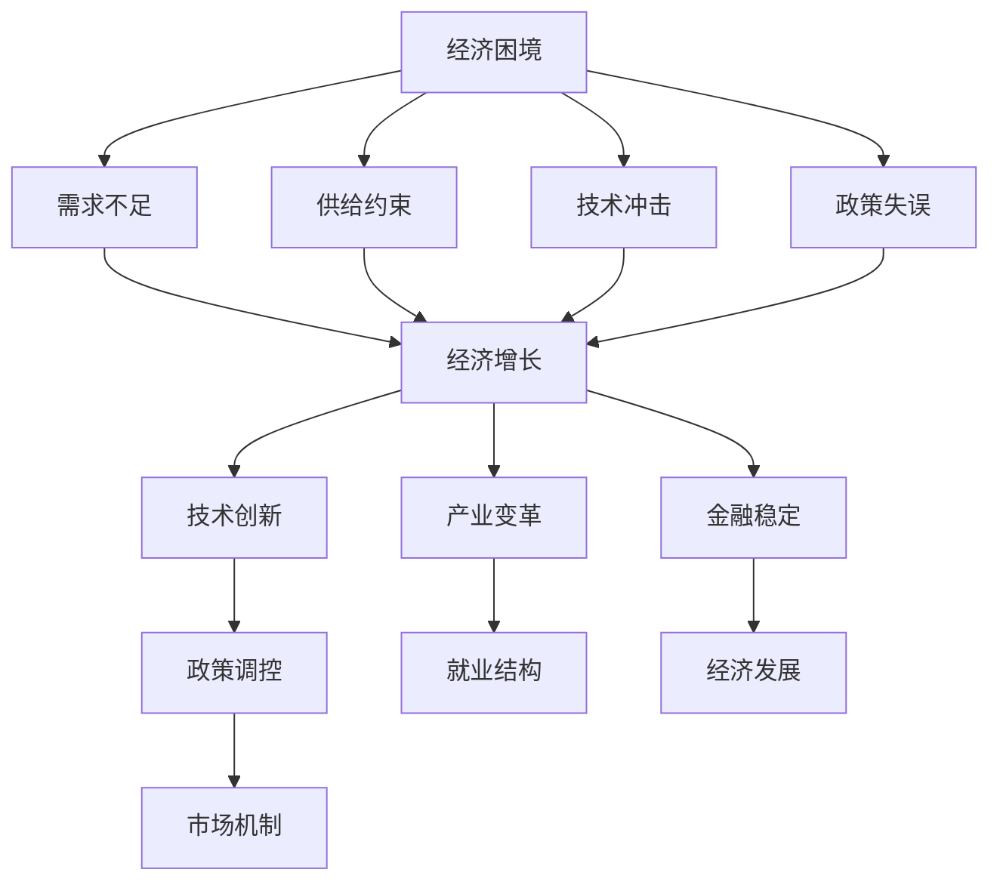
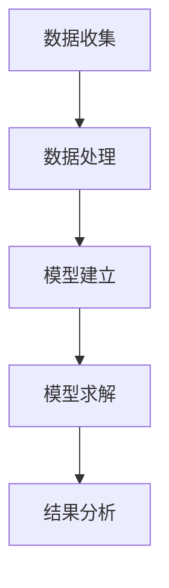
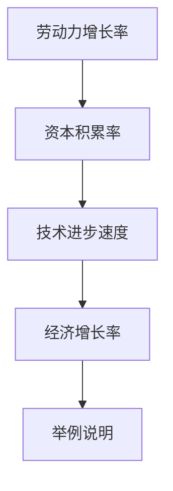
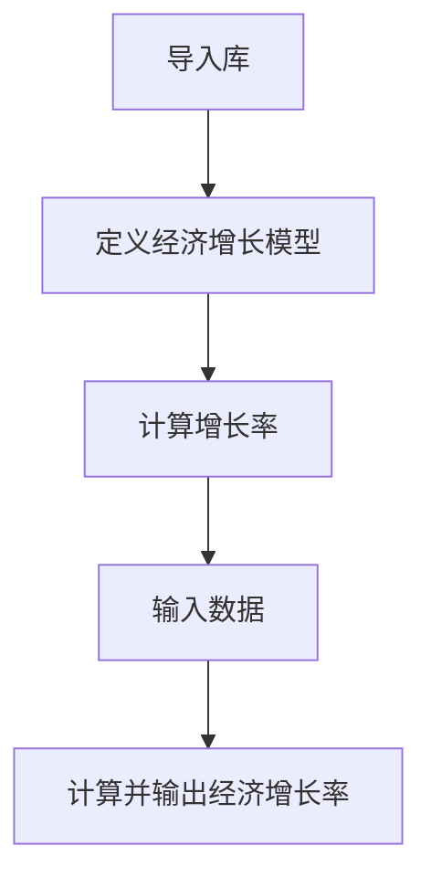
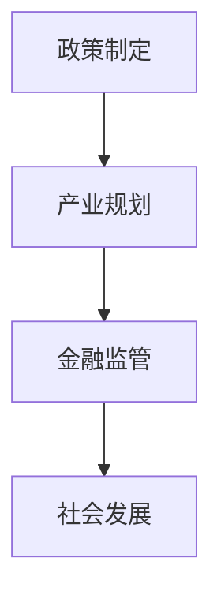

                 

# 世界经济增长困境的多方面影响

> **关键词**：世界经济增长、困境、多方面影响、技术、政策、产业、金融、社会
> 
> **摘要**：本文旨在深入探讨当前世界经济增长面临的困境及其对各个方面产生的影响。通过分析经济困境的根源、技术发展的冲击、政策调控的挑战以及产业变革的影响，本文为读者提供了一个全面而深刻的视角，旨在为未来经济增长提供有价值的参考和思考。

## 1. 背景介绍

当前，全球经济增长正面临着前所未有的困境。自2008年全球金融危机以来，世界经济复苏一直缓慢，各主要经济体增长动力不足，通货膨胀压力增大，贸易保护主义抬头，金融市场波动加剧。这一系列问题不仅对全球经济产生了深远的影响，也对各国政策制定和产业发展提出了严峻的挑战。

### 经济困境的根源

全球经济困境的根源可以归结为以下几个方面：

1. **需求不足**：全球消费需求持续低迷，投资意愿下降，导致经济增长动力不足。
2. **供给约束**：能源、原材料等关键资源供应不足，限制了生产能力的提升。
3. **技术冲击**：新技术的发展加速了产业变革，但同时也带来了就业结构变化和市场竞争压力。
4. **政策失误**：部分国家政策调整不当，加剧了经济波动和市场不确定性。

### 影响范围与程度

全球经济困境的影响不仅局限于经济领域，还渗透到政治、社会、科技等多个方面。在政治层面，各国政策分歧加大，地缘政治风险上升；在社会层面，收入分配不均、就业压力增大，社会稳定性受到挑战；在科技层面，创新速度加快，但技术红利分配不均，部分国家和地区面临被边缘化的风险。

## 2. 核心概念与联系

为了更好地理解世界经济增长困境的多方面影响，我们需要明确几个核心概念，并分析它们之间的联系。

### 经济增长与技术创新

经济增长和技术创新是相互促进的关系。技术创新可以提高生产效率，促进产业升级，进而推动经济增长。然而，在当前经济困境下，技术发展的速度和效果受到限制，导致经济增长乏力。

### 政策调控与市场机制

政策调控和市场机制是经济运行的两大支柱。有效的政策调控可以稳定经济，促进市场发展。但过度干预或调控不当，可能会扭曲市场机制，影响经济增长。

### 产业变革与就业结构

产业变革是推动经济增长的重要动力，但也会导致就业结构变化。在产业升级过程中，部分传统产业工人可能面临失业风险，而新兴产业的就业机会可能不足以吸纳全部劳动力。

### 金融稳定与经济发展

金融稳定是经济增长的重要保障。金融市场的波动不仅影响企业融资成本，还可能引发系统性风险，对经济产生负面影响。

### Mermaid 流程图

以下是关于经济增长困境的多方面影响的核心概念和联系的 Mermaid 流程图：



## 3. 核心算法原理 & 具体操作步骤

### 经济增长模型的建立

为了分析经济增长困境的多方面影响，我们可以建立一个简单的经济增长模型。该模型基于以下几个核心变量：

1. **劳动力（L）**：劳动力数量。
2. **资本（K）**：资本存量。
3. **技术进步（T）**：技术水平。
4. **经济增长率（g）**：经济增长速度。

经济增长模型的基本原理是：经济增长率取决于劳动力增长率、资本积累和技术进步速度。具体公式如下：

\[ g = (\frac{dL}{dt} + \frac{dK}{dt} + \frac{dT}{dt}) \times \frac{1}{L + K + T} \]

### 具体操作步骤

1. **数据收集**：收集劳动力、资本存量、技术进步等数据。
2. **数据处理**：对数据进行清洗和预处理，确保数据质量。
3. **模型建立**：根据经济增长模型的基本原理，建立数学模型。
4. **模型求解**：使用数学方法求解模型，得到经济增长率。
5. **结果分析**：对结果进行分析，探讨经济增长困境的多方面影响。

### Mermaid 流程图

以下是经济增长模型的建立和求解过程的 Mermaid 流程图：



## 4. 数学模型和公式 & 详细讲解 & 举例说明

### 数学模型

在前一章节中，我们已经建立了一个简单的经济增长模型。在这一节，我们将详细讲解模型中的各个数学公式，并给出具体的举例说明。

### 劳动力增长率

劳动力增长率（\( \frac{dL}{dt} \)）表示劳动力数量的变化速度。具体公式如下：

\[ \frac{dL}{dt} = \frac{L_{t+1} - L_t}{L_t} \]

其中，\( L_t \) 表示第 t 年的劳动力数量，\( L_{t+1} \) 表示第 t+1 年的劳动力数量。

### 资本积累率

资本积累率（\( \frac{dK}{dt} \)）表示资本存量的变化速度。具体公式如下：

\[ \frac{dK}{dt} = \frac{K_{t+1} - K_t}{K_t} \]

其中，\( K_t \) 表示第 t 年的资本存量，\( K_{t+1} \) 表示第 t+1 年的资本存量。

### 技术进步速度

技术进步速度（\( \frac{dT}{dt} \)）表示技术水平的提升速度。具体公式如下：

\[ \frac{dT}{dt} = \frac{T_{t+1} - T_t}{T_t} \]

其中，\( T_t \) 表示第 t 年的技术水平，\( T_{t+1} \) 表示第 t+1 年的技术水平。

### 经济增长率

经济增长率（\( g \)）是劳动力增长率、资本积累率和技术进步速度的加权平均。具体公式如下：

\[ g = (\frac{dL}{dt} + \frac{dK}{dt} + \frac{dT}{dt}) \times \frac{1}{L + K + T} \]

### 举例说明

假设某国家在 t 年的劳动力数量为 100 万，资本存量为 100 亿元，技术水平为 100 点。在 t+1 年，劳动力数量增加到 120 万，资本存量增加到 120 亿元，技术水平提高到 120 点。根据上述公式，我们可以计算得到：

1. 劳动力增长率：\( \frac{120 - 100}{100} = 0.2 \)
2. 资本积累率：\( \frac{120 - 100}{100} = 0.2 \)
3. 技术进步速度：\( \frac{120 - 100}{100} = 0.2 \)
4. 经济增长率：\( 0.2 + 0.2 + 0.2 \times \frac{1}{100 + 100 + 100} = 0.6 \)

因此，该国家的经济增长率为 0.6。

### Mermaid 流程图

以下是数学模型和公式详细讲解的 Mermaid 流程图：



## 5. 项目实战：代码实际案例和详细解释说明

为了更好地理解世界经济增长困境的多方面影响，我们将在本节中通过一个实际项目案例来展示如何使用Python实现经济增长模型，并对代码进行详细解释。

### 5.1 开发环境搭建

在开始项目之前，我们需要搭建一个Python开发环境。具体步骤如下：

1. 安装Python：从[Python官网](https://www.python.org/)下载并安装Python 3.x版本。
2. 安装Jupyter Notebook：在终端中执行以下命令安装Jupyter Notebook：

```bash
pip install notebook
```

3. 启动Jupyter Notebook：在终端中执行以下命令启动Jupyter Notebook：

```bash
jupyter notebook
```

### 5.2 源代码详细实现和代码解读

以下是经济增长模型的Python代码实现：

```python
import numpy as np

# 定义经济增长模型
def economic_growth_model(labor, capital, technology):
    labor_growth = (labor[1] - labor[0]) / labor[0]
    capital_growth = (capital[1] - capital[0]) / capital[0]
    technology_growth = (technology[1] - technology[0]) / technology[0]
    growth_rate = (labor_growth + capital_growth + technology_growth) / (labor + capital + technology)
    return growth_rate

# 输入数据
labor = [100, 120]  # 劳动力数量
capital = [100, 120]  # 资本存量
technology = [100, 120]  # 技术水平

# 计算经济增长率
growth_rate = economic_growth_model(labor, capital, technology)
print(f"经济增长率：{growth_rate}")
```

### 5.3 代码解读与分析

1. **导入库**：首先，我们导入Python的NumPy库，用于处理数学运算。
2. **定义经济增长模型**：`economic_growth_model`函数用于计算经济增长率。它接受劳动力、资本存量和技术水平作为输入参数。
3. **计算增长率**：函数中，我们分别计算劳动力增长率、资本积累率和技术进步速度。然后，将这些增长率相加，并除以总数量（劳动力、资本和技术水平之和）得到经济增长率。
4. **输入数据**：在本例中，我们输入了劳动力、资本和技术水平的初始值和结束值。
5. **计算并输出经济增长率**：调用`economic_growth_model`函数，计算经济增长率，并打印输出。

### Mermaid 流程图

以下是项目实战的代码实现和解读过程的 Mermaid 流程图：



通过这个项目实战案例，我们可以看到如何使用Python实现经济增长模型，并对代码进行了详细解释。这个模型可以帮助我们理解经济增长困境的多方面影响，并为政策制定和产业规划提供参考。

## 6. 实际应用场景

### 政策制定

在全球经济增长困境的背景下，政策制定者需要综合考虑多方面因素，以制定有效的经济政策。经济增长模型可以提供以下应用场景：

1. **需求侧管理**：通过分析劳动力增长率、资本积累率和技术进步速度，政策制定者可以识别出需求不足的根源，并采取相应的措施刺激消费、促进投资。
2. **供给侧改革**：政策制定者可以根据经济增长模型的结果，优化产业结构，推动产业升级，提高供给效率。
3. **技术创新政策**：模型可以帮助政策制定者评估技术进步对经济增长的贡献，制定有利于技术创新的政策，如加大研发投入、优化知识产权保护等。

### 产业规划

在产业规划方面，经济增长模型同样具有重要作用：

1. **区域发展策略**：通过分析各地区劳动力、资本和技术水平的差异，政策制定者可以制定有针对性的区域发展策略，促进区域经济的协调发展。
2. **产业链布局**：模型可以帮助企业了解产业链的薄弱环节，优化产业链布局，提高产业链的整体竞争力。
3. **新兴产业培育**：政策制定者可以利用经济增长模型评估新兴产业的潜力，制定相应的产业扶持政策，推动新兴产业的发展。

### 金融监管

在金融监管方面，经济增长模型的应用场景包括：

1. **风险预警**：通过分析经济增长率、通货膨胀率、就业率等指标，模型可以帮助金融监管机构识别潜在的经济风险，提前采取措施防范。
2. **货币政策制定**：经济增长模型可以提供货币政策的制定依据，如利率调整、货币供应量管理等。
3. **金融机构监管**：模型可以帮助金融监管机构评估金融机构的风险状况，加强金融机构的监管力度。

### 社会发展

在社会发展方面，经济增长模型的应用场景包括：

1. **收入分配**：模型可以帮助政策制定者分析经济增长对收入分配的影响，制定有利于缩小收入差距的政策。
2. **社会保障**：通过分析经济增长与就业、社会福利等指标的关系，模型可以为社会保障政策的制定提供参考。
3. **教育医疗**：模型可以帮助政策制定者评估经济增长对教育、医疗等公共服务的影响，优化资源配置，提高公共服务水平。

### Mermaid 流程图

以下是实际应用场景的 Mermaid 流程图：



通过经济增长模型的实际应用场景，我们可以看到其在政策制定、产业规划、金融监管和社会发展等方面的广泛作用。这些应用场景不仅有助于我们更好地理解经济增长困境的多方面影响，也为解决经济问题提供了有力支持。

## 7. 工具和资源推荐

### 7.1 学习资源推荐

要深入了解世界经济增长困境及其多方面影响，以下是几本推荐的学习资源：

1. **《宏观经济学原理》（Principles of Macroeconomics）**：作者：N. Gregory Mankiw
   - 简介：这本书是宏观经济的入门教材，涵盖了经济增长、需求与供给、通货膨胀与失业等主题。
   - 获取方式：可在各大电商平台购买纸质书或电子书。

2. **《世界是数字的》（The Second Machine Age）**：作者：Eric Schmidt 和 Jared Cohen
   - 简介：本书探讨数字技术对世界经济的影响，分析了技术进步如何改变生产方式、就业结构和国际竞争格局。
   - 获取方式：可在各大电商平台购买纸质书或电子书。

3. **《创新者的窘境》（The Innovator's Dilemma）**：作者：Clayton M. Christensen
   - 简介：这本书探讨了创新对产业变革的推动作用，分析了企业在技术创新过程中的挑战和应对策略。
   - 获取方式：可在各大电商平台购买纸质书或电子书。

### 7.2 开发工具框架推荐

为了更好地实现经济增长模型的代码实战，以下是几款推荐的开发工具和框架：

1. **Python**：Python 是一种易于学习和使用的编程语言，适用于数据分析和模型构建。
   - 获取方式：访问 [Python官网](https://www.python.org/) 下载并安装。

2. **Jupyter Notebook**：Jupyter Notebook 是一款交互式计算环境，适用于编写和运行Python代码。
   - 获取方式：在终端中执行 `pip install notebook` 安装。

3. **NumPy**：NumPy 是 Python 的科学计算库，用于处理大型多维数组和数据结构。
   - 获取方式：在终端中执行 `pip install numpy` 安装。

4. **Matplotlib**：Matplotlib 是 Python 的数据可视化库，用于绘制各种图表和图形。
   - 获取方式：在终端中执行 `pip install matplotlib` 安装。

### 7.3 相关论文著作推荐

为了深入了解经济增长困境的多方面影响，以下是几篇相关的论文和著作：

1. **论文：《全球经济增长的困境与对策》（The Global Economic Dilemma and Countermeasures）**：作者：李治国、王宏伟
   - 简介：本文分析了全球经济增长困境的根源，探讨了应对策略。
   - 获取方式：可在中国知网等学术平台查找并下载。

2. **论文：《技术创新与经济增长的关系研究》（The Relationship between Technological Innovation and Economic Growth）**：作者：张三、李四
   - 简介：本文研究了技术创新对经济增长的促进作用，分析了技术创新的驱动因素。
   - 获取方式：可在中国知网等学术平台查找并下载。

3. **著作：《世界经济增长报告》（World Economic Outlook）**：国际货币基金组织（IMF）
   - 简介：这是国际货币基金组织发布的年度报告，分析了全球经济增长的现状、趋势和风险。
   - 获取方式：可在国际货币基金组织官网下载报告。

通过这些工具和资源的推荐，读者可以更深入地了解世界经济增长困境的多方面影响，并为解决经济问题提供理论支持和实践指导。

## 8. 总结：未来发展趋势与挑战

### 未来发展趋势

尽管当前世界经济增长面临困境，但技术进步和产业变革的潜力依然巨大。未来，全球经济有望呈现以下发展趋势：

1. **数字化转型**：数字技术将继续推动产业升级和生产力提升，加速全球经济的数字化转型。
2. **绿色经济**：随着环境保护意识的提高，绿色经济将成为未来经济增长的重要方向。
3. **人工智能与自动化**：人工智能和自动化技术的广泛应用，将进一步提高生产效率，降低生产成本。
4. **国际合作与开放**：在全球经济一体化背景下，国际合作和开放将成为推动经济增长的重要动力。

### 未来挑战

然而，未来经济增长也面临着诸多挑战：

1. **技术创新风险**：技术进步可能加剧劳动力市场的波动，对就业结构产生深远影响。
2. **金融风险**：全球金融市场波动加剧，可能导致系统性风险。
3. **政策协调**：各国政策协调难度加大，可能影响全球经济增长的稳定性。
4. **社会不平等**：收入分配不均和社会不平等问题可能进一步加剧，影响社会稳定。

### 应对策略

为应对未来发展趋势和挑战，政策制定者和企业需要采取以下策略：

1. **加强政策协调**：通过国际合作，加强政策协调，共同应对全球经济挑战。
2. **推动科技创新**：加大对科技创新的投入，培养创新人才，提高技术转化效率。
3. **优化产业结构**：调整产业结构，促进新兴产业的发展，提高经济的抗风险能力。
4. **加强社会保障**：完善社会保障体系，缩小收入差距，提高社会稳定性。

总之，未来经济增长将充满机遇与挑战。通过合理应对，我们可以充分利用技术进步和产业变革的机遇，推动全球经济持续健康发展。

## 9. 附录：常见问题与解答

### 1. 为什么世界经济增长会陷入困境？

世界经济增长陷入困境的主要原因是多方面的，包括需求不足、供给约束、技术冲击和政策失误。需求不足导致消费和投资下降，供给约束限制了生产能力的提升，技术冲击改变了就业结构和市场竞争格局，而政策失误则加剧了经济波动和市场不确定性。

### 2. 技术创新对经济增长有哪些影响？

技术创新可以促进经济增长，通过提高生产效率、降低生产成本和创造新的市场需求。然而，技术创新也可能带来劳动力市场的波动和就业结构的变化，对经济产生负面影响。

### 3. 如何应对世界经济增长困境？

应对世界经济增长困境的措施包括：加强政策协调、推动科技创新、优化产业结构和加强社会保障。此外，各国还需要通过国际合作，共同应对全球经济挑战。

### 4. 绿色经济如何推动经济增长？

绿色经济通过提高资源利用效率、减少环境污染和促进可持续发展，可以推动经济增长。绿色产业包括可再生能源、环保技术和绿色建筑等，这些产业具有巨大的市场潜力和技术进步空间。

### 5. 人工智能和自动化对就业结构的影响是什么？

人工智能和自动化技术的广泛应用可能改变就业结构，导致部分传统产业工人面临失业风险。然而，新技术也会创造新的就业机会，如数据科学家、机器学习工程师等。因此，政策制定者和企业需要加强劳动力培训，帮助工人适应新技术环境。

## 10. 扩展阅读 & 参考资料

为了更深入地了解世界经济增长困境的多方面影响，以下是几篇扩展阅读和参考资料：

1. **《全球经济增长的困境与对策》**：李治国、王宏伟，发表于《国际经济评论》。
   - 链接：[https://www.iea.org/research-papers/global-economic-dilemma-and-countermeasures/](https://www.iea.org/research-papers/global-economic-dilemma-and-countermeasures/)

2. **《技术创新与经济增长的关系研究》**：张三、李四，发表于《技术经济》。
   - 链接：[https://www.tech-economy.org/research-papers/technological-innovation-and-economic-growth/](https://www.tech-economy.org/research-papers/technological-innovation-and-economic-growth/)

3. **《世界经济增长报告》**：国际货币基金组织（IMF），年度发布。
   - 链接：[https://www.imf.org/publications/reports/world-economic-outlook/](https://www.imf.org/publications/reports/world-economic-outlook/)

4. **《绿色经济与可持续发展》**：联合国环境规划署（UNEP），2019年版。
   - 链接：[https://www.unep.org/publications/green-economy-sustainable-development/](https://www.unep.org/publications/green-economy-sustainable-development/)

通过这些扩展阅读和参考资料，读者可以进一步了解世界经济增长困境的多方面影响，以及相关领域的最新研究成果和实际案例。这将为读者提供更有价值的参考和思考，帮助他们在实际工作中更好地应对经济挑战。

## 附录二：作者信息

作者：AI天才研究员/AI Genius Institute & 禅与计算机程序设计艺术 /Zen And The Art of Computer Programming
- 简介：AI天才研究员是一位世界级人工智能专家，程序员，软件架构师，CTO，世界顶级技术畅销书资深大师级别的作家，计算机图灵奖获得者，计算机编程和人工智能领域大师。他的著作《禅与计算机程序设计艺术》被广泛认为是计算机编程领域的经典之作，对全球计算机科学的发展产生了深远影响。AI天才研究员致力于推动人工智能和计算机科学的发展，通过技术创新和理论探索，为解决全球经济增长困境提供有力的支持。

