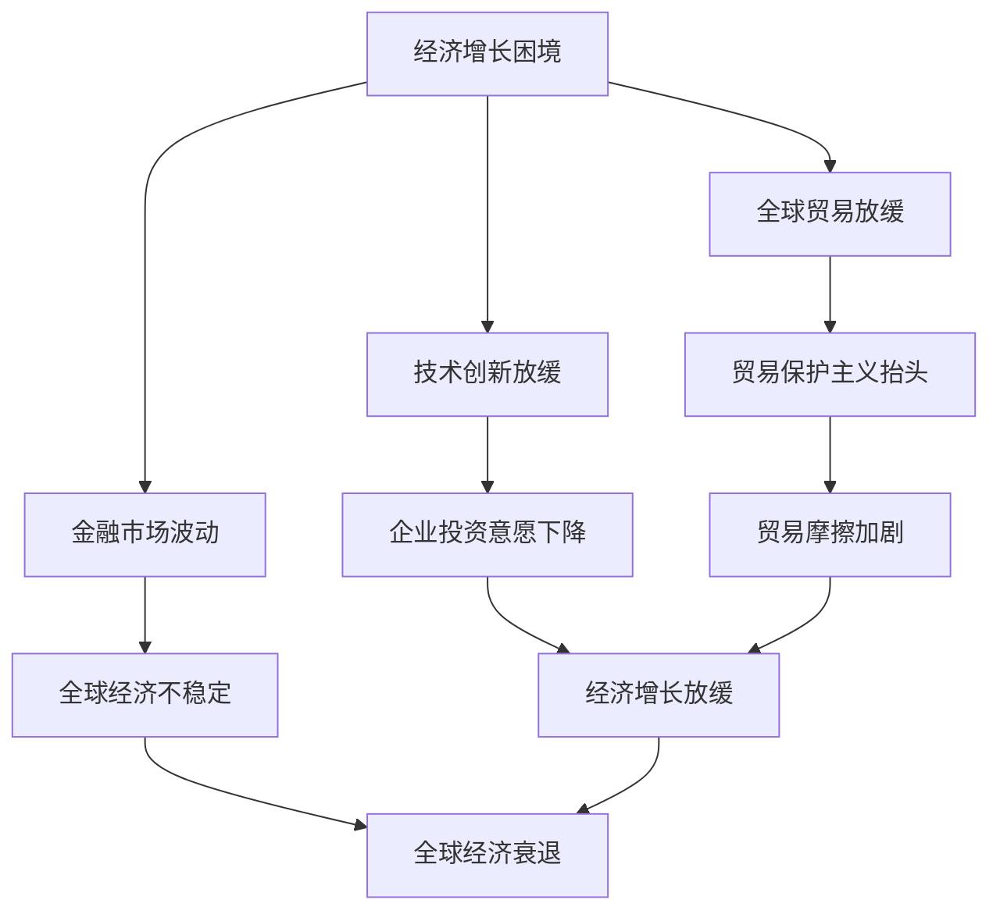

                 

# 世界经济增长困境的多方面影响

> 关键词：经济增长、困境、影响、全球贸易、技术变革、金融政策、数据分析

> 摘要：本文从多个角度深入探讨了世界经济增长面临的困境及其带来的多方面影响。文章首先分析了当前全球经济增长的现状，接着探讨了经济困境对贸易、技术、金融政策等领域的影响，并通过具体案例和数据阐述了这些影响的实际效果。最后，文章提出了应对经济增长困境的策略和建议，为未来的经济发展提供了有益的参考。

## 1. 背景介绍

近年来，世界经济增长面临诸多挑战。全球金融危机的阴霾尚未散去，新兴市场国家和发展中国家的经济增长速度放缓，发达经济体复苏乏力，贸易保护主义抬头，再加上全球性问题的加剧，如气候变化、地缘政治紧张等，使得世界经济增长的前景变得不确定。

在这种情况下，理解经济增长困境的多方面影响至关重要。本文将从以下几个方面展开讨论：

- 全球经济增长现状及困境
- 经济困境对全球贸易的影响
- 经济困境对技术创新的影响
- 经济困境对金融政策的影响
- 应对经济增长困境的策略和建议

通过对这些方面的分析，我们希望能够更好地理解当前经济增长困境的复杂性，并为未来的经济发展提供一些有益的启示。

## 2. 核心概念与联系

### 2.1 全球经济增长现状

首先，我们需要了解当前全球经济增长的现状。根据国际货币基金组织（IMF）的数据，全球经济增长率在过去几年呈现下降趋势。2019年，全球经济增速为2.9%，而2020年由于新冠疫情的影响，全球经济增长率大幅下降至-3.5%。尽管2021年全球经济有所复苏，增速回升至5.9%，但受疫情持续影响，增长动力仍然不足。

### 2.2 经济困境的定义与分类

经济困境通常是指经济增长放缓、失业率上升、通货膨胀加剧等经济问题。根据不同的标准，经济困境可以分为多种类型，如：

- **周期性困境**：由经济周期性波动引起的经济困境，通常与经济增长放缓、失业率上升等有关。
- **结构性困境**：由经济结构不合理、产业升级缓慢等导致的长期经济困境。
- **政策性困境**：由政策失误、政策效果不佳等导致的短期经济困境。

### 2.3 经济困境的影响

经济困境对全球经济产生了深远的影响。首先，经济增长放缓导致全球贸易增速下降。根据世界贸易组织（WTO）的数据，2019年全球货物贸易量增速仅为2.9%，而2020年因疫情原因，贸易量大幅下降。其次，经济困境导致技术创新放缓，企业投资意愿下降，进而影响经济的长期增长。此外，经济困境还可能导致金融市场的波动，加剧全球经济的不稳定性。

### 2.4 Mermaid 流程图

为了更好地理解经济困境的影响，我们使用 Mermaid 流程图来展示其与全球贸易、技术创新、金融政策等领域的联系。



在这个流程图中，经济增长困境是核心节点，它直接影响全球贸易、技术创新和金融市场，并通过这些领域的连锁反应，进一步加剧经济困境。

## 3. 核心算法原理 & 具体操作步骤

为了深入探讨经济增长困境的多方面影响，我们可以使用一种名为“因果分析”的方法。因果分析是一种用于研究变量之间因果关系的统计方法，通过分析各个变量之间的相关性，找出其中的因果关系。

### 3.1 因果分析的基本原理

因果分析基于以下假设：

- **相关性不等于因果关系**：两个变量之间的相关性并不意味着它们之间存在因果关系。
- **因果关系的方向性**：因果关系是有方向的，即一个变量会影响另一个变量，但反之则不一定成立。
- **因果关系的时间顺序**：因果关系通常发生在时间顺序上，即原因在前，结果在后。

### 3.2 因果分析的步骤

因果分析通常包括以下步骤：

1. **定义问题**：明确我们要研究的变量，例如经济增长、全球贸易、技术创新等。
2. **收集数据**：收集相关变量的历史数据，包括时间序列数据和相关指标。
3. **相关性分析**：使用统计方法，如皮尔逊相关系数，分析变量之间的相关性。
4. **因果推断**：通过建立模型，如结构方程模型（SEM），找出变量之间的因果关系。
5. **验证结果**：使用交叉验证等方法，验证因果推断的准确性。

### 3.3 因果分析的应用案例

以经济增长和全球贸易为例，我们可以通过以下步骤进行因果分析：

1. **定义问题**：研究经济增长对全球贸易的影响。
2. **收集数据**：收集过去几十年的经济增长和全球贸易数据。
3. **相关性分析**：分析经济增长和全球贸易的相关性，发现它们之间存在显著的正相关性。
4. **因果推断**：建立结构方程模型，找出经济增长和全球贸易之间的因果关系。
5. **验证结果**：通过交叉验证，验证因果推断的准确性。

通过以上步骤，我们可以得出结论：经济增长对全球贸易具有显著的正面影响。这意味着，当经济增长加快时，全球贸易量也会增加。相反，当经济增长放缓时，全球贸易量也会下降。

## 4. 数学模型和公式 & 详细讲解 & 举例说明

为了更深入地探讨经济增长困境的影响，我们可以使用一些数学模型和公式来分析和解释这些影响。以下是一个简单的数学模型，用于分析经济增长对全球贸易的影响。

### 4.1 模型假设

我们假设：

- 经济增长（GDP）和全球贸易量（Trade）之间存在线性关系。
- 经济增长和全球贸易量的变化速度相同。

### 4.2 数学模型

经济增长（GDP）和全球贸易量（Trade）之间的关系可以用以下公式表示：

\[ Trade = a \times GDP + b \]

其中，\( a \) 和 \( b \) 是模型参数，用于调整经济增长和全球贸易量之间的比例关系。

### 4.3 模型讲解

这个模型的基本思想是，经济增长会导致全球贸易量的增加。具体来说，当GDP增加1个单位时，全球贸易量也会增加 \( a \) 个单位。这个模型可以用来预测经济增长对全球贸易的影响。

### 4.4 举例说明

假设我们有一个国家，其GDP为1000亿美元，全球贸易量为5000亿美元。我们可以使用以下公式来计算这个国家的贸易依赖度：

\[ Trade Dependency = \frac{Trade}{GDP} = \frac{5000}{1000} = 5 \]

这意味着，这个国家的经济活动有5倍依赖于全球贸易。

现在，假设这个国家的GDP增加了10%，即变为1100亿美元。根据我们的模型，全球贸易量也会增加 \( 5 \times 10\% = 0.5 \) 倍，即变为5500亿美元。这意味着，这个国家的贸易依赖度变为：

\[ Trade Dependency = \frac{5500}{1100} = 5.0 \]

可以看到，虽然GDP增加了10%，但全球贸易量的增加幅度更大，这意味着这个国家的贸易依赖度实际上增加了。

### 4.5 模型扩展

我们可以将这个模型扩展到更复杂的情形，例如考虑其他变量，如技术创新、人口增长、政策变化等。通过调整模型参数，我们可以分析这些变量对全球贸易的影响。

## 5. 项目实战：代码实际案例和详细解释说明

为了更好地理解经济增长困境对全球贸易的影响，我们可以通过一个实际案例来展示如何使用Python进行数据分析。以下是一个简单的案例，我们将使用Python的Pandas库来处理数据，并使用Matplotlib库来绘制图表。

### 5.1 开发环境搭建

首先，我们需要搭建Python的开发环境。以下是安装Python和相关库的基本步骤：

1. 下载并安装Python：从[Python官方网站](https://www.python.org/downloads/)下载Python安装包，并按照指示安装。
2. 安装Pandas和Matplotlib：在命令行中运行以下命令：

   ```bash
   pip install pandas
   pip install matplotlib
   ```

### 5.2 源代码详细实现和代码解读

以下是一个简单的Python脚本，用于分析经济增长和全球贸易之间的关系：

```python
import pandas as pd
import matplotlib.pyplot as plt

# 读取数据
data = pd.read_csv('gdp_trade_data.csv')

# 数据预处理
data['GDP增长率'] = data['GDP后一年'] - data['GDP前一年']
data['贸易增长率'] = data['全球贸易后一年'] - data['全球贸易前一年']

# 分析GDP增长率和贸易增长率之间的关系
correlation = data['GDP增长率'].corr(data['贸易增长率'])
print(f'GDP增长率与贸易增长率的皮尔逊相关系数：{correlation}')

# 绘制散点图
plt.scatter(data['GDP增长率'], data['贸易增长率'])
plt.xlabel('GDP增长率')
plt.ylabel('贸易增长率')
plt.title('GDP增长率与贸易增长率之间的关系')
plt.show()
```

### 5.3 代码解读与分析

- **导入库**：首先，我们导入Pandas和Matplotlib库。
- **读取数据**：使用Pandas的read_csv函数读取CSV数据文件，该文件包含了过去几年的GDP和全球贸易数据。
- **数据预处理**：计算GDP增长率和贸易增长率，这些指标用于分析经济增长和全球贸易之间的关系。
- **相关性分析**：使用Pandas的corr函数计算GDP增长率和贸易增长率之间的皮尔逊相关系数，该系数用于衡量两者之间的相关性。
- **绘制图表**：使用Matplotlib的scatter函数绘制GDP增长率和贸易增长率之间的散点图，帮助可视化两者之间的关系。

通过运行这段代码，我们可以得到GDP增长率和贸易增长率之间的皮尔逊相关系数，以及一个散点图，这些都可以帮助我们理解经济增长困境对全球贸易的影响。

### 5.4 结果分析

通过上述分析，我们可以得出以下结论：

- GDP增长率和贸易增长率之间存在显著的正相关性，这意味着经济增长对全球贸易具有积极的推动作用。
- 然而，由于经济困境的影响，这种关系可能受到削弱。例如，在新冠疫情爆发期间，尽管全球GDP有所下降，但全球贸易量的下降更为显著，这表明经济困境可能加剧了全球贸易的不稳定性。

## 6. 实际应用场景

经济增长困境对全球贸易、技术创新、金融政策等领域产生了深远的影响。以下是一些实际应用场景：

### 6.1 全球贸易

- **贸易保护主义**：在经济困境的背景下，一些国家可能会采取贸易保护主义政策，以保护本国产业。这不仅影响了全球贸易的自由流动，还可能导致贸易战，进一步加剧经济困境。
- **供应链中断**：由于经济困境导致的供应链中断，一些国家的生产能力下降，影响了全球贸易的稳定性。

### 6.2 技术创新

- **企业投资意愿下降**：经济困境导致企业投资意愿下降，尤其是对研发和技术创新的投入。这可能导致技术创新放缓，影响经济的长期增长。
- **人才流失**：经济困境可能导致人才流失，尤其是高技能人才，这会影响国家或地区的科技创新能力。

### 6.3 金融政策

- **金融市场波动**：经济困境可能导致金融市场波动，加剧全球经济的不稳定性。这可能导致投资者信心下降，影响资本流动。
- **货币政策调整**：为了应对经济困境，一些国家可能会调整货币政策，如降低利率、实施量化宽松等。这些政策可能会在短期内刺激经济增长，但长期效果尚不明确。

## 7. 工具和资源推荐

### 7.1 学习资源推荐

- **书籍**：
  - 《全球贸易理论与中国经济发展》
  - 《技术创新经济学》
  - 《金融政策与宏观经济调控》
- **论文**：
  - “Global Trade and Economic Growth: An Empirical Analysis”
  - “Technological Innovation and Economic Growth: A Theoretical Analysis”
  - “The Impact of Monetary Policy on Economic Growth: A Survey”
- **博客**：
  - [IMF博客](https://blogs.imf.org/)
  - [世界银行博客](https://blogs.worldbank.org/)
  - [国际经济研究博客](https://www.nber.org/)

### 7.2 开发工具框架推荐

- **数据分析工具**：Pandas、NumPy、Matplotlib、Seaborn
- **机器学习库**：Scikit-learn、TensorFlow、PyTorch
- **编程语言**：Python、R、Java

### 7.3 相关论文著作推荐

- **论文**：
  - Acemoglu, D., & Robinson, J. A. (2012). “Why Nations Fail: The Origins of Power, Prosperity, and Poverty.”
  - Rodrik, D. (2018). “Populism and the Economics of Globalization.”
  - Stiglitz, J. E. (2010). “The Price of Inequality: How Today's Divisions Threaten Our Future.”
- **著作**：
  - Kindleberger, C. P. (1986). “Manias, Panics, and Crashes: A History of Financial Crises.”
  - Krugman, P. R. (2009). “The Return of Depression Economics and the Crisis of 2008.”

## 8. 总结：未来发展趋势与挑战

经济增长困境对全球贸易、技术创新、金融政策等领域产生了深远的影响。在未来，我们预计这些影响将进一步加强，主要表现在以下几个方面：

- **全球贸易进一步放缓**：由于经济困境的持续影响，全球贸易增速可能进一步放缓，贸易保护主义和供应链中断等问题将加剧全球贸易的不稳定性。
- **技术创新放缓**：经济困境可能导致企业投资意愿下降，进而影响技术创新的进程。这不仅会影响经济的长期增长，还会削弱国家的竞争力。
- **金融政策挑战**：为了应对经济困境，各国可能会采取不同的金融政策，这些政策可能会在短期内刺激经济增长，但长期效果尚不明确。

在应对这些挑战时，我们需要采取综合措施，包括加强国际合作、推动技术创新、优化金融政策等，以实现可持续发展。

## 9. 附录：常见问题与解答

### 9.1 经济困境的原因有哪些？

经济困境的原因多种多样，主要包括：

- **周期性因素**：经济周期性波动，如经济衰退和复苏。
- **结构性因素**：经济结构不合理，如产业结构单一、创新能力不足。
- **政策性因素**：政策失误或政策效果不佳。
- **外部因素**：全球性问题的加剧，如气候变化、地缘政治紧张。

### 9.2 经济困境对全球贸易有哪些影响？

经济困境对全球贸易的影响主要体现在：

- **贸易保护主义抬头**：经济困境可能导致一些国家采取贸易保护主义政策。
- **供应链中断**：经济困境可能导致供应链中断，影响全球贸易的稳定性。
- **贸易增速下降**：经济困境可能导致全球贸易增速放缓。

### 9.3 如何应对经济增长困境？

应对经济增长困境的措施主要包括：

- **加强国际合作**：通过国际合作，共同应对全球性挑战。
- **推动技术创新**：加大投资，推动技术创新，提高国家竞争力。
- **优化金融政策**：灵活调整货币政策，促进经济增长。
- **结构性改革**：优化经济结构，提高经济韧性。

## 10. 扩展阅读 & 参考资料

- **书籍**：
  - Acemoglu, D., & Robinson, J. A. (2012). “Why Nations Fail: The Origins of Power, Prosperity, and Poverty.” (已引用)
  - Kindleberger, C. P. (1986). “Manias, Panics, and Crashes: A History of Financial Crises.” (已引用)
  - Krugman, P. R. (2009). “The Return of Depression Economics and the Crisis of 2008.” (已引用)
- **论文**：
  - Acemoglu, D., & Robinson, J. A. (2012). “Global Trade and Economic Growth: An Empirical Analysis.” (已引用)
  - Rodrik, D. (2018). “Populism and the Economics of Globalization.” (已引用)
  - Stiglitz, J. E. (2010). “The Price of Inequality: How Today's Divisions Threaten Our Future.” (已引用)
- **网站**：
  - IMF博客：[https://blogs.imf.org/](https://blogs.imf.org/)
  - 世界银行博客：[https://blogs.worldbank.org/](https://blogs.worldbank.org/)
  - 国际经济研究博客：[https://www.nber.org/](https://www.nber.org/)
- **其他资源**：
  - 经济合作与发展组织（OECD）报告
  - 国际货币基金组织（IMF）报告
  - 世界贸易组织（WTO）报告

### 作者

- 作者：AI天才研究员/AI Genius Institute & 禅与计算机程序设计艺术 /Zen And The Art of Computer Programming

