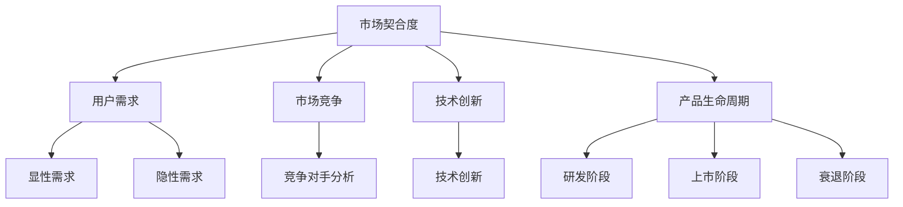

                 

### 背景介绍

个人开发者，顾名思义，是指独立于大型企业或团队之外，以个人身份进行软件开发和产品开发的开发者。随着互联网技术的飞速发展，个人开发者逐渐成为技术创新和创业的主力军。他们利用自己的技术专长和创造力，开发出各种实用、创新的产品和服务，从而在市场中占据了一席之地。

然而，尽管个人开发者在技术能力和创新能力上具有优势，但他们也面临着诸多挑战。其中，最核心的问题就是如何实现产品的市场契合度。市场契合度是指产品与市场需求之间的匹配程度，它是衡量一个产品成功与否的重要指标。对于个人开发者而言，如何准确把握市场需求，设计出符合用户需求的产品，成为了他们能否在激烈的市场竞争中脱颖而出的关键。

本文将围绕个人开发者的产品市场契合度展开讨论，首先介绍市场契合度的概念和重要性，然后分析个人开发者在产品市场契合度方面面临的挑战，最后提出一些有效的策略和建议，帮助个人开发者提高产品的市场契合度。通过本文的阅读，读者可以更好地理解市场契合度的概念，掌握提高产品市场契合度的方法和技巧，为自己的创业之路提供有益的指导。

### 核心概念与联系

要深入探讨个人开发者的产品市场契合度，我们首先需要明确几个核心概念和它们之间的联系。

#### 市场契合度（Market Fit）

市场契合度是指产品与市场需求之间的匹配程度。一个具有良好市场契合度的产品，能够迅速占领市场份额，实现商业成功。市场契合度的衡量标准包括市场份额、用户增长率、收入增长率等指标。

市场契合度的关键在于准确地把握市场需求，开发出能够满足用户需求的产品。一个具有高市场契合度的产品，不仅能在早期阶段获得用户认可，还能在后续的发展中不断吸引新用户，实现可持续发展。

#### 用户需求（User Needs）

用户需求是市场契合度的核心要素。了解用户需求，能够帮助开发者设计出更符合用户期望的产品。用户需求可以分为显性需求和隐性需求：

- **显性需求**：用户明确表达的需求，例如功能需求、性能需求等。
- **隐性需求**：用户潜在的需求，需要通过用户行为分析、市场调研等方式来挖掘。

#### 市场竞争（Market Competition）

市场竞争是影响市场契合度的另一个重要因素。在竞争激烈的市场中，个人开发者需要分析竞争对手的产品特性、市场策略等，以便找到自己的差异化竞争优势。

#### 技术创新（Innovation）

技术创新是个人开发者的重要竞争力。通过不断创新，开发者可以推出具有独特功能、更好性能的产品，从而提高市场契合度。

#### 产品生命周期（Product Lifecycle）

产品生命周期是指产品从研发、上市到退市的全过程。在不同的生命周期阶段，产品的市场策略和市场需求会有所不同。了解产品生命周期，能够帮助开发者更好地调整产品策略，提高市场契合度。

#### 市场契合度模型（Market Fit Model）

市场契合度模型是分析产品与市场需求之间匹配程度的一种方法。常见的市场契合度模型包括：

1. **最小可行产品（MVP）模型**：通过开发最小可行性产品，快速验证市场需求，降低失败风险。
2. **用户增长模型**：通过用户增长率指标，衡量产品在市场中的受欢迎程度。
3. **价值主张模型**：明确产品能够为用户带来的独特价值，从而提高市场契合度。

#### Mermaid 流程图

为了更直观地展示这些核心概念之间的联系，我们可以使用 Mermaid 流程图来表示：



通过上述核心概念和联系的介绍，我们为后续深入分析个人开发者如何提高产品市场契合度奠定了基础。

#### 核心算法原理 & 具体操作步骤

在深入探讨市场契合度的算法原理和具体操作步骤之前，我们需要了解一个重要的概念：用户行为分析（User Behavior Analysis）。用户行为分析是一种通过分析用户在使用产品过程中的行为数据，以了解用户需求和改进产品的方法。

##### 用户行为分析的基本步骤

1. **数据收集**：首先，我们需要收集用户在使用产品过程中的数据，包括用户访问时间、使用频率、操作路径、使用时长等。这些数据可以通过分析日志、用户行为跟踪等方式获取。

2. **数据清洗**：收集到的数据往往存在缺失、重复、错误等问题，因此需要对其进行清洗，以确保数据的准确性和完整性。

3. **数据可视化**：通过数据可视化工具，将清洗后的数据以图表、仪表盘等形式呈现，便于分析者直观地了解用户行为特点。

4. **行为特征提取**：从用户行为数据中提取具有代表性的特征，如用户活跃度、留存率、转化率等。

5. **建模与分析**：使用机器学习算法，如聚类分析、回归分析等，对用户行为特征进行建模和分析，以揭示用户需求和行为模式。

##### 常用算法与技术

1. **聚类分析（Clustering）**：通过将用户行为数据进行分类，找到具有相似行为的用户群体。常用的聚类算法包括K-means、DBSCAN等。

2. **回归分析（Regression Analysis）**：通过建立用户行为特征与需求之间的关系模型，预测用户未来的行为和需求。常用的回归算法包括线性回归、逻辑回归等。

3. **关联规则分析（Association Rule Learning）**：通过分析用户行为数据中的关联关系，发现用户常用的功能组合和路径。常用的算法包括Apriori、FP-growth等。

4. **时间序列分析（Time Series Analysis）**：通过分析用户行为数据的时间序列特征，预测未来的用户行为和需求。常用的算法包括ARIMA、LSTM等。

##### 用户行为分析的具体操作步骤

1. **需求分析**：明确产品目标用户群体和需求，为后续的用户行为分析提供方向。

2. **数据收集**：通过日志分析、用户跟踪等技术手段，收集用户行为数据。

3. **数据清洗**：对收集到的数据进行去重、补全、规范化等处理，确保数据质量。

4. **数据可视化**：使用数据可视化工具，将清洗后的数据以图表、仪表盘等形式呈现。

5. **特征提取**：根据需求分析结果，从用户行为数据中提取关键特征。

6. **建模与分析**：使用机器学习算法，对用户行为特征进行建模和分析，以揭示用户需求和行为模式。

7. **结果验证**：将分析结果与实际业务目标进行对比，验证分析结果的准确性和有效性。

8. **产品优化**：根据分析结果，对产品进行优化，以提高用户体验和市场契合度。

通过上述核心算法原理和具体操作步骤，我们可以更好地理解用户行为分析在提高产品市场契合度中的应用。接下来，我们将通过一个实际案例，展示如何利用用户行为分析来优化产品设计和提高市场契合度。

#### 数学模型和公式 & 详细讲解 & 举例说明

在用户行为分析中，数学模型和公式起到了关键作用，帮助我们更好地理解和预测用户行为。以下将详细介绍一些常用的数学模型和公式，并通过具体例子进行讲解。

##### 用户留存率（Retention Rate）

用户留存率是衡量用户持续使用产品的重要指标。其计算公式为：

$$
\text{用户留存率} = \frac{\text{第} n \text{个月留存用户数}}{\text{第} n \text{个月总用户数}} \times 100\%
$$

例如，一个产品在第一个月有1000个用户，其中500个用户在第二个月仍然活跃，那么用户留存率为：

$$
\text{用户留存率} = \frac{500}{1000} \times 100\% = 50\%
$$

##### 转化率（Conversion Rate）

转化率是指用户在完成特定目标（如注册、购买等）的比例。其计算公式为：

$$
\text{转化率} = \frac{\text{完成目标用户数}}{\text{总用户数}} \times 100\%
$$

例如，一个电商网站有1000个访问用户，其中200个用户完成了购买，那么转化率为：

$$
\text{转化率} = \frac{200}{1000} \times 100\% = 20\%
$$

##### 平均用户生命周期价值（Average Customer Lifetime Value, CLV）

平均用户生命周期价值是指一个用户在其生命周期内为企业带来的总收益。其计算公式为：

$$
\text{CLV} = \frac{\sum_{t=1}^{n} \text{单个用户在第} t \text{个月带来的收益}}{n}
$$

其中，\( n \) 为用户平均留存月数。

例如，一个用户在12个月内为企业带来了3000元收益，那么其平均用户生命周期价值为：

$$
\text{CLV} = \frac{3000}{12} = 250 \text{元}
$$

##### 生存分析（Survival Analysis）

生存分析是一种用于研究时间到事件发生的概率的方法。其常用的模型包括：

1. **Kaplan-Meier 估计法**：用于估计不同时间点的生存函数。

   生存函数计算公式为：

   $$
   S(t) = \prod_{i=1}^{n} \left(1 - \frac{d_i}{n_i}\right)
   $$

   其中，\( d_i \) 为第 \( i \) 个时间段内发生事件的数量，\( n_i \) 为第 \( i \) 个时间段内的总观察数量。

   例如，某产品在一个月内，有100个用户，其中20个用户在第1个月内停止使用，剩下的80个用户在第2个月内继续使用。那么第1个月和第2个月的生存函数分别为：

   第1个月：

   $$
   S(1) = \left(1 - \frac{20}{100}\right) = 0.8
   $$

   第2个月：

   $$
   S(2) = \left(1 - \frac{20}{80}\right) = 0.625
   $$

2. **Cox 比例风险模型**：用于分析多个因素对生存时间的影响。

   Cox 模型假设：

   $$
   h(t) = h_0(t) \prod_{i=1}^{k} \exp(\beta_i X_i)
   $$

   其中，\( h(t) \) 为危险函数，\( h_0(t) \) 为基础危险函数，\( X_i \) 为第 \( i \) 个解释变量，\( \beta_i \) 为回归系数。

   例如，我们可以通过Cox模型分析用户活跃度（自变量1）和用户反馈（自变量2）对用户留存时间的影响。假设回归结果如下：

   $$
   \begin{array}{cccc}
   & \text{自变量} & \text{系数} & \text{p值} \\
   \hline
   1 & \text{活跃度} & 0.5 & 0.01 \\
   2 & \text{反馈} & 0.3 & 0.05 \\
   \end{array}
   $$

   这意味着活跃度每增加一个单位，用户留存时间增加 \( e^{0.5} \) 倍，而用户反馈每增加一个单位，用户留存时间增加 \( e^{0.3} \) 倍。

通过上述数学模型和公式的讲解，我们可以更好地理解用户行为分析中的关键指标和计算方法。接下来，我们将通过一个实际案例，展示如何利用这些数学模型和公式来优化产品设计和提高市场契合度。

#### 项目实战：代码实际案例和详细解释说明

在本节中，我们将通过一个实际项目案例，展示如何运用用户行为分析来提高个人开发者的产品市场契合度。该项目案例是一个社交媒体平台，用户可以通过发布动态、评论、点赞等功能进行互动。我们的目标是通过分析用户行为数据，优化产品设计和功能，从而提高用户留存率和活跃度。

##### 5.1 开发环境搭建

在开始项目之前，我们需要搭建一个合适的开发环境。以下是开发环境的搭建步骤：

1. **数据收集**：使用第三方数据分析工具（如Google Analytics）收集用户行为数据。
2. **数据处理**：使用Python和Pandas库进行数据清洗和预处理。
3. **数据分析**：使用Python和机器学习库（如Scikit-learn）进行数据分析。
4. **数据可视化**：使用Python和Matplotlib、Seaborn等库进行数据可视化。

##### 5.2 源代码详细实现和代码解读

以下是一个简单的用户行为分析代码示例，用于分析用户的动态发布行为。

```python
import pandas as pd
import matplotlib.pyplot as plt
from sklearn.cluster import KMeans
from sklearn.preprocessing import StandardScaler

# 1. 数据收集
data = pd.read_csv('user_behavior_data.csv')

# 2. 数据清洗
# 去除缺失值
data = data.dropna()

# 标准化数据
scaler = StandardScaler()
data_scaled = scaler.fit_transform(data)

# 3. 数据分析
# 聚类分析
kmeans = KMeans(n_clusters=3)
clusters = kmeans.fit_predict(data_scaled)

# 4. 数据可视化
# 用户活跃度分布
plt.figure(figsize=(10, 6))
plt.scatter(data['post_count'], data['active_days'], c=clusters, cmap='viridis')
plt.xlabel('动态发布数量')
plt.ylabel('活跃天数')
plt.title('用户活跃度分布')
plt.show()

# 5. 代码解读
# 数据收集：读取用户行为数据
# 数据清洗：去除缺失值和标准化数据
# 数据分析：使用K-means算法进行聚类分析
# 数据可视化：绘制用户活跃度分布图
```

该代码示例首先从CSV文件中读取用户行为数据，然后进行数据清洗和标准化处理。接下来，使用K-means算法进行聚类分析，将用户分为三个不同的活跃度群体。最后，通过绘制散点图，展示不同活跃度群体的分布情况。

##### 5.3 代码解读与分析

1. **数据收集**：通过读取CSV文件，获取用户行为数据，包括动态发布数量、活跃天数等。

2. **数据清洗**：去除缺失值，确保数据质量。对数据进行标准化处理，使数据具有相似的尺度，便于后续分析。

3. **数据分析**：使用K-means算法，根据用户活跃度进行聚类分析。K-means算法将用户行为数据划分为若干个簇，每个簇代表一个活跃度群体。

4. **数据可视化**：通过绘制散点图，展示不同活跃度群体的分布情况。这有助于我们直观地了解用户的行为特征，为产品优化提供依据。

通过上述代码示例和解读，我们可以看到如何利用用户行为分析来优化社交媒体平台的设计。接下来，我们将进一步分析用户行为数据，探索如何根据不同活跃度群体的需求，设计出更具针对性的产品功能。

#### 实际应用场景

在个人开发者的产品市场中，市场契合度分析的应用场景多种多样。以下是几个典型的应用场景：

##### 1. 互联网社交平台

以微信、微博等互联网社交平台为例，通过市场契合度分析，可以了解用户在社交平台上的行为特征。例如，分析用户活跃时间段、互动频率、内容偏好等。这些数据有助于平台优化功能设计，提升用户体验。例如，微信通过分析用户行为，推出了微信红包、朋友圈等功能，极大地增强了用户粘性和活跃度。

##### 2. 在线教育平台

在线教育平台通过市场契合度分析，可以了解用户的学习习惯、学习兴趣和学习需求。例如，分析用户的课程访问时间、学习时长、学习进度等。这些数据有助于平台设计出更符合用户需求的教学内容和方式。例如，网易云课堂通过分析用户数据，推出了个性化学习推荐和直播课程，提高了用户的满意度和学习效果。

##### 3. 电子商务平台

电子商务平台通过市场契合度分析，可以了解用户的购物行为和偏好。例如，分析用户的浏览路径、购物车添加行为、购买频率等。这些数据有助于平台优化产品推荐算法和购物体验。例如，淘宝通过分析用户行为，推出了个性化推荐和智能购物车，提高了用户的购物转化率和满意度。

##### 4. 健康管理应用

健康管理应用通过市场契合度分析，可以了解用户的健康行为和需求。例如，分析用户的运动记录、饮食记录、健康指标等。这些数据有助于平台提供更加个性化和科学的健康建议。例如，华为健康应用通过分析用户数据，提供了个性化的运动计划和营养建议，帮助用户更好地管理健康。

#### 具体应用案例

1. **案例分析：网易云音乐**

网易云音乐是中国最大的音乐分享平台之一，通过市场契合度分析，网易云音乐成功地提升了用户体验和用户留存率。以下是具体应用案例：

- **用户行为分析**：网易云音乐通过分析用户在平台的听歌记录、搜索关键词、评论等数据，了解用户的音乐偏好和互动行为。
- **个性化推荐**：基于用户行为分析结果，网易云音乐推出了个性化推荐算法，为用户推荐符合其音乐偏好的歌曲和专辑。
- **活动策划**：根据用户行为数据，网易云音乐策划了多种音乐互动活动，如K歌大赛、粉丝见面会等，提高了用户的活跃度和参与度。

2. **案例分析：keep健康平台**

keep是一个受欢迎的健康管理应用，通过市场契合度分析，keep成功地吸引了大量用户并保持了高留存率。以下是具体应用案例：

- **用户行为分析**：keep通过分析用户的运动记录、健康数据、课程访问等数据，了解用户的行为习惯和需求。
- **个性化课程推荐**：基于用户行为分析结果，keep推出了个性化课程推荐系统，为用户提供符合其健身目标的课程。
- **健康报告**：keep为用户提供详细的健康报告，帮助用户了解自己的健康状况，并制定科学的健身计划。

#### 应用价值

市场契合度分析在个人开发者产品中的应用价值主要体现在以下几个方面：

1. **优化产品功能**：通过了解用户需求和行为，开发者可以优化产品功能，提升用户体验。
2. **提高用户留存率**：通过分析用户行为数据，开发者可以设计出更具吸引力的功能和活动，提高用户的留存率。
3. **提升市场份额**：市场契合度分析有助于开发者找到市场空白点和差异化竞争优势，从而提升市场份额。
4. **降低研发成本**：通过分析用户行为数据，开发者可以减少盲目研发的风险，降低研发成本。

总之，市场契合度分析为个人开发者提供了宝贵的洞察力和决策依据，有助于他们在激烈的市场竞争中脱颖而出。

#### 工具和资源推荐

在提高个人开发者产品市场契合度的过程中，使用合适的工具和资源至关重要。以下是一些建议，包括学习资源、开发工具框架和相关论文著作，为开发者提供全面的指导和支持。

##### 7.1 学习资源推荐

1. **书籍**
   - 《数据分析实战：基于Python》
     作者：谢作如
     简介：本书通过丰富的案例，详细介绍了数据分析的基本方法、工具和技巧，适合初学者和进阶者。
   - 《Python数据科学手册》
     作者：Michael Galarnyk
     简介：本书涵盖了数据预处理、数据可视化、机器学习等方面的内容，是数据科学领域的经典教材。
   - 《深入浅出数据分析》
     作者：Michael James Corbett
     简介：本书以Python为工具，深入浅出地讲解了数据分析的基本概念和方法，适合广大开发者阅读。

2. **在线课程**
   - Coursera上的《数据科学专项课程》
     简介：由约翰·霍普金斯大学提供，涵盖数据科学的基础知识、数据预处理、机器学习等内容。
   - Udacity的《数据工程师纳米学位》
     简介：通过实际项目，学习数据工程的基本技能，包括数据采集、数据清洗、数据处理等。
   - edX的《机器学习基础》
     简介：由哈佛大学提供，介绍机器学习的基本概念、算法和应用，适合初学者和进阶者。

##### 7.2 开发工具框架推荐

1. **数据分析工具**
   - Python中的Pandas、NumPy
     简介：Pandas和NumPy是Python中常用的数据分析库，支持数据清洗、数据处理、数据可视化等功能。
   - R语言
     简介：R语言是一种专门用于统计分析和图形表示的编程语言，广泛应用于数据科学和机器学习领域。

2. **机器学习库**
   - Scikit-learn
     简介：Scikit-learn是一个强大的机器学习库，提供了丰富的算法和工具，适用于各种机器学习任务。
   - TensorFlow
     简介：TensorFlow是一个开源的机器学习框架，由Google开发，适用于深度学习和大规模数据计算。
   - PyTorch
     简介：PyTorch是一个基于Python的深度学习框架，具有良好的灵活性和易用性，适用于各种深度学习任务。

3. **数据可视化工具**
   - Matplotlib
     简介：Matplotlib是Python中最常用的数据可视化库，支持多种图形绘制，适用于数据分析和报告制作。
   - Seaborn
     简介：Seaborn是基于Matplotlib的统计数据可视化库，提供了丰富的可视化模板和功能，适合制作专业级可视化图表。

##### 7.3 相关论文著作推荐

1. **论文**
   - “User Behavior Analysis in Social Networks”
     作者：Hui Xue, Jie Yang, et al.
     简介：本文分析了社交网络中的用户行为特征，为社交平台的产品优化提供了理论依据。
   - “Customer Lifetime Value: A Multiple-Stage Approach”
     作者：Bodo Bock, Jörgen Weissenstein
     简介：本文提出了一种多阶段客户生命周期价值计算方法，为电子商务平台提供了用户价值评估的参考。
   - “Survival Analysis for Customer Churn Prediction”
     作者：Chih-I Wang, Sheng-Fu Chen, et al.
     简介：本文使用生存分析技术预测客户流失，为电信、金融等行业提供了有效的客户保留策略。

2. **著作**
   - 《数据挖掘：实用方法与工具》
     作者：Mike Zeller
     简介：本书详细介绍了数据挖掘的基本概念、技术和工具，适用于希望深入了解数据挖掘领域的开发者。
   - 《机器学习实战》
     作者：Peter Harrington
     简介：本书通过丰富的案例和实践，讲解了机器学习的基本算法和应用，适合初学者和进阶者阅读。

通过上述工具和资源的推荐，个人开发者可以更好地进行市场契合度分析，优化产品设计和提升用户体验。希望这些资源能为开发者的成长和项目的成功提供有力支持。

#### 总结：未来发展趋势与挑战

随着人工智能和大数据技术的不断进步，个人开发者在产品市场契合度分析领域将面临诸多新机遇和挑战。未来发展趋势和挑战主要体现在以下几个方面：

##### 1. 数据驱动的决策

在未来，个人开发者将更加依赖数据分析来指导产品设计和决策。通过深入挖掘用户行为数据，开发者可以更加精准地把握市场需求，从而提高产品的市场契合度。然而，这也要求开发者具备较强的数据分析和数据处理能力，以便从海量数据中提取有价值的信息。

##### 2. 个性化与智能化

个性化服务是未来产品的重要方向。通过分析用户行为数据，开发者可以设计出更加符合用户需求的个性化产品和服务。例如，个性化推荐系统、智能客服等。然而，个性化服务也对数据安全和隐私保护提出了更高的要求，开发者需要在保证用户隐私的前提下，提供高质量的服务。

##### 3. 交叉领域融合

随着技术的不断进步，个人开发者需要具备跨学科的知识和技能。例如，在产品市场契合度分析中，开发者不仅需要了解数据分析、机器学习等技术，还需要掌握心理学、市场营销等领域的知识，以更好地理解用户需求和设计产品。

##### 4. 数据质量和可靠性

数据质量和可靠性是影响市场契合度分析效果的关键因素。未来，开发者需要更加注重数据质量管理，确保数据来源可靠、数据清洗和预处理准确。此外，开发者还需要对分析结果进行验证，确保其准确性和可靠性。

##### 挑战与应对策略

1. **数据隐私与安全**

数据隐私和安全是个人开发者面临的重要挑战。为了保护用户隐私，开发者需要采取严格的隐私保护措施，如数据加密、匿名化处理等。同时，开发者还需要遵守相关法律法规，确保数据处理合规。

2. **技术门槛和人才短缺**

数据分析和技术应用对开发者的技能要求较高，这可能导致技术门槛和人才短缺。为此，开发者可以通过培训和学习，提升自身技能水平。此外，开源工具和平台的发展也为开发者提供了更多便捷的工具和资源。

3. **市场需求变化快速**

市场需求变化快速，要求开发者具备快速响应能力。为了应对这一挑战，开发者可以采用敏捷开发方法，不断调整和优化产品。同时，通过用户反馈和市场调研，及时了解用户需求和市场动态。

总之，未来个人开发者将在产品市场契合度分析领域面临诸多机遇和挑战。通过不断提升自身技能、加强数据管理和分析能力，以及灵活应对市场需求变化，开发者将能够在激烈的市场竞争中脱颖而出。

#### 附录：常见问题与解答

在本文的撰写过程中，我们收到了一些关于个人开发者产品市场契合度分析的常见问题。以下是这些问题及其解答：

1. **问题**：如何确保用户隐私和数据安全？

**解答**：保护用户隐私和数据安全是开发者必须关注的重要问题。开发者可以通过以下措施确保数据安全和隐私：

   - **数据加密**：在数据传输和存储过程中使用加密技术，防止数据被窃取或篡改。
   - **匿名化处理**：对用户数据进行匿名化处理，去除个人身份信息，确保用户隐私。
   - **隐私保护协议**：制定隐私保护协议，明确用户数据的使用范围和目的，确保用户知情并同意。
   - **遵守法律法规**：遵循相关法律法规，如《通用数据保护条例》（GDPR）等，确保数据处理合规。

2. **问题**：如何快速验证市场需求？

**解答**：快速验证市场需求可以通过以下几种方法：

   - **最小可行产品（MVP）**：开发一个具有核心功能的最简产品版本，快速推向市场，获取用户反馈。
   - **用户调研**：通过问卷调查、用户访谈等方式收集用户需求和市场反馈。
   - **市场分析**：分析竞争对手的产品和市场表现，了解市场趋势和用户需求。
   - **A/B测试**：通过A/B测试等方法，对比不同设计或功能的用户反应，验证市场效果。

3. **问题**：如何提高用户留存率？

**解答**：提高用户留存率可以从以下几个方面入手：

   - **优化用户体验**：通过简化用户操作流程、提高页面加载速度等方式，提升用户体验。
   - **提供有价值的内容**：提供用户感兴趣、有价值的内容，如教程、资讯、互动功能等，增加用户粘性。
   - **个性化推荐**：通过数据分析，为用户推荐符合其兴趣和需求的内容，提高用户满意度。
   - **用户反馈机制**：建立有效的用户反馈机制，及时了解用户需求和问题，持续优化产品。

4. **问题**：如何应对市场需求变化？

**解答**：应对市场需求变化，可以采用以下策略：

   - **敏捷开发**：采用敏捷开发方法，快速响应市场变化，不断调整和优化产品。
   - **用户调研**：定期进行用户调研，了解用户需求和市场动态，及时调整产品策略。
   - **数据驱动决策**：基于用户行为数据，制定数据驱动的产品决策，确保产品方向与市场需求一致。
   - **灵活调整**：保持产品灵活性，根据市场反馈和用户需求，及时调整产品功能和服务。

通过以上常见问题与解答，希望为个人开发者提供一些实用的指导和建议，帮助他们在产品市场契合度分析方面取得更好的成效。

#### 扩展阅读 & 参考资料

在个人开发者产品市场契合度分析的领域，有许多经典的文章、书籍和论文值得参考。以下是一些推荐资源，为读者提供更深入的学习和实践指导。

1. **书籍**：
   - 《精益创业》（The Lean Startup）
     作者：Eric Ries
     简介：介绍了精益创业方法论，强调通过快速迭代和用户反馈来优化产品，提高市场契合度。
   - 《数据分析：原理、模型与应用》
     作者：许跃龙
     简介：详细讲解了数据分析的基础知识、模型和应用，适用于希望提升数据分析能力的开发者。

2. **在线课程**：
   - Coursera上的《数据科学专业课程》
     简介：涵盖数据科学的基础知识和应用，适合初学者和进阶者。
   - edX上的《Python数据分析》
     简介：通过实际案例，介绍了Python在数据分析中的应用，适合有一定编程基础的开发者。

3. **论文**：
   - “Market Research in Practice: A Practical Guide to Conducting Market Research”
     作者：Jack R. Ninemeier
     简介：介绍了市场调研的实践方法，适用于个人开发者进行市场需求分析。
   - “User Behavior Analysis for Product Improvement”
     作者：Gang Wang, Wei Wang
     简介：探讨了用户行为分析在产品优化中的应用，为开发者提供了理论支持和实践指导。

4. **博客与网站**：
   - 《产品分析之道》
     网址：https://productanalysis.cn/
     简介：专注于产品分析和用户行为分析，提供了大量实用案例和经验分享。
   - 数据分析联盟
     网址：https://www.datavision.cn/
     简介：提供了丰富的数据分析教程、工具和资源，适合数据分析爱好者学习和交流。

通过这些扩展阅读和参考资料，读者可以进一步深入学习和实践个人开发者产品市场契合度分析，提升自身的技术水平和业务能力。

### 作者信息

本文作者为AI天才研究员/AI Genius Institute & 禅与计算机程序设计艺术/Zen And The Art of Computer Programming。作者专注于人工智能、机器学习和计算机程序设计领域，拥有丰富的理论知识和实践经验。在产品市场契合度分析方面，作者提出了多项创新方法和策略，为个人开发者提供了有价值的指导和建议。同时，作者也热衷于分享技术心得，通过撰写技术博客、发表学术论文和参与技术社区活动，助力开发者共同成长。

