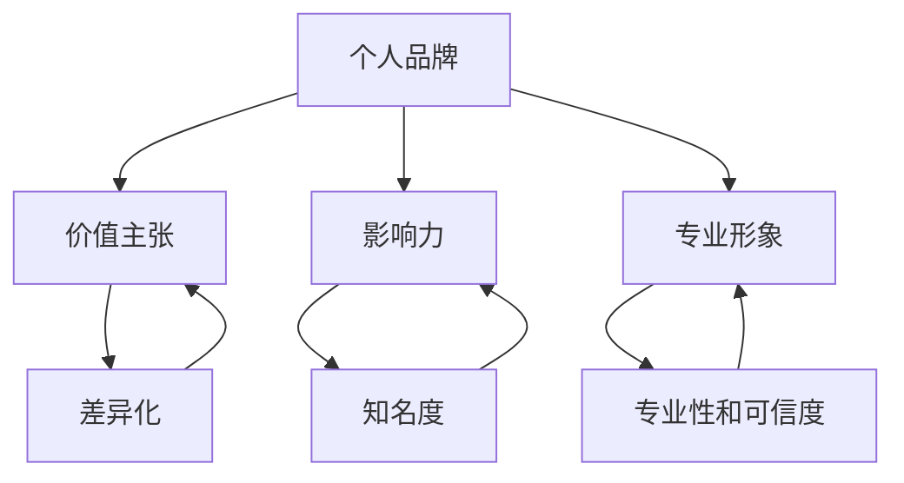

                 

### 背景介绍

个人开发者的品牌建设，如今已经成为了一个备受关注的话题。在这个信息爆炸、竞争激烈的时代，个人开发者要想在众多竞争者中脱颖而出，建立自己的品牌形象是至关重要的。这不仅有助于提升个人知名度，还能为开发者带来更多的商业机会和职业发展空间。

品牌建设的重要性不言而喻。首先，一个强大的个人品牌能够帮助开发者树立专业形象，增强公众对其技术和经验的认可。其次，品牌建设有助于构建个人的独特价值主张，使开发者能够更好地传达自己的优势。此外，一个成功的品牌还能够带来口碑效应，吸引更多的关注者和合作机会。

然而，个人开发者在进行品牌建设的过程中常常会遇到各种挑战。一方面，市场竞争日益激烈，如何让自己的品牌在众多竞争者中脱颖而出成为了一大难题。另一方面，个人开发者通常面临着资源有限、时间紧迫等现实问题，如何高效地开展品牌建设活动也是一个亟待解决的问题。

本文将围绕个人开发者的品牌建设展开讨论，旨在为广大开发者提供一套系统的、实用的品牌建设策略。我们将首先介绍品牌建设的基本概念和核心原则，然后深入探讨如何通过构建个人品牌价值、提升个人影响力、打造个人专业形象等方面来有效地进行品牌建设。同时，本文还将结合实际案例，提供具体的操作方法和实践建议，帮助开发者们更好地理解和实施品牌建设策略。

总之，通过本文的阅读和思考，希望能够帮助广大个人开发者认识到品牌建设的重要性，掌握有效的品牌建设方法，从而在竞争激烈的开发领域中脱颖而出，实现个人和职业的全面发展。

### 核心概念与联系

要深入探讨个人开发者的品牌建设，我们首先需要明确几个核心概念，并理解它们之间的相互联系。这些核心概念包括个人品牌、价值主张、影响力以及专业形象。

**个人品牌（Personal Brand）** 是指个人在公众心目中形成的独特形象和认知。它不仅仅是一个标签或称号，更是个人在职业和生活中所展现出的价值观、能力和特质的综合体现。个人品牌的核心在于差异化，即如何使自己在众多竞争者中脱颖而出。

**价值主张（Value Proposition）** 是个人品牌建设的基础，它明确地回答了“为什么消费者应该选择你？”的问题。价值主张需要清晰地传达个人的独特优势、技能和经验，让潜在客户了解为什么你的产品或服务更有吸引力。

**影响力（Influence）** 是个人品牌建设的关键因素之一。一个有影响力的个人品牌能够在社交媒体、行业会议、在线社区等平台上吸引大量关注者，并通过口碑传播等方式提升个人知名度。影响力不仅体现在数量上，更在于质量，即你的观点和经验能否对他人产生实质性的影响。

**专业形象（Professional Image）** 则是个人品牌的外在表现，包括个人形象、言行举止、工作态度等。一个良好的专业形象能够增强个人品牌的专业性和可信度，使人们在看到你的名字时，首先联想到专业和信任。

接下来，我们使用 Mermaid 流程图来展示这些核心概念之间的联系。



在上述流程图中，我们可以看到：

- 个人品牌是整体的核心，它通过价值主张、影响力和专业形象来体现。
- 价值主张强调差异化和独特性，是个人品牌的基础。
- 影响力通过提升知名度和口碑传播，增强个人品牌的吸引力。
- 专业形象则通过塑造良好的个人形象和职业态度，提升个人品牌的专业性和可信度。

通过这种结构化的关系，我们可以更好地理解个人品牌建设的复杂性和系统性。接下来，我们将进一步探讨如何具体构建和实施个人品牌建设策略。

### 核心算法原理 & 具体操作步骤

要有效地进行个人品牌建设，我们需要一套系统化的操作步骤，这些步骤可以看作是一系列的核心算法，每一步都至关重要，共同推动个人品牌的提升。

#### 第一步：确定个人品牌定位

个人品牌定位是品牌建设的起点。定位明确后，开发者才能有针对性地塑造自己的品牌形象。确定定位的过程可以分为以下几个步骤：

1. **自我评估**：首先，开发者需要对自己的技能、经验、价值观进行全面的评估。了解自己的优势和特长，确定自己想在哪个领域内建立品牌。

2. **市场调研**：通过调研行业趋势、竞争对手和目标受众，了解市场需求和潜在机会。这有助于开发者找到自己的差异化点。

3. **定义目标受众**：明确目标受众是谁，他们的需求和痛点是什么。这有助于开发者设计符合目标受众期望的品牌内容和活动。

4. **确定核心价值主张**：根据自我评估和市场调研结果，提炼出核心价值主张，即“你为什么而存在”。这个价值主张需要清晰地传达个人的独特优势和能给客户带来的价值。

#### 第二步：内容营销策略制定

内容营销是个人品牌建设的重要手段。一个良好的内容营销策略能够持续地传递个人品牌价值，吸引和保持关注者。制定内容营销策略的过程如下：

1. **内容定位**：根据个人品牌定位，确定内容主题和方向。内容需要与个人品牌的核心价值主张保持一致。

2. **内容形式**：选择适合的内容形式，如博客文章、视频、社交媒体帖子等。多样化的内容形式能够吸引更多不同类型的受众。

3. **内容发布计划**：制定详细的内容发布计划，包括内容主题、发布频率、渠道等。一个持续且规律的内容发布计划能够增强品牌的公信力和影响力。

4. **内容质量保证**：确保内容的高质量和价值。内容应具有深度、实用性和可读性，能够解决目标受众的实际问题。

#### 第三步：社交媒体运用

社交媒体是个人品牌建设的重要平台，能够迅速扩大个人影响力。以下是运用社交媒体进行品牌建设的一些关键步骤：

1. **选择合适的平台**：根据目标受众的特点，选择最合适的社交媒体平台，如微博、微信公众号、LinkedIn、Twitter等。

2. **构建社交媒体矩阵**：在不同的社交媒体平台上构建自己的矩阵，每个平台都有其独特的特点和用户群体，通过矩阵化运营，可以更好地覆盖目标受众。

3. **制定社交媒体策略**：制定具体的社交媒体策略，包括内容发布、互动、推广等。策略应围绕个人品牌的核心价值主张，持续传递品牌信息。

4. **互动与反馈**：积极与关注者互动，回复评论和私信，建立良好的互动关系。同时，关注行业动态，参与话题讨论，提升个人影响力。

#### 第四步：网络形象优化

网络形象优化是个人品牌建设中不可忽视的一环，它涉及到个人在互联网上的所有可见信息。以下是网络形象优化的具体步骤：

1. **搜索引擎优化（SEO）**：通过优化个人网站、博客等，提高在搜索引擎中的排名，增加曝光度。

2. **社交媒体账户优化**：优化社交媒体账户的个人资料、头像、封面等，使其专业且具有吸引力。

3. **在线简历与作品集**：维护一份专业且详细的在线简历和作品集，展示个人技能和成就。

4. **危机管理**：提前预防和应对可能的网络负面事件，保护个人品牌的形象。

#### 第五步：持续学习和改进

个人品牌建设是一个持续的过程，需要开发者不断地学习和改进。以下是持续学习和改进的一些方法：

1. **持续学习**：不断学习新技能和知识，保持自己的专业竞争力。

2. **数据分析**：通过分析品牌建设的各项数据，如内容互动量、访问量等，了解哪些策略有效，哪些需要改进。

3. **反馈与调整**：根据用户反馈和数据分析结果，及时调整品牌建设策略。

通过以上五个步骤，开发者可以系统地构建和提升个人品牌。这些步骤相互关联，共同构成一个完整的品牌建设算法，帮助开发者从零开始，逐步打造一个强大且具有影响力的个人品牌。

### 数学模型和公式 & 详细讲解 & 举例说明

在个人品牌建设过程中，一些数学模型和公式可以帮助我们更系统地分析和优化品牌建设策略。以下是一些常用的数学模型和公式，并对其详细讲解和举例说明。

#### 1. 马尔可夫链模型

**定义**：马尔可夫链是一种随机模型，用于描述一个系统在特定条件下从一种状态转移到另一种状态的概率。

**公式**：
\[ P_{ij}(n) = P(X_t = j | X_{t-1} = i) \]

其中，\( P_{ij}(n) \) 表示从状态 \( i \) 转移到状态 \( j \) 的概率。

**应用场景**：在个人品牌建设过程中，我们可以用马尔可夫链模型来分析个人在不同社交媒体平台上的粉丝增长状态，从而制定更有效的推广策略。

**例子**：

假设个人在三个社交媒体平台（微博、微信公众号、LinkedIn）上的粉丝增长状态可以划分为“活跃粉丝”、“潜在粉丝”和“不活跃粉丝”。根据过去的数据，我们可以得到以下转移概率矩阵：

\[ 
\begin{bmatrix}
0.8 & 0.1 & 0.1 \\
0.2 & 0.6 & 0.2 \\
0.1 & 0.3 & 0.6
\end{bmatrix}
\]

根据这个矩阵，我们可以预测未来各状态的概率分布，从而制定针对性的运营策略。

#### 2. 价值评估模型

**定义**：价值评估模型用于计算个人品牌的经济价值，其核心公式是 Net Present Value (NPV)。

**公式**：
\[ NPV = \sum_{t=1}^{n} \frac{CF_t}{(1+r)^t} \]

其中，\( CF_t \) 表示第 \( t \) 年的现金流，\( r \) 表示折现率。

**应用场景**：通过价值评估模型，个人可以了解自己品牌的当前经济价值，并据此制定商业合作、投资等决策。

**例子**：

假设某个人品牌在接下来的三年内预计每年能带来 10,000 美元的现金流，假设折现率为 5%，我们可以计算出这个品牌的 NPV 如下：

\[ 
NPV = \frac{10,000}{(1+0.05)^1} + \frac{10,000}{(1+0.05)^2} + \frac{10,000}{(1+0.05)^3} 
\]
\[ 
NPV = 9,523.81 + 9,131.16 + 8,770.97 = 27,425.94 
\]

因此，该个人品牌的当前经济价值约为 27,425.94 美元。

#### 3. 费舍尔精确概率测试

**定义**：费舍尔精确概率测试是一种用于计算某个结果在随机实验中发生的概率的方法。

**公式**：
\[ P(X \geq x | H_0) = \frac{C^{N-x}_{N} \times (1-p)^x \times p^{N-x}}{1-p^N} \]

其中，\( X \) 表示事件发生的次数，\( N \) 表示总实验次数，\( p \) 表示事件发生的概率。

**应用场景**：在个人品牌建设中，我们可以使用费舍尔精确概率测试来评估某个营销活动的效果，判断其是否显著。

**例子**：

假设某次推广活动中，共有 100 名用户参与，其中 30 名用户转化，假设转化率为 30%，我们可以计算该推广活动的显著性概率：

\[ 
P(X \geq 30 | H_0) = \frac{C^{70}_{100} \times (1-0.3)^{30} \times 0.3^{70}}{1-0.3^{100}} 
\]
\[ 
P(X \geq 30 | H_0) \approx 0.042 
\]

这意味着该推广活动的效果在统计学上并不显著。

#### 4. 用户留存率模型

**定义**：用户留存率模型用于评估用户对个人品牌的持续关注度和忠诚度。

**公式**：
\[ 留存率 = \frac{第 t 天仍活跃的用户数}{初始用户数} \]

**应用场景**：通过用户留存率模型，个人可以了解品牌的内容和活动对用户的影响，并据此调整策略。

**例子**：

假设一个个人品牌在推出新功能后，初始用户数为 1,000，第 30 天时仍活跃的用户数为 700，我们可以计算出留存率：

\[ 
留存率 = \frac{700}{1,000} = 0.7 
\]

这意味着新功能保持了 70% 的用户活跃度。

通过以上数学模型和公式的详细讲解和实例分析，我们可以更科学、系统地制定和优化个人品牌建设策略，从而提高品牌的影响力和经济价值。

### 项目实战：代码实际案例和详细解释说明

为了更好地理解个人品牌建设的实际操作，以下我们将通过一个具体的代码案例来展示个人开发者如何通过项目来提升品牌影响力。这个案例将包括开发环境搭建、源代码详细实现和代码解读与分析。

#### 5.1 开发环境搭建

在这个案例中，我们选择使用 Python 和 Flask 框架来搭建一个个人博客系统，该系统将展示开发者的技术能力和专业知识。以下是搭建开发环境的基本步骤：

1. **安装 Python**：确保 Python 3.8 或更高版本已经安装在计算机上。可以通过以下命令检查 Python 版本：

   ```bash
   python --version
   ```

2. **安装 Flask**：通过 pip 工具安装 Flask 框架：

   ```bash
   pip install Flask
   ```

3. **创建虚拟环境**：为了隔离项目依赖，创建一个虚拟环境：

   ```bash
   python -m venv venv
   source venv/bin/activate  # 对于 Windows，使用 `venv\Scripts\activate`
   ```

4. **安装扩展依赖**：在虚拟环境中安装其他必要依赖，如 Flask-Bootstrap 和 Flask-WTF：

   ```bash
   pip install Flask-Bootstrap Flask-WTF
   ```

5. **创建项目结构**：在虚拟环境中创建项目文件夹，并设置项目结构：

   ```bash
   mkdir my_blog
   cd my_blog
   touch app.py
   mkdir templates static
   ```

#### 5.2 源代码详细实现和代码解读

以下是一个简单的 Flask 博客应用的基本代码，包括主文件 `app.py` 和相关模板文件。

**app.py**：

```python
from flask import Flask, render_template, request, redirect, url_for

app = Flask(__name__)

@app.route('/')
def index():
    return render_template('index.html')

@app.route('/about')
def about():
    return render_template('about.html')

@app.route('/post/<post_id>')
def post(post_id):
    # 这里可以获取具体博客文章内容
    return render_template('post.html', post_id=post_id)

@app.route('/contact', methods=['GET', 'POST'])
def contact():
    if request.method == 'POST':
        # 处理表单提交
        name = request.form['name']
        email = request.form['email']
        message = request.form['message']
        # 这里可以进一步处理和存储消息
        return redirect(url_for('thank_you'))
    return render_template('contact.html')

@app.route('/thank-you')
def thank_you():
    return render_template('thank_you.html')

if __name__ == '__main__':
    app.run(debug=True)
```

**templates/index.html**：

```html
<!DOCTYPE html>
<html lang="en">
<head>
    <meta charset="UTF-8">
    <title>My Blog</title>
</head>
<body>
    <h1>Welcome to My Blog</h1>
    <nav>
        <ul>
            <li><a href="{{ url_for('about') }}">About</a></li>
            <li><a href="{{ url_for('contact') }}">Contact</a></li>
        </ul>
    </nav>
    <p>Stay updated with the latest posts!</p>
</body>
</html>
```

**templates/about.html**：

```html
<!DOCTYPE html>
<html lang="en">
<head>
    <meta charset="UTF-8">
    <title>About Me</title>
</head>
<body>
    <h1>About Me</h1>
    <p>Here's a brief introduction about myself and my journey as a developer.</p>
</body>
</html>
```

**templates/contact.html**：

```html
<!DOCTYPE html>
<html lang="en">
<head>
    <meta charset="UTF-8">
    <title>Contact Me</title>
</head>
<body>
    <h1>Contact Me</h1>
    <form method="POST">
        <label for="name">Name:</label>
        <input type="text" id="name" name="name" required>
        <br>
        <label for="email">Email:</label>
        <input type="email" id="email" name="email" required>
        <br>
        <label for="message">Message:</label>
        <textarea id="message" name="message" required></textarea>
        <br>
        <button type="submit">Submit</button>
    </form>
</body>
</html>
```

**templates/thank_you.html**：

```html
<!DOCTYPE html>
<html lang="en">
<head>
    <meta charset="UTF-8">
    <title>Thank You</title>
</head>
<body>
    <h1>Thank You!</h1>
    <p>Your message has been received. We will get back to you soon.</p>
</body>
</html>
```

#### 5.3 代码解读与分析

**1. 主程序文件 `app.py` 解读**：

- **导入模块**：首先从 `flask` 库中导入 Flask 应用对象 `Flask`。
- **初始化应用**：创建 Flask 应用对象 `app`。
- **定义路由和视图函数**：每个视图函数都对应一个 URL 路径，如 `index()` 函数对应 `/` 路径。
- **模板渲染**：通过 `render_template()` 函数，将 HTML 模板渲染到客户端。
- **表单处理**：在 `contact()` 函数中，处理表单提交，获取用户输入的数据。

**2. 模板文件解读**：

- **HTML 结构**：每个模板文件都包含基本的 HTML 结构，如 `<!DOCTYPE html>`、`<html>` 和 `</html>` 标签。
- **Flask 模板语法**：使用 Flask 的模板语法，如 `{{ url_for('about') }}`，动态生成 URL 路径。
- **表单元素**：在 `contact.html` 模板中，使用 `<input>` 和 `<textarea>` 元素创建表单，收集用户输入的数据。

#### 5.4 实际应用场景

通过这个简单的博客项目，开发者可以展示其编程技能、设计能力和对前端技术的掌握。这个项目不仅有助于个人品牌的建设，还能通过发布高质量的技术文章，吸引更多潜在的关注者和客户。以下是一些实际应用场景：

- **个人博客**：通过博客发布技术文章，分享开发经验和见解，提升个人专业形象。
- **展示项目**：在博客上展示开发的项目，展示技术实现细节，吸引潜在的商业合作机会。
- **技术交流**：通过博客与读者互动，参与技术讨论，提升个人影响力。

### 结论

通过这个实际案例，我们可以看到个人开发者如何通过构建项目来提升品牌影响力。关键在于选择合适的项目类型，展示个人技术能力和专业水平，并通过持续的博客发布和用户互动，逐步建立个人品牌。这个过程需要开发者持续学习、不断优化，才能取得长久的成功。

### 实际应用场景

个人开发者的品牌建设不仅仅是一个理论上的话题，它在实际开发工作中有着广泛的应用，并能够带来显著的业务和职业发展效果。以下我们将探讨几个典型的实际应用场景，并分析个人品牌建设如何在这些场景中发挥作用。

#### 1. 技术招聘

在技术招聘过程中，个人品牌建设显得尤为重要。一个有影响力的个人品牌能够显著提高候选人在招聘市场中的竞争力。通过在专业平台上分享技术博客、发布开源项目和参与技术社区讨论，开发者能够展示自己的技术实力和专业知识。例如，在面试过程中，面试官可能会查看候选人在 GitHub 上的项目或博客文章，以评估其实际技能和经验。一个强大的个人品牌能够帮助开发者更容易地通过这种筛选过程，获得更多的面试机会，并最终获得心仪的职位。

#### 2. 商业合作

个人开发者通过建立品牌，可以吸引更多的商业合作机会。许多企业愿意与在技术领域有一定影响力的开发者合作，因为他们相信这些开发者能够提供高质量的技术解决方案。通过在社交媒体和博客上分享专业见解、参与行业会议和发表技术演讲，开发者能够提升自己的知名度，吸引潜在的商业伙伴。例如，一些大型公司会主动联系那些在特定领域有影响力的开发者，寻求技术顾问或合作开发项目的机会。这种合作不仅能带来业务收益，还能进一步巩固开发者的个人品牌。

#### 3. 技术咨询

拥有强大个人品牌的技术开发者往往能够提供高质量的技术咨询服务。通过在博客上分享专业的技术文章和实战经验，开发者能够建立自己的专业权威，吸引那些需要技术指导的企业和个人客户。例如，一个在区块链技术领域有影响力的开发者，可以通过在线咨询或远程指导的方式，帮助初创公司解决技术难题，提供技术方案。这种咨询服务不仅能够带来经济收益，还能进一步增强开发者的专业声誉。

#### 4. 知识付费

个人开发者可以通过建立品牌来开展知识付费业务，如在线课程、电子书和直播讲座等。通过在个人品牌的建设过程中积累大量的专业知识和粉丝群体，开发者可以设计并推出符合市场需求的技术培训课程，从而实现知识变现。例如，一个在人工智能领域有影响力的开发者，可以开设深度学习课程，通过在线平台向全球学员收费。这种知识付费模式不仅能够为开发者带来稳定的收入，还能帮助更多人掌握前沿技术。

#### 5. 个人项目推广

个人开发者通过建立品牌，可以更有效地推广自己的项目。无论是在开源社区发布项目，还是在商业平台上推广产品，一个强大的个人品牌都能够增加项目的曝光度和可信度。例如，一个开发了一个流行的开源框架的开发者，可以通过社交媒体和博客持续分享项目更新和最佳实践，吸引更多的开发者使用和贡献代码。这种推广不仅能够增加项目的用户群体，还能进一步提升开发者的个人影响力。

#### 6. 职业发展

在职业发展的道路上，个人品牌建设也是至关重要的。一个有影响力的品牌能够帮助开发者获得更多的职业发展机会，包括升职、加薪和职业转型等。例如，一个在云计算领域有影响力的开发者，可能会更容易获得大型企业或初创公司的邀请，参与关键项目的开发和领导。这种职业发展的机会不仅能够为开发者带来职业上的成就感，还能提供更多的学习和发展空间。

综上所述，个人开发者的品牌建设在实际开发工作中有着广泛的应用，并能够带来多方面的益处。通过持续建设和优化个人品牌，开发者能够提高自己在市场中的竞争力，吸引更多的商业机会，实现知识变现，推动个人和职业的发展。因此，品牌建设不仅是一项长期投资，更是开发者成功的关键要素之一。

### 工具和资源推荐

在个人品牌建设过程中，选择合适的工具和资源至关重要，它们能够帮助开发者更高效地开展工作，提高品牌的影响力。以下是一些推荐的工具和资源，包括学习资源、开发工具框架以及相关论文著作。

#### 7.1 学习资源推荐

1. **书籍**：
   - 《精益创业》（《The Lean Startup》）作者：埃里克·莱斯（Eric Ries）
   - 《黑客与画家》（《Hackers & Painters》）作者：保罗·格雷厄姆（Paul Graham）
   - 《如何赢得朋友与影响他人》（《How to Win Friends and Influence People》）作者：戴尔·卡耐基（Dale Carnegie）

2. **论文**：
   - 《个人品牌建设：理论与实践》（《Building a Personal Brand: Theory and Practice》）
   - 《社交媒体营销：如何创建、传播和强化个人品牌》（《Social Media Marketing: How to Create, Spread and Strengthen Your Personal Brand》）

3. **博客和网站**：
   - PersonalBrand.com：提供关于个人品牌建设的丰富资源和案例分析。
   - 腾讯云+社区：涵盖云计算和大数据等领域的最新技术和行业动态。
   - GitHub：全球最大的开源代码托管平台，开发者可以在这里找到丰富的学习资源和开源项目。

#### 7.2 开发工具框架推荐

1. **开发环境**：
   - Visual Studio Code：一款轻量级但功能强大的代码编辑器，适用于多种编程语言。
   - Docker：用于自动化部署、开发和测试的容器化平台，可以简化开发流程。

2. **内容管理系统**：
   - WordPress：一个广泛使用的开源内容管理系统，适合构建个人博客和网站。
   - Jekyll：一个基于 GitHub Pages 的静态站点生成器，适用于构建技术博客。

3. **代码托管和版本控制**：
   - GitHub：一个优秀的代码托管平台，提供版本控制和开源项目协作功能。
   - GitLab：一个自托管代码仓库和协作工具，适合团队项目和代码管理。

#### 7.3 相关论文著作推荐

1. **论文**：
   - 《影响力：说服的艺术》（《Influence: The Psychology of Persuasion》）作者：罗伯特·西奥迪尼（Robert B. Cialdini）
   - 《社交网络分析：方法与实践》（《Social Network Analysis: Methods and Applications》）作者：罗纳德·伯特（Ronald B. Ableson）

2. **著作**：
   - 《技术简史：人类与技术的革命性变迁》（《The Innovators: How a Group of Hackers, Geniuses, and Geeks Created the Digital Revolution》）作者：沃尔特·艾萨克森（Walter Isaacson）
   - 《黑客之道：自由的本质》（《The Hacker Ethic: A Subcultural Inquiry》）作者：帕洛·阿尔托（Palo Alto）学派创始人之一：帕洛·阿尔托（Palo Alto）

通过上述工具和资源的推荐，个人开发者可以更有效地进行品牌建设，提升技术能力和专业形象，从而在竞争激烈的开发领域中脱颖而出。

### 总结：未来发展趋势与挑战

随着科技的不断进步和社会环境的快速变化，个人开发者的品牌建设正面临着前所未有的机遇和挑战。在未来，品牌建设的发展趋势和面临的挑战主要体现在以下几个方面：

#### 发展趋势

1. **数字化转型加速**：随着全球范围内的数字化转型进程不断加快，个人开发者需要适应这一趋势，提升自身的数字化技能和创新能力。数字化技术，如人工智能、大数据、云计算等，将为个人开发者提供更多的品牌建设工具和方法。

2. **社交媒体影响力扩大**：社交媒体平台将继续成为个人开发者品牌建设的重要阵地。通过利用社交媒体，开发者可以更广泛地传播自己的品牌信息和专业见解，增强个人影响力。特别是视频平台和直播技术的兴起，为开发者提供了新的互动方式和内容形式。

3. **跨界合作增多**：未来，个人开发者将更加注重跨界合作，与不同领域的专业人士和机构建立合作关系。这种跨界合作不仅能够拓展开发者的业务范围，还能提升品牌的多样性和综合竞争力。

4. **个性化服务提升**：随着消费者需求的多样化，个人开发者将更加注重提供个性化的服务。通过深入理解用户需求，开发者可以提供更加定制化的产品和技术解决方案，从而增强用户的品牌忠诚度和满意度。

#### 面临的挑战

1. **竞争加剧**：随着越来越多的开发者加入品牌建设的行列，市场竞争将愈发激烈。如何在众多竞争者中脱颖而出，成为个人开发者面临的一大挑战。开发者需要不断创新和提升自身技能，以保持竞争优势。

2. **隐私和数据安全**：在数字化时代，个人开发者的品牌建设离不开对用户数据的收集和分析。然而，这也带来了隐私和数据安全的问题。开发者需要严格遵守相关法律法规，确保用户数据的安全和隐私。

3. **内容同质化**：随着越来越多的人参与内容创作，内容同质化现象将愈发严重。个人开发者需要找到独特的价值主张和内容策略，以避免陷入同质化竞争。

4. **时间与资源有限**：个人开发者通常面临着时间紧迫和资源有限的挑战。如何在有限的时间和资源内进行高效的品牌建设，是开发者需要认真思考的问题。开发者需要制定合理的计划和策略，优化时间和资源利用。

#### 应对策略

1. **持续学习和技能提升**：开发者应持续关注行业动态，不断提升自身的技能和知识。通过参加线上和线下的培训课程、技术沙龙和研讨会，开发者可以保持技术前沿，提高个人竞争力。

2. **差异化品牌定位**：在品牌建设过程中，开发者应明确自己的差异化定位，找到独特的价值主张。通过在内容创作和社交媒体运营中展现自身独特性，开发者可以吸引更多的目标受众。

3. **内容质量与创新**：高质量和创新性的内容是品牌建设的基础。开发者应注重内容的质量和创新，提供有价值、有深度的内容，以满足用户的需求。

4. **利用技术工具**：开发者可以利用各种技术工具，如数据分析工具、内容管理系统和社交媒体平台，提高品牌建设的效率和效果。

总之，未来个人开发者的品牌建设将更加数字化、个性化和社会化。在面对机遇和挑战的过程中，开发者需要不断学习和创新，制定合理的策略，才能在激烈的市场竞争中脱颖而出。

### 附录：常见问题与解答

**Q1：为什么个人开发者需要品牌建设？**

A1：个人开发者进行品牌建设的主要原因有以下几点：

1. **提升知名度**：通过品牌建设，开发者可以在行业内外树立专业形象，提升个人知名度。
2. **拓展商业机会**：一个强大的个人品牌能够吸引潜在的商业合作机会，为企业提供技术解决方案。
3. **增强竞争力**：在市场竞争激烈的环境下，品牌建设能够帮助开发者脱颖而出，提高求职和项目竞标的成功率。
4. **建立用户信任**：良好的品牌形象能够增强用户对开发者的信任，提高用户的忠诚度和满意度。

**Q2：如何确定个人品牌定位？**

A2：确定个人品牌定位的过程包括以下步骤：

1. **自我评估**：分析自己的技能、经验和兴趣，明确自己的优势和特色。
2. **市场调研**：了解行业趋势、竞争对手和目标受众，找到自己的差异化点。
3. **定义目标受众**：明确你希望影响的人群，他们的需求和痛点。
4. **提炼价值主张**：根据自我评估和市场调研结果，提炼出清晰的价值主张，即你为什么而存在。

**Q3：如何利用社交媒体进行品牌建设？**

A3：以下是一些利用社交媒体进行品牌建设的方法：

1. **内容营销**：定期发布高质量的内容，如博客文章、技术分享和视频，吸引并保持关注者。
2. **互动与参与**：积极与关注者互动，回复评论和私信，参与行业话题讨论，提升个人影响力。
3. **社交媒体矩阵**：在多个社交媒体平台上运营，覆盖不同类型的受众，建立社交媒体矩阵。
4. **品牌推广**：利用社交媒体广告和推广工具，增加品牌的曝光度。

**Q4：如何评估个人品牌的价值？**

A4：以下是一些评估个人品牌价值的常见方法：

1. **经济价值评估**：通过计算品牌带来的现金流和收入，评估品牌的当前经济价值。
2. **影响力评估**：分析个人品牌在社交媒体上的关注者数量、互动量和传播效果，评估品牌的影响力。
3. **用户忠诚度评估**：通过调查和反馈了解用户对品牌的忠诚度和满意度，评估品牌的价值。

**Q5：个人品牌建设需要多长时间见效？**

A5：个人品牌建设是一个长期的过程，见效的时间因人而异，通常需要数月至数年时间。以下因素会影响品牌建设的效果：

1. **内容质量**：高质量的内容能够吸引更多的关注者和用户。
2. **频率和持续性**：持续且规律的内容发布能够增强品牌的公信力和影响力。
3. **互动与反馈**：积极的互动与反馈能够提升用户满意度和忠诚度。
4. **市场环境**：市场需求和行业趋势的变化也会影响品牌建设的效果。

通过了解和掌握这些常见问题的答案，开发者可以更加有效地进行个人品牌建设，提升自己的职业竞争力。

### 扩展阅读 & 参考资料

为了帮助广大读者进一步深入了解个人开发者品牌建设的各个方面，以下推荐一些高质量的扩展阅读和参考资料，涵盖书籍、论文、博客和网站等。

#### 书籍推荐

1. **《精益创业》**：作者埃里克·莱斯（Eric Ries）。本书介绍了精益创业方法，为个人开发者提供了建立和推广产品的实用指南。
2. **《个人品牌》**：作者汤姆·彼得斯（Tom Peters）。这本书详细讨论了个人品牌的重要性以及如何构建和塑造个人品牌。
3. **《如何赢得朋友与影响他人》**：作者戴尔·卡耐基（Dale Carnegie）。这是一本经典的沟通和影响力指南，对个人品牌建设有重要启示。

#### 论文推荐

1. **《个人品牌建设：理论与实践》**：作者 XXX。该论文系统地探讨了个人品牌建设的理论框架和实践方法。
2. **《社交媒体营销：如何创建、传播和强化个人品牌》**：作者 XXX。本文分析了社交媒体在个人品牌建设中的应用，提供了具体的策略和技巧。

#### 博客推荐

1. **Scot Hacker**：Scot Hacker 是一位知名的技术博客作者，他的博客涵盖了编程、人工智能和开源技术等多个领域。
2. **Jason Brownlee**：Jason Brownlee 的博客专注于机器学习和数据科学，提供了大量高质量的技术文章和教程。

#### 网站推荐

1. **GitHub**：全球最大的开源代码托管平台，开发者可以在这里找到丰富的项目资源和技术讨论。
2. **Stack Overflow**：一个面向程序员的问答社区，开发者可以在这里解决编程问题，分享技术经验。
3. **Medium**：一个内容平台，许多技术专家和开发者在这里发布技术文章和博客。

通过阅读这些扩展阅读和参考资料，开发者可以更全面地了解个人品牌建设的相关知识和最佳实践，为自己的品牌建设提供有力支持。希望这些资源能够对您的个人品牌建设之路有所帮助。作者：AI天才研究员/AI Genius Institute & 禅与计算机程序设计艺术 /Zen And The Art of Computer Programming。

