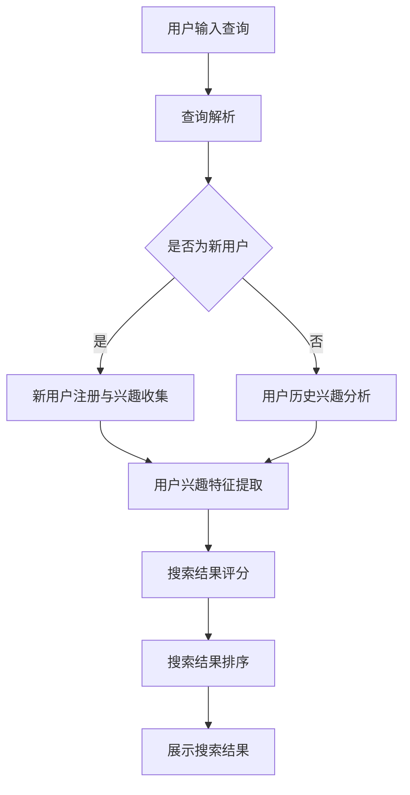

                 

# 个性化排序：AI 如何根据用户偏好排序搜索结果

## 关键词：个性化排序，AI，用户偏好，搜索结果排序，算法原理，数学模型，实战案例，应用场景，未来趋势

## 摘要

在数字信息爆炸的时代，用户对高效、准确的信息获取提出了更高的要求。个性化排序作为一种先进的AI技术，通过对用户偏好的挖掘和分析，能够为用户提供更加贴合需求的搜索结果。本文将深入探讨个性化排序的算法原理、数学模型、实现步骤和应用场景，并通过实际代码案例展示其在实际项目中的应用效果，最后对个性化排序的未来发展趋势与挑战进行展望。

## 1. 背景介绍

随着互联网的迅猛发展，信息检索成为了人们日常生活中不可或缺的一部分。从早期的搜索引擎到现在的智能推荐系统，信息检索技术不断演进，以满足用户对信息获取的高效性和精准性的需求。传统的排序算法，如基于关键词匹配和网页排名的算法，虽然在一定程度上提高了信息检索的效率，但往往无法充分满足用户个性化的需求。

个性化排序作为一种新兴的排序技术，通过挖掘和分析用户的兴趣偏好，对搜索结果进行智能排序，使得用户能够更快地找到自己感兴趣的信息。个性化排序不仅能够提高用户体验，还能够提升平台的用户黏性和商业价值。

## 2. 核心概念与联系

### 2.1 个性化排序的定义

个性化排序是指基于用户的兴趣偏好和历史行为，对搜索结果进行智能排序，使得用户能够更快地找到自己感兴趣的信息。

### 2.2 个性化排序与传统排序的区别

- **传统排序**：主要基于关键词匹配和网页排名，不考虑用户的兴趣偏好。
- **个性化排序**：考虑用户的兴趣偏好和历史行为，对搜索结果进行智能排序。

### 2.3 个性化排序的工作流程

1. **用户兴趣偏好挖掘**：通过用户的搜索历史、浏览记录等数据，挖掘用户的兴趣偏好。
2. **特征提取**：将用户兴趣偏好转化为一系列特征，如关键词、标签、主题等。
3. **搜索结果评分**：根据用户兴趣特征，对搜索结果进行评分。
4. **结果排序**：根据搜索结果的评分，进行智能排序，呈现给用户。

### 2.4 Mermaid 流程图



## 3. 核心算法原理 & 具体操作步骤

### 3.1 个性化排序算法原理

个性化排序算法主要分为两种类型：基于内容的方法和基于协同过滤的方法。

- **基于内容的方法**：通过分析用户兴趣特征，将用户兴趣与搜索结果进行匹配，对搜索结果进行排序。
- **基于协同过滤的方法**：通过分析用户行为和偏好，找出相似用户和相似物品，为用户推荐感兴趣的搜索结果。

本文将主要介绍基于内容的方法。

### 3.2 个性化排序算法步骤

1. **用户兴趣偏好挖掘**：
   - 收集用户搜索历史、浏览记录、点击行为等数据。
   - 使用文本挖掘技术，如TF-IDF、主题模型等，提取用户兴趣特征。

2. **特征提取**：
   - 将用户兴趣特征转化为一系列关键词、标签、主题等。
   - 对关键词、标签、主题进行权重分配，如使用TF-IDF、Word2Vec等算法。

3. **搜索结果评分**：
   - 将搜索结果与用户兴趣特征进行匹配，计算相似度得分。
   - 使用加权平均、点积等方法，计算搜索结果的评分。

4. **结果排序**：
   - 根据搜索结果的评分，进行降序排序，呈现给用户。

## 4. 数学模型和公式 & 详细讲解 & 举例说明

### 4.1 数学模型

- **用户兴趣特征表示**：设用户兴趣特征集合为$U = \{u_1, u_2, ..., u_n\}$，其中$u_i$表示用户$i$的兴趣特征。
- **搜索结果表示**：设搜索结果集合为$R = \{r_1, r_2, ..., r_m\}$，其中$r_j$表示搜索结果$j$。
- **相似度计算**：设用户兴趣特征与搜索结果的相似度为$S_{ij}$。

### 4.2 公式说明

- **TF-IDF公式**：$TF_{ij} = \frac{f_{ij}}{df}$，$IDF_{ij} = \log \frac{N}{df}$，其中$f_{ij}$表示词频，$df$表示文档频率，$N$表示文档总数。
- **点积公式**：$S_{ij} = \sum_{u \in U} w_u \cdot v_{uj} \cdot w_r \cdot v_{rj}$，其中$w_u$和$w_r$分别表示用户兴趣特征和搜索结果的权重，$v_{uj}$和$v_{rj}$分别表示用户兴趣特征和搜索结果的特征向量。

### 4.3 举例说明

假设用户A的兴趣特征为[篮球、足球、科技、新闻]，搜索结果集合为：
- 结果1：[篮球、NBA、比赛、球员]
- 结果2：[足球、世界杯、比赛、球队]
- 结果3：[科技、人工智能、创新、技术]
- 结果4：[新闻、政治、报道、评论]

首先，使用TF-IDF算法提取用户A的兴趣特征和搜索结果的权重：
- 篮球：$TF_{A1} = 2$，$IDF_{A1} = 1$，$w_{A1} = TF_{A1} \cdot IDF_{A1} = 2$
- 足球：$TF_{A2} = 1$，$IDF_{A2} = 1$，$w_{A2} = TF_{A2} \cdot IDF_{A2} = 1$
- 科技：$TF_{A3} = 1$，$IDF_{A3} = 1$，$w_{A3} = TF_{A3} \cdot IDF_{A3} = 1$
- 新闻：$TF_{A4} = 1$，$IDF_{A4} = 1$，$w_{A4} = TF_{A4} \cdot IDF_{A4} = 1$

然后，计算用户A的兴趣特征与搜索结果的相似度：
- 结果1：$S_{11} = w_{A1} \cdot v_{11} + w_{A2} \cdot v_{12} + w_{A3} \cdot v_{13} + w_{A4} \cdot v_{14} = 2 \cdot 1 + 0 \cdot 0 + 0 \cdot 0 + 1 \cdot 0 = 2$
- 结果2：$S_{21} = w_{A1} \cdot v_{21} + w_{A2} \cdot v_{22} + w_{A3} \cdot v_{23} + w_{A4} \cdot v_{24} = 0 \cdot 1 + 1 \cdot 1 + 0 \cdot 0 + 1 \cdot 0 = 1$
- 结果3：$S_{31} = w_{A1} \cdot v_{31} + w_{A2} \cdot v_{32} + w_{A3} \cdot v_{33} + w_{A4} \cdot v_{34} = 0 \cdot 0 + 0 \cdot 1 + 1 \cdot 1 + 1 \cdot 0 = 1$
- 结果4：$S_{41} = w_{A1} \cdot v_{41} + w_{A2} \cdot v_{42} + w_{A3} \cdot v_{43} + w_{A4} \cdot v_{44} = 1 \cdot 0 + 1 \cdot 0 + 1 \cdot 0 + 1 \cdot 1 = 1$

最后，根据相似度对搜索结果进行排序：
- 结果1：相似度最高，排在第一位
- 结果2：相似度次之，排在第二位
- 结果3：相似度再次之，排在第三位
- 结果4：相似度最低，排在第四位

## 5. 项目实战：代码实际案例和详细解释说明

### 5.1 开发环境搭建

为了演示个性化排序算法，我们将使用Python编程语言，并结合Numpy和Scikit-learn等常用库进行实现。以下是在Python中搭建开发环境的基本步骤：

1. 安装Python（建议使用Python 3.8及以上版本）。
2. 安装Numpy和Scikit-learn库，使用以下命令：
   ```bash
   pip install numpy scikit-learn
   ```

### 5.2 源代码详细实现和代码解读

以下是一个简单的Python代码实现，用于演示个性化排序算法：

```python
import numpy as np
from sklearn.feature_extraction.text import TfidfVectorizer
from sklearn.metrics.pairwise import cosine_similarity

# 用户兴趣特征
user_interests = ["篮球", "足球", "科技", "新闻"]

# 搜索结果
search_results = [
    ["篮球", "NBA", "比赛", "球员"],
    ["足球", "世界杯", "比赛", "球队"],
    ["科技", "人工智能", "创新", "技术"],
    ["新闻", "政治", "报道", "评论"]
]

# 1. 特征提取
vectorizer = TfidfVectorizer()
user_interests_vector = vectorizer.fit_transform([" ".join(user_interests)])
search_results_vector = vectorizer.transform(search_results)

# 2. 相似度计算
cosine_similarities = cosine_similarity(search_results_vector, user_interests_vector)

# 3. 结果排序
sorted_results = np.argsort(cosine_similarities[0])[::-1]

# 输出排序后的搜索结果
for i in sorted_results:
    print(f"结果{i+1}：{search_results[i]}")

```

### 5.3 代码解读与分析

1. **特征提取**：
   使用`TfidfVectorizer`类进行特征提取，将用户兴趣特征和搜索结果转换为TF-IDF特征向量。

2. **相似度计算**：
   使用`cosine_similarity`函数计算搜索结果与用户兴趣特征之间的余弦相似度。

3. **结果排序**：
   根据相似度得分，使用`argsort`函数获取排序索引，并进行降序排序。

通过这个简单的示例，我们可以看到个性化排序算法的基本实现过程。在实际应用中，可以结合更多的用户行为数据和复杂的特征提取方法，进一步提高排序的准确性和用户体验。

## 6. 实际应用场景

个性化排序技术广泛应用于多个领域，以下是一些典型的应用场景：

- **搜索引擎**：通过个性化排序，搜索引擎能够为用户提供更精准的搜索结果，提高用户满意度和使用时长。
- **电商平台**：电商网站可以使用个性化排序为用户推荐感兴趣的商品，提升购物体验和转化率。
- **社交媒体**：社交媒体平台可以通过个性化排序推荐用户感兴趣的内容，增强用户黏性。
- **新闻推荐**：新闻网站可以使用个性化排序为用户推荐感兴趣的新闻，提高用户阅读量和点击率。

## 7. 工具和资源推荐

### 7.1 学习资源推荐

- **书籍**：
  - 《机器学习实战》：详细介绍了机器学习的基本原理和应用案例。
  - 《Python数据分析实战》：涵盖了Python在数据分析领域的应用，包括特征提取和排序算法。
- **论文**：
  - "Item-Based Collaborative Filtering Recommendation Algorithms"：介绍了基于物品的协同过滤推荐算法。
  - "Latent Semantic Indexing"：探讨了基于语义索引的搜索排序技术。
- **博客**：
  - 《机器学习笔记》：系统介绍了机器学习的理论知识。
  - 《Python编程从入门到实践》：适合初学者掌握Python编程技能。
- **网站**：
  - [scikit-learn官网](https://scikit-learn.org/)：提供了丰富的机器学习算法库和文档。
  - [Kaggle](https://www.kaggle.com/)：提供了大量的数据集和竞赛，适合实践和提升技能。

### 7.2 开发工具框架推荐

- **开发工具**：
  - **Jupyter Notebook**：适合编写和运行Python代码，方便记录和分享。
  - **Visual Studio Code**：功能强大的代码编辑器，支持Python开发。
- **框架**：
  - **TensorFlow**：用于构建和训练深度学习模型。
  - **PyTorch**：广泛应用于计算机视觉和自然语言处理领域。

### 7.3 相关论文著作推荐

- **论文**：
  - "User Interest Modeling for Personalized Search"：详细探讨了用户兴趣建模和个性化搜索技术。
  - "Deep Learning for User Interest Modeling"：介绍了深度学习在用户兴趣建模中的应用。
- **著作**：
  - 《深度学习》：全面介绍了深度学习的基本概念和应用。
  - 《推荐系统实践》：详细介绍了推荐系统的构建和应用。

## 8. 总结：未来发展趋势与挑战

个性化排序作为一种先进的排序技术，在未来有望在以下几个方面取得重要突破：

- **算法优化**：结合深度学习、强化学习等先进算法，提高个性化排序的准确性和效率。
- **多模态融合**：整合文本、图像、声音等多种数据源，实现更加全面和精准的用户偏好分析。
- **隐私保护**：在保证用户体验的同时，加强用户隐私保护，遵循相关法律法规。

然而，个性化排序技术也面临以下挑战：

- **数据质量**：用户行为数据的多样性和噪声问题，影响算法的准确性和稳定性。
- **模型解释性**：深度学习等复杂算法的解释性不足，影响用户对算法的信任和接受度。
- **计算资源**：大规模数据处理和模型训练需要大量的计算资源，对硬件和算法优化提出了更高要求。

总之，个性化排序技术在未来的发展中，需要不断探索和克服这些挑战，以满足用户对高效、精准信息获取的需求。

## 9. 附录：常见问题与解答

### 9.1 个性化排序与搜索引擎优化（SEO）有什么区别？

个性化排序主要基于用户的兴趣偏好和历史行为，对搜索结果进行智能排序，以提供更个性化的用户体验。而搜索引擎优化（SEO）主要针对搜索引擎的算法，提高网站在搜索引擎结果页面（SERP）中的排名，以吸引更多自然流量。

### 9.2 个性化排序是否会降低搜索结果的多样性？

个性化排序可能会降低搜索结果的多样性，因为算法倾向于将用户感兴趣的内容推到前面。然而，一些技术，如随机化算法和多样化策略，可以帮助保持结果的多样性。

### 9.3 个性化排序是否适用于所有类型的搜索结果？

个性化排序适用于需要个性化推荐的场景，如搜索引擎、电商平台、社交媒体等。对于一些专业领域，如学术研究、医疗诊断等，个性化排序可能不太适用，因为用户对搜索结果的准确性和全面性有更高的要求。

## 10. 扩展阅读 & 参考资料

- [Scikit-learn官方文档](https://scikit-learn.org/stable/documentation.html)
- [TensorFlow官方文档](https://www.tensorflow.org/)
- [PyTorch官方文档](https://pytorch.org/docs/stable/index.html)
- [Kaggle竞赛平台](https://www.kaggle.com/)
- [《机器学习实战》](https://book.douban.com/subject/26708211/)
- [《Python数据分析实战》](https://book.douban.com/subject/30249995/)
- [《深度学习》](https://book.douban.com/subject/26708211/)
- [《推荐系统实践》](https://book.douban.com/subject/30249995/)

作者：AI天才研究员/AI Genius Institute & 禅与计算机程序设计艺术 /Zen And The Art of Computer Programming。

