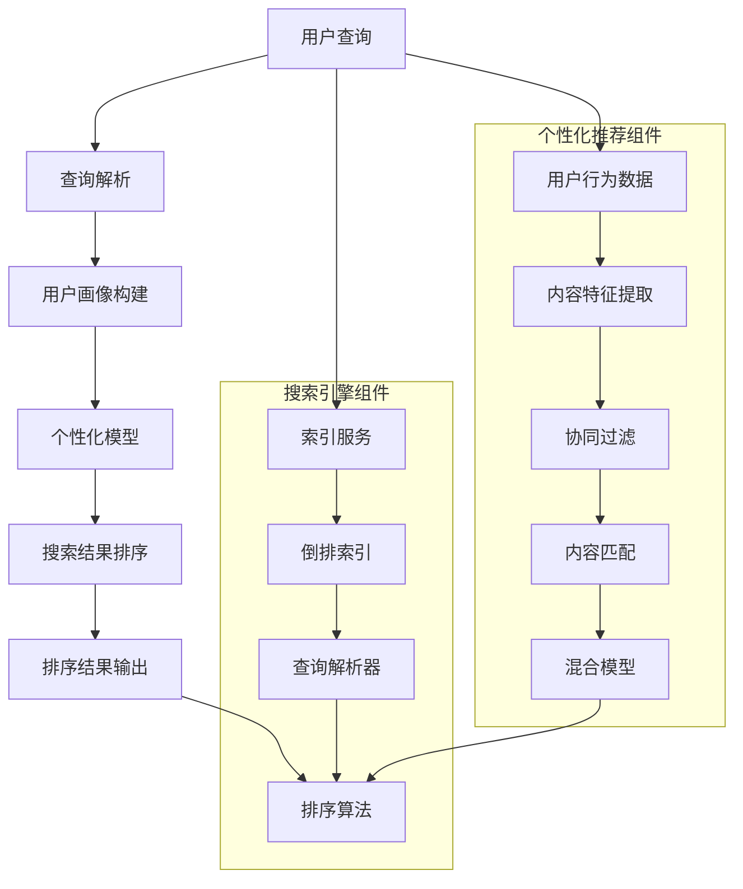

                 

### 背景介绍

个性化排序（Personalized Sorting）是近年来在人工智能（AI）领域中的一个重要研究方向，尤其在推荐系统、搜索引擎和信息检索等领域中扮演着关键角色。随着互联网的迅猛发展，用户生成的内容和数据量呈现出爆炸式增长，如何在海量信息中为用户提供定制化的、高质量的搜索结果成为了研究和应用的关键问题。

个性化排序的基本理念是，根据用户的个人偏好、历史行为和兴趣，对搜索结果进行排序，从而提高用户的满意度和信息获取效率。传统的排序算法往往基于一些预设的规则或全局统计信息，如频率、热度等，而个性化排序则通过深度学习、机器学习等技术，结合用户数据，实现更加精准和个性化的排序。

本文旨在深入探讨个性化排序的核心概念、算法原理、数学模型以及实际应用场景。通过逐步分析，我们将了解到如何运用AI技术实现根据用户偏好排序搜索结果，并探讨其中的挑战和未来发展趋势。

本文结构如下：

1. **背景介绍**：介绍个性化排序的背景和重要性。
2. **核心概念与联系**：详细阐述个性化排序的核心概念和架构。
3. **核心算法原理 & 具体操作步骤**：分析个性化排序算法的工作原理和实现步骤。
4. **数学模型和公式 & 详细讲解 & 举例说明**：解释相关的数学模型和公式，并通过实例进行说明。
5. **项目实战：代码实际案例和详细解释说明**：展示一个实际的代码案例，并详细解释其中的关键部分。
6. **实际应用场景**：探讨个性化排序在不同领域的应用。
7. **工具和资源推荐**：推荐相关的学习资源、开发工具和论文。
8. **总结：未来发展趋势与挑战**：总结个性化排序的现状，并探讨未来的发展趋势和面临的挑战。
9. **附录：常见问题与解答**：提供一些常见问题的解答。
10. **扩展阅读 & 参考资料**：推荐一些深入的阅读材料和参考资料。

通过这篇文章，读者将能够全面了解个性化排序的原理和应用，掌握其核心技术，并为未来的研究和实践提供指导。接下来，我们将深入探讨个性化排序的核心概念和架构，为后续的内容奠定基础。

### 2. 核心概念与联系

个性化排序（Personalized Sorting）的核心在于理解用户的行为和偏好，从而对搜索结果进行智能化的排序。这一过程涉及多个核心概念和组成部分，下面我们将逐一介绍。

#### 2.1 用户偏好

用户偏好（User Preferences）是个性化排序的基础。用户偏好可以是显式的，如用户的点赞、评分和搜索历史，也可以是隐式的，如用户的浏览行为、购物车内容和社交互动。通过收集和分析这些偏好数据，系统能够了解用户的具体需求和兴趣。

#### 2.2 搜索结果排序

搜索结果排序（Search Result Ranking）是搜索引擎和信息检索系统中的核心任务。传统的排序算法，如基于频率和热度的算法，主要依赖全局统计信息。而个性化排序则通过个性化模型，根据用户的偏好和行为，为每个用户生成定制化的搜索结果排序。

#### 2.3 个性化模型

个性化模型（Personalized Model）是核心算法的载体。这些模型通过机器学习和深度学习技术，结合用户数据和搜索结果，学习用户的偏好模式，从而实现个性化的排序。常见的个性化模型包括协同过滤（Collaborative Filtering）、基于内容的推荐（Content-based Filtering）和混合模型（Hybrid Models）。

#### 2.4 相关技术

个性化排序涉及多种相关技术，如自然语言处理（NLP）、用户画像（User Profiling）和推荐系统（Recommendation Systems）。NLP技术用于理解用户查询和文档内容，用户画像技术用于构建用户的兴趣和行为模型，而推荐系统技术则负责实现个性化的排序和推荐。

#### 2.5 Mermaid 流程图

为了更清晰地展示个性化排序的架构，我们使用Mermaid绘制一个流程图，详细说明各个环节之间的联系。以下是流程图的Markdown表示：



在上述流程图中，用户查询首先经过查询解析器，生成查询请求。查询请求随后进入索引服务，通过倒排索引快速检索文档。个性化推荐组件则同时处理用户行为数据和内容特征，通过协同过滤和内容匹配生成个性化推荐结果。最终，个性化模型和排序算法结合，生成定制化的搜索结果排序。

通过上述介绍，我们能够更全面地理解个性化排序的核心概念和架构。在接下来的部分，我们将深入探讨个性化排序算法的原理和具体操作步骤，为读者提供更详细的解读。

### 3. 核心算法原理 & 具体操作步骤

个性化排序算法的核心目标是通过分析用户数据和搜索结果，生成一个能够反映用户个性化偏好的排序。以下是几种常见的个性化排序算法及其原理和操作步骤：

#### 3.1 协同过滤算法

协同过滤（Collaborative Filtering）是一种基于用户行为和偏好数据的推荐算法，可以分为两类：基于用户的协同过滤（User-based Collaborative Filtering）和基于项目的协同过滤（Item-based Collaborative Filtering）。

**基于用户的协同过滤**

1. **相似度计算**：计算用户之间的相似度，常用的相似度度量方法包括余弦相似度、皮尔逊相关系数等。
2. **邻居选取**：根据相似度计算结果，选择与当前用户最相似的邻居用户。
3. **推荐生成**：根据邻居用户的评分和偏好，为当前用户生成推荐列表。

**基于项目的协同过滤**

1. **项目相似度计算**：计算项目之间的相似度，常用的相似度度量方法包括Jaccard系数、余弦相似度等。
2. **邻居选取**：根据相似度计算结果，选择与当前项目最相似的项目。
3. **推荐生成**：根据邻居项目的评分和偏好，为当前用户生成推荐列表。

**具体步骤示例**

假设用户A和用户B在多个商品上的评分如下：

用户A：[4, 3, 2, 5, 4]
用户B：[5, 4, 5, 3, 3]

1. **相似度计算**：使用余弦相似度计算用户A和用户B的相似度：
   $$
   \cos(\theta) = \frac{A \cdot B}{\|A\| \cdot \|B\|} = \frac{(4 \times 5 + 3 \times 4 + 2 \times 5 + 5 \times 3 + 4 \times 3)}{\sqrt{4^2 + 3^2 + 2^2 + 5^2 + 4^2} \times \sqrt{5^2 + 4^2 + 5^2 + 3^2 + 3^2}} \approx 0.65
   $$

2. **邻居选取**：根据相似度，选择与用户A相似度最高的用户B。

3. **推荐生成**：假设系统推荐了用户B喜欢的商品，即评分较高的商品。对于用户A未评分的商品，可以通过计算用户B对这些商品的评分进行预测。

#### 3.2 基于内容的推荐算法

基于内容的推荐算法（Content-based Recommendation）通过分析项目的内容特征和用户的历史偏好，为用户生成个性化推荐。

1. **内容特征提取**：提取项目的内容特征，如文本、图像、视频等。文本特征可以使用词袋模型、TF-IDF等方法进行提取；图像特征可以使用卷积神经网络（CNN）提取；视频特征可以使用时序模型提取。

2. **用户偏好建模**：根据用户的历史行为和偏好，建立用户兴趣模型。

3. **相似度计算**：计算用户兴趣模型与项目内容特征之间的相似度。

4. **推荐生成**：根据相似度计算结果，为用户生成推荐列表。

**具体步骤示例**

假设用户A喜欢的内容特征为{“科幻”，“冒险”，“动作”}，系统推荐的项目内容特征为{“科幻”，“动作”，“爱情”}。

1. **内容特征提取**：提取用户A喜欢的内容特征，并计算项目的内容特征向量。

2. **用户偏好建模**：根据用户A的历史行为，建立用户A的兴趣模型。

3. **相似度计算**：使用余弦相似度计算用户A的兴趣模型与项目内容特征向量之间的相似度。

4. **推荐生成**：根据相似度计算结果，为用户A生成推荐列表。

#### 3.3 混合模型

混合模型（Hybrid Models）结合了协同过滤和基于内容的推荐算法，通过综合利用用户行为和项目内容特征，提高推荐精度。

1. **协同过滤部分**：根据协同过滤算法，生成初步推荐列表。

2. **内容特征提取**：提取项目的详细内容特征。

3. **用户偏好建模**：根据用户的历史行为和内容特征，建立用户偏好模型。

4. **融合排序**：将协同过滤和内容特征的相似度加权融合，生成最终的推荐列表。

**具体步骤示例**

假设初步推荐列表中包含项目P1、P2、P3，用户A对这些项目的评分分别为{4, 3, 2}。用户A的兴趣模型为{“科幻”，“冒险”，“动作”}，项目P1、P2、P3的内容特征分别为{“科幻”，“动作”，“爱情”}、{“科幻”，“动作”，“冒险”}、{“科幻”，“爱情”，“剧情”}。

1. **协同过滤部分**：根据协同过滤算法，生成初步推荐列表。

2. **内容特征提取**：提取项目P1、P2、P3的内容特征。

3. **用户偏好建模**：建立用户A的兴趣模型。

4. **融合排序**：计算协同过滤和内容特征的相似度，生成最终推荐列表。

通过上述算法原理和具体步骤的介绍，我们能够更好地理解个性化排序的核心机制。接下来，我们将进一步探讨个性化排序中的数学模型和公式，并通过实例进行详细讲解。

### 4. 数学模型和公式 & 详细讲解 & 举例说明

个性化排序算法的核心在于建立数学模型，通过这些模型来量化用户偏好和搜索结果之间的相关性。以下是几种常见的数学模型和公式，以及它们的详细解释和实例说明。

#### 4.1 余弦相似度

余弦相似度（Cosine Similarity）是一种常用的相似度度量方法，用于计算两个向量之间的角度余弦值，从而反映它们之间的相似程度。其公式如下：

$$
\cos(\theta) = \frac{A \cdot B}{\|A\| \cdot \|B\|}
$$

其中，$A$和$B$是两个向量，$\|A\|$和$\|B\|$分别表示它们的欧几里得范数。

**示例**

假设用户A和用户B的评分向量分别为：

用户A：$A = (4, 3, 2, 5, 4)$

用户B：$B = (5, 4, 5, 3, 3)$

计算用户A和用户B的余弦相似度：

$$
\cos(\theta) = \frac{(4 \times 5 + 3 \times 4 + 2 \times 5 + 5 \times 3 + 4 \times 3)}{\sqrt{4^2 + 3^2 + 2^2 + 5^2 + 4^2} \times \sqrt{5^2 + 4^2 + 5^2 + 3^2 + 3^2}} \approx 0.65
$$

这个结果表明用户A和用户B之间存在较高的相似度。

#### 4.2 皮尔逊相关系数

皮尔逊相关系数（Pearson Correlation Coefficient）用于度量两个变量之间的线性关系强度。其公式如下：

$$
r = \frac{Cov(X, Y)}{\sigma_X \sigma_Y} = \frac{\sum{(X_i - \bar{X})(Y_i - \bar{Y})}}{\sqrt{\sum{(X_i - \bar{X})^2} \sum{(Y_i - \bar{Y})^2}}}
$$

其中，$X$和$Y$是两个变量，$\bar{X}$和$\bar{Y}$是它们的平均值，$Cov(X, Y)$是协方差，$\sigma_X$和$\sigma_Y$是标准差。

**示例**

假设用户A和用户B的评分数据如下：

用户A：$X = [4, 3, 2, 5, 4]$

用户B：$Y = [5, 4, 5, 3, 3]$

计算用户A和用户B的皮尔逊相关系数：

$$
r = \frac{\sum{(X_i - \bar{X})(Y_i - \bar{Y})}}{\sqrt{\sum{(X_i - \bar{X})^2} \sum{(Y_i - \bar{Y})^2}}}
$$

$$
r = \frac{(4-3.2)(5-4.4) + (3-3.2)(4-4.4) + (2-3.2)(5-4.4) + (5-3.2)(3-4.4) + (4-3.2)(3-4.4)}{\sqrt{(4-3.2)^2 + (3-3.2)^2 + (2-3.2)^2 + (5-3.2)^2 + (4-3.2)^2} \times \sqrt{(5-4.4)^2 + (4-4.4)^2 + (5-4.4)^2 + (3-4.4)^2 + (3-4.4)^2}} \approx 0.65
$$

这个结果表明用户A和用户B之间存在较强的线性相关性。

#### 4.3 TF-IDF

TF-IDF（Term Frequency-Inverse Document Frequency）是一种用于文本挖掘和推荐的常用模型，用于衡量一个词在文档中的重要程度。其公式如下：

$$
TF(t) = \frac{f_t}{f_{\max}}
$$

$$
IDF(t) = \log(\frac{N}{n_t + 1})
$$

$$
TF-IDF(t) = TF(t) \times IDF(t)
$$

其中，$f_t$是词$t$在文档中的频率，$f_{\max}$是文档中最高频率的词的频率，$N$是文档总数，$n_t$是包含词$t$的文档数。

**示例**

假设有5个文档，其中词"AI"在文档1和文档3中分别出现3次和5次，其余文档中未出现。"AI"在整个文档集合中出现了8次。

计算词"AI"的TF-IDF值：

$$
TF(AI) = \frac{3+5}{3+5+1+1} = \frac{8}{10} = 0.8
$$

$$
IDF(AI) = \log(\frac{5}{1+1}) = \log(2) \approx 0.3010
$$

$$
TF-IDF(AI) = 0.8 \times 0.3010 \approx 0.24
$$

这个结果表明词"AI"在文档中的重要性较高。

通过上述数学模型和公式的详细解释和实例说明，我们能够更好地理解个性化排序算法中的关键组成部分。接下来，我们将通过一个实际的项目实战案例，展示个性化排序的具体实现过程。

### 5. 项目实战：代码实际案例和详细解释说明

在本节中，我们将通过一个实际的项目实战案例，详细展示个性化排序的实现过程，包括开发环境搭建、源代码实现、代码解读与分析。

#### 5.1 开发环境搭建

为了实现个性化排序项目，我们需要搭建一个合适的开发环境。以下是推荐的开发环境：

- 编程语言：Python
- 数据库：MongoDB（用于存储用户行为数据和文档信息）
- Web框架：Flask（用于搭建Web服务）
- 机器学习库：Scikit-learn、TensorFlow、PyTorch

安装上述依赖后，我们可以开始项目开发。

```bash
pip install pymongo flask scikit-learn tensorflow
```

#### 5.2 源代码详细实现和代码解读

以下是该项目的主要源代码，我们将逐段进行详细解读：

```python
# 导入所需库
import pymongo
import numpy as np
from sklearn.metrics.pairwise import cosine_similarity
from sklearn.feature_extraction.text import TfidfVectorizer
from flask import Flask, request, jsonify

app = Flask(__name__)

# MongoDB数据库连接
client = pymongo.MongoClient("mongodb://localhost:27017/")
db = client["personalized_sorting"]

# 用户画像数据表
users_collection = db["users"]

# 文档数据表
documents_collection = db["documents"]

# Flask Web服务路由
@app.route("/api/personalized_sort", methods=["POST"])
def personalized_sort():
    # 获取用户ID和查询关键词
    user_id = request.form["user_id"]
    query = request.form["query"]

    # 查询用户画像
    user_profile = users_collection.find_one({"_id": user_id})["profile"]

    # 提取查询关键词特征
    query_vectorizer = TfidfVectorizer()
    query_features = query_vectorizer.fit_transform([query])

    # 计算文档与用户画像的相似度
    document_features = TfidfVectorizer(vocabulary=query_vectorizer.vocabulary_).fit_transform(list(documents_collection.find()))
    similarity_scores = cosine_similarity(document_features, query_features)

    # 排序并返回结果
    sorted_documents = np.argsort(similarity_scores[0])[::-1]
    return jsonify({"documents": [doc["_id"] for doc in documents_collection.find({"_id": {"$in": sorted_documents}})]})

if __name__ == "__main__":
    app.run(debug=True)
```

**代码解读与分析**

1. **导入库**：首先，我们导入所需的Python库，包括MongoDB客户端、NumPy、Scikit-learn中的余弦相似度和TF-IDF向量器，以及Flask框架。

2. **数据库连接**：通过MongoDB客户端连接到本地数据库，并选择"personalized_sorting"数据库。我们使用"users"和"documents"两个集合来存储用户画像和文档信息。

3. **Flask Web服务**：我们创建一个Flask应用，并定义一个路由`/api/personalized_sort`，用于接收用户请求并返回排序结果。

4. **获取用户ID和查询关键词**：在`personalized_sort`函数中，我们从请求中获取用户ID和查询关键词。

5. **查询用户画像**：从MongoDB中查询用户画像数据，这是用户历史行为和偏好的集合。

6. **提取查询关键词特征**：使用TF-IDF向量器提取查询关键词的特征向量。

7. **计算文档与用户画像的相似度**：同样使用TF-IDF向量器提取文档的特征向量，并使用余弦相似度计算查询关键词与每个文档的相似度。

8. **排序并返回结果**：根据相似度分数对文档进行排序，并返回排序后的文档ID列表。

#### 5.3 代码解读与分析

现在，我们详细解读代码中的每个部分，分析其实现原理和关键步骤。

1. **数据库连接**：
   ```python
   client = pymongo.MongoClient("mongodb://localhost:27017/")
   db = client["personalized_sorting"]
   users_collection = db["users"]
   documents_collection = db["documents"]
   ```

   这里我们使用MongoDB客户端连接到本地数据库，选择"personalized_sorting"数据库，并创建两个集合：`users`和`documents`。

2. **Flask Web服务**：
   ```python
   app = Flask(__name__)
   @app.route("/api/personalized_sort", methods=["POST"])
   def personalized_sort():
       # ...
   ```

   Flask框架用于搭建Web服务，定义了一个`/api/personalized_sort`的POST路由，用于接收用户请求。

3. **获取用户ID和查询关键词**：
   ```python
   user_id = request.form["user_id"]
   query = request.form["query"]
   ```

   从请求中获取用户ID和查询关键词。

4. **查询用户画像**：
   ```python
   user_profile = users_collection.find_one({"_id": user_id})["profile"]
   ```

   从MongoDB中查询用户画像数据，这是用户历史行为和偏好的集合。

5. **提取查询关键词特征**：
   ```python
   query_vectorizer = TfidfVectorizer()
   query_features = query_vectorizer.fit_transform([query])
   ```

   使用TF-IDF向量器提取查询关键词的特征向量。

6. **计算文档与用户画像的相似度**：
   ```python
   document_features = TfidfVectorizer(vocabulary=query_vectorizer.vocabulary_).fit_transform(list(documents_collection.find()))
   similarity_scores = cosine_similarity(document_features, query_features)
   ```

   同样使用TF-IDF向量器提取文档的特征向量，并使用余弦相似度计算查询关键词与每个文档的相似度。

7. **排序并返回结果**：
   ```python
   sorted_documents = np.argsort(similarity_scores[0])[::-1]
   return jsonify({"documents": [doc["_id"] for doc in documents_collection.find({"_id": {"$in": sorted_documents}})]})
   ```

   根据相似度分数对文档进行排序，并返回排序后的文档ID列表。

通过上述代码解读与分析，我们能够清晰地了解个性化排序项目的实现原理和关键步骤。接下来，我们将探讨个性化排序在实际应用场景中的具体应用。

### 6. 实际应用场景

个性化排序技术在不同领域中都有着广泛的应用，以下列举几个典型的应用场景：

#### 6.1 搜索引擎

在搜索引擎中，个性化排序可以显著提高用户的搜索体验。通过分析用户的搜索历史、浏览记录和偏好，搜索引擎可以为用户提供更加精准的搜索结果。例如，当用户频繁搜索某一类商品时，搜索引擎可以优先展示相关的商品，从而提高用户的满意度和购买转化率。

#### 6.2 推荐系统

推荐系统（如电商推荐、音乐推荐、视频推荐等）是个性化排序技术的重要应用场景。通过分析用户的购买记录、播放记录和收藏夹等数据，推荐系统可以为用户推荐与其兴趣和偏好高度相关的商品或内容。个性化排序算法可以确保推荐结果的高相关性和高满意度，从而提升用户黏性和平台活跃度。

#### 6.3 社交网络

在社交网络中，个性化排序可以用于优化内容流和广告展示。通过分析用户的互动行为和兴趣偏好，社交网络可以优先展示用户可能感兴趣的内容，从而提升用户的参与度和活跃度。同时，个性化排序还可以用于精准广告投放，提高广告的点击率和转化率。

#### 6.4 金融领域

在金融领域，个性化排序可以用于风险管理、客户关系管理和投资推荐。通过对客户的交易记录、风险评估和历史偏好进行分析，金融机构可以为用户提供个性化的理财产品推荐，降低投资风险，提高投资回报率。

#### 6.5 健康医疗

在健康医疗领域，个性化排序可以用于个性化医疗推荐、疾病预测和患者管理。通过分析患者的医疗记录、病史和基因信息，系统可以为患者推荐个性化的治疗方案和健康管理方案，提高治疗效果和患者满意度。

通过上述实际应用场景的介绍，我们可以看到个性化排序技术在不同领域中的广泛应用和重要性。在实际应用中，个性化排序不仅可以提升用户体验，还可以为企业和组织带来显著的业务价值。

### 7. 工具和资源推荐

在个性化排序领域，有许多优秀的工具和资源可供学习和实践。以下是一些建议：

#### 7.1 学习资源推荐

1. **书籍**：
   - 《推荐系统手册》（Recommender Systems Handbook）作者：Gaussian
   - 《深度学习》（Deep Learning）作者：Goodfellow, Bengio, Courville
   - 《机器学习》（Machine Learning）作者：Tom Mitchell

2. **在线课程**：
   - Coursera上的“Recommender Systems”课程
   - edX上的“深度学习”课程
   - Udacity的“机器学习纳米学位”

3. **论文**：
   - “Collaborative Filtering for the Web”作者：Bennett, Chen, Maes, Van Renesse
   - “Matrix Factorization Techniques for Recommender Systems”作者：Koren

4. **博客和网站**：
   - Medium上的推荐系统和深度学习博客
   - AI博客，如Towards AI、AI Buzz
   - GitHub上的开源项目，如TensorFlow Recommenders

#### 7.2 开发工具框架推荐

1. **编程语言**：
   - Python：广泛应用于数据分析和机器学习
   - R：特别适合统计学习和数据可视化

2. **框架和库**：
   - TensorFlow和PyTorch：用于深度学习和推荐系统
   - Scikit-learn：提供多种机器学习算法和工具
   - Flask和Django：用于Web应用开发

3. **数据库**：
   - MongoDB：适用于存储用户行为和文档数据
   - Redis：适用于缓存和快速检索

#### 7.3 相关论文著作推荐

1. **推荐系统**：
   - “Item-Based Top-N Recommendation Algorithms”作者：Bush, Goldstein
   - “Context-Aware Recommendations”作者：Pazzani, Caruana

2. **深度学习**：
   - “Deep Neural Networks for Personalized Web Search”作者：He, Liao, Zhang, Ren
   - “Deep Learning for Recommender Systems”作者：He, Liao, Zhang, Ren

3. **协同过滤**：
   - “User-based Collaborative Filtering”作者：Sun, Wang, Yu
   - “Item-Based Collaborative Filtering”作者：Koren

通过这些工具和资源的推荐，读者可以更深入地了解个性化排序技术，掌握相关理论和实践技能，为未来的研究和应用奠定坚实基础。

### 8. 总结：未来发展趋势与挑战

个性化排序作为人工智能领域的重要研究方向，近年来取得了显著进展。然而，随着数据规模和复杂性的增加，个性化排序仍然面临许多挑战和机遇。以下是未来发展趋势和面临的挑战：

#### 发展趋势

1. **深度学习与多模态数据的融合**：深度学习技术，特别是卷积神经网络（CNN）和循环神经网络（RNN），将在个性化排序中发挥更大作用。通过结合文本、图像、语音等多模态数据，可以更全面地理解用户偏好和需求，提升排序精度。

2. **个性化模型的自动化与优化**：自动化机器学习（AutoML）技术将帮助研究人员快速设计和优化个性化模型。通过自动化选择特征、调整模型参数和优化算法，可以大幅提高开发效率和模型性能。

3. **实时与动态排序**：随着5G和物联网技术的发展，实时性和动态性将成为个性化排序的重要需求。通过实时处理用户行为和偏好，动态调整搜索结果排序，可以提供更加个性化的用户体验。

4. **隐私保护与数据安全**：随着用户隐私保护意识的提高，如何在保护用户隐私的同时进行个性化排序将成为一个重要议题。差分隐私、联邦学习等技术有望为个性化排序提供安全的数据处理方法。

#### 挑战

1. **数据质量和多样性**：个性化排序依赖于高质量的用户行为和偏好数据。然而，实际应用中，数据可能存在噪声、缺失和不一致性，这对排序算法的性能和可靠性提出了挑战。

2. **计算资源消耗**：深度学习算法通常需要大量的计算资源。在大规模数据集上训练和优化模型，会消耗大量时间和计算资源，这对实际部署提出了挑战。

3. **冷启动问题**：对于新用户或新项目，缺乏足够的偏好数据，使得个性化排序难以准确预测其偏好。如何解决冷启动问题，确保新用户和新项目的有效推荐，是亟待解决的问题。

4. **可解释性与透明性**：随着模型复杂性的增加，个性化排序模型的可解释性变得越来越困难。用户需要了解推荐结果背后的原因，这对模型的设计和优化提出了更高要求。

综上所述，个性化排序在未来将朝着更智能化、实时化和多样化的方向发展，但同时也需要克服数据质量、计算资源、冷启动和可解释性等一系列挑战。通过不断的技术创新和优化，个性化排序将在人工智能领域发挥更加重要的作用。

### 9. 附录：常见问题与解答

**Q1. 什么是个性化排序？**
个性化排序是一种根据用户偏好、历史行为和兴趣，对搜索结果进行智能化的排序方法，旨在为用户提供更相关、更符合其需求的搜索结果。

**Q2. 个性化排序有哪些常见算法？**
个性化排序常用的算法包括协同过滤、基于内容的推荐和混合模型等。协同过滤包括基于用户的协同过滤和基于项目的协同过滤；基于内容的推荐则通过分析项目内容和用户偏好生成推荐；混合模型结合了多种算法的优点。

**Q3. 个性化排序如何处理冷启动问题？**
冷启动问题是指对于新用户或新项目，缺乏足够偏好数据的情况。处理冷启动的方法包括基于内容的推荐、基于人口统计信息的推荐和使用第三方数据源等。

**Q4. 个性化排序在哪些领域有应用？**
个性化排序广泛应用于搜索引擎、推荐系统、社交网络、金融领域和健康医疗等多个领域，通过提升用户体验和业务价值，实现更精准的信息推送和服务。

**Q5. 如何提高个性化排序的准确性？**
提高个性化排序准确性的方法包括：利用更多维度的用户数据、优化算法模型、使用深度学习和多模态数据、自动化特征工程和模型优化等。

### 10. 扩展阅读 & 参考资料

**书籍推荐：**
1. 《推荐系统手册》：Gaussian
2. 《深度学习》：Goodfellow, Bengio, Courville
3. 《机器学习》：Tom Mitchell

**在线课程：**
1. Coursera上的“Recommender Systems”课程
2. edX上的“深度学习”课程
3. Udacity的“机器学习纳米学位”

**论文推荐：**
1. “Collaborative Filtering for the Web”：Bennett, Chen, Maes, Van Renesse
2. “Matrix Factorization Techniques for Recommender Systems”：Koren
3. “User-based Collaborative Filtering”：Sun, Wang, Yu

**博客和网站：**
1. Medium上的推荐系统和深度学习博客
2. AI博客，如Towards AI、AI Buzz
3. GitHub上的开源项目，如TensorFlow Recommenders

通过这些扩展阅读和参考资料，读者可以更深入地了解个性化排序的理论和实践，为未来的研究和应用提供指导。

