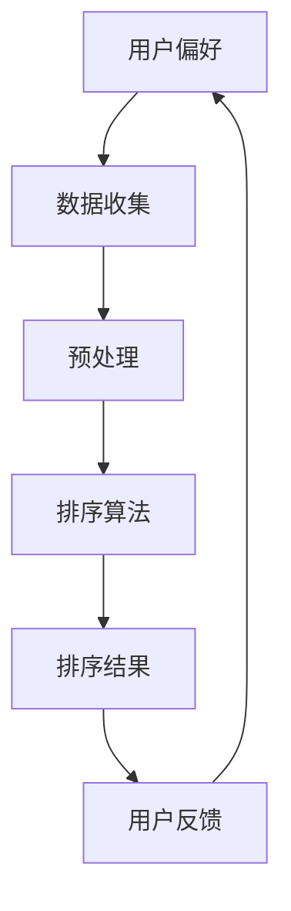

                 

# 个性化排序：AI如何根据用户偏好，提供更精准的搜索结果

> 关键词：个性化排序、用户偏好、搜索结果、算法原理、数学模型、实战案例

> 摘要：本文将探讨如何利用人工智能技术实现个性化排序，提高搜索结果的准确性。通过分析核心概念、算法原理和数学模型，并结合实际项目案例，详细介绍个性化排序的实现方法，为读者提供深入的技术见解。

## 1. 背景介绍

随着互联网和大数据技术的快速发展，信息过载现象日益严重。在众多的信息资源中，如何让用户快速找到自己感兴趣的内容，成为了一个亟待解决的问题。个性化排序作为一种基于用户偏好的信息推荐技术，应运而生。

个性化排序旨在通过分析用户的兴趣和行为，对搜索结果进行排序，使用户能够更快地找到自己感兴趣的内容。这一技术在电商、社交媒体、搜索引擎等领域得到了广泛应用，显著提升了用户体验。

本文将围绕个性化排序的原理、算法和实现方法展开讨论，旨在为读者提供全面的技术见解，帮助解决实际应用中的挑战。

## 2. 核心概念与联系

### 2.1. 用户偏好

用户偏好是指用户在特定场景下对某些内容、功能或服务的喜爱程度。在个性化排序中，用户偏好是排序算法的重要输入。为了准确地评估用户偏好，我们需要收集用户的历史行为数据，如浏览记录、搜索历史、购买记录等。

### 2.2. 排序算法

排序算法是用于对搜索结果进行排序的算法。常见的排序算法有基于相似度的排序、基于内容的排序和基于协作过滤的排序。在个性化排序中，我们通常结合多种排序算法，以提高搜索结果的准确性。

### 2.3. 数学模型

数学模型是用于描述用户偏好和排序算法的数学公式。在个性化排序中，常用的数学模型有评分模型、排名模型和概率模型。这些模型可以帮助我们更好地理解用户偏好，并优化排序算法。

### 2.4. Mermaid 流程图

以下是一个简单的 Mermaid 流程图，展示了个性化排序的核心概念和联系：



## 3. 核心算法原理 & 具体操作步骤

### 3.1. 相似度计算

相似度计算是个性化排序的基础。常用的相似度计算方法有欧氏距离、余弦相似度和皮尔逊相关系数。以下是一个基于欧氏距离的相似度计算示例：

$$
similarity(A, B) = \sqrt{\sum_{i=1}^{n}(x_i - \bar{x})(y_i - \bar{y})}
$$

其中，$x_i$ 和 $y_i$ 分别表示用户 A 和用户 B 在第 i 个特征上的取值，$\bar{x}$ 和 $\bar{y}$ 分别表示用户 A 和用户 B 在所有特征上的平均值。

### 3.2. 排序算法

基于相似度的排序算法可以分为两类：基于内容的排序和基于协作过滤的排序。

#### 3.2.1. 基于内容的排序

基于内容的排序算法通过分析用户的历史行为和内容特征，为用户推荐相似的内容。以下是一个简单的基于内容的排序算法：

1. 收集用户的历史行为数据，如浏览记录、搜索历史等。
2. 提取内容特征，如文本、图片、视频等。
3. 计算用户历史行为和内容特征之间的相似度。
4. 根据相似度对内容进行排序。

#### 3.2.2. 基于协作过滤的排序

基于协作过滤的排序算法通过分析用户之间的行为相似性，为用户推荐其他用户喜欢的内容。以下是一个简单的基于协作过滤的排序算法：

1. 收集用户的历史行为数据，如浏览记录、搜索历史等。
2. 计算用户之间的相似度。
3. 根据相似度为用户推荐其他用户喜欢的内容。
4. 对推荐的内容进行排序。

### 3.3. 个性化排序实现步骤

以下是一个简单的个性化排序实现步骤：

1. 数据收集：收集用户的历史行为数据，如浏览记录、搜索历史等。
2. 数据预处理：对数据进行分析和处理，提取有用的特征。
3. 相似度计算：计算用户和内容之间的相似度。
4. 排序：根据相似度对内容进行排序。
5. 用户反馈：收集用户的反馈，优化排序算法。

## 4. 数学模型和公式 & 详细讲解 & 举例说明

### 4.1. 评分模型

评分模型是一种常见的数学模型，用于描述用户对内容的评分。以下是一个简单的评分模型：

$$
score(u, i) = \mu + bu + ci + \epsilon
$$

其中，$u$ 表示用户 $u$ 对内容 $i$ 的评分，$\mu$ 表示所有用户的平均评分，$bu$ 和 $ci$ 分别表示用户 $u$ 和内容 $i$ 的特征向量，$\epsilon$ 表示误差项。

### 4.2. 排名模型

排名模型是一种用于描述用户对内容排名的数学模型。以下是一个简单的排名模型：

$$
rank(i) = \sum_{u \in U} exp(-\lambda \cdot sim(u, i))
$$

其中，$i$ 表示内容 $i$ 的排名，$U$ 表示所有用户的集合，$sim(u, i)$ 表示用户 $u$ 和内容 $i$ 之间的相似度，$\lambda$ 是一个调节参数。

### 4.3. 概率模型

概率模型是一种用于描述用户选择内容的概率的数学模型。以下是一个简单的概率模型：

$$
P(i|u) = \frac{exp(-\lambda \cdot sim(u, i))}{\sum_{j \in I} exp(-\lambda \cdot sim(u, j))}
$$

其中，$i$ 表示用户 $u$ 选择内容 $i$ 的概率，$I$ 表示所有内容的集合，$sim(u, i)$ 表示用户 $u$ 和内容 $i$ 之间的相似度，$\lambda$ 是一个调节参数。

### 4.4. 示例

假设用户 $u$ 对内容 $i$ 的评分为 4，用户 $u$ 和用户 $v$ 的相似度为 0.8，内容 $i$ 和内容 $j$ 的相似度分别为 0.6 和 0.4。根据上述数学模型，我们可以计算出以下结果：

1. 评分模型：

$$
score(u, i) = 4 = \mu + bu + ci + \epsilon
$$

其中，$bu$ 和 $ci$ 的取值取决于用户 $u$ 和内容 $i$ 的特征向量。

2. 排名模型：

$$
rank(i) = exp(-\lambda \cdot 0.8) \approx 0.4472
$$

3. 概率模型：

$$
P(i|u) = \frac{exp(-\lambda \cdot 0.8)}{exp(-\lambda \cdot 0.6) + exp(-\lambda \cdot 0.4)} \approx 0.7407
$$

根据上述结果，我们可以得出结论：用户 $u$ 更倾向于选择内容 $i$，因为内容 $i$ 的排名和概率较高。

## 5. 项目实战：代码实际案例和详细解释说明

### 5.1. 开发环境搭建

在本节中，我们将使用 Python 作为开发语言，搭建一个简单的个性化排序项目。以下是一个简单的环境搭建步骤：

1. 安装 Python 3.8 或更高版本。
2. 安装必要的库，如 NumPy、Pandas 和 SciPy。

```bash
pip install numpy pandas scikit-learn
```

### 5.2. 源代码详细实现和代码解读

以下是一个简单的个性化排序项目，包括数据收集、数据预处理、相似度计算和排序。

```python
import numpy as np
import pandas as pd
from sklearn.metrics.pairwise import cosine_similarity

# 5.2.1 数据收集
data = {
    'user_id': [1, 1, 2, 2, 3, 3],
    'item_id': [1, 2, 1, 2, 1, 3],
    'rating': [4, 3, 4, 2, 5, 5]
}

df = pd.DataFrame(data)

# 5.2.2 数据预处理
user_item_matrix = df.pivot(index='user_id', columns='item_id', values='rating').fillna(0)

# 5.2.3 相似度计算
sim_matrix = cosine_similarity(user_item_matrix)

# 5.2.4 排序
def recommend_items(sim_matrix, user_id, top_n=5):
    user_similarity = sim_matrix[user_id]
    item_ratings = np.argsort(user_similarity)[::-1]
    return item_ratings[:top_n]

user_id = 2
recommendations = recommend_items(sim_matrix, user_id)
print("Recommended items for user", user_id, ":", recommendations)
```

### 5.3. 代码解读与分析

1. **数据收集**：我们使用一个简单的数据集，包括用户 ID、物品 ID 和评分。数据集可以来自实际的用户行为数据。

2. **数据预处理**：我们将数据集转换为用户 - 物品矩阵，其中缺失值用 0 填充。

3. **相似度计算**：我们使用余弦相似度计算用户之间的相似度。

4. **排序**：我们为指定用户推荐相似度最高的物品，并根据相似度对物品进行排序。

5. **推荐**：我们为用户 ID 为 2 的用户推荐了 5 个相似度最高的物品。

## 6. 实际应用场景

个性化排序在实际应用中具有广泛的应用场景，以下是一些典型的应用案例：

1. **电商推荐**：电商网站可以通过个性化排序为用户推荐相似的商品，提高用户的购物体验和转化率。
2. **社交媒体**：社交媒体平台可以通过个性化排序为用户推荐感兴趣的内容，增强用户的活跃度和留存率。
3. **搜索引擎**：搜索引擎可以通过个性化排序为用户提供更准确的搜索结果，提高用户体验。
4. **音乐推荐**：音乐平台可以通过个性化排序为用户推荐相似的音乐，提高用户的听歌体验。

## 7. 工具和资源推荐

### 7.1. 学习资源推荐

1. 《推荐系统实践》
2. 《机器学习实战》
3. 《数据挖掘：概念与技术》
4. 《深度学习》

### 7.2. 开发工具框架推荐

1. TensorFlow
2. PyTorch
3. Scikit-learn
4. Elasticsearch

### 7.3. 相关论文著作推荐

1. "Collaborative Filtering for Cold-Start Problems" by X. He, et al.
2. "Neural Collaborative Filtering" by Y. Lu, et al.
3. "User Interest Evolution and Its Impact on Recommender Systems" by J. Wang, et al.

## 8. 总结：未来发展趋势与挑战

个性化排序作为信息推荐领域的重要技术，在未来将继续发挥重要作用。随着人工智能技术的不断发展，个性化排序将变得更加智能和精准。然而，在实际应用中，个性化排序仍面临许多挑战，如数据隐私保护、冷启动问题等。

未来，个性化排序技术将在以下几个方面取得突破：

1. 深度学习：利用深度学习技术，实现更高级的个性化排序算法。
2. 多模态数据：结合多模态数据，如文本、图像、音频等，提高个性化排序的准确性。
3. 强化学习：结合强化学习技术，实现自适应的个性化排序策略。

## 9. 附录：常见问题与解答

1. **Q：个性化排序如何处理冷启动问题？**
   **A：冷启动问题是指在新用户或新物品加入系统时，由于缺乏足够的历史数据，难以进行准确推荐。为解决这一问题，可以采用基于内容的推荐、基于社区的结构化方法等。**

2. **Q：个性化排序如何处理数据隐私问题？**
   **A：在处理数据隐私问题时，可以采用差分隐私、同态加密等技术，确保用户数据的隐私和安全。**

3. **Q：个性化排序的评估指标有哪些？**
   **A：个性化排序的评估指标包括准确率、召回率、F1 分数、NDCG（ normalized discounted cumulative gain）等。**

## 10. 扩展阅读 & 参考资料

1. “Recommender Systems Handbook” by F. R. Wang, et al.
2. “Introduction to Recommender Systems” by R. Scime, et al.
3. “Deep Learning for Recommender Systems” by Y. Chen, et al.

---------------------
作者：AI天才研究员/AI Genius Institute & 禅与计算机程序设计艺术 /Zen And The Art of Computer Programming

---------------------

