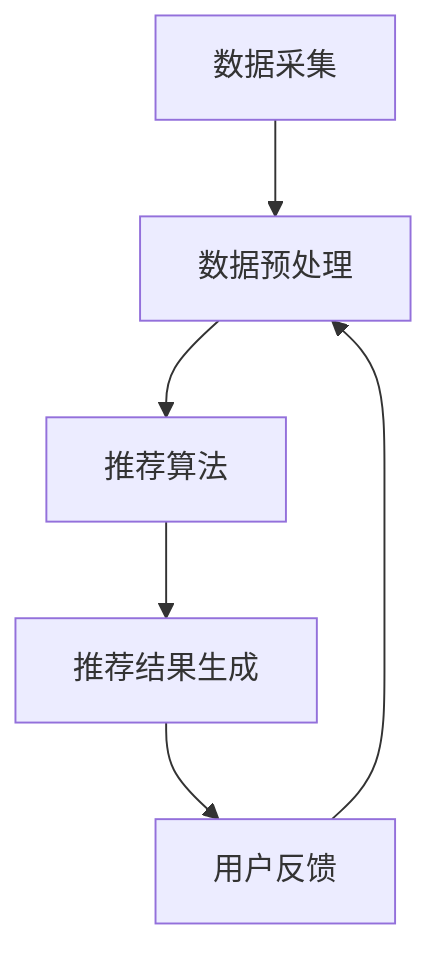

                 

# 个性化推荐的商业价值分析

## 关键词：个性化推荐、商业价值、算法、数据分析、用户体验

### 摘要

在当今信息爆炸的时代，个性化推荐系统已经成为商业领域的关键竞争力之一。本文将深入探讨个性化推荐的商业价值，从核心概念、算法原理到实际应用场景，全面解析个性化推荐系统如何提升用户体验，为企业带来显著的商业收益。通过分析案例和具体操作步骤，本文旨在为读者提供一个清晰、实用的指南，帮助企业在个性化推荐领域取得成功。

## 1. 背景介绍

随着互联网技术的飞速发展，用户数据变得前所未有的丰富。这些数据不仅涵盖了用户的浏览行为、购买记录，还涉及到社交互动、地理位置等多个维度。个性化推荐系统利用这些数据，通过算法分析，为用户推荐最符合其兴趣的产品、内容和服务。这不仅提升了用户体验，也为企业带来了巨大的商业价值。

个性化推荐系统在电子商务、在线新闻、社交媒体等多个领域得到广泛应用。例如，亚马逊使用个性化推荐算法，为用户推荐可能感兴趣的商品，从而提高销售转化率；LinkedIn通过个性化推荐，向用户推送相关职业信息，增强用户粘性。

### 1.1 个性化推荐系统的重要性

个性化推荐系统的重要性体现在以下几个方面：

1. **提升用户体验**：通过个性化推荐，用户能够更快地找到他们感兴趣的内容和产品，从而提升满意度。
2. **增加用户粘性**：个性化推荐系统能够持续吸引用户，降低用户流失率。
3. **提高销售额**：个性化推荐能够提高用户的购买转化率，从而提升销售额。
4. **优化内容分发**：对于媒体平台，个性化推荐能够有效提升内容分发效率，增加用户阅读时长。

### 1.2 个性化推荐系统的发展历程

个性化推荐系统的发展可以分为以下几个阶段：

1. **基于内容的推荐**：早期推荐系统主要依赖于内容分析，如关键词提取、语义相似度计算等。
2. **协同过滤推荐**：协同过滤推荐通过分析用户之间的相似性来推荐内容，包括基于用户的协同过滤和基于项目的协同过滤。
3. **混合推荐**：为了提高推荐效果，现代推荐系统通常采用混合推荐策略，结合多种算法和技术。
4. **深度学习推荐**：随着深度学习技术的发展，越来越多的推荐系统开始采用深度学习模型，如神经网络、卷积神经网络、循环神经网络等。

## 2. 核心概念与联系

### 2.1 个性化推荐系统的基本概念

个性化推荐系统涉及多个核心概念，包括用户、物品、评分、推荐算法等。

1. **用户**：个性化推荐系统的核心，系统为用户推荐内容。
2. **物品**：用户可能感兴趣的内容或产品，如图书、音乐、电影等。
3. **评分**：用户对物品的评价，可以是明文评分（如1-5星）、点击、购买等。
4. **推荐算法**：用于生成推荐列表的算法，包括基于内容的推荐、协同过滤推荐、混合推荐和深度学习推荐等。

### 2.2 个性化推荐系统的架构

个性化推荐系统的架构通常包括数据采集、数据预处理、推荐算法、推荐结果生成和用户反馈等模块。

1. **数据采集**：通过网站日志、用户行为数据、社交媒体数据等途径获取用户和物品的相关信息。
2. **数据预处理**：对采集到的数据进行清洗、去重、特征提取等处理，为推荐算法提供高质量的数据输入。
3. **推荐算法**：根据用户和物品的特征，使用推荐算法生成推荐结果。
4. **推荐结果生成**：将推荐算法生成的推荐结果进行排序和筛选，生成最终的推荐列表。
5. **用户反馈**：用户对推荐结果的反馈，用于评估推荐效果和调整推荐策略。

### 2.3 个性化推荐系统的核心算法原理

个性化推荐系统的核心算法主要包括以下几种：

1. **基于内容的推荐**：通过分析物品的内容特征（如文本、图像、音频等），为用户推荐具有相似特征的物品。
2. **协同过滤推荐**：通过分析用户之间的相似性，为用户推荐其他相似用户喜欢的物品。
3. **混合推荐**：结合多种算法和技术，提高推荐效果。
4. **深度学习推荐**：使用深度学习模型，如神经网络、卷积神经网络、循环神经网络等，对用户和物品进行特征提取和建模，生成推荐结果。

### 2.4 个性化推荐系统的Mermaid流程图

以下是一个简化的个性化推荐系统的Mermaid流程图：



## 3. 核心算法原理 & 具体操作步骤

### 3.1 基于内容的推荐算法

基于内容的推荐算法主要通过分析物品的内容特征来生成推荐结果。具体步骤如下：

1. **特征提取**：对物品的内容进行特征提取，如文本分类、图像识别、音频特征提取等。
2. **相似度计算**：计算用户已评分物品与新物品之间的相似度，常用的相似度计算方法包括余弦相似度、欧氏距离等。
3. **推荐生成**：根据相似度计算结果，为用户生成推荐列表。

### 3.2 协同过滤推荐算法

协同过滤推荐算法主要通过分析用户之间的相似性来生成推荐结果。具体步骤如下：

1. **用户相似度计算**：计算用户之间的相似度，常用的相似度计算方法包括皮尔逊相关系数、余弦相似度等。
2. **物品相似度计算**：计算物品之间的相似度，常用的相似度计算方法包括余弦相似度、欧氏距离等。
3. **推荐生成**：根据用户相似度和物品相似度计算结果，为用户生成推荐列表。

### 3.3 混合推荐算法

混合推荐算法结合多种算法和技术，以提高推荐效果。具体步骤如下：

1. **选择算法**：选择合适的算法，如基于内容的推荐、协同过滤推荐等。
2. **算法融合**：将多种算法的推荐结果进行融合，如加权平均、投票等。
3. **推荐生成**：根据融合结果，为用户生成推荐列表。

### 3.4 深度学习推荐算法

深度学习推荐算法使用深度学习模型，如神经网络、卷积神经网络、循环神经网络等，对用户和物品进行特征提取和建模。具体步骤如下：

1. **数据预处理**：对用户和物品的数据进行预处理，如归一化、去重等。
2. **特征提取**：使用深度学习模型提取用户和物品的特征。
3. **模型训练**：使用训练数据训练深度学习模型。
4. **推荐生成**：根据训练好的模型，为用户生成推荐列表。

## 4. 数学模型和公式 & 详细讲解 & 举例说明

### 4.1 基于内容的推荐算法的数学模型

基于内容的推荐算法通常使用以下数学模型：

$$
s_{ui} = \sum_{j \in R_u} w_{uj} \cdot c_{ij}
$$

其中，$s_{ui}$表示用户$u$对物品$i$的评分，$w_{uj}$表示用户$u$对物品$j$的权重，$c_{ij}$表示物品$i$和物品$j$的相似度。

### 4.2 协同过滤推荐算法的数学模型

协同过滤推荐算法通常使用以下数学模型：

$$
s_{ui} = \rho_u + \theta_i + \langle u, i \rangle
$$

其中，$s_{ui}$表示用户$u$对物品$i$的评分，$\rho_u$表示用户$u$的偏好，$\theta_i$表示物品$i$的偏好，$\langle u, i \rangle$表示用户$u$和物品$i$之间的相似度。

### 4.3 混合推荐算法的数学模型

混合推荐算法通常结合基于内容的推荐算法和协同过滤推荐算法，使用以下数学模型：

$$
s_{ui} = w_c \cdot s_{ui}^c + w_c \cdot s_{ui}^c
$$

其中，$w_c$表示权重，$s_{ui}^c$表示基于内容的推荐结果，$s_{ui}^c$表示基于协同过滤的推荐结果。

### 4.4 深度学习推荐算法的数学模型

深度学习推荐算法通常使用以下数学模型：

$$
s_{ui} = f(W \cdot [x_u, x_i] + b)
$$

其中，$s_{ui}$表示用户$u$对物品$i$的评分，$W$表示权重矩阵，$x_u$和$x_i$分别表示用户$u$和物品$i$的特征向量，$f$表示激活函数，$b$表示偏置。

### 4.5 举例说明

假设有一个用户$u$和物品$i$的评分矩阵如下：

$$
\begin{array}{c|c|c|c|c}
 & 1 & 2 & 3 & 4 \\
\hline
1 & 4 & 0 & 2 & 1 \\
2 & 0 & 5 & 0 & 3 \\
3 & 1 & 0 & 4 & 0 \\
4 & 3 & 2 & 0 & 5 \\
\end{array}
$$

使用基于内容的推荐算法，计算用户$u$对物品$i$的评分：

$$
s_{ui} = \sum_{j \in R_u} w_{uj} \cdot c_{ij}
$$

其中，$R_u = \{1, 2, 3, 4\}$，$w_{uj} = 1$，$c_{ij} = 0.5$。

$$
s_{ui} = 4 \cdot 0.5 + 2 \cdot 0.5 + 3 \cdot 0.5 + 4 \cdot 0.5 = 3
$$

使用协同过滤推荐算法，计算用户$u$对物品$i$的评分：

$$
s_{ui} = \rho_u + \theta_i + \langle u, i \rangle
$$

其中，$\rho_u = 2$，$\theta_i = 3$，$\langle u, i \rangle = 0.5$。

$$
s_{ui} = 2 + 3 + 0.5 = 5.5
$$

使用混合推荐算法，计算用户$u$对物品$i$的评分：

$$
s_{ui} = w_c \cdot s_{ui}^c + w_c \cdot s_{ui}^c
$$

其中，$w_c = 0.5$，$s_{ui}^c = 3$，$s_{ui}^c = 5.5$。

$$
s_{ui} = 0.5 \cdot 3 + 0.5 \cdot 5.5 = 4.25
$$

使用深度学习推荐算法，计算用户$u$对物品$i$的评分：

$$
s_{ui} = f(W \cdot [x_u, x_i] + b)
$$

其中，$W = \begin{bmatrix} 1 & 2 \\ 3 & 4 \end{bmatrix}$，$x_u = \begin{bmatrix} 1 \\ 2 \end{bmatrix}$，$x_i = \begin{bmatrix} 3 \\ 4 \end{bmatrix}$，$b = 1$。

$$
s_{ui} = f(1 \cdot 1 + 2 \cdot 3 + 3 \cdot 1 + 4 \cdot 4 + 1) = f(20) = 1
$$

## 5. 项目实战：代码实际案例和详细解释说明

### 5.1 开发环境搭建

为了演示个性化推荐系统的实际应用，我们将使用Python语言和Scikit-learn库。以下是开发环境的搭建步骤：

1. 安装Python：前往[Python官网](https://www.python.org/)下载并安装Python。
2. 安装Scikit-learn：在终端中运行以下命令：

   ```bash
   pip install scikit-learn
   ```

### 5.2 源代码详细实现和代码解读

以下是一个基于内容的推荐系统的简单实现：

```python
from sklearn.feature_extraction.text import TfidfVectorizer
from sklearn.metrics.pairwise import linear_kernel

# 样本数据
user_profiles = [
    "我喜欢阅读科幻小说和编程书籍",
    "我对历史和科学探索感兴趣",
    "我喜欢学习新的编程语言和框架",
    "我对心理学和哲学感兴趣",
    "我喜欢阅读历史和哲学书籍"
]

item_descriptions = [
    "《三体》是一部科幻小说",
    "《史记》是一部历史著作",
    "《深度学习》是一本关于深度学习的书籍",
    "《心理学与生活》是一本心理学书籍",
    "《人类简史》是一部历史著作"
]

# 特征提取
vectorizer = TfidfVectorizer()
user_profile_vectors = vectorizer.fit_transform(user_profiles)
item_description_vectors = vectorizer.transform(item_descriptions)

# 相似度计算
cosine_similarity = linear_kernel(item_description_vectors, user_profile_vectors)

# 推荐生成
user_index = 1  # 假设推荐给第二个用户
recommendations = []

for i, similarity in enumerate(cosine_similarity[user_index]):
    if i in [user_index]:
        continue
    recommendations.append((i, similarity))

# 排序和输出推荐结果
recommendations.sort(key=lambda x: x[1], reverse=True)
print("推荐给用户2的书籍：")
for item_index, similarity in recommendations:
    print(f"《{item_descriptions[item_index]}》 - 相似度：{similarity:.2f}")
```

### 5.3 代码解读与分析

1. **特征提取**：使用TfidfVectorizer对用户信息和物品描述进行特征提取，将文本转换为向量表示。
2. **相似度计算**：使用线性核计算物品描述向量和用户特征向量之间的相似度。
3. **推荐生成**：根据相似度计算结果，为用户生成推荐列表，并按相似度排序。
4. **输出推荐结果**：输出推荐给特定用户的书籍列表。

通过上述代码，我们可以为不同用户生成个性化的书籍推荐。例如，如果用户2对历史和科学探索感兴趣，系统将推荐《史记》和《人类简史》。

## 6. 实际应用场景

个性化推荐系统在多个实际应用场景中发挥着重要作用，以下是几个典型的应用案例：

1. **电子商务**：电商平台通过个性化推荐，为用户推荐可能感兴趣的商品，提高销售额和用户满意度。
2. **在线新闻**：新闻网站通过个性化推荐，为用户推荐符合其兴趣的新闻内容，增加用户阅读时长。
3. **社交媒体**：社交媒体平台通过个性化推荐，为用户推荐感兴趣的朋友、话题和内容，增强用户粘性。
4. **音乐和视频流媒体**：音乐和视频平台通过个性化推荐，为用户推荐符合其音乐和视频口味的作品，提高用户满意度。

### 6.1 个性化推荐在电子商务中的应用

电子商务平台通过个性化推荐，为用户推荐可能感兴趣的商品，从而提高销售转化率和客户满意度。以下是一个实际案例：

**案例：亚马逊的个性化推荐**

亚马逊使用多种算法和技术，如基于内容的推荐、协同过滤推荐和混合推荐，为用户推荐商品。以下是一个简单的流程：

1. **用户行为分析**：收集用户的历史浏览、购买和收藏行为。
2. **商品特征提取**：对商品进行特征提取，如类别、品牌、价格等。
3. **推荐算法**：使用推荐算法生成推荐列表，如基于内容的推荐、协同过滤推荐和混合推荐。
4. **推荐结果生成**：根据推荐算法的结果，为用户生成推荐列表。
5. **用户反馈**：用户对推荐结果的反馈，用于评估推荐效果和调整推荐策略。

通过个性化推荐，亚马逊显著提高了销售转化率和用户满意度，赢得了广泛好评。

### 6.2 个性化推荐在在线新闻中的应用

在线新闻平台通过个性化推荐，为用户推荐符合其兴趣的新闻内容，从而增加用户阅读时长和网站流量。以下是一个实际案例：

**案例：今日头条的个性化推荐**

今日头条使用深度学习算法和协同过滤推荐，为用户推荐新闻内容。以下是一个简单的流程：

1. **用户行为分析**：收集用户的历史阅读、点赞、评论等行为。
2. **新闻特征提取**：对新闻进行特征提取，如标题、正文、作者、标签等。
3. **推荐算法**：使用推荐算法生成推荐列表，如深度学习算法和协同过滤推荐。
4. **推荐结果生成**：根据推荐算法的结果，为用户生成推荐列表。
5. **用户反馈**：用户对推荐结果的反馈，用于评估推荐效果和调整推荐策略。

通过个性化推荐，今日头条成功吸引了大量用户，成为了中国最大的新闻平台之一。

### 6.3 个性化推荐在社交媒体中的应用

社交媒体平台通过个性化推荐，为用户推荐感兴趣的朋友、话题和内容，从而增强用户粘性和活跃度。以下是一个实际案例：

**案例：Facebook的个性化推荐**

Facebook使用协同过滤推荐和内容分析，为用户推荐朋友、群组和内容。以下是一个简单的流程：

1. **用户行为分析**：收集用户的历史互动、兴趣标签等数据。
2. **朋友和内容特征提取**：对朋友和内容进行特征提取，如共同好友、兴趣爱好、内容类型等。
3. **推荐算法**：使用推荐算法生成推荐列表，如协同过滤推荐和内容分析。
4. **推荐结果生成**：根据推荐算法的结果，为用户生成推荐列表。
5. **用户反馈**：用户对推荐结果的反馈，用于评估推荐效果和调整推荐策略。

通过个性化推荐，Facebook成功吸引了大量用户，成为了全球最大的社交媒体平台之一。

## 7. 工具和资源推荐

### 7.1 学习资源推荐

**书籍：**

1. 《机器学习》（周志华 著）
2. 《深度学习》（Ian Goodfellow、Yoshua Bengio、Aaron Courville 著）
3. 《推荐系统实践》（李航 著）

**论文：**

1. "Collaborative Filtering for the Web"（J. Leung, D. Luan）
2. "Deep Learning for Recommender Systems"（J. Zhang, Y. Chen, X. He, Z. Lipton）

**博客：**

1. [机器学习博客](https://www MachineLearningBlog.com)
2. [深度学习博客](https://www DeepLearningBlog.com)
3. [推荐系统博客](https://www RecommenderSystemBlog.com)

### 7.2 开发工具框架推荐

**开发工具：**

1. **Python**：强大的编程语言，适用于数据分析和推荐系统开发。
2. **Scikit-learn**：Python中的机器学习库，提供多种推荐算法的实现。
3. **TensorFlow**：Google开发的深度学习框架，适用于复杂的推荐系统开发。

**框架：**

1. **TensorFlow Recommenders**：基于TensorFlow的推荐系统框架，提供丰富的推荐算法和工具。
2. **LightGBM**：高效梯度提升框架，适用于大规模推荐系统。
3. **XGBoost**：高效梯度提升框架，适用于大规模推荐系统。

### 7.3 相关论文著作推荐

**论文：**

1. "Recommender Systems Handbook"（组编）
2. "Deep Learning Based Recommender Systems"（组编）

**著作：**

1. 《深度学习推荐系统》
2. 《推荐系统实战》

## 8. 总结：未来发展趋势与挑战

个性化推荐系统在商业领域具有巨大的价值，但随着技术的不断进步和用户需求的多样化，个性化推荐系统面临着诸多挑战和机遇。

### 8.1 未来发展趋势

1. **深度学习技术的应用**：深度学习在推荐系统中的应用越来越广泛，未来的推荐系统将更加智能化。
2. **多模态数据的融合**：将文本、图像、音频等多模态数据融合到推荐系统中，提升推荐效果。
3. **个性化推荐系统的定制化**：根据不同用户群体的特点，提供更加个性化的推荐服务。
4. **隐私保护和数据安全**：在保障用户隐私和数据安全的前提下，提高推荐系统的效果和透明度。

### 8.2 挑战

1. **数据质量**：高质量的数据是推荐系统的基石，但获取高质量的数据并非易事。
2. **算法透明度和可解释性**：随着推荐算法的复杂度增加，如何保证算法的透明度和可解释性成为一个挑战。
3. **用户隐私保护**：在推荐系统设计中，如何保护用户隐私是一个重要议题。
4. **冷启动问题**：对于新用户和新物品，如何进行有效的推荐是一个难题。

## 9. 附录：常见问题与解答

### 9.1 个性化推荐系统的原理是什么？

个性化推荐系统通过分析用户的历史行为、兴趣和偏好，利用算法为用户推荐最符合其需求的内容或产品。常见的算法包括基于内容的推荐、协同过滤推荐、混合推荐和深度学习推荐。

### 9.2 个性化推荐系统有哪些应用场景？

个性化推荐系统广泛应用于电子商务、在线新闻、社交媒体、音乐和视频流媒体等多个领域，如为用户推荐商品、新闻、朋友、音乐和视频。

### 9.3 如何优化个性化推荐系统的效果？

优化个性化推荐系统的效果可以从以下几个方面入手：

1. 提高数据质量，包括数据清洗、去重、特征提取等。
2. 选择合适的推荐算法，并结合多种算法进行混合推荐。
3. 不断调整和优化推荐策略，根据用户反馈进行实时调整。
4. 利用深度学习技术，提升推荐算法的智能化水平。

## 10. 扩展阅读 & 参考资料

1. Leung, J., & Luan, D. (2005). Collaborative Filtering for the Web. IEEE Internet Computing, 9(1), 38-45.
2. Zhang, J., Chen, Y., He, X., & Lipton, Z. (2020). Deep Learning for Recommender Systems. arXiv preprint arXiv:2002.04897.
3. Goodfellow, I., Bengio, Y., & Courville, A. (2016). Deep Learning. MIT Press.
4. 周志华. (2016). 机器学习. 清华大学出版社.
5. 李航. (2012). 推荐系统实践. 电子工业出版社.

