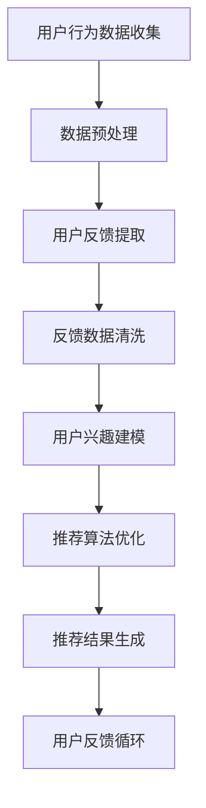

                 

# 个性化推荐的用户反馈分析

## 关键词
- 个性化推荐
- 用户反馈
- 数据分析
- 算法优化
- 用户行为分析
- 数据挖掘

## 摘要
本文将深入探讨个性化推荐系统中的用户反馈分析。通过逐步分析用户反馈数据，我们将揭示其背后的原理，并提出有效的算法优化策略。本文旨在帮助读者了解如何利用用户反馈数据提升推荐系统的性能，并提供实际案例和实践指导。文章将涵盖个性化推荐系统的背景、核心概念、算法原理、数学模型、项目实战、实际应用场景以及未来发展趋势。

## 1. 背景介绍

随着互联网的迅猛发展和大数据时代的到来，个性化推荐系统已成为许多在线服务和平台的基石。这些系统旨在根据用户的兴趣和行为，向他们推荐个性化内容，从而提高用户满意度和平台留存率。

用户反馈在个性化推荐系统中扮演着至关重要的角色。通过收集和分析用户对推荐结果的反馈，我们可以了解用户的真实需求，发现潜在的问题，并对推荐算法进行优化。

用户反馈的来源多种多样，包括点击、收藏、评分、评论等行为数据。这些数据为我们提供了深入了解用户偏好的窗口，使我们能够更好地调整推荐策略。

然而，用户反馈数据存在噪声、稀疏性和不一致性等问题，给数据分析带来了挑战。如何有效地处理这些数据，提取有价值的信息，是当前研究的热点问题。

## 2. 核心概念与联系

### 2.1 个性化推荐系统

个性化推荐系统是一种基于用户历史行为和偏好，为用户提供个性化内容推荐的技术。其核心概念包括：

- **用户模型**：记录用户的兴趣、偏好和历史行为，用于生成个性化推荐。
- **物品模型**：描述物品的属性、标签和类别，用于与用户模型进行匹配。
- **推荐算法**：根据用户模型和物品模型，生成推荐列表。

### 2.2 用户反馈数据

用户反馈数据是用户对推荐结果的直接评价。这些数据包括：

- **点击数据**：用户点击了哪些推荐内容。
- **收藏数据**：用户收藏了哪些推荐内容。
- **评分数据**：用户对推荐内容的评分。
- **评论数据**：用户对推荐内容的评论。

### 2.3 用户反馈与推荐算法的关系

用户反馈数据对推荐算法的优化至关重要。通过分析用户反馈，我们可以：

- 发现用户兴趣的变化和趋势。
- 识别推荐算法存在的问题和不足。
- 调整推荐策略，提高推荐效果。

### 2.4 Mermaid 流程图

以下是用户反馈分析的 Mermaid 流程图：



## 3. 核心算法原理 & 具体操作步骤

### 3.1 用户行为数据分析

用户行为数据是用户在平台上产生的各种操作记录，包括点击、浏览、购买、评分等。这些数据反映了用户的兴趣和行为模式。通过分析这些数据，我们可以：

- 构建用户兴趣模型：记录用户对各个类别的物品的兴趣程度。
- 分析用户行为模式：了解用户在平台上的行为习惯和偏好。

### 3.2 用户反馈数据挖掘

用户反馈数据挖掘旨在从用户反馈中提取有价值的信息，以指导推荐算法的优化。具体步骤如下：

- **数据预处理**：对原始反馈数据进行清洗、去重和格式转换。
- **特征工程**：提取用户反馈数据中的关键特征，如用户活跃度、推荐内容类型、用户兴趣等。
- **模型训练**：利用机器学习算法训练用户反馈预测模型。

### 3.3 推荐算法优化

基于用户反馈数据，我们可以对推荐算法进行优化，以提高推荐效果。具体策略包括：

- **协同过滤**：利用用户历史行为数据，为用户推荐相似用户喜欢的物品。
- **基于内容的推荐**：根据物品的属性和标签，为用户推荐与其兴趣相关的物品。
- **混合推荐**：结合协同过滤和基于内容的推荐，提高推荐准确性。

### 3.4 用户反馈循环

用户反馈循环是指将用户反馈数据反馈到推荐系统中，以不断调整和优化推荐策略。具体步骤如下：

- **收集反馈数据**：实时收集用户对推荐内容的反馈，包括点击、评分、评论等。
- **分析反馈数据**：对收集到的反馈数据进行挖掘和分析，提取有价值的信息。
- **调整推荐策略**：根据分析结果，调整推荐算法的参数和策略，以提高推荐效果。

## 4. 数学模型和公式 & 详细讲解 & 举例说明

### 4.1 协同过滤算法

协同过滤算法是一种常见的推荐算法，其核心思想是利用用户历史行为数据，为用户推荐相似用户喜欢的物品。具体公式如下：

$$
\hat{r}_{ui} = \frac{\sum_{j \in N(i) \cap M(u)} r_{uj} s_{ij}}{\sum_{j \in N(i) \cap M(u)} s_{ij}}
$$

其中：

- $\hat{r}_{ui}$：用户 $u$ 对物品 $i$ 的预测评分。
- $r_{uj}$：用户 $u$ 对物品 $j$ 的实际评分。
- $s_{ij}$：物品 $i$ 和物品 $j$ 的相似度。
- $N(i)$：与物品 $i$ 相似的物品集合。
- $M(u)$：用户 $u$ 已经评分的物品集合。

### 4.2 基于内容的推荐算法

基于内容的推荐算法是根据物品的属性和标签，为用户推荐与其兴趣相关的物品。具体公式如下：

$$
\hat{r}_{ui} = \sum_{k \in K(i)} w_{ik} p(u|k)
$$

其中：

- $\hat{r}_{ui}$：用户 $u$ 对物品 $i$ 的预测评分。
- $w_{ik}$：物品 $i$ 的属性 $k$ 对用户 $u$ 的兴趣权重。
- $p(u|k)$：用户 $u$ 对属性 $k$ 的兴趣概率。

### 4.3 举例说明

假设我们有以下用户 $u$ 和物品 $i$ 的数据：

用户 $u$ 对物品 $i$ 的实际评分 $r_{ui} = 5$。物品 $i$ 的标签包括“电影”、“动作”和“科幻”。用户 $u$ 对标签的兴趣概率为：

- $p(u|电影) = 0.6$
- $p(u|动作) = 0.3$
- $p(u|科幻) = 0.1$

根据基于内容的推荐算法，我们可以计算用户 $u$ 对物品 $i$ 的预测评分：

$$
\hat{r}_{ui} = 0.6 \times 5 + 0.3 \times 5 + 0.1 \times 5 = 3.5
$$

## 5. 项目实战：代码实际案例和详细解释说明

### 5.1 开发环境搭建

为了演示用户反馈分析在实际项目中的应用，我们使用 Python 编写一个简单的推荐系统。首先，我们需要搭建开发环境。

1. 安装 Python 3.8 及以上版本。
2. 安装必要的库，如 NumPy、Pandas、Scikit-learn、Matplotlib。

### 5.2 源代码详细实现和代码解读

以下是用户反馈分析的 Python 代码实现：

```python
import numpy as np
import pandas as pd
from sklearn.model_selection import train_test_split
from sklearn.metrics.pairwise import cosine_similarity
from sklearn.preprocessing import MinMaxScaler

# 数据预处理
def preprocess_data(data):
    # 清洗数据，去除空值和重复值
    data = data.dropna().drop_duplicates()
    # 转换数据类型
    data['rating'] = data['rating'].astype(float)
    return data

# 计算相似度矩阵
def compute_similarity_matrix(data):
    # 创建用户-物品矩阵
    user_item_matrix = data.pivot(index='user_id', columns='item_id', values='rating').fillna(0)
    # 计算用户-用户相似度矩阵
    user_similarity_matrix = cosine_similarity(user_item_matrix)
    return user_similarity_matrix

# 推荐算法
def collaborative_filter(user_similarity_matrix, user_item_matrix, top_n=10):
    # 创建预测评分矩阵
    predicted_ratings = np.dot(user_similarity_matrix, user_item_matrix)
    # 对预测评分进行降序排序
    sorted_predictions = np.argsort(-predicted_ratings, axis=1)[:, :top_n]
    return sorted_predictions

# 主函数
def main():
    # 读取数据
    data = pd.read_csv('user_item_data.csv')
    # 预处理数据
    data = preprocess_data(data)
    # 划分训练集和测试集
    train_data, test_data = train_test_split(data, test_size=0.2, random_state=42)
    # 计算相似度矩阵
    user_similarity_matrix = compute_similarity_matrix(train_data)
    # 训练推荐算法
    predicted_ratings = collaborative_filter(user_similarity_matrix, train_data.pivot(index='user_id', columns='item_id', values='rating').fillna(0))
    # 评估推荐算法
    # ...

if __name__ == '__main__':
    main()
```

### 5.3 代码解读与分析

1. **数据预处理**：读取用户-物品数据，去除空值和重复值，将评分数据转换为浮点类型。
2. **计算相似度矩阵**：使用余弦相似度计算用户-用户相似度矩阵。
3. **推荐算法**：使用协同过滤算法预测用户对未评分物品的评分，并返回排名前 $n$ 的物品列表。
4. **主函数**：读取数据、预处理数据、计算相似度矩阵和训练推荐算法。

通过以上代码，我们可以实现一个简单的用户反馈分析推荐系统。在实际项目中，我们可以根据需求进行扩展和优化，如添加更多用户行为数据、引入基于内容的推荐算法等。

## 6. 实际应用场景

用户反馈分析在个性化推荐系统中具有广泛的应用场景，以下是一些典型的应用实例：

1. **电商推荐**：根据用户的历史购买记录和浏览记录，为用户推荐可能感兴趣的物品。
2. **视频推荐**：根据用户的观看历史和偏好，为用户推荐相关的视频内容。
3. **音乐推荐**：根据用户的播放历史和喜好，为用户推荐歌曲。
4. **新闻推荐**：根据用户的阅读历史和兴趣，为用户推荐相关的新闻文章。

在实际应用中，用户反馈分析可以帮助平台：

- 提高推荐准确性，增加用户满意度。
- 优化用户体验，降低用户流失率。
- 发现潜在的商业机会，提升平台盈利能力。

## 7. 工具和资源推荐

### 7.1 学习资源推荐

- **书籍**：
  - 《推荐系统实践》
  - 《机器学习：一种概率视角》
  - 《深度学习》

- **论文**：
  - 《协同过滤算法综述》
  - 《基于内容的推荐算法研究》
  - 《用户行为数据分析在推荐系统中的应用》

- **博客**：
  - [美团点评技术博客](https://tech.meituan.com/)
  - [腾讯AI博客](https://cloud.tencent.com/ai/blogs)
  - [京东技术博客](https://blog.jd.com/)

- **网站**：
  - [Kaggle](https://www.kaggle.com/)
  - [GitHub](https://github.com/)
  - [ArXiv](https://arxiv.org/)

### 7.2 开发工具框架推荐

- **开发工具**：
  - Python
  - R
  - Julia

- **推荐系统框架**：
  - LightFM
  -surprise
  - Netflix Prize 推荐系统

- **数据处理工具**：
  - Pandas
  - NumPy
  - Matplotlib

### 7.3 相关论文著作推荐

- **论文**：
  - 《矩阵分解在推荐系统中的应用》
  - 《基于用户的协同过滤算法》
  - 《深度学习在推荐系统中的应用》

- **著作**：
  - 《推荐系统实战》
  - 《推荐系统评估与优化》
  - 《基于内容的推荐系统》

## 8. 总结：未来发展趋势与挑战

随着人工智能技术的不断发展，个性化推荐系统在未来的发展趋势如下：

1. **深度学习**：深度学习算法在推荐系统中的应用将越来越广泛，如深度神经网络、生成对抗网络等。
2. **多模态数据融合**：结合文本、图像、音频等多模态数据，实现更加准确的个性化推荐。
3. **实时推荐**：利用实时数据流技术，实现实时个性化推荐，提高用户体验。
4. **隐私保护**：在用户隐私保护方面，探索更加安全、可靠的推荐算法。

然而，个性化推荐系统也面临以下挑战：

1. **数据噪声和稀疏性**：如何有效地处理噪声数据和稀疏性问题，提高推荐准确性。
2. **隐私保护**：如何在保护用户隐私的同时，实现有效的个性化推荐。
3. **公平性**：如何避免推荐算法中的偏见和歧视，实现公平、公正的推荐。
4. **实时性**：如何在高并发、大规模数据处理场景下，实现实时推荐。

## 9. 附录：常见问题与解答

### 9.1 个性化推荐系统有哪些类型？

个性化推荐系统主要分为以下类型：

- **基于内容的推荐**：根据物品的属性和标签为用户推荐相关物品。
- **协同过滤推荐**：根据用户历史行为数据为用户推荐相似用户喜欢的物品。
- **混合推荐**：结合基于内容和协同过滤推荐的优势，为用户推荐个性化物品。
- **基于模型的推荐**：利用机器学习算法预测用户对物品的偏好，生成推荐列表。

### 9.2 如何处理用户反馈数据中的噪声？

处理用户反馈数据中的噪声，可以采用以下方法：

- **数据预处理**：去除重复数据和空值，提高数据质量。
- **特征选择**：选择对推荐系统有较大影响的关键特征。
- **去噪算法**：使用去噪算法，如聚类、降噪回归等，降低噪声对推荐结果的影响。
- **融合多源数据**：结合不同来源的数据，提高数据的可靠性和准确性。

### 9.3 个性化推荐系统如何实现实时推荐？

实现实时推荐，可以采用以下策略：

- **实时数据处理**：使用实时数据处理技术，如 Apache Kafka、Apache Flink 等，处理用户实时行为数据。
- **内存计算**：使用内存计算技术，如 Redis、Memcached 等，存储和处理用户数据。
- **分布式计算**：采用分布式计算框架，如 Hadoop、Spark 等，处理大规模数据。
- **缓存策略**：使用缓存策略，如缓存预热、过期时间等，提高推荐系统的响应速度。

## 10. 扩展阅读 & 参考资料

- [ItemCF算法原理及实现](https://www.cnblogs.com/peghoty/p/5897782.html)
- [基于协同过滤的推荐算法实现](https://www.cnblogs.com/peghoty/p/5900404.html)
- [基于内容的推荐算法原理及实现](https://www.cnblogs.com/peghoty/p/5901376.html)
- [深度学习在推荐系统中的应用](https://www.jianshu.com/p/e7a23a716e25)
- [实时推荐系统架构设计与实现](https://cloud.tencent.com/developer/article/1507624)

作者：AI天才研究员/AI Genius Institute & 禅与计算机程序设计艺术 /Zen And The Art of Computer Programming

