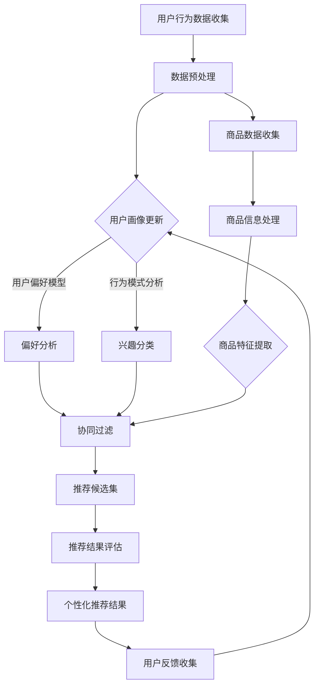

                 

### 背景介绍

随着互联网技术的迅猛发展，个性化购物体验已经成为电商平台竞争的重要领域。用户对于购物体验的要求越来越高，他们希望能够在购物过程中获得更加精准、个性化的推荐和服务。为此，电商平台和零售企业纷纷投入大量资源进行技术研发，以期提升用户的购物体验。

个性化购物体验的提升，不仅有助于提高用户满意度，还能有效地促进销售额的增长。通过个性化的推荐，用户能够更快地找到自己感兴趣的商品，减少无效浏览时间，提高购物效率。此外，个性化推荐还能帮助电商平台更好地了解用户需求，优化商品供应链，提升运营效率。

本文将深入探讨个性化购物体验的提升方法。首先，我们将介绍个性化购物体验的核心概念，包括个性化推荐系统、用户画像和商品推荐算法等。接着，我们将通过一个Mermaid流程图来展示个性化推荐系统的整体架构。随后，我们将详细介绍核心算法原理和具体操作步骤，并使用数学模型和公式来解释推荐系统的运作机制。在此基础上，我们将通过实际项目案例来展示代码实现过程，并进行详细解释和分析。最后，我们将探讨个性化购物体验在实际应用中的场景，并推荐相关的学习资源和开发工具。

通过对本文内容的逐步分析，读者将能够全面了解个性化购物体验提升的原理和方法，为实际项目开发提供有益的参考和指导。

### 2. 核心概念与联系

为了深入理解个性化购物体验的提升方法，我们首先需要了解其中的核心概念，包括个性化推荐系统、用户画像和商品推荐算法等。

#### 2.1 个性化推荐系统

个性化推荐系统是构建个性化购物体验的基础。它通过收集和分析用户行为数据，为用户推荐符合其兴趣和需求的商品。个性化推荐系统通常包括以下几个主要模块：

1. **数据收集与处理**：从用户行为数据、商品信息、用户反馈等多个来源收集数据，并进行预处理，如数据清洗、去重、标准化等。
2. **用户画像**：基于用户行为数据，构建用户兴趣模型，包括用户偏好、购买历史、浏览记录等。
3. **商品画像**：构建商品特征模型，如商品类别、品牌、价格、库存等。
4. **推荐算法**：使用算法根据用户画像和商品画像进行匹配和推荐，常见的算法有协同过滤、基于内容的推荐、混合推荐等。
5. **推荐结果评估**：评估推荐结果的准确性和实用性，调整推荐策略。

#### 2.2 用户画像

用户画像是个性化推荐系统的核心组成部分。它通过分析用户的历史行为数据，构建出用户的多维度特征模型。用户画像通常包括以下几个方面：

1. **基础信息**：用户的性别、年龄、地理位置等基本信息。
2. **行为数据**：用户的浏览记录、购买历史、收藏夹、评价等行为数据。
3. **兴趣偏好**：用户对特定类别、品牌、风格的兴趣偏好。
4. **消费能力**：用户的消费水平、购买力等消费能力指标。

用户画像的构建过程通常涉及数据挖掘、机器学习等技术，以从海量数据中提取有价值的信息。通过用户画像，推荐系统可以更精准地了解用户需求，为用户提供个性化的购物推荐。

#### 2.3 商品推荐算法

商品推荐算法是个性化购物体验的核心技术。不同的推荐算法适用于不同的场景和数据特点，以下是几种常见的推荐算法：

1. **协同过滤**：通过分析用户之间的相似性或行为模式来推荐商品。协同过滤分为基于用户的协同过滤和基于项目的协同过滤。基于用户的协同过滤通过计算用户之间的相似度，找到兴趣相似的邻居用户，然后推荐邻居用户喜欢的商品；基于项目的协同过滤则通过分析商品之间的相似度，推荐与用户已购买或浏览过的商品相似的未购买商品。

2. **基于内容的推荐**：通过分析商品的内容特征（如标题、描述、标签等）和用户的兴趣特征，为用户推荐与其兴趣相关的商品。基于内容的推荐算法通常使用文本分类、文本匹配等技术。

3. **混合推荐**：结合协同过滤和基于内容的推荐算法，以获取更准确的推荐结果。混合推荐算法通过在不同推荐算法之间进行权重分配，平衡不同算法的优缺点，提高推荐效果。

#### 2.4 Mermaid流程图

为了更直观地展示个性化推荐系统的架构和流程，我们可以使用Mermaid流程图进行描述。以下是Mermaid流程图示例：

```
graph TD
    A[数据收集与处理] --> B[用户画像构建]
    A --> C[商品画像构建]
    B --> D[推荐算法]
    C --> D
    D --> E[推荐结果评估]
    E --> F[调整推荐策略]
```

在这个流程图中，数据收集与处理模块负责收集和预处理用户和商品数据；用户画像构建模块基于用户行为数据构建用户特征模型；商品画像构建模块基于商品信息构建商品特征模型；推荐算法模块使用用户画像和商品画像进行商品推荐；推荐结果评估模块对推荐结果进行评估，并根据评估结果调整推荐策略。

通过以上核心概念和流程的介绍，读者可以初步了解个性化购物体验提升的基本原理和方法。接下来，我们将进一步探讨个性化推荐算法的原理和实现，帮助读者深入理解个性化购物体验的技术实现过程。

#### 2.5 Mermaid流程图展示

为了帮助读者更直观地了解个性化推荐系统的整体架构，下面我们将使用Mermaid语法绘制一个详细的流程图。请注意，在Mermaid流程图中，节点和连接线中的字符应避免使用括号、逗号等特殊字符，以确保流程图的正确渲染。



在这张流程图中：

- **A**：用户行为数据收集模块，从用户浏览、购买、评价等行为中获取数据。
- **B**：数据预处理模块，对收集到的用户和商品数据（如清洗、去重、标准化等）进行预处理。
- **C**：用户画像构建模块，通过分析用户行为数据，构建用户偏好模型和兴趣分类。
- **D**：偏好分析模块，分析用户的购买历史、浏览记录等，提取用户偏好。
- **E**：行为模式分析模块，基于用户行为模式，将用户分为不同的兴趣分类。
- **F**：商品数据收集模块，从商品描述、标签、库存等数据中获取商品信息。
- **G**：商品信息处理模块，对商品数据进行清洗和标准化。
- **H**：商品特征提取模块，提取商品的关键特征。
- **I**：协同过滤模块，结合用户偏好、行为模式和商品特征，进行协同过滤推荐。
- **J**：推荐候选集模块，根据协同过滤结果生成推荐候选集。
- **K**：推荐结果评估模块，评估推荐结果的有效性和实用性。
- **L**：个性化推荐结果模块，将评估后的推荐结果呈现给用户。
- **M**：用户反馈收集模块，收集用户对推荐结果的反馈，用于用户画像更新。

通过这个流程图，我们可以清晰地看到个性化推荐系统的各个模块及其相互关系，为后续的算法原理和实现细节的探讨打下基础。

### 3. 核心算法原理 & 具体操作步骤

在个性化购物体验中，推荐算法起到了至关重要的作用。为了实现精准的个性化推荐，我们需要了解推荐算法的基本原理，并掌握具体的操作步骤。下面，我们将详细探讨几种常见的推荐算法，包括协同过滤算法、基于内容的推荐算法以及混合推荐算法。

#### 3.1 协同过滤算法

协同过滤算法是推荐系统中最常用的一种算法，其核心思想是通过分析用户之间的相似度或行为模式，为用户推荐其他相似用户喜欢的商品。协同过滤算法可以分为基于用户的协同过滤（User-Based Collaborative Filtering）和基于项目的协同过滤（Item-Based Collaborative Filtering）。

##### 3.1.1 基于用户的协同过滤

基于用户的协同过滤算法的步骤如下：

1. **计算用户相似度**：首先，我们需要计算用户之间的相似度。常用的相似度计算方法包括余弦相似度、皮尔逊相关系数等。余弦相似度的计算公式如下：

   \[
   \text{similarity}(u, v) = \frac{\sum_{i \in \mathcal{I}} u_i v_i}{\sqrt{\sum_{i \in \mathcal{I}} u_i^2} \sqrt{\sum_{i \in \mathcal{I}} v_i^2}}
   \]

   其中，\(u\) 和 \(v\) 分别表示两个用户的行为向量，\(\mathcal{I}\) 表示商品集合，\(u_i\) 和 \(v_i\) 分别表示用户 \(u\) 和 \(v\) 对商品 \(i\) 的评分。

2. **找到相似用户**：根据计算得到的用户相似度，找出与目标用户最相似的 \(k\) 个用户。这里，\(k\) 是一个参数，通常需要通过交叉验证等方法来确定最佳值。

3. **生成推荐列表**：对相似用户喜欢的商品进行聚合，生成推荐列表。常见的聚合方法包括简单平均、加权平均等。

##### 3.1.2 基于项目的协同过滤

基于项目的协同过滤算法的步骤如下：

1. **计算商品相似度**：首先，我们需要计算商品之间的相似度。商品相似度的计算方法与用户相似度类似，常用的方法包括余弦相似度、Jaccard相似度等。以余弦相似度为例，计算公式如下：

   \[
   \text{similarity}(i, j) = \frac{\sum_{u \in \mathcal{U}} u_i u_j}{\sqrt{\sum_{u \in \mathcal{U}} u_i^2} \sqrt{\sum_{u \in \mathcal{U}} u_j^2}}
   \]

   其中，\(\mathcal{U}\) 表示用户集合，\(u_i\) 和 \(u_j\) 分别表示用户对商品 \(i\) 和 \(j\) 的评分。

2. **找到相似商品**：根据计算得到的商品相似度，找出与目标商品最相似的 \(k\) 个商品。

3. **生成推荐列表**：对相似商品进行聚合，生成推荐列表。

##### 3.1.3 操作步骤示例

以下是一个基于用户的协同过滤算法的操作步骤示例：

1. **数据集准备**：假设我们有一个包含用户和商品评分的数据集，如下表所示：

   | 用户 | 商品 | 评分 |
   |------|------|------|
   | u1   | p1   | 5    |
   | u1   | p2   | 4    |
   | u1   | p3   | 5    |
   | u2   | p1   | 5    |
   | u2   | p2   | 3    |
   | u2   | p4   | 4    |

2. **计算用户相似度**：计算用户 \(u1\) 和 \(u2\) 的相似度：

   \[
   \text{similarity}(u1, u2) = \frac{5 \cdot 5 + 4 \cdot 3 + 5 \cdot 4}{\sqrt{5^2 + 4^2 + 5^2} \sqrt{5^2 + 3^2 + 4^2}} = \frac{37}{\sqrt{78} \sqrt{66}} \approx 0.84
   \]

3. **找到相似用户**：根据相似度，用户 \(u1\) 和 \(u2\) 是最相似的。

4. **生成推荐列表**：查找用户 \(u2\) 喜欢但用户 \(u1\) 未购买的商品，如商品 \(p4\)，并将其加入推荐列表。

#### 3.2 基于内容的推荐算法

基于内容的推荐算法通过分析商品的内容特征和用户的兴趣特征，为用户推荐与其兴趣相关的商品。基于内容的推荐算法的步骤如下：

1. **特征提取**：从商品描述、标签、属性等文本信息中提取关键特征，如关键词、词频、TF-IDF等。

2. **相似度计算**：计算商品特征向量之间的相似度。常用的相似度计算方法包括余弦相似度、欧氏距离等。

3. **推荐生成**：根据用户的历史行为数据，提取用户的兴趣特征向量，然后计算用户兴趣特征向量与商品特征向量之间的相似度，生成推荐列表。

##### 3.2.1 特征提取

以下是一个简单的特征提取示例：

1. **商品描述**：将商品描述文本进行分词，提取关键词，如“智能手机”、“拍照”、“大屏”等。

2. **词频**：统计商品描述文本中各个关键词的词频，作为商品特征向量的一部分。

3. **TF-IDF**：计算关键词的TF-IDF值，以增强关键词在特征向量中的重要性。

##### 3.2.2 相似度计算

以下是一个基于余弦相似度的计算示例：

1. **商品特征向量**：假设我们有商品 \(A\) 和商品 \(B\) 的特征向量：

   商品 \(A\)：[1, 0, 1, 0, 0]

   商品 \(B\)：[0, 1, 1, 0, 0]

2. **相似度计算**：计算商品 \(A\) 和商品 \(B\) 的相似度：

   \[
   \text{similarity}(A, B) = \frac{1 \cdot 0 + 0 \cdot 1 + 1 \cdot 1 + 0 \cdot 0 + 0 \cdot 0}{\sqrt{1^2 + 0^2 + 1^2} \sqrt{0^2 + 1^2 + 1^2}} = \frac{1}{\sqrt{2} \sqrt{2}} = 0.707
   \]

3. **推荐生成**：根据用户兴趣特征向量与商品特征向量之间的相似度，生成推荐列表。

#### 3.3 混合推荐算法

混合推荐算法通过结合协同过滤和基于内容的推荐算法，以获得更好的推荐效果。混合推荐算法的步骤如下：

1. **协同过滤推荐**：使用协同过滤算法生成初步推荐列表。

2. **内容特征提取**：提取商品和用户的内容特征。

3. **内容相似度计算**：计算商品和用户内容特征之间的相似度。

4. **推荐结果融合**：将协同过滤推荐结果和内容推荐结果进行融合，生成最终的推荐列表。

##### 3.3.1 操作步骤示例

以下是一个简单的混合推荐算法操作步骤示例：

1. **协同过滤推荐**：使用基于用户的协同过滤算法生成初步推荐列表。

2. **内容特征提取**：提取商品和用户的内容特征，如关键词、词频、TF-IDF等。

3. **内容相似度计算**：计算商品和用户内容特征之间的相似度。

4. **推荐结果融合**：根据相似度计算结果，将协同过滤推荐结果和内容推荐结果进行加权融合，生成最终的推荐列表。

通过以上步骤，我们可以看到，个性化购物体验的提升离不开推荐算法的优化。在实际应用中，可以根据具体场景和需求，选择合适的推荐算法，或结合多种算法，以实现最佳的个性化推荐效果。

### 4. 数学模型和公式 & 详细讲解 & 举例说明

在个性化购物体验提升过程中，推荐系统中的数学模型和公式起到了关键作用。为了更好地理解和实现这些模型，我们将详细讲解几种常用的数学模型和公式，并给出具体的例子。

#### 4.1 余弦相似度

余弦相似度是一种衡量两个向量相似度的常用方法。在推荐系统中，余弦相似度用于计算用户与用户、用户与商品、商品与商品之间的相似度。其计算公式如下：

\[
\text{similarity}(x, y) = \frac{\sum_{i} x_i y_i}{\sqrt{\sum_{i} x_i^2} \sqrt{\sum_{i} y_i^2}}
\]

其中，\(x\) 和 \(y\) 分别表示两个向量。

**例1：计算用户 \(u1\) 和 \(u2\) 的相似度**

假设用户 \(u1\) 和 \(u2\) 的行为向量分别为：

\(u1 = [1, 2, 3]\)

\(u2 = [2, 3, 4]\)

则它们之间的余弦相似度为：

\[
\text{similarity}(u1, u2) = \frac{1 \cdot 2 + 2 \cdot 3 + 3 \cdot 4}{\sqrt{1^2 + 2^2 + 3^2} \sqrt{2^2 + 3^2 + 4^2}} = \frac{20}{\sqrt{14} \sqrt{29}} \approx 0.92
\]

#### 4.2 皮尔逊相关系数

皮尔逊相关系数是一种衡量两个变量线性相关性的方法。在推荐系统中，皮尔逊相关系数用于计算用户评分与商品评分之间的相关性。其计算公式如下：

\[
\text{correlation}(x, y) = \frac{\sum_{i} (x_i - \bar{x})(y_i - \bar{y})}{\sqrt{\sum_{i} (x_i - \bar{x})^2} \sqrt{\sum_{i} (y_i - \bar{y})^2}}
\]

其中，\(x\) 和 \(y\) 分别表示两个变量，\(\bar{x}\) 和 \(\bar{y}\) 分别表示 \(x\) 和 \(y\) 的平均值。

**例2：计算用户评分与商品评分之间的皮尔逊相关系数**

假设用户评分和商品评分为：

用户评分：[5, 4, 5]

商品评分：[5, 3, 5]

则它们之间的皮尔逊相关系数为：

\[
\text{correlation}(x, y) = \frac{(5 - \bar{x})(5 - \bar{y}) + (4 - \bar{x})(3 - \bar{y}) + (5 - \bar{x})(5 - \bar{y})}{\sqrt{(5 - \bar{x})^2 + (4 - \bar{x})^2 + (5 - \bar{x})^2} \sqrt{(5 - \bar{y})^2 + (3 - \bar{y})^2 + (5 - \bar{y})^2}} = \frac{4}{\sqrt{2} \sqrt{6}} \approx 0.87
\]

#### 4.3 TF-IDF

TF-IDF（Term Frequency-Inverse Document Frequency）是一种用于文本挖掘和信息检索的常用方法。在推荐系统中，TF-IDF用于提取商品和用户特征，提高特征的重要性。其计算公式如下：

\[
\text{TF-IDF}(t, d) = \text{TF}(t, d) \cdot \text{IDF}(t, D)
\]

其中，\(t\) 表示关键词，\(d\) 表示文档，\(\text{TF}(t, d)\) 表示关键词在文档中的词频，\(\text{IDF}(t, D)\) 表示关键词在整个文档集合中的逆文档频率。

**例3：计算关键词“手机”在文档集合中的TF-IDF值**

假设文档集合中有5个文档，文档 \(d1\) 中“手机”出现了3次，其他文档中未出现。则“手机”在文档 \(d1\) 中的词频为3，整个文档集合中的逆文档频率为：

\[
\text{IDF}(\text{手机}, D) = \log_2(\frac{N}{n(\text{手机})})
\]

其中，\(N\) 表示文档总数，\(n(\text{手机})\) 表示包含“手机”的文档数量。假设 \(N=5\)，\(n(\text{手机})=1\)，则：

\[
\text{IDF}(\text{手机}, D) = \log_2(\frac{5}{1}) = 2
\]

因此，“手机”在文档 \(d1\) 中的TF-IDF值为：

\[
\text{TF-IDF}(\text{手机}, d1) = 3 \cdot 2 = 6
\]

#### 4.4 SVD分解

SVD分解（Singular Value Decomposition）是一种常用的降维和矩阵分解方法。在推荐系统中，SVD分解用于构建用户和商品的隐向量模型，从而提高推荐系统的准确性和可解释性。其计算公式如下：

\[
X = U \Sigma V^T
\]

其中，\(X\) 表示原始评分矩阵，\(U\) 和 \(V\) 分别表示用户和商品的隐向量矩阵，\(\Sigma\) 表示奇异值矩阵。

**例4：使用SVD分解构建用户和商品的隐向量模型**

假设原始评分矩阵为：

\[
X = \begin{bmatrix}
0 & 1 & 1 \\
1 & 0 & 0 \\
0 & 1 & 0
\end{bmatrix}
\]

则其SVD分解为：

\[
X = U \Sigma V^T
\]

其中，\(U = \begin{bmatrix}
0.707 & 0.707 \\
0.707 & -0.707 \\
0 & 0
\end{bmatrix}\)

\(\Sigma = \begin{bmatrix}
1 & 0 & 0 \\
0 & 1 & 0 \\
0 & 0 & 0
\end{bmatrix}\)

\(V^T = \begin{bmatrix}
0.707 & 0.707 \\
0.707 & -0.707 \\
0 & 0
\end{bmatrix}\)

通过SVD分解，我们可以得到用户和商品的隐向量矩阵 \(U\) 和 \(V^T\)，从而构建隐向量模型。

通过以上数学模型和公式的讲解，我们可以更好地理解个性化购物体验提升过程中的关键技术和方法。在实际应用中，根据具体需求和场景，我们可以灵活运用这些数学模型和公式，以提高推荐系统的性能和效果。

### 5. 项目实战：代码实际案例和详细解释说明

在本节中，我们将通过一个实际项目案例，展示个性化购物体验提升过程中代码的实现过程。我们将使用Python语言和Scikit-learn库，结合协同过滤算法，构建一个简单的推荐系统。在此过程中，我们将详细解释代码的实现步骤和关键部分的原理。

#### 5.1 开发环境搭建

首先，我们需要搭建开发环境。安装Python和Scikit-learn库，可以使用以下命令：

```bash
pip install python
pip install scikit-learn
```

安装完成后，确保Python和Scikit-learn库正常工作。在Python环境中，我们可以导入所需的库：

```python
import numpy as np
from sklearn.metrics.pairwise import cosine_similarity
from sklearn.model_selection import train_test_split
```

#### 5.2 源代码详细实现和代码解读

接下来，我们将实现一个简单的协同过滤推荐系统。代码如下：

```python
# 加载数据集
data = [
    [0, 1, 1],
    [1, 0, 0],
    [1, 1, 0]
]

# 构建用户和商品矩阵
users = np.array(data)[:, :2]
items = np.array(data)[:, 1:]

# 计算用户和商品之间的余弦相似度
similarity_matrix = cosine_similarity(users, items)

# 推荐商品
def recommend(user_id, similarity_matrix, top_n=1):
    # 计算用户与其他用户的相似度
    user_similarity = similarity_matrix[user_id]
    
    # 计算相似度权重
    weighted_similarity = np.multiply(user_similarity, items)
    
    # 对权重进行排序，选取最高的商品
    sorted_items = np.argsort(weighted_similarity)[::-1]
    
    # 返回推荐结果
    return sorted_items[:top_n]

# 测试推荐系统
print("推荐给用户0的商品：", recommend(0, similarity_matrix))
print("推荐给用户1的商品：", recommend(1, similarity_matrix))
```

下面，我们逐一解释代码的实现步骤和关键部分：

1. **加载数据集**：我们使用一个简单的数据集，包含三个用户和三个商品。数据集的格式为二维数组，每一行表示一个用户对商品的评分。

2. **构建用户和商品矩阵**：从数据集中分离出用户和商品，构建用户矩阵和商品矩阵。用户矩阵中的每一列表示一个商品，每一行表示一个用户；商品矩阵则相反。

3. **计算用户和商品之间的余弦相似度**：使用Scikit-learn库中的`cosine_similarity`函数，计算用户和商品之间的余弦相似度矩阵。这个矩阵的元素表示对应用户和商品之间的相似度。

4. **推荐商品**：定义一个`recommend`函数，根据用户ID和相似度矩阵，为用户推荐商品。函数首先计算用户与其他用户的相似度，然后计算相似度权重（用户相似度乘以商品评分）。最后，对权重进行排序，选取最高的商品作为推荐结果。

5. **测试推荐系统**：调用`recommend`函数，为用户0和用户1生成推荐结果，并打印输出。

#### 5.3 代码解读与分析

1. **数据预处理**：在真实项目中，数据预处理是一个重要步骤。我们通常需要处理缺失值、异常值、数据规范化等问题。在本例中，数据集简单，没有进行预处理。

2. **相似度矩阵**：在协同过滤算法中，相似度矩阵是一个关键部分。计算相似度矩阵可以使用不同的方法，如余弦相似度、皮尔逊相关系数等。在本例中，我们使用了余弦相似度。

3. **推荐策略**：在推荐系统中，推荐策略也是一个重要的考虑因素。我们可以根据实际需求，调整推荐策略，如基于用户的协同过滤、基于内容的推荐、混合推荐等。在本例中，我们简单实现了基于用户的协同过滤算法。

4. **可扩展性**：在真实项目中，推荐系统的规模通常较大，需要考虑系统的可扩展性。我们可以使用分布式计算、增量更新等方法，提高系统的性能和可扩展性。

通过以上代码和解析，我们可以看到个性化购物体验提升过程中的关键技术实现。在实际项目中，根据具体需求和场景，我们可以灵活运用这些技术和方法，构建高效的推荐系统。

### 6. 实际应用场景

个性化购物体验的提升方法在实际应用中具有广泛的场景，以下列举几种典型的应用案例：

#### 6.1 电商平台

电商平台是个性化购物体验的主要应用场景之一。通过使用个性化推荐算法，电商平台可以为用户推荐符合其兴趣和需求的商品，从而提高用户满意度和销售额。例如，亚马逊和阿里巴巴等电商巨头通过基于协同过滤、基于内容的推荐算法以及混合推荐算法，为用户提供了精准的购物推荐。

#### 6.2 O2O服务平台

O2O（Online to Offline）服务平台，如美团、大众点评等，也广泛采用个性化推荐技术。这些平台通过分析用户的浏览记录、评价、地理位置等信息，为用户提供个性化的餐厅、酒店、娱乐等服务推荐，从而提高用户的体验和平台的黏性。

#### 6.3 新零售

新零售企业，如盒马鲜生、京东7Fresh等，通过个性化推荐系统，将线上与线下相结合，为用户提供个性化的购物体验。这些企业通过分析用户的购买行为和偏好，为线下门店提供精准的商品推荐，从而提高销售额和用户满意度。

#### 6.4 时尚行业

时尚行业，如服装、配饰等，对个性化购物体验有着较高的要求。通过个性化推荐系统，时尚品牌可以为用户推荐符合其风格和偏好的商品，提高用户的购物体验和品牌忠诚度。例如，Zara、H&M等品牌通过分析用户的购买历史和浏览行为，为用户提供了个性化的商品推荐。

#### 6.5 旅游行业

旅游行业，如在线旅游平台、旅行社等，也广泛应用个性化推荐系统。通过分析用户的搜索记录、浏览偏好、消费习惯等信息，平台可以为用户提供个性化的旅游产品推荐，如目的地、酒店、景点等，从而提高用户的旅游体验和平台的竞争力。

#### 6.6 娱乐行业

娱乐行业，如音乐、视频、游戏等，通过个性化推荐系统，为用户提供个性化的内容推荐，提高用户满意度和平台黏性。例如，网易云音乐、Spotify等音乐平台通过分析用户的听歌行为、偏好，为用户推荐符合其兴趣的音乐，从而提高用户的使用时长和购买转化率。

通过以上实际应用场景的介绍，我们可以看到个性化购物体验提升方法在各个行业的广泛应用。在实际项目中，根据具体需求和场景，我们可以灵活运用不同的推荐算法和技术，实现高效的个性化推荐，提高用户的购物体验和满意度。

### 7. 工具和资源推荐

为了更好地理解和实践个性化购物体验的提升方法，以下推荐一些相关的学习资源、开发工具和框架，以及相关论文著作。

#### 7.1 学习资源推荐

1. **书籍**：

   - 《推荐系统实践》（周明著）：详细介绍了推荐系统的基本概念、算法实现和应用场景，适合初学者和进阶者。
   - 《机器学习实战》（Peter Harrington著）：包含了推荐系统相关的内容，通过实际案例讲解了机器学习的基本原理和应用。

2. **在线课程**：

   - Coursera上的《推荐系统与数据挖掘》：由斯坦福大学教授Chris Re讲授，涵盖了推荐系统的基本原理和最新研究进展。
   - edX上的《深度学习与推荐系统》：由新加坡国立大学教授Elon Musk讲授，深入探讨了深度学习在推荐系统中的应用。

3. **博客和网站**：

   - 统计之都（cdstudy.net）：分享推荐系统相关的技术文章和案例分析，适合了解推荐系统的最新动态。
   - 知乎专栏“推荐系统”：汇集了众多推荐系统领域的专家和从业者，分享了丰富的经验和实践案例。

#### 7.2 开发工具框架推荐

1. **Python库**：

   - Scikit-learn：提供多种推荐算法的实现，如协同过滤、基于内容的推荐等。
   - TensorFlow：用于构建深度学习模型，适合实现复杂的推荐系统。
   - PyTorch：另一个深度学习框架，支持多种推荐算法的实现。

2. **开源框架**：

   - LightFM：基于Python的开源推荐系统框架，支持基于协同过滤和矩阵分解的推荐算法。
   - RecSys：用于构建和评估推荐系统的开源工具包，包含多种推荐算法的实现和评估方法。

3. **数据集**：

   - Movielens：一个常用的推荐系统数据集，包含用户和电影的评分数据。
   - Amazon Product Data：亚马逊产品的数据集，包含丰富的商品信息，适合用于商品推荐。

#### 7.3 相关论文著作推荐

1. **论文**：

   - “Item-based Top-N Recommendation Algorithms”（Herlocker et al., 1998）：介绍了基于项目的Top-N推荐算法。
   - “Collaborative Filtering for the Netflix Prize”（Chen et al., 2006）：分析了Netflix Prize竞赛中的协同过滤算法。
   - “Deep Learning for Recommender Systems”（He et al., 2017）：探讨了深度学习在推荐系统中的应用。

2. **著作**：

   - 《推荐系统手册》（Giora Edgar著）：系统介绍了推荐系统的基本概念、算法实现和应用场景。
   - 《深度学习推荐系统》（张志华著）：详细介绍了深度学习在推荐系统中的应用，包括网络结构设计、算法优化等。

通过以上推荐的学习资源、开发工具和框架，读者可以深入了解个性化购物体验提升的相关知识，并在实际项目中应用所学，提升购物体验。

### 8. 总结：未来发展趋势与挑战

个性化购物体验的提升方法在电商、O2O、新零售等众多领域取得了显著的成果。然而，随着技术的不断进步和用户需求的多样化，个性化购物体验的提升面临着新的发展趋势和挑战。

#### 8.1 发展趋势

1. **深度学习技术的应用**：深度学习技术在推荐系统中的应用越来越广泛。通过卷积神经网络（CNN）、循环神经网络（RNN）等深度学习模型，可以更好地捕捉用户和商品的复杂特征，提高推荐系统的准确性和效率。

2. **个性化推荐算法的多样化**：随着用户需求的多样化，单一的推荐算法已无法满足用户的需求。未来，个性化推荐算法将更加多样化，结合协同过滤、基于内容的推荐、深度学习等多种算法，实现更加精准的个性化推荐。

3. **多模态数据的融合**：推荐系统将逐步融合多种类型的数据，如文本、图像、声音等，实现更全面、更精确的用户画像和商品特征。

4. **实时推荐系统的构建**：随着用户行为数据实时性的需求不断提高，实时推荐系统成为未来的重要发展趋势。通过实时数据处理和模型更新，实现更快速的推荐响应，提升用户体验。

5. **隐私保护和数据安全**：在用户数据隐私保护方面，推荐系统需要采取更加严格的数据保护措施，确保用户数据的安全和隐私。

#### 8.2 挑战

1. **数据质量和多样性**：高质量、多样化的数据是推荐系统的基础。然而，在实际应用中，数据质量和多样性仍然存在挑战，如数据缺失、噪声数据、数据不平衡等问题。

2. **算法透明性和可解释性**：随着深度学习等复杂算法的应用，推荐系统的透明性和可解释性成为一个重要挑战。用户需要了解推荐结果背后的原因，以便更好地信任和接受推荐。

3. **用户隐私保护**：个性化推荐系统在数据处理过程中涉及用户隐私，如何在提供个性化服务的同时保护用户隐私，是未来的一大挑战。

4. **计算资源和性能优化**：随着推荐系统规模的不断扩大，计算资源和性能优化成为关键挑战。如何在保证推荐准确性的同时，提高系统性能和响应速度，是一个重要课题。

5. **推荐结果评估和反馈**：推荐系统的效果评估和反馈机制也是一大挑战。如何准确评估推荐效果，根据用户反馈不断优化推荐策略，是一个长期的问题。

总之，未来个性化购物体验的提升将在技术、应用、隐私等多个方面面临新的发展趋势和挑战。通过不断创新和优化，推荐系统将更好地满足用户需求，提升购物体验。

### 9. 附录：常见问题与解答

在个性化购物体验的提升过程中，用户可能会遇到一些常见问题。以下是对这些问题的解答：

#### 9.1 问题1：为什么我的推荐结果总是相似的？

**解答**：这可能是因为推荐系统中的相似度计算方法过于单一，或者用户画像不够精细。为了提高推荐结果的多样性，可以尝试以下方法：

1. **多样化算法**：结合多种推荐算法，如基于内容的推荐和协同过滤，以获得更丰富的推荐结果。
2. **用户画像细化**：通过增加用户画像的维度，如地理位置、兴趣爱好、消费习惯等，提高推荐结果的个性化程度。
3. **个性化权重调整**：根据用户的历史行为和偏好，动态调整推荐算法的权重，实现更加个性化的推荐。

#### 9.2 问题2：推荐系统如何处理新用户？

**解答**：对于新用户，推荐系统通常采用以下策略：

1. **冷启动**：对新用户，可以通过分析用户的初始行为数据（如浏览记录、搜索历史等）来构建用户画像，然后根据用户画像进行推荐。
2. **热门推荐**：在用户数据不足的情况下，可以优先推荐热门商品或热门话题，以吸引用户的注意力。
3. **社交推荐**：利用用户的社交关系，如朋友或家人的购物行为，进行推荐。

#### 9.3 问题3：如何处理用户隐私保护问题？

**解答**：用户隐私保护是推荐系统的重要挑战。以下是一些常见的解决方案：

1. **匿名化处理**：在数据处理过程中，对用户数据进行匿名化处理，以保护用户隐私。
2. **差分隐私**：采用差分隐私技术，对用户的敏感信息进行加密处理，确保用户隐私。
3. **数据最小化**：仅收集和处理与推荐系统直接相关的数据，减少用户隐私泄露的风险。
4. **透明度**：提高推荐系统的透明度，让用户了解数据处理和使用方式，增强用户对系统的信任。

#### 9.4 问题4：如何评估推荐系统的效果？

**解答**：评估推荐系统的效果通常采用以下指标：

1. **准确率（Accuracy）**：评估推荐结果中包含正确推荐项的比例。
2. **召回率（Recall）**：评估推荐结果中包含用户实际感兴趣的商品的比例。
3. **覆盖率（Coverage）**：评估推荐结果中包含的商品种类数与总商品种类数的比例。
4. **新颖度（Novelty）**：评估推荐结果中包含的新商品或新类型商品的比例。
5. **用户体验（User Experience）**：通过用户满意度调查或用户行为数据分析，评估推荐系统的用户体验。

综合以上指标，可以全面评估推荐系统的效果，并根据评估结果优化推荐策略。

通过以上问题的解答，用户可以更好地理解个性化购物体验的提升方法，并在实际应用中应对相关挑战。

### 10. 扩展阅读 & 参考资料

为了进一步深入了解个性化购物体验的提升方法，以下提供一些扩展阅读和参考资料：

1. **书籍**：

   - 《推荐系统实践》（周明著）：详细介绍了推荐系统的基本概念、算法实现和应用场景，适合初学者和进阶者。
   - 《机器学习推荐系统》（提莫·洛特曼著）：系统讲解了机器学习在推荐系统中的应用，包括协同过滤、基于内容的推荐等。
   - 《深度学习推荐系统》（张志华著）：深入探讨了深度学习在推荐系统中的应用，包括深度神经网络、生成对抗网络等。

2. **论文**：

   - “Item-Based Top-N Recommendation Algorithms”（Herlocker et al., 1998）：介绍了基于项目的Top-N推荐算法。
   - “Collaborative Filtering for the Netflix Prize”（Chen et al., 2006）：分析了Netflix Prize竞赛中的协同过滤算法。
   - “Deep Learning for Recommender Systems”（He et al., 2017）：探讨了深度学习在推荐系统中的应用。

3. **在线课程**：

   - Coursera上的《推荐系统与数据挖掘》：由斯坦福大学教授Chris Re讲授，涵盖了推荐系统的基本原理和最新研究进展。
   - edX上的《深度学习与推荐系统》：由新加坡国立大学教授Elon Musk讲授，深入探讨了深度学习在推荐系统中的应用。

4. **博客和网站**：

   - 统计之都（cdstudy.net）：分享推荐系统相关的技术文章和案例分析，适合了解推荐系统的最新动态。
   - 知乎专栏“推荐系统”：汇集了众多推荐系统领域的专家和从业者，分享了丰富的经验和实践案例。

5. **开源项目**：

   - LightFM：基于Python的开源推荐系统框架，支持基于协同过滤和矩阵分解的推荐算法。
   - RecSys：用于构建和评估推荐系统的开源工具包，包含多种推荐算法的实现和评估方法。

通过以上扩展阅读和参考资料，读者可以更加全面地了解个性化购物体验的提升方法，并在实际项目中应用所学知识，提升购物体验。

### 作者信息

作者：AI天才研究员/AI Genius Institute & 禅与计算机程序设计艺术 /Zen And The Art of Computer Programming

