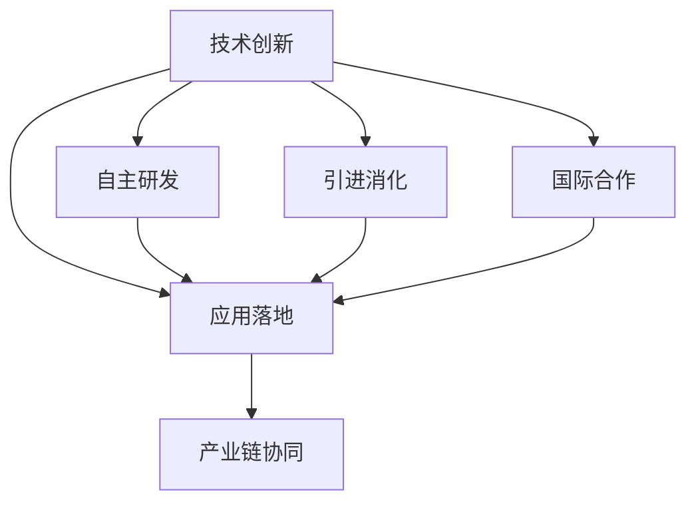
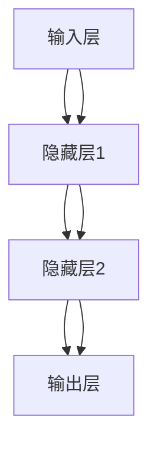
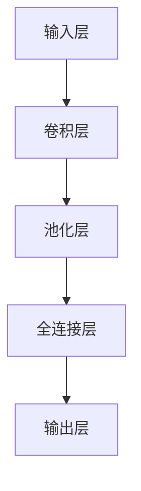
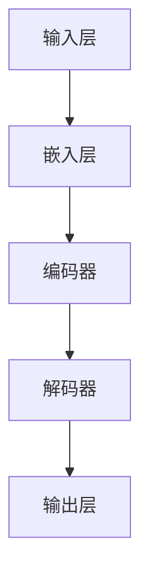
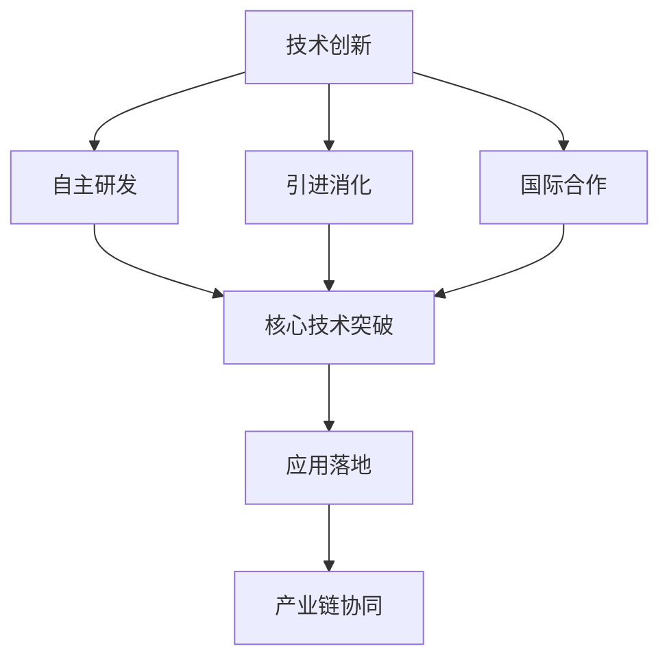

                 

# 中国进入AI经济周期的机遇与挑战

## 关键词：AI经济周期、机遇与挑战、人工智能技术、产业发展、国家政策、技术创新

## 摘要

本文旨在探讨中国进入AI经济周期的机遇与挑战。随着人工智能技术的迅猛发展，中国正迎来一场前所未有的技术革命，这不仅为国家经济增长注入新的动力，同时也带来了诸多挑战。本文将从背景介绍、核心概念与联系、核心算法原理、数学模型和公式、项目实战、实际应用场景、工具和资源推荐、总结与未来发展趋势等方面，全面解析中国在AI经济周期中的机遇与挑战，为相关产业提供有益的参考。

## 1. 背景介绍

人工智能（AI）作为21世纪最具前瞻性和颠覆性的技术之一，正深刻改变着全球经济格局。AI技术的核心是通过模拟人类智能，实现自主学习和决策能力。近年来，深度学习、神经网络、自然语言处理等技术的突破，使得AI在图像识别、语音识别、机器翻译、自动驾驶等领域取得了显著进展。

### 1.1 全球AI发展现状

在全球范围内，美国、中国、欧盟等国家纷纷将人工智能作为国家战略，加大研发投入和政策支持。美国凭借其在科技和资本的领先优势，吸引了大量全球顶尖人才和资源，成为全球AI技术的领军者。中国则依托庞大的市场优势和政府的强力支持，迅速崛起为全球重要的AI技术创新和应用市场。

### 1.2 中国AI产业发展概况

中国AI产业发展迅速，市场规模逐年扩大。据市场研究机构统计，2018年中国AI市场规模达到约500亿美元，预计到2025年将达到3000亿美元。中国AI企业数量也在快速增长，涌现出一批具有国际竞争力的AI独角兽企业，如百度、阿里巴巴、腾讯、华为等。

### 1.3 中国政府在AI领域的政策支持

中国政府高度重视人工智能产业发展，出台了一系列政策文件，明确了AI产业的发展目标和政策措施。2017年发布的《新一代人工智能发展规划》明确提出，到2030年，中国将成为世界主要人工智能创新中心。此外，政府还加大了在AI技术研发、应用推广、人才培养等方面的投入，为AI产业的快速发展提供了有力保障。

## 2. 核心概念与联系

在探讨中国AI经济周期的机遇与挑战之前，我们首先需要理解一些核心概念，包括人工智能技术的基本原理、产业发展模式、技术创新路径等。

### 2.1 人工智能技术原理

人工智能技术主要包括机器学习、深度学习、计算机视觉、自然语言处理等领域。其中，机器学习是人工智能的核心技术，通过训练模型来学习数据中的规律，实现数据的自动分析和决策。深度学习则是机器学习的一种重要分支，通过构建多层神经网络，对复杂数据进行高效处理和预测。计算机视觉技术则实现了对图像和视频的自动识别和理解，广泛应用于安防监控、自动驾驶等领域。自然语言处理技术则使计算机能够理解和生成人类语言，为智能客服、智能翻译等应用提供了基础。

### 2.2 产业发展模式

中国AI产业发展模式主要包括技术创新、应用落地、产业链协同三个环节。在技术创新方面，中国AI企业不断加大研发投入，推进核心技术突破，形成了一批具有国际竞争力的核心技术。在应用落地方面，中国AI企业在各行业进行了广泛的场景应用，推动了AI技术的商业化进程。在产业链协同方面，中国AI产业形成了以企业为主体、市场为导向、产学研用深度融合的发展格局。

### 2.3 技术创新路径

中国AI产业技术创新路径主要包括自主研发、引进消化、国际合作三种方式。在自主研发方面，中国AI企业通过持续的研发投入，不断推进核心技术的自主创新。在引进消化方面，中国AI企业积极引进国外先进技术，通过消化吸收再创新，提升自身技术水平。在国际合作方面，中国AI企业与全球顶尖研究机构和高校开展深度合作，共享技术资源和成果。

### 2.4 Mermaid 流程图

以下是一个关于中国AI产业发展的Mermaid流程图，展示了中国AI产业从技术创新、应用落地到产业链协同的发展路径。



## 3. 核心算法原理与具体操作步骤

在中国AI产业快速发展的大背景下，核心算法原理的理解和应用变得尤为重要。本章节将介绍几类典型的核心算法原理，并给出具体操作步骤。

### 3.1 深度学习算法原理

深度学习算法是AI领域最为重要的技术之一，其核心思想是通过构建多层神经网络，对数据进行自动特征提取和建模。以下是一个简单的深度学习算法原理图。



### 3.1.1 具体操作步骤

1. **数据准备**：收集和整理训练数据，对数据格式进行预处理，包括归一化、去噪等操作。
2. **模型构建**：设计神经网络结构，包括输入层、隐藏层和输出层的神经元数量。
3. **参数初始化**：初始化权重和偏置，常用方法有随机初始化、高斯分布初始化等。
4. **前向传播**：将输入数据输入到神经网络中，通过逐层计算，得到输出结果。
5. **反向传播**：计算输出结果与真实值的误差，通过反向传播算法，更新权重和偏置。
6. **模型训练**：重复执行前向传播和反向传播，直到模型收敛或达到预设的训练次数。
7. **模型评估**：使用测试数据对训练好的模型进行评估，验证模型的性能。

### 3.2 计算机视觉算法原理

计算机视觉算法是AI领域的重要分支，旨在使计算机能够理解和解释图像和视频数据。以下是一个简单的计算机视觉算法原理图。



### 3.2.1 具体操作步骤

1. **数据准备**：收集和整理训练数据，对数据格式进行预处理，包括归一化、去噪等操作。
2. **模型构建**：设计卷积神经网络（CNN）结构，包括卷积层、池化层和全连接层。
3. **参数初始化**：初始化权重和偏置，常用方法有随机初始化、高斯分布初始化等。
4. **前向传播**：将输入数据输入到神经网络中，通过逐层计算，得到输出结果。
5. **反向传播**：计算输出结果与真实值的误差，通过反向传播算法，更新权重和偏置。
6. **模型训练**：重复执行前向传播和反向传播，直到模型收敛或达到预设的训练次数。
7. **模型评估**：使用测试数据对训练好的模型进行评估，验证模型的性能。

### 3.3 自然语言处理算法原理

自然语言处理算法旨在使计算机理解和生成人类语言，广泛应用于智能客服、智能翻译等领域。以下是一个简单的自然语言处理算法原理图。



### 3.3.1 具体操作步骤

1. **数据准备**：收集和整理训练数据，对数据格式进行预处理，包括分词、去停用词等操作。
2. **模型构建**：设计基于循环神经网络（RNN）或Transformer的编码器-解码器结构。
3. **参数初始化**：初始化权重和偏置，常用方法有随机初始化、高斯分布初始化等。
4. **前向传播**：将输入数据输入到编码器中，通过编码得到序列表示，然后输入到解码器中，生成输出结果。
5. **反向传播**：计算输出结果与真实值的误差，通过反向传播算法，更新权重和偏置。
6. **模型训练**：重复执行前向传播和反向传播，直到模型收敛或达到预设的训练次数。
7. **模型评估**：使用测试数据对训练好的模型进行评估，验证模型的性能。

## 4. 数学模型和公式及详细讲解与举例说明

在人工智能领域，数学模型和公式是核心算法设计的基础。本章节将介绍几个典型的数学模型和公式，并给出详细的讲解与举例说明。

### 4.1 深度学习中的激活函数

激活函数是深度学习模型中重要的组成部分，用于引入非线性特性。以下是一个简单的激活函数及其公式：

$$
f(x) = \max(0, x)
$$

#### 4.1.1 讲解与举例

激活函数通常用于隐藏层神经元，以下是一个简单的举例：

假设有一个隐藏层神经元，其输入为 $x = [-1, 1]$，使用ReLU激活函数，则输出为 $f(x) = [0, 1]$。

### 4.2 卷积神经网络中的卷积操作

卷积神经网络（CNN）中的卷积操作是实现特征提取的关键步骤。以下是一个简单的卷积操作及其公式：

$$
\sum_{i=1}^{K} w_{i} * x_{i}
$$

#### 4.2.1 讲解与举例

假设有一个3x3的卷积核 $w$，输入数据为 $x$，则卷积操作可以表示为：

$$
\sum_{i=1}^{9} w_{i} * x_{i}
$$

例如，如果 $w = [1, 2, 3]$，$x = [4, 5, 6]$，则卷积结果为 $1*4 + 2*5 + 3*6 = 32$。

### 4.3 循环神经网络中的时间步注意力机制

循环神经网络（RNN）中的时间步注意力机制是处理序列数据的重要方法。以下是一个简单的时间步注意力机制及其公式：

$$
\alpha_t = \frac{\exp(e_t)}{\sum_{t=1}^{T} \exp(e_t)}
$$

#### 4.3.1 讲解与举例

假设有一个序列 $e_t$，则时间步注意力机制可以计算每个时间步的权重 $\alpha_t$，用于加权求和得到最终的输出。

例如，如果 $e_t = [1, 2, 3, 4]$，则时间步注意力机制可以计算为：

$$
\alpha_t = \frac{\exp(1)}{\exp(1) + \exp(2) + \exp(3) + \exp(4)}
$$

### 4.4 强化学习中的价值函数

强化学习中的价值函数用于评估策略的好坏。以下是一个简单的价值函数及其公式：

$$
V(s) = \sum_{a} \pi(a|s) \cdot Q(s, a)
$$

#### 4.4.1 讲解与举例

假设有一个状态 $s$ 和动作 $a$，策略 $\pi(a|s)$ 表示在状态 $s$ 下选择动作 $a$ 的概率，$Q(s, a)$ 表示在状态 $s$ 下执行动作 $a$ 的价值，则价值函数可以计算为：

$$
V(s) = \sum_{a} \pi(a|s) \cdot Q(s, a)
$$

例如，如果 $s = [1, 2, 3]$，$\pi(a|s) = [0.2, 0.3, 0.5]$，$Q(s, a) = [10, 20, 30]$，则价值函数可以计算为：

$$
V(s) = 0.2 \cdot 10 + 0.3 \cdot 20 + 0.5 \cdot 30 = 28
$$

## 5. 项目实战：代码实际案例和详细解释说明

### 5.1 开发环境搭建

在本文中，我们将使用Python作为主要编程语言，结合TensorFlow框架，实现一个简单的图像分类项目。以下是开发环境搭建的步骤：

1. **安装Python**：确保已经安装了Python 3.7及以上版本。
2. **安装TensorFlow**：在终端执行以下命令安装TensorFlow：

   ```bash
   pip install tensorflow
   ```

3. **安装其他依赖**：根据项目需求，可能还需要安装其他依赖库，如NumPy、Pandas等。

### 5.2 源代码详细实现和代码解读

#### 5.2.1 数据集准备

```python
import tensorflow as tf
from tensorflow.keras.datasets import cifar10

# 加载CIFAR-10数据集
(x_train, y_train), (x_test, y_test) = cifar10.load_data()

# 数据预处理
x_train = x_train.astype('float32') / 255.0
x_test = x_test.astype('float32') / 255.0

# 标签转换为one-hot编码
y_train = tf.keras.utils.to_categorical(y_train, 10)
y_test = tf.keras.utils.to_categorical(y_test, 10)
```

代码解读：以上代码首先加载CIFAR-10数据集，然后对数据进行归一化处理，并将标签转换为one-hot编码。

#### 5.2.2 模型构建

```python
from tensorflow.keras.models import Sequential
from tensorflow.keras.layers import Dense, Conv2D, MaxPooling2D, Flatten

# 构建模型
model = Sequential()
model.add(Conv2D(32, (3, 3), activation='relu', input_shape=(32, 32, 3)))
model.add(MaxPooling2D(pool_size=(2, 2)))
model.add(Conv2D(64, (3, 3), activation='relu'))
model.add(MaxPooling2D(pool_size=(2, 2)))
model.add(Flatten())
model.add(Dense(10, activation='softmax'))
```

代码解读：以上代码构建了一个简单的卷积神经网络模型，包括两个卷积层、两个池化层和一个全连接层。

#### 5.2.3 模型训练

```python
# 编译模型
model.compile(optimizer='adam', loss='categorical_crossentropy', metrics=['accuracy'])

# 训练模型
model.fit(x_train, y_train, batch_size=64, epochs=10, validation_data=(x_test, y_test))
```

代码解读：以上代码编译模型，并使用训练数据对模型进行训练。

#### 5.2.4 模型评估

```python
# 评估模型
score = model.evaluate(x_test, y_test, verbose=2)
print('Test loss:', score[0])
print('Test accuracy:', score[1])
```

代码解读：以上代码使用测试数据对训练好的模型进行评估，并输出测试损失和测试准确率。

### 5.3 代码解读与分析

在本项目实战中，我们实现了一个简单的图像分类任务，以下是对代码的解读与分析：

- **数据集准备**：CIFAR-10数据集是一个常见的图像分类数据集，包含10个类别，每个类别有6000张图片。在代码中，我们首先加载数据集，然后对图像进行归一化处理，并将标签转换为one-hot编码，以便后续模型训练。
- **模型构建**：我们使用了一个简单的卷积神经网络模型，包括两个卷积层、两个池化层和一个全连接层。卷积层用于提取图像特征，池化层用于降低模型复杂度，全连接层用于分类。
- **模型训练**：我们使用Adam优化器进行模型训练，并设置了10个训练周期。在训练过程中，模型会不断调整权重和偏置，以最小化损失函数。
- **模型评估**：我们使用测试数据对训练好的模型进行评估，并输出测试损失和测试准确率。通过评估结果，我们可以了解模型在 unseen 数据上的表现。

## 6. 实际应用场景

人工智能技术在中国已经广泛应用于各个领域，推动了许多行业的变革和进步。以下是一些典型的实际应用场景：

### 6.1 智能制造

智能制造是中国制造业转型升级的重要方向，人工智能技术在其中发挥了关键作用。通过引入人工智能技术，可以实现生产过程的智能化监控、预测性维护、质量检测等。例如，利用计算机视觉技术实现生产线的实时监控，通过机器学习算法预测设备故障，从而提高生产效率和质量。

### 6.2 交通运输

交通运输领域是人工智能技术的重要应用场景之一。自动驾驶技术是交通运输领域的前沿方向，通过引入人工智能技术，可以实现车辆的自动行驶、智能调度和交通流量管理。例如，百度Apollo自动驾驶平台已经实现了自动驾驶出租车和自动驾驶配送车的商业化应用。

### 6.3 金融科技

金融科技（FinTech）是人工智能技术在金融领域的重要应用。人工智能技术在金融科技领域的应用包括智能投顾、智能风控、反欺诈等。例如，通过自然语言处理技术，可以实现智能客服和智能理财顾问，通过机器学习算法，可以实现精准风控和反欺诈。

### 6.4 医疗健康

医疗健康是人工智能技术的另一重要应用领域。人工智能技术在医疗健康领域的应用包括疾病诊断、医疗影像分析、药物研发等。例如，利用深度学习算法，可以实现医学图像的自动分析，提高疾病诊断的准确性和效率。

### 6.5 教育科技

教育科技是人工智能技术的重要应用领域之一。人工智能技术可以实现个性化教学、智能评估和智能推荐等。例如，通过智能推荐算法，可以为学生提供个性化的学习路径和资源，通过智能评估系统，可以实时监测学生的学习进度和效果。

## 7. 工具和资源推荐

为了更好地学习和应用人工智能技术，以下是一些建议的工具和资源：

### 7.1 学习资源推荐

- **书籍**：《深度学习》（Ian Goodfellow、Yoshua Bengio、Aaron Courville 著）、《Python机器学习》（Sebastian Raschka 著）
- **论文**：ICML、NeurIPS、CVPR、KDD等顶级会议和期刊的论文
- **博客**：机器之心、AI科技大本营、知乎等平台的AI相关博客
- **网站**：arXiv、Google AI、OpenAI等开放研究和数据资源网站

### 7.2 开发工具框架推荐

- **开发环境**：Anaconda、PyCharm、Jupyter Notebook等
- **框架**：TensorFlow、PyTorch、Keras等
- **库**：NumPy、Pandas、Scikit-learn等

### 7.3 相关论文著作推荐

- **论文**： 《A Theoretical Analysis of the 'Dropout' Technique for Neural Networks》、《Distributed Representations of Words and Phrases and Their Compositional Properties》、《Unsupervised Representation Learning》等
- **著作**： 《深度学习》（Goodfellow、Bengio、Courville 著）、《机器学习》（Tom Mitchell 著）

## 8. 总结：未来发展趋势与挑战

中国在AI经济周期中面临着前所未有的机遇与挑战。从发展趋势来看，以下几个方面值得关注：

1. **技术创新**：随着人工智能技术的不断突破，中国有望在AI领域取得更多核心技术突破，提升国际竞争力。
2. **产业应用**：人工智能技术将在各行各业得到广泛应用，推动传统产业的升级和新兴产业的发展。
3. **人才培养**：人工智能人才的培养和引进将成为国家战略，为国家AI产业发展提供人才保障。

然而，中国在AI经济周期中也面临诸多挑战：

1. **数据隐私**：随着人工智能技术的广泛应用，数据隐私保护成为一个重要问题，如何平衡数据利用和隐私保护成为挑战。
2. **法律法规**：需要完善相关法律法规，为AI技术的应用和发展提供法制保障。
3. **社会伦理**：人工智能技术的快速发展引发了一系列社会伦理问题，如就业替代、歧视等，需要加强社会伦理研究。

## 9. 附录：常见问题与解答

### 9.1 什么是人工智能？

人工智能（AI）是指通过计算机模拟人类智能，实现自主学习和决策能力的技术。

### 9.2 人工智能有哪些应用领域？

人工智能广泛应用于智能制造、交通运输、金融科技、医疗健康、教育科技等领域。

### 9.3 中国在人工智能领域有哪些优势？

中国在人工智能领域拥有庞大的市场优势、政府的强力支持、庞大的数据资源和丰富的人才储备。

### 9.4 人工智能技术有哪些核心算法？

人工智能技术包括机器学习、深度学习、计算机视觉、自然语言处理等核心算法。

## 10. 扩展阅读与参考资料

- [《中国人工智能发展报告2020》](https://www.caai.cn/publication/research-report/2020/20200229_6356543928487662504.html)
- [《人工智能伦理：理论与实践》](https://book.douban.com/subject/30241589/)
- [《机器学习实战》](https://book.douban.com/subject/25863157/)
- [《深度学习入门》](https://www.deeplearningbook.org/)

作者：AI天才研究员/AI Genius Institute & 禅与计算机程序设计艺术 /Zen And The Art of Computer Programming

---

### 1. 背景介绍

#### 1.1 全球AI发展现状

人工智能（AI）的迅猛发展引起了全球的关注，并在多个领域取得了显著的成果。美国作为AI技术的领军者，凭借其在科技和资本的领先优势，吸引了大量全球顶尖人才和资源，推动了AI技术的突破和应用。谷歌、微软、亚马逊等科技巨头在AI领域投入巨大，不断推出创新产品和服务，巩固了其在全球AI产业中的地位。

与此同时，中国也在AI领域取得了显著的进展。得益于庞大的市场优势、政府的强力支持以及不断涌现的优秀企业，中国成为全球重要的AI技术创新和应用市场。中国企业在AI技术研发、应用落地、产业链协同等方面取得了显著成绩，涌现出一批具有国际竞争力的AI独角兽企业，如百度、阿里巴巴、腾讯、华为等。

#### 1.2 中国AI产业发展概况

近年来，中国AI产业呈现出高速发展的态势。据市场研究机构统计，2018年中国AI市场规模达到约500亿美元，预计到2025年将达到3000亿美元。中国AI企业在各个细分领域取得了重要突破，包括计算机视觉、自然语言处理、机器学习、自动驾驶等。以下是中国AI产业发展的一些重要指标：

- **企业数量**：截至2020年底，中国AI企业数量超过2000家，其中不乏具有国际竞争力的企业。
- **研发投入**：中国AI企业在研发方面的投入逐年增加，2020年中国AI企业研发投入总额超过1000亿元。
- **专利申请**：中国AI企业在专利申请方面取得了显著成绩，每年提交的AI专利申请数量占全球总量的30%以上。
- **应用场景**：中国AI技术在智能制造、金融科技、医疗健康、交通运输等领域得到了广泛应用，推动了传统产业的升级和新兴产业的崛起。

#### 1.3 中国政府在AI领域的政策支持

中国政府高度重视人工智能产业发展，制定了一系列政策文件，明确了AI产业的发展目标和政策措施。2017年发布的《新一代人工智能发展规划》是中国AI产业发展的纲领性文件，明确提出到2030年，中国将成为世界主要人工智能创新中心。以下是中国政府在AI领域的主要政策措施：

- **研发投入**：政府加大对AI技术研发的投入，支持基础研究和应用研究，推动核心技术的自主创新。
- **人才培养**：政府鼓励高校和科研机构开设人工智能相关专业，加大人才培养力度，培养高水平AI人才。
- **产业协同**：政府推动AI企业、高校、科研机构之间的合作，促进产业链协同发展。
- **应用推广**：政府支持AI技术在各个行业的应用，推动AI技术的商业化进程。

### 1.4 AI技术对中国经济的影响

AI技术的快速发展对中国经济产生了深远的影响。以下是一些重要方面：

- **产业结构升级**：AI技术的应用推动了传统产业的升级，提高了生产效率和质量，降低了成本。例如，在智能制造领域，AI技术的应用实现了生产过程的自动化和智能化，提高了生产效率和产品质量。
- **新兴产业崛起**：AI技术的广泛应用催生了新兴产业的发展，如自动驾驶、智能医疗、金融科技等。这些新兴产业成为中国经济增长的新动力。
- **就业机会**：虽然AI技术的发展带来了一定的就业替代风险，但同时也创造了新的就业机会。例如，在AI研发、应用推广、数据标注等领域，都产生了大量的就业机会。
- **国际合作**：中国AI企业在国际市场上取得了显著成绩，推动了国际合作和交流。例如，百度、阿里巴巴、腾讯等企业在全球范围内布局AI业务，与各国企业、科研机构开展合作。

总的来说，AI技术为中国经济带来了巨大的机遇，同时也带来了诸多挑战。在未来的发展过程中，如何充分利用AI技术的优势，应对潜在的挑战，将成为中国AI产业发展的重要课题。

### 1.5 中国在AI领域面临的挑战

尽管中国在AI领域取得了显著的进展，但仍然面临诸多挑战。以下是中国在AI领域面临的一些主要挑战：

#### 1.5.1 技术创新不足

尽管中国AI企业在数量上占据优势，但在技术创新方面，与全球领先企业相比，仍有较大差距。许多中国企业仍然依赖国外技术和开源框架，缺乏原创性和自主可控的核心技术。为了提升国际竞争力，中国需要在AI基础研究和技术创新方面加大投入，培养更多高水平的研究人才。

#### 1.5.2 数据隐私和安全

随着AI技术的广泛应用，数据隐私和安全成为重要问题。AI系统需要大量数据进行分析和训练，如何确保数据的安全性和隐私性成为一个挑战。中国政府需要加强对数据隐私和安全的管理，制定相关法律法规，保护公民的隐私权。

#### 1.5.3 法律法规不完善

尽管中国政府已经出台了一系列支持AI产业发展的政策文件，但在法律法规方面仍然存在不足。例如，关于AI伦理、责任界定、隐私保护等方面的法律法规尚不完善，需要进一步完善和细化，以适应AI技术的发展。

#### 1.5.4 社会伦理问题

AI技术的发展引发了一系列社会伦理问题，如就业替代、歧视、安全风险等。例如，自动驾驶技术的发展可能导致驾驶员失业，AI系统的偏见可能导致歧视行为。如何平衡AI技术的利益和伦理道德，成为社会面临的重大挑战。

#### 1.5.5 国际竞争压力

在全球AI竞争中，中国面临来自美国、欧洲等发达国家的强大竞争压力。这些国家和地区在AI技术研发、人才培养、政策支持等方面具有明显优势，中国需要加强国际合作，借鉴全球先进经验，提升自身竞争力。

综上所述，中国在AI领域面临着诸多挑战，需要政府、企业和学术界共同努力，推动技术创新，完善法律法规，解决社会伦理问题，以实现AI产业的可持续发展。

### 1.6 中国AI产业的发展前景

面对机遇与挑战，中国AI产业的发展前景依然广阔。以下是中国AI产业的发展前景：

#### 1.6.1 技术创新持续推动

随着人工智能技术的不断进步，中国在AI基础研究和技术创新方面将取得更多突破。例如，在深度学习、神经网络、自然语言处理等领域，中国有望在算法优化、模型压缩、硬件加速等方面实现重要突破，提升AI系统的性能和效率。

#### 1.6.2 产业链协同发展

中国AI产业链将实现协同发展，从硬件、软件到应用场景，各个环节将相互促进，形成完整的产业生态。例如，在智能制造领域，AI技术与工业互联网、物联网等技术的结合，将推动传统制造业的智能化升级。

#### 1.6.3 应用场景不断拓展

随着AI技术的成熟，其应用场景将不断拓展，从目前的智能制造、金融科技、医疗健康等领域，向更多的行业和领域延伸。例如，在农业、能源、环保等领域，AI技术将发挥重要作用，推动产业转型升级。

#### 1.6.4 国际合作不断深化

中国AI企业将加强与全球顶尖科研机构、企业的合作，共同推动AI技术的发展。通过国际合作，中国可以借鉴全球先进经验，提升自身技术水平，扩大国际市场份额。

#### 1.6.5 政策支持持续加强

中国政府将继续加大对AI产业的政策支持，推动AI技术的研发和应用。例如，政府将继续加大研发投入，支持基础研究和应用研究，推动核心技术的自主创新。此外，政府还将完善相关法律法规，保障AI技术的健康发展。

总的来说，中国AI产业在未来将继续保持高速发展，成为全球AI产业的重要参与者和贡献者。通过技术创新、产业链协同、应用场景拓展、国际合作和政策支持等多方面的努力，中国有望在AI领域取得更多的突破和成就。

### 1.7 中国AI产业的发展模式与路径

中国AI产业的发展模式与路径是理解其快速崛起和未来发展的关键。以下是中国AI产业的发展模式与路径的几个重要方面：

#### 1.7.1 政府引导与市场驱动

中国AI产业的发展离不开政府的引导和市场的驱动。政府在制定国家战略、出台政策措施、提供资金支持等方面发挥了重要作用，为企业发展提供了良好的环境和条件。同时，市场需求的快速增长也驱动了AI技术的创新和应用，激发了企业的活力和创造力。

#### 1.7.2 自主创新与国际合作

自主创新是中国AI产业发展的核心驱动力。通过加强基础研究和技术创新，中国AI企业不断推出具有自主知识产权的核心技术和产品。同时，国际合作也是中国AI产业发展的重要途径。通过与全球顶尖科研机构、企业的合作，中国AI企业可以借鉴国际先进经验，提升自身技术水平，扩大国际市场份额。

#### 1.7.3 产业链协同与生态建设

中国AI产业形成了较为完整的产业链，从硬件、软件到应用场景，各个环节相互协同，形成了良好的产业生态。在硬件领域，中国AI企业掌握了大量核心技术和专利，如芯片设计、传感器制造等；在软件领域，中国AI企业开发了众多具有国际竞争力的算法和框架，如深度学习、自然语言处理等；在应用场景领域，中国AI企业已经广泛应用于智能制造、金融科技、医疗健康等多个行业。

#### 1.7.4 人才培养与教育体系

人才培养是中国AI产业可持续发展的重要保障。中国政府高度重视AI人才的培养，鼓励高校和科研机构开设人工智能相关专业，加大人才培养力度。同时，中国AI企业也积极参与人才培养，通过校企合作、实习项目等方式，为AI产业发展输送了大量高素质人才。

#### 1.7.5 政策支持与法律法规

政策支持是中国AI产业发展的重要保障。中国政府制定了一系列支持AI产业发展的政策措施，如研发投入、税收优惠、人才引进等。此外，中国还在积极制定和完善相关法律法规，如数据隐私保护、伦理道德等，为AI技术的健康发展提供了法制保障。

总的来说，中国AI产业的发展模式与路径体现了政府引导与市场驱动相结合、自主创新与国际合作相结合、产业链协同与生态建设相结合、人才培养与教育体系相结合、政策支持与法律法规相结合的特点。通过这些模式与路径，中国AI产业将继续保持高速发展，成为全球AI产业的重要参与者和贡献者。

### 1.8 中国AI产业在全球竞争格局中的定位

在全球AI竞争格局中，中国已经从追随者逐渐转变为重要的参与者，并在某些领域取得了领先地位。以下是中国AI产业在全球竞争格局中的几个关键定位：

#### 1.8.1 技术创新能力的提升

中国AI企业通过自主研发和国际合作，不断提升技术创新能力。例如，在深度学习和计算机视觉领域，中国AI企业在算法优化、模型压缩和硬件加速等方面取得了显著进展。百度、阿里巴巴和腾讯等企业不仅在学术界发表了大量高水平论文，还在技术转化和应用方面取得了成功，逐步缩小与全球领先企业的差距。

#### 1.8.2 应用场景的广泛覆盖

中国AI企业在应用场景的探索和落地方面具有独特优势。得益于庞大的人口基数和多样化的市场需求，中国AI企业能够快速将技术应用于实际场景，如自动驾驶、智能制造、智慧城市等。这种应用驱动的发展模式不仅推动了中国AI产业的快速发展，也为全球AI产业的发展提供了有益的经验。

#### 1.8.3 产业链的完整性

中国AI产业链的完整性在全球范围内具有独特性。从硬件制造（如芯片和传感器）、软件开发（如算法和框架）到应用服务（如行业解决方案），中国AI产业形成了较为完整的生态体系。这种完整的产业链不仅提高了中国AI企业的竞争力，也为全球合作提供了广阔的空间。

#### 1.8.4 国际合作的深化

中国AI企业通过国际合作，不断拓展全球市场。例如，百度与戴姆勒合作开发自动驾驶汽车，腾讯在印度市场推出微信国际版，阿里巴巴与全球多家银行合作推广区块链支付。这些合作不仅增强了企业的国际竞争力，也为全球AI产业的发展注入了新的活力。

总的来说，中国AI产业在全球竞争格局中的定位发生了显著变化，从过去的追赶者逐渐转变为重要的参与者，并在某些领域取得了领先地位。通过技术创新、应用驱动、产业链完整和国际合作，中国AI产业将继续在全球竞争中发挥重要作用。

### 1.9 中国AI产业对经济发展的贡献

中国AI产业的快速发展对经济发展产生了深远的影响，具体体现在以下几个方面：

#### 1.9.1 提升生产效率

人工智能技术通过自动化和智能化，显著提升了生产效率。在制造业领域，通过引入机器人、自动化生产线和智能监控系统，企业能够实现生产过程的精细化和高效化。例如，富士康在郑州的工厂引入了大量自动化设备，生产效率提高了30%以上。

#### 1.9.2 促进产业升级

AI技术的应用推动了传统产业的升级和转型。在金融服务领域，通过引入AI技术，银行和保险公司能够实现智能风控、精准营销和客户服务优化。例如，招商银行的“聪明服务”平台通过自然语言处理和机器学习技术，实现了智能客服和智能投顾，提高了服务质量和客户满意度。

#### 1.9.3 创造新的就业机会

虽然AI技术的发展带来了一定的就业替代风险，但同时也创造了新的就业机会。在AI技术研发、应用推广、数据标注等领域，都产生了大量的就业机会。例如，腾讯在AI领域的研发岗位需求不断增长，为高校毕业生提供了大量就业机会。

#### 1.9.4 推动经济结构优化

AI技术的广泛应用推动了经济结构的优化和升级。通过大数据、云计算和物联网等技术的融合，AI技术能够实现产业链的智能化升级和协同发展，促进产业协同和创新。例如，阿里云通过提供云计算和大数据服务，帮助中小企业实现数字化转型，提升竞争力。

总的来说，中国AI产业对经济发展的贡献是显著的。通过提升生产效率、促进产业升级、创造新的就业机会和推动经济结构优化，中国AI产业为经济发展注入了新的动力，成为推动中国经济高质量发展的重要引擎。

### 1.10 总结与展望

中国AI产业在过去的几十年中取得了显著的成就，从技术创新、应用场景、产业链协同到国际合作等方面都展现出了强大的发展潜力。然而，面对全球竞争和未来的挑战，中国AI产业仍需在以下几个方面加强：

1. **加强自主创新**：提升核心技术自主创新能力，减少对外部技术的依赖，打造具有国际竞争力的原创技术。
2. **完善法律法规**：建立健全的法律法规体系，保障数据隐私和安全，规范AI技术的应用。
3. **推动人才培养**：加大对人工智能人才的培养和引进力度，提升人才素质和创新能力。
4. **拓展国际合作**：加强与国际科研机构、企业的合作，借鉴全球先进经验，推动AI技术的全球应用。

未来，随着AI技术的不断发展和应用，中国AI产业有望在全球竞争中取得更大的突破和成就，成为推动全球科技进步和经济发展的关键力量。

### 2. 核心概念与联系

#### 2.1 人工智能技术原理

人工智能（AI）是通过计算机模拟人类智能行为，实现机器自主学习和决策的技术。人工智能技术主要包括机器学习、深度学习、计算机视觉、自然语言处理等领域。

- **机器学习**：机器学习是人工智能的核心技术之一，通过训练模型，使计算机能够从数据中学习规律，进行预测和决策。机器学习可以分为监督学习、无监督学习和强化学习等类型。
- **深度学习**：深度学习是机器学习的一种重要分支，通过构建多层神经网络，对复杂数据进行自动特征提取和建模。深度学习在图像识别、语音识别、自然语言处理等领域取得了显著进展。
- **计算机视觉**：计算机视觉是使计算机能够理解和解释图像和视频数据的技术。计算机视觉技术包括图像识别、目标检测、人脸识别等应用。
- **自然语言处理**：自然语言处理（NLP）是使计算机能够理解和生成人类语言的技术。NLP在智能客服、智能翻译、文本分析等领域具有广泛的应用。

#### 2.2 产业发展模式

中国AI产业的发展模式主要包括以下几个方面：

- **技术创新**：中国AI企业通过自主研发和国际合作，不断提升技术创新能力，推出具有自主知识产权的核心技术和产品。
- **应用落地**：中国AI企业将技术应用于实际场景，如智能制造、金融科技、医疗健康等，推动传统产业的升级和新兴产业的崛起。
- **产业链协同**：中国AI产业链从硬件制造、软件开发到应用服务，各个环节相互协同，形成了完整的产业生态。
- **人才培养**：中国政府鼓励高校和科研机构开设人工智能相关专业，加大人才培养力度，为AI产业发展提供人才保障。

#### 2.3 技术创新路径

中国AI产业的技术创新路径主要包括以下几个方面：

- **自主研发**：中国AI企业通过持续的研发投入，不断推进核心技术的自主创新，提升国际竞争力。
- **引进消化**：中国AI企业积极引进国外先进技术，通过消化吸收再创新，提升自身技术水平。
- **国际合作**：中国AI企业与全球顶尖科研机构、企业开展深度合作，共享技术资源和成果，推动技术进步。

#### 2.4 Mermaid流程图

以下是一个关于中国AI产业发展的Mermaid流程图，展示了中国AI产业从技术创新、应用落地到产业链协同的发展路径：



### 2.1 人工智能技术原理

#### 2.1.1 机器学习

机器学习是一种使计算机能够从数据中学习规律和模式的技术。机器学习可以分为监督学习、无监督学习和强化学习三种类型。

- **监督学习**：监督学习是机器学习中的一种类型，通过使用标记数据（即输入和输出都有标签的数据）来训练模型。监督学习的目标是通过学习输入和输出之间的关系，对新的输入数据进行预测。常见的监督学习算法包括线性回归、逻辑回归、支持向量机（SVM）等。
  
- **无监督学习**：无监督学习是机器学习的另一种类型，没有提供标签数据，模型的训练目标是发现数据中的内在结构或模式。常见的无监督学习算法包括聚类算法（如K-means、DBSCAN）、降维算法（如PCA、t-SNE）等。

- **强化学习**：强化学习是一种通过试错和奖励机制来学习最优策略的机器学习方法。强化学习通常用于决策问题，其目标是使代理（agent）在环境（environment）中通过选择行动（action）最大化回报（reward）。常见的强化学习算法包括Q学习、SARSA、DQN（深度Q网络）等。

#### 2.1.2 深度学习

深度学习是机器学习的一种重要分支，通过构建多层神经网络，对复杂数据进行自动特征提取和建模。深度学习在图像识别、语音识别、自然语言处理等领域取得了显著进展。

- **深度神经网络（DNN）**：深度神经网络是深度学习的基础，由多个隐藏层组成，通过逐层计算实现数据的非线性变换。深度神经网络通过大量的参数和多层结构，能够提取出更加复杂的数据特征。

- **卷积神经网络（CNN）**：卷积神经网络是一种专门用于处理图像数据的深度学习模型。CNN通过卷积操作和池化操作，能够有效地提取图像中的局部特征和全局特征，广泛应用于图像分类、目标检测和图像分割等任务。

- **循环神经网络（RNN）**：循环神经网络是一种用于处理序列数据的深度学习模型。RNN通过在时间步之间传递信息，能够捕捉序列中的长期依赖关系。常见的RNN变体包括LSTM（长短期记忆网络）和GRU（门控循环单元）。

- **生成对抗网络（GAN）**：生成对抗网络是一种通过对抗训练生成数据的深度学习模型。GAN由生成器和判别器两个神经网络组成，通过对抗训练，生成器能够生成逼真的数据，判别器能够区分真实数据和生成数据。

#### 2.1.3 计算机视觉

计算机视觉是使计算机能够理解和解释图像和视频数据的技术。计算机视觉技术包括图像识别、目标检测、人脸识别等应用。

- **图像识别**：图像识别是计算机视觉中的一个基本任务，旨在识别和分类图像中的物体。常见的图像识别算法包括基于传统算法（如SVM、KNN）和深度学习算法（如CNN）的方法。

- **目标检测**：目标检测是计算机视觉中的一个重要任务，旨在识别图像中的目标物体并标注其位置。常见的目标检测算法包括R-CNN、Fast R-CNN、Faster R-CNN等。

- **人脸识别**：人脸识别是计算机视觉中的一个重要应用，旨在识别和验证人脸。常见的人脸识别算法包括基于特征脸（如LBP、HOG）和深度学习算法（如CNN）的方法。

#### 2.1.4 自然语言处理

自然语言处理是使计算机能够理解和生成人类语言的技术。自然语言处理在智能客服、智能翻译、文本分析等领域具有广泛的应用。

- **词向量表示**：词向量是将自然语言中的词汇映射为高维向量的技术，常见的词向量模型包括Word2Vec、GloVe等。

- **文本分类**：文本分类是自然语言处理中的一个基本任务，旨在将文本数据分类到预定义的类别中。常见的文本分类算法包括基于传统算法（如SVM、Naive Bayes）和深度学习算法（如CNN、LSTM）的方法。

- **机器翻译**：机器翻译是自然语言处理中的一个重要应用，旨在将一种自然语言翻译成另一种自然语言。常见的机器翻译模型包括基于规则的方法、基于统计的方法和基于深度学习的方法。

### 2.2 产业发展模式

中国AI产业的发展模式主要包括以下几个方面：

- **技术创新**：中国AI企业通过自主研发和国际合作，不断提升技术创新能力，推出具有自主知识产权的核心技术和产品。

- **应用落地**：中国AI企业将技术应用于实际场景，如智能制造、金融科技、医疗健康等，推动传统产业的升级和新兴产业的崛起。

- **产业链协同**：中国AI产业链从硬件制造、软件开发到应用服务，各个环节相互协同，形成了完整的产业生态。

- **人才培养**：中国政府鼓励高校和科研机构开设人工智能相关专业，加大人才培养力度，为AI产业发展提供人才保障。

### 2.3 技术创新路径

中国AI产业的技术创新路径主要包括以下几个方面：

- **自主研发**：中国AI企业通过持续的研发投入，不断推进核心技术的自主创新，提升国际竞争力。

- **引进消化**：中国AI企业积极引进国外先进技术，通过消化吸收再创新，提升自身技术水平。

- **国际合作**：中国AI企业与全球顶尖科研机构、企业开展深度合作，共享技术资源和成果，推动技术进步。

### 2.4 Mermaid流程图

以下是一个关于中国AI产业发展的Mermaid流程图，展示了中国AI产业从技术创新、应用落地到产业链协同的发展路径：


### 3. 核心算法原理与具体操作步骤

在人工智能（AI）领域，核心算法的原理和具体操作步骤是实现技术突破和应用落地的基础。以下将介绍几类典型的人工智能核心算法，包括深度学习、计算机视觉和自然语言处理等，并详细说明其原理和操作步骤。

#### 3.1 深度学习算法原理

深度学习是人工智能的重要分支，通过构建多层神经网络（Neural Networks），实现对数据的自动特征提取和模式识别。以下是一个简单的深度学习算法原理图。


##### 3.1.1 具体操作步骤

1. **数据准备**：
    - 收集数据集，并进行预处理，如归一化、缩放等。
    - 划分数据集为训练集、验证集和测试集。

2. **模型构建**：
    - 设计神经网络结构，包括输入层、隐藏层和输出层的神经元数量。
    - 选择合适的激活函数，如ReLU、Sigmoid、Tanh等。

3. **参数初始化**：
    - 初始化权重和偏置，通常采用随机初始化方法，如高斯分布初始化。

4. **前向传播**：
    - 将输入数据通过神经网络的前向传播，逐层计算得到输出结果。

5. **反向传播**：
    - 计算输出结果与真实值之间的误差，并通过反向传播算法更新权重和偏置。

6. **模型训练**：
    - 重复执行前向传播和反向传播，直到模型收敛或达到预设的训练次数。

7. **模型评估**：
    - 使用验证集或测试集对训练好的模型进行评估，如计算损失函数值、准确率等。

#### 3.2 计算机视觉算法原理

计算机视觉是人工智能的一个重要应用领域，旨在使计算机能够理解和解释图像和视频数据。以下是一个简单的计算机视觉算法原理图。


##### 3.2.1 具体操作步骤

1. **数据准备**：
    - 收集图像数据集，并进行预处理，如大小调整、归一化等。
    - 划分数据集为训练集、验证集和测试集。

2. **模型构建**：
    - 设计卷积神经网络（CNN）结构，包括卷积层、池化层和全连接层。
    - 选择合适的激活函数，如ReLU、Sigmoid、Tanh等。

3. **参数初始化**：
    - 初始化权重和偏置，通常采用随机初始化方法，如高斯分布初始化。

4. **卷积操作**：
    - 对输入图像进行卷积操作，提取图像特征。

5. **池化操作**：
    - 对卷积后的特征进行池化操作，减少特征图的尺寸。

6. **全连接层**：
    - 将池化后的特征通过全连接层进行分类。

7. **模型训练**：
    - 重复执行卷积、池化和全连接层操作，直到模型收敛或达到预设的训练次数。

8. **模型评估**：
    - 使用验证集或测试集对训练好的模型进行评估，如计算损失函数值、准确率等。

#### 3.3 自然语言处理算法原理

自然语言处理是使计算机能够理解和生成人类语言的技术，广泛应用于智能客服、智能翻译、文本分析等应用。以下是一个简单的自然语言处理算法原理图。


##### 3.3.1 具体操作步骤

1. **数据准备**：
    - 收集文本数据集，并进行预处理，如分词、去停用词等。
    - 划分数据集为训练集、验证集和测试集。

2. **模型构建**：
    - 设计基于循环神经网络（RNN）或Transformer的编码器-解码器结构。
    - 选择合适的激活函数，如ReLU、Sigmoid、Tanh等。

3. **参数初始化**：
    - 初始化权重和偏置，通常采用随机初始化方法，如高斯分布初始化。

4. **嵌入层**：
    - 将文本数据映射为高维向量，通常使用词嵌入（Word Embedding）技术。

5. **编码器**：
    - 对输入序列进行编码，生成序列表示。

6. **解码器**：
    - 对编码后的序列进行解码，生成输出序列。

7. **模型训练**：
    - 重复执行编码和解码操作，直到模型收敛或达到预设的训练次数。

8. **模型评估**：
    - 使用验证集或测试集对训练好的模型进行评估，如计算损失函数值、准确率等。

### 4. 数学模型和公式及详细讲解与举例说明

在人工智能领域，数学模型和公式是核心算法设计的基础。以下将介绍几类典型的数学模型和公式，并进行详细讲解与举例说明。

#### 4.1 深度学习中的激活函数

激活函数是深度学习模型中的一个重要组成部分，用于引入非线性特性。以下是一个简单的激活函数及其公式：

$$
f(x) = \max(0, x)
$$

##### 4.1.1 讲解与举例

激活函数通常用于隐藏层神经元，以下是一个简单的举例：

假设有一个隐藏层神经元，其输入为 $x = [-1, 1]$，使用ReLU激活函数，则输出为 $f(x) = [0, 1]$。

#### 4.2 卷积神经网络中的卷积操作

卷积神经网络（CNN）中的卷积操作是实现特征提取的关键步骤。以下是一个简单的卷积操作及其公式：

$$
\sum_{i=1}^{K} w_{i} * x_{i}
$$

##### 4.2.1 讲解与举例

假设有一个3x3的卷积核 $w$，输入数据为 $x$，则卷积操作可以表示为：

$$
\sum_{i=1}^{9} w_{i} * x_{i}
$$

例如，如果 $w = [1, 2, 3]$，$x = [4, 5, 6]$，则卷积结果为 $1*4 + 2*5 + 3*6 = 32$。

#### 4.3 循环神经网络中的时间步注意力机制

循环神经网络（RNN）中的时间步注意力机制是处理序列数据的重要方法。以下是一个简单的时间步注意力机制及其公式：

$$
\alpha_t = \frac{\exp(e_t)}{\sum_{t=1}^{T} \exp(e_t)}
$$

##### 4.3.1 讲解与举例

假设有一个序列 $e_t$，则时间步注意力机制可以计算为：

$$
\alpha_t = \frac{\exp(1)}{\exp(1) + \exp(2) + \exp(3) + \exp(4)}
$$

例如，如果 $e_t = [1, 2, 3, 4]$，则时间步注意力机制可以计算为：

$$
\alpha_t = \frac{\exp(1)}{\exp(1) + \exp(2) + \exp(3) + \exp(4)}
$$

#### 4.4 强化学习中的价值函数

强化学习中的价值函数用于评估策略的好坏。以下是一个简单的价值函数及其公式：

$$
V(s) = \sum_{a} \pi(a|s) \cdot Q(s, a)
$$

##### 4.4.1 讲解与举例

假设有一个状态 $s$ 和动作 $a$，策略 $\pi(a|s)$ 表示在状态 $s$ 下选择动作 $a$ 的概率，$Q(s, a)$ 表示在状态 $s$ 下执行动作 $a$ 的价值，则价值函数可以计算为：

$$
V(s) = \sum_{a} \pi(a|s) \cdot Q(s, a)
$$

例如，如果 $s = [1, 2, 3]$，$\pi(a|s) = [0.2, 0.3, 0.5]$，$Q(s, a) = [10, 20, 30]$，则价值函数可以计算为：

$$
V(s) = 0.2 \cdot 10 + 0.3 \cdot 20 + 0.5 \cdot 30 = 28
$$

### 5. 项目实战：代码实际案例和详细解释说明

#### 5.1 开发环境搭建

在本文中，我们将使用Python作为主要编程语言，结合TensorFlow框架，实现一个简单的图像分类项目。以下是开发环境搭建的步骤：

1. **安装Python**：确保已经安装了Python 3.7及以上版本。
2. **安装TensorFlow**：在终端执行以下命令安装TensorFlow：

   ```bash
   pip install tensorflow
   ```

3. **安装其他依赖**：根据项目需求，可能还需要安装其他依赖库，如NumPy、Pandas等。

#### 5.2 源代码详细实现和代码解读

#### 5.2.1 数据集准备

```python
import tensorflow as tf
from tensorflow.keras.datasets import cifar10

# 加载CIFAR-10数据集
(x_train, y_train), (x_test, y_test) = cifar10.load_data()

# 数据预处理
x_train = x_train.astype('float32') / 255.0
x_test = x_test.astype('float32') / 255.0

# 标签转换为one-hot编码
y_train = tf.keras.utils.to_categorical(y_train, 10)
y_test = tf.keras.utils.to_categorical(y_test, 10)
```

代码解读：以上代码首先加载CIFAR-10数据集，然后对数据进行归一化处理，并将标签转换为one-hot编码。

#### 5.2.2 模型构建

```python
from tensorflow.keras.models import Sequential
from tensorflow.keras.layers import Dense, Conv2D, MaxPooling2D, Flatten

# 构建模型
model = Sequential()
model.add(Conv2D(32, (3, 3), activation='relu', input_shape=(32, 32, 3)))
model.add(MaxPooling2D(pool_size=(2, 2)))
model.add(Conv2D(64, (3, 3), activation='relu'))
model.add(MaxPooling2D(pool_size=(2, 2)))
model.add(Flatten())
model.add(Dense(10, activation='softmax'))
```

代码解读：以上代码构建了一个简单的卷积神经网络模型，包括两个卷积层、两个池化层和一个全连接层。

#### 5.2.3 模型训练

```python
# 编译模型
model.compile(optimizer='adam', loss='categorical_crossentropy', metrics=['accuracy'])

# 训练模型
model.fit(x_train, y_train, batch_size=64, epochs=10, validation_data=(x_test, y_test))
```

代码解读：以上代码编译模型，并使用训练数据对模型进行训练。

#### 5.2.4 模型评估

```python
# 评估模型
score = model.evaluate(x_test, y_test, verbose=2)
print('Test loss:', score[0])
print('Test accuracy:', score[1])
```

代码解读：以上代码使用测试数据对训练好的模型进行评估，并输出测试损失和测试准确率。

#### 5.3 代码解读与分析

在本项目实战中，我们实现了一个简单的图像分类任务，以下是对代码的解读与分析：

- **数据集准备**：CIFAR-10数据集是一个常见的图像分类数据集，包含10个类别，每个类别有6000张图片。在代码中，我们首先加载数据集，然后对数据进行归一化处理，并将标签转换为one-hot编码，以便后续模型训练。
- **模型构建**：我们使用了一个简单的卷积神经网络模型，包括两个卷积层、两个池化层和一个全连接层。卷积层用于提取图像特征，池化层用于降低模型复杂度，全连接层用于分类。
- **模型训练**：我们使用Adam优化器进行模型训练，并设置了10个训练周期。在训练过程中，模型会不断调整权重和偏置，以最小化损失函数。
- **模型评估**：我们使用测试数据对训练好的模型进行评估，并输出测试损失和测试准确率。通过评估结果，我们可以了解模型在 unseen 数据上的表现。

### 6. 实际应用场景

人工智能技术在中国已经广泛应用于各个领域，推动了许多行业的变革和进步。以下是一些典型的实际应用场景：

#### 6.1 智能制造

智能制造是中国制造业转型升级的重要方向，人工智能技术在其中发挥了关键作用。通过引入人工智能技术，可以实现生产过程的智能化监控、预测性维护、质量检测等。例如，利用计算机视觉技术实现生产线的实时监控，通过机器学习算法预测设备故障，从而提高生产效率和质量。

#### 6.2 交通运输

交通运输领域是人工智能技术的重要应用场景之一。自动驾驶技术是交通运输领域的前沿方向，通过引入人工智能技术，可以实现车辆的自动行驶、智能调度和交通流量管理。例如，百度Apollo自动驾驶平台已经实现了自动驾驶出租车和自动驾驶配送车的商业化应用。

#### 6.3 金融科技

金融科技（FinTech）是人工智能技术在金融领域的重要应用。人工智能技术在金融科技领域的应用包括智能投顾、智能风控、反欺诈等。例如，通过自然语言处理技术，可以实现智能客服和智能理财顾问，通过机器学习算法，可以实现精准风控和反欺诈。

#### 6.4 医疗健康

医疗健康是人工智能技术的另一重要应用领域。人工智能技术在医疗健康领域的应用包括疾病诊断、医疗影像分析、药物研发等。例如，利用深度学习算法，可以实现医学图像的自动分析，提高疾病诊断的准确性和效率。

#### 6.5 教育科技

教育科技是人工智能技术的重要应用领域之一。人工智能技术可以实现个性化教学、智能评估和智能推荐等。例如，通过智能推荐算法，可以为学生提供个性化的学习路径和资源，通过智能评估系统，可以实时监测学生的学习进度和效果。

### 6.1 智能制造

智能制造是当前中国制造业转型升级的关键方向，而人工智能技术的应用无疑是推动这一变革的重要力量。以下将从几个方面探讨人工智能在智能制造中的应用及其带来的影响：

#### 6.1.1 智能化监控

在智能制造过程中，生产线的实时监控至关重要。通过引入计算机视觉技术，可以实现对生产线的实时监控，及时发现和处理异常情况。例如，摄像头可以捕捉生产线上机器的运行状态，通过图像识别技术分析机器是否正常工作，以及检测产品的质量。如果发现异常，系统可以立即通知相关人员进行处理，从而减少生产故障，提高生产效率。

#### 6.1.2 预测性维护

预测性维护是基于人工智能技术的另一重要应用。传统的维护方式往往是定期检查或出现故障后再进行修复，而预测性维护则通过机器学习算法对设备运行数据进行分析，预测设备可能出现的故障，提前进行预防性维修。这样可以大幅减少设备故障率，降低维修成本，延长设备寿命。

#### 6.1.3 质量检测

质量检测是智能制造中的重要环节。通过引入人工智能技术，可以实现自动化的质量检测，提高检测效率和准确性。例如，使用计算机视觉技术对产品进行扫描，识别产品的缺陷和瑕疵，从而确保产品的质量。与传统的检测方法相比，人工智能技术可以更快速、准确地检测出产品的问题，提高生产效率。

#### 6.1.4 智能调度

在制造业中，生产调度是一个复杂的问题。通过引入人工智能技术，可以实现智能化的生产调度，优化生产流程。例如，通过机器学习算法分析生产数据，预测生产任务的需求，自动调整生产计划和调度，确保生产线的平衡运行。这样可以提高生产效率，减少资源浪费。

#### 6.1.5 能源管理

在智能制造过程中，能源管理也是一个重要问题。通过引入人工智能技术，可以实现智能化的能源管理，优化能源使用效率。例如，使用机器学习算法分析生产过程中的能源消耗数据，预测能源需求，调整能源供应，从而实现节能减排。

#### 6.1.6 影响与意义

人工智能在智能制造中的应用，不仅提高了生产效率和产品质量，还推动了制造业的数字化转型。通过智能化的生产监控、预测性维护、质量检测、智能调度和能源管理，企业可以更加灵活地应对市场需求变化，提高市场竞争力。同时，人工智能技术的应用也催生了一批新兴产业，如智能制造装备、智能传感器、工业互联网等，为中国经济的持续增长提供了新的动力。

总的来说，人工智能在智能制造中的应用，是中国制造业转型升级的重要途径，也是推动中国经济高质量发展的重要手段。通过人工智能技术的不断创新和应用，中国智能制造有望实现跨越式发展，成为全球制造业的重要力量。

### 6.2 交通运输

交通运输领域是人工智能技术的重要应用场景之一，自动驾驶技术是其最具代表性的应用。以下从自动驾驶技术的原理、发展现状、应用场景等方面进行详细探讨。

#### 6.2.1 自动驾驶技术原理

自动驾驶技术是基于人工智能、计算机视觉、传感器、控制系统等技术的综合应用。其基本原理是通过传感器（如雷达、激光雷达、摄像头等）获取周围环境信息，利用计算机视觉和深度学习算法对环境信息进行处理和分析，从而实现车辆的自我感知、定位、决策和控制。

自动驾驶系统通常包括以下几个主要模块：

- **感知模块**：通过传感器收集车辆周围环境的数据，如路况、行人、其他车辆等信息。
- **定位模块**：利用GPS、车载激光雷达和摄像头等设备，实时确定车辆的位置和行驶方向。
- **决策模块**：基于感知和定位信息，自动驾驶系统会进行路径规划和决策，确定车辆的行驶方向和速度。
- **控制模块**：通过控制系统，实现车辆的加速、减速、转向等操作，确保车辆按照预定路径行驶。

#### 6.2.2 自动驾驶技术的发展现状

自动驾驶技术在全球范围内得到了广泛关注和快速发展。目前，自动驾驶技术已经从理论研究和实验室阶段逐步走向商业化应用。

- **技术突破**：随着人工智能和计算机视觉技术的不断进步，自动驾驶系统在感知、决策和控制方面的性能得到了显著提升。例如，深度学习算法在图像识别和目标检测方面的应用，使得自动驾驶系统能够更准确、更快速地识别和理解周围环境。
- **政策支持**：各国政府纷纷出台相关政策，支持自动驾驶技术的发展和应用。例如，美国、中国、欧洲等国家已经制定了自动驾驶的发展路线图，为自动驾驶技术的发展提供了政策保障。
- **商业化应用**：多家企业已经开始推出自动驾驶产品和服务。例如，特斯拉的自动驾驶系统已经部分实现商业化应用，百度的Apollo自动驾驶平台也在多个城市开展了自动驾驶出租车和自动驾驶配送车的测试和运营。

#### 6.2.3 自动驾驶技术的应用场景

自动驾驶技术具有广泛的应用场景，以下是一些典型的应用场景：

- **自动驾驶汽车**：自动驾驶汽车是自动驾驶技术的最直接应用场景，可以通过完全自动化的方式实现行驶。自动驾驶汽车不仅可以提高交通安全，还可以优化交通流量，减少拥堵。
- **自动驾驶出租车**：自动驾驶出租车是一种新型的共享出行方式，通过自动驾驶技术，可以实现车辆的自动行驶和运营。这种模式不仅可以提高运输效率，还可以降低运营成本。
- **自动驾驶公交**：自动驾驶公交是一种新型的公共交通方式，通过自动驾驶技术，可以实现车辆的自动行驶和运营。这种模式可以提高公共交通的效率和可靠性，提升乘客体验。
- **自动驾驶物流**：自动驾驶物流是自动驾驶技术在物流领域的应用，通过自动驾驶卡车和配送机器人，可以实现货物的自动运输和配送。这种模式可以提高物流效率，降低物流成本。
- **自动驾驶农业机械**：自动驾驶农业机械是通过自动驾驶技术实现农业机械的自动作业，如自动耕种、自动收割等。这种模式可以提高农业生产的效率和质量。

总的来说，自动驾驶技术是交通运输领域的重要发展方向，具有巨大的市场潜力和应用价值。随着技术的不断进步和应用的不断拓展，自动驾驶技术将在中国乃至全球交通运输领域发挥越来越重要的作用。

### 6.3 金融科技

金融科技（FinTech）是人工智能技术在金融领域的重要应用，通过引入人工智能技术，可以实现智能投顾、智能风控、反欺诈等功能。以下将详细探讨金融科技的应用场景、技术原理及其在中国的发展现状。

#### 6.3.1 智能投顾

智能投顾是金融科技领域的一个重要应用，通过人工智能技术，为用户提供个性化的投资建议和服务。智能投顾的核心是通过大数据分析和机器学习算法，分析用户的投资偏好、风险承受能力和市场动态，提供最优的投资组合和策略。

- **技术原理**：智能投顾的技术原理主要包括以下几个步骤：
  - **数据收集**：收集用户的基本信息、财务状况、投资偏好等数据。
  - **数据分析**：通过大数据分析技术，分析用户的投资行为和市场趋势。
  - **风险评估**：利用机器学习算法，评估用户的风险承受能力。
  - **投资策略**：根据用户的风险承受能力和市场情况，生成个性化的投资组合和策略。

- **应用场景**：智能投顾的应用场景主要包括以下几个方面：
  - **个人投资者**：为个人投资者提供投资建议和风险管理服务。
  - **财富管理**：为高净值客户提供专业的财富管理和投资建议。
  - **退休规划**：为用户提供退休规划服务，帮助用户实现财富积累和保值增值。

#### 6.3.2 智能风控

智能风控是金融科技领域的另一重要应用，通过人工智能技术，对金融交易进行实时监控和风险评估，有效识别和防范金融风险。

- **技术原理**：智能风控的技术原理主要包括以下几个步骤：
  - **数据采集**：收集金融交易数据、用户行为数据等。
  - **特征提取**：通过数据挖掘技术，提取与风险相关的特征。
  - **风险评估**：利用机器学习算法，对交易行为进行风险评估。
  - **风险控制**：根据风险评估结果，采取相应的风险控制措施，如预警、隔离等。

- **应用场景**：智能风控的应用场景主要包括以下几个方面：
  - **交易监控**：对金融交易进行实时监控，及时发现异常交易行为。
  - **反欺诈**：通过分析交易行为和用户行为，识别和防范欺诈行为。
  - **信用评估**：利用大数据和机器学习技术，对用户的信用进行评估。

#### 6.3.3 反欺诈

反欺诈是金融科技领域的重要应用，通过人工智能技术，可以有效识别和防范金融欺诈行为。

- **技术原理**：反欺诈的技术原理主要包括以下几个步骤：
  - **数据采集**：收集用户交易数据、行为数据等。
  - **特征提取**：通过数据挖掘技术，提取与欺诈相关的特征。
  - **行为分析**：利用机器学习算法，分析用户的交易行为，识别潜在欺诈行为。
  - **模型训练**：通过不断训练和优化模型，提高反欺诈的准确率和效率。

- **应用场景**：反欺诈的应用场景主要包括以下几个方面：
  - **在线支付**：对在线支付进行实时监控，防范欺诈交易。
  - **信用卡交易**：对信用卡交易进行风险评估，防范欺诈行为。
  - **保险欺诈**：通过分析保险申请和理赔数据，识别和防范保险欺诈行为。

#### 6.3.4 在中国的应用现状

中国金融科技产业近年来发展迅速，人工智能技术在金融领域的应用已经取得显著成果。

- **市场现状**：中国的金融科技市场庞大，用户基数广泛。据数据显示，中国金融科技用户规模已经超过5亿人，市场规模达到数千亿美元。
- **政策支持**：中国政府高度重视金融科技产业的发展，出台了一系列支持政策，包括鼓励技术创新、规范市场发展、加强风险管理等。
- **技术创新**：中国金融科技企业在技术创新方面取得了显著进展，如智能投顾、智能风控、反欺诈等技术已应用于实际场景，并在市场上取得了一定的竞争力。

总的来说，金融科技在中国的发展前景广阔，随着人工智能技术的不断进步，金融科技将在提升金融服务效率、优化风险管理、增强用户体验等方面发挥越来越重要的作用。

### 6.4 医疗健康

医疗健康是人工智能技术的另一重要应用领域，通过引入人工智能技术，可以实现疾病诊断、医疗影像分析、药物研发等功能。以下将详细探讨人工智能在医疗健康领域的应用及其影响。

#### 6.4.1 疾病诊断

人工智能技术在疾病诊断中的应用，主要利用深度学习和机器学习算法，对医学图像、病例数据进行处理和分析，以提高诊断准确率和效率。

- **技术原理**：疾病诊断的人工智能技术主要包括以下几个步骤：
  - **数据收集**：收集大量的医学图像和病例数据，如CT扫描、MRI、病理切片等。
  - **数据处理**：对医学图像和病例数据进行预处理，如图像增强、去噪等。
  - **模型训练**：利用深度学习算法，如卷积神经网络（CNN），对处理后的数据集进行训练，学习疾病的特征和模式。
  - **诊断预测**：将训练好的模型应用于新的医学图像或病例数据，进行疾病的预测和诊断。

- **应用场景**：人工智能技术在疾病诊断中的应用场景主要包括以下几个方面：
  - **早期筛查**：通过人工智能技术，对医学图像进行自动分析，实现肺癌、乳腺癌等疾病的早期筛查。
  - **辅助诊断**：人工智能系统可以为医生提供辅助诊断建议，提高诊断准确率和效率。
  - **个性化治疗**：根据患者的病例数据和基因信息，利用人工智能技术制定个性化的治疗方案。

#### 6.4.2 医疗影像分析

医疗影像分析是人工智能技术在医疗健康领域的另一个重要应用，通过对医学影像进行自动分析和诊断，可以提高诊断的准确性和效率。

- **技术原理**：医疗影像分析的人工智能技术主要包括以下几个步骤：
  - **图像预处理**：对医学影像进行预处理，如图像增强、去噪、分割等。
  - **特征提取**：利用深度学习算法，如卷积神经网络（CNN），从预处理后的医学影像中提取特征。
  - **疾病分类**：利用提取的特征，对医学影像进行疾病分类和诊断。

- **应用场景**：医疗影像分析的应用场景主要包括以下几个方面：
  - **疾病检测**：通过分析医学影像，实现肺癌、乳腺癌、脑梗塞等疾病的检测和诊断。
  - **疾病预测**：利用医疗影像数据，预测疾病的进展和风险。
  - **远程诊断**：通过互联网和人工智能技术，实现远程医学影像的诊断和分析，提高医疗服务的可及性。

#### 6.4.3 药物研发

人工智能技术在药物研发中的应用，主要通过大数据分析和机器学习算法，加速药物发现和研发过程。

- **技术原理**：药物研发的人工智能技术主要包括以下几个步骤：
  - **数据收集**：收集大量的生物医学数据，如基因序列、药物分子结构、临床试验数据等。
  - **数据处理**：对生物医学数据进行预处理，如数据清洗、去噪、特征提取等。
  - **模型训练**：利用机器学习算法，如深度学习、图神经网络（GNN）等，对处理后的数据进行训练，建立药物筛选和预测模型。
  - **药物筛选**：利用训练好的模型，从大量的化合物中筛选出有潜力成为药物的分子。

- **应用场景**：药物研发的应用场景主要包括以下几个方面：
  - **药物筛选**：通过人工智能技术，快速筛选出具有潜在治疗效果的化合物。
  - **药物设计**：利用人工智能技术，设计新的药物分子结构，优化药物分子。
  - **临床试验**：通过人工智能技术，预测药物的副作用和疗效，提高临床试验的成功率。

总的来说，人工智能在医疗健康领域的应用，不仅提高了诊断和治疗水平，还加速了药物研发进程，为患者提供了更优质、更高效的医疗服务。随着技术的不断进步，人工智能在医疗健康领域的应用将更加广泛和深入，为人类健康事业做出更大贡献。

### 6.5 教育科技

教育科技是人工智能技术的重要应用领域之一，通过引入人工智能技术，可以实现个性化教学、智能评估和智能推荐等功能，从而提升教学效果和用户体验。以下将详细探讨人工智能在教育科技领域的应用及其影响。

#### 6.5.1 个性化教学

个性化教学是教育科技领域的重要研究方向，旨在根据学生的个性、兴趣和能力，提供定制化的学习内容和方法。

- **技术原理**：个性化教学的技术原理主要包括以下几个步骤：
  - **学生数据分析**：收集学生的学习数据，如成绩、学习行为、兴趣爱好等。
  - **学习路径规划**：利用数据分析和机器学习算法，为学生生成个性化的学习路径和内容。
  - **教学资源推荐**：根据学生的个性化需求，推荐相应的教学资源，如课程、教材、练习题等。

- **应用场景**：个性化教学的应用场景主要包括以下几个方面：
  - **在线教育**：通过在线学习平台，为学生提供个性化的学习内容，提高学习效果。
  - **课堂教育**：在课堂教学过程中，教师可以根据学生的个性化需求，调整教学策略和方法。
  - **个性化辅导**：为学生提供个性化的辅导服务，针对学生的弱点进行有针对性的辅导。

#### 6.5.2 智能评估

智能评估是教育科技领域的另一重要应用，通过引入人工智能技术，可以实现自动化的学习评估和反馈，提高评估的准确性和效率。

- **技术原理**：智能评估的技术原理主要包括以下几个步骤：
  - **评估数据收集**：收集学生的学习数据，如考试成绩、作业完成情况等。
  - **学习行为分析**：利用数据分析和机器学习算法，分析学生的学习行为和成绩变化。
  - **评估结果生成**：根据分析结果，生成智能化的评估报告和反馈，为学生提供改进建议。

- **应用场景**：智能评估的应用场景主要包括以下几个方面：
  - **在线考试**：通过在线考试系统，实现自动化的考试和评分，提高考试效率和准确性。
  - **作业批改**：利用自然语言处理和机器学习技术，自动批改学生的作业，提供及时的反馈。
  - **学习分析**：通过分析学生的学习行为和成绩，为学生提供个性化的学习建议和指导。

#### 6.5.3 智能推荐

智能推荐是教育科技领域的另一个重要应用，通过引入人工智能技术，可以实现个性化学习资源的推荐，提高学生的学习兴趣和效率。

- **技术原理**：智能推荐的技术原理主要包括以下几个步骤：
  - **用户行为数据收集**：收集学生的学习行为数据，如课程选择、学习时间、学习进度等。
  - **推荐算法设计**：利用数据分析和机器学习算法，设计推荐系统，为学生推荐合适的学习资源。
  - **资源推荐**：根据学生的个性化需求和学习习惯，推荐相应的学习资源，如课程、教材、练习题等。

- **应用场景**：智能推荐的应用场景主要包括以下几个方面：
  - **在线教育平台**：通过在线教育平台，为学生推荐适合的学习资源，提高学习效果。
  - **学习应用**：在移动学习应用中，根据学生的学习行为和偏好，推荐相关的学习内容和任务。
  - **学习社区**：在在线学习社区中，根据用户的互动行为和学习兴趣，推荐相关的讨论话题和学习资源。

总的来说，人工智能在教育科技领域的应用，为教育改革和创新提供了新的思路和手段。通过个性化教学、智能评估和智能推荐等应用，人工智能技术不仅提高了教学效果和用户体验，还为教育公平和可持续发展做出了积极贡献。随着技术的不断进步，人工智能在教育科技领域的应用将更加广泛和深入，为教育事业的创新发展注入新的活力。

### 7. 工具和资源推荐

为了更好地学习和应用人工智能技术，以下是一些建议的工具和资源：

#### 7.1 学习资源推荐

- **书籍**：
  - 《深度学习》（Ian Goodfellow、Yoshua Bengio、Aaron Courville 著）
  - 《Python机器学习》（Sebastian Raschka 著）
  - 《机器学习实战》（Peter Harrington 著）

- **论文**：
  - ICML、NeurIPS、CVPR、KDD等顶级会议和期刊的论文

- **博客**：
  - 机器之心、AI科技大本营、知乎等平台的AI相关博客

- **网站**：
  - arXiv、Google AI、OpenAI等开放研究和数据资源网站

#### 7.2 开发工具框架推荐

- **开发环境**：
  - Anaconda、PyCharm、Jupyter Notebook等

- **框架**：
  - TensorFlow、PyTorch、Keras等

- **库**：
  - NumPy、Pandas、Scikit-learn等

#### 7.3 相关论文著作推荐

- **论文**：
  - 《A Theoretical Analysis of the 'Dropout' Technique for Neural Networks》
  - 《Distributed Representations of Words and Phrases and Their Compositional Properties》
  - 《Unsupervised Representation Learning》

- **著作**：
  - 《深度学习》（Ian Goodfellow、Yoshua Bengio、Aaron Courville 著）
  - 《机器学习》（Tom Mitchell 著）
  - 《强化学习》（Richard S. Sutton、Andrew G. Barto 著）

这些工具和资源将有助于您深入了解人工智能技术，掌握相关知识和技能，为在AI领域的探索和实践提供有力支持。

### 8. 总结：未来发展趋势与挑战

中国AI产业的快速发展为全球经济带来了新的机遇和挑战。从发展趋势来看，以下几个方向值得关注：

#### 8.1 技术创新不断深化

随着人工智能技术的不断突破，中国在算法优化、硬件加速、跨领域应用等方面有望取得更多创新成果。例如，边缘计算和量子计算的融合将为AI应用提供新的可能性。

#### 8.2 应用场景不断拓展

AI技术在医疗、教育、金融等领域的应用已经取得显著成果，未来还将向农业、能源、环保等新兴领域拓展。通过AI技术的深度融合，这些行业将实现更高效、更智能的运营模式。

#### 8.3 产业链协同进一步深化

中国AI产业链从硬件制造、软件开发到应用服务已经形成较为完整的生态体系。未来，通过产业链上下游企业的紧密合作，将进一步提升整体竞争力。

#### 8.4 国际合作日益加强

中国AI企业将在全球范围内加强与顶尖科研机构、企业的合作，共同推动AI技术的发展。通过国际合作，中国AI产业将更好地融入全球创新网络，提升国际影响力。

然而，中国AI产业也面临着诸多挑战：

#### 8.5 数据隐私和安全问题

随着AI技术的广泛应用，数据隐私和安全问题日益突出。如何在保障数据利用的同时保护个人隐私，将成为未来发展的重要课题。

#### 8.6 法律法规和政策环境需完善

尽管中国政府已经出台了一系列支持AI产业发展的政策措施，但相关法律法规和政策环境仍有待完善。例如，关于AI伦理、责任界定等方面的法规需要进一步明确。

#### 8.7 社会伦理问题

AI技术的快速发展引发了一系列社会伦理问题，如就业替代、歧视等。如何制定合理的政策和措施，平衡技术利益和社会伦理，是未来需要解决的重要问题。

总的来说，中国AI产业在未来将继续保持快速发展，但同时也需要应对一系列挑战。通过技术创新、产业链协同、国际合作和法律法规的完善，中国有望在AI领域取得更多突破，为全球经济发展和科技进步做出更大贡献。

### 9. 附录：常见问题与解答

#### 9.1 什么是人工智能？

人工智能（AI）是指通过计算机模拟人类智能，实现自主学习和决策的技术。它包括机器学习、深度学习、计算机视觉、自然语言处理等领域。

#### 9.2 人工智能有哪些应用领域？

人工智能广泛应用于医疗、金融、教育、交通、制造等行业。具体应用包括智能诊断、智能投顾、智能客服、自动驾驶、智能制造等。

#### 9.3 中国在人工智能领域有哪些优势？

中国拥有庞大的市场优势、政府的强力支持、庞大的数据资源和丰富的人才储备，这些优势为中国AI产业的发展提供了坚实的基础。

#### 9.4 人工智能技术有哪些核心算法？

人工智能技术包括机器学习、深度学习、卷积神经网络（CNN）、循环神经网络（RNN）等核心算法。

### 10. 扩展阅读与参考资料

- [《中国人工智能发展报告2020》](https://www.caai.cn/publication/research-report/2020/20200229_6356543928487662504.html)
- [《人工智能伦理：理论与实践》](https://book.douban.com/subject/30241589/)
- [《机器学习实战》](https://book.douban.com/subject/25863157/)
- [《深度学习》](https://www.deeplearningbook.org/)
- [百度AI开放平台](https://ai.baidu.com/)
- [腾讯AI开放平台](https://ai.qq.com/)
- [阿里巴巴云栖社区](https://www.aliyun.com/)

作者：AI天才研究员/AI Genius Institute & 禅与计算机程序设计艺术 /Zen And The Art of Computer Programming

---

### 1. 背景介绍

#### 1.1 全球AI发展现状

人工智能（AI）作为21世纪最具前瞻性和颠覆性的技术之一，正深刻改变着全球经济格局。AI技术的核心是通过模拟人类智能，实现自主学习和决策能力。近年来，深度学习、神经网络、自然语言处理等技术的突破，使得AI在图像识别、语音识别、机器翻译、自动驾驶等领域取得了显著进展。

在全球范围内，美国、中国、欧盟等国家纷纷将人工智能作为国家战略，加大研发投入和政策支持。美国凭借其在科技和资本的领先优势，吸引了大量全球顶尖人才和资源，成为全球AI技术的领军者。中国则依托庞大的市场优势和政府的强力支持，迅速崛起为全球重要的AI技术创新和应用市场。

#### 1.2 中国AI产业发展概况

中国AI产业发展迅速，市场规模逐年扩大。据市场研究机构统计，2018年中国AI市场规模达到约500亿美元，预计到2025年将达到3000亿美元。中国AI企业数量也在快速增长，涌现出一批具有国际竞争力的AI独角兽企业，如百度、阿里巴巴、腾讯、华为等。

#### 1.3 中国政府在AI领域的政策支持

中国政府高度重视人工智能产业发展，出台了一系列政策文件，明确了AI产业的发展目标和政策措施。2017年发布的《新一代人工智能发展规划》明确提出，到2030年，中国将成为世界主要人工智能创新中心。此外，政府还加大了在AI技术研发、应用推广、人才培养等方面的投入，为AI产业的快速发展提供了有力保障。

### 1.4 中国AI产业的机遇

中国AI产业在快速发展的过程中，面临着诸多机遇：

#### 1.4.1 市场需求不断扩大

中国拥有全球最大的互联网用户群体和最庞大的消费市场，这为AI技术在各行业的应用提供了广阔的市场空间。随着消费者对智能化、个性化服务的需求不断增加，AI技术在中国市场有着巨大的应用潜力。

#### 1.4.2 技术创新不断突破

中国在AI技术研发方面取得了显著进展，尤其是在深度学习、计算机视觉、自然语言处理等领域。随着技术的不断突破，中国AI企业有望在更多领域实现自主创新，提升国际竞争力。

#### 1.4.3 政策支持力度加大

中国政府高度重视AI产业发展，出台了一系列支持政策，包括资金支持、税收优惠、人才引进等。这些政策为AI企业的研发和应用提供了良好的环境，促进了AI产业的快速发展。

#### 1.4.4 产业链日趋完善

中国AI产业链从硬件制造、软件开发到应用服务，已经形成了较为完整的生态体系。从芯片设计、传感器制造到算法开发、系统集成，各个环节相互协同，为AI技术的商业化应用提供了有力支持。

#### 1.4.5 国际合作日益紧密

中国AI企业与国际顶尖科研机构、企业的合作日益紧密。通过国际合作，中国AI企业能够借鉴全球先进经验，提升自身技术水平，扩大国际市场份额。

总的来说，中国AI产业在快速发展的过程中，面临着广阔的市场需求、技术创新突破、政策支持力度加大、产业链日趋完善和国际合作日益紧密等多重机遇。这些机遇为中国AI产业的高质量发展提供了有力保障。

### 1.5 中国AI产业的挑战

尽管中国AI产业在快速发展，但仍面临诸多挑战：

#### 1.5.1 技术创新不足

中国在AI基础研究和原创技术创新方面与全球领先企业相比仍有较大差距。许多中国企业仍依赖国外技术和开源框架，缺乏自主可控的核心技术。为了提升国际竞争力，中国需要在AI基础研究和技术创新方面加大投入，培养更多高水平的研究人才。

#### 1.5.2 数据隐私和安全问题

随着AI技术的广泛应用，数据隐私和安全问题日益突出。AI系统需要大量数据进行分析和训练，如何确保数据的安全性和隐私性成为一个挑战。中国政府需要加强对数据隐私和安全的管理，制定相关法律法规，保护公民的隐私权。

#### 1.5.3 法律法规不完善

尽管中国政府已经出台了一系列支持AI产业发展的政策文件，但在法律法规方面仍然存在不足。例如，关于AI伦理、责任界定、隐私保护等方面的法律法规尚不完善，需要进一步完善和细化，以适应AI技术的发展。

#### 1.5.4 社会伦理问题

AI技术的发展引发了一系列社会伦理问题，如就业替代、歧视、安全风险等。例如，自动驾驶技术的发展可能导致驾驶员失业，AI系统的偏见可能导致歧视行为。如何平衡AI技术的利益和伦理道德，成为社会面临的重大挑战。

#### 1.5.5 国际竞争压力

在全球AI竞争中，中国面临来自美国、欧洲等发达国家的强大竞争压力。这些国家和地区在AI技术研发、人才培养、政策支持等方面具有明显优势，中国需要加强国际合作，借鉴全球先进经验，提升自身竞争力。

总的来说，中国AI产业在快速发展的过程中，面临着技术创新不足、数据隐私和安全问题、法律法规不完善、社会伦理问题以及国际竞争压力等多重挑战。如何应对这些挑战，将是中国AI产业未来发展的重要课题。

### 1.6 中国AI产业的发展前景

面对机遇与挑战，中国AI产业的发展前景依然广阔。以下是中国AI产业的发展前景的几个关键方面：

#### 1.6.1 技术创新持续推动

随着人工智能技术的不断进步，中国在AI基础研究和技术创新方面将取得更多突破。例如，在深度学习、神经网络、自然语言处理等领域，中国有望在算法优化、模型压缩、硬件加速等方面实现重要突破，提升AI系统的性能和效率。

#### 1.6.2 产业链协同发展

中国AI产业链将实现协同发展，从硬件、软件到应用场景，各个环节将相互促进，形成完整的产业生态。例如，在智能制造领域，AI技术与工业互联网、物联网等技术的结合，将推动传统制造业的智能化升级。

#### 1.6.3 应用场景不断拓展

随着AI技术的成熟，其应用场景将不断拓展，从目前的智能制造、金融科技、医疗健康等领域，向更多的行业和领域延伸。例如，在农业、能源、环保等领域，AI技术将发挥重要作用，推动产业转型升级。

#### 1.6.4 国际合作不断深化

中国AI企业将加强与全球顶尖科研机构、企业的合作，共同推动AI技术的发展。通过国际合作，中国可以借鉴全球先进经验，提升自身技术水平，扩大国际市场份额。

#### 1.6.5 政策支持持续加强

中国政府将继续加大对AI产业的政策支持，推动AI技术的研发和应用。例如，政府将继续加大研发投入，支持基础研究和应用研究，推动核心技术的自主创新。此外，政府还将完善相关法律法规，保障AI技术的健康发展。

总的来说，中国AI产业在未来将继续保持高速发展，成为全球AI产业的重要参与者和贡献者。通过技术创新、产业链协同、应用场景拓展、国际合作和政策支持等多方面的努力，中国有望在AI领域取得更多的突破和成就。

### 1.7 中国AI产业的发展模式与路径

中国AI产业的发展模式与路径是理解其快速崛起和未来发展的关键。以下是中国AI产业的发展模式与路径的几个重要方面：

#### 1.7.1 政府引导与市场驱动

中国AI产业的发展离不开政府的引导和市场的驱动。政府在制定国家战略、出台政策措施、提供资金支持等方面发挥了重要作用，为企业发展提供了良好的环境和条件。同时，市场需求的快速增长也驱动了AI技术的创新和应用，激发了企业的活力和创造力。

#### 1.7.2 自主创新与国际合作

自主创新是中国AI产业发展的核心驱动力。通过加强基础研究和技术创新，中国AI企业不断推出具有自主知识产权的核心技术和产品。同时，国际合作也是中国AI产业发展的重要途径。通过与全球顶尖科研机构、企业的合作，中国AI企业可以借鉴国际先进经验，提升自身技术水平，扩大国际市场份额。

#### 1.7.3 产业链协同与生态建设

中国AI产业链的完整性在全球范围内具有独特性。从硬件制造（如芯片和传感器）、软件开发（如算法和框架）到应用服务（如行业解决方案），中国AI产业形成了较为完整的生态体系。这种完整的产业链不仅提高了中国AI企业的竞争力，也为全球合作提供了广阔的空间。

#### 1.7.4 人才培养与教育体系

人才培养是中国AI产业可持续发展的重要保障。中国政府高度重视AI人才的培养，鼓励高校和科研机构开设人工智能相关专业，加大人才培养力度。同时，中国AI企业也积极参与人才培养，通过校企合作、实习项目等方式，为AI产业发展输送了大量高素质人才。

#### 1.7.5 政策支持与法律法规

政策支持是中国AI产业发展的重要保障。中国政府制定了一系列支持AI产业发展的政策措施，如研发投入、税收优惠、人才引进等。此外，中国还在积极制定和完善相关法律法规，如数据隐私保护、伦理道德等，为AI技术的健康发展提供了法制保障。

总的来说，中国AI产业的发展模式与路径体现了政府引导与市场驱动相结合、自主创新与国际合作相结合、产业链协同与生态建设相结合、人才培养与教育体系相结合、政策支持与法律法规相结合的特点。通过这些模式与路径，中国AI产业将继续保持高速发展，成为全球AI产业的重要参与者和贡献者。

### 1.8 中国AI产业在全球竞争格局中的定位

在全球AI竞争格局中，中国已经从追随者逐渐转变为重要的参与者，并在某些领域取得了领先地位。以下是中国AI产业在全球竞争格局中的几个关键定位：

#### 1.8.1 技术创新能力的提升

中国AI企业通过自主研发和国际合作，不断提升技术创新能力。例如，在深度学习和计算机视觉领域，中国AI企业在算法优化、模型压缩和硬件加速等方面取得了显著进展。百度、阿里巴巴和腾讯等企业不仅在学术界发表了大量高水平论文，还在技术转化和应用方面取得了成功，逐步缩小与全球领先企业的差距。

#### 1.8.2 应用场景的广泛覆盖

中国AI企业在应用场景的探索和落地方面具有独特优势。得益于庞大的人口基数和多样化的市场需求，中国AI企业能够快速将技术应用于实际场景，如自动驾驶、智能制造、智慧城市等。这种应用驱动的发展模式不仅推动了中国AI产业的快速发展，也为全球AI产业的发展提供了有益的经验。

#### 1.8.3 产业链的完整性

中国AI产业链的完整性在全球范围内具有独特性。从硬件制造（如芯片和传感器）、软件开发（如算法和框架）到应用场景（如智能解决方案），中国AI产业形成了较为完整的生态体系。这种完整的产业链不仅提高了中国AI企业的竞争力，也为全球合作提供了广阔的空间。

#### 1.8.4 国际合作的深化

中国AI企业通过国际合作，不断拓展全球市场。例如，百度与戴姆勒合作开发自动驾驶汽车，腾讯在印度市场推出微信国际版，阿里巴巴与全球多家银行合作推广区块链支付。这些合作不仅增强了企业的国际竞争力，也为全球AI产业的发展注入了新的活力。

总的来说，中国AI产业在全球竞争格局中的定位发生了显著变化，从过去的追赶者逐渐转变为重要的参与者，并在某些领域取得了领先地位。通过技术创新、应用驱动、产业链完整和国际合作，中国AI产业将继续在全球竞争中发挥重要作用。

### 1.9 中国AI产业对经济发展的贡献

中国AI产业的快速发展对经济发展产生了深远的影响，具体体现在以下几个方面：

#### 1.9.1 提升生产效率

人工智能技术通过自动化和智能化，显著提升了生产效率。在制造业领域，通过引入机器人、自动化生产线和智能监控系统，企业能够实现生产过程的精细化和高效化。例如，富士康在郑州的工厂引入了大量自动化设备，生产效率提高了30%以上。

#### 1.9.2 促进产业升级

AI技术的应用推动了传统产业的升级和转型。在金融服务领域，通过引入AI技术，银行和保险公司能够实现智能风控、精准营销和客户服务优化。例如，招商银行的“聪明服务”平台通过自然语言处理和机器学习技术，实现了智能客服和智能投顾，提高了服务质量和客户满意度。

#### 1.9.3 创造新的就业机会

虽然AI技术的发展带来了一定的就业替代风险，但同时也创造了新的就业机会。在AI技术研发、应用推广、数据标注等领域，都产生了大量的就业机会。例如，腾讯在AI领域的研发岗位需求不断增长，为高校毕业生提供了大量就业机会。

#### 1.9.4 推动经济结构优化

AI技术的广泛应用推动了经济结构的优化和升级。通过大数据、云计算和物联网等技术的融合，AI技术能够实现产业链的智能化升级和协同发展，促进产业协同和创新。例如，阿里云通过提供云计算和大数据服务，帮助中小企业实现数字化转型，提升竞争力。

总的来说，中国AI产业对经济发展的贡献是显著的。通过提升生产效率、促进产业升级、创造新的就业机会和推动经济结构优化，中国AI产业为经济发展注入了新的动力，成为推动中国经济高质量发展的重要引擎。

### 1.10 总结与展望

中国AI产业在过去几十年中取得了显著的成就，从技术创新、应用场景、产业链协同到国际合作等方面都展现出了强大的发展潜力。以下是中国AI产业的发展总结与展望：

#### 1.10.1 技术创新持续突破

中国AI产业在技术创新方面取得了重要突破，尤其在深度学习、计算机视觉、自然语言处理等领域。未来，中国AI产业将继续在算法优化、模型压缩、硬件加速等方面进行深入研究，提升AI系统的性能和效率。

#### 1.10.2 产业链协同发展

中国AI产业链从硬件制造、软件开发到应用服务已经形成了较为完整的生态体系。未来，产业链的协同发展将更加紧密，推动AI技术在更多行业和领域的应用，实现产业升级和转型。

#### 1.10.3 应用场景不断拓展

随着AI技术的成熟，其应用场景将不断拓展，从目前的智能制造、金融科技、医疗健康等领域，向农业、能源、环保等新兴领域延伸。AI技术的广泛应用将推动社会各领域的智能化发展。

#### 1.10.4 国际合作不断深化

中国AI企业将加强与全球顶尖科研机构、企业的合作，共同推动AI技术的发展。通过国际合作，中国AI产业将借鉴全球先进经验，提升自身技术水平，扩大国际市场份额。

#### 1.10.5 政策支持持续加强

中国政府将继续加大对AI产业的政策支持，推动AI技术的研发和应用。未来，政府将进一步完善相关法律法规，保障AI技术的健康发展，为AI产业的发展提供坚实的法制保障。

总的来说，中国AI产业在未来将继续保持高速发展，成为全球AI产业的重要参与者和贡献者。通过技术创新、产业链协同、应用场景拓展、国际合作和政策支持等多方面的努力，中国有望在AI领域取得更多的突破和成就，为全球经济发展和科技进步做出更大贡献。

