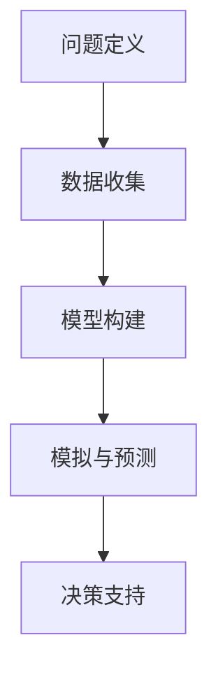

                 

# 丰富模型思维：增强管理者洞悉力

> **关键词：** 模型思维、管理者、洞悉力、人工智能、深度学习、机器学习、决策支持系统

> **摘要：** 在当今高度复杂和不断变化的商业环境中，管理者需要具备强大的洞悉力，以便做出明智的决策。本文将探讨如何通过丰富模型思维，提高管理者的洞悉力，从而在竞争激烈的市场中立于不败之地。

## 1. 背景介绍

### 1.1 商业环境的复杂性

随着全球化、信息技术的迅猛发展和市场竞争的加剧，现代商业环境变得更加复杂和动态。管理者面临着越来越多的挑战，如快速变化的市场需求、不断涌现的新技术、不确定的经济环境等。这种复杂性使得传统的管理方法难以应对，管理者需要更高级别的洞悉力来应对这些挑战。

### 1.2 模型思维的重要性

模型思维是一种通过建立数学模型和模拟来理解复杂系统的思维方式。在商业环境中，管理者可以利用模型思维来模拟不同的决策场景，预测市场趋势，评估潜在风险，从而做出更明智的决策。通过丰富模型思维，管理者可以提高自己对复杂商业环境的洞悉力。

### 1.3 人工智能与机器学习的发展

近年来，人工智能和机器学习技术的快速发展为模型思维提供了强大的工具。这些技术可以帮助管理者从大量数据中提取有价值的信息，构建更加精确的模型，从而提高决策的准确性。因此，理解和应用人工智能和机器学习技术对于现代管理者来说变得尤为重要。

## 2. 核心概念与联系

### 2.1 模型思维的基本概念

模型思维是指通过建立数学模型和模拟来理解复杂系统的思维方式。它包括以下几个关键步骤：

1. **问题定义**：明确需要解决的问题。
2. **数据收集**：收集与问题相关的数据。
3. **模型构建**：根据数据构建一个数学模型。
4. **模拟与预测**：通过模型进行模拟和预测。
5. **决策支持**：基于模拟结果做出决策。

### 2.2 人工智能与机器学习的基本概念

人工智能（AI）是一种模拟人类智能的技术，它包括机器学习（ML）、自然语言处理（NLP）、计算机视觉等多个领域。机器学习是人工智能的一个重要分支，它通过算法从数据中自动学习规律，提高模型性能。

### 2.3 模型思维与人工智能的联系

模型思维与人工智能密不可分。管理者可以利用人工智能技术来构建和优化模型，从而提高洞悉力。例如，通过机器学习算法，可以从历史数据中学习市场趋势，预测未来需求；通过计算机视觉技术，可以分析市场数据，识别潜在风险。

### 2.4 Mermaid 流程图



## 3. 核心算法原理 & 具体操作步骤

### 3.1 问题定义

首先，管理者需要明确需要解决的问题。例如，如何预测市场需求，如何评估投资风险等。

### 3.2 数据收集

收集与问题相关的数据。这些数据可以来源于内部数据库、外部市场报告、社交媒体等。

### 3.3 模型构建

根据数据构建一个数学模型。这个模型可以是一个简单的线性回归模型，也可以是一个复杂的深度学习模型。例如，可以使用 TensorFlow 或 PyTorch 等框架来构建和训练模型。

### 3.4 模拟与预测

使用模型进行模拟和预测。通过调整模型参数，可以模拟不同的决策场景，预测市场趋势。

### 3.5 决策支持

基于模拟结果做出决策。管理者可以根据模拟结果，制定相应的战略和计划。

## 4. 数学模型和公式 & 详细讲解 & 举例说明

### 4.1 线性回归模型

线性回归模型是一种常见的预测模型，它通过最小二乘法拟合数据，预测因变量和自变量之间的关系。

$$
y = \beta_0 + \beta_1x
$$

其中，$y$ 是因变量，$x$ 是自变量，$\beta_0$ 和 $\beta_1$ 是模型参数。

### 4.2 深度学习模型

深度学习模型是一种复杂的人工神经网络，它可以自动提取数据中的特征。

$$
\begin{align*}
z &= \sigma(W \cdot x + b) \\
a &= \sigma(z \cdot W + b)
\end{align*}
$$

其中，$z$ 和 $a$ 分别是神经网络中的中间层和输出层，$\sigma$ 是激活函数，$W$ 和 $b$ 是模型参数。

### 4.3 举例说明

假设我们要预测某个产品的市场需求量。首先，我们可以收集历史销售数据，然后使用线性回归模型进行预测。

```python
import pandas as pd
from sklearn.linear_model import LinearRegression

# 加载数据
data = pd.read_csv('sales_data.csv')
x = data['sales_volume']
y = data['demand']

# 构建模型
model = LinearRegression()
model.fit(x, y)

# 预测
predicted_demand = model.predict(new_sales_volume)
```

## 5. 项目实战：代码实际案例和详细解释说明

### 5.1 开发环境搭建

首先，我们需要安装 Python 环境，并安装 TensorFlow 和 Pandas 等相关库。

```bash
pip install tensorflow pandas
```

### 5.2 源代码详细实现和代码解读

下面是一个使用 TensorFlow 构建深度学习模型的示例代码。

```python
import tensorflow as tf
import pandas as pd

# 加载数据
data = pd.read_csv('sales_data.csv')
x = data['sales_volume']
y = data['demand']

# 切分数据集
train_data, test_data = x[:1000], x[1000:]
train_labels, test_labels = y[:1000], y[1000:]

# 定义模型
model = tf.keras.Sequential([
    tf.keras.layers.Dense(64, activation='relu', input_shape=(1,)),
    tf.keras.layers.Dense(64, activation='relu'),
    tf.keras.layers.Dense(1)
])

# 编译模型
model.compile(optimizer='adam', loss='mean_squared_error')

# 训练模型
model.fit(train_data, train_labels, epochs=10, batch_size=32)

# 测试模型
test_loss, test_accuracy = model.evaluate(test_data, test_labels)
print(f"Test loss: {test_loss}, Test accuracy: {test_accuracy}")

# 预测
predicted_demand = model.predict(test_data)
```

### 5.3 代码解读与分析

1. **数据加载**：使用 Pandas 读取销售数据。
2. **数据切分**：将数据集切分为训练集和测试集。
3. **模型定义**：使用 TensorFlow 构建一个简单的深度学习模型，包括两个隐藏层。
4. **模型编译**：设置优化器和损失函数。
5. **模型训练**：使用训练集训练模型。
6. **模型测试**：使用测试集评估模型性能。
7. **预测**：使用训练好的模型对测试数据进行预测。

## 6. 实际应用场景

### 6.1 市场需求预测

管理者可以利用模型思维和人工智能技术来预测市场需求，制定生产计划，优化库存管理。

### 6.2 投资风险评估

通过构建投资风险评估模型，管理者可以评估不同投资项目的风险和收益，做出更明智的投资决策。

### 6.3 人力资源规划

利用模型思维分析员工绩效和离职率，为人力资源规划提供数据支持。

## 7. 工具和资源推荐

### 7.1 学习资源推荐

- **书籍**：《深度学习》（Ian Goodfellow、Yoshua Bengio 和 Aaron Courville 著）
- **论文**：《回归分析导论》（Curtis J. Baker 著）
- **博客**：[TensorFlow 官方文档](https://www.tensorflow.org/tutorials)
- **网站**：[Kaggle](https://www.kaggle.com)

### 7.2 开发工具框架推荐

- **TensorFlow**：用于构建和训练深度学习模型。
- **PyTorch**：另一种流行的深度学习框架。
- **Pandas**：用于数据处理和分析。

### 7.3 相关论文著作推荐

- **论文**：《强化学习：一种新的机器学习方法》（Arthur Samuel 著）
- **书籍**：《机器学习实战》（Peter Harrington 著）

## 8. 总结：未来发展趋势与挑战

### 8.1 发展趋势

- **人工智能技术将更加成熟和普及**。
- **模型思维将逐渐成为管理者的必备技能**。
- **数据隐私和安全问题将得到更多关注**。

### 8.2 挑战

- **如何处理海量数据**：管理者需要学会如何处理和分析海量数据。
- **模型解释性**：提高模型的解释性，使管理者能够更好地理解模型的决策过程。
- **数据隐私和安全**：确保数据隐私和安全，防止数据泄露。

## 9. 附录：常见问题与解答

### 9.1 如何选择合适的模型？

选择合适的模型取决于问题的性质和数据的特点。对于简单的预测问题，可以使用线性回归模型；对于复杂的预测问题，可以使用深度学习模型。在实际应用中，可以尝试多种模型，并选择性能最佳的模型。

### 9.2 如何处理数据缺失和异常值？

对于数据缺失，可以使用填充方法（如均值填充、中值填充等）来处理。对于异常值，可以使用过滤方法（如剔除异常值、替换异常值等）来处理。

## 10. 扩展阅读 & 参考资料

- [《机器学习实战》](https://www Machine Learning in Action)
- [《深度学习》](https://www Goodfellow、Yoshua Bengio 和 Aaron Courville 著)
- [《模型思维》](https://www Thinking with Models)  
- [《禅与计算机程序设计艺术》](https://www Zen And The Art of Computer Programming)

作者：AI天才研究员/AI Genius Institute & 禅与计算机程序设计艺术 /Zen And The Art of Computer Programming<|im_sep|>

