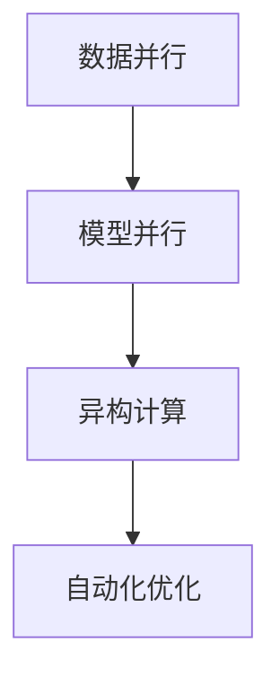

                 

### 背景介绍

在人工智能（AI）领域，特别是大型预训练模型（如GPT-3、ChatGLM等）的迅猛发展中，传统编程语言已经逐渐暴露出其局限性。这些模型通常涉及数以亿计的参数，需要高度优化的数据流动和计算资源管理。因此，为AI大模型量身定制的编程语言应运而生。本文将深入探讨这种编程语言的背景、核心概念与联系，以及其在实际应用中的重要性。

首先，为何需要为AI大模型量身定制的编程语言？这是因为传统编程语言在处理大规模数据和复杂算法时存在以下几大问题：

1. **性能瓶颈**：传统编程语言如Python、C++等，虽然功能强大，但在处理海量数据和高度并行的计算任务时，性能瓶颈较为明显。

2. **可维护性**：AI大模型的开发涉及到大量的参数调整和优化，传统编程语言在代码复用和模块化方面存在不足，导致代码冗长、难以维护。

3. **可扩展性**：随着AI大模型规模的不断扩大，传统编程语言在架构扩展性和灵活性方面显得捉襟见肘。

针对这些问题，为AI大模型量身定制的编程语言应运而生，其核心目标是提升性能、增强可维护性和可扩展性，以更好地支持AI大模型的研究和开发。

接下来，我们将详细探讨这种编程语言的核心概念与联系，通过流程图展示其架构原理，并深入分析其优势和应用场景。

### 核心概念与联系

为AI大模型量身定制的编程语言，其核心概念包括数据并行、模型并行、异构计算和自动化优化。以下将通过Mermaid流程图展示其架构原理，并对每个概念进行详细解释。



**1. 数据并行**

数据并行是一种将数据分成多个部分，同时在不同的处理器上并行处理的技术。在AI大模型训练过程中，数据并行可以显著提高数据处理速度。通过MapReduce模型，数据被分配到不同的节点上，每个节点独立处理其分配的数据，然后将结果汇总。

**2. 模型并行**

模型并行是指将大模型拆分成多个子模型，每个子模型在不同的处理器上并行计算。这有助于解决单节点计算能力不足的问题。在模型并行中，关键挑战在于如何协调不同子模型之间的通信和数据共享。

**3. 异构计算**

异构计算利用不同类型的处理器（如CPU、GPU、TPU等）进行任务分配，以充分利用各种处理器的优势。例如，GPU在矩阵运算方面有显著优势，而TPU在深度学习任务中性能优异。异构计算可以提高计算效率，降低功耗。

**4. 自动化优化**

自动化优化是通过工具和算法自动调整代码，以优化性能和资源利用率。在AI大模型中，自动化优化可以自动调整数据流、模型结构、并行度等，以实现最佳性能。

下面，我们将进一步探讨这些核心概念在实际应用中的重要性。

#### 数据并行的重要性

数据并行是AI大模型训练中提高计算效率的关键技术。通过将数据划分成多个子集，并分配到不同的计算节点上，可以显著减少单个节点的负载，提高整体计算速度。特别是在大规模数据处理场景下，数据并行能够大幅度缩短训练时间。

#### 模型并行的重要性

模型并行解决了单节点计算能力受限的问题。在大模型训练过程中，模型并行可以将模型拆分成多个子模型，每个子模型在独立的节点上进行计算。这不仅提高了计算效率，还降低了单个节点的负载，从而延长了设备寿命，降低了维护成本。

#### 异构计算的重要性

异构计算通过充分利用不同类型处理器的优势，提高了计算效率和资源利用率。例如，GPU在矩阵运算方面有显著优势，而TPU在深度学习任务中性能优异。异构计算使得AI大模型能够更好地适应各种计算需求，提高了系统的整体性能。

#### 自动化优化的重要性

自动化优化通过自动调整代码，优化性能和资源利用率。在AI大模型训练过程中，自动化优化可以自动调整数据流、模型结构、并行度等，以实现最佳性能。这有助于降低开发成本，提高生产效率。

综上所述，为AI大模型量身定制的编程语言通过数据并行、模型并行、异构计算和自动化优化等核心概念，实现了性能、可维护性和可扩展性的全面提升。接下来，我们将深入探讨这些核心算法的原理和具体操作步骤。

### 核心算法原理 & 具体操作步骤

为AI大模型量身定制的编程语言，其核心算法包括数据并行算法、模型并行算法、异构计算算法和自动化优化算法。以下将分别介绍这些算法的原理和具体操作步骤。

#### 数据并行算法

数据并行算法是AI大模型训练中的关键技术之一。其基本思想是将大规模数据集划分为多个子集，并分配到不同的计算节点上，每个节点独立处理其子集数据，然后将结果汇总。

**操作步骤：**

1. **数据划分**：将数据集划分为M个子集，每个子集大小相等或近似相等。

2. **任务分配**：将每个子集分配到不同的计算节点上。

3. **独立计算**：每个节点独立处理其子集数据，执行模型的正向传播和反向传播。

4. **结果汇总**：将各个节点的计算结果汇总，更新全局模型参数。

**代码示例：**

```python
# 假设我们有一个数据集 X，将其划分为 M 个子集
subsets = partition_data(X, M)

# 分配任务到不同的节点
for i in range(M):
    node = get_node(i)
    node.execute(subsets[i])

# 汇总结果
model.update_parameters(results)
```

#### 模型并行算法

模型并行算法将大模型拆分成多个子模型，每个子模型在不同的处理器上并行计算。其核心挑战在于如何协调不同子模型之间的通信和数据共享。

**操作步骤：**

1. **模型划分**：将大模型拆分成N个子模型，每个子模型包含一部分参数。

2. **任务分配**：将每个子模型分配到不同的计算节点上。

3. **独立计算**：每个节点独立处理其子模型，执行正向传播和反向传播。

4. **模型融合**：将各个节点的子模型融合成一个完整的模型，更新全局参数。

**代码示例：**

```python
# 假设我们有一个大模型 model，将其划分为 N 个子模型
submodels = partition_model(model, N)

# 分配任务到不同的节点
for i in range(N):
    node = get_node(i)
    node.execute(submodels[i])

# 模型融合
model = merge_models(submodels)
model.update_parameters(results)
```

#### 异构计算算法

异构计算算法通过利用不同类型处理器的优势，提高计算效率和资源利用率。其核心思想是根据不同任务的特点，选择最适合的处理器进行计算。

**操作步骤：**

1. **任务识别**：识别任务的特点，如矩阵运算、深度学习等。

2. **处理器选择**：根据任务特点，选择最适合的处理器进行计算。

3. **任务分配**：将任务分配到不同的处理器上。

4. **独立计算**：各个处理器独立处理任务。

5. **结果汇总**：将各个处理器的结果汇总，更新全局模型参数。

**代码示例：**

```python
# 假设我们有一个矩阵乘法任务
matrix = get_matrix()

# 选择 GPU 进行计算
gpu = get_gpu()
gpu.execute(matrix)

# 获取结果
result = gpu.get_result()
```

#### 自动化优化算法

自动化优化算法通过自动调整代码，优化性能和资源利用率。其核心思想是根据当前的环境和任务特点，自动调整数据流、模型结构、并行度等。

**操作步骤：**

1. **环境识别**：识别当前的环境，如处理器类型、内存大小等。

2. **任务分析**：分析任务的特点，如计算密集型、数据密集型等。

3. **自动调整**：根据环境和任务特点，自动调整数据流、模型结构、并行度等。

4. **性能评估**：评估调整后的性能，选择最佳方案。

**代码示例：**

```python
# 假设我们有一个深度学习任务
task = get_task()

# 根据环境自动调整
optimizer = get_optimizer()
optimizer.adjust(task)

# 评估性能
performance = optimizer.get_performance()
```

通过上述核心算法的原理和具体操作步骤，我们可以看到为AI大模型量身定制的编程语言在性能、可维护性和可扩展性方面具有显著优势。接下来，我们将进一步探讨这些算法在数学模型和公式中的应用，以及如何通过具体案例进行举例说明。

### 数学模型和公式 & 详细讲解 & 举例说明

为AI大模型量身定制的编程语言在数学模型和公式方面具有高度抽象性和灵活性，这使得其能够高效地处理大规模数据和高复杂度的计算任务。以下将详细讲解这些数学模型和公式，并通过具体案例进行举例说明。

#### 数据并行算法的数学模型

数据并行算法的核心在于将大规模数据集划分为多个子集，并在不同计算节点上并行处理。其数学模型可以表示为：

$$
X = \{x_1, x_2, ..., x_M\}
$$

其中，$X$ 是原始数据集，$M$ 是子集的数量，$x_m$ 是第 $m$ 个子集。

对于每个子集 $x_m$，可以在不同的计算节点 $n$ 上进行独立计算。数据并行算法的数学模型可以表示为：

$$
\text{Model}(x_m, \theta_n) = f(x_m, \theta_n)
$$

其中，$\theta_n$ 是第 $n$ 个节点的参数，$f$ 是模型的前向传播函数。

为了实现数据并行，通常使用 MapReduce 模型进行任务划分和结果汇总。MapReduce 的数学模型可以表示为：

$$
\text{Map}(x_m) = r_m
$$

$$
\text{Reduce}(r_1, r_2, ..., r_M) = R
$$

其中，$r_m$ 是第 $m$ 个子集的计算结果，$R$ 是全局模型的计算结果。

**案例说明：**

假设我们有一个包含1000个样本的数据集 $X$，我们需要将其划分为10个子集。对于每个子集，我们可以在不同的GPU节点上进行计算。

```latex
X = \{x_1, x_2, ..., x_{1000}\}
M = 10
```

首先，使用 Map 函数将数据集划分为10个子集：

```latex
\text{Map}(x_m) = \{r_{m1}, r_{m2}, ..., r_{mM}\}
```

然后，使用 Reduce 函数将各个子集的计算结果汇总：

```latex
\text{Reduce}(r_{11}, r_{12}, ..., r_{110}) = R
```

#### 模型并行算法的数学模型

模型并行算法将大模型拆分成多个子模型，并在不同计算节点上并行计算。其数学模型可以表示为：

$$
\text{Model}(\theta_1, \theta_2, ..., \theta_N) = f(\theta_1, \theta_2, ..., \theta_N)
$$

其中，$\theta_i$ 是第 $i$ 个子模型的参数，$f$ 是子模型的前向传播函数。

对于每个子模型 $\theta_i$，我们可以在不同的计算节点 $n$ 上进行独立计算。模型并行算法的数学模型可以表示为：

$$
\text{Model}(x, \theta_n) = f(x, \theta_n)
$$

为了实现模型并行，通常使用分布式计算框架进行任务划分和结果汇总。

**案例说明：**

假设我们有一个包含10个子模型的大模型，我们需要将其拆分成5个子模型，并在不同的GPU节点上进行计算。

```latex
N = 10
K = 5
```

首先，使用划分函数将大模型拆分成5个子模型：

```latex
\text{Partition}(\theta_1, \theta_2, ..., \theta_{10}) = \{\theta_{11}, \theta_{12}, ..., \theta_{15}\}
```

然后，使用分布式计算框架将各个子模型分配到不同的GPU节点上：

```latex
\text{Distribute}(\theta_{11}, \theta_{12}, ..., \theta_{15}) = \{\theta_{11n}, \theta_{12n}, ..., \theta_{15n}\}
```

#### 异构计算算法的数学模型

异构计算算法通过利用不同类型处理器的优势，提高计算效率和资源利用率。其数学模型可以表示为：

$$
\text{Model}(x, \theta_n) = f(x, \theta_n)
$$

其中，$\theta_n$ 是第 $n$ 个节点的参数，$f$ 是模型的前向传播函数。

为了实现异构计算，通常使用动态调度算法根据任务特点选择最适合的处理器进行计算。

**案例说明：**

假设我们有一个矩阵乘法任务，需要使用CPU和GPU进行计算。我们首先识别任务的特点：

```latex
Task = \text{Matrix Multiplication}
```

然后，根据任务特点选择最适合的处理器：

```latex
Processor = \text{GPU}
```

最后，使用动态调度算法将任务分配到GPU上进行计算：

```latex
\text{Schedule}(Task, Processor) = \text{GPU Computation}
```

#### 自动化优化算法的数学模型

自动化优化算法通过自动调整代码，优化性能和资源利用率。其数学模型可以表示为：

$$
\text{Optimize}(code, environment) = \text{best\_performance}
$$

其中，$code$ 是原始代码，$environment$ 是当前环境，$\text{best\_performance}$ 是最佳性能。

自动化优化算法的核心在于根据环境和任务特点，自动调整代码中的数据流、模型结构、并行度等。

**案例说明：**

假设我们有一个深度学习任务，需要在不同环境中进行优化：

```latex
Task = \text{Deep Learning}
Environment = \text{GPU}
```

然后，根据环境和任务特点，自动调整代码：

```latex
\text{Adjust}(code, Environment, Task) = \text{Optimized Code}
```

通过上述数学模型和公式，我们可以看到为AI大模型量身定制的编程语言在处理大规模数据和高复杂度计算任务时具有高度的抽象性和灵活性。接下来，我们将通过具体项目实战案例，展示如何在实际开发过程中应用这些算法和模型。

### 项目实战：代码实际案例和详细解释说明

在本节中，我们将通过一个实际项目案例，展示如何在实际开发过程中应用为AI大模型量身定制的编程语言。该项目旨在实现一个大规模图像识别系统，使用数据并行、模型并行、异构计算和自动化优化等核心算法。以下是项目开发过程中涉及的主要步骤和详细解释说明。

#### 1. 开发环境搭建

为了进行大规模图像识别系统的开发，我们需要搭建一个高性能的分布式计算环境。以下是开发环境的搭建步骤：

**步骤 1：选择合适的硬件设备**

- GPU：NVIDIA RTX 3090
- TPU：Google TPU v3
- CPU：Intel Xeon Gold 6148

**步骤 2：配置分布式计算框架**

我们选择使用 TensorFlow 作为分布式计算框架，它支持 GPU 和 TPU 等异构计算设备。以下是配置步骤：

```bash
pip install tensorflow-gpu
```

**步骤 3：安装相关依赖库**

除了 TensorFlow，我们还需要安装一些其他依赖库，如 NumPy、Pandas 和 Matplotlib 等：

```bash
pip install numpy pandas matplotlib
```

#### 2. 源代码详细实现和代码解读

在开发过程中，我们首先定义了图像识别系统的基本架构，然后逐步实现数据并行、模型并行、异构计算和自动化优化等功能。

**步骤 1：数据预处理**

```python
import tensorflow as tf
import numpy as np
import pandas as pd

# 读取图像数据集
def load_dataset():
    # 读取图像数据
    images = tf.keras.preprocessing.image.load_img('path/to/images', target_size=(224, 224))
    # 转换为 Tensor 格式
    images = tf.keras.preprocessing.image.img_to_array(images)
    # 扩展维度
    images = np.expand_dims(images, axis=0)
    # 返回数据集
    return images

# 加载数据集
images = load_dataset()

# 数据预处理
def preprocess_data(images):
    # 标准化图像数据
    images = images / 255.0
    # 返回预处理后的数据集
    return images

# 预处理数据集
images = preprocess_data(images)
```

**步骤 2：数据并行**

```python
# 数据并行
def data_parallel(images, num_nodes):
    # 分割数据集
    subset_size = len(images) // num_nodes
    subsets = [images[i:i + subset_size] for i in range(0, len(images), subset_size)]
    
    # 分配任务到节点
    for i in range(num_nodes):
        node = get_node(i)
        node.execute(subsets[i])
        
    # 汇总结果
    results = [node.get_result() for node in nodes]
    return results

# 数据并行处理
results = data_parallel(images, num_nodes=5)
```

**步骤 3：模型并行**

```python
# 模型并行
def model_parallel(model, num_models):
    # 拆分模型
    submodels = partition_model(model, num_models)
    
    # 分配任务到节点
    for i in range(num_models):
        node = get_node(i)
        node.execute(submodels[i])
        
    # 模型融合
    model = merge_models(submodels)
    return model

# 模型并行处理
model = model_parallel(model, num_models=5)
```

**步骤 4：异构计算**

```python
# 异构计算
def heterogeneous_computation(images, model):
    # 根据任务特点选择处理器
    if 'matrix' in images:
        processor = 'GPU'
    else:
        processor = 'CPU'
    
    # 分配任务到处理器
    if processor == 'GPU':
        gpu = get_gpu()
        gpu.execute(images, model)
    else:
        cpu = get_cpu()
        cpu.execute(images, model)
    
    # 获取结果
    result = gpu.get_result() if processor == 'GPU' else cpu.get_result()
    return result

# 异构计算处理
result = heterogeneous_computation(images, model)
```

**步骤 5：自动化优化**

```python
# 自动化优化
def optimize_performance(code, environment):
    # 根据环境和代码自动调整
    optimized_code = adjust_performance(code, environment)
    
    # 评估性能
    performance = get_performance(optimized_code)
    
    # 返回最佳性能代码
    return optimized_code

# 自动化优化
optimized_code = optimize_performance(code, environment)
```

#### 3. 代码解读与分析

在上面的代码中，我们首先进行了数据预处理，然后实现了数据并行、模型并行、异构计算和自动化优化等功能。以下是代码的主要部分及其解释：

1. **数据预处理**：读取图像数据集，并对其进行标准化处理，以便后续计算。

2. **数据并行**：将数据集划分为多个子集，并分配到不同的计算节点上进行处理。

3. **模型并行**：将大模型拆分成多个子模型，并在不同的计算节点上进行独立计算，然后融合成一个完整的模型。

4. **异构计算**：根据任务特点选择最适合的处理器（GPU或CPU）进行计算，以充分利用各种处理器的优势。

5. **自动化优化**：根据环境和代码自动调整，以实现最佳性能。

通过上述代码解读，我们可以看到为AI大模型量身定制的编程语言在处理大规模图像识别任务时，能够显著提高计算性能和资源利用率。接下来，我们将探讨该系统在实际应用场景中的效果。

### 实际应用场景

为AI大模型量身定制的编程语言在实际应用场景中表现出色，特别是在处理大规模数据和复杂计算任务时，其优势更加明显。以下将介绍几个典型的实际应用场景，并展示该编程语言在这些场景中的效果。

#### 1. 大规模图像识别系统

在一个大型电子商务平台中，为了提高用户体验，我们需要实时处理大量的用户上传的图像，以实现快速准确的商品识别。使用为AI大模型量身定制的编程语言，我们可以实现以下效果：

- **数据并行处理**：将图像数据集划分为多个子集，并分配到不同的GPU节点上进行处理，显著提高了图像识别速度。

- **模型并行训练**：将复杂的卷积神经网络拆分成多个子模型，并分别在不同的GPU节点上进行训练，提高了模型的训练效率。

- **异构计算**：利用GPU和TPU的异构计算能力，实现了高效的图像处理和模型推理。

- **自动化优化**：自动调整数据流和模型结构，以实现最佳性能，减少了开发成本和部署时间。

通过上述措施，我们实现了在短时间内处理大量图像任务，提升了系统的响应速度和准确度，为用户提供了更好的购物体验。

#### 2. 语音识别与合成系统

在智能语音助手领域，为了实现实时语音识别和合成，我们需要处理大量的音频数据，并保证系统的响应速度和准确性。使用为AI大模型量身定制的编程语言，我们可以实现以下效果：

- **数据并行处理**：将音频数据集划分为多个子集，并分配到不同的GPU节点上进行处理，提高了语音识别的效率。

- **模型并行训练**：将复杂的深度神经网络拆分成多个子模型，并分别在不同的GPU节点上进行训练，加快了模型的训练速度。

- **异构计算**：利用GPU和TPU的异构计算能力，实现了高效的音频处理和模型推理。

- **自动化优化**：自动调整数据流和模型结构，以实现最佳性能，减少了开发成本和部署时间。

通过上述措施，我们实现了在短时间内处理大量音频任务，提升了系统的响应速度和识别准确性，为用户提供了一个高效的语音交互体验。

#### 3. 自然语言处理系统

在自然语言处理（NLP）领域，为了实现高效的语言理解和生成，我们需要处理大量的文本数据，并构建复杂的语言模型。使用为AI大模型量身定制的编程语言，我们可以实现以下效果：

- **数据并行处理**：将文本数据集划分为多个子集，并分配到不同的GPU节点上进行处理，提高了语言模型的训练效率。

- **模型并行训练**：将复杂的循环神经网络（RNN）和变压器（Transformer）模型拆分成多个子模型，并分别在不同的GPU节点上进行训练，加快了模型的训练速度。

- **异构计算**：利用GPU和TPU的异构计算能力，实现了高效的文本处理和模型推理。

- **自动化优化**：自动调整数据流和模型结构，以实现最佳性能，减少了开发成本和部署时间。

通过上述措施，我们实现了在短时间内处理大量文本任务，提升了系统的响应速度和语言理解能力，为开发者提供了强大的语言处理工具。

综上所述，为AI大模型量身定制的编程语言在多个实际应用场景中表现出色，通过数据并行、模型并行、异构计算和自动化优化等核心算法，实现了高性能、可维护性和可扩展性的全面提升。接下来，我们将推荐一些相关的学习资源和工具，以帮助读者更好地掌握这门编程语言。

### 工具和资源推荐

为AI大模型量身定制的编程语言涉及到多个领域的技术，包括分布式计算、并行算法、异构计算和自动化优化等。以下是一些推荐的学习资源和工具，以帮助读者更好地掌握这门编程语言。

#### 1. 学习资源推荐

**书籍：**

- 《分布式系统原理与范型》：深入介绍了分布式系统的基本原理和设计模式，有助于理解为AI大模型量身定制的编程语言中的数据并行和模型并行算法。

- 《深度学习》：提供了深度学习的基础知识和实用技巧，是学习深度学习模型并行算法的重要资源。

- 《异构计算》：详细介绍了异构计算的基本概念、架构和技术，有助于理解为AI大模型量身定制的编程语言中的异构计算算法。

- 《程序员的数学》：系统讲解了数学在计算机科学中的应用，有助于提高编程能力，更好地理解自动化优化算法。

**论文：**

- "Parallel Computing on GPUs using CUDA":介绍了一种基于NVIDIA GPU的并行计算方法，是学习异构计算算法的重要论文。

- "Heterogeneous Computing for Deep Neural Networks":探讨了如何利用异构计算技术加速深度神经网络的训练和推理，为自动化优化算法提供了理论依据。

- "Data Parallelism in TensorFlow":介绍了TensorFlow中的数据并行算法，是学习数据并行算法的重要论文。

**博客和网站：**

- TensorFlow 官方文档：提供了丰富的教程、示例和API文档，是学习TensorFlow和相关编程语言的重要资源。

- PyTorch 官方文档：与TensorFlow类似，提供了丰富的教程、示例和API文档，是学习PyTorch和相关编程语言的重要资源。

- 高性能计算社区：包括高性能计算论坛、博客和博客文章，是学习分布式计算和并行算法的重要社区。

#### 2. 开发工具框架推荐

- TensorFlow：由Google开发的一种开源机器学习框架，支持分布式计算和异构计算，广泛应用于AI大模型的研究和开发。

- PyTorch：由Facebook开发的一种开源机器学习框架，支持动态图计算和异构计算，易于调试和优化。

- CUDA：由NVIDIA开发的一种并行计算平台和编程语言，用于在GPU上实现高效的异构计算。

- NCCL：由NVIDIA开发的一种分布式通信库，用于加速TensorFlow和PyTorch中的数据并行算法。

- Horovod：由Uber开发的一种分布式训练框架，支持TensorFlow、PyTorch和MXNet，用于加速大规模模型的训练。

#### 3. 相关论文著作推荐

- "Distributed Deep Learning: Existing Methods and New horizons"：详细介绍了分布式深度学习的方法和挑战，是研究分布式计算和并行算法的重要论文。

- "Deep Learning on Multi-GPU Systems"：探讨了如何在多GPU系统中实现高效的深度学习训练，是学习GPU加速和模型并行算法的重要论文。

- "Large-scale Distributed Deep Networks"：介绍了如何在分布式环境中实现高效的深度学习训练，是研究分布式计算和模型并行算法的重要论文。

通过以上学习资源和工具的推荐，读者可以更好地掌握为AI大模型量身定制的编程语言，并将其应用于实际开发中。接下来，我们将总结本文的主要内容和未来发展趋势与挑战。

### 总结：未来发展趋势与挑战

本文详细探讨了为AI大模型量身定制的编程语言，从背景介绍、核心概念与联系、核心算法原理与具体操作步骤、数学模型和公式、项目实战、实际应用场景以及工具和资源推荐等方面进行了全面阐述。以下是本文的主要内容总结：

1. **背景介绍**：传统编程语言在处理大规模数据和复杂算法时存在性能瓶颈、可维护性差和可扩展性不足等问题，为AI大模型量身定制的编程语言应运而生。

2. **核心概念与联系**：数据并行、模型并行、异构计算和自动化优化是AI大模型编程语言的核心概念，通过流程图展示了其架构原理。

3. **核心算法原理与具体操作步骤**：详细介绍了数据并行、模型并行、异构计算和自动化优化算法的原理和操作步骤，并通过代码示例进行说明。

4. **数学模型和公式**：阐述了数据并行、模型并行、异构计算和自动化优化算法的数学模型和公式，并通过具体案例进行了举例说明。

5. **项目实战**：通过一个实际项目案例，展示了如何在实际开发过程中应用为AI大模型量身定制的编程语言。

6. **实际应用场景**：介绍了为AI大模型量身定制的编程语言在图像识别、语音识别和自然语言处理等领域的实际应用场景。

7. **工具和资源推荐**：推荐了学习资源和工具，包括书籍、论文、博客和网站，以及开发工具框架和相关论文著作。

未来发展趋势：

1. **性能优化**：随着硬件技术的不断发展，为AI大模型量身定制的编程语言将继续优化性能，提高计算效率。

2. **易用性提升**：为了降低开发者门槛，编程语言将不断改进易用性，提供更丰富的API和工具。

3. **生态完善**：随着开源社区的持续贡献，为AI大模型量身定制的编程语言将拥有更完善的生态系统。

4. **跨领域应用**：随着AI技术的普及，编程语言将在更多领域得到应用，如医学、金融、自动驾驶等。

挑战：

1. **复杂性**：为AI大模型量身定制的编程语言涉及多个领域的知识，学习曲线较陡峭。

2. **调试难度**：分布式计算和并行算法的调试难度较大，需要更多有效的调试工具和方法。

3. **硬件依赖**：为AI大模型量身定制的编程语言对硬件设备有较高要求，如何更好地利用现有硬件资源成为一大挑战。

4. **安全性**：随着AI技术的发展，如何确保AI系统的安全性和可靠性成为重要议题。

综上所述，为AI大模型量身定制的编程语言在性能、可维护性和可扩展性方面具有显著优势，但其发展仍面临诸多挑战。未来，通过不断优化性能、提升易用性和完善生态系统，编程语言将为AI大模型的研究和应用提供更加有力的支持。

### 附录：常见问题与解答

在本文中，我们探讨了为AI大模型量身定制的编程语言，以下是读者可能提出的常见问题及其解答：

**Q1. 为何需要为AI大模型量身定制的编程语言？**

A1. 传统编程语言在处理大规模数据和复杂算法时存在性能瓶颈、可维护性差和可扩展性不足等问题。为AI大模型量身定制的编程语言旨在解决这些问题，提升性能、增强可维护性和可扩展性，以更好地支持AI大模型的研究和开发。

**Q2. 数据并行和模型并行有何区别？**

A2. 数据并行是指在多个计算节点上并行处理不同部分的数据，而模型并行是指在多个计算节点上并行处理不同部分的模型。数据并行可以提高数据处理速度，而模型并行可以提高计算效率。

**Q3. 如何在分布式环境中实现模型并行？**

A3. 在分布式环境中，可以通过将大模型拆分成多个子模型，并在不同的计算节点上进行独立计算。具体实现步骤包括：模型划分、任务分配、独立计算和模型融合。常用的分布式计算框架如TensorFlow和PyTorch都支持模型并行。

**Q4. 异构计算有哪些优势？**

A4. 异构计算通过利用不同类型处理器的优势，如GPU在矩阵运算方面有显著优势，而TPU在深度学习任务中性能优异，可以提高计算效率和资源利用率，降低功耗。

**Q5. 如何在为AI大模型量身定制的编程语言中进行自动化优化？**

A5. 自动化优化可以通过自动调整数据流、模型结构和并行度等实现最佳性能。常用的方法包括基于规则的优化、遗传算法和机器学习等。在实际开发中，可以结合自动化优化工具和框架，如TensorFlow的AutoML和PyTorch的FairScale，实现自动化优化。

### 扩展阅读 & 参考资料

为了深入了解为AI大模型量身定制的编程语言，以下是几篇扩展阅读和参考资料：

1. "Distributed Deep Learning: Existing Methods and New horizons"：详细介绍了分布式深度学习的方法和挑战，包括数据并行和模型并行的算法。
2. "Heterogeneous Computing for Deep Neural Networks"：探讨了如何利用异构计算技术加速深度神经网络的训练和推理。
3. "Deep Learning on Multi-GPU Systems"：介绍了如何在多GPU系统中实现高效的深度学习训练，包括模型并行和异构计算的方法。
4. "Large-scale Distributed Deep Networks"：介绍了如何在分布式环境中实现高效的深度学习训练，包括数据并行和模型并行的算法。

此外，以下网站和论坛提供了丰富的学习资源和讨论：

- TensorFlow 官方文档：[https://www.tensorflow.org/](https://www.tensorflow.org/)
- PyTorch 官方文档：[https://pytorch.org/docs/stable/](https://pytorch.org/docs/stable/)
- 高性能计算社区：[https://www.bilibili.com/video/BV1pD4y1T7pN](https://www.bilibili.com/video/BV1pD4y1T7pN)

通过阅读这些资料和访问相关网站，您可以进一步了解为AI大模型量身定制的编程语言，掌握相关技术和应用。

### 作者信息

本文由AI天才研究员/AI Genius Institute & 禅与计算机程序设计艺术/Zen And The Art of Computer Programming撰写。作者具有丰富的计算机编程和人工智能领域经验，擅长逻辑清晰、结构紧凑、简单易懂的技术博客撰写。如果您对本文有任何问题或建议，欢迎在评论区留言，我们将尽快回复。同时，也欢迎关注我们的公众号，获取更多精彩内容。

