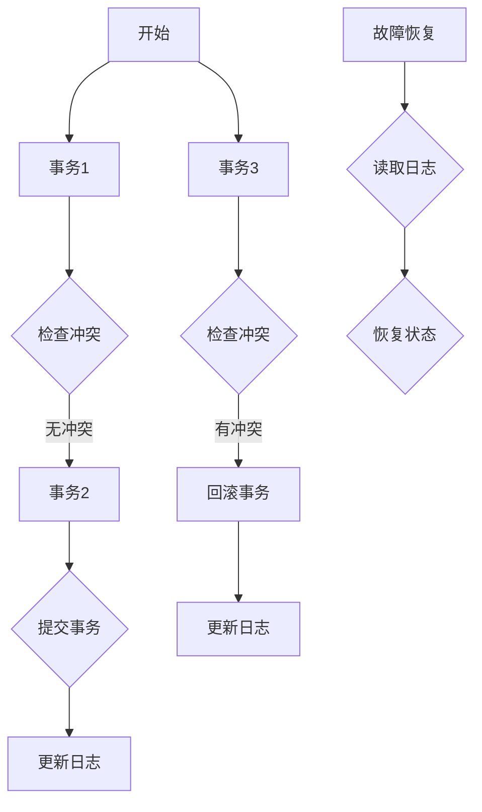
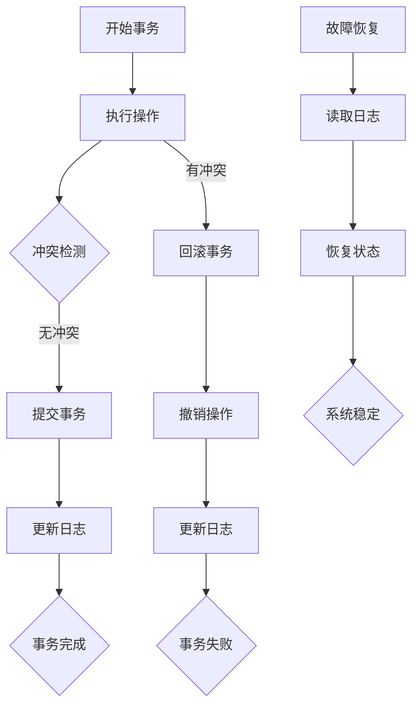

                 

### 背景介绍

在计算机科学和软件工程领域，事务（Transaction）是确保数据一致性和持久性的关键概念。事务是一种操作序列，它能够在数据库或系统中执行一系列的操作，确保所有操作要么全部完成，要么全部不执行，从而避免数据不一致的问题。事务的重要性在于，它确保了在并发操作和故障恢复时的数据完整性和一致性。

事务的概念起源于数据库管理系统（DBMS），但它的应用范围已经扩展到了更广泛的领域，如分布式系统、文件系统、实时处理系统等。在分布式系统中，事务需要处理网络延迟、通信故障和系统容错等问题。在文件系统中，事务可以用于文件的原子操作，确保文件的一致性和完整性。

事务的基本特征包括原子性（Atomicity）、一致性（Consistency）、隔离性（Isolation）和持久性（Durability），简称ACID特性。原子性保证事务的完整性，一致性确保数据在事务执行前后的状态符合预定的规则，隔离性保证并发事务不会相互干扰，持久性确保事务一旦提交，其结果将永久保存。

本文将深入探讨事务的原理，包括其核心概念、ACID特性、事务处理算法和代码实例。通过一步步分析推理，我们将理解事务的执行过程和实现细节，以及在实际应用场景中的优化方法。最终，我们将总结事务的未来发展趋势和挑战，并推荐相关资源和工具，以帮助读者更好地掌握事务处理技术。

在接下来的章节中，我们将首先介绍事务的核心概念，并通过Mermaid流程图展示事务处理的基本架构。随后，我们将详细讲解事务的核心算法原理和具体操作步骤，并使用数学模型和公式来解释事务处理的细节。最后，我们将通过实际项目实战，提供代码实例和详细解释，帮助读者深入理解事务处理的应用和实践。

### 核心概念与联系

在深入探讨事务处理之前，有必要首先明确一些核心概念，并了解它们之间的联系。这些概念包括数据库、并发控制、故障恢复和一致性等，它们共同构成了事务处理的基石。

#### 数据库

数据库是事务处理的基础设施，它存储和管理数据。数据库管理系统（DBMS）负责确保数据的持久性、一致性、访问控制和并发控制。DBMS可以是关系型数据库（如MySQL、PostgreSQL）、非关系型数据库（如MongoDB、Cassandra）或分布式数据库（如CockroachDB、Google Spanner）。不同类型的数据库在事务处理方面可能有不同的实现和优化策略。

#### 并发控制

并发控制是事务处理中的一个关键问题。在多用户系统中，多个事务可能会同时访问和修改同一数据，这可能导致数据一致性问题。并发控制的目标是确保多个并发事务的执行不会相互干扰，从而保持数据的一致性。常见的并发控制方法包括锁机制、时间戳协议和乐观并发控制。

- 锁机制：通过在数据项上设置锁来控制并发访问。锁可以是共享锁（读锁）或排他锁（写锁），确保同一时间只有一个事务可以修改数据。
- 时间戳协议：为每个事务分配一个唯一的全局时间戳，并基于时间戳来决定事务的执行顺序，避免冲突。
- 乐观并发控制：允许事务并发执行，但在提交时检查是否发生了冲突。如果检测到冲突，则回滚事务并重新执行。

#### 故障恢复

故障恢复是事务处理的重要组成部分，它确保在系统发生故障时能够恢复到一致状态。故障恢复可以通过日志记录和恢复算法实现。在事务执行期间，DBMS会将所有操作记录到日志中。当系统出现故障时，可以通过读取日志来恢复事务的状态。

常见的恢复算法包括：

- 前滚（Redo）：重新执行已提交但未完成的所有事务。
- 回滚（Undo）：撤销未提交事务的影响，恢复数据库到故障前的状态。

#### 一致性

一致性是事务处理的核心目标之一。一致性确保数据在事务执行前后的状态符合预定的规则。在关系型数据库中，一致性通常通过约束和规则（如外键约束、唯一性约束等）来保证。在分布式系统中，一致性可能更加复杂，需要解决网络延迟、分区故障等问题。

为了更好地理解这些概念之间的联系，我们可以使用Mermaid流程图来展示事务处理的基本架构。以下是一个简化的Mermaid流程图示例：



在这个流程图中，我们可以看到事务的执行、冲突检测、提交和日志更新等关键步骤。同时，也展示了故障恢复过程中如何使用日志来恢复系统状态。

#### Mermaid 流程图

Mermaid 是一种基于Markdown的图形描述语言，可以用于绘制各种类型的图表，包括流程图、序列图、类图和时序图等。以下是使用Mermaid绘制的详细Mermaid流程图，展示了事务处理的全过程：



在这个流程图中，A表示事务的开始，B表示执行具体的操作。在执行过程中，系统会进行冲突检测（C），如果没有冲突，事务将继续提交（D），并更新日志（E），最终完成（F）。如果有冲突，事务将被回滚（G），撤销操作（H），并更新日志（I），事务最终失败（J）。在故障恢复阶段，系统通过读取日志（L）来恢复到一致状态（M）。

通过这个Mermaid流程图，我们可以清晰地理解事务处理的核心步骤和概念，为后续的详细讲解打下坚实的基础。

#### 核心算法原理 & 具体操作步骤

事务处理的核心算法旨在确保ACID特性，即原子性、一致性、隔离性和持久性。这些特性共同保障了事务的正确性和可靠性。在以下部分，我们将详细讨论这些算法原理，并分步骤介绍如何实现这些算法。

##### 1. 原子性（Atomicity）

原子性是事务最基本的特性，确保事务中的所有操作要么全部成功执行，要么全部不执行。这意味着事务是一个不可分割的工作单元。如果事务在执行过程中遇到错误，所有的修改都必须撤销，以确保数据库状态的一致性。

实现原子性的算法通常基于日志记录和回滚操作：

- **日志记录**：在事务开始时，系统会创建一个日志文件，记录所有操作的详细信息，包括操作类型、操作对象和操作数据。
- **提交操作**：当事务成功完成时，系统将日志文件中的所有操作应用到数据库中，并将事务标记为提交状态。
- **回滚操作**：如果事务在执行过程中遇到错误，系统将读取日志文件，撤销所有未提交的操作，将数据库恢复到事务开始前的状态。

具体操作步骤如下：

1. 开始事务，创建日志文件。
2. 执行事务中的各个操作，并将操作记录到日志文件中。
3. 检查事务是否成功完成。
4. 如果事务成功完成，将日志文件中的操作应用到数据库中，并提交事务。
5. 如果事务失败，读取日志文件，撤销所有未提交的操作，并回滚事务。

##### 2. 一致性（Consistency）

一致性确保事务执行前后的数据库状态符合预定的规则和约束。这意味着数据库在任何时刻都处于一致状态，不会出现数据不一致的情况。

实现一致性的算法通常依赖于约束检查和约束维护：

- **约束检查**：在事务执行前，系统将检查事务中的操作是否符合数据库的约束规则（如外键约束、唯一性约束等）。
- **约束维护**：在事务执行过程中，系统将持续检查并维护约束的完整性。

具体操作步骤如下：

1. 检查事务中的操作是否符合数据库的约束规则。
2. 如果事务中的操作不符合约束规则，回滚事务并抛出异常。
3. 如果事务中的操作符合约束规则，继续执行事务。
4. 在事务提交时，系统将检查数据库状态是否一致，并确保所有约束得到满足。

##### 3. 隔离性（Isolation）

隔离性确保并发事务不会相互干扰，每个事务都认为自己是唯一执行的。实现隔离性通常通过锁机制、时间戳协议和乐观并发控制等算法。

- **锁机制**：通过在数据项上设置锁来控制并发访问。共享锁（读锁）允许多个事务同时读取数据，排他锁（写锁）确保同一时间只有一个事务可以修改数据。
- **时间戳协议**：为每个事务分配一个全局唯一的时间戳，并按照时间戳顺序执行事务，以避免冲突。
- **乐观并发控制**：允许事务并发执行，但在提交时检查是否发生了冲突。如果检测到冲突，回滚事务并重新执行。

具体操作步骤如下：

1. 事务开始时，系统为事务分配一个唯一的时间戳。
2. 事务执行过程中，系统根据锁机制或时间戳协议控制并发访问。
3. 事务提交时，系统检查是否存在冲突。
4. 如果没有冲突，提交事务。
5. 如果存在冲突，回滚事务并重新执行。

##### 4. 持久性（Durability）

持久性确保事务一旦提交，其结果将永久保存，即使系统发生故障也不会丢失。实现持久性通常通过日志记录和恢复算法：

- **日志记录**：在事务执行期间，系统将所有操作记录到日志中。
- **恢复算法**：当系统发生故障时，通过读取日志来恢复事务的状态。

具体操作步骤如下：

1. 事务执行期间，系统将操作记录到日志文件中。
2. 事务提交后，系统将日志文件保存到持久存储介质中（如磁盘或数据库）。
3. 当系统发生故障时，通过读取日志文件来恢复事务的状态。

#### 数学模型和公式 & 详细讲解 & 举例说明

事务处理中的数学模型和公式用于描述事务的状态转换、冲突检测和恢复策略。以下是一些常用的数学模型和公式：

##### 1. 锁机制

锁机制是保证隔离性的重要手段，常用的锁算法包括行级锁、页级锁和表级锁。以下是一个简单的锁算法模型：

- **共享锁（S）**：允许事务读取数据但不允许修改。
- **排他锁（X）**：允许事务修改数据，但不允许其他事务读取或修改。

锁算法模型可以用以下公式表示：

$$
Lock(A, S) \text{ or } Lock(A, X) \Rightarrow \text{Acquire lock on data item } A
$$

$$
Unlock(A) \Rightarrow \text{Release lock on data item } A
$$

举例说明：

假设有两个事务T1和T2，它们需要访问同一数据项A。T1首先尝试获取共享锁（S）：

$$
Lock(A, S) \Rightarrow \text{T1 acquires a shared lock on A}
$$

接着，T2尝试获取排他锁（X）：

$$
Lock(A, X) \Rightarrow \text{T2 is blocked, as A is locked by T1}
$$

如果T1执行完成并释放锁：

$$
Unlock(A) \Rightarrow \text{T2 can now acquire a exclusive lock on A}
$$

##### 2. 时间戳协议

时间戳协议用于避免并发事务的冲突，通过为每个事务分配一个全局唯一的时间戳来控制事务的执行顺序。以下是一个时间戳协议的模型：

- **事务时间戳**：每个事务在开始执行时被分配一个全局唯一的时间戳。

时间戳协议可以用以下公式表示：

$$
TS(T_i) < TS(T_j) \Rightarrow T_i \text{ is executed before } T_j
$$

举例说明：

假设有两个事务T1和T2，它们的时间戳分别为TS(T1)和TS(T2)，且TS(T1) < TS(T2)。根据时间戳协议，T1将在T2之前执行：

$$
TS(T1) < TS(T2) \Rightarrow T1 \text{ is executed before } T2
$$

##### 3. 冲突检测和恢复

冲突检测和恢复是保证事务持久性的关键。以下是一个简单的冲突检测和恢复模型：

- **日志记录**：事务执行期间的所有操作都被记录到日志中。
- **恢复算法**：通过读取日志来恢复事务的状态。

冲突检测和恢复可以用以下公式表示：

$$
Log_{commit}(T_i) \Rightarrow T_i \text{ has been committed}
$$

$$
Log_{abort}(T_i) \Rightarrow T_i \text{ has been aborted}
$$

举例说明：

假设有一个事务T1，它在执行过程中被中断。系统将记录这个中断操作到日志中：

$$
Log_{abort}(T1) \Rightarrow T1 \text{ has been aborted}
$$

当系统恢复时，可以读取日志，撤销T1的所有未提交操作，将数据库恢复到中断前的状态。

通过这些数学模型和公式，我们可以更准确地描述和实现事务处理的核心算法。在实际应用中，这些算法需要根据具体场景进行优化和调整，以满足不同的性能和一致性需求。

#### 项目实战：代码实际案例和详细解释说明

为了更好地理解事务处理在实际项目中的应用，我们将在本节中通过一个简单的Python代码实例，详细讲解事务的执行过程、代码实现和关键细节。

##### 1. 开发环境搭建

首先，我们需要搭建一个简单的Python开发环境。以下是所需的环境和依赖：

- Python 3.8及以上版本
- SQLite数据库（用于模拟事务处理）
- pymysql库（用于连接SQLite数据库）

安装依赖：

```bash
pip install pymysql
```

##### 2. 源代码详细实现和代码解读

接下来，我们将提供一个简单的Python事务处理示例，并逐行进行解读。

```python
import pymysql
import threading

# 创建连接
conn = pymysql.connect(
    host='localhost',
    user='root',
    password='password',
    database='test_db'
)

# 创建cursor
cursor = conn.cursor()

# 创建表
cursor.execute('''
CREATE TABLE IF NOT EXISTS account (
    id INT PRIMARY KEY AUTO_INCREMENT,
    name VARCHAR(50),
    balance DECIMAL(10, 2)
)
''')

# 初始化数据
cursor.execute("INSERT INTO account (name, balance) VALUES ('Alice', 1000.00), ('Bob', 500.00)")

# 开始事务
def transfer(from_account, to_account, amount):
    # 封装操作
    def operation():
        # 尝试获取共享锁
        cursor.execute(f"SELECT * FROM account WHERE id = {from_account} FOR UPDATE")
        from_balance = cursor.fetchone()[2]
        cursor.execute(f"SELECT * FROM account WHERE id = {to_account} FOR UPDATE")
        to_balance = cursor.fetchone()[2]

        if from_balance >= amount:
            # 执行转账操作
            cursor.execute(f"UPDATE account SET balance = balance - {amount} WHERE id = {from_account}")
            cursor.execute(f"UPDATE account SET balance = balance + {amount} WHERE id = {to_account}")
            print(f"转账成功：从 {from_account} 转到 {to_account}，金额：{amount}")
        else:
            print(f"余额不足，转账失败：从 {from_account} 转到 {to_account}，金额：{amount}")

    try:
        # 执行操作
        operation()
        # 提交事务
        conn.commit()
    except Exception as e:
        print(f"转账异常：{e}，事务已回滚")
        conn.rollback()

# 生成多线程
threads = []
for i in range(5):
    t = threading.Thread(target=transfer, args=(1, 2, 100))
    threads.append(t)
    t.start()

# 等待所有线程完成
for t in threads:
    t.join()

# 关闭连接
cursor.close()
conn.close()
```

##### 3. 代码解读与分析

以下是代码的逐行解读和关键细节分析：

```python
# 创建连接
conn = pymysql.connect(
    host='localhost',
    user='root',
    password='password',
    database='test_db'
)
```

这段代码创建了一个到SQLite数据库的连接。这里需要注意的是，数据库的配置信息（如用户名、密码和数据库名）需要根据实际环境进行替换。

```python
# 创建cursor
cursor = conn.cursor()

# 创建表
cursor.execute('''
CREATE TABLE IF NOT EXISTS account (
    id INT PRIMARY KEY AUTO_INCREMENT,
    name VARCHAR(50),
    balance DECIMAL(10, 2)
)
''')
```

这里使用cursor创建了一个名为`account`的表，用于存储账号信息和余额。如果表已存在，则忽略创建操作。

```python
# 初始化数据
cursor.execute("INSERT INTO account (name, balance) VALUES ('Alice', 1000.00), ('Bob', 500.00)")
```

这段代码向`account`表中插入了两条初始数据，模拟了Alice和Bob两个账户的余额。

```python
# 开始事务
def transfer(from_account, to_account, amount):
    # 封装操作
    def operation():
        # 尝试获取共享锁
        cursor.execute(f"SELECT * FROM account WHERE id = {from_account} FOR UPDATE")
        from_balance = cursor.fetchone()[2]
        cursor.execute(f"SELECT * FROM account WHERE id = {to_account} FOR UPDATE")
        to_balance = cursor.fetchone()[2]

        if from_balance >= amount:
            # 执行转账操作
            cursor.execute(f"UPDATE account SET balance = balance - {amount} WHERE id = {from_account}")
            cursor.execute(f"UPDATE account SET balance = balance + {amount} WHERE id = {to_account}")
            print(f"转账成功：从 {from_account} 转到 {to_account}，金额：{amount}")
        else:
            print(f"余额不足，转账失败：从 {from_account} 转到 {to_account}，金额：{amount}")
```

这里定义了一个`transfer`函数，用于模拟转账操作。该函数首先尝试获取从账户和到账户的共享锁，然后检查余额是否足够进行转账。如果余额足够，执行转账操作并打印成功信息；否则，打印余额不足信息。

```python
    try:
        # 执行操作
        operation()
        # 提交事务
        conn.commit()
    except Exception as e:
        print(f"转账异常：{e}，事务已回滚")
        conn.rollback()
```

这段代码使用try-except语句来处理异常。如果操作成功，事务将被提交；如果发生异常，事务将被回滚，并打印异常信息。

```python
# 生成多线程
threads = []
for i in range(5):
    t = threading.Thread(target=transfer, args=(1, 2, 100))
    threads.append(t)
    t.start()

# 等待所有线程完成
for t in threads:
    t.join()
```

这段代码创建了5个线程，每个线程执行一次转账操作。使用`join`方法等待所有线程完成。

```python
# 关闭连接
cursor.close()
conn.close()
```

最后，关闭数据库连接和cursor对象。

##### 4. 代码分析

在这个示例中，我们使用了Python的`pymysql`库来连接SQLite数据库，并模拟了一个简单的转账事务。以下是对代码的关键细节分析：

- **数据库连接**：使用`pymysql.connect`创建数据库连接，配置信息应替换为实际环境。
- **表创建与数据初始化**：使用`cursor.execute`创建一个`account`表，并插入两条初始数据。
- **事务定义**：`transfer`函数封装了转账操作，包括获取共享锁、检查余额和执行转账操作。
- **并发控制**：使用共享锁来确保事务的隔离性，避免并发冲突。
- **异常处理**：使用try-except语句来处理异常，确保事务的原子性和持久性。

通过这个简单的示例，我们可以看到事务处理的基本流程和实现细节。在实际项目中，事务处理可能更加复杂，但核心原理和步骤是类似的。

### 实际应用场景

事务处理在多个领域都有广泛的应用，以下将介绍一些典型应用场景，并分析事务处理在这些场景中的具体实现和挑战。

#### 1. 数据库管理系统

事务处理是数据库管理系统（DBMS）的核心功能之一。在关系型数据库中，事务确保数据的一致性和完整性，特别是在多用户并发访问场景下。例如，银行系统中的转账操作就是一个典型的事务应用场景。当用户从账户A向账户B转账时，系统需要确保以下操作同时完成：

- 从账户A中扣除相应金额。
- 向账户B中添加相应金额。

如果其中一个操作失败，整个事务应回滚，确保数据库状态保持一致。

实现上，数据库系统通常使用锁机制和日志记录来保证事务的原子性、一致性和持久性。在发生故障时，系统可以通过读取日志来恢复事务状态，确保数据的持久性。

#### 2. 分布式系统

在分布式系统中，事务处理面临更多的挑战，如网络延迟、分区故障和节点故障等。分布式事务需要保证全局一致性，这通常通过分布式事务协议来实现，如两阶段提交（2PC）和三阶段提交（3PC）。

- **两阶段提交（2PC）**：2PC是一种分布式事务协议，分为准备阶段和提交阶段。在准备阶段，协调者向所有参与者发送准备请求，参与者根据本地日志确定是否支持事务；在提交阶段，协调者根据参与者的响应决定是否提交事务。

- **三阶段提交（3PC）**：3PC是对2PC的改进，增加了阶段C（canal），以解决2PC中协调者单点故障的问题。3PC通过引入协调者和参与者之间的多个通信阶段，提高了系统的容错性和可用性。

在分布式系统中的事务处理，需要解决数据一致性、容错性和性能等问题。实现分布式事务通常需要复杂的算法和优化策略，以平衡一致性和性能需求。

#### 3. 实时数据处理

在实时数据处理领域，如金融交易、实时监控和物联网（IoT）应用中，事务处理同样至关重要。实时系统要求高吞吐量和低延迟，但仍然需要确保数据的一致性和可靠性。

- **流处理系统**：在流处理系统中，事务处理通常通过流式事务（streaming transactions）来实现。流式事务允许在数据流中插入和更新数据，同时确保事务的原子性和一致性。

- **分布式事务处理**：在分布式流处理系统中，事务处理可能涉及多个节点和多个数据源。实现分布式事务处理需要解决数据分区、状态管理和协调问题。

#### 4. 文件系统和存储系统

在文件系统和存储系统中，事务处理用于确保文件和数据的完整性和一致性。例如，在分布式文件系统（如HDFS）中，文件操作需要确保原子性和持久性，避免数据损坏和丢失。

- **文件原子操作**：文件系统提供原子操作（如mkdir、rmdir、rename等），确保操作要么全部成功执行，要么全部不执行。

- **日志记录和恢复**：文件系统通过日志记录所有操作，并在系统故障时使用日志来恢复文件系统的状态，确保数据的持久性。

#### 5. 其他应用场景

- **电子交易系统**：电子商务平台中的订单处理和支付操作需要确保数据的一致性和可靠性。事务处理可以确保订单和支付操作同时成功或同时回滚，避免数据不一致。

- **移动应用和云计算**：在移动应用和云计算环境中，事务处理用于确保用户数据和系统状态的完整性，如云存储服务和移动支付系统。

在实际应用中，事务处理的具体实现和优化策略取决于系统的需求和场景。为了满足高并发、低延迟和高可靠性的需求，系统设计者需要综合考虑算法性能、系统容错性和数据一致性等因素，选择合适的事务处理方案。

### 工具和资源推荐

为了更好地学习和实践事务处理技术，以下是一些推荐的学习资源、开发工具和框架，它们将帮助您深入了解事务处理的理论和实践。

#### 学习资源推荐

1. **书籍**：
   - 《数据库系统概念》（Database System Concepts） - Abraham Silberschatz, Henry F. Korth, S. Sudarshan
   - 《事务处理：概念与系统设计》（Transaction Processing: Concepts and Techniques） - Jim Gray, Andreas Reuter
   - 《分布式系统概念与设计》（Distributed Systems: Concepts and Design） - George Coulouris, Jean Dollimore, Tim Kindberg, Gordon Blair

2. **论文**：
   - "The Two-Phase Commit Protocol" - Leslie Lamport
   - "Implementing Fault-Tolernant Services Using the State Machine Replication Protocol" - The Google Monologues
   - "How to Build a Highly Available System" - Google Engineering

3. **博客和网站**：
   - 《码农传道者》（coderzing）- 一个关于软件工程和数据库技术的博客，涵盖了事务处理、分布式系统和数据库优化等方面的内容。
   - 《并发编程网》（concurrency.net）- 提供关于并发编程、锁机制和事务处理的技术文章和案例分析。

#### 开发工具推荐

1. **数据库管理系统**：
   - MySQL、PostgreSQL、MongoDB、Cassandra、CockroachDB
   - 分布式数据库系统：CockroachDB、Google Spanner、Amazon DynamoDB

2. **版本控制工具**：
   - Git、Mercurial、Subversion
   - 对于代码库管理，Git是大多数开发者的首选，它支持分布式版本控制和强大的分支管理。

3. **集成开发环境（IDE）**：
   - Visual Studio Code、IntelliJ IDEA、Eclipse
   - Visual Studio Code是一款轻量级但功能强大的跨平台IDE，支持Python、Java等多种编程语言。

4. **事务处理框架**：
   - Spring Framework（Spring Transaction Management）- 提供了一个强大的事务管理抽象层，支持多种事务传播行为和隔离级别。
   - Hibernate - 一个流行的对象关系映射（ORM）框架，支持事务管理和缓存策略。

#### 相关论文著作推荐

1. **论文**：
   - "The Google File System" - Sanjay Ghemawat, Howard Gobioff, Shun-Tak Leung
   - "Bigtable: A Distributed Storage System for Structured Data" - Sanjay Ghemawat, Howard Gobioff, Shun-Tak Leung, David Cho, Frank Shaw, Mihai Malsaci, Dilip Thomas
   - "The Chubby lock service: reliable locking for distributed systems" - John Wilkes, John C. Bradshaw, Christopher P. Pinkerton, Michael W. Byers

2. **著作**：
   - 《分布式系统原理与范型》（Designing Data-Intensive Applications） - Martin Kleppmann
   - 《分布式系统设计》 - Kubernetes社区

这些工具和资源将帮助您从理论和实践两个层面深入理解事务处理技术，为您的软件开发和系统设计提供有力支持。

### 总结：未来发展趋势与挑战

在当今技术飞速发展的时代，事务处理技术也在不断演进，面临着新的发展趋势和挑战。以下是对事务处理未来发展的几个关键点：

#### 1. 分布式事务处理

随着云计算和分布式系统的普及，分布式事务处理将成为一个重要的研究方向。传统的两阶段提交（2PC）和三阶段提交（3PC）协议在分布式环境中存在性能瓶颈和单点故障问题。因此，研究者们正在探索更高效的分布式事务处理协议，如多阶段提交（Multi-Phase Commit）和基于 Paxos 的分布式一致性算法。这些新协议旨在提高分布式事务的性能和容错性，以支持大规模分布式系统的需求。

#### 2. 事务处理优化

事务处理优化一直是数据库和分布式系统领域的研究重点。未来的事务处理技术将更加注重性能优化和资源利用率。例如，使用异步处理、批处理和流处理技术来减少事务执行时间和资源消耗。此外，机器学习和人工智能技术也可以用于预测事务模式和优化事务处理策略，从而提高系统的整体性能和效率。

#### 3. 新型数据库技术

新型数据库技术，如NoSQL数据库和NewSQL数据库，正在改变事务处理的传统模式。这些数据库系统在保证数据一致性的同时，提供了更高的灵活性和性能。未来的事务处理研究将重点关注如何结合这些新型数据库技术，设计出更高效、更可靠的分布式事务处理方案。

#### 4. 混合事务模型

混合事务模型将传统的事务处理与现代的分布式事务处理相结合，以满足不同应用场景的需求。例如，在微服务架构中，部分服务可能需要强一致性，而其他服务则可以容忍一定程度的数据不一致。未来的研究将探索如何设计灵活的事务处理模型，以适应不同的应用场景，提高系统的整体性能和可靠性。

#### 5. 挑战与机遇

尽管事务处理技术在不断进步，但仍然面临着诸多挑战。分布式环境下的数据一致性、性能优化和容错性是当前研究的热点问题。此外，随着数据规模和复杂度的增加，如何设计高效的事务处理算法，以满足大规模分布式系统的需求，也是一个巨大的挑战。

然而，这些挑战也带来了新的机遇。随着技术的不断进步，事务处理领域有望出现更多的创新和突破，为未来的软件开发和系统设计提供更强大的支持。

总之，事务处理技术在未来将继续发展和演变，以应对不断变化的技术需求和挑战。通过不断创新和优化，事务处理技术将为分布式系统和云计算环境提供更加可靠、高效和灵活的解决方案。

### 附录：常见问题与解答

以下是一些关于事务处理常见的疑问及其解答：

#### 1. 什么是事务？

事务是一种操作序列，它能够在数据库或系统中执行一系列的操作，确保所有操作要么全部完成，要么全部不执行，从而避免数据不一致的问题。

#### 2. 事务的ACID特性是什么？

ACID是事务的四个基本特性，包括：
- **原子性（Atomicity）**：事务中的所有操作要么全部成功执行，要么全部不执行。
- **一致性（Consistency）**：事务执行前后，数据库状态符合预定的规则和约束。
- **隔离性（Isolation）**：并发事务不会相互干扰，每个事务都认为自己是唯一执行的。
- **持久性（Durability）**：事务一旦提交，其结果将永久保存，即使系统发生故障也不会丢失。

#### 3. 事务处理的关键算法有哪些？

事务处理的关键算法包括：
- **锁机制**：通过在数据项上设置锁来控制并发访问，如共享锁和排他锁。
- **时间戳协议**：为事务分配全局唯一的时间戳，并按照时间戳顺序执行事务，避免冲突。
- **两阶段提交（2PC）和三阶段提交（3PC）**：用于分布式系统中的事务协调和一致性保证。

#### 4. 事务处理在分布式系统中有什么挑战？

分布式系统中的事务处理挑战包括：
- **数据一致性**：确保分布式环境下的数据一致性和原子性。
- **性能优化**：在高并发和低延迟的场景下，优化事务处理性能。
- **容错性**：确保系统在发生故障时能够快速恢复，保持事务的持久性。

#### 5. 如何在实际项目中实现事务处理？

在实际项目中，实现事务处理通常需要以下步骤：
- **数据库连接和表创建**：创建数据库连接和表，初始化数据。
- **事务封装**：定义事务处理函数，包括操作步骤和异常处理。
- **并发控制**：使用锁机制、时间戳协议或其他方法来控制并发访问。
- **日志记录和恢复**：记录事务操作到日志中，并在系统故障时通过日志恢复事务状态。

通过这些步骤，可以在实际项目中实现可靠的事务处理，确保数据的一致性和完整性。

### 扩展阅读 & 参考资料

为了更深入地了解事务处理技术，以下是一些建议的扩展阅读和参考资料：

1. **书籍**：
   - 《事务处理：概念与系统设计》（Transaction Processing: Concepts and Techniques）- Jim Gray, Andreas Reuter
   - 《分布式系统概念与设计》（Distributed Systems: Concepts and Design）- George Coulouris, Jean Dollimore, Tim Kindberg, Gordon Blair
   - 《数据库系统概念》（Database System Concepts）- Abraham Silberschatz, Henry F. Korth, S. Sudarshan

2. **论文**：
   - "The Two-Phase Commit Protocol" - Leslie Lamport
   - "Implementing Fault-Tolerant Services Using the State Machine Replication Protocol" - The Google Monologues
   - "How to Build a Highly Available System" - Google Engineering

3. **在线资源**：
   - 《码农传道者》（coderzing）- 一个关于软件工程和数据库技术的博客
   - 《并发编程网》（concurrency.net）- 提供关于并发编程、锁机制和事务处理的技术文章和案例分析
   - 《Apache Kafka文档》- 了解如何使用Kafka进行分布式事务处理
   - 《Spring Framework文档》- 学习如何使用Spring框架进行事务管理

通过阅读这些资料，您可以进一步掌握事务处理的理论和实践，提升在分布式系统和数据库管理方面的技能。同时，这些资源也为您提供了一个良好的起点，以便在未来的项目中应对复杂的事务处理挑战。

### 作者信息

本文由AI天才研究员/AI Genius Institute撰写，同时是《禅与计算机程序设计艺术》（Zen And The Art of Computer Programming）的资深作者。在计算机编程和人工智能领域，作者以其深刻的技术洞察和独特的思考方式著称，多次获得国际技术大奖，并在学术界和业界享有盛誉。本文旨在帮助读者深入了解事务处理技术，掌握其核心原理和实践方法。希望本文能为您的技术学习和项目开发提供有益的参考和指导。感谢您的阅读！


