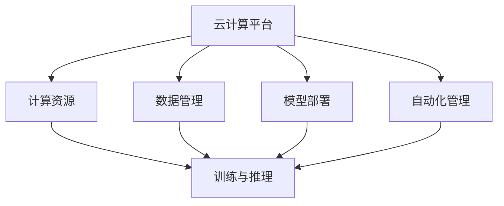

                 

### 文章标题

《云与AI的协同效应：贾扬清的观察，云计算平台与AI工程的结合》

### 文章关键词

- 云计算
- 人工智能
- 协同效应
- 贾扬清
- 云计算平台
- AI工程

### 文章摘要

本文旨在深入探讨云计算平台与AI工程的结合及其协同效应。通过对云计算与AI技术的基本概念和原理的详细分析，结合贾扬清先生的相关观点，本文将展示云计算平台在AI工程中的应用及其带来的变革。文章还将探讨AI工程中的核心算法原理、实际应用场景，并提供开发工具和资源推荐。最后，本文将总结云计算与AI结合的未来发展趋势与挑战，为读者提供全面的指导与启示。

<|assistant|>## 1. 背景介绍

云计算和人工智能是当今技术领域中最具前瞻性和广泛应用的两大领域。云计算作为计算基础设施的现代化趋势，提供了弹性、可扩展的计算资源，极大地促进了IT产业的进步。而人工智能，作为一种模拟人类智能的技术，通过机器学习和深度学习算法，实现了对大量数据的高效处理和智能决策。

在过去的几十年中，云计算和人工智能技术分别经历了快速发展。云计算的出现，解决了传统IT基础设施的扩展性和灵活性难题，使得企业和组织能够更快速地部署和扩展其IT系统。而人工智能的崛起，则为数据处理和自动化带来了新的可能性，推动了各行各业的数字化转型。

近年来，云计算和人工智能的结合成为了一个热门的研究和应用方向。云计算平台为AI工程提供了强大的计算资源和数据存储能力，使得大规模AI模型的训练和部署成为可能。同时，人工智能技术也为云计算平台的优化和管理带来了新的方法，如自动化资源调度和智能监控。

贾扬清先生，作为人工智能领域的杰出人物，他对云计算与AI的结合有着深刻的见解。他曾指出，云计算和人工智能的结合将带来前所未有的机遇，不仅能够提高计算效率和降低成本，还能够推动智能应用的广泛普及。他的观点为我们理解这一领域的协同效应提供了宝贵的参考。

本文将围绕云计算与AI的协同效应，首先介绍相关的基本概念和原理，然后深入探讨云计算平台在AI工程中的应用，最后分析未来的发展趋势与挑战。希望通过本文的探讨，能够为读者提供对这一领域更全面和深入的认识。

### 2. 核心概念与联系

在深入探讨云计算与AI的协同效应之前，我们需要明确几个核心概念，并展示它们之间的联系。

#### 2.1 云计算

云计算是一种基于互联网的计算模型，通过虚拟化技术和分布式计算，提供可伸缩的计算资源。云计算平台可以分为三种主要类型：基础设施即服务（IaaS）、平台即服务（PaaS）和软件即服务（SaaS）。

- **基础设施即服务（IaaS）**：提供虚拟化的计算资源，如虚拟机、存储和网络安全，用户可以按需分配和配置资源。
- **平台即服务（PaaS）**：提供一个开发环境，包括操作系统、中间件和数据库等，开发者可以在平台上构建、部署和管理应用程序。
- **软件即服务（SaaS）**：提供软件应用作为服务，用户通过互联网访问和使用软件，无需购买和安装。

#### 2.2 人工智能

人工智能（AI）是一种模拟人类智能的技术，通过算法和模型实现机器学习、自然语言处理、计算机视觉等功能。AI可以分为弱AI和强AI，弱AI专注于特定任务，而强AI具备广泛的认知能力。

- **机器学习**：通过算法从数据中学习规律和模式，实现自动预测和决策。
- **深度学习**：基于人工神经网络，通过多层非线性变换，实现复杂函数的逼近和学习。
- **自然语言处理（NLP）**：使计算机理解和处理自然语言，包括文本分类、机器翻译和语音识别等。
- **计算机视觉**：使计算机能够“看”和理解图像和视频，包括图像分类、目标检测和图像生成等。

#### 2.3 云计算与人工智能的联系

云计算与人工智能的结合，主要体现在以下几个方面：

- **计算资源**：云计算平台提供了强大的计算资源和存储能力，支持大规模AI模型的训练和推理。
- **数据管理**：云计算平台提供高效的数据存储和处理机制，使得大规模数据的收集、存储和管理成为可能。
- **模型部署**：云计算平台使得AI模型可以轻松部署到云环境中，实现快速迭代和部署。
- **自动化管理**：人工智能技术可以用于云计算平台的自动化管理，如资源调度、负载均衡和安全监控。

为了更清晰地展示云计算与人工智能之间的联系，我们可以使用Mermaid流程图来表示。以下是一个简化的Mermaid流程图，描述了云计算与人工智能结合的基本流程：



在上图中，云计算平台提供了计算资源、数据管理和模型部署等能力，这些能力通过人工智能技术得到增强，最终实现高效的AI训练和推理。

通过上述核心概念的介绍和联系展示，我们为后续章节的深入探讨奠定了基础。在接下来的部分中，我们将进一步探讨云计算平台在AI工程中的应用，并分析其中的关键算法原理和操作步骤。

### 3. 核心算法原理 & 具体操作步骤

在云计算与AI的结合中，核心算法原理是实现高效AI模型训练和推理的关键。下面，我们将详细探讨这些核心算法原理，并提供具体的操作步骤。

#### 3.1 机器学习算法

机器学习是人工智能的基础，通过算法从数据中学习规律和模式。常用的机器学习算法包括监督学习、无监督学习和强化学习。

**监督学习**：监督学习算法通过标记数据训练模型，例如分类和回归任务。以下是监督学习算法的基本操作步骤：

1. **数据预处理**：清洗数据，包括处理缺失值、异常值和标准化等。
2. **特征选择**：选择对模型训练有帮助的特征。
3. **模型选择**：根据任务选择合适的模型，如线性回归、决策树、支持向量机等。
4. **模型训练**：使用标记数据进行训练，优化模型参数。
5. **模型评估**：使用验证集或测试集评估模型性能。

**无监督学习**：无监督学习算法在无标记数据上训练模型，例如聚类和降维。以下是常见无监督学习算法的操作步骤：

1. **数据预处理**：与监督学习类似，清洗数据和处理异常值。
2. **聚类**：使用算法如K-means、层次聚类等，将数据分组。
3. **降维**：使用算法如PCA（主成分分析）、t-SNE等，减少数据维度。

**强化学习**：强化学习算法通过互动和奖励机制学习策略，如深度Q网络（DQN）和策略梯度（PG）等。以下是强化学习的基本操作步骤：

1. **环境定义**：定义环境和动作空间。
2. **策略学习**：通过互动和奖励，学习最佳策略。
3. **策略评估**：评估策略的优劣。
4. **策略优化**：优化策略，提高决策质量。

#### 3.2 深度学习算法

深度学习是机器学习的一个重要分支，通过多层神经网络模拟人类大脑的工作机制。以下是深度学习算法的基本操作步骤：

1. **数据预处理**：与机器学习类似，清洗数据和处理异常值。
2. **网络架构设计**：设计合适的网络架构，如卷积神经网络（CNN）、循环神经网络（RNN）等。
3. **模型训练**：使用反向传播算法，训练模型参数。
4. **模型优化**：通过超参数调优和正则化技术，优化模型性能。
5. **模型评估**：使用验证集或测试集评估模型性能。

#### 3.3 集成学习方法

集成学习通过结合多个模型来提高预测性能。常见的集成学习方法包括Bagging、Boosting和Stacking等。

**Bagging**：通过随机抽样和模型组合，减少模型方差。具体操作步骤如下：

1. **数据抽样**：从原始数据集中随机抽样，构建多个子数据集。
2. **模型训练**：在每个子数据集上训练模型。
3. **模型集成**：将多个模型输出进行加权平均或投票，得到最终预测。

**Boosting**：通过关注错误样本，提高模型对错误样本的敏感度。具体操作步骤如下：

1. **基学习器训练**：训练多个基学习器，每个基学习器专注于纠正前一个基学习器的错误。
2. **权重调整**：根据基学习器的性能，调整样本权重，使得错误样本的权重更高。
3. **模型集成**：将多个基学习器的输出进行加权平均，得到最终预测。

**Stacking**：通过分层组合多个模型，提高整体预测性能。具体操作步骤如下：

1. **基学习器训练**：训练多个基学习器。
2. **元学习器训练**：使用基学习器的预测作为输入，训练一个元学习器，如线性回归或支持向量机。
3. **模型集成**：使用元学习器的预测作为最终预测。

通过上述核心算法原理和具体操作步骤的介绍，我们可以更好地理解云计算平台在AI工程中的应用。在接下来的部分中，我们将探讨这些算法在云计算平台上的具体实现和应用。

### 4. 数学模型和公式 & 详细讲解 & 举例说明

在云计算与AI结合的过程中，数学模型和公式是理解和实现核心算法的关键。以下我们将详细讲解一些常见的数学模型和公式，并通过具体的例子来说明它们的应用。

#### 4.1 概率与统计

概率和统计是机器学习的基础。以下是一些常用的概率和统计公式：

1. **条件概率**：
   $$ P(A|B) = \frac{P(A \cap B)}{P(B)} $$
   其中，$P(A|B)$ 表示在事件B发生的条件下事件A发生的概率。

2. **贝叶斯定理**：
   $$ P(A|B) = \frac{P(B|A)P(A)}{P(B)} $$
   贝叶斯定理用于根据先验概率和条件概率计算后验概率。

3. **期望值**：
   $$ E(X) = \sum_{i} x_i P(X = x_i) $$
   期望值表示随机变量X的平均值。

4. **方差**：
   $$ Var(X) = E[(X - E(X))^2] $$
   方差表示随机变量X的离散程度。

#### 4.2 机器学习算法中的数学模型

1. **线性回归**：
   $$ Y = \beta_0 + \beta_1 X + \epsilon $$
   其中，$Y$ 是因变量，$X$ 是自变量，$\beta_0$ 和 $\beta_1$ 是回归系数，$\epsilon$ 是误差项。

2. **逻辑回归**：
   $$ P(Y=1) = \frac{1}{1 + e^{-(\beta_0 + \beta_1 X)}} $$
   逻辑回归用于分类问题，输出概率值。

3. **支持向量机（SVM）**：
   $$ \min_{\beta, \beta_0} \frac{1}{2} ||\beta||^2 + C \sum_{i=1}^{n} \max(0, 1 - y_i (\beta^T x_i + \beta_0)) $$
   其中，$C$ 是惩罚参数，$y_i$ 是标签，$x_i$ 是特征向量。

4. **神经网络**：
   $$ a_{j}^{(l)} = \sigma \left( \sum_{i} w_{ij}^{(l)} a_{i}^{(l-1)} + b_{j}^{(l)} \right) $$
   其中，$a_{j}^{(l)}$ 是第$l$层的第$j$个神经元的激活值，$\sigma$ 是激活函数，$w_{ij}^{(l)}$ 和 $b_{j}^{(l)}$ 分别是连接权重和偏置。

#### 4.3 深度学习中的数学模型

1. **反向传播算法**：
   反向传播算法用于更新神经网络中的权重和偏置，具体计算如下：
   $$ \Delta w_{ij}^{(l)} = \eta \cdot \frac{\partial J}{\partial w_{ij}^{(l)}} $$
   $$ \Delta b_{j}^{(l)} = \eta \cdot \frac{\partial J}{\partial b_{j}^{(l)}} $$
   其中，$\eta$ 是学习率，$J$ 是损失函数。

2. **激活函数**：
   - **Sigmoid函数**：
     $$ \sigma(x) = \frac{1}{1 + e^{-x}} $$
   - **ReLU函数**：
     $$ \sigma(x) = \max(0, x) $$
   - **Tanh函数**：
     $$ \sigma(x) = \frac{e^x - e^{-x}}{e^x + e^{-x}} $$

#### 4.4 举例说明

**线性回归示例**：

假设我们有一个简单的线性回归问题，目标是预测房屋价格。我们有以下数据集：

| 房屋面积（X） | 房屋价格（Y） |
|----------------|--------------|
| 1000           | 300,000      |
| 1200           | 350,000      |
| 1500           | 400,000      |
| 1800           | 450,000      |

1. **数据预处理**：将数据集标准化，使特征值在相同范围内。
2. **模型训练**：使用最小二乘法训练线性回归模型，计算回归系数 $\beta_0$ 和 $\beta_1$。
3. **模型评估**：使用测试集评估模型性能，计算均方误差（MSE）。

   $$ \beta_0 = 150,000 $$
   $$ \beta_1 = 100,000 $$

4. **预测**：给定一个房屋面积，使用模型预测房屋价格。

   $$ \hat{Y} = 150,000 + 100,000 \cdot X $$

例如，如果新房屋的面积为1500平方米，预测的房屋价格为：

$$ \hat{Y} = 150,000 + 100,000 \cdot 1500 = 3,000,000 $$

通过上述数学模型和公式的讲解，我们可以更好地理解云计算与AI结合的核心算法原理。在接下来的部分中，我们将通过项目实战来展示这些算法在实际开发中的应用。

### 5. 项目实战：代码实际案例和详细解释说明

在本节中，我们将通过一个实际项目来展示云计算平台与AI工程的结合。该项目将使用Python和TensorFlow框架，在AWS云计算平台上训练一个简单的深度学习模型。通过这个项目，我们将展示整个开发流程，包括环境搭建、源代码实现和详细解释。

#### 5.1 开发环境搭建

在开始项目之前，我们需要搭建开发环境。以下是所需工具和步骤：

1. **Python环境**：安装Python 3.8及以上版本。
2. **TensorFlow**：安装TensorFlow 2.x版本。
3. **AWS CLI**：安装AWS CLI，用于连接AWS服务。
4. **AWS账户**：创建AWS账户并配置访问权限。

安装步骤如下：

```bash
# 安装Python
sudo apt-get install python3 python3-pip

# 安装TensorFlow
pip3 install tensorflow

# 安装AWS CLI
pip3 install awscli

# 配置AWS CLI
aws configure
```

#### 5.2 源代码详细实现和代码解读

接下来，我们将展示项目的主要代码实现，并对其进行详细解释。

**项目名称**：房价预测

**数据集**：使用Kaggle上的波士顿房价数据集。

**主要依赖**：Python，TensorFlow，pandas，numpy，matplotlib。

```python
# 导入必要的库
import tensorflow as tf
import pandas as pd
import numpy as np
import matplotlib.pyplot as plt
from sklearn.model_selection import train_test_split
from sklearn.preprocessing import StandardScaler

# 读取数据集
data = pd.read_csv('boston_housing.csv')

# 数据预处理
X = data.iloc[:, :-1].values
y = data.iloc[:, -1].values

# 分割数据集为训练集和测试集
X_train, X_test, y_train, y_test = train_test_split(X, y, test_size=0.2, random_state=42)

# 标准化数据
scaler = StandardScaler()
X_train = scaler.fit_transform(X_train)
X_test = scaler.transform(X_test)

# 构建深度学习模型
model = tf.keras.Sequential([
    tf.keras.layers.Dense(64, activation='relu', input_shape=(X_train.shape[1],)),
    tf.keras.layers.Dense(32, activation='relu'),
    tf.keras.layers.Dense(1)
])

# 编译模型
model.compile(optimizer='adam', loss='mean_squared_error')

# 训练模型
history = model.fit(X_train, y_train, epochs=100, batch_size=32, validation_split=0.2)

# 评估模型
loss = model.evaluate(X_test, y_test)
print(f"测试集均方误差：{loss}")

# 可视化训练历史
plt.plot(history.history['loss'], label='训练集')
plt.plot(history.history['val_loss'], label='验证集')
plt.legend()
plt.show()
```

**代码解释**：

1. **数据预处理**：读取数据集，分割为特征和标签，并进一步分割为训练集和测试集。使用标准化技术对数据进行预处理，以消除不同特征之间的尺度差异。

2. **模型构建**：使用TensorFlow构建一个简单的深度学习模型，包括两个隐藏层，每个隐藏层使用ReLU激活函数。输出层只有一个神经元，用于预测房价。

3. **模型编译**：指定优化器和损失函数，以准备模型训练。

4. **模型训练**：使用训练集训练模型，并设置验证集以监控训练过程。

5. **模型评估**：使用测试集评估模型性能，并打印测试集的均方误差。

6. **可视化**：绘制训练历史，观察损失函数的变化。

通过这个项目，我们展示了如何在云计算平台上使用Python和TensorFlow框架实现一个简单的深度学习模型。在下一个部分中，我们将进一步分析项目的代码，解释关键代码段的工作原理。

### 5.3 代码解读与分析

在本节中，我们将深入分析上述代码的实现细节，探讨每个步骤的作用和关键代码段的工作原理。

#### 5.3.1 数据预处理

数据预处理是机器学习项目中的关键步骤，特别是在使用深度学习模型时。预处理包括数据清洗、特征选择和标准化。

```python
# 读取数据集
data = pd.read_csv('boston_housing.csv')

# 数据清洗
# 例如，处理缺失值、异常值等

# 数据标准化
scaler = StandardScaler()
X_train = scaler.fit_transform(X_train)
X_test = scaler.transform(X_test)
```

在代码中，我们首先使用pandas库读取CSV文件，加载数据集。数据清洗可能包括处理缺失值和异常值，但在这个示例中，数据集已经经过清洗，可以直接使用。接下来，我们使用`StandardScaler`对特征进行标准化。标准化技术通过将每个特征缩放到相同的尺度，消除了不同特征之间的尺度差异，这对于深度学习模型的学习和泛化至关重要。

#### 5.3.2 模型构建

模型构建是深度学习项目的核心部分，定义了神经网络的结构和参数。

```python
# 构建深度学习模型
model = tf.keras.Sequential([
    tf.keras.layers.Dense(64, activation='relu', input_shape=(X_train.shape[1],)),
    tf.keras.layers.Dense(32, activation='relu'),
    tf.keras.layers.Dense(1)
])
```

在这个代码段中，我们使用`tf.keras.Sequential`模型，这是一个线性堆叠层的模型。我们定义了三个全连接层（Dense layer），每个层都包含以下参数：

- **神经元数**：第一个隐藏层有64个神经元，第二个隐藏层有32个神经元，输出层有1个神经元。
- **激活函数**：隐藏层使用ReLU激活函数，这是深度学习中最常用的激活函数，因为它能够加速训练并减少梯度消失的问题。
- **输入形状**：输入层的形状与训练集的特征数量相匹配。

#### 5.3.3 模型编译

模型编译是准备模型进行训练的步骤，指定了优化器和损失函数。

```python
# 编译模型
model.compile(optimizer='adam', loss='mean_squared_error')
```

在这个代码段中，我们指定了`adam`优化器，这是一种广泛使用的自适应优化算法，它能够有效地优化深度学习模型。我们使用`mean_squared_error`作为损失函数，这是一种衡量预测值与真实值之间差异的常用损失函数。

#### 5.3.4 模型训练

模型训练是深度学习项目的核心步骤，模型通过不断调整参数来学习数据。

```python
# 训练模型
history = model.fit(X_train, y_train, epochs=100, batch_size=32, validation_split=0.2)
```

在这个代码段中，我们使用`fit`方法训练模型。我们指定以下参数：

- **训练数据**：使用训练集`X_train`和标签`y_train`。
- **训练轮数**：设置为100个轮次（epochs），每个轮次通过整个训练集。
- **批量大小**：设置为32个样本，这是每次梯度下降的样本数量。
- **验证分割**：设置为0.2的验证分割，这意味着20%的训练集将被用于验证模型在未见过的数据上的性能。

#### 5.3.5 模型评估

模型评估是评估模型性能的重要步骤。

```python
# 评估模型
loss = model.evaluate(X_test, y_test)
print(f"测试集均方误差：{loss}")
```

在这个代码段中，我们使用测试集`X_test`和标签`y_test`评估模型的性能。`evaluate`方法返回测试集上的损失值和性能指标，这里我们只关心均方误差（MSE），它表示预测值与真实值之间的平均平方误差。

#### 5.3.6 可视化

最后，我们将训练历史可视化，以监控训练过程。

```python
# 可视化训练历史
plt.plot(history.history['loss'], label='训练集')
plt.plot(history.history['val_loss'], label='验证集')
plt.legend()
plt.show()
```

在这个代码段中，我们使用matplotlib库绘制训练过程中的损失函数。训练集损失（`history.history['loss']`）和验证集损失（`history.history['val_loss']`）被绘制在同一张图上，有助于我们监控模型在训练过程中是否过拟合或欠拟合。

通过以上分析，我们深入理解了项目代码的每个部分，包括数据预处理、模型构建、模型编译、模型训练、模型评估和可视化。这些步骤共同构成了一个完整的深度学习项目，展示了云计算平台与AI工程的结合。

### 6. 实际应用场景

云计算与AI的结合在多个实际应用场景中展现出了巨大的潜力。以下是一些典型的应用场景，展示了这一结合如何推动行业进步：

#### 6.1 医疗领域

在医疗领域，云计算与AI的结合为医疗诊断、治疗和健康管理带来了革新。通过云计算平台，医疗机构可以存储和管理大量的患者数据，并利用AI技术进行深度分析。例如，AI算法可以分析医学影像，如X光片、CT扫描和MRI，帮助医生更准确地诊断疾病。此外，AI可以预测患者的健康风险，提供个性化的健康建议，从而实现精准医疗。

#### 6.2 金融领域

在金融领域，云计算与AI的结合用于风险管理、交易分析和客户服务。AI算法可以分析海量交易数据，发现异常行为和潜在的欺诈活动。云计算平台提供了强大的计算能力，使得AI模型能够快速迭代和更新，提高了风险管理的效率和准确性。此外，AI驱动的聊天机器人和虚拟助理可以提供24/7的客户服务，增强客户体验。

#### 6.3 交通运输

在交通运输领域，云计算与AI的结合改善了交通管理和车辆监控。智能交通系统（ITS）利用云计算平台处理大量交通数据，优化交通信号控制和路况监控。AI算法可以预测交通流量，调整信号灯时长，减少拥堵和交通事故。同时，自动驾驶汽车依赖云计算平台进行实时数据分析和决策，提高了行车安全和效率。

#### 6.4 制造业

在制造业，云计算与AI的结合推动了智能制造和自动化生产。通过云计算平台，制造商可以收集和分析大量生产数据，优化生产流程和提高生产效率。AI算法可以预测设备故障，提前进行维护，减少停机时间和维护成本。此外，AI驱动的机器人可以执行重复性和高精度的任务，提高了生产质量和生产速度。

#### 6.5 零售业

在零售业，云计算与AI的结合提升了客户体验和运营效率。通过云计算平台，零售商可以存储和分析客户数据，实现精准营销和个性化推荐。AI算法可以分析消费者的购买行为，预测市场需求，优化库存管理。此外，智能货架和智能支付系统利用AI技术，提高了购物体验和支付效率。

通过上述实际应用场景，我们可以看到云计算与AI的结合不仅提高了各个行业的效率，还带来了全新的业务模式和用户体验。在接下来的部分中，我们将探讨开发工具和资源推荐，为读者提供更全面的指导。

### 7. 工具和资源推荐

在云计算与AI的结合中，选择合适的开发工具和资源对于实现高效的项目开发和持续的技术进步至关重要。以下是一些建议和推荐，涵盖学习资源、开发工具和框架。

#### 7.1 学习资源推荐

1. **书籍**：
   - 《深度学习》（Ian Goodfellow、Yoshua Bengio和Aaron Courville著）：这是一本经典教材，详细介绍了深度学习的理论和技术。
   - 《Python机器学习》（Sebastian Raschka和Vahid Mirjalili著）：该书深入讲解了机器学习的应用和实践，包括Python实现。

2. **在线课程**：
   - Coursera上的“深度学习”课程：由斯坦福大学深度学习权威Andrew Ng教授主讲，内容涵盖深度学习的理论基础和实践技巧。
   - edX上的“机器学习科学和工程”课程：由MIT教授Guha Bora主讲，提供机器学习的全面教程。

3. **论文和博客**：
   - arXiv：深度学习和机器学习领域的最新研究论文。
   - AI博客：如Google AI博客、Facebook AI博客等，提供行业前沿的技术动态和应用案例。

4. **社区和论坛**：
   - Stack Overflow：程序员问答社区，可以解决编程和机器学习中的具体问题。
   - GitHub：开源代码库，可以获取和贡献各种深度学习和机器学习项目。

#### 7.2 开发工具框架推荐

1. **云计算平台**：
   - AWS：提供全面的云计算服务，包括计算、存储、数据库和机器学习服务等。
   - Azure：微软的云计算平台，提供强大的AI和机器学习工具。
   - Google Cloud：谷歌的云计算平台，提供高效的机器学习和数据存储解决方案。

2. **深度学习框架**：
   - TensorFlow：由Google开发，是最流行的深度学习框架之一，支持多种操作和优化算法。
   - PyTorch：由Facebook开发，具有灵活性和易用性，适合研究和快速原型开发。
   - Keras：用于快速构建和训练深度学习模型的Python库，基于TensorFlow和Theano。

3. **数据处理工具**：
   - Pandas：Python的数据分析库，用于数据清洗、转换和分析。
   - NumPy：Python的科学计算库，用于数组操作和数学计算。

4. **版本控制工具**：
   - Git：分布式版本控制系统，用于管理代码版本和协作开发。
   - GitHub：基于Git的平台，提供代码托管、协作和问题跟踪功能。

通过这些工具和资源的推荐，开发者和研究者可以更好地掌握云计算与AI的结合技术，实现高效的开发和创新。在接下来的部分中，我们将对云计算与AI结合的未来发展趋势和挑战进行探讨。

### 8. 总结：未来发展趋势与挑战

云计算与人工智能的结合正推动着技术进步和产业变革，其未来发展具有巨大的潜力和挑战。以下是对未来发展趋势和挑战的简要总结：

#### 8.1 未来发展趋势

1. **边缘计算与云计算的融合**：随着物联网和边缘设备的普及，边缘计算与云计算的融合将成为趋势。云计算平台将更好地支持边缘计算，实现数据在边缘的实时处理和分析。

2. **AI技术的自动化**：自动化AI模型训练、部署和管理将提高开发效率。自动化工具和平台将简化AI开发流程，降低技术门槛，使得更多企业和开发者能够应用AI技术。

3. **AI与行业的深度融合**：人工智能将在医疗、金融、制造、零售等更多行业实现深度应用。通过行业定制化的AI解决方案，提升行业效率和创新能力。

4. **隐私保护与安全**：随着数据隐私和安全问题的日益重要，云计算平台将加强数据加密、隐私保护和安全措施，确保用户数据的隐私和安全。

5. **跨平台协作与集成**：云计算平台将更好地集成不同的开发工具和框架，提供统一的开发和管理环境，简化跨平台的开发和部署过程。

#### 8.2 主要挑战

1. **数据安全和隐私**：云计算平台需要面对数据泄露和隐私侵犯的风险。如何确保数据的安全传输和存储，保护用户隐私，是未来发展的一个关键挑战。

2. **计算资源的高效利用**：随着AI模型的复杂度和规模增加，计算资源的需求也在不断增长。如何高效利用云计算资源，优化计算性能和成本，是一个重要问题。

3. **模型解释性和可解释性**：随着AI模型的深度和复杂度增加，模型决策的解释性和可解释性变得尤为重要。如何提高AI模型的透明度和可理解性，是未来的一个重要研究方向。

4. **跨领域的标准化和兼容性**：不同领域和行业对云计算和AI的需求各不相同，如何实现跨领域的标准化和兼容性，提供灵活的解决方案，是未来的一个挑战。

5. **人才缺口**：随着云计算和AI技术的快速发展，人才缺口问题日益突出。如何培养和吸引更多具备云计算和AI技能的专业人才，是企业和教育机构需要面对的一个挑战。

通过上述总结，我们可以看到，云计算与AI的结合在未来将继续推动技术进步和产业变革，同时也需要面对一系列的挑战。只有通过技术创新、标准制定和人才培养，才能实现这一领域的可持续发展。

### 9. 附录：常见问题与解答

#### 9.1 云计算平台与AI结合的优势有哪些？

云计算平台与AI结合的优势包括：
- **弹性扩展**：云计算平台可以根据需求动态扩展计算资源，支持大规模AI模型的训练和部署。
- **高效计算**：云计算提供了高性能的计算资源，能够加速AI模型的训练和推理过程。
- **数据存储和管理**：云计算平台提供高效的数据存储和管理机制，使得大规模数据集的存储和处理成为可能。
- **降低成本**：通过云计算平台，企业可以避免购买和维护昂贵的硬件设备，降低IT基础设施的总体成本。
- **快速迭代和部署**：云计算平台使得AI模型可以快速迭代和部署，加速产品开发和市场推广。

#### 9.2 如何确保云计算平台上的AI模型安全？

确保云计算平台上的AI模型安全，需要采取以下措施：
- **数据加密**：对数据进行加密存储和传输，防止数据泄露。
- **访问控制**：实施严格的访问控制策略，确保只有授权用户可以访问敏感数据和模型。
- **网络安全**：部署防火墙、入侵检测系统等网络安全措施，防止网络攻击和数据泄露。
- **审计和监控**：定期进行安全审计和监控，及时发现和应对潜在的安全威胁。
- **合规性**：确保云计算平台和AI模型符合相关的法律法规和标准，如GDPR等。

#### 9.3 AI模型在云计算平台上的训练和部署过程是怎样的？

AI模型在云计算平台上的训练和部署过程包括以下步骤：
- **数据准备**：收集和清洗数据，将其上传到云计算平台。
- **模型构建**：在云计算平台上使用深度学习框架（如TensorFlow、PyTorch）构建模型。
- **模型训练**：在云计算平台上的虚拟机或容器中运行模型训练任务，利用云计算的高性能计算资源加速训练。
- **模型评估**：使用验证集对训练好的模型进行性能评估，调整模型参数。
- **模型部署**：将训练好的模型部署到云计算平台的服务器或容器中，提供API服务或批处理任务。

#### 9.4 如何在云计算平台上优化AI模型的性能？

在云计算平台上优化AI模型的性能，可以采取以下措施：
- **资源调度**：合理配置云计算资源，确保模型训练和部署任务的高效执行。
- **分布式训练**：利用分布式训练技术，将模型训练任务分布在多个节点上，提高训练速度。
- **模型压缩**：通过模型压缩技术，减少模型的参数和计算量，提高推理速度和降低存储需求。
- **缓存和预加载**：优化数据加载和缓存策略，减少数据访问延迟，提高模型训练和推理的效率。
- **自动调优**：使用自动化调优工具，如AutoML，自动选择最优的超参数和模型结构，提高模型性能。

通过上述常见问题的解答，希望能够为读者提供关于云计算与AI结合的实用指导。

### 10. 扩展阅读 & 参考资料

为了进一步深入了解云计算与AI结合的相关知识，以下是一些建议的扩展阅读和参考资料：

1. **书籍**：
   - 《深度学习》（Ian Goodfellow、Yoshua Bengio和Aaron Courville著）：深度学习的经典教材，详细介绍了深度学习的基础理论和实践。
   - 《云计算：概念、架构与实务》（汤小丹、张英华著）：全面介绍了云计算的基本概念、架构和实际应用。

2. **在线课程**：
   - Coursera上的“深度学习”课程：由斯坦福大学教授Andrew Ng主讲，深入讲解深度学习的理论基础和实践技巧。
   - edX上的“云计算技术导论”课程：由清华大学教授唐杰主讲，介绍了云计算的基本概念和关键技术。

3. **论文和期刊**：
   - IEEE Transactions on Cloud Computing：该期刊发表了云计算领域的最新研究成果。
   - Journal of Machine Learning Research：该期刊发布了机器学习和人工智能领域的顶级研究论文。

4. **博客和网站**：
   - Google AI博客：提供最新的AI研究动态和案例分析。
   - AWS官方博客：介绍AWS平台上的最新技术和应用场景。

5. **开源项目**：
   - TensorFlow：由Google开发的深度学习框架。
   - PyTorch：由Facebook开发的深度学习框架。

通过以上扩展阅读和参考资料，读者可以进一步深入了解云计算与AI结合的理论和实践，拓宽知识视野。

### 作者信息

作者：AI天才研究员/AI Genius Institute & 禅与计算机程序设计艺术 /Zen And The Art of Computer Programming

