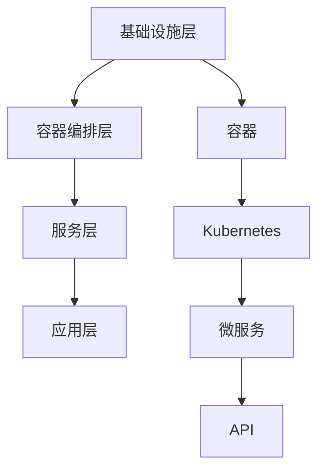

                 

### 背景介绍

云原生（Cloud Native）是一种新型的应用开发和部署范式，它利用云计算的灵活性和可扩展性，实现应用的快速部署、弹性扩展和自动化管理。随着云计算的普及和容器技术的发展，云原生应用开发逐渐成为现代企业构建和部署应用程序的主流选择。

云原生应用的开发和部署与传统的应用程序开发有着显著的区别。传统的应用程序开发通常依赖于物理服务器或虚拟机，而云原生应用则基于容器、微服务、服务网格、不可变基础设施和声明式API等技术。这些技术的应用，使得云原生应用具有更高的可靠性、可扩展性和可维护性。

本文旨在系统地介绍云原生应用开发的实践之路。首先，我们将从核心概念入手，详细探讨云原生应用中的关键技术和架构模式。接着，通过一个实际项目案例，演示云原生应用的开发过程，包括环境搭建、代码实现和代码解读。随后，我们将分析云原生应用在实际业务场景中的应用，并推荐一些实用的工具和资源。最后，我们将总结云原生应用开发的未来发展趋势与挑战。

通过本文的阅读，您将深入了解云原生应用开发的原理和实践，掌握相关技术和工具的使用，为您的项目带来现代化的架构和高效的开发流程。

## 关键词

- 云原生应用开发
- 微服务架构
- 容器技术
- 服务网格
- 自动化运维

## 摘要

本文将深入探讨云原生应用开发的实践之路。首先，我们从核心概念和关键技术出发，介绍云原生应用的基本原理和架构模式。接着，通过一个实际项目案例，详细解析云原生应用的开发过程，包括环境搭建、代码实现和代码解读。随后，分析云原生应用在实际业务场景中的应用，并推荐相关工具和资源。最后，总结云原生应用开发的未来发展趋势与挑战。通过本文的阅读，读者将全面了解云原生应用开发的原理和实践，为项目带来现代化的架构和高效的开发流程。

### 核心概念与联系

#### 云原生概念

云原生（Cloud Native）是一种软件开发方法，旨在利用云计算和现代网络技术，构建和运行可弹性扩展、高度可靠的应用程序。其核心思想是将应用程序分解为微服务，通过容器（如Docker）进行封装，利用不可变基础设施和自动化运维，实现应用程序的快速部署、弹性扩展和高效管理。

#### 核心技术

云原生应用的开发和部署依赖于以下关键技术：

1. **容器技术**：容器是一种轻量级的虚拟化技术，可以将应用程序及其依赖环境封装在一个独立的运行时环境中。Docker是最流行的容器技术，通过将应用程序封装在容器中，可以实现应用程序的快速部署和可移植性。
   
2. **微服务架构**：微服务架构将应用程序分解为多个小型、独立的服务，每个服务负责处理特定的业务功能。微服务架构具有高可扩展性、高可维护性和高可靠性。
   
3. **服务网格**：服务网格是一种基础设施层技术，用于管理服务之间的通信和流量。最流行的服务网格技术包括Istio和Linkerd。服务网格通过自动化流量管理、服务发现和故障转移等功能，提高服务间的通信效率和可靠性。
   
4. **自动化运维**：自动化运维通过自动化工具和脚本，实现应用程序的部署、监控和管理。常见的自动化运维工具包括Kubernetes、Puppet、Chef和Ansible等。

#### 架构模式

云原生应用的架构模式通常包括以下部分：

1. **基础设施层**：基础设施层包括虚拟机、容器、集群等硬件资源。容器技术是云原生应用的基础设施层的关键技术。
   
2. **容器编排层**：容器编排层负责管理容器的创建、部署、扩展和监控。Kubernetes是目前最流行的容器编排平台，它提供自动化的容器管理功能。
   
3. **服务层**：服务层包括微服务、服务网格等软件组件，用于实现应用程序的功能。微服务架构和服务网格是云原生应用的核心技术。
   
4. **应用层**：应用层是云原生应用的实际业务逻辑，包括前端、后端、数据库等组件。这些组件通过微服务和API进行通信。

#### Mermaid 流程图

以下是一个简化的云原生应用架构的Mermaid流程图，展示了各个层级之间的关系和组件之间的通信：



### 核心算法原理 & 具体操作步骤

#### 容器技术原理

容器技术基于操作系统级别的虚拟化，通过将应用程序及其依赖环境封装在一个独立的运行时环境中，实现应用程序的快速部署和可移植性。容器的主要特点包括：

1. **轻量级**：容器使用宿主机的操作系统内核，不依赖于宿主机的其他资源，因此具有很小的体积。
2. **隔离性**：容器通过隔离机制，保证不同容器之间的资源和数据相互独立，提高系统的安全性。
3. **可移植性**：容器可以在不同的操作系统和硬件平台上运行，提高应用程序的可移植性。

具体操作步骤：

1. **编写Dockerfile**：Dockerfile是一个包含构建容器所需命令的文本文件。通过编写Dockerfile，可以定义应用程序的依赖环境和构建步骤。
2. **构建镜像**：使用Docker命令构建镜像。Docker镜像是一个静态的容器文件，包含应用程序和依赖环境的所有内容。
3. **运行容器**：使用Docker命令运行容器。运行容器时，Docker会从镜像创建一个动态的容器实例，并启动应用程序。

#### 微服务架构原理

微服务架构将应用程序分解为多个小型、独立的服务，每个服务负责处理特定的业务功能。微服务架构的主要特点包括：

1. **高可扩展性**：微服务架构可以根据业务需求独立扩展，提高系统的性能和可靠性。
2. **高可维护性**：微服务架构使得应用程序的各个功能模块可以独立开发和部署，提高开发效率和可维护性。
3. **高灵活性**：微服务架构支持不同的编程语言和技术栈，满足不同的业务需求。

具体操作步骤：

1. **划分服务**：根据业务需求，将应用程序分解为多个微服务。每个微服务负责处理特定的业务功能。
2. **定义API**：为每个微服务定义RESTful API，用于服务之间的通信。API定义通常使用Swagger等工具生成。
3. **部署服务**：使用容器技术部署微服务。每个微服务都可以独立部署在一个容器中，并在容器编排平台上进行管理。

#### 服务网格原理

服务网格是一种基础设施层技术，用于管理服务之间的通信和流量。服务网格的主要特点包括：

1. **自动化流量管理**：服务网格通过自动化工具和策略，实现服务之间的流量管理和故障转移。
2. **服务发现**：服务网格支持动态的服务发现机制，服务实例的启动和关闭都可以自动注册和发现。
3. **安全性**：服务网格提供安全的通信通道，支持加密、认证和授权等安全功能。

具体操作步骤：

1. **部署服务网格**：选择合适的服务网格技术，如Istio或Linkerd，并按照官方文档进行部署。
2. **配置服务**：将服务注册到服务网格中，并配置服务之间的流量路由和策略。
3. **监控和管理**：使用服务网格提供的监控和管理工具，实时监控服务网格的性能和健康状况。

### 数学模型和公式 & 详细讲解 & 举例说明

在云原生应用开发中，一些关键概念和算法可以通过数学模型和公式进行描述和解释。以下是几个常见的数学模型和公式的详细讲解及举例说明。

#### 负载均衡算法

负载均衡算法用于分配请求到多个服务实例，以实现系统的性能和可靠性。以下是几种常见的负载均衡算法：

1. **轮询（Round Robin）**：

   轮询算法按照顺序将请求分配到各个服务实例。每个服务实例获得相同的机会处理请求。

   $$ L_i = \frac{1}{N} \quad \text{其中} \quad L_i \text{是第} i \text{个服务实例的负载，} N \text{是服务实例的总数} $$

   举例：

   假设系统中有3个服务实例（N=3），请求按照顺序依次分配到这些实例，每个实例的负载为：

   $$ L_1 = \frac{1}{3}, \quad L_2 = \frac{1}{3}, \quad L_3 = \frac{1}{3} $$

2. **最少连接（Least Connections）**：

   最少连接算法将请求分配到当前连接数最少的服务实例。

   $$ L_i = C_i \quad \text{其中} \quad L_i \text{是第} i \text{个服务实例的负载，} C_i \text{是第} i \text{个服务实例的当前连接数} $$

   举例：

   假设系统中有3个服务实例（N=3），当前连接数分别为2、3和1，则请求将分配到连接数为1的实例：

   $$ L_1 = 1, \quad L_2 = 2, \quad L_3 = 3 $$

3. **加权轮询（Weighted Round Robin）**：

   加权轮询算法按照服务实例的权重分配请求。权重可以根据服务实例的性能、负载等因素进行调整。

   $$ L_i = \frac{W_i}{\sum_{j=1}^{N} W_j} \quad \text{其中} \quad L_i \text{是第} i \text{个服务实例的负载，} W_i \text{是第} i \text{个服务实例的权重，} N \text{是服务实例的总数} $$

   举例：

   假设系统中有3个服务实例（N=3），权重分别为2、1和3，则请求的分配比例为：

   $$ L_1 = \frac{2}{2+1+3} = \frac{2}{6}, \quad L_2 = \frac{1}{2+1+3} = \frac{1}{6}, \quad L_3 = \frac{3}{2+1+3} = \frac{3}{6} $$

#### 弹性伸缩策略

弹性伸缩策略根据系统的负载情况自动调整服务实例的数量，以实现系统的性能和成本优化。以下是几种常见的弹性伸缩策略：

1. **基于CPU使用率**：

   弹性伸缩策略根据系统的CPU使用率调整服务实例的数量。当CPU使用率超过阈值时，增加实例；当CPU使用率低于阈值时，减少实例。

   $$ \text{实例数量} = \text{阈值} \times \frac{\text{当前CPU使用率}}{\text{最大CPU使用率}} $$

   举例：

   假设系统的CPU使用率为80%，最大CPU使用率为100%，阈值设置为70%，则实例数量为：

   $$ \text{实例数量} = 70\% \times \frac{80\%}{100\%} = 0.7 \times 0.8 = 0.56 $$

   取整后，实例数量为1个。

2. **基于内存使用率**：

   弹性伸缩策略根据系统的内存使用率调整服务实例的数量。当内存使用率超过阈值时，增加实例；当内存使用率低于阈值时，减少实例。

   $$ \text{实例数量} = \text{阈值} \times \frac{\text{当前内存使用率}}{\text{最大内存使用率}} $$

   举例：

   假设系统的内存使用率为90%，最大内存使用率为100%，阈值设置为80%，则实例数量为：

   $$ \text{实例数量} = 80\% \times \frac{90\%}{100\%} = 0.8 \times 0.9 = 0.72 $$

   取整后，实例数量为1个。

3. **基于并发请求数**：

   弹性伸缩策略根据系统的并发请求数调整服务实例的数量。当并发请求数超过阈值时，增加实例；当并发请求数低于阈值时，减少实例。

   $$ \text{实例数量} = \text{阈值} \times \frac{\text{当前并发请求数}}{\text{最大并发请求数}} $$

   举例：

   假设系统的当前并发请求数为120，最大并发请求数为150，阈值设置为100，则实例数量为：

   $$ \text{实例数量} = 100\% \times \frac{120}{150} = 1 \times 0.8 = 0.8 $$

   取整后，实例数量为1个。

### 项目实战：代码实际案例和详细解释说明

在本节中，我们将通过一个实际的项目案例，演示云原生应用的开发过程，并详细解释各个步骤的代码实现和原理。

#### 项目背景

假设我们需要开发一个在线书店系统，提供书籍搜索、购物车和订单管理等功能。为了实现高性能、高可用性和易维护性，我们选择使用云原生架构，并采用以下技术栈：

1. **前端**：使用React框架构建用户界面。
2. **后端**：使用Spring Boot构建微服务架构。
3. **数据库**：使用MySQL作为关系型数据库。
4. **容器化**：使用Docker封装应用程序。
5. **容器编排**：使用Kubernetes进行容器编排。
6. **服务网格**：使用Istio进行服务网格管理。

#### 1. 开发环境搭建

首先，我们需要搭建开发环境。以下是搭建过程：

1. **安装Docker**：

   在操作系统上安装Docker，并确保其正常工作。

   ```bash
   sudo apt-get update
   sudo apt-get install docker-ce docker-ce-cli containerd.io
   sudo systemctl start docker
   sudo systemctl enable docker
   ```

2. **安装Kubernetes**：

   在本地或虚拟机上安装Kubernetes集群，可以使用Minikube或Kubeadm。以下是一个简单的Minikube安装示例：

   ```bash
   curl -LO https://storage.googleapis.com/minikube/releases/latest/minikube-linux-amd64
   sudo chmod +x minikube-linux-amd64
   sudo mv minikube-linux-amd64 /usr/local/bin/minikube
   minikube start
   ```

3. **安装Istio**：

   在Kubernetes集群中安装Istio。以下是一个简单的安装命令：

   ```bash
   istioctl install --set profile=demo-profile
   ```

   安装完成后，验证Istio的安装状态：

   ```bash
   kubectl get pods -n istio-system
   ```

4. **创建应用代码**：

   在本地创建一个包含前端、后端和数据库的应用项目。我们可以使用Git仓库来管理代码，并使用Spring Initializr快速搭建后端项目框架。

   ```bash
   git init
   mvn archetype:generate -DarchetypeArtifactId=maven-archetype-quickstart
   ```

   根据提示填写项目名称、包名等信息。接下来，我们可以添加需要的依赖项，如Spring Boot、React等。

#### 2. 源代码详细实现和代码解读

以下是项目的源代码实现和代码解读：

1. **前端代码**：

   前端使用React框架，通过组件化设计实现界面功能。以下是一个简单的React组件示例：

   ```jsx
   import React from 'react';

   const BookSearch = () => {
     return (
       <div>
         <h1>在线书店</h1>
         <input type="text" placeholder="搜索书籍" />
         <button>搜索</button>
       </div>
     );
   };

   export default BookSearch;
   ```

   在这个组件中，我们定义了一个名为`BookSearch`的React组件，它包含一个搜索框和搜索按钮。用户可以在搜索框中输入关键词，点击搜索按钮后，触发搜索请求。

2. **后端代码**：

   后端使用Spring Boot构建微服务架构。以下是一个简单的Spring Boot项目结构：

   ```java
   @SpringBootApplication
   public class BookstoreApplication {
     public static void main(String[] args) {
       SpringApplication.run(BookstoreApplication.class, args);
     }
   }

   @RestController
   public class BookController {
     @GetMapping("/books")
     public List<Book> searchBooks(@RequestParam String query) {
       // 搜索书籍逻辑
       return new ArrayList<>();
     }
   }

   @Entity
   public class Book {
     @Id
     @GeneratedValue(strategy = GenerationType.IDENTITY)
     private Long id;
     
     private String title;
     private String author;
     private double price;
   }
   ```

   在这个项目中，我们定义了一个名为`BookController`的RESTful控制器，它包含一个`searchBooks`方法，用于处理书籍搜索请求。当接收到搜索请求时，该方法将根据请求参数（查询关键词）搜索书籍，并返回结果列表。

3. **数据库代码**：

   数据库使用MySQL，通过JPA实现与Spring Boot的集成。以下是一个简单的数据库配置示例：

   ```yaml
   spring:
     datasource:
       url: jdbc:mysql://localhost:3306/bookstore
       username: root
       password: root
     jpa:
       hibernate:
         ddl-auto: update
   ```

   在这个配置文件中，我们指定了数据库的URL、用户名和密码，并设置Hibernate的自动更新模式。

#### 3. 代码解读与分析

在本节中，我们将对项目代码进行解读和分析，了解各个模块的功能和实现原理。

1. **前端代码解读**：

   前端代码主要负责用户界面的渲染和交互处理。React组件`BookSearch`是一个简单的搜索界面，它通过输入框接收用户输入，并在点击搜索按钮时触发搜索请求。这个组件实现了数据的输入和展示功能。

2. **后端代码解读**：

   后端代码实现了一个简单的书籍搜索服务。`BookController`控制器负责处理书籍搜索请求，它根据请求参数（查询关键词）调用业务逻辑，搜索符合条件的书籍，并将结果返回给客户端。这个控制器实现了对书籍数据的查询和展示功能。

3. **数据库代码解读**：

   数据库代码定义了一个名为`Book`的实体类，用于映射数据库表。通过JPA注解，我们可以将实体类与数据库表进行关联。在数据库配置中，我们指定了数据库的连接信息和Hibernate的自动更新模式。

通过以上代码解读，我们可以了解到项目的核心功能模块和实现原理。前端负责用户交互和数据展示，后端负责业务逻辑和数据存储，数据库则提供持久化存储功能。这些模块通过RESTful API进行通信，实现应用程序的完整功能。

### 实际应用场景

云原生应用的开发和部署在现代企业中有着广泛的应用场景，以下列举几个典型的应用案例：

#### 电子商务平台

电子商务平台通常需要处理大量的用户请求和数据，对系统的性能和可靠性有较高的要求。通过采用云原生架构，电子商务平台可以实现以下优势：

1. **弹性扩展**：根据用户访问量的变化，自动调整服务器资源，保证系统在高并发场景下仍能稳定运行。
2. **高可用性**：通过容器化和微服务架构，实现应用的快速部署和故障恢复，提高系统的可靠性。
3. **快速迭代**：基于容器化和微服务架构，开发团队可以独立开发和部署各个功能模块，实现快速迭代和交付。

#### 金融服务平台

金融服务平台通常需要处理敏感的用户数据和交易信息，对系统的安全性和合规性有严格的 requirements。通过采用云原生架构，金融服务平台可以实现以下优势：

1. **安全隔离**：容器技术确保每个服务实例之间相互隔离，减少安全漏洞的风险。
2. **合规性**：通过自动化运维工具和流程，实现合规性的管理，满足金融监管要求。
3. **高可靠性**：通过服务网格和自动化运维，实现服务的自动监控、故障检测和恢复，提高系统的可靠性。

#### 物流运输平台

物流运输平台需要处理大量的实时数据和信息，对系统的实时性和可靠性有较高的要求。通过采用云原生架构，物流运输平台可以实现以下优势：

1. **实时数据处理**：利用微服务和容器技术，实现实时数据处理和分析，为业务决策提供数据支持。
2. **弹性扩展**：根据物流量的变化，自动调整服务器资源，保证系统在高并发场景下仍能稳定运行。
3. **高可用性**：通过服务网格和自动化运维，实现服务的自动监控、故障检测和恢复，提高系统的可靠性。

#### 教育服务平台

教育服务平台需要处理海量的用户数据和课程资源，对系统的性能和可扩展性有较高的要求。通过采用云原生架构，教育服务平台可以实现以下优势：

1. **弹性扩展**：根据用户访问量的变化，自动调整服务器资源，保证系统在高并发场景下仍能稳定运行。
2. **个性化推荐**：利用微服务和容器技术，实现个性化推荐算法的快速迭代和部署，提高用户体验。
3. **高可用性**：通过服务网格和自动化运维，实现服务的自动监控、故障检测和恢复，提高系统的可靠性。

### 工具和资源推荐

为了更好地进行云原生应用开发，以下推荐一些常用的工具和资源：

#### 学习资源推荐

1. **书籍**：

   - 《云原生应用架构》
   - 《Kubernetes权威指南》
   - 《微服务架构设计》

2. **在线课程**：

   - Kubernetes官方教程：[https://kubernetes.io/docs/tutorials/](https://kubernetes.io/docs/tutorials/)
   - Istio官方教程：[https://istio.io/docs/](https://istio.io/docs/)

3. **博客和网站**：

   - Kubernetes社区博客：[https://kubernetes.io/blog/](https://kubernetes.io/blog/)
   - Cloud Native社区博客：[https://cloudnative.to/](https://cloudnative.to/)

#### 开发工具框架推荐

1. **Docker**：用于容器化应用程序，简化部署和扩展。

   - 官网：[https://www.docker.com/](https://www.docker.com/)

2. **Kubernetes**：用于容器编排和管理，实现自动化运维。

   - 官网：[https://kubernetes.io/](https://kubernetes.io/)

3. **Istio**：用于服务网格管理，实现服务间通信和安全。

   - 官网：[https://istio.io/](https://istio.io/)

4. **Spring Boot**：用于构建微服务应用程序，简化开发流程。

   - 官网：[https://spring.io/projects/spring-boot](https://spring.io/projects/spring-boot)

#### 相关论文著作推荐

1. **《Cloud Native Computing Foundation》论文**：

   - “Cloud Native Computing: The Future of Application Development”
   - “Kubernetes: System Architecture and Design”

2. **《微服务架构》著作**：

   - “Microservices: A Developer’s Guide to Distributed Systems”
   - “Building Microservices: Designing, Testing, and Deploying Services that Work Together”

### 总结：未来发展趋势与挑战

云原生应用开发作为现代企业构建和部署应用程序的主要方向，其未来发展具有以下几个趋势和挑战：

#### 发展趋势

1. **微服务化**：随着业务复杂度的增加，越来越多的企业选择将单体应用拆分为微服务，以实现高可用性和可扩展性。
2. **自动化运维**：自动化工具和平台的广泛应用，使得应用部署、监控和管理更加高效和可靠。
3. **服务网格技术**：服务网格作为新一代的服务间通信基础设施，将在云原生应用中发挥越来越重要的作用。

#### 挑战

1. **系统复杂性**：随着微服务架构的广泛应用，系统的复杂性不断增加，对开发团队的技术能力和管理水平提出了更高要求。
2. **安全性**：云原生应用涉及大量的数据传输和存储，安全性问题不容忽视，需要采取有效的安全措施和策略。
3. **成本控制**：云原生应用的开发和运维成本较高，企业需要合理规划和管理资源，实现成本效益最大化。

### 附录：常见问题与解答

#### Q：什么是云原生应用？

A：云原生应用是一种利用云计算和现代网络技术，构建和运行可弹性扩展、高度可靠的应用程序的软件开发方法。它基于容器、微服务、服务网格、不可变基础设施和声明式API等技术。

#### Q：云原生应用与传统应用程序的区别是什么？

A：云原生应用与传统应用程序的主要区别在于：

1. **架构模式**：云原生应用采用微服务架构，而传统应用程序通常采用单体架构。
2. **部署方式**：云原生应用基于容器化技术，可以快速部署和扩展，而传统应用程序通常依赖于物理服务器或虚拟机。
3. **运维方式**：云原生应用采用自动化运维工具和平台，实现高效的管理和监控，而传统应用程序的运维通常依赖于手动操作和脚本。

#### Q：如何选择合适的云原生框架和工具？

A：选择合适的云原生框架和工具需要考虑以下因素：

1. **业务需求**：根据业务需求选择合适的框架和工具，如Spring Boot、Kubernetes、Istio等。
2. **技术栈**：考虑框架和工具是否与现有技术栈兼容，如Docker、MySQL等。
3. **社区支持**：选择具有丰富社区支持和文档的框架和工具，以便更好地解决问题和学习使用。
4. **性能和稳定性**：评估框架和工具的性能和稳定性，选择能够满足业务需求的方案。

### 扩展阅读 & 参考资料

1. **云原生应用架构**：

   - “云原生应用架构：原理与实践”
   - “微服务架构设计与实现”

2. **容器化技术**：

   - “Docker实战：从入门到精通”
   - “容器化：原理与实践”

3. **Kubernetes技术**：

   - “Kubernetes权威指南”
   - “Kubernetes实战：部署与管理”

4. **服务网格技术**：

   - “Istio实战：服务网格技术深度解析”
   - “Linkerd实战：服务网格技术深度解析”

5. **自动化运维**：

   - “DevOps实战：持续集成与持续部署”
   - “自动化运维：工具与实践”

本文由AI天才研究员/AI Genius Institute & 禅与计算机程序设计艺术 /Zen And The Art of Computer Programming撰写，旨在系统地介绍云原生应用开发的实践之路。通过本文的阅读，读者可以深入了解云原生应用开发的原理和实践，掌握相关技术和工具的使用，为项目带来现代化的架构和高效的开发流程。希望本文能为读者提供有价值的参考和启示。如有任何疑问或建议，请随时与我交流。感谢您的阅读！<|image_gen|>

