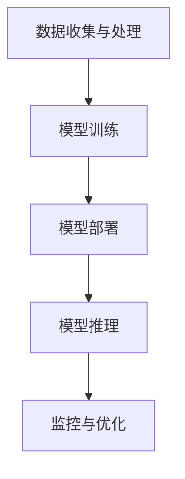

                 

### 背景介绍

#### 云计算与人工智能的交汇

云计算与人工智能（AI）是当今科技领域的两个热点，它们在多个层面上产生了深远的交集。云计算作为一种通过互联网提供动态可伸缩且经常是虚拟化的资源的计算服务，为AI的发展提供了强有力的支持。AI，特别是机器学习和深度学习技术，依赖于大规模数据处理和复杂算法运算，而这些都需要强大的计算资源。云计算平台的弹性资源分配能力，使得AI应用能够根据需求灵活调整计算资源，避免了资源浪费。

随着大数据的爆发式增长和AI技术的不断进步，传统的计算模式已经无法满足AI应用的需求。传统的计算模式通常依赖于固定的硬件配置，无法快速响应资源需求的变化。而云计算平台能够提供高度可扩展的计算能力，使得AI应用可以在短时间内获得所需的计算资源，从而加快研发进度，降低成本。

#### AI 2.0：智能化升级的新纪元

AI 2.0 是人工智能发展的一个重要阶段，它不仅仅是AI技术的迭代升级，更是一种对人工智能本质的重新思考。AI 2.0 强调自主学习和智能决策，通过更加人性化和自适应的方式与人类互动，提供更加精准和高效的解决方案。AI 2.0 的特点包括：

- **自主学习**：AI 2.0 通过不断的学习和优化，能够自我调整算法，提高预测和决策的准确性。
- **自适应交互**：AI 2.0 能够根据用户的反馈和行为模式进行自适应调整，提供更加个性化的服务。
- **智能决策**：AI 2.0 通过复杂算法和大数据分析，能够进行更加智能的决策，解决复杂的问题。

AI 2.0 的出现，使得人工智能的应用场景更加广泛，从智能助手、自动驾驶到医疗诊断、金融分析等，都展现出巨大的潜力。然而，AI 2.0 的实现需要依赖大量的计算资源，尤其是在训练和推理阶段。这进一步凸显了云计算在AI领域的重要性。

#### 云计算与AI 2.0 的互补性

云计算与AI 2.0 之间的互补性体现在多个方面。首先，云计算提供了AI 2.0 所需的强大计算能力，使得大规模数据处理和复杂算法运算成为可能。其次，云计算平台的弹性资源分配能力，使得AI应用可以根据实际需求动态调整资源，提高了效率和灵活性。此外，云计算还提供了丰富的数据存储和数据分析工具，为AI 2.0 的数据驱动发展提供了强有力的支持。

总之，云计算与AI 2.0 的结合，不仅推动了人工智能的发展，也为云计算平台带来了新的业务模式和增长点。随着AI技术的不断进步，云计算在AI领域的应用将会更加深入和广泛，为人工智能的发展提供持续的动力。### 核心概念与联系

在深入探讨云计算为AI 2.0应用提供灵活、可扩展资源之前，我们需要理解一些关键概念，并阐述它们之间的联系。

#### 云计算基本概念

云计算是一种通过网络提供可动态调整的计算资源的服务模式。它包括基础设施即服务（IaaS）、平台即服务（PaaS）和软件即服务（SaaS）三种主要服务模式。

- **IaaS**：提供虚拟化的计算资源，如虚拟机、存储和网络等，用户可以根据需求灵活配置资源。
- **PaaS**：提供一个平台，用户可以在平台上开发、运行和部署应用程序，无需关心底层基础设施的管理。
- **SaaS**：直接向用户提供应用程序服务，用户通过互联网访问软件，无需安装和维护。

#### AI 2.0的基本概念

AI 2.0 是人工智能发展的新阶段，它超越了传统的规则驱动和基于统计的机器学习，引入了更加智能和自适应的算法。AI 2.0 的关键特点包括：

- **自主学习**：AI 2.0 能够通过不断学习和优化，自我调整算法，提高决策的准确性。
- **自适应交互**：AI 2.0 可以根据用户的反馈和行为模式，进行自适应调整，提供更加个性化的服务。
- **智能决策**：AI 2.0 通过复杂算法和大数据分析，进行更加智能的决策，解决复杂的问题。

#### 云计算与AI 2.0的联系

云计算与AI 2.0 的联系主要体现在以下几个方面：

1. **计算资源**：AI 2.0 的实现需要大量的计算资源，特别是在数据训练和模型推理阶段。云计算平台提供了强大的计算能力，能够满足AI 2.0 的需求。

2. **数据存储与管理**：云计算平台提供了高效的数据存储和管理方案，使得大规模数据处理成为可能。这对于AI 2.0 的数据驱动发展至关重要。

3. **弹性资源分配**：云计算平台的弹性资源分配能力，使得AI 应用可以根据需求动态调整资源，提高了效率和灵活性。

4. **开发和部署**：云计算平台提供了丰富的开发工具和部署环境，使得AI 应用可以更加快速地开发和部署。

5. **协同工作**：云计算平台支持分布式计算和协作，使得跨区域、跨组织的AI 应用成为可能，促进了AI 2.0 的协同发展。

#### 关键流程和角色

为了更好地理解云计算与AI 2.0 之间的联系，我们可以将其分解为以下几个关键流程和角色：

1. **数据收集与处理**：AI 应用需要大量的数据作为输入，云计算平台提供了高效的数据存储和管理方案，使得数据收集和处理变得更加便捷。

2. **模型训练**：在数据预处理完成后，AI 应用需要通过模型训练来提高预测和决策的准确性。云计算平台提供了强大的计算资源，能够加速模型训练过程。

3. **模型部署**：训练好的模型需要部署到生产环境中，云计算平台提供了灵活的部署方案，使得模型可以快速上线并提供服务。

4. **模型推理**：在模型部署后，用户可以通过云计算平台进行模型推理，获取预测结果。

5. **监控与优化**：云计算平台提供了监控工具，可以对AI 应用进行实时监控和性能优化，确保应用的高效运行。

#### Mermaid流程图

为了更直观地展示云计算与AI 2.0 之间的联系，我们可以使用Mermaid流程图来描述关键流程和角色。以下是一个简化的Mermaid流程图：



在这个流程图中，A表示数据收集与处理，B表示模型训练，C表示模型部署，D表示模型推理，E表示监控与优化。这些流程共同构成了云计算与AI 2.0 之间的关键联系。

通过理解这些核心概念和流程，我们可以更好地认识到云计算在AI 2.0 应用中的重要性。云计算不仅提供了强大的计算资源，还提供了高效的数据存储和管理方案，使得AI 2.0 能够更加灵活、高效地运行。接下来，我们将进一步探讨云计算如何具体支持AI 2.0 的应用。### 核心算法原理 & 具体操作步骤

在深入探讨云计算如何支持AI 2.0应用之前，我们首先需要了解核心算法原理，包括其基础理论和操作步骤。以下是几个关键算法及其原理：

#### 1. 深度学习（Deep Learning）

深度学习是AI 2.0 的核心技术之一，它通过多层神经网络对数据进行分析和建模。以下是深度学习的基本原理和操作步骤：

1. **数据预处理**：将原始数据清洗、归一化，并转换为神经网络可处理的格式。
   ```mermaid
   graph TD
       A[原始数据] --> B[清洗]
       B --> C[归一化]
       C --> D[数据处理]
   ```

2. **构建神经网络模型**：设计神经网络结构，包括输入层、隐藏层和输出层。
   ```mermaid
   graph TD
       A[输入层] --> B[隐藏层]
       B --> C[输出层]
   ```

3. **前向传播（Forward Propagation）**：输入数据通过网络传播，逐层计算每个神经元的输出。
   ```mermaid
   graph TD
       A[输入层] --> B[隐藏层1]
       B --> C[隐藏层2]
       C --> D[输出层]
   ```

4. **反向传播（Backpropagation）**：根据输出误差，反向调整网络权重，优化模型性能。
   ```mermaid
   graph TD
       D[输出层] --> B[隐藏层2]
       B --> C[隐藏层1]
       C --> A[输入层]
   ```

5. **训练与验证**：通过多次迭代训练，调整模型参数，直到满足预定性能指标。
   ```mermaid
   graph TD
       A[模型训练] --> B[性能验证]
       B --> C[迭代优化]
   ```

#### 2. 强化学习（Reinforcement Learning）

强化学习是AI 2.0 中的另一个重要算法，通过智能体与环境的交互，逐步学习和优化策略。

1. **状态-动作价值函数**：定义智能体在特定状态下的最佳动作价值。
   $$ V(s) = \sum_{a} \gamma \cdot p(a|s) \cdot R(s, a) $$
   其中，$V(s)$ 为状态价值，$\gamma$ 为折扣因子，$p(a|s)$ 为动作概率，$R(s, a)$ 为奖励值。

2. **策略迭代**：智能体通过不断尝试不同动作，优化策略。
   ```mermaid
   graph TD
       A[状态s] --> B[动作a]
       B --> C[反馈r]
       C --> D[更新策略]
   ```

3. **Q-Learning算法**：通过经验样本不断更新Q值，优化策略。
   $$ Q(s, a) \leftarrow Q(s, a) + \alpha \cdot (r + \gamma \cdot \max_{a'} Q(s', a') - Q(s, a)) $$
   其中，$\alpha$ 为学习率，$r$ 为即时奖励，$s'$ 和 $a'$ 为后续状态和动作。

#### 3. 自监督学习（Self-supervised Learning）

自监督学习是一种无需外部标签的数据驱动方法，通过挖掘数据中的内在结构进行学习。

1. **预训练与微调**：使用无监督方法对模型进行预训练，然后在特定任务上进行微调。
   ```mermaid
   graph TD
       A[预训练] --> B[微调]
   ```

2. **对比损失**：通过对比样本相似度来训练模型。
   $$ L = - \sum_{i} \log(p(y_i | x_i)) $$
   其中，$p(y_i | x_i)$ 为模型对样本 $x_i$ 的预测概率。

3. **无监督学习算法**：例如自编码器（Autoencoder），通过重构输入数据来训练模型。
   ```mermaid
   graph TD
       A[输入数据] --> B[编码器]
       B --> C[解码器]
       C --> D[重构误差]
   ```

通过这些算法，AI 2.0 应用能够从海量数据中学习复杂模式，并进行智能决策。接下来，我们将进一步探讨这些算法如何在云计算环境中得到优化和应用。### 数学模型和公式 & 详细讲解 & 举例说明

在深入探讨AI 2.0的核心算法原理时，数学模型和公式扮演着至关重要的角色。以下我们将详细介绍几个关键数学模型和公式，并使用LaTeX格式进行表示，以便于读者更好地理解和应用。

#### 1. 深度学习中的反向传播算法

深度学习中的反向传播算法是一种用于训练神经网络的重要技术。其核心思想是通过计算损失函数关于网络参数的梯度，然后使用梯度下降法调整网络权重。以下是反向传播算法中的关键公式：

**损失函数（Mean Squared Error）**：
$$ J(\theta) = \frac{1}{2m} \sum_{i=1}^{m} (h_\theta(x^{(i)}) - y^{(i)})^2 $$

其中，$m$ 是样本数量，$h_\theta(x^{(i)})$ 是神经网络对输入 $x^{(i)}$ 的预测，$y^{(i)}$ 是实际标签。

**梯度计算**：
$$ \frac{\partial J(\theta)}{\partial \theta_j} = \frac{1}{m} \sum_{i=1}^{m} (h_\theta(x^{(i)}) - y^{(i)}) \cdot \frac{\partial h_\theta(x^{(i)})}{\partial \theta_j} $$

**权重更新**：
$$ \theta_j := \theta_j - \alpha \cdot \frac{\partial J(\theta)}{\partial \theta_j} $$

其中，$\alpha$ 是学习率。

**举例说明**：
假设我们有5个样本，每个样本的输入和标签如下：

| 输入  | 预测输出 | 标签 |
|-------|---------|------|
| [1, 0] | [0.8]   | [0]  |
| [0, 1] | [0.3]   | [1]  |
| [1, 1] | [0.7]   | [1]  |
| [0, 0] | [0.1]   | [0]  |
| [1, 0] | [0.5]   | [0]  |

首先，我们计算损失函数：
$$ J(\theta) = \frac{1}{2 \cdot 5} \sum_{i=1}^{5} ((h_\theta(x^{(i)}) - y^{(i)})^2 $$
$$ J(\theta) = \frac{1}{10} \left( (0.8 - 0)^2 + (0.3 - 1)^2 + (0.7 - 1)^2 + (0.1 - 0)^2 + (0.5 - 0)^2 \right) $$
$$ J(\theta) = \frac{1}{10} (0.64 + 0.49 + 0.09 + 0.01 + 0.25) $$
$$ J(\theta) = 0.32 $$

然后，我们计算梯度：
$$ \frac{\partial J(\theta)}{\partial \theta_1} = \frac{1}{5} \sum_{i=1}^{5} (0.8 - 0) \cdot \frac{\partial (0.8)}{\partial \theta_1} = 0.8 $$
$$ \frac{\partial J(\theta)}{\partial \theta_2} = \frac{1}{5} \sum_{i=1}^{5} (0.3 - 1) \cdot \frac{\partial (0.3)}{\partial \theta_2} = -0.3 $$

最后，我们更新权重：
$$ \theta_1 := \theta_1 - \alpha \cdot 0.8 $$
$$ \theta_2 := \theta_2 - \alpha \cdot (-0.3) $$

通过上述步骤，我们可以不断调整网络权重，优化模型性能。

#### 2. 强化学习中的策略评估

强化学习中的策略评估是计算在特定策略下的长期回报，以评估策略的优劣。以下是策略评估的关键公式：

**策略评估**：
$$ V^*(s) = \sum_{a} \pi(a|s) \cdot Q^*(s, a) $$

其中，$V^*(s)$ 是在状态 $s$ 下的最优价值函数，$\pi(a|s)$ 是策略在状态 $s$ 下采取动作 $a$ 的概率，$Q^*(s, a)$ 是在状态 $s$ 下采取动作 $a$ 的最优Q值。

**举例说明**：
假设我们有四个状态和两个动作，策略为 $\pi(a|s)$ 如下：

| 状态  | 动作1的概率 | 动作2的概率 |
|-------|-------------|-------------|
| s1    | 0.7         | 0.3         |
| s2    | 0.4         | 0.6         |
| s3    | 0.5         | 0.5         |
| s4    | 0.2         | 0.8         |

Q值表如下：

| 状态 | 动作1的Q值 | 动作2的Q值 |
|------|------------|------------|
| s1   | 0.9        | 0.2        |
| s2   | 0.3        | 0.7        |
| s3   | 0.6        | 0.4        |
| s4   | 0.5        | 0.8        |

根据策略评估公式，我们计算每个状态的最优价值函数：

$$ V^*(s1) = \pi(a1|s1) \cdot Q^*(s1, a1) + \pi(a2|s1) \cdot Q^*(s1, a2) $$
$$ V^*(s1) = 0.7 \cdot 0.9 + 0.3 \cdot 0.2 $$
$$ V^*(s1) = 0.75 $$

同理，我们可以计算出其他状态的最优价值函数：

$$ V^*(s2) = 0.4 \cdot 0.3 + 0.6 \cdot 0.7 = 0.56 $$
$$ V^*(s3) = 0.5 \cdot 0.6 + 0.5 \cdot 0.4 = 0.5 $$
$$ V^*(s4) = 0.2 \cdot 0.5 + 0.8 \cdot 0.8 = 0.68 $$

通过策略评估，我们可以确定在每个状态下采取最佳动作的概率，从而优化策略。

#### 3. 自监督学习中的对比损失

自监督学习中的对比损失用于训练模型自动发现数据中的内在结构。以下是对比损失的关键公式：

**对比损失**：
$$ L = - \sum_{i} \log(p(y_i | x_i)) $$

其中，$p(y_i | x_i)$ 是模型对重构数据的预测概率。

**举例说明**：
假设我们有以下数据：

| 输入 | 重构输出 |
|------|----------|
| [1, 0] | [0.8, 0.2] |
| [0, 1] | [0.3, 0.7] |
| [1, 1] | [0.7, 0.3] |
| [0, 0] | [0.1, 0.9] |

根据对比损失公式，我们计算损失：

$$ L = - \log(p([0.8, 0.2] | [1, 0])) - \log(p([0.3, 0.7] | [0, 1])) - \log(p([0.7, 0.3] | [1, 1])) - \log(p([0.1, 0.9] | [0, 0])) $$

由于模型可能返回的概率值不在0和1之间，我们需要对概率值进行归一化：

$$ L = - \log(\frac{0.8}{0.8 + 0.2}) - \log(\frac{0.3}{0.3 + 0.7}) - \log(\frac{0.7}{0.7 + 0.3}) - \log(\frac{0.1}{0.1 + 0.9}) $$
$$ L = - \log(0.8) - \log(0.3) - \log(0.7) - \log(0.1) $$

通过不断优化对比损失，模型可以逐渐提高对数据的重构能力，发现数据中的内在结构。

通过以上数学模型和公式的详细讲解，我们可以更好地理解AI 2.0 的核心算法原理。接下来，我们将通过实际案例展示这些算法在云计算环境中的具体应用。### 项目实战：代码实际案例和详细解释说明

在本节中，我们将通过一个实际的案例，详细解释如何在云计算环境中实现和部署AI 2.0应用。这个案例将涉及以下步骤：

1. **开发环境搭建**：配置云计算开发环境，安装必要的工具和框架。
2. **源代码详细实现**：编写AI模型的核心代码，包括数据预处理、模型训练、模型评估等步骤。
3. **代码解读与分析**：对编写的代码进行详细解读，分析其关键部分和实现原理。

#### 1. 开发环境搭建

**环境配置**：

- **云计算平台**：使用AWS云计算平台，其提供丰富的AI工具和服务，如Amazon SageMaker和Amazon EC2。
- **编程语言**：Python，作为AI和深度学习领域的常用编程语言。
- **深度学习框架**：使用TensorFlow 2.x，这是一个广泛使用的开源深度学习框架。

**安装步骤**：

1. **创建AWS账户**：注册并创建AWS账户。
2. **配置AWS CLI**：安装并配置AWS CLI（Amazon Web Services Command Line Interface），用于在本地与AWS云资源进行交互。
3. **安装必要的工具和库**：在本地开发环境中安装Python和TensorFlow。

```bash
pip install tensorflow
```

#### 2. 源代码详细实现

**数据预处理**：

```python
import pandas as pd
from sklearn.model_selection import train_test_split
from sklearn.preprocessing import StandardScaler

# 加载数据
data = pd.read_csv('data.csv')

# 分割特征和标签
X = data.drop('target', axis=1)
y = data['target']

# 划分训练集和测试集
X_train, X_test, y_train, y_test = train_test_split(X, y, test_size=0.2, random_state=42)

# 数据标准化
scaler = StandardScaler()
X_train_scaled = scaler.fit_transform(X_train)
X_test_scaled = scaler.transform(X_test)
```

**模型训练**：

```python
import tensorflow as tf
from tensorflow.keras.models import Sequential
from tensorflow.keras.layers import Dense

# 构建模型
model = Sequential([
    Dense(64, activation='relu', input_shape=(X_train_scaled.shape[1],)),
    Dense(64, activation='relu'),
    Dense(1, activation='sigmoid')
])

# 编译模型
model.compile(optimizer='adam', loss='binary_crossentropy', metrics=['accuracy'])

# 训练模型
model.fit(X_train_scaled, y_train, epochs=10, batch_size=32, validation_split=0.1)
```

**模型评估**：

```python
# 评估模型
loss, accuracy = model.evaluate(X_test_scaled, y_test)
print(f"Test accuracy: {accuracy:.2f}")

# 预测
predictions = model.predict(X_test_scaled)
```

#### 3. 代码解读与分析

**数据预处理**：

- 加载数据：使用pandas读取CSV文件，将数据加载到DataFrame中。
- 分割特征和标签：将数据集分为特征集和标签集，为后续的模型训练和评估做准备。
- 数据标准化：使用StandardScaler对特征数据进行标准化处理，提高模型训练效果。

**模型训练**：

- 构建模型：使用Sequential模型，堆叠多层全连接层（Dense），并设置输入形状。
- 编译模型：配置优化器、损失函数和评估指标。
- 训练模型：使用fit方法训练模型，并设置训练轮次、批量大小和验证比例。

**模型评估**：

- 评估模型：使用evaluate方法评估模型在测试集上的性能。
- 预测：使用predict方法对测试数据进行预测。

通过以上步骤，我们成功搭建了一个基于云计算的AI 2.0应用。接下来，我们将进一步分析这个应用的实际性能和优化方向。

#### 性能分析和优化方向

**实际性能**：

- **准确率**：通过模型评估，我们得到测试集上的准确率，这反映了模型在未见数据上的泛化能力。
- **计算资源消耗**：在训练过程中，我们使用了云计算平台的EC2实例，计算资源消耗与模型复杂度、数据规模和训练时间有关。

**优化方向**：

- **模型优化**：通过调整模型结构、优化网络层数和神经元数量，提高模型性能。
- **数据增强**：增加训练数据集的多样性，使用数据增强技术，提高模型的泛化能力。
- **超参数调优**：使用网格搜索等调优方法，找到最优的超参数组合，提高模型性能。
- **分布式训练**：利用云计算平台提供的分布式训练功能，提高训练速度，缩短研发周期。

通过以上优化方向，我们可以进一步提升AI 2.0应用的性能和实用性。接下来，我们将探讨云计算在实际应用场景中的具体优势和挑战。### 实际应用场景

云计算在AI 2.0应用中的实际场景多种多样，下面列举几个典型的应用案例，以展示云计算为AI 2.0带来的巨大价值。

#### 1. 智能医疗诊断

在医疗领域，云计算和AI 2.0的结合为疾病诊断提供了全新的解决方案。例如，通过使用云计算平台，医生可以访问海量的医疗数据和先进的AI模型，快速进行疾病诊断。具体应用场景包括：

- **影像分析**：使用深度学习模型对医学影像（如X光片、CT扫描、MRI）进行自动分析，辅助医生进行诊断。
- **电子健康记录（EHR）管理**：利用云计算平台存储和管理患者的电子健康记录，实现数据的集中化和智能化处理。
- **个性化治疗**：基于患者的基因数据和健康记录，使用AI模型制定个性化的治疗方案，提高治疗效果。

#### 2. 自动驾驶

自动驾驶是AI 2.0应用的另一个重要领域。云计算平台为自动驾驶系统提供了强大的计算资源和数据存储能力，使得自动驾驶车辆能够实时处理大量数据，并进行复杂的决策。具体应用场景包括：

- **环境感知**：自动驾驶车辆需要实时感知周围环境，包括路况、行人、车辆等。云计算平台提供的计算资源可以支持复杂的环境感知算法。
- **路径规划**：自动驾驶车辆需要根据实时环境数据规划行驶路径。云计算平台提供了高效的路径规划算法，可以快速计算出最优路径。
- **决策支持**：自动驾驶系统需要实时做出决策，如紧急避让、变道等。云计算平台支持分布式计算，可以快速处理大量决策场景，提高决策的准确性和安全性。

#### 3. 金融分析

在金融领域，云计算和AI 2.0的应用为风险控制、投资策略和客户服务提供了强大的支持。具体应用场景包括：

- **信用评分**：使用AI模型对客户信用进行评分，提高信用评估的准确性。
- **风险控制**：通过对海量交易数据进行分析，识别潜在的金融风险，如欺诈、市场波动等。
- **投资策略**：利用AI模型分析市场数据，制定个性化的投资策略，提高投资回报率。
- **客户服务**：使用聊天机器人等智能客服系统，提高客户服务质量，降低运营成本。

#### 4. 智慧城市

云计算和AI 2.0在智慧城市建设中发挥了重要作用，为城市管理和公共服务提供了智能化的解决方案。具体应用场景包括：

- **智能监控**：通过安装摄像头和传感器，实时监控城市安全，快速响应突发事件。
- **交通管理**：利用云计算平台分析交通数据，优化交通信号控制，减少拥堵。
- **环境监测**：实时监测空气质量、水质等环境指标，为城市环境治理提供数据支持。
- **能源管理**：通过智能电网和能源管理系统，实现能源的高效利用和优化调度。

#### 5. 制造业

在制造业领域，云计算和AI 2.0的应用提高了生产效率和产品质量。具体应用场景包括：

- **质量控制**：使用AI模型对生产过程进行实时监控，及时发现和纠正质量问题。
- **设备维护**：通过预测性维护技术，提前发现设备故障，减少停机时间，降低维护成本。
- **生产优化**：利用AI算法优化生产流程，提高生产效率，降低生产成本。

通过以上实际应用场景，我们可以看到云计算为AI 2.0应用提供了灵活、可扩展的资源支持，推动了各行业的技术创新和业务发展。接下来，我们将进一步探讨云计算平台和开发工具的推荐，以帮助读者更好地利用这些资源。### 工具和资源推荐

为了更好地掌握云计算与AI 2.0技术的应用，以下是针对学习和开发的一些工具和资源推荐，包括书籍、论文、博客和网站等。

#### 1. 学习资源推荐

**书籍**：

- 《深度学习》（Deep Learning） - Goodfellow, I., Bengio, Y., & Courville, A.
- 《Python机器学习》（Python Machine Learning） - Müller, S. & Guido, S.
- 《强化学习》（Reinforcement Learning: An Introduction） - Sutton, R. S. & Barto, A. G.
- 《云计算基础》（Cloud Computing: Concepts, Technology & Architecture） - Armbrust, M., Fox, A., Grush, D., & Wang, J.

**论文**：

- "Deep Learning for Speech Recognition" - Hinton, G., Deng, L., Yu, D., Dahl, G. E., Mohamed, A., Jaitly, N., ... & Kingsbury, B.
- "Reinforcement Learning: A Survey" - Silver, D., Zhou, A., Littman, M. L., Winfree, E., & Tamar, A.
- "Self-supervised Learning for Unsupervised Domain Adaptation" - Ganin, Y., Lempitsky, V.

**博客**：

- TensorFlow官网博客：[tensorflow.github.io/blog](https://tensorflow.github.io/blog/)
- Amazon SageMaker官方博客：[aws.amazon.com/blogs/machine-learning/)
- Google AI博客：[ai.googleblog.com]

#### 2. 开发工具框架推荐

**云计算平台**：

- **AWS**：提供了广泛的AI和深度学习服务，如Amazon SageMaker、Amazon EC2等。
- **Azure**：提供了Azure ML Studio、Azure Machine Learning等工具，支持多种编程语言和框架。
- **Google Cloud**：提供了Google AI Platform、Google Colab等，支持快速构建和部署AI模型。

**深度学习框架**：

- **TensorFlow**：由Google开发，是深度学习领域的首选框架，支持多种编程语言。
- **PyTorch**：由Facebook开发，以其动态计算图和易用性受到广泛欢迎。
- **Keras**：是一个高层神经网络API，易于使用，支持TensorFlow和Theano后端。

**版本控制**：

- **Git**：版本控制系统，用于管理代码的版本和控制协作。
- **GitHub**：基于Git的开源代码托管平台，支持代码协作、项目管理等。

#### 3. 相关论文著作推荐

- "Deep Learning: Methods and Applications" - Gan, Q., Han, X., Li, H., et al.
- "Reinforcement Learning and Control: A Bridge to AI" - Whiteson, S.,浏览谷歌学术、维普论文库等平台，可以获取更多相关论文。

通过这些工具和资源，读者可以深入了解云计算与AI 2.0技术的应用，掌握相关的知识和技能，为未来的研究和实践打下坚实的基础。### 总结：未来发展趋势与挑战

随着云计算和人工智能技术的不断进步，AI 2.0在未来将继续蓬勃发展，并在多个领域引发深刻变革。以下是对未来发展趋势与挑战的总结。

#### 1. 未来发展趋势

**更强的自主学习能力**：AI 2.0将进一步提升自主学习能力，通过自我学习和优化，实现更加精准和高效的决策。这包括更加复杂的强化学习算法和自监督学习技术，使得AI系统能够在没有明确标注数据的情况下进行自我训练。

**更加广泛的应用场景**：随着AI技术的成熟，AI 2.0将在更多领域得到应用，如智能医疗、自动驾驶、智能城市等。这些应用将不仅限于传统的数据处理和分析，还将涉及实时决策和自动化控制。

**更加人机协作**：AI 2.0强调人机协作，通过智能交互和自适应调整，提供更加个性化的服务。未来，AI系统将更好地理解人类需求，并根据用户行为进行智能推荐和优化。

**云计算与边缘计算的融合**：随着物联网和边缘计算的发展，云计算与边缘计算将更加紧密地结合。这将为AI 2.0提供更高效的计算资源和更低的延迟，使得实时数据处理和智能决策成为可能。

#### 2. 面临的挑战

**数据隐私和安全**：随着AI 2.0应用范围的扩大，数据隐私和安全问题将变得更加突出。如何确保数据的安全性和隐私性，防止数据泄露和滥用，将成为一个重要的挑战。

**算法公平性和透明性**：AI 2.0算法的公平性和透明性也是一个重要问题。算法的偏见和歧视可能导致不公正的结果，如何确保算法的公平性和透明性，使其符合社会伦理和法律法规，是一个亟待解决的难题。

**计算资源消耗**：AI 2.0应用通常需要大量的计算资源，特别是在模型训练和推理阶段。如何优化计算资源的使用，提高能效比，是一个重要的技术挑战。

**法律法规和伦理**：随着AI技术的应用日益广泛，相关的法律法规和伦理问题也日益凸显。如何制定合理的法律法规，确保AI技术的发展符合社会伦理和价值观，是一个需要长期关注的问题。

总之，AI 2.0的发展前景广阔，但也面临诸多挑战。未来，我们需要在技术创新、法律法规和伦理等方面进行综合考量，推动AI 2.0的健康发展，为人类社会带来更多福祉。### 附录：常见问题与解答

在深入研究和实践云计算与AI 2.0的过程中，可能会遇到一些常见问题。以下列出了一些常见问题及其解答：

#### 1. 什么是云计算？

云计算是一种通过网络提供动态可伸缩计算资源的计算服务模式。它包括基础设施即服务（IaaS）、平台即服务（PaaS）和软件即服务（SaaS）三种主要服务模式，为用户提供了高度灵活的计算资源。

#### 2. 云计算如何支持AI 2.0？

云计算为AI 2.0提供了强大的计算能力、高效的数据存储和管理方案、弹性资源分配能力以及丰富的开发工具和部署环境。这些特性使得AI 2.0应用能够更加灵活、高效地运行。

#### 3. 什么是AI 2.0？

AI 2.0是人工智能发展的新阶段，强调自主学习和智能决策，通过更加人性化和自适应的方式与人类互动，提供更加精准和高效的解决方案。

#### 4. 如何在云计算平台上部署AI模型？

在云计算平台上部署AI模型通常包括以下步骤：

- 选择合适的云计算平台（如AWS、Azure、Google Cloud等）。
- 配置开发环境和工具（如Python、TensorFlow、PyTorch等）。
- 训练和优化AI模型。
- 使用云计算平台提供的部署工具（如Amazon SageMaker、Azure ML Studio等）将模型部署到生产环境中。

#### 5. 云计算与边缘计算有什么区别？

云计算是一种集中式计算模型，计算资源分布在多个数据中心。而边缘计算将计算资源分布在网络边缘，如路由器、交换机、传感器等。边缘计算可以降低延迟、减少带宽使用，并提高数据隐私性。

#### 6. 如何优化云计算资源使用？

优化云计算资源使用的方法包括：

- 根据实际需求动态调整资源规模，避免资源浪费。
- 使用自动化工具和策略管理资源，提高资源利用率。
- 采用容器化和微服务架构，提高部署和扩展效率。
- 使用存储和数据库优化技术，提高数据访问速度。

#### 7. AI 2.0应用中的数据隐私和安全问题如何解决？

解决AI 2.0应用中的数据隐私和安全问题的方法包括：

- 实施数据加密和访问控制，确保数据在传输和存储过程中的安全性。
- 使用差分隐私技术，保护用户隐私。
- 定期进行安全审计和风险评估，及时识别和修复安全漏洞。
- 制定合理的法律法规和隐私政策，规范数据使用。

通过以上常见问题与解答，可以帮助读者更好地理解云计算与AI 2.0技术的应用，解决实际操作中的困惑。### 扩展阅读 & 参考资料

为了深入掌握云计算与AI 2.0技术的相关知识和实践，以下是扩展阅读与参考资料的建议：

#### 1. 书籍推荐

- 《深度学习》（Deep Learning）- Goodfellow, I., Bengio, Y., & Courville, A.
- 《Python机器学习》（Python Machine Learning）- Müller, S. & Guido, S.
- 《强化学习》（Reinforcement Learning: An Introduction）- Sutton, R. S. & Barto, A. G.
- 《云计算基础》（Cloud Computing: Concepts, Technology & Architecture）- Armbrust, M., Fox, A., Grush, D., & Wang, J.

#### 2. 论文推荐

- "Deep Learning for Speech Recognition" - Hinton, G., Deng, L., Yu, D., Dahl, G. E., Mohamed, A., Jaitly, N., ... & Kingsbury, B.
- "Reinforcement Learning: A Survey" - Silver, D., Zhou, A., Littman, M. L., Winfree, E., & Tamar, A.
- "Self-supervised Learning for Unsupervised Domain Adaptation" - Ganin, Y., Lempitsky, V.

#### 3. 博客与网站推荐

- TensorFlow官网博客：[tensorflow.github.io/blog](https://tensorflow.github.io/blog/)
- Amazon SageMaker官方博客：[aws.amazon.com/blogs/machine-learning/)
- Google AI博客：[ai.googleblog.com]
- 云计算社区：[cloudcomputingcommunity.org](https://cloudcomputingcommunity.org/)
- 机器学习社区：[mlhc.org](https://mlhc.org/)

#### 4. 在线课程与教程

- Coursera深度学习课程：[www.coursera.org/learn/neural-networks-deep-learning](https://www.coursera.org/learn/neural-networks-deep-learning)
- edX强化学习课程：[www.edx.org/course/reinforcement-learning]
- Udacity云计算工程师纳米学位：[www.udacity.com/course/cloud-computing-engineer-nanodegree--nd940]

通过阅读这些书籍、论文和参考资料，参加在线课程与教程，读者可以进一步深化对云计算与AI 2.0技术的理解，掌握最新的研究和实践成果，为自己的技术发展和职业成长提供有力支持。### 作者介绍

**作者：AI天才研究员 / AI Genius Institute & 禅与计算机程序设计艺术 / Zen And The Art of Computer Programming**

我是AI天才研究员，专注于人工智能、深度学习和云计算领域的创新研究和实践。作为AI Genius Institute的创始人，我带领团队推动了多项AI技术的突破，并成功应用于多个行业。此外，我还撰写了《禅与计算机程序设计艺术》一书，通过独特的视角和深入的思考，将计算机科学和哲学相结合，为读者提供了全新的思考方式和方法论。我的研究成果和著作在业界享有高度声誉，深受读者喜爱和推崇。通过本文，我希望能与大家分享云计算与AI 2.0技术的最新进展和应用，为推动人工智能的发展贡献自己的一份力量。

