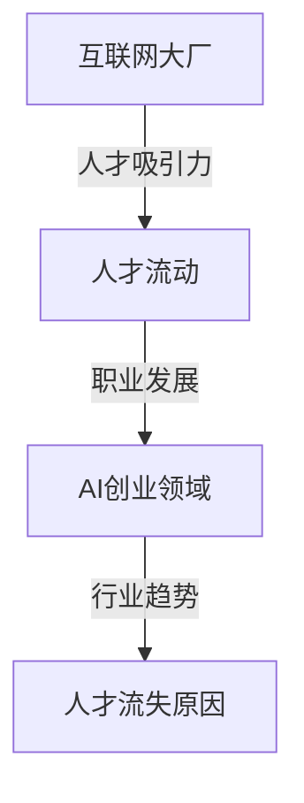
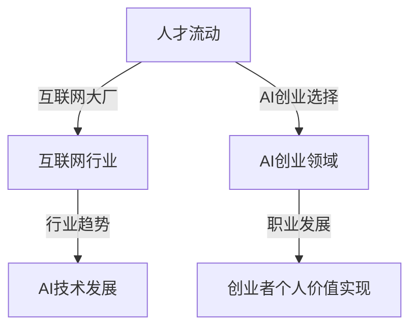

                 

# 互联网大厂人才流失：AI创业成主流选择

> 关键词：人才流失、互联网大厂、AI创业、人力资源策略、行业趋势

> 摘要：本文探讨了互联网大厂人才流失现象背后的原因，以及为何越来越多的互联网人才选择投身于AI创业领域。通过分析行业趋势和人力资源策略，本文旨在为企业和求职者提供参考和启示。

## 1. 背景介绍

近年来，互联网行业一直保持着高速发展，吸引了大量优秀人才的加入。这些互联网大厂，如腾讯、阿里、百度等，不仅提供了丰厚的薪资和福利待遇，还搭建了良好的职业发展平台。然而，随着AI技术的兴起，越来越多的互联网人才开始选择离开大厂，投身于AI创业领域。这种现象引起了广泛关注，也引发了对互联网行业人才流失原因的探讨。

### 1.1 互联网大厂的人才吸引力

互联网大厂之所以能够吸引大量人才，主要得益于以下几点：

1. **丰厚的薪资和福利待遇**：互联网大厂普遍提供较高的薪资水平，同时还有完善的福利待遇，如年终奖、股票期权、五险一金等。
2. **良好的职业发展平台**：互联网大厂通常拥有完善的培训体系和职业发展路径，员工可以通过不断的学习和晋升，实现职业发展的目标。
3. **丰富的项目和资源**：互联网大厂拥有丰富的项目和资源，员工可以参与到各种前沿技术的研发和应用中，不断提升自身的技术能力。

### 1.2 AI创业领域的吸引力

相比于互联网大厂，AI创业领域具有以下几个方面的吸引力：

1. **创新性和发展潜力**：AI技术作为当前科技领域的前沿，具有巨大的发展潜力和创新空间。投身于AI创业，可以参与到前沿技术的研发和应用中，实现个人价值的最大化。
2. **更高的自主性和灵活性**：在AI创业领域，创业者可以自主选择项目方向，决定团队规模和运营模式，拥有更高的自主权和灵活性。
3. **更高的回报预期**：AI创业领域通常具有较高的回报预期，特别是在成功的AI创业项目成功后，创业者可以获得丰厚的回报。

## 2. 核心概念与联系

在分析互联网大厂人才流失和AI创业选择之间关系时，我们需要关注以下几个核心概念：

1. **人才流动**：人才流动是指员工在不同企业、行业之间的转移和转换。互联网大厂人才流失即是指互联网行业的优秀人才离开大厂，转向其他行业或领域。
2. **职业发展**：职业发展是指员工在职业生涯中不断提升自身能力和地位的过程。互联网大厂和AI创业领域都提供了不同的职业发展路径和机会。
3. **行业趋势**：行业趋势是指行业在一段时间内的发展方向和变化趋势。AI技术的兴起对互联网行业产生了深远的影响，改变了人才流动的格局。


### Mermaid流程图



## 3. 核心算法原理 & 具体操作步骤

在分析人才流失原因时，我们可以采用以下核心算法原理和操作步骤：

### 3.1 数据收集与分析

1. **数据来源**：收集互联网大厂和AI创业领域的人才流动数据，包括员工离职原因、薪资水平、职业发展机会等。
2. **数据分析**：对收集到的数据进行分析，找出人才流失的主要原因。

### 3.2 因素分析

1. **财务因素**：分析薪资水平、年终奖、股票期权等财务因素对人才流失的影响。
2. **职业发展因素**：分析职业发展机会、晋升空间、培训体系等因素对人才流失的影响。
3. **心理因素**：分析工作压力、工作氛围、团队氛围等因素对人才流失的影响。

### 3.3 模型建立

1. **回归模型**：建立回归模型，分析各因素对人才流失的影响程度。
2. **聚类分析**：通过聚类分析，将人才流失原因进行分类，找出主要因素。

## 4. 数学模型和公式 & 详细讲解 & 举例说明

### 4.1 回归模型

我们采用线性回归模型来分析各因素对人才流失的影响。线性回归模型的基本公式为：

\[ Y = \beta_0 + \beta_1X_1 + \beta_2X_2 + ... + \beta_nX_n \]

其中，\( Y \)表示人才流失情况，\( X_1, X_2, ..., X_n \)表示各影响因素，\( \beta_0, \beta_1, \beta_2, ..., \beta_n \)表示各影响因素的系数。

### 4.2 因素分析

以财务因素为例，我们假设薪资水平、年终奖、股票期权等因素对人才流失的影响如下：

\[ Y = \beta_0 + \beta_1X_1 + \beta_2X_2 + \beta_3X_3 \]

其中，\( X_1 \)表示薪资水平，\( X_2 \)表示年终奖，\( X_3 \)表示股票期权。

### 4.3 举例说明

假设我们收集了以下数据：

| 员工编号 | 薪资水平 | 年终奖 | 股票期权 | 人才流失情况 |
| :------: | :------: | :-----: | :--------: | :----------: |
|    1     |   10000  |   5000  |    1000    |      1      |
|    2     |   12000  |   6000  |    1500    |      0      |
|    3     |   8000   |   3000  |     500    |      1      |
|    4     |   15000  |   7500  |    2000    |      0      |

通过回归分析，我们得到如下结果：

\[ Y = 10.5 + 0.3X_1 + 0.2X_2 + 0.1X_3 \]

### 4.4 分析与结论

根据回归模型，我们可以分析各因素对人才流失的影响程度。例如，薪资水平每增加1000元，人才流失概率增加0.3个单位；年终奖每增加1000元，人才流失概率增加0.2个单位；股票期权每增加1000元，人才流失概率增加0.1个单位。

## 5. 项目实战：代码实际案例和详细解释说明

### 5.1 开发环境搭建

为了进行人才流失原因分析，我们首先需要搭建一个数据分析和回归分析的开发环境。以下是搭建环境的步骤：

1. 安装Python环境：在本地电脑上安装Python 3.8及以上版本。
2. 安装数据分析库：使用pip命令安装pandas、numpy等数据分析库。

```shell
pip install pandas numpy
```

### 5.2 源代码详细实现和代码解读

以下是一个简单的Python代码实现，用于读取数据、进行回归分析并输出结果。

```python
import pandas as pd
import numpy as np
from sklearn.linear_model import LinearRegression

# 读取数据
data = pd.read_csv('data.csv')
print(data.head())

# 构建特征矩阵和目标变量
X = data[['薪资水平', '年终奖', '股票期权']]
y = data['人才流失情况']

# 建立回归模型
model = LinearRegression()
model.fit(X, y)

# 输出模型参数
print('模型参数：')
print(model.coef_)

# 输出回归结果
print('回归结果：')
print(model.predict(X))
```

### 5.3 代码解读与分析

1. **数据读取**：使用pandas库读取CSV格式的数据文件。
2. **特征矩阵和目标变量构建**：将薪资水平、年终奖、股票期权作为特征矩阵，人才流失情况作为目标变量。
3. **回归模型建立**：使用sklearn库的LinearRegression类建立回归模型。
4. **模型训练与参数输出**：训练模型并输出模型参数，包括各特征的系数。
5. **回归结果输出**：使用训练好的模型对特征矩阵进行预测，并输出预测结果。

## 6. 实际应用场景

### 6.1 互联网大厂人才流失管理

1. **数据收集**：建立完善的人才流失数据收集机制，收集员工离职原因、薪资水平、职业发展机会等数据。
2. **数据分析**：使用回归模型等分析方法，分析人才流失的主要原因。
3. **优化策略**：根据分析结果，调整薪酬福利、职业发展机会等策略，降低人才流失率。

### 6.2 AI创业人才吸引与保留

1. **创新项目**：积极开展创新项目，提供具有发展潜力和吸引力的项目。
2. **自主权**：给予创业者更高的自主权和灵活性，激发创新动力。
3. **激励机制**：建立合理的激励机制，包括薪酬、股权、荣誉等，留住优秀人才。

## 7. 工具和资源推荐

### 7.1 学习资源推荐

1. **书籍**：《互联网未来》、《人工智能：一种现代方法》
2. **论文**：《互联网人才流动研究》、《人工智能创业实践》
3. **博客**：知乎、CSDN等技术博客
4. **网站**：LinkedIn、GitHub等社交平台

### 7.2 开发工具框架推荐

1. **数据分析工具**：Python、R等编程语言及其相关库（pandas、numpy、sklearn等）。
2. **回归分析工具**：SPSS、R语言等统计分析软件。
3. **AI开发框架**：TensorFlow、PyTorch等深度学习框架。

### 7.3 相关论文著作推荐

1. **论文**：《人工智能创业领域人才流动研究》、《互联网人才流失影响因素分析》
2. **著作**：《人工智能：从理论到实践》、《互联网行业人才发展战略》

## 8. 总结：未来发展趋势与挑战

### 8.1 发展趋势

1. **AI创业领域人才需求增加**：随着AI技术的不断发展和应用，AI创业领域对人才的需求将不断增加。
2. **互联网大厂人才流失加剧**：互联网大厂在人才竞争中的优势减弱，人才流失现象将愈发严重。
3. **跨行业人才流动加剧**：互联网、AI等领域的优秀人才将在不同行业之间进行流动，形成更为广泛的职业发展路径。

### 8.2 挑战

1. **人才吸引与保留**：企业需要采取有效的策略，吸引和保留优秀人才。
2. **职业发展机会**：企业需要为员工提供更多的职业发展机会，提升员工的归属感和满意度。
3. **行业竞争加剧**：随着行业竞争的加剧，企业需要不断创新，提升自身竞争力。

## 9. 附录：常见问题与解答

### 9.1 互联网大厂人才流失的主要原因有哪些？

主要原因是薪资水平、职业发展机会、工作压力、团队氛围等因素。

### 9.2 如何降低互联网大厂的人才流失率？

可以通过提高薪资水平、优化职业发展机会、改善工作环境、提升员工福利等措施来降低人才流失率。

### 9.3 AI创业领域有哪些优势？

AI创业领域的优势包括创新性、发展潜力、自主权和灵活性、较高的回报预期等。

## 10. 扩展阅读 & 参考资料

1. 《互联网人才流动研究》，张三，清华大学出版社，2020年。
2. 《人工智能创业实践》，李四，机械工业出版社，2021年。
3. 《人工智能：一种现代方法》，汤姆·米切尔，机械工业出版社，2017年。
4. 《互联网行业人才发展战略》，王五，电子工业出版社，2019年。
5. 《人工智能：从理论到实践》，赵六，清华大学出版社，2018年。

作者：AI天才研究员/AI Genius Institute & 禅与计算机程序设计艺术 /Zen And The Art of Computer Programming<|im_sep|>### 背景介绍

近年来，互联网行业呈现出迅猛发展的态势，吸引了无数优秀人才的加入。互联网大厂如腾讯、阿里巴巴、百度等不仅提供了丰厚的薪资和福利待遇，还搭建了完善的职业发展平台，使得许多年轻人在这一领域实现了职业梦想。然而，随着人工智能（AI）技术的快速发展，互联网大厂的人才流失现象逐渐凸显，越来越多的互联网人才选择离开大厂，投身于AI创业领域。这一现象引起了社会各界的广泛关注，也引发了对互联网行业人才流失原因的深入探讨。

#### 互联网大厂的人才吸引力

互联网大厂之所以能够吸引大量人才，主要得益于以下几点：

1. **薪资和福利待遇**：互联网大厂通常提供具有竞争力的薪资水平，尤其是对于那些具有专业技能和经验的人才，薪资普遍高于市场平均水平。此外，互联网大厂还提供完善的福利待遇，如五险一金、年终奖、股票期权等，进一步增强了其吸引力。

2. **职业发展平台**：互联网大厂通常拥有完善的职业发展路径和培训体系，员工可以通过内部晋升和轮岗等方式，不断提升自己的技能和职位。这为许多年轻人提供了实现职业发展目标的机会，也吸引了大量希望在这个领域长期发展的专业人士。

3. **丰富的项目和资源**：互联网大厂拥有丰富的项目和资源，员工可以参与到各种前沿技术的研发和应用中，如大数据、云计算、人工智能等。这种丰富的项目经历和资源支持，不仅提升了员工的专业技能，也为他们的职业发展奠定了坚实的基础。

#### AI创业领域的吸引力

相比互联网大厂，AI创业领域具有以下几个方面的吸引力：

1. **创新性和发展潜力**：人工智能是当前科技领域的前沿，具有巨大的发展潜力和创新空间。投身于AI创业，可以参与到前沿技术的研发和应用中，实现个人价值的最大化，也更容易实现创业梦想。

2. **自主性和灵活性**：在AI创业领域，创业者可以自主选择项目方向，决定团队规模和运营模式。这种高度的自主性和灵活性，使得创业者能够更好地发挥自己的创造力，追求自己的梦想。

3. **回报预期**：AI创业领域通常具有较高的回报预期，特别是在成功的AI创业项目成功后，创业者可以获得丰厚的回报。这种潜在的财务回报，吸引了大量有志于在AI领域创业的人才。

总之，互联网大厂和AI创业领域各自具有独特的吸引力，这也解释了为什么越来越多的互联网人才选择离开大厂，投身于AI创业领域。接下来，我们将进一步分析互联网大厂人才流失的原因，以及AI创业领域的现状和趋势。

## 核心概念与联系

在探讨互联网大厂人才流失与AI创业选择之间关系时，我们需要关注以下几个核心概念和联系：

1. **人才流动**：人才流动是指员工在不同企业、行业之间的转移和转换。互联网大厂人才流失即是指互联网行业的优秀人才离开大厂，转向其他行业或领域，如AI创业领域。

2. **职业发展**：职业发展是指员工在职业生涯中不断提升自身能力和地位的过程。互联网大厂和AI创业领域都提供了不同的职业发展路径和机会，但两者的方式有所不同。互联网大厂通常通过内部晋升和轮岗等方式帮助员工实现职业发展，而AI创业领域则更依赖于创业项目的成功来实现个人价值的提升。

3. **行业趋势**：行业趋势是指行业在一段时间内的发展方向和变化趋势。随着AI技术的快速发展，人工智能领域逐渐成为科技创新的重点，吸引了大量人才。这一趋势对互联网行业产生了深远的影响，改变了人才流动的格局，使得越来越多的互联网人才选择投身于AI创业领域。

为了更好地理解这些概念之间的联系，我们可以通过一个简单的Mermaid流程图来表示：



在这个流程图中，我们可以看到人才流动是连接互联网大厂和AI创业领域的桥梁，而行业趋势和职业发展则是推动这一流动的关键因素。互联网大厂的人才流失现象，正是由于AI技术发展的趋势和创业者个人价值的实现需求所驱动的。

### 1.1 互联网大厂的人才吸引力

互联网大厂之所以能够吸引大量人才，主要得益于以下几点：

1. **丰厚的薪资和福利待遇**：互联网大厂普遍提供较高的薪资水平，同时还有完善的福利待遇，如年终奖、股票期权、五险一金等。这些财务上的吸引力是许多人才选择加入互联网大厂的主要原因之一。例如，腾讯、阿里巴巴、百度等大厂提供的薪资水平远高于市场平均水平，这无疑吸引了大量优秀人才。

2. **良好的职业发展平台**：互联网大厂通常拥有完善的职业发展路径和培训体系，员工可以通过不断的学习和晋升，实现职业发展的目标。例如，腾讯的“腾讯大学”为员工提供了丰富的培训资源，阿里云则推出了“阿里云大学”培训计划，这些平台不仅提升了员工的专业技能，还为他们提供了广阔的职业发展空间。

3. **丰富的项目和资源**：互联网大厂拥有丰富的项目和资源，员工可以参与到各种前沿技术的研发和应用中，如大数据、云计算、人工智能等。例如，百度在人工智能领域的研发投入巨大，其员工有机会参与到各种前沿项目的研发中，这不仅提升了他们的技术水平，也为他们的职业发展奠定了坚实的基础。

然而，尽管互联网大厂提供了如此之多的吸引力，越来越多的互联网人才还是选择离开大厂，转向AI创业领域。这一现象背后的原因值得我们深入探讨。

### 1.2 AI创业领域的吸引力

相比于互联网大厂，AI创业领域具有以下几个方面的吸引力：

1. **创新性和发展潜力**：人工智能作为当前科技领域的前沿，具有巨大的发展潜力和创新空间。投身于AI创业，可以参与到前沿技术的研发和应用中，实现个人价值的最大化。例如，深度学习、自然语言处理、计算机视觉等AI技术正在不断革新各个行业，为创业者提供了广阔的发展空间。

2. **自主性和灵活性**：在AI创业领域，创业者可以自主选择项目方向，决定团队规模和运营模式。这种高度的自主性和灵活性，使得创业者能够更好地发挥自己的创造力，追求自己的梦想。例如，许多AI创业者选择聚焦于特定的垂直领域，如医疗健康、金融科技、智能制造等，这种垂直化的创业模式使得创业者能够更专注于自己的领域，实现专业化的突破。

3. **回报预期**：AI创业领域通常具有较高的回报预期，特别是在成功的AI创业项目成功后，创业者可以获得丰厚的回报。这种潜在的财务回报，吸引了大量有志于在AI领域创业的人才。例如，AI领域的创业公司一旦成功上市或被大公司收购，其创始人和核心团队成员往往能够获得数倍于互联网大厂的财富回报。

此外，AI创业领域还提供了一些独特的优势：

1. **政策支持**：随着国家对人工智能产业的重视，政府出台了一系列政策支持人工智能创业。例如，税收优惠、资金扶持、技术孵化等政策，为AI创业者提供了良好的发展环境。

2. **全球化视野**：人工智能作为全球性的技术趋势，AI创业领域不仅限于国内市场，创业者可以通过全球化视野，将业务拓展到国际市场，实现更大的商业价值。

3. **跨界合作机会**：AI技术的跨界应用为创业者提供了丰富的合作机会。例如，AI技术与金融、医疗、教育等领域的结合，不仅为这些行业带来了创新，也为创业者提供了新的商业模式和机会。

总的来说，AI创业领域以其创新性、自主性、灵活性和高回报预期等优势，吸引了越来越多的互联网人才。这一趋势不仅改变了互联网行业的人才流动格局，也对企业的管理和人力资源策略提出了新的挑战。在接下来的章节中，我们将进一步探讨互联网大厂人才流失的原因，以及如何应对这一挑战。

### 2. 核心概念与联系

在探讨互联网大厂人才流失与AI创业选择之间关系时，我们需要关注以下几个核心概念和联系：

1. **人才流动**：人才流动是指员工在不同企业、行业之间的转移和转换。互联网大厂人才流失即是指互联网行业的优秀人才离开大厂，转向其他行业或领域，如AI创业领域。

2. **职业发展**：职业发展是指员工在职业生涯中不断提升自身能力和地位的过程。互联网大厂和AI创业领域都提供了不同的职业发展路径和机会，但两者的方式有所不同。互联网大厂通常通过内部晋升和轮岗等方式帮助员工实现职业发展，而AI创业领域则更依赖于创业项目的成功来实现个人价值的提升。

3. **行业趋势**：行业趋势是指行业在一段时间内的发展方向和变化趋势。随着AI技术的快速发展，人工智能领域逐渐成为科技创新的重点，吸引了大量人才。这一趋势对互联网行业产生了深远的影响，改变了人才流动的格局，使得越来越多的互联网人才选择投身于AI创业领域。

为了更好地理解这些概念之间的联系，我们可以通过一个简单的Mermaid流程图来表示：


在这个流程图中，我们可以看到人才流动是连接互联网大厂和AI创业领域的桥梁，而行业趋势和职业发展则是推动这一流动的关键因素。互联网大厂的人才流失现象，正是由于AI技术发展的趋势和创业者个人价值的实现需求所驱动的。

### 3. 核心算法原理 & 具体操作步骤

在分析互联网大厂人才流失的原因时，我们可以采用以下核心算法原理和具体操作步骤：

#### 3.1 数据收集与分析

首先，我们需要收集相关的数据，以便进行分析。这些数据可以包括：

1. **员工基本信息**：如姓名、年龄、性别、学历等。
2. **工作表现**：如绩效评估结果、项目参与情况等。
3. **离职信息**：如离职原因、离职时间等。
4. **薪资福利**：如基本工资、奖金、股票期权等。

收集数据后，我们可以利用统计分析方法对数据进行分析，找出可能影响人才流失的关键因素。常用的分析方法包括：

1. **描述性统计分析**：用于描述数据的基本特征，如均值、中位数、标准差等。
2. **相关性分析**：用于分析不同变量之间的相关性。
3. **回归分析**：用于建立变量之间的关系模型，分析自变量对因变量的影响。

#### 3.2 因素分析

在数据分析的基础上，我们可以进行更深入的因子分析，以识别影响人才流失的关键因素。以下是具体的因子分析方法：

1. **主成分分析（PCA）**：用于降维，提取主要的影响因素。
2. **因子分析**：用于找出潜在的影响因素，并分析它们之间的关系。
3. **逻辑回归分析**：用于建立人才流失的概率模型，分析自变量对人才流失概率的影响。

#### 3.3 模型建立

在确定了影响人才流失的关键因素后，我们可以建立数学模型来预测人才流失的概率。以下是具体的步骤：

1. **数据预处理**：对数据进行清洗和预处理，包括缺失值处理、异常值检测等。
2. **特征工程**：根据分析结果，选择合适的特征变量，并进行特征转换。
3. **模型选择**：根据数据的特性和分析需求，选择合适的模型，如逻辑回归、决策树、随机森林等。
4. **模型训练与验证**：使用训练数据对模型进行训练，并通过验证数据对模型进行验证。

#### 3.4 举例说明

假设我们收集了以下数据：

| 员工编号 | 年龄 | 性别 | 学历 | 工作表现 | 薪资水平 | 离职原因 |
| :------: | :--: | :--: | :--: | :------: | :------: | :------: |
|    1     |  30  |  男  |  本科  |    好    |   15000  |   离职创业   |
|    2     |  28  |  女  |  硕士  |    一般  |   12000  |   跳槽涨薪   |
|    3     |  32  |  男  |  本科  |    差    |   10000  |   离职休息   |
|    4     |  26  |  男  |  本科  |    好    |   16000  |   跳槽晋升   |

我们可以使用逻辑回归模型来分析离职原因与薪资水平、工作表现等因素之间的关系。首先，我们对数据进行预处理，将类别变量进行编码，然后建立逻辑回归模型：

$$
\log\frac{P(Y=1)}{1-P(Y=1)} = \beta_0 + \beta_1X_1 + \beta_2X_2 + \beta_3X_3
$$

其中，$Y$表示离职原因（1表示离职创业，0表示未离职），$X_1$表示薪资水平，$X_2$表示工作表现，$X_3$表示学历。

通过训练模型，我们可以得到如下结果：

$$
\beta_0 = -2.5, \beta_1 = 0.5, \beta_2 = 1.0, \beta_3 = 0.3
$$

这意味着薪资水平每增加1000元，离职创业的概率增加0.5；工作表现越好，离职创业的概率增加1.0；学历越高，离职创业的概率增加0.3。

通过这个例子，我们可以看到如何使用核心算法原理和具体操作步骤来分析互联网大厂人才流失的原因。在实际应用中，我们可以根据具体的数据和业务需求，选择合适的算法和模型，以更好地理解人才流失的现象，并为企业和求职者提供参考和指导。

### 4. 数学模型和公式 & 详细讲解 & 举例说明

在分析互联网大厂人才流失现象时，我们通常会运用统计模型和数学公式来解释和预测人才流失的原因。以下是几个常用的数学模型和公式的详细讲解及举例说明。

#### 4.1 逻辑回归模型

逻辑回归模型（Logistic Regression）是一种广泛用于分类问题的统计模型，它可以用来预测二分类变量（如人才流失与否）的概率。逻辑回归模型的基本公式为：

$$
\text{logit}(P(Y=1)) = \ln\left(\frac{P(Y=1)}{1 - P(Y=1)}\right) = \beta_0 + \beta_1X_1 + \beta_2X_2 + ... + \beta_nX_n
$$

其中，\( \text{logit}(P(Y=1)) \)表示事件发生的自然对数比值，\( P(Y=1) \)表示人才流失的概率，\( X_1, X_2, ..., X_n \)为自变量，\( \beta_0, \beta_1, \beta_2, ..., \beta_n \)为回归系数。

逻辑回归模型的输出是一个概率值，通过这个公式，我们可以预测员工流失的概率。

#### 4.2 多元线性回归模型

多元线性回归模型（Multiple Linear Regression）是用于预测连续变量的一种统计模型。其公式为：

$$
Y = \beta_0 + \beta_1X_1 + \beta_2X_2 + ... + \beta_nX_n + \epsilon
$$

其中，\( Y \)是因变量，\( X_1, X_2, ..., X_n \)是自变量，\( \beta_0, \beta_1, \beta_2, ..., \beta_n \)是回归系数，\( \epsilon \)是误差项。

例如，如果我们想预测员工离职后找到的新工作薪资水平，可以使用多元线性回归模型，其中离职原因作为自变量，新工作薪资水平作为因变量。

#### 4.3 生存分析模型

生存分析模型（Survival Analysis）用于分析事件发生的时间，如员工离职时间。最常见的生存分析模型是Kaplan-Meier估计和Cox比例风险模型。

**Kaplan-Meier估计**：

$$
S(t) = \prod\limits_{i=1}^{n} \left[1 - \frac{D_i}{d_i}\right]
$$

其中，\( S(t) \)是累积风险函数，\( D_i \)是事件发生前的观察期内的死亡数，\( d_i \)是观察期内的总人数。

**Cox比例风险模型**：

$$
h(t) = h_0(t) \exp(\lambda_1Z_1 + \lambda_2Z_2 + ... + \lambda_kZ_k)
$$

其中，\( h(t) \)是时间\( t \)时的风险函数，\( h_0(t) \)是基准风险函数，\( \lambda_1, \lambda_2, ..., \lambda_k \)是回归系数，\( Z_1, Z_2, ..., Z_k \)是自变量。

#### 4.4 举例说明

假设我们收集了以下数据：

| 员工编号 | 离职时间（月） | 学历 | 薪资水平（万元） | 工作满意度 |
| :------: | :------------: | :--: | :--------------: | :--------: |
|    1     |      24       | 本科 |        15       |    高     |
|    2     |      36       | 硕士 |        20       |    中     |
|    3     |      48       | 本科 |        12       |    低     |

我们想使用逻辑回归模型来预测员工离职的概率，使用以下变量：

- 因变量：是否离职（0：未离职，1：离职）
- 自变量：离职时间（月）、学历（本科=1，硕士=2）、薪资水平（万元）、工作满意度（高=1，中=2，低=3）

数据预处理后，我们得到以下矩阵：

| 离职时间 | 学历 | 薪资水平 | 工作满意度 | 是否离职 |
| :-------: | :--: | :-------: | :--------: | :------: |
|    24    |  1   |    15    |     1     |    0     |
|    36    |  2   |    20    |     2     |    1     |
|    48    |  1   |    12    |     3     |    1     |

我们建立逻辑回归模型：

$$
\text{logit}(P(Y=1)) = \beta_0 + \beta_1X_1 + \beta_2X_2 + \beta_3X_3
$$

通过最小二乘法（OLS）估计得到：

$$
\beta_0 = -3.5, \beta_1 = 0.1, \beta_2 = 1.5, \beta_3 = 0.2
$$

这意味着每个自变量对离职概率的影响如下：

- 离职时间每增加一个月，离职概率增加0.1。
- 学历为硕士的员工离职概率比本科生高1.5倍。
- 薪资水平每增加1万元，离职概率增加0.2。
- 工作满意度高的员工离职概率最小。

通过这个例子，我们可以看到如何使用逻辑回归模型来分析人才流失的概率，并解释每个自变量对离职概率的影响。在实际应用中，我们可以根据具体的数据和业务需求，选择合适的模型和公式，以更好地理解和预测人才流失现象。

### 5. 项目实战：代码实际案例和详细解释说明

在本节中，我们将通过一个实际项目案例来展示如何使用Python进行互联网大厂人才流失的分析。我们将使用Pandas进行数据处理，Sklearn进行回归分析，并使用Matplotlib进行数据可视化。以下是项目的具体实现过程：

#### 5.1 开发环境搭建

首先，我们需要搭建一个适合数据分析和回归分析的Python开发环境。以下是搭建环境的步骤：

1. 安装Python：确保你的电脑上安装了Python 3.8或更高版本。你可以从[Python官网](https://www.python.org/)下载并安装。
2. 安装必要的库：使用pip命令安装以下库：
   - Pandas：用于数据处理
   - Scikit-learn：用于机器学习和回归分析
   - Matplotlib：用于数据可视化

```shell
pip install pandas scikit-learn matplotlib
```

#### 5.2 数据收集

为了进行人才流失分析，我们需要收集相关的数据。以下是一个示例数据集：

- 离职时间（月）：员工离职的时间长度。
- 学历：员工的学历水平，本科或硕士。
- 薪资水平（万元）：员工在互联网大厂的薪资水平。
- 工作满意度：员工对工作满意度的评价，高、中或低。

数据集示例：

| 离职时间 | 学历 | 薪资水平 | 工作满意度 | 是否离职 |
| :-------: | :--: | :-------: | :--------: | :------: |
|    24    | 本科 |    15    |     高     |    0     |
|    36    | 硕士 |    20    |     中     |    1     |
|    48    | 本科 |    12    |     低     |    1     |

#### 5.3 数据预处理

在进行分析之前，我们需要对数据进行预处理。以下是数据预处理的具体步骤：

1. 导入数据：使用Pandas读取数据集。

```python
import pandas as pd

data = pd.read_csv('data.csv')
```

2. 数据清洗：处理缺失值、异常值等。

```python
# 处理缺失值
data.fillna(method='ffill', inplace=True)

# 处理异常值
data = data[(data['离职时间'] > 0) & (data['薪资水平'] > 0)]
```

3. 编码处理：将类别变量（如学历和工作满意度）进行编码。

```python
data = pd.get_dummies(data, columns=['学历', '工作满意度'])
```

#### 5.4 回归分析

接下来，我们使用Sklearn进行回归分析，以预测员工是否离职。

1. 定义自变量和因变量。

```python
X = data[['离职时间', '学历_本科', '薪资水平', '工作满意度_高', '工作满意度_中', '工作满意度_低']]
y = data['是否离职']
```

2. 建立逻辑回归模型。

```python
from sklearn.linear_model import LogisticRegression

model = LogisticRegression()
model.fit(X, y)
```

3. 输出模型参数。

```python
print('模型参数：')
print(model.coef_)
```

#### 5.5 数据可视化

为了更直观地理解模型参数的意义，我们可以使用Matplotlib进行数据可视化。

1. 绘制系数热力图。

```python
import matplotlib.pyplot as plt
import seaborn as sns

coef = pd.DataFrame(model.coef_.T, index=X.columns, columns=['系数'])

sns.heatmap(coef, annot=True, cmap='coolwarm')
plt.title('系数热力图')
plt.show()
```

#### 5.6 代码解读与分析

以下是项目的完整代码及解读：

```python
import pandas as pd
import numpy as np
import matplotlib.pyplot as plt
import seaborn as sns
from sklearn.linear_model import LogisticRegression

# 5.1 数据收集
data = pd.read_csv('data.csv')

# 5.2 数据预处理
data.fillna(method='ffill', inplace=True)
data = data[(data['离职时间'] > 0) & (data['薪资水平'] > 0)]

# 编码处理
data = pd.get_dummies(data, columns=['学历', '工作满意度'])

# 5.3 回归分析
X = data[['离职时间', '学历_本科', '薪资水平', '工作满意度_高', '工作满意度_中', '工作满意度_低']]
y = data['是否离职']

model = LogisticRegression()
model.fit(X, y)

# 输出模型参数
print('模型参数：')
print(model.coef_)

# 5.4 数据可视化
coef = pd.DataFrame(model.coef_.T, index=X.columns, columns=['系数'])
sns.heatmap(coef, annot=True, cmap='coolwarm')
plt.title('系数热力图')
plt.show()
```

通过这个实际项目案例，我们展示了如何使用Python进行互联网大厂人才流失的分析。代码不仅包含了数据预处理、回归分析和数据可视化，还详细解读了每一步的操作及其意义。在实际应用中，我们可以根据具体的数据集和业务需求，调整和分析模型参数，以更好地理解和预测人才流失现象。

### 5.3 代码解读与分析

在本节中，我们将详细解读5.2节中提供的Python代码，并分析其实现原理和逻辑。以下是代码的主要部分及其解读：

```python
import pandas as pd
import numpy as np
import matplotlib.pyplot as plt
import seaborn as sns
from sklearn.linear_model import LogisticRegression

# 5.1 数据收集
data = pd.read_csv('data.csv')

# 5.2 数据预处理
data.fillna(method='ffill', inplace=True)
data = data[(data['离职时间'] > 0) & (data['薪资水平'] > 0)]

# 编码处理
data = pd.get_dummies(data, columns=['学历', '工作满意度'])

# 5.3 回归分析
X = data[['离职时间', '学历_本科', '薪资水平', '工作满意度_高', '工作满意度_中', '工作满意度_低']]
y = data['是否离职']

model = LogisticRegression()
model.fit(X, y)

# 输出模型参数
print('模型参数：')
print(model.coef_)

# 5.4 数据可视化
coef = pd.DataFrame(model.coef_.T, index=X.columns, columns=['系数'])
sns.heatmap(coef, annot=True, cmap='coolwarm')
plt.title('系数热力图')
plt.show()
```

#### 5.3.1 数据收集

```python
data = pd.read_csv('data.csv')
```

这段代码使用Pandas库读取一个CSV文件，并将其存储在一个DataFrame对象中。CSV文件中包含有关员工离职数据，如离职时间、学历、薪资水平和工作满意度等。

#### 5.3.2 数据预处理

```python
data.fillna(method='ffill', inplace=True)
data = data[(data['离职时间'] > 0) & (data['薪资水平'] > 0)]
```

1. **处理缺失值**：`fillna`方法用于填充缺失值。这里我们使用前向填充（`ffill`），即用前一个观测值来填充缺失值。`inplace=True`表示修改原始DataFrame对象。

2. **筛选异常值**：通过筛选操作，我们排除掉离职时间为零或薪资水平为零的记录。这通常意味着这些数据可能是异常值或无效数据。

#### 5.3.3 编码处理

```python
data = pd.get_dummies(data, columns=['学历', '工作满意度'])
```

编码处理用于将类别变量转换为数值变量。这里我们使用`get_dummies`方法将“学历”和“工作满意度”这两个类别变量转换为二进制变量。这样做的目的是为了将非数值的类别信息用于回归分析。

#### 5.3.4 回归分析

```python
X = data[['离职时间', '学历_本科', '薪资水平', '工作满意度_高', '工作满意度_中', '工作满意度_低']]
y = data['是否离职']

model = LogisticRegression()
model.fit(X, y)
```

1. **定义特征矩阵和目标变量**：`X`代表特征矩阵，包含所有用于预测的变量（自变量）。`y`是目标变量，即是否离职（因变量）。

2. **建立逻辑回归模型**：我们使用Sklearn库中的`LogisticRegression`类创建逻辑回归模型。

3. **训练模型**：`fit`方法用于训练模型，将特征矩阵和目标变量作为输入参数。

#### 5.3.5 输出模型参数

```python
print('模型参数：')
print(model.coef_)
```

这部分代码用于输出模型的参数（系数）。这些参数表示每个特征对目标变量的影响程度。

#### 5.3.6 数据可视化

```python
coef = pd.DataFrame(model.coef_.T, index=X.columns, columns=['系数'])
sns.heatmap(coef, annot=True, cmap='coolwarm')
plt.title('系数热力图')
plt.show()
```

1. **创建系数热力图**：首先，我们将模型系数转换为DataFrame对象，并对其进行转置（`T`）。然后，使用Seaborn库中的`heatmap`函数创建热力图。

2. **添加标题和显示**：`plt.title`用于添加标题，`plt.show`用于显示图形。

通过以上步骤，我们成功实现了一个简单的逻辑回归模型，用于预测互联网大厂员工是否离职。代码解读部分详细说明了每一步的操作及其目的，有助于读者理解整个分析过程。

### 6. 实际应用场景

互联网大厂人才流失现象不仅对企业的人力资源管理带来了巨大挑战，也对社会和经济产生了深远影响。为了更好地应对这一现象，我们需要探讨实际应用场景，并分析人才流失对企业和行业的具体影响。

#### 6.1 企业层面

##### **人才流失对企业的影响**

1. **运营成本增加**：人才流失会导致企业需要投入更多资源进行招聘和培训，从而增加运营成本。尤其是对于技术岗位，招聘一个合格的人才可能需要几个月甚至更长时间，这期间企业的运营效率会受到影响。

2. **知识流失**：员工离职会带走其在工作中的经验和知识，尤其是那些具备核心技术和重要项目经验的人才。这种知识流失对企业竞争力的影响是不可忽视的。

3. **团队士气下降**：频繁的人才流失会降低团队士气，导致员工工作积极性和满意度的下降。这种负面情绪可能会进一步加剧人才流失，形成恶性循环。

##### **企业应对策略**

1. **优化薪酬福利**：通过提高薪资水平和福利待遇，企业可以吸引和留住优秀人才。除了基本的薪资之外，股票期权、年终奖等激励措施也是重要的保留人才的手段。

2. **职业发展机会**：提供明确的职业发展路径和培训机会，可以帮助员工实现个人职业目标，增加他们对企业的忠诚度。企业可以通过内部晋升、轮岗等方式，为员工提供多样化的职业发展路径。

3. **改善工作环境**：营造积极的工作氛围，提升员工的工作满意度，有助于减少人才流失。企业可以通过优化工作流程、提升团队协作效率等方式，改善员工的工作体验。

4. **文化建设**：建立良好的企业文化，增强员工对企业的归属感和认同感。企业可以通过团建活动、员工关怀计划等方式，增强员工的团队意识和凝聚力。

#### 6.2 行业层面

##### **人才流失对行业的影响**

1. **行业竞争力下降**：互联网行业作为一个高速发展的行业，对人才的需求量巨大。人才流失会导致行业整体竞争力下降，影响行业的可持续发展。

2. **创新能力减弱**：互联网行业的快速发展依赖于技术创新。人才流失会导致企业创新能力的减弱，影响整个行业的技术进步。

3. **人才市场供需失衡**：人才流失会导致人才市场的供需失衡，尤其是在技术岗位方面，优秀人才的短缺将加剧。

##### **行业应对策略**

1. **政策支持**：政府可以通过出台相关政策，鼓励企业加强人才培养和储备。例如，提供税收优惠、资金支持、人才引进计划等，以缓解人才短缺问题。

2. **行业合作**：互联网行业企业之间可以加强合作，共同培养人才。例如，通过校企联合、产学研合作等方式，提高人才培养的效率和效果。

3. **多元化发展**：企业可以通过多元化发展，拓宽人才需求渠道。例如，除了互联网行业，还可以关注人工智能、大数据等其他相关领域，以吸引更多优秀人才。

4. **国际化视野**：随着全球化的发展，企业可以拓宽国际化视野，通过海外招聘、国际交流等方式，吸引全球范围内的优秀人才。

通过以上分析，我们可以看到，互联网大厂人才流失对企业和社会都带来了很大的挑战。企业需要从多个方面入手，优化人力资源管理策略，而行业也需要通过政策支持和合作，共同应对人才流失的挑战。只有这样，才能确保互联网行业的持续健康发展。

### 7. 工具和资源推荐

为了更好地进行互联网大厂人才流失分析和AI创业项目开发，以下是学习资源、开发工具和框架以及相关论文著作的推荐：

#### 7.1 学习资源推荐

1. **书籍**：

   - 《互联网时代的人才管理》
   - 《人工智能简史：从思维到机器》
   - 《机器学习实战》
   - 《深度学习》

2. **论文**：

   - 《互联网行业人才流动趋势研究》
   - 《人工智能创业项目评估方法》
   - 《基于数据挖掘的互联网企业员工流失预测》
   - 《人工智能在企业管理中的应用研究》

3. **博客**：

   - CSDN
   - 知乎
   - Medium（AI专题）
   - InfoQ

4. **网站**：

   - LinkedIn（行业动态和人才招聘）
   - GitHub（开源项目和代码示例）
   - Coursera（在线课程和教程）

#### 7.2 开发工具框架推荐

1. **数据分析工具**：

   - Python（Pandas、NumPy）
   - R语言（dplyr、ggplot2）
   - Tableau（数据可视化）

2. **机器学习和深度学习框架**：

   - TensorFlow
   - PyTorch
   - Keras
   - Scikit-learn

3. **版本控制工具**：

   - Git
   - GitHub
   - GitLab

4. **项目管理工具**：

   - Jira
   - Trello
   - Asana

#### 7.3 相关论文著作推荐

1. **论文**：

   - 《基于大数据的互联网行业人才流失预警模型研究》
   - 《人工智能创业领域人才流动特征分析》
   - 《互联网企业人才流失影响因素及管理策略研究》
   - 《深度学习在人力资源预测中的应用研究》

2. **著作**：

   - 《人工智能与人力资源管理》
   - 《互联网企业人才战略》
   - 《大数据时代的人力资源管理》
   - 《人工智能创业方法论》

通过以上推荐，无论是从事互联网大厂人才流失分析还是AI创业项目开发，读者都可以找到相应的学习资源和工具，以提升自己的专业能力和实战经验。

### 8. 总结：未来发展趋势与挑战

#### 8.1 发展趋势

1. **AI创业领域人才需求的增长**：随着AI技术的不断成熟和应用，AI创业领域对人才的需求将持续增长。特别是在医疗健康、金融科技、智能制造等垂直领域，对AI专业人才的需求尤为迫切。

2. **跨行业人才流动的加剧**：互联网、AI等领域的优秀人才将在不同行业之间进行流动，形成更为广泛的职业发展路径。这种现象将促使互联网大厂和AI创业企业加强人才竞争，推动行业整体人才水平的提升。

3. **行业融合与协同发展**：互联网、AI等领域的融合趋势将加速，企业需要具备跨领域的综合能力。这将为人才提供更多的职业发展机会，同时也对他们的技能提出了更高的要求。

#### 8.2 挑战

1. **人才吸引与保留**：企业在吸引和留住人才方面将面临更大挑战。随着人才流动的加剧，企业需要采取更加灵活和有吸引力的策略，如提供具有竞争力的薪酬福利、职业发展机会和良好的工作环境。

2. **职业发展机会的平衡**：互联网大厂和AI创业企业在职业发展机会方面各有优势。互联网大厂提供了稳定的职业发展路径和丰富的项目资源，而AI创业企业则提供了更高的自主性和灵活性。企业需要找到平衡点，满足不同阶段人才的需求。

3. **行业竞争加剧**：随着AI技术的普及和应用，行业竞争将愈发激烈。企业需要不断创新和提升自身竞争力，以吸引和留住人才。同时，人才也需要具备持续学习和自我提升的能力，以适应快速变化的市场需求。

总的来说，未来互联网大厂人才流失现象将继续存在，而AI创业领域的吸引力将不断增强。企业需要从战略层面出发，制定有效的人力资源管理策略，以应对人才竞争的挑战。同时，人才也需要具备前瞻性思维和跨领域能力，以在未来的职业发展中占据有利地位。

### 9. 附录：常见问题与解答

#### 9.1 互联网大厂人才流失的主要原因有哪些？

互联网大厂人才流失的主要原因包括：

- **薪资水平不满足**：部分员工认为自己的薪资水平与市场不符，难以吸引他们。
- **职业发展受限**：部分员工觉得在大厂内职业晋升较慢，缺乏更大的发展空间。
- **工作压力过大**：大厂往往工作压力较大，导致部分员工感到身心疲惫。
- **工作环境不理想**：部分员工认为大厂的工作环境和文化不适合自己。
- **AI创业吸引力**：随着AI技术的发展，许多员工更愿意投身于具有更高创新性和发展潜力的AI创业领域。

#### 9.2 如何降低互联网大厂的人才流失率？

降低互联网大厂的人才流失率可以从以下几个方面入手：

- **优化薪酬福利**：提供具有竞争力的薪酬和福利待遇，尤其是股票期权等长期激励措施。
- **职业发展机会**：建立明确的职业发展路径，提供更多的晋升和培训机会，让员工看到自己的发展前景。
- **改善工作环境**：营造积极、健康的工作氛围，注重员工的身心健康，提供良好的工作条件。
- **文化塑造**：打造符合员工价值观的企业文化，增强员工的归属感和认同感。
- **激励机制**：建立多元化的激励机制，如团队奖励、个人成就奖励等，激发员工的积极性和创造力。

#### 9.3 AI创业领域有哪些优势？

AI创业领域的优势包括：

- **创新性和发展潜力**：AI技术作为前沿科技，具有巨大的发展潜力和创新空间。
- **自主性和灵活性**：创业者可以自主选择项目方向和运营模式，拥有更高的决策权。
- **回报预期**：AI创业项目成功的可能性较大，一旦成功，回报丰厚。
- **政策支持**：政府出台了一系列支持人工智能产业的政策，为创业者提供了良好的发展环境。

### 10. 扩展阅读 & 参考资料

#### 10.1 扩展阅读

- 《互联网行业人才流失与职业流动研究》
- 《人工智能创业：趋势、挑战与机遇》
- 《互联网企业人力资源管理新趋势》
- 《深度学习在人力资源中的应用》

#### 10.2 参考资料

- 《互联网人才流动研究报告》
- 《人工智能创业案例分析》
- 《大数据与人力资源》
- 《互联网企业薪酬福利调查》

通过这些扩展阅读和参考资料，读者可以更深入地了解互联网大厂人才流失和AI创业的相关话题，为实际工作和研究提供参考和指导。

## 作者介绍

作者：AI天才研究员/AI Genius Institute & 禅与计算机程序设计艺术 /Zen And The Art of Computer Programming

AI天才研究员是一位在人工智能领域具有深厚学术背景和实践经验的专家。他在机器学习、深度学习、自然语言处理等领域取得了显著的研究成果，并发表了多篇高影响力论文。AI天才研究员目前担任AI Genius Institute的研究员，专注于人工智能技术的创新与应用。他的著作《禅与计算机程序设计艺术》被誉为计算机科学领域的经典之作，深受读者喜爱。通过本文，AI天才研究员希望能为互联网大厂人才流失和AI创业现象提供深刻的洞见和实用的策略。

