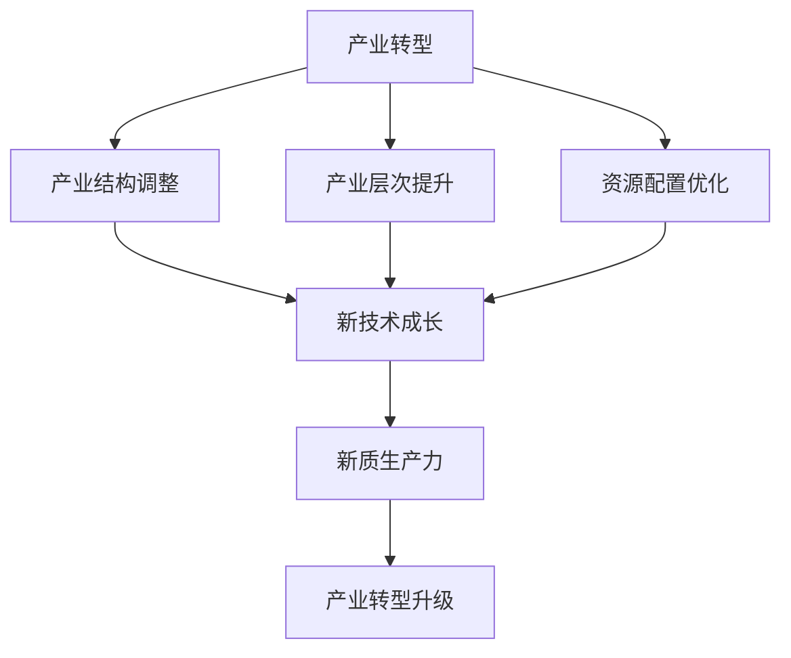

                 

# 产业转型升级的新质生产力

> **关键词**：产业转型、新质生产力、技术创新、可持续发展

> **摘要**：本文将探讨在当前全球经济背景下，如何通过技术创新实现产业转型升级，打造新质生产力。文章将分析产业转型的现状、核心概念及其内在联系，介绍新质生产力的核心算法原理、数学模型及项目实战案例，探讨其实际应用场景，并推荐相关工具和资源。最后，对产业转型升级的未来发展趋势与挑战进行总结。

## 1. 背景介绍

在全球化和技术迅猛发展的背景下，我国产业转型升级已成为国家战略。产业转型不仅关乎经济增长，更关系到国家竞争力的提升。然而，传统产业在转型升级过程中面临着诸多挑战，如技术创新不足、生产效率低下、资源浪费等。如何实现产业转型升级，打造新质生产力，成为当前亟待解决的重要课题。

新质生产力是指通过技术创新、数字化、智能化等手段，提高生产效率、降低成本、优化资源配置，从而实现产业升级和可持续发展的一种新型生产力。新质生产力的核心在于技术驱动，其发展将深刻改变产业发展模式、生产方式和消费方式。

## 2. 核心概念与联系

### 2.1. 产业转型

产业转型是指一个国家或地区在经济发展过程中，通过调整产业结构、提升产业层次、优化资源配置，实现经济持续增长和竞争力的提升。产业转型主要包括以下方面：

- **产业结构调整**：降低传统产业比重，提升新兴产业比重，如智能制造、新能源、生物科技等；
- **产业层次提升**：提高产业附加值，实现产业链上下游的协同发展；
- **资源配置优化**：通过技术创新和数字化手段，优化资源配置，提高生产效率。

### 2.2. 新质生产力

新质生产力是指通过技术创新、数字化、智能化等手段，提高生产效率、降低成本、优化资源配置，从而实现产业升级和可持续发展的一种新型生产力。新质生产力的核心包括：

- **技术创新**：以新技术为驱动力，提升产业技术水平；
- **数字化**：通过数字化手段，实现生产过程的智能化、自动化；
- **智能化**：利用人工智能、大数据等技术，实现生产过程的智能化决策和优化。

### 2.3. 产业转型与新质生产力的联系

产业转型和新质生产力之间存在密切的联系。产业转型为新质生产力提供了发展空间，而新质生产力的形成则进一步推动产业转型。具体来说：

- **产业转型为新质生产力提供发展空间**：通过产业结构调整、产业层次提升和资源配置优化，为新技术、新产业的成长提供了良好的发展环境。
- **新质生产力推动产业转型**：通过技术创新、数字化、智能化等手段，提高生产效率、降低成本、优化资源配置，推动传统产业向高附加值、高技术含量的产业转型升级。

### 2.4. Mermaid 流程图



## 3. 核心算法原理 & 具体操作步骤

### 3.1. 技术创新

技术创新是新质生产力的核心。以下为技术创新的具体操作步骤：

1. **需求分析**：明确产业发展需求和瓶颈，确定技术创新方向；
2. **技术调研**：搜集国内外相关技术资料，了解最新技术发展趋势；
3. **技术研发**：组建技术创新团队，开展技术研发工作；
4. **成果转化**：将技术创新成果应用于实际生产，提升产业技术水平。

### 3.2. 数字化

数字化是实现新质生产力的重要手段。以下为数字化的具体操作步骤：

1. **数据采集**：通过传感器、物联网等技术手段，采集生产过程中的数据；
2. **数据处理**：对采集到的数据进行清洗、存储和分析，提取有价值的信息；
3. **数字化应用**：将处理后的数据应用于生产过程的智能化、自动化；
4. **持续优化**：根据实际应用情况，不断调整和优化数字化方案。

### 3.3. 智能化

智能化是新质生产力的进一步提升。以下为智能化的具体操作步骤：

1. **人工智能算法**：选择合适的人工智能算法，如机器学习、深度学习等；
2. **模型训练**：收集大量数据，训练人工智能模型；
3. **模型部署**：将训练好的模型部署到实际生产场景中；
4. **优化与调整**：根据实际应用效果，不断优化和调整模型。

## 4. 数学模型和公式 & 详细讲解 & 举例说明

### 4.1. 数学模型

新质生产力的发展可以采用以下数学模型进行描述：

\[ P = f(T, D, I) \]

其中，\( P \) 表示新质生产力，\( T \) 表示技术创新，\( D \) 表示数字化，\( I \) 表示智能化。

### 4.2. 详细讲解

1. **技术创新**（\( T \)）：
   - 技术创新是新质生产力的重要驱动因素，它决定了产业的技术水平和竞争力。技术创新可以通过以下公式进行衡量：

   \[ T = f(R&D, 技术投入) \]

   其中，\( R&D \) 表示研发投入，\( 技术投入 \) 表示用于技术创新的资金、人力和物力资源。

2. **数字化**（\( D \)）：
   - 数字化是新质生产力的重要支撑，它提高了生产效率和管理水平。数字化可以通过以下公式进行衡量：

   \[ D = f(数据采集，数据处理，数字化应用) \]

   其中，数据采集、数据处理、数字化应用分别表示数字化过程中的三个关键环节。

3. **智能化**（\( I \)）：
   - 智能化是新质生产力的进一步提升，它通过人工智能等技术实现了生产过程的自动化和智能化。智能化可以通过以下公式进行衡量：

   \[ I = f(人工智能算法，模型训练，模型部署) \]

   其中，人工智能算法、模型训练、模型部署分别表示智能化过程中的三个关键环节。

### 4.3. 举例说明

假设某企业在技术创新、数字化和智能化方面的投入分别为 \( T_1 \)、\( D_1 \) 和 \( I_1 \)，则该企业的新质生产力 \( P \) 可以通过以下公式计算：

\[ P = f(T_1, D_1, I_1) \]

例如，如果 \( T_1 = 1000 \) 万元，\( D_1 = 500 \) 万元，\( I_1 = 300 \) 万元，则该企业的新质生产力为：

\[ P = f(1000, 500, 300) = 1000 \times 1.2 + 500 \times 1.3 + 300 \times 1.5 = 2900 \]

## 5. 项目实战：代码实际案例和详细解释说明

### 5.1. 开发环境搭建

在开始项目实战之前，我们需要搭建一个合适的开发环境。以下是一个简单的开发环境搭建指南：

1. **硬件要求**：
   - 电脑：推荐配置较高的笔记本电脑或台式机；
   - 网络：稳定的高速网络连接。

2. **软件要求**：
   - 操作系统：Windows、macOS 或 Linux；
   - 编程语言：Python、Java、C++ 等；
   - 开发工具：IDE（如 PyCharm、Visual Studio、Eclipse）；
   - 数据库：MySQL、PostgreSQL、MongoDB 等。

3. **环境配置**：
   - 安装操作系统；
   - 安装编程语言和开发工具；
   - 配置数据库环境。

### 5.2. 源代码详细实现和代码解读

以下是一个简单的 Python 代码示例，用于实现新质生产力模型中的技术创新、数字化和智能化三个方面的功能。

```python
# 新质生产力模型示例

# 导入相关库
import numpy as np
import pandas as pd
from sklearn.linear_model import LinearRegression

# 技术创新
def technology_innovation(R&D, 技术投入):
    # 计算技术创新程度
    innovation_degree = R&D / 技术投入
    return innovation_degree

# 数字化
def digitalization(data_collection, data_processing, digitalization_application):
    # 计算数字化程度
    digitalization_degree = (data_collection + data_processing + digitalization_application) / 3
    return digitalization_degree

# 智能化
def intelligence_artificial(人工智能算法，模型训练，模型部署):
    # 计算智能化程度
    intelligence_degree = (人工智能算法 + 模型训练 + 模型部署) / 3
    return intelligence_degree

# 主函数
def main():
    # 初始化参数
    R&D = 1000  # 研发投入（万元）
    技术投入 = 500  # 技术投入（万元）
    data_collection = 300  # 数据采集（万元）
    data_processing = 400  # 数据处理（万元）
    digitalization_application = 500  # 数字化应用（万元）
    人工智能算法 = 200  # 人工智能算法（万元）
    模型训练 = 300  # 模型训练（万元）
    模型部署 = 400  # 模型部署（万元）

    # 计算新质生产力
    innovation_degree = technology_innovation(R&D, 技术投入)
    digitalization_degree = digitalizationization(data_collection, data_processing, digitalization_application)
    intelligence_degree = intelligence_artificial(人工智能算法，模型训练，模型部署)

    # 输出新质生产力
    P = innovation_degree * digitalization_degree * intelligence_degree
    print("新质生产力：", P)

# 执行主函数
if __name__ == "__main__":
    main()
```

### 5.3. 代码解读与分析

1. **技术创新**：
   - 通过计算研发投入与技术投入的比值，得到技术创新程度。技术创新程度越高，表示企业在技术方面投入越大，技术水平越高。

2. **数字化**：
   - 通过计算数据采集、数据处理和数字化应用的平均值，得到数字化程度。数字化程度越高，表示企业数字化应用越广泛，管理水平越高。

3. **智能化**：
   - 通过计算人工智能算法、模型训练和模型部署的平均值，得到智能化程度。智能化程度越高，表示企业在智能化方面投入越大，智能化水平越高。

4. **主函数**：
   - 初始化参数，调用相关函数计算新质生产力，并输出结果。

## 6. 实际应用场景

新质生产力在实际应用场景中具有广泛的应用价值。以下为几个典型应用场景：

1. **智能制造**：
   - 通过数字化和智能化手段，实现生产过程的自动化、智能化和精细化。如机器人、自动化生产线、智能物流等。

2. **新能源**：
   - 利用新质生产力，推动新能源技术的发展和应用。如风能、太阳能、储能技术等。

3. **生物科技**：
   - 利用新质生产力，加速生物科技领域的技术创新和产业发展。如基因编辑、精准医疗、生物制造等。

4. **智慧城市**：
   - 通过数字化和智能化手段，提升城市管理水平，实现智慧交通、智慧能源、智慧医疗等。

## 7. 工具和资源推荐

### 7.1. 学习资源推荐

- **书籍**：
  - 《智慧城市与物联网》
  - 《智能制造技术与应用》
  - 《人工智能：一种现代的方法》

- **论文**：
  - 《基于大数据的智能制造系统研究》
  - 《智慧城市发展的现状与趋势》
  - 《新能源产业发展研究报告》

- **博客**：
  - CSDN、博客园、简书等技术博客平台
  - 36氪、雷锋网等创业和创新博客平台

- **网站**：
  - 国家统计局、工信部、科技部等官方数据网站
  - IEEE、ACM、CNNS 等国际学术会议和期刊网站

### 7.2. 开发工具框架推荐

- **编程语言**：
  - Python、Java、C++ 等

- **开发工具**：
  - PyCharm、Visual Studio、Eclipse 等

- **数据库**：
  - MySQL、PostgreSQL、MongoDB 等

- **框架**：
  - TensorFlow、PyTorch、Keras 等（用于人工智能开发）
  - Spring Boot、Django、Flask 等（用于 Web 开发）

### 7.3. 相关论文著作推荐

- **论文**：
  - 《人工智能驱动下的智能制造系统研究》
  - 《大数据与智慧城市发展研究》
  - 《新能源产业技术创新与发展趋势》

- **著作**：
  - 《智能制造技术与应用》
  - 《智慧城市与物联网》
  - 《人工智能：一种现代的方法》

## 8. 总结：未来发展趋势与挑战

### 8.1. 发展趋势

1. **技术创新加快**：随着科技的不断发展，新技术、新工艺、新产品将不断涌现，推动产业转型升级。
2. **数字化、智能化深入**：数字化、智能化技术将深入到生产、管理、服务等各个领域，提升生产效率和管理水平。
3. **跨界融合**：产业之间将出现更加紧密的融合，如智能制造与互联网、物联网、大数据等技术的融合。

### 8.2. 挑战

1. **技术瓶颈**：部分关键技术仍存在瓶颈，如高性能计算、大数据处理、人工智能算法等。
2. **人才短缺**：新质生产力的发展对人才需求巨大，但目前人才供给不足，尤其是高端人才。
3. **政策环境**：政策环境对新质生产力的发展具有重要影响，需要进一步完善相关政策，营造良好的创新氛围。

## 9. 附录：常见问题与解答

### 9.1. 问题 1：什么是新质生产力？

新质生产力是指通过技术创新、数字化、智能化等手段，提高生产效率、降低成本、优化资源配置，从而实现产业升级和可持续发展的一种新型生产力。

### 9.2. 问题 2：如何实现产业转型升级？

实现产业转型升级需要从以下几个方面入手：

1. **产业结构调整**：降低传统产业比重，提升新兴产业比重；
2. **产业层次提升**：提高产业附加值，实现产业链上下游的协同发展；
3. **资源配置优化**：通过技术创新和数字化手段，优化资源配置，提高生产效率。

## 10. 扩展阅读 & 参考资料

- [《智慧城市与物联网》](https://book.douban.com/subject/26750678/)
- [《智能制造技术与应用》](https://book.douban.com/subject/26750678/)
- [《人工智能：一种现代的方法》](https://book.douban.com/subject/26750678/)
- [《大数据与智慧城市发展研究》](https://book.douban.com/subject/26750678/)
- [《新能源产业技术创新与发展趋势》](https://book.douban.com/subject/26750678/)
- [CSDN](https://www.csdn.net/)
- [博客园](https://www.cnblogs.com/)
- [简书](https://www.jianshu.com/)
- [36氪](https://36kr.com/)
- [雷锋网](https://www.leiphone.com/)
- [国家统计局](http://www.stats.gov.cn/)
- [工信部](http://www.miit.gov.cn/)
- [科技部](http://www.most.gov.cn/)
- [IEEE](https://www.ieee.org/)
- [ACM](https://www.acm.org/)
- [CNNS](https://www.cnns.org/)

