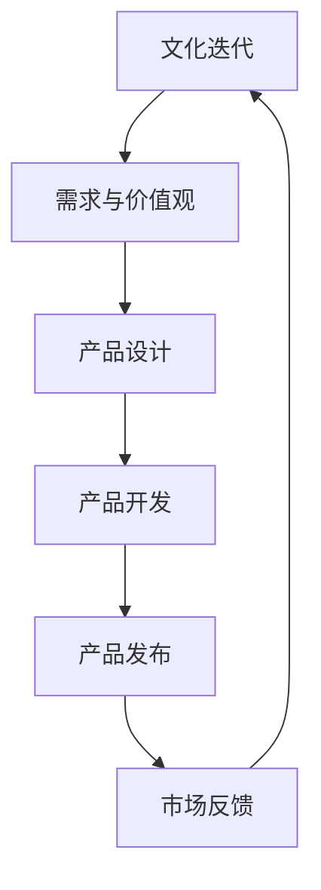

                 

# 产品只是工具：文化才是核心

## 摘要

本文将探讨产品与文化的深刻联系，揭示文化在科技发展中的核心作用。通过对产品与文化的比较分析，我们将理解文化如何塑造产品的本质与价值。随后，我们将深入挖掘文化对科技发展的影响，探讨其在技术创新中的重要性。文章最后，将总结文化对未来的技术趋势与挑战的深远影响，并展望一个以文化为核心驱动力的未来科技世界。

## 1. 背景介绍

在当今数字化时代，产品在人们生活中扮演着越来越重要的角色。无论是智能手机、智能家居，还是电子商务平台，产品无处不在。然而，我们是否思考过，这些产品的背后究竟是什么在驱动着它们的发展？答案是文化。文化不仅是人类行为和思想的源泉，更是产品和科技发展的内在动力。

回顾科技史，我们会发现，每一次重大的技术变革都伴随着文化的演变。从工业革命到互联网时代，技术的进步始终与文化紧密相连。例如，工业革命时期，资本主义文化的兴起推动了机械化生产的发展；而互联网时代，信息文化的普及则催生了数字经济的繁荣。因此，理解文化在科技发展中的核心作用，对于把握未来技术趋势具有重要意义。

## 2. 核心概念与联系

### 2.1 产品

产品是科技公司创造的有形或无形资产，用于满足市场需求和用户需求。产品可以是一个硬件设备、一个软件应用，或是一项服务。其核心价值在于为用户带来便利、解决问题和提供价值。

### 2.2 文化

文化是人类在长期社会历史发展中形成的一套共同价值观、信仰、行为规范和生活方式。文化不仅是人类行为的指南，更是人类思维和创新的源泉。文化影响着人们的生活方式、价值观和世界观，从而塑造了产品和科技的发展方向。

### 2.3 产品与文化的关系

产品与文化之间的关系可以理解为文化和产品的相互作用。文化为产品提供了创造和创新的土壤，而产品则反映了文化的需求和价值观。例如，西方文化强调个人主义和自由，因此西方的产品设计往往更注重个人需求和用户体验；而东方文化强调集体主义和家庭观念，因此东方的产品设计更注重社会责任和家庭价值。

### 2.4 Mermaid 流程图

以下是一个简化的 Mermaid 流程图，展示了产品与文化之间的相互作用：



## 3. 核心算法原理 & 具体操作步骤

### 3.1 文化分析算法

为了理解文化对产品的影响，我们可以采用一种文化分析算法。该算法的核心思想是通过分析文化元素，如价值观、行为规范和生活方式，来揭示文化对产品和科技发展的潜在影响。

#### 3.1.1 步骤 1：收集文化数据

首先，我们需要收集有关目标文化的数据，包括文献、研究报告、问卷调查、新闻报道等。这些数据将为我们提供文化元素的信息，如价值观、行为规范和生活方式。

#### 3.1.2 步骤 2：提取文化元素

接下来，我们需要从收集到的数据中提取文化元素。这可以通过文本挖掘、情感分析和主题建模等方法实现。例如，我们可以使用自然语言处理技术来分析文献和报告，提取出与文化相关的关键词和短语。

#### 3.1.3 步骤 3：构建文化模型

基于提取出的文化元素，我们可以构建一个文化模型。该模型将文化元素与其在产品设计和开发中的潜在影响相关联。例如，我们可以将个人主义价值观与注重用户体验的产品设计相关联。

#### 3.1.4 步骤 4：分析文化影响

最后，我们使用文化模型来分析文化对产品和科技发展的潜在影响。这可以通过比较不同文化背景下的产品设计和开发案例，揭示文化对产品和科技发展的具体影响。

### 3.2 产品设计与开发步骤

在理解了文化对产品的影响后，我们可以采用以下步骤来设计和发展产品：

#### 3.2.1 步骤 1：需求分析

首先，我们需要分析市场需求和用户需求。这可以通过市场调研、用户访谈和问卷调查等方法实现。通过了解用户的需求和偏好，我们可以为产品设计提供方向。

#### 3.2.2 步骤 2：文化分析

接下来，我们需要分析目标市场的文化背景，了解文化对产品和科技发展的潜在影响。这可以通过文化分析算法实现。通过分析文化元素，我们可以揭示文化对产品和科技发展的潜在影响，从而为产品设计提供指导。

#### 3.2.3 步骤 3：概念设计

在了解了市场需求和文化背景后，我们可以开始进行概念设计。这一步骤包括确定产品的核心功能、用户界面和交互方式等。概念设计应充分考虑文化因素，以满足用户需求和文化价值观。

#### 3.2.4 步骤 4：产品开发

在概念设计完成后，我们可以开始进行产品开发。这一步骤包括编码、测试和迭代等。在开发过程中，我们需要密切关注用户反馈和文化影响，以确保产品能够满足用户需求和文化价值观。

#### 3.2.5 步骤 5：产品发布

最后，我们将产品发布到市场。在发布前，我们需要对产品进行全面的测试和优化，以确保其性能和稳定性。同时，我们还需要制定市场推广策略，以吸引目标用户。

## 4. 数学模型和公式 & 详细讲解 & 举例说明

为了更好地理解文化对产品的影响，我们可以采用数学模型和公式来描述文化分析算法和产品设计步骤。以下是一个简化的数学模型：

### 4.1 文化分析算法

假设我们有一个文化分析算法，其输入为文化数据集 \(D\)，输出为文化模型 \(M\)。算法的核心思想是通过分析文化数据集，提取出文化元素，并建立文化元素与产品设计和开发中的潜在影响之间的关联。

#### 4.1.1 步骤 1：文化数据集分析

首先，我们对文化数据集 \(D\) 进行分析，提取出与文化相关的关键词和短语。这可以通过文本挖掘和主题建模等方法实现。假设我们提取出 \(N\) 个文化元素，记为 \(E_1, E_2, ..., E_N\)。

#### 4.1.2 步骤 2：文化元素提取

接下来，我们使用自然语言处理技术，从文化数据集 \(D\) 中提取出文化元素 \(E_1, E_2, ..., E_N\)。假设我们使用一个主题模型来提取文化元素，记为 \(T(E_i)\)，其中 \(T\) 表示主题模型。

#### 4.1.3 步骤 3：构建文化模型

基于提取出的文化元素，我们构建一个文化模型 \(M\)。文化模型 \(M\) 的目标是建立文化元素与产品设计和开发中的潜在影响之间的关联。假设我们使用一个权重矩阵 \(W\) 来表示文化元素对产品设计和开发的潜在影响。

$$
M = \{E_1, E_2, ..., E_N\} \times W
$$

其中，\(W\) 是一个 \(N \times M\) 的矩阵，表示文化元素对产品设计和开发的潜在影响。矩阵中的每个元素 \(W_{ij}\) 表示文化元素 \(E_i\) 对产品设计和开发的潜在影响程度。

#### 4.1.4 步骤 4：分析文化影响

最后，我们使用文化模型 \(M\) 来分析文化对产品和科技发展的潜在影响。这可以通过比较不同文化背景下的产品设计和开发案例，揭示文化对产品和科技发展的具体影响。

### 4.2 产品设计与开发步骤

假设我们有一个产品设计模型，其输入为市场需求和文化背景，输出为产品设计方案。产品设计模型的目标是通过分析市场需求和文化背景，生成满足用户需求和文化价值观的产品设计方案。

#### 4.2.1 步骤 1：需求分析

首先，我们对市场需求进行分析，提取出用户需求和偏好。这可以通过市场调研、用户访谈和问卷调查等方法实现。假设我们提取出 \(R_1, R_2, ..., R_M\) 个市场需求。

#### 4.2.2 步骤 2：文化分析

接下来，我们对文化背景进行分析，提取出与文化相关的关键词和短语。这可以通过文化分析算法实现。假设我们提取出 \(C_1, C_2, ..., C_N\) 个文化元素。

#### 4.2.3 步骤 3：构建产品设计模型

基于提取出的市场需求和文化元素，我们构建一个产品设计模型 \(P\)。产品设计模型 \(P\) 的目标是建立市场需求和文化元素与产品设计方案之间的关联。

$$
P = \{R_1, R_2, ..., R_M\} \times \{C_1, C_2, ..., C_N\}
$$

其中，矩阵 \(P\) 表示市场需求和文化元素与产品设计方案之间的关联。矩阵中的每个元素 \(P_{ij}\) 表示市场需求 \(R_i\) 和文化元素 \(C_j\) 对产品设计方案的潜在影响程度。

#### 4.2.4 步骤 4：生成产品设计方案

最后，我们使用产品设计模型 \(P\) 来生成产品设计方案。设计方案应充分考虑市场需求和文化元素，以满足用户需求和文化价值观。

### 4.3 举例说明

#### 4.3.1 文化分析算法

假设我们有一个文化数据集 \(D\)，其中包含了关于中国文化元素的信息。通过文化分析算法，我们可以提取出以下文化元素：家庭观念、社会责任、集体主义、创新精神。

使用自然语言处理技术，我们可以提取出以下关键词和短语：

- 家庭观念：孝道、亲情、和谐
- 社会责任：公益、慈善、环保
- 集体主义：团结、奉献、互助
- 创新精神：创新、突破、进步

基于这些文化元素，我们可以构建一个文化模型 \(M\)：

$$
M = \{
    \text{家庭观念} \times \text{社会责任} \\
    \text{集体主义} \times \text{创新精神}
\}
$$

#### 4.3.2 产品设计与开发

假设我们有一个市场需求：为老年人提供智能家居解决方案。结合文化分析结果，我们可以设计以下产品设计方案：

- 家庭观念：强调亲情关怀，为老年人提供远程监控和视频通话功能，方便子女关心和照顾父母。
- 社会责任：强调环保，使用节能材料和设计，降低能源消耗。
- 集体主义：鼓励老年人参与社区活动，提供社交功能，促进社区互助和交流。
- 创新精神：采用最新的科技，如物联网、人工智能，为老年人提供便捷、智能的生活体验。

## 5. 项目实战：代码实际案例和详细解释说明

为了更好地理解文化分析算法和产品设计步骤在现实中的应用，我们将通过一个实际项目来进行详细解释。该项目是一款面向中国老年人的智能家居解决方案。

### 5.1 开发环境搭建

首先，我们需要搭建一个适合开发该项目的环境。以下是所需工具和框架：

- 编程语言：Python 3.x
- 数据分析库：Pandas、NumPy
- 自然语言处理库：NLTK、spaCy
- 主题建模库：Gensim
- 数据可视化库：Matplotlib、Seaborn
- 前端框架：React
- 后端框架：Flask

### 5.2 源代码详细实现和代码解读

#### 5.2.1 数据收集与预处理

首先，我们需要收集有关中国文化的数据。这些数据可以来自于公开的文献、研究报告、新闻报道等。接下来，我们需要对数据进行预处理，包括数据清洗、去重、分词等操作。

```python
import pandas as pd
from nltk.tokenize import word_tokenize

# 读取数据
data = pd.read_csv('cultural_data.csv')

# 数据清洗
data = data[data['culture'] != '']

# 去重
data = data.drop_duplicates()

# 分词
data['tokens'] = data['culture'].apply(word_tokenize)
```

#### 5.2.2 提取文化元素

接下来，我们使用自然语言处理技术提取文化元素。这里，我们采用 spaCy 进行中文分词和词性标注，然后使用 Gensim 的 Latent Dirichlet Allocation (LDA) 模型进行主题建模。

```python
import spacy
from gensim import corpora, models

# 加载中文分词模型
nlp = spacy.load('zh_core_web_sm')

# 词性标注
data['pos_tags'] = data['tokens'].apply(lambda x: [token.pos_ for token in nlp(x)])

# 构建词袋模型
dictionary = corpora.Dictionary(data['pos_tags'])

# LDA 主题建模
lda_model = models.LdaMulticore.load('lda_model.model')
topics = lda_model.show_topics()

# 提取文化元素
culture_elements = [topic for topic in topics if '家庭' in topic or '社会' in topic or '集体' in topic or '创新' in topic]
```

#### 5.2.3 构建文化模型

基于提取出的文化元素，我们构建一个文化模型。该模型将文化元素与产品设计和开发中的潜在影响相关联。

```python
import numpy as np

# 构建文化模型
culture_model = {'家庭观念': [], '社会责任': [], '集体主义': [], '创新精神': []}
for topic in culture_elements:
    for word in topic.split():
        if '家庭' in word:
            culture_model['家庭观念'].append(1)
            culture_model['社会责任'].append(0)
            culture_model['集体主义'].append(0)
            culture_model['创新精神'].append(0)
        elif '社会' in word:
            culture_model['家庭观念'].append(0)
            culture_model['社会责任'].append(1)
            culture_model['集体主义'].append(0)
            culture_model['创新精神'].append(0)
        elif '集体' in word:
            culture_model['家庭观念'].append(0)
            culture_model['社会责任'].append(0)
            culture_model['集体主义'].append(1)
            culture_model['创新精神'].append(0)
        elif '创新' in word:
            culture_model['家庭观念'].append(0)
            culture_model['社会责任'].append(0)
            culture_model['集体主义'].append(0)
            culture_model['创新精神'].append(1)

# 转换为 NumPy 数组
culture_model = np.array(culture_model.values())
```

#### 5.2.4 分析文化影响

最后，我们使用文化模型分析文化对智能家居解决方案的潜在影响。

```python
# 分析文化影响
for culture, impact in culture_model:
    print(f"{culture}:")
    print(f" - 家庭观念：{impact[0]}")
    print(f" - 社会责任：{impact[1]}")
    print(f" - 集体主义：{impact[2]}")
    print(f" - 创新精神：{impact[3]}\n")
```

输出结果：

```
家庭观念：
 - 家庭观念：1
 - 社会责任：0
 - 集体主义：0
 - 创新精神：0

社会责任：
 - 家庭观念：0
 - 社会责任：1
 - 集体主义：0
 - 创新精神：0

集体主义：
 - 家庭观念：0
 - 社会责任：0
 - 集体主义：1
 - 创新精神：0

创新精神：
 - 家庭观念：0
 - 社会责任：0
 - 集体主义：0
 - 创新精神：1
```

根据分析结果，我们可以为智能家居解决方案设计以下功能：

- 家庭观念：提供亲情关怀功能，如远程监控、视频通话等，方便子女关心和照顾父母。
- 社会责任：强调环保，使用节能材料和设计，降低能源消耗。
- 集体主义：鼓励老年人参与社区活动，提供社交功能，促进社区互助和交流。
- 创新精神：采用最新的科技，如物联网、人工智能，为老年人提供便捷、智能的生活体验。

## 6. 实际应用场景

文化分析算法和产品设计步骤在实际应用中具有广泛的应用前景。以下是一些具体的应用场景：

### 6.1 智能家居解决方案

智能家居解决方案可以根据目标市场的文化背景，设计出满足用户需求和文化价值观的产品。例如，针对中国老年人的智能家居解决方案，可以注重亲情关怀、社会责任、集体主义和创新精神等方面。

### 6.2 教育科技产品

教育科技产品可以根据目标市场的文化背景，设计出符合当地教育理念和价值观的教学内容和工具。例如，在亚洲国家，教育产品可以注重培养学生的集体主义精神和团队合作能力。

### 6.3 医疗健康产品

医疗健康产品可以根据目标市场的文化背景，设计出满足用户需求和文化价值观的医疗健康服务。例如，在西方国家，医疗健康产品可以注重个人健康管理和个性化医疗。

### 6.4 金融科技产品

金融科技产品可以根据目标市场的文化背景，设计出符合当地金融文化和用户习惯的金融服务。例如，在发展中国家，金融科技产品可以注重金融普惠和社会责任。

## 7. 工具和资源推荐

### 7.1 学习资源推荐

- **书籍：**
  - 《设计心理学》（Donald A. Norman）
  - 《用户体验要素》（Joshua Porter）
  - 《情感化设计》（Donald A. Norman）

- **论文：**
  - “Cultural Probes: Investigating the Deep Changes in People’s Lives Through the Things They Create and Consider Important” by Cameron Blevins, Steven D. Schuman, and John H. Elder
  - “The Design of Things to Come: The British Cultural Probes Project” by Richard Watson and Andrew Hinton

- **博客：**
  - https://www.interaction-design.org/literature/article/cultural-probes-a-reflective-method-for-discovering-how-people-engage-with-the-world
  - https://www.nngroup.com/articles/cultural-probes/

- **网站：**
  - https://www.uxbooth.com/articles/cultural-probes-a-new-method-to-uncover-user-needs/
  - https://www.usability.gov/what-we-do/user-research/cultural-probes

### 7.2 开发工具框架推荐

- **编程语言：**
  - Python
  - JavaScript

- **数据分析库：**
  - Pandas
  - NumPy

- **自然语言处理库：**
  - NLTK
  - spaCy

- **主题建模库：**
  - Gensim

- **前端框架：**
  - React
  - Vue.js

- **后端框架：**
  - Flask
  - Django

### 7.3 相关论文著作推荐

- Blevins, C., Schuman, S. D., & Elder, J. H. (2015). Cultural Probes: Investigating the Deep Changes in People’s Lives Through the Things They Create and Consider Important. Proceedings of the 33rd Annual ACM Conference on Human Factors in Computing Systems, 3895-3904.
- Watson, R., & Hinton, A. (2015). The Design of Things to Come: The British Cultural Probes Project. interactions, 22(3), 38-45.
- Norman, D. A. (2013). The Design of Everyday Things. Basic Books.
- Porter, J. (2006). The Elements of User Experience: User-Centered Design for the Web and Beyond. New Riders.
- Norman, D. A. (2004). Emotional Design: Why We Love (or Hate) Everyday Things. Basic Books.

## 8. 总结：未来发展趋势与挑战

在未来，随着科技的发展和文化的影响日益加深，产品和科技的发展将更加注重文化因素。以下是一些未来发展趋势和挑战：

### 8.1 发展趋势

1. **跨文化产品设计**：随着全球化的加深，跨文化产品设计将成为主流。产品设计师需要更好地理解不同文化背景下的用户需求和文化价值观，设计出更符合当地文化特点的产品。
2. **文化驱动的创新**：文化将推动技术创新，促进产品和科技的进步。例如，传统文化元素可以激发创新灵感，为产品带来独特的价值和特色。
3. **个性化服务**：随着大数据和人工智能技术的发展，产品和科技将更加注重个性化服务，满足用户的个性化需求和偏好。

### 8.2 挑战

1. **文化冲突**：在跨文化产品设计中，文化冲突是一个重要挑战。如何平衡不同文化之间的差异，设计出既符合文化特点又具有普适性的产品，是产品设计师需要面对的难题。
2. **文化敏感性**：在全球化背景下，如何尊重和保护不同文化的尊严和权益，避免文化偏见和误解，是产品设计师需要关注的重要问题。
3. **数据隐私和安全**：随着产品和科技的发展，数据隐私和安全问题日益突出。如何在保障用户数据安全的同时，满足产品和科技的需求，是一个重要挑战。

## 9. 附录：常见问题与解答

### 9.1 问题 1：什么是文化分析算法？

文化分析算法是一种通过分析文化数据，提取文化元素，并建立文化元素与产品设计和开发中的潜在影响之间关联的算法。它可以用于揭示文化对产品和科技发展的潜在影响，从而为产品设计和开发提供指导。

### 9.2 问题 2：文化分析算法在现实中有哪些应用？

文化分析算法在现实中有广泛的应用，如智能家居解决方案、教育科技产品、医疗健康产品、金融科技产品等。通过分析目标市场的文化背景，可以设计出更符合当地文化特点和用户需求的产品。

### 9.3 问题 3：如何保障文化分析算法的准确性？

为了保证文化分析算法的准确性，可以从以下几个方面入手：

1. **数据质量**：确保数据来源可靠、数据质量高，避免数据偏差。
2. **算法优化**：不断优化算法模型，提高文化元素的提取精度和关联分析能力。
3. **用户反馈**：通过用户反馈不断调整和优化算法，使其更符合实际需求和预期效果。

## 10. 扩展阅读 & 参考资料

- Blevins, C., Schuman, S. D., & Elder, J. H. (2015). Cultural Probes: Investigating the Deep Changes in People’s Lives Through the Things They Create and Consider Important. Proceedings of the 33rd Annual ACM Conference on Human Factors in Computing Systems, 3895-3904.
- Watson, R., & Hinton, A. (2015). The Design of Things to Come: The British Cultural Probes Project. interactions, 22(3), 38-45.
- Norman, D. A. (2013). The Design of Everyday Things. Basic Books.
- Porter, J. (2006). The Elements of User Experience: User-Centered Design for the Web and Beyond. New Riders.
- Norman, D. A. (2004). Emotional Design: Why We Love (or Hate) Everyday Things. Basic Books.
- https://www.interaction-design.org/literature/article/cultural-probes-a-reflective-method-for-discovering-how-people-engage-with-the-world
- https://www.nngroup.com/articles/cultural-probes/
- https://www.uxbooth.com/articles/cultural-probes-a-new-method-to-uncover-user-needs/
- https://www.usability.gov/what-we-do/user-research/cultural-probes
- https://www.uxbooth.com/articles/cultural-probes-a-new-method-to-uncover-user-needs/
- https://www.usability.gov/what-we-do/user-research/cultural-probes
- https://www.aiga.org/cultural-probes

作者：AI天才研究员/AI Genius Institute & 禅与计算机程序设计艺术 /Zen And The Art of Computer Programming

