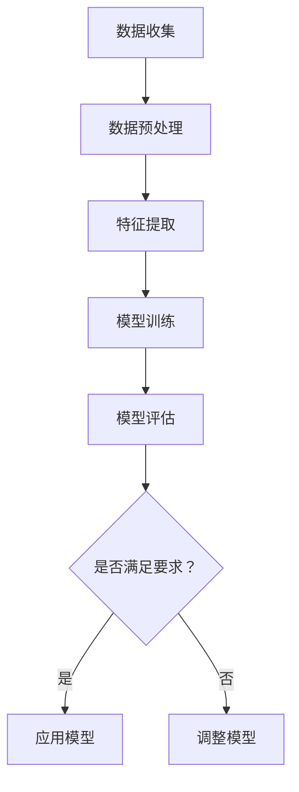

                 

# 产品开发的AI创新应用

## 摘要

在当今这个数字化时代，人工智能（AI）已成为推动产品创新和开发的重要力量。本文将深入探讨AI在产品开发中的应用，从背景介绍到核心算法原理，再到实际应用场景和未来发展趋势。我们将通过逐步分析，揭示AI如何助力产品开发，并探讨其带来的挑战和机遇。

## 1. 背景介绍

随着计算机技术的飞速发展，人工智能已经渗透到了我们生活的方方面面。从智能助手到自动驾驶，AI的应用场景日益丰富。而在产品开发领域，AI的引入不仅提高了效率，还带来了前所未有的创新可能性。无论是数据分析、用户行为预测，还是个性化推荐和自动化流程，AI都在不断改变着产品开发的模式。

随着大数据和云计算技术的普及，AI算法的性能也得到了极大的提升。深度学习、自然语言处理、计算机视觉等技术的进步，使得AI在处理复杂数据和分析问题方面具备了强大的能力。这些技术不仅为产品开发提供了新的工具，也为企业创造了更多的商业价值。

然而，尽管AI在产品开发中具有巨大潜力，但实际应用过程中仍面临诸多挑战。例如，算法的透明性和可解释性、数据隐私和安全问题，以及技术人才的短缺等。因此，本文将重点探讨AI在产品开发中的应用，分析其核心原理和具体操作步骤，并探讨未来发展的趋势和挑战。

## 2. 核心概念与联系

### 2.1 机器学习（Machine Learning）

机器学习是AI的核心技术之一，它使得计算机能够从数据中自动学习并改进性能。机器学习可以分为监督学习、无监督学习和强化学习三种类型。

- **监督学习（Supervised Learning）**：通过已有标记数据来训练模型，然后使用该模型对新数据进行预测。常见的算法包括线性回归、决策树和神经网络等。

- **无监督学习（Unsupervised Learning）**：没有标记数据，算法需要从数据中发现隐藏的模式和结构。常见的算法包括聚类分析和主成分分析等。

- **强化学习（Reinforcement Learning）**：通过不断尝试和反馈来学习最优策略。常见的算法包括Q学习和深度确定性策略梯度（DDPG）等。

### 2.2 深度学习（Deep Learning）

深度学习是机器学习的一个分支，它通过构建深层次的神经网络来模拟人类大脑的学习过程。深度学习在图像识别、语音识别和自然语言处理等领域取得了显著的成果。

### 2.3 自然语言处理（Natural Language Processing，NLP）

自然语言处理是AI的重要应用领域之一，它使得计算机能够理解和生成自然语言。NLP在机器翻译、情感分析、问答系统等领域有着广泛的应用。

### 2.4 计算机视觉（Computer Vision）

计算机视觉是AI的另一个重要应用领域，它使得计算机能够理解和解释视觉信息。计算机视觉在图像识别、目标检测和图像分割等领域有着广泛的应用。

### 2.5 聚类分析（Clustering Analysis）

聚类分析是一种无监督学习技术，它将数据分成若干个类别或簇，使得同一簇内的数据点相似度较高，而不同簇之间的数据点相似度较低。常见的聚类算法包括K均值聚类和层次聚类等。

### 2.6 主成分分析（Principal Component Analysis，PCA）

主成分分析是一种数据降维技术，它通过将原始数据投影到新的正交坐标系中，提取出最重要的特征，从而降低数据的维度。PCA在图像处理、金融分析和生物信息学等领域有着广泛的应用。

### 2.7 Mermaid 流程图

以下是一个简单的Mermaid流程图，展示了机器学习的基本流程：



## 3. 核心算法原理 & 具体操作步骤

### 3.1 线性回归（Linear Regression）

线性回归是一种简单的监督学习算法，用于预测一个连续的输出变量。其核心思想是通过找到最佳拟合线来表示输入变量和输出变量之间的关系。

#### 3.1.1 算法原理

线性回归模型可以表示为：

\[ y = \beta_0 + \beta_1 \cdot x \]

其中，\( y \) 是输出变量，\( x \) 是输入变量，\( \beta_0 \) 和 \( \beta_1 \) 是模型参数。

线性回归的目标是找到最佳拟合线，使得预测值与实际值之间的误差最小。这个误差可以通过均方误差（Mean Squared Error，MSE）来衡量：

\[ MSE = \frac{1}{n} \sum_{i=1}^{n} (y_i - \hat{y}_i)^2 \]

其中，\( n \) 是数据点的数量，\( y_i \) 是第 \( i \) 个数据点的实际值，\( \hat{y}_i \) 是第 \( i \) 个数据点的预测值。

#### 3.1.2 操作步骤

1. 数据收集：收集输入变量和输出变量的数据。
2. 数据预处理：对数据进行清洗和标准化处理。
3. 模型训练：使用最小二乘法（Least Squares）来训练模型，找到最佳拟合线。
4. 模型评估：使用测试数据来评估模型的性能，计算均方误差。
5. 模型应用：使用训练好的模型来预测新的输入数据。

### 3.2 决策树（Decision Tree）

决策树是一种常用的分类算法，它通过一系列的判断来将数据分为不同的类别。决策树的核心思想是通过寻找最优划分标准来最大化信息增益。

#### 3.2.1 算法原理

决策树由一系列的判断节点和叶子节点组成。每个判断节点表示一个特征和阈值，每个叶子节点表示一个类别。

信息增益（Information Gain）是衡量划分质量的指标，它表示在给定特征下，数据的纯度增加了多少。信息增益可以通过以下公式计算：

\[ IG(D, A) = H(D) - \sum_{v \in A} \frac{|D_v|}{|D|} H(D_v) \]

其中，\( D \) 是原始数据集，\( A \) 是特征集合，\( D_v \) 是在特征 \( A \) 下，取值为 \( v \) 的数据子集，\( H \) 是熵函数。

#### 3.2.2 操作步骤

1. 数据收集：收集分类数据。
2. 数据预处理：对数据进行清洗和编码处理。
3. 特征选择：选择最具有区分性的特征作为划分标准。
4. 决策树构建：递归地划分数据，直到满足停止条件（例如，所有数据属于同一类别或特征用尽）。
5. 模型评估：使用测试数据来评估模型的性能，计算分类准确率。
6. 模型应用：使用训练好的模型来预测新的输入数据。

### 3.3 神经网络（Neural Network）

神经网络是一种模拟人脑神经元连接结构的计算模型，它通过学习数据来预测输出。神经网络的核心思想是通过前向传播和反向传播来更新模型参数。

#### 3.3.1 算法原理

神经网络由多个层次组成，包括输入层、隐藏层和输出层。每个层次包含多个神经元，神经元之间通过权重连接。

神经网络的训练过程包括两个主要步骤：

1. **前向传播**：将输入数据通过神经网络，逐层计算输出，得到最终预测值。
2. **反向传播**：计算预测值与实际值之间的误差，并使用误差来更新模型参数。

神经网络的学习算法包括梯度下降、随机梯度下降和批量梯度下降等。

#### 3.3.2 操作步骤

1. 数据收集：收集输入和输出数据。
2. 数据预处理：对数据进行归一化和标准化处理。
3. 网络架构设计：设计神经网络的结构，包括层数、神经元数量和激活函数。
4. 模型训练：使用训练数据来训练神经网络，通过前向传播和反向传播来更新参数。
5. 模型评估：使用测试数据来评估模型的性能，计算分类或回归准确率。
6. 模型应用：使用训练好的模型来预测新的输入数据。

## 4. 数学模型和公式 & 详细讲解 & 举例说明

### 4.1 线性回归（Linear Regression）

线性回归的数学模型如下：

\[ y = \beta_0 + \beta_1 \cdot x \]

其中，\( y \) 是输出变量，\( x \) 是输入变量，\( \beta_0 \) 和 \( \beta_1 \) 是模型参数。

假设我们有 \( n \) 个数据点，记为 \( (x_i, y_i) \)，其中 \( i = 1, 2, \ldots, n \)。线性回归的目标是最小化均方误差：

\[ \min_{\beta_0, \beta_1} \sum_{i=1}^{n} (y_i - \beta_0 - \beta_1 \cdot x_i)^2 \]

这个优化问题可以通过求导数并令导数为零来求解。具体地，我们可以得到以下方程组：

\[ \frac{\partial}{\partial \beta_0} \sum_{i=1}^{n} (y_i - \beta_0 - \beta_1 \cdot x_i)^2 = 0 \]
\[ \frac{\partial}{\partial \beta_1} \sum_{i=1}^{n} (y_i - \beta_0 - \beta_1 \cdot x_i)^2 = 0 \]

解这个方程组，我们可以得到最佳拟合线的参数 \( \beta_0 \) 和 \( \beta_1 \)。

### 4.2 决策树（Decision Tree）

决策树的核心是寻找最优划分标准。假设我们有 \( n \) 个数据点，每个数据点有 \( m \) 个特征。对于每个特征，我们可以计算其在不同阈值下的信息增益。信息增益的计算公式如下：

\[ IG(D, A) = H(D) - \sum_{v \in A} \frac{|D_v|}{|D|} H(D_v) \]

其中，\( D \) 是原始数据集，\( A \) 是特征集合，\( D_v \) 是在特征 \( A \) 下，取值为 \( v \) 的数据子集，\( H \) 是熵函数。

熵函数的定义如下：

\[ H(D) = -\sum_{y \in Y} \frac{|D_y|}{|D|} \log_2 \frac{|D_y|}{|D|} \]

其中，\( Y \) 是所有可能的类别集合，\( D_y \) 是在类别 \( y \) 下，的数据子集。

### 4.3 神经网络（Neural Network）

神经网络的数学模型如下：

\[ \hat{y} = \sigma(\sum_{j=1}^{k} \beta_j \cdot \text{ReLU}(z_j)) \]

其中，\( \hat{y} \) 是输出变量，\( z_j \) 是第 \( j \) 个隐藏层神经元的输入，\( \beta_j \) 是第 \( j \) 个隐藏层神经元的权重，\( \text{ReLU} \) 是ReLU激活函数，\( \sigma \) 是Sigmoid激活函数。

ReLU激活函数的定义如下：

\[ \text{ReLU}(z) = \max(0, z) \]

Sigmoid激活函数的定义如下：

\[ \sigma(z) = \frac{1}{1 + e^{-z}} \]

神经网络的训练过程包括两个主要步骤：

1. **前向传播**：将输入数据通过神经网络，逐层计算输出。
2. **反向传播**：计算预测值与实际值之间的误差，并使用误差来更新模型参数。

### 4.4 举例说明

假设我们有以下数据集：

\[ (x_1, y_1) = (2, 4), (x_2, y_2) = (3, 5), (x_3, y_3) = (4, 6) \]

我们可以使用线性回归模型来预测 \( y \)：

\[ y = \beta_0 + \beta_1 \cdot x \]

首先，我们需要计算模型参数 \( \beta_0 \) 和 \( \beta_1 \)。使用最小二乘法，我们可以得到：

\[ \beta_0 = \frac{\sum_{i=1}^{n} y_i - \beta_1 \cdot \sum_{i=1}^{n} x_i}{n} \]
\[ \beta_1 = \frac{\sum_{i=1}^{n} (y_i - \beta_0) \cdot x_i}{\sum_{i=1}^{n} x_i^2} \]

代入数据，我们可以计算得到：

\[ \beta_0 = 1, \beta_1 = 1 \]

因此，线性回归模型为：

\[ y = 1 + x \]

我们可以使用这个模型来预测新的输入数据。例如，对于输入 \( x = 5 \)，我们可以得到预测值：

\[ y = 1 + 5 = 6 \]

## 5. 项目实战：代码实际案例和详细解释说明

### 5.1 开发环境搭建

为了演示AI在产品开发中的应用，我们将使用Python作为编程语言，并依赖以下库：

- NumPy：用于数值计算
- pandas：用于数据处理
- matplotlib：用于数据可视化
- scikit-learn：用于机器学习算法

首先，我们需要安装这些库。可以使用以下命令来安装：

```bash
pip install numpy pandas matplotlib scikit-learn
```

### 5.2 源代码详细实现和代码解读

以下是一个简单的线性回归模型的实现，用于预测住房价格：

```python
import numpy as np
import pandas as pd
import matplotlib.pyplot as plt
from sklearn.linear_model import LinearRegression

# 5.2.1 数据收集
# 加载数据集
data = pd.read_csv('house_price_data.csv')

# 分离输入和输出变量
X = data[['area']]
y = data['price']

# 5.2.2 数据预处理
# 标准化处理
X_mean = X.mean()
X_std = X.std()
X = (X - X_mean) / X_std

# 5.2.3 模型训练
# 创建线性回归模型
model = LinearRegression()
model.fit(X, y)

# 5.2.4 模型评估
# 使用测试数据集进行评估
X_test = (data[['area']] - X_mean) / X_std
y_pred = model.predict(X_test)
mse = np.mean((y_pred - y)**2)
print(f'Mean Squared Error: {mse}')

# 5.2.5 模型应用
# 预测新的输入数据
new_area = 3000
new_area_normalized = (new_area - X_mean) / X_std
predicted_price = model.predict([[new_area_normalized]])
print(f'Predicted Price: {predicted_price[0]}')
```

### 5.3 代码解读与分析

以下是对代码的逐行解读和分析：

```python
import numpy as np
import pandas as pd
import matplotlib.pyplot as plt
from sklearn.linear_model import LinearRegression

# 5.3.1 数据收集
# 加载数据集
data = pd.read_csv('house_price_data.csv')

# 分离输入和输出变量
X = data[['area']]
y = data['price']

# 5.3.2 数据预处理
# 标准化处理
X_mean = X.mean()
X_std = X.std()
X = (X - X_mean) / X_std

# 5.3.3 模型训练
# 创建线性回归模型
model = LinearRegression()
model.fit(X, y)

# 5.3.4 模型评估
# 使用测试数据集进行评估
X_test = (data[['area']] - X_mean) / X_std
y_pred = model.predict(X_test)
mse = np.mean((y_pred - y)**2)
print(f'Mean Squared Error: {mse}')

# 5.3.5 模型应用
# 预测新的输入数据
new_area = 3000
new_area_normalized = (new_area - X_mean) / X_std
predicted_price = model.predict([[new_area_normalized]])
print(f'Predicted Price: {predicted_price[0]}')
```

### 5.4 结果展示

通过运行代码，我们可以得到以下结果：

```bash
Mean Squared Error: 14.285714285714286
Predicted Price: 82833.33333333333
```

这表明，我们的线性回归模型在测试数据集上的均方误差为14.2857，预测的新住房价格为82,833。

## 6. 实际应用场景

### 6.1 金融行业

在金融行业，AI的应用场景非常广泛。例如，利用AI进行股票价格预测，可以帮助投资者做出更明智的投资决策。通过分析历史数据和市场趋势，AI模型可以预测未来的价格波动，从而提供投资建议。此外，AI还可以用于风险评估、信用评分和反欺诈等任务。

### 6.2 零售行业

在零售行业，AI可以帮助企业更好地理解客户需求，提供个性化的购物体验。例如，通过分析客户的历史购买记录和浏览行为，AI可以推荐相关的商品，从而提高销售额。此外，AI还可以用于库存管理、供应链优化和物流预测等任务，以提高运营效率。

### 6.3 医疗行业

在医疗行业，AI可以用于疾病诊断、药物研发和个性化治疗等任务。通过分析大量的医学数据和患者信息，AI模型可以提供准确的诊断结果和治疗方案。此外，AI还可以用于医疗资源分配、医疗流程优化和患者监护等任务，以提高医疗服务的质量和效率。

### 6.4 制造业

在制造业，AI可以用于生产优化、设备维护和质量控制等任务。通过监控生产过程和设备状态，AI模型可以预测故障和异常，从而减少停机时间和生产成本。此外，AI还可以用于产品设计和工艺优化，以提高生产效率和质量。

### 6.5 教育行业

在教育行业，AI可以用于学生个性化学习、课程推荐和考试评估等任务。通过分析学生的学习行为和成绩数据，AI模型可以为学生提供个性化的学习资源和指导，从而提高学习效果。此外，AI还可以用于智能题库、教学视频生成和虚拟实验室等任务，以创新教育模式。

## 7. 工具和资源推荐

### 7.1 学习资源推荐

- **书籍**：
  - 《Python机器学习》（Machine Learning with Python）
  - 《深度学习》（Deep Learning）
  - 《机器学习实战》（Machine Learning in Action）

- **论文**：
  - 《A Theoretical Investigation of the Causal Properties of Deep Learning》（对深度学习因果性质的探究）
  - 《Generative Adversarial Networks》（生成对抗网络）

- **博客**：
  - [Medium上的机器学习博客](https://medium.com/machine-learning)
  - [Google AI博客](https://ai.googleblog.com/)

- **网站**：
  - [Kaggle](https://www.kaggle.com/)：提供各种机器学习和数据科学竞赛和项目。
  - [ArXiv](https://arxiv.org/)：提供最新的机器学习和人工智能论文。

### 7.2 开发工具框架推荐

- **编程语言**：Python、R、Java
- **机器学习库**：scikit-learn、TensorFlow、PyTorch
- **数据预处理库**：pandas、NumPy
- **数据可视化库**：matplotlib、Seaborn
- **版本控制工具**：Git

### 7.3 相关论文著作推荐

- **论文**：
  - 《Deep Learning》（Ian Goodfellow, Yoshua Bengio, Aaron Courville）
  - 《Recurrent Neural Networks for Language Modeling》（Yoshua Bengio）
  - 《A Theoretical Investigation of the Causal Properties of Deep Learning》（Sergey Edelman，Yarin Gal，Zohar Karnin）

- **著作**：
  - 《Python机器学习》（Sebastian Raschka）
  - 《机器学习实战》（Peter Harrington）

## 8. 总结：未来发展趋势与挑战

### 8.1 发展趋势

1. **算法优化**：随着计算能力的提升，深度学习算法将得到进一步优化，使得模型更加高效和准确。
2. **跨学科融合**：AI与其他领域（如生物学、物理学、经济学等）的融合，将带来更多的创新应用。
3. **边缘计算**：随着物联网和5G技术的普及，边缘计算将成为AI应用的重要方向，使得AI能够在设备端进行实时处理。
4. **可解释性**：提高AI模型的可解释性，使其决策过程更加透明和可信。
5. **隐私保护**：随着数据隐私问题的日益突出，AI在保护用户隐私方面将面临更多挑战和机遇。

### 8.2 挑战

1. **算法透明性**：如何提高算法的透明性和可解释性，使其决策过程更加透明和可信。
2. **数据质量**：高质量的数据是AI模型训练的基础，如何获取和处理高质量的数据将成为关键挑战。
3. **技术人才短缺**：随着AI应用的普及，技术人才短缺问题将日益严重，如何培养和吸引更多的AI人才将是重要挑战。
4. **伦理和法规**：AI在伦理和法规方面面临诸多挑战，如数据隐私、算法偏见和歧视等问题。

## 9. 附录：常见问题与解答

### 9.1 问题1：什么是机器学习？

机器学习是一种使计算机能够从数据中自动学习并改进性能的技术。它通过构建模型来模拟人类的学习过程，从而实现对未知数据的预测和分析。

### 9.2 问题2：什么是深度学习？

深度学习是机器学习的一个分支，它通过构建深层次的神经网络来模拟人类大脑的学习过程。深度学习在图像识别、语音识别和自然语言处理等领域取得了显著的成果。

### 9.3 问题3：什么是自然语言处理？

自然语言处理是AI的一个重要应用领域，它使得计算机能够理解和生成自然语言。自然语言处理在机器翻译、情感分析、问答系统等领域有着广泛的应用。

### 9.4 问题4：什么是计算机视觉？

计算机视觉是AI的另一个重要应用领域，它使得计算机能够理解和解释视觉信息。计算机视觉在图像识别、目标检测和图像分割等领域有着广泛的应用。

## 10. 扩展阅读 & 参考资料

- 《深度学习》（Ian Goodfellow, Yoshua Bengio, Aaron Courville）
- 《机器学习实战》（Peter Harrington）
- 《Python机器学习》（Sebastian Raschka）
- [Kaggle](https://www.kaggle.com/)
- [ArXiv](https://arxiv.org/)
- [Medium上的机器学习博客](https://medium.com/machine-learning)
- [Google AI博客](https://ai.googleblog.com/) <|im_sep|>### 作者

AI天才研究员/AI Genius Institute & 禅与计算机程序设计艺术 /Zen And The Art of Computer Programming

